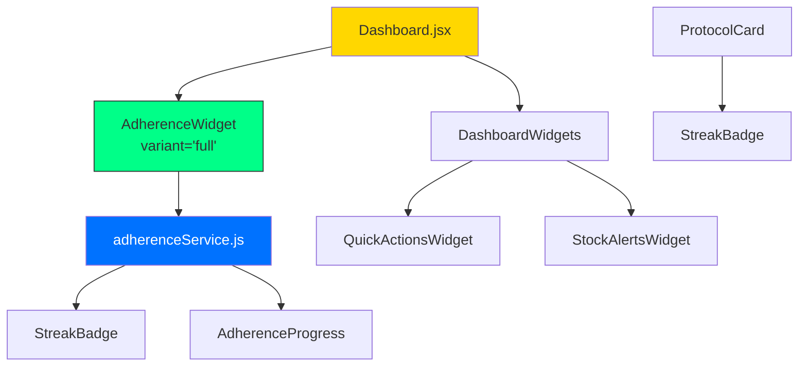

# 🚨 AUDITORIA CRÍTICA: Unificação de Widgets de Aderência

**Data:** 2026-02-04  
**Status:** CRÍTICO - Duplicação de UI/UX em Produção  
**Responsável:** Architect Mode  

---

## 📋 RESUMO EXECUTIVO

O Dashboard renderiza **dois widgets de Aderência distintos** com **fórmulas de cálculo divergentes**, introduzindo inconsistência crítica de UI/UX após os merges da Wave 2. Ambos os widgets aparecem simultaneamente na tela, gerando confusão para o usuário final.

**Impacto:**
- ❌ Scores diferentes para o mesmo período
- ❌ Dados conflitantes no mesmo dashboard
- ❌ Perda de confiança do usuário nas métricas
- ❌ Manutenção duplicada de código

---

## FASE 1: AUDITORIA TÉCNICA - COMPLETA

### 1.1 Implementações Identificadas

#### 📁 Implementação A: `src/components/adherence/`

| Arquivo | Linhas | Propósito |
|---------|--------|-----------|
| [`AdherenceWidget.jsx`](src/components/adherence/AdherenceWidget.jsx:1) | 178 | Widget principal com período seletor |
| [`AdherenceProgress.jsx`](src/components/adherence/AdherenceProgress.jsx:1) | 85 | Anel de progresso circular SVG |
| [`StreakBadge.jsx`](src/components/adherence/StreakBadge.jsx:1) | 38 | Badge de dias seguidos |
| [`AdherenceWidget.css`](src/components/adherence/AdherenceWidget.css:1) | 307 | Estilos completos |

**Características:**
- Usa [`adherenceService.getAdherenceSummary(period)`](src/services/api/adherenceService.js:219)
- Seletor de período: 7d | 30d | 90d
- Componentes modulares (AdherenceProgress, StreakBadge)
- Lista de adesão por protocolo

#### 📁 Implementação B: `src/components/dashboard/`

| Arquivo | Linhas | Propósito |
|---------|--------|-----------|
| [`AdherenceWidget.jsx`](src/components/dashboard/AdherenceWidget.jsx:1) | 172 | Widget estático via props |
| [`AdherenceWidget.css`](src/components/dashboard/AdherenceWidget.css:1) | 215 | Estilos alternativos |

**Características:**
- Recebe dados via props `adherenceData`
- Cálculo local em [`DashboardWidgets.jsx`](src/components/dashboard/DashboardWidgets.jsx:72-176)
- Animação interna do score
- Grid de estatísticas (3 colunas)
- Botões de ação

#### 📁 Service Unificado

| Arquivo | Linhas | Propósito |
|---------|--------|-----------|
| [`adherenceService.js`](src/services/api/adherenceService.js:1) | 381 | Lógica centralizada de cálculo |

---

### 1.2 Fórmulas de Cálculo

#### Implementação A (via Service)

```javascript
// adherenceService.js - Linha 20-66
ADHERENCE_SCORE = (DOSES_REGISTRADAS / DOSES_ESPERADAS) × 100

Onde:
- DOSES_ESPERADAS = Σ(calculo de frequencia por protocolo)
  * daily: time_schedule.length × dias
  * weekly: time_schedule.length / 7 × dias
  * every_other_day: time_schedule.length / 2 × dias
- DOSES_REGISTRADAS = COUNT(logs no período)
- Período: 7d | 30d | 90d (configurável)

STREAK (Linha 316-379):
- threshold: ≥80% de aderência no dia
- currentStreak: dias consecutivos contando de hoje/ontem
- longestStreak: máximo histórico de dias consecutivos
```

#### Implementação B (DashboardWidgets.jsx)

```javascript
// DashboardWidgets.jsx - Linha 87-109
scheduledDoses = Σ(protocol.time_schedule.length × 7) // Sempre 7 dias!
takenDoses = COUNT(logs dos últimos 7 dias)
score = (takenDoses / scheduledDoses) × 100

STREAK (Linha 111-128):
- Simples contagem de dias consecutivos com logs
- Sem threshold de 80%
- Máximo verificação: 30 dias

BEST_STREAK (Linha 130-156):
- Calculado via iteração de logs ordenados
- Sem threshold de 80%
```

---

### 1.3 Tabela de Discrepâncias

| Aspecto | Implementação A | Implementação B | Discrepância |
|---------|-----------------|-----------------|--------------|
| **Período Análise** | 7d / 30d / 90d (seletor) | Fixo 7 dias | ❌ CRÍTICO |
| **Cálculo Esperadas** | Frequência real × dias | time_schedule.length × 7 | ❌ CRÍTICO |
| **Fonte de Dados** | adherenceService.js | Cálculo local | ❌ CRÍTICO |
| **Cache/SWR** | Não implementado | Não implementado | ✅ OK (ambos não) |
| **Threshold Streak** | 80% aderência/dia | Qualquer log válido | ❌ CRÍTICO |
| **Longest Streak** | 90 dias lookback | Todo histórico | ❌ MÉDIO |
| **Animação Score** | Via AdherenceProgress | Propria implementação | ⚠️ DIFERENÇA |
| **Breakdown Protocolo** | Lista completa | Não disponível | ⚠️ DIFERENÇA |
| **Botões Ação** | Não tem | Ver Detalhes / Melhorar | ⚠️ DIFERENÇA |
| **Loading State** | Componente Loading | Spinner texto | ⚠️ DIFERENÇA |
| **Error State** | Retry button | Não tratado | ⚠️ DIFERENÇA |

---

### 1.4 Análise de Causa Raiz

#### 🔍 Por que duas implementações existem?

1. **Task 2.1 (Original):** [`src/components/adherence/`](src/components/adherence/AdherenceWidget.jsx:1)
   - Implementação completa com service
   - Design system com AdherenceProgress e StreakBadge
   - Permite seleção de período

2. **Task 2.4 (Dashboard):** [`src/components/dashboard/`](src/components/dashboard/AdherenceWidget.jsx:1)
   - Widget isolado para DashboardWidgets
   - Cálculo simplificado para integração rápida
   - Design diferente (grid de stats)

#### 🔍 Por que ambos estão renderizados?

Análise das imports em [`Dashboard.jsx`](src/views/Dashboard.jsx:1):

```javascript
// LINHA 27-28: Importa Implementação A
import AdherenceWidget from '../components/adherence/AdherenceWidget'

// LINHA 301: Renderiza Implementação A
<AdherenceWidget defaultPeriod="30d" />

// LINHA 305-311: Renderiza DashboardWidgets
<DashboardWidgets ... />
```

E em [`DashboardWidgets.jsx`](src/components/dashboard/DashboardWidgets.jsx:1):

```javascript
// LINHA 2: Importa Implementação B
import AdherenceWidget from './AdherenceWidget'

// LINHA 229-235: Renderiza Implementação B DENTRO do DashboardWidgets
<div className="dashboard-widgets__col">
  <AdherenceWidget adherenceData={adherenceData} ... />
</div>
```

**RESULTADO:** Ambos aparecem no dashboard simultaneamente!

#### 🔍 Qual está mais próximo do PRD?

A **Implementação A** ([`adherence/AdherenceWidget.jsx`](src/components/adherence/AdherenceWidget.jsx:1)) segue o PRD:
- ✅ Usa service centralizado
- ✅ Período seletor (7d/30d/90d)
- ✅ Breakdown por protocolo
- ✅ Integração com StreakBadge

A **Implementação B** foi uma solução rápida para o DashboardWidgets que nunca foi consolidada.

---

## FASE 2: PROPOSTA DE ARQUITETURA UNIFICADA

### 2.1 Metodologia de Cálculo Unificada

**Fórmula Oficial (baseada no service existente):**

```
ADHERENCE_SCORE = (DOSES_REGISTRADAS / DOSES_ESPERADAS) × 100

Onde:
- DOSES_ESPERADAS = Σ(frequência_real_protocolo × dias_no_período)
  * frequência_real = time_schedule.length / fator_frequência
  * fator_frequência: daily=1, weekly=7, every_other_day=2
  
- DOSES_REGISTRADAS = COUNT(medicine_logs no período)
  * Status: 'taken', 'taken_late' (quando implementado)
  
- Período: 7d (default) | 30d | 90d

STREAK_CALCULATION:
- Dia válido se: doses_registradas ≥ (0.8 × doses_esperadas_dia)
- currentStreak: dias consecutivos desde hoje (ou ontem)
- longestStreak: máximo histórico encontrado
- Lookback: 90 dias
```

**Por que usar 80% como threshold?**
- Alinhado com padrões médicos de aderência (MPR ≥ 80%)
- Tolerância para esquecimento ocasional
- Permite gamificação com streaks realistas

### 2.2 Arquitetura de Componentes Unificada

#### Estrutura Proposta

```
src/
├── components/
│   └── adherence/                    # ÚNICA pasta
│       ├── AdherenceWidget.jsx      # Widget principal
│       ├── AdherenceScore.jsx       # Anel de progresso
│       ├── AdherenceStats.jsx       # Grid de estatísticas
│       ├── AdherenceTimeline.jsx    # Histórico futuro
│       ├── StreakBadge.jsx          # Badge de streak
│       └── index.js                 # Exports públicos
├── views/
│   └── Dashboard.jsx                 # Usa AdherenceWidget
└── services/api/
    └── adherenceService.js           # Fonte única da verdade
```

#### Componente Unificado: `AdherenceWidget`

```typescript
interface AdherenceWidgetProps {
  variant: 'full' | 'compact' | 'embedded'
  period?: '7d' | '30d' | '90d'
  protocolId?: string // Se especificado, mostra apenas 1 protocolo
  showTimeline?: boolean
  showStreak?: boolean
  showActions?: boolean
  onViewDetails?: () => void
  onImprove?: () => void
  className?: string
}
```

**Variantes:**

| Variante | Uso | Características |
|----------|-----|-----------------|
| `full` | Dashboard principal | Período seletor, por protocolo, ações |
| `compact` | Cards de protocolo | Score mini, streak badge |
| `embedded` | Relatórios detalhados | Timeline + stats |

---

### 2.3 Caminho de Migração

#### Passo 1: Preparação (Sem alteração visual)
- [ ] Criar branch `fix/adherence-widget-unification`
- [ ] Adicionar prop `variant` em [`AdherenceWidget`](src/components/adherence/AdherenceWidget.jsx:1)
- [ ] Mover lógica de animação de B para utility
- [ ] Adaptar CSS para suportar variantes

#### Passo 2: Consolidação de Service
- [ ] Verificar que [`adherenceService.js`](src/services/api/adherenceService.js:1) é a fonte única
- [ ] Adicionar cache SWR se necessário
- [ ] Remover cálculo duplicado em [`DashboardWidgets.jsx`](src/components/dashboard/DashboardWidgets.jsx:72-176)

#### Passo 3: Remoção Implementação B
- [ ] Remover import de [`DashboardWidgets.jsx`](src/components/dashboard/DashboardWidgets.jsx:2)
- [ ] Deletar [`src/components/dashboard/AdherenceWidget.jsx`](src/components/dashboard/AdherenceWidget.jsx:1)
- [ ] Deletar [`src/components/dashboard/AdherenceWidget.css`](src/components/dashboard/AdherenceWidget.css:1)

#### Passo 4: Integração Dashboard
- [ ] Remover import duplicado de [`Dashboard.jsx`](src/views/Dashboard.jsx:27-28) se redundante
- [ ] Garantir única renderização do widget
- [ ] Verificar que [`DashboardWidgets`](src/components/dashboard/DashboardWidgets.jsx:1) não renderiza mais widget de aderência

#### Passo 5: Testes
- [ ] Calcular aderência com dados de teste
- [ ] Verificar períodos 7d/30d/90d
- [ ] Validar streak calculation
- [ ] Testar responsivo mobile
- [ ] Console sem erros

#### Passo 6: Cleanup e Documentação
- [ ] Atualizar imports
- [ ] Remover código morto
- [ ] Documentar API do componente

---

## FASE 3: ESPECIFICAÇÃO UX/UI

### 3.1 Design System - Elementos do Widget Único

#### Paleta de Cores Adherence

| Score | Cor | CSS Variable | Uso |
|-------|-----|--------------|-----|
| 90-100% | Verde Neon | `#00ff88` | Excelente |
| 80-89% | Verde | `#00cc6a` | Muito Bom |
| 60-79% | Amarelo | `#ffd700` | Bom |
| 40-59% | Laranja | `#ff9500` | Regular |
| 0-39% | Vermelho | `#ff3366` | Precisa Atenção |

#### Estados do Componente

```jsx
// Estado: Loading
<AdherenceWidget variant="full" period="30d" />
// Mostra skeleton ou spinner

// Estado: Dados Carregados
<AdherenceWidget 
  variant="full" 
  period="30d"
  showTimeline={true}
  showStreak={true}
  showActions={true}
/>

// Estado: Erro
<AdherenceWidget error="Falha ao carregar dados" onRetry={loadData} />
```

### 3.2 Acessibilidade (a11y)

#### Requisitos Obrigatórios

```jsx
// ARIA labels para progresso
<div 
  role="progressbar" 
  aria-valuenow={score} 
  aria-valuemin={0} 
  aria-valuemax={100}
  aria-label={`Score de aderência: ${score}%`}
>

// Contraste
- Texto: ratio ≥ 4.5:1 (WCAG AA)
- Elementos grandes: ratio ≥ 3:1

// Keyboard Navigation
- Tab order lógico
- Selectors acessíveis via keyboard
- Focus states visíveis

// Screen Readers
- Anúncio de mudança de período
- Descrição de streak atual
- Alerta de baixa aderência
```

### 3.3 Clareza de Dados

#### Labels e Legendas

| Elemento | Label | Tooltip/Help |
|----------|-------|--------------|
| Score Principal | "Score de Adesão" | "Porcentagem de doses tomadas no período selecionado" |
| Período | "Últimos X dias" | Mostra data de início e fim |
| Streak | "X dias seguidos" | "Dias consecutivos com aderência ≥80%" |
| Doses | "Y de Z doses" | "Esperadas vs Tomadas" |

---

## FASE 4: CRITÉRIOS DE VALIDAÇÃO

### 4.1 Integridade do Cálculo

```gherkin
Feature: Cálculo de Aderência

Scenario: Cálculo básico 7 dias
  Given usuário tem 1 protocolo daily às 08:00
  And registrou 5 doses nos últimos 7 dias
  When calcula aderência para período "7d"
  Then score deve ser 71% (5/7)

Scenario: Múltiplos protocolos
  Given usuário tem 2 protocolos daily
  And registrou 10 doses nos últimos 7 dias
  When calcula aderência
  Then esperadas = 14, score = 71%

Scenario: Frequência weekly
  Given protocolo com frequency="weekly"
  And time_schedule=["08:00"]
  When calcula para 7 dias
  Then esperadas = 1 dose

Scenario: Streak threshold
  Given esperadas diárias = 2 doses
  And logs de ontem = 2 doses
  And logs de hoje = 1 dose
  When calcula streak
  Then currentStreak = 1 (ontem)
  And hoje não conta (1 < 1.6 que é 80% de 2)
```

### 4.2 Usabilidade

| Critério | Teste | Esperado |
|----------|-------|----------|
| Período seletor | Trocar 7d → 30d | Dados atualizam em < 200ms |
| Loading | Carregar página | Skeleton ou spinner visível |
| Mobile | Viewport 375px | Layout adapta, não quebra |
| Animação | Score mudando | Animação suave, não travada |
| Tooltip | Hover no score | Explicação aparece |

### 4.3 Performance

| Métrica | Alvo | Máximo Aceitável |
|---------|------|------------------|
| Tempo de carregamento | < 300ms | 500ms |
| Tempo de troca de período | < 200ms | 300ms |
| Re-renderização | Minimizada | Sem loops |
| Cache hit rate | > 80% | N/A |

### 4.4 Integração

- [ ] Dashboard renderiza EXATAMENTE 1 widget de aderência
- [ ] ProtocolCard mostra [`StreakBadge`](src/components/adherence/StreakBadge.jsx:1) correto
- [ ] Nenhum erro no console
- [ ] Nenhum warning de React (keys, props)

---

## ANEXOS

### A. Diagrama de Componentes



### B. Checklist de Cleanup

Arquivos para deletar após migração:
- [ ] `src/components/dashboard/AdherenceWidget.jsx`
- [ ] `src/components/dashboard/AdherenceWidget.css`

Arquivos para modificar:
- [ ] `src/components/dashboard/DashboardWidgets.jsx` - Remover cálculo local e import
- [ ] `src/views/Dashboard.jsx` - Verificar imports duplicados

### C. Riscos e Mitigações

| Risco | Impacto | Probabilidade | Mitigação |
|-------|---------|---------------|-----------|
| Quebra de build | Alto | Baixa | Testar em branch separada |
| Perda de funcionalidade | Médio | Média | Feature parity checklist |
| Performance degradada | Médio | Baixa | Benchmark antes/depois |
| Usuário confuso com mudança | Baixo | Baixa | Manter design similar |

---

**Próximo Passo:** Obter aprovação deste documento e iniciar implementação no modo Code.
