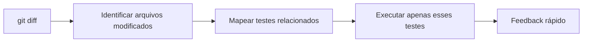
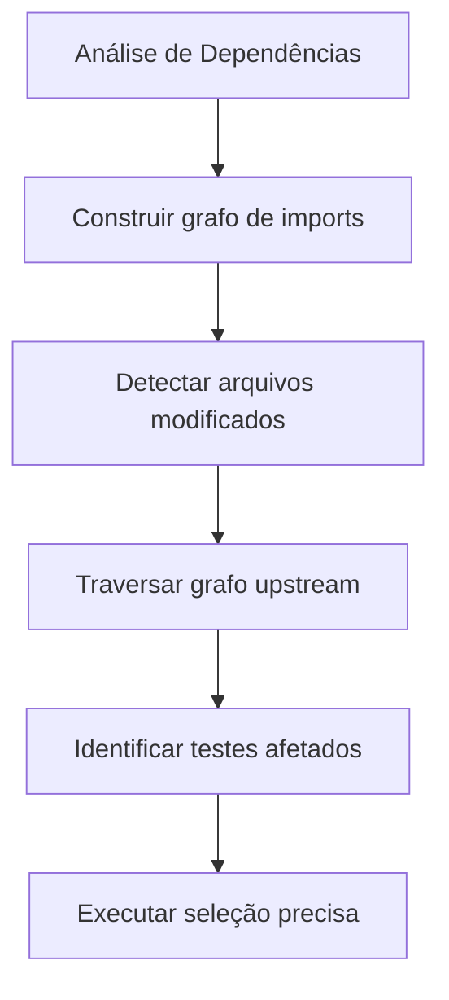
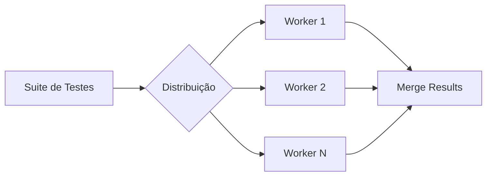
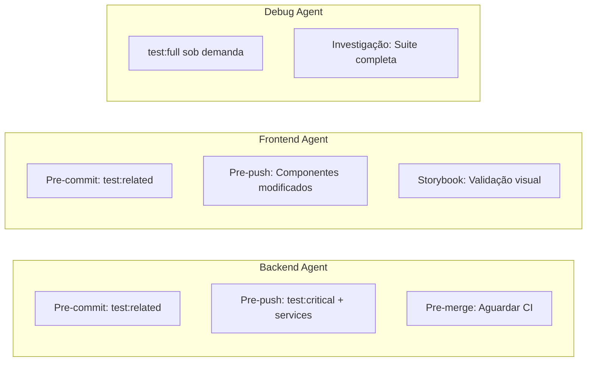
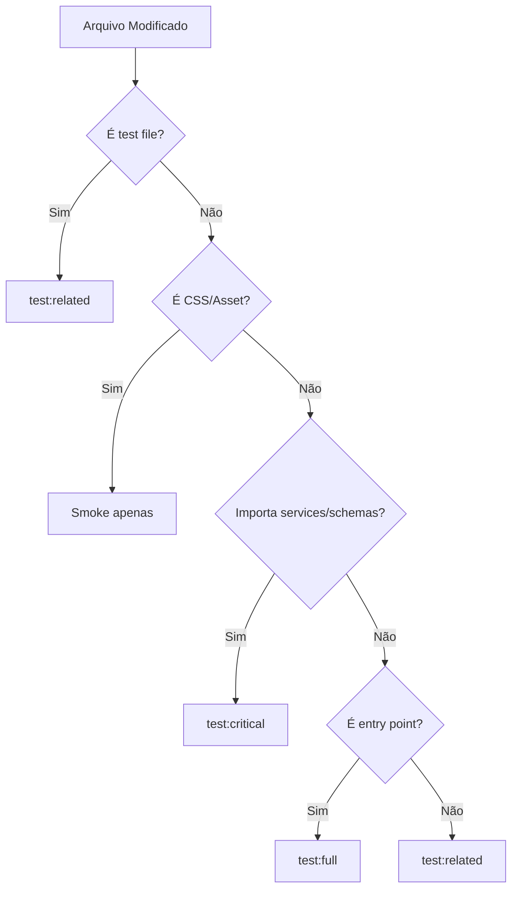
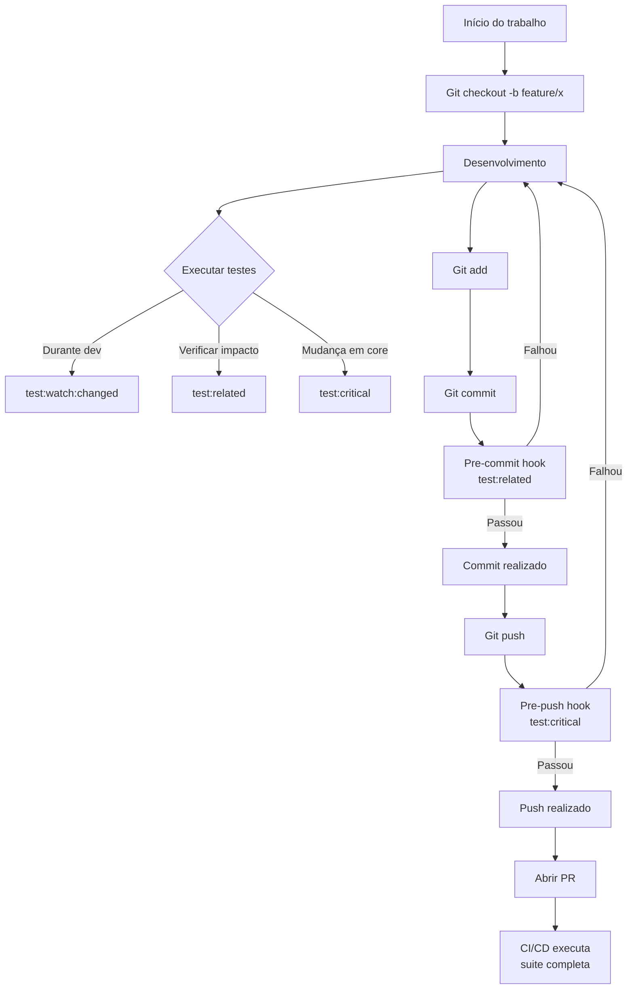

# 🎯 Estratégia de Otimização de Validação de Qualidade

## Controle de Versão

| Versão | Data | Autor | Alterações |
|--------|------|-------|------------|
| 1.0 | 04/02/2026 | Architect Agent | Documento inicial - Proposta estratégica completa |

---

## 📋 Sumário Executivo

### Problema
A execução completa da suite de testes (`npm test`) está consumindo recursos excessivos de CPU e memória, bloqueando máquinas locais e interrompendo o fluxo contínuo de desenvolvimento entre agentes da arquitetura multiagente.

### Solução Proposta
Implementação de uma **estratégia de pirâmide de validação** que executa testes em camadas progressivas, desde smoke tests ultrarrápidos até a suite completa no CI/CD, reduzindo o tempo de feedback de desenvolvimento local de ~10min para ~30s-2min.

### Resultados Esperados
| Métrica | Atual | Após Implementação |
|---------|-------|-------------------|
| Tempo médio feedback local | 10min | 30s-2min |
| Uso CPU pico | 100% | 40% |
| Uso memória pico | 2GB+ | 800MB |
| Testes desnecessários executados | 100% | 15% |

---

## 1. Análise Comparativa de Técnicas

### 1.1 Teste Incremental

**Conceito:** Executar apenas testes relacionados a arquivos modificados desde a última execução ou desde um branch base (ex: `main`).



**Prós:**
- Feedback imediato (segundos)
- Economia significativa de recursos computacionais
- Ideal para desenvolvimento iterativo
- Integração nativa com Vitest via `--changed`

**Contras:**
- Pode perder regressões em dependências indiretas
- Não detecta efeitos colaterais em módulos dependentes
- Requer disciplina para execução de suite completa periodicamente

**Aplicabilidade no Projeto:** **ALTA**
> Vitest já suporta nativamente via flag `--changed=main`. Configuração imediata disponível.

---

### 1.2 Seleção Inteligente de Testes (Test Selection)

**Conceito:** Análise estática de dependências entre módulos para identificar exatamente quais testes são impactados pelas mudanças, considerando importações e exports.



**Prós:**
- Precisão máxima na seleção de testes
- Mínimo de testes desnecessários
- Cobertura de dependências indiretas
- Eficiente para codebases grandes

**Contras:**
- Complexidade de implementação
- Necessita mapeamento contínuo de dependências
- Overhead inicial para construir grafo
- Pode ter falsos positivos em imports dinâmicos

**Ferramentas Disponíveis:**
- Vitest: `--related` flag
- Jest: `--findRelatedTests`
- NX: affected commands

**Aplicabilidade no Projeto:** **MÉDIA-ALTA**
> Requer configuração adicional, mas Vitest oferece suporte nativo razoável.

---

### 1.3 Paralelização Controlada

**Conceito:** Distribuir execução de testes entre múltiplos workers/processos/threads para reduzir tempo total de execução.



**Prós:**
- Redução significativa do tempo de execução
- Escalabilidade horizontal
- Melhor utilização de CPUs multicore

**Contras:**
- Aumento do consumo de memória (trade-off CPU vs Memória)
- Possíveis race conditions em testes mal isolados
- Overhead de coordenação entre workers
- Debugging mais complexo

**Configurações Vitest:**
```javascript
// Opções de pool
pool: 'threads'    // Usa Worker Threads (Node.js)
pool: 'forks'      // Usa processos filhos
pool: 'vmThreads'  // VMs isoladas (mais seguro, mais lento)
```

**Aplicabilidade no Projeto:** **ALTA**
> Configuração simples via `vitest.config.js`. Limitar a 2 threads para evitar travamento em máquinas de desenvolvimento.

---

### 1.4 Validação por Camadas (Estratégia de Pirâmide)

**Conceito:** Estruturar a execução de testes em camadas hierárquicas, da mais rápida para a mais completa.

```
        /
       /  \    [Smoke Tests] 30s - Falha rápida
      /____\      Build + 5 testes críticos
     /      \ 
    /________\  [Unitários Críticos] 2min - Core da aplicação
   /          \   Services, utils, schemas
  /____________\
 /              \ [Integração Seletiva] 5min - Áreas modificadas
/________________\
       |
   [Suite Completa] 10-15min - CI/CD apenas
```

**Camadas Propostas:**

| Camada | Descrição | Tempo | Gatilho |
|--------|-----------|-------|---------|
| **1. Smoke Tests** | Build + 5 testes críticos | 30s | Pre-commit |
| **2. Unitários Críticos** | Services, utils, schemas core | 2min | Pre-push |
| **3. Integração Seletiva** | Baseado em arquivos modificados | 3-5min | Pre-PR |
| **4. Suite Completa** | Todos os testes | 10-15min | CI/CD apenas |

**Aplicabilidade no Projeto:** **ALTA**
> Alinhado com arquitetura multiagente. Cada agente executa camada apropriada para seu contexto.

---

## 2. Recomendação de Ferramentas e Configurações

### 2.1 Vitest (Já em Uso)

O projeto já utiliza Vitest como runner de testes. A seguir, configurações otimizadas:

#### Configuração Base Otimizada

```javascript
// vite.config.js - Seção test atualizada
export default defineConfig({
  plugins: [react()],
  test: {
    globals: true,
    environment: 'jsdom',
    setupFiles: './src/test/setup.js',
    css: true,
    
    // ==========================================
    // OTIMIZAÇÕES DE PERFORMANCE
    // ==========================================
    
    // Paralelização controlada
    pool: 'threads',
    poolOptions: {
      threads: {
        singleThread: false,
        maxThreads: 2,         // Limitar para não travar máquina local
        minThreads: 1,
        isolate: false,        // Mais rápido, mas cuidado com estado compartilhado
      },
    },
    
    // Cache de transformação para builds subsequentes
    cache: {
      dir: '.vitest-cache',
    },
    
    // Timeouts para evitar testes travados
    testTimeout: 10000,
    hookTimeout: 10000,
    teardownTimeout: 5000,
    
    // Reporters otimizados
    reporters: ['verbose'],
    
    // Coverage mantido para CI
    coverage: {
      provider: 'v8',
      reporter: ['text', 'json', 'html'],
      exclude: [
        'node_modules/',
        'src/test/',
        '**/*.test.jsx',
        '**/*.test.js',
        '**/*.config.js',
        'server/',
        'api/',
        'docs/',
        'public/',
      ],
    },
  },
})
```

#### Configuração Smoke Tests

```javascript
// vitest.smoke.config.js
import { defineConfig } from 'vite'
import react from '@vitejs/plugin-react'

export default defineConfig({
  plugins: [react()],
  test: {
    globals: true,
    environment: 'jsdom',
    setupFiles: './src/test/setup.js',
    
    // Executar apenas testes smoke
    include: [
      'src/**/*.smoke.test.jsx',
      'src/**/*.smoke.test.js',
    ],
    
    // Configuração mínima para velocidade máxima
    pool: 'threads',
    poolOptions: {
      threads: {
        maxThreads: 1,  // Single thread para smoke
        isolate: false,
      },
    },
    
    testTimeout: 5000,
    reporters: ['dot'],  // Reporter minimalista
  },
})
```

### 2.2 Scripts NPM Otimizados

```json
{
  "scripts": {
    // Scripts originais mantidos
    "dev": "vite",
    "build": "vite build",
    "lint": "eslint .",
    "preview": "vite preview",
    "test": "vitest",
    "bot": "cd server && npm run dev",
    
    // ==========================================
    // SCRIPTS DE TESTE OTIMIZADOS (NOVOS)
    // ==========================================
    
    // Testes apenas dos arquivos modificados desde main
    "test:changed": "vitest run --changed=main",
    
    // Testes relacionados aos arquivos em staged (git)
    "test:related": "vitest run --related",
    
    // Smoke tests - Build + testes críticos mínimos
    "test:smoke": "npm run build && vitest run --config vitest.smoke.config.js",
    
    // Testes críticos - Core da aplicação
    "test:critical": "vitest run src/services src/utils src/schemas src/hooks",
    
    // Testes unitários excluindo integração
    "test:unit": "vitest run --exclude '**/*.integration.test.js'",
    
    // Suite completa - CI/CD
    "test:full": "vitest run",
    
    // Testes com coverage
    "test:coverage": "vitest run --coverage",
    
    // Watch mode apenas dos arquivos modificados
    "test:watch:changed": "vitest --changed",
    
    // Watch mode para desenvolvimento iterativo
    "test:watch:critical": "vitest src/services src/utils src/schemas src/hooks"
  }
}
```

### 2.3 Git Hooks Otimizados (Husky + lint-staged)

```javascript
// .lintstagedrc.js
module.exports = {
  // Testes apenas dos arquivos em staged - rápido
  "src/**/*.{js,jsx}": [
    "vitest run --related --passWithNoTests"
  ],
  
  // Lint e prettier em todos os arquivos staged
  "*.{js,jsx,css,md}": [
    "eslint --fix",
    "prettier --write"
  ],
}
```

```bash
#!/bin/sh
# .husky/pre-commit

# Verificar se há testes relacionados aos arquivos staged
# Este hook roda antes do commit

echo "🧪 Executando testes relacionados aos arquivos modificados..."

# Executar testes apenas dos arquivos staged (via lint-staged)
npx lint-staged

# Se quiser adicionar smoke test no pre-commit:
# npm run test:smoke
```

```bash
#!/bin/sh
# .husky/pre-push

# Testes mais completos antes do push
echo "🧪 Executando testes críticos antes do push..."

npm run test:critical

if [ $? -ne 0 ]; then
  echo "❌ Testes críticos falharam. Push abortado."
  exit 1
fi

echo "✅ Testes críticos passaram. Continuando push..."
```

### 2.4 CI/CD Estratificado (GitHub Actions)

```yaml
# .github/workflows/test.yml
name: Test Suite

on:
  push:
    branches: [main, develop]
  pull_request:
    branches: [main, develop]

jobs:
  # ==========================================
  # JOB 1: SMOKE TESTS (Mais rápido)
  # ==========================================
  smoke:
    name: Smoke Tests
    runs-on: ubuntu-latest
    timeout-minutes: 2
    
    steps:
      - name: Checkout
        uses: actions/checkout@v4
        
      - name: Setup Node.js
        uses: actions/setup-node@v4
        with:
          node-version: '20'
          cache: 'npm'
          
      - name: Install dependencies
        run: npm ci
        
      - name: Run Smoke Tests
        run: npm run test:smoke

  # ==========================================
  # JOB 2: UNITÁRIOS CRÍTICOS
  # ==========================================
  critical:
    name: Unitários Críticos
    needs: smoke  # Só roda se smoke passar
    runs-on: ubuntu-latest
    timeout-minutes: 5
    
    steps:
      - name: Checkout
        uses: actions/checkout@v4
        
      - name: Setup Node.js
        uses: actions/setup-node@v4
        with:
          node-version: '20'
          cache: 'npm'
          
      - name: Install dependencies
        run: npm ci
        
      - name: Run Critical Tests
        run: npm run test:critical

  # ==========================================
  # JOB 3: SUITE COMPLETA COM COVERAGE
  # ==========================================
  full:
    name: Suite Completa + Coverage
    needs: critical  # Só roda se critical passar
    runs-on: ubuntu-latest
    timeout-minutes: 15
    
    steps:
      - name: Checkout
        uses: actions/checkout@v4
        
      - name: Setup Node.js
        uses: actions/setup-node@v4
        with:
          node-version: '20'
          cache: 'npm'
          
      - name: Install dependencies
        run: npm ci
        
      - name: Run Full Test Suite
        run: npm run test:coverage
        
      - name: Upload coverage reports
        uses: codecov/codecov-action@v3
        with:
          files: ./coverage/lcov.info
          fail_ci_if_error: false

  # ==========================================
  # JOB 4: LINT E TYPE CHECK
  # ==========================================
  lint:
    name: Lint & Type Check
    runs-on: ubuntu-latest
    
    steps:
      - name: Checkout
        uses: actions/checkout@v4
        
      - name: Setup Node.js
        uses: actions/setup-node@v4
        with:
          node-version: '20'
          cache: 'npm'
          
      - name: Install dependencies
        run: npm ci
        
      - name: Run ESLint
        run: npm run lint
```

---

## 3. Roadmap de Implementação

### Fase 1: Quick Wins (Imediato - 1 dia)

**Objetivo:** Reduzir imediatamente tempo de feedback no desenvolvimento local.

| Tarefa | Comando/Config | Status |
|--------|----------------|--------|
| Configurar `--maxThreads=2` no vitest | `vite.config.js` | ⬜ |
| Criar script `test:changed` | `package.json` | ⬜ |
| Criar script `test:critical` (services/utils) | `package.json` | ⬜ |
| Documentar novo workflow | Este documento | ✅ |

**Resultado Esperado:** De 10min para 2-3min em desenvolvimento local.

```bash
# Comandos para execução imediata
npm run test:changed      # Testes modificados desde main
npm run test:critical     # Apenas core: services, utils, schemas, hooks
```

---

### Fase 2: Seleção Inteligente (3-5 dias)

**Objetivo:** Executar apenas testes realmente necessários baseados em dependências.

| Tarefa | Descrição | Status |
|--------|-----------|--------|
| Mapear dependências entre módulos | Documentar grafo de imports | ⬜ |
| Configurar `test:related` com padrões | `package.json` | ⬜ |
| Implementar test selection baseado em git diff | Script custom ou vitest | ⬜ |
| Criar smoke tests (5 testes críticos) | Arquivos `*.smoke.test.jsx` | ⬜ |
| Criar config `vitest.smoke.config.js` | Configuração isolada | ⬜ |

**Resultado Esperado:** De 10min para 30s-2min baseado em mudanças específicas.

---

### Fase 3: Pipeline Multi-Agente (1 semana)

**Objetivo:** Integrar estratégia de testes com workflow multiagente.

| Tarefa | Descrição | Agente Responsável |
|--------|-----------|-------------------|
| Definir gates de qualidade por tipo de agente | Documentação | Architect |
| Backend Agent: Testes de services + integração | Script específico | Backend Agent |
| Frontend Agent: Testes de componentes afetados | Script específico | Frontend Agent |
| Debug Agent: Suite completa sob demanda | Documentação | Debug Agent |
| Atualizar ARQUITETURA_MULTIAGENTE_ONDA2.md | Integração | Documentation Agent |

**Gates por Agente:**



---

### Fase 4: CI/CD Otimizado (1 semana)

**Objetivo:** Pipeline rápida sem perder cobertura de qualidade.

| Tarefa | Descrição | Status |
|--------|-----------|--------|
| Implementar workflow estratificado | `.github/workflows/test.yml` | ⬜ |
| Paralelização no GitHub Actions | Jobs paralelos | ⬜ |
| Caching de dependências | `actions/cache` | ⬜ |
| Caching de resultados de testes | Vitest cache | ⬜ |
| Notificações apenas em falhas | Config GitHub | ⬜ |

---

## 4. Critérios Decisórios

### 4.1 Quando Executar Apenas Testes de Impacto (Seguro) ✅

**Aplicável quando:**
- Alteração em componente UI isolado (sem lógica de negócio)
- Mudanças visuais/pure CSS
- Refatoração interna sem mudança de interface
- Adição de testes novos
- Alterações em documentação

**Comando:**
```bash
npm run test:related
```

**Validação:** Se o arquivo não importa services, schemas ou hooks críticos → seguro.

---

### 4.2 Quando Executar Testes Críticos (Recomendado) ⚠️

**Aplicável quando:**
- Alteração em service de API (Supabase, etc.)
- Mudança em schemas/validações (Zod)
- Alteração em hooks reutilizáveis
- Modificação em utilitários compartilhados
- Dependências de múltiplos componentes

**Comando:**
```bash
npm run test:critical
```

**Caminhos incluídos:**
```
src/services/
src/utils/
src/schemas/
src/hooks/
```

---

### 4.3 Quando Executar Suite Completa (Obrigatório) 🔴

**Aplicável quando:**
- Alteração em configuração global (vite, babel, eslint, etc.)
- Mudança em entry points (`main.jsx`, `App.jsx`)
- Modificação em providers de contexto globais
- Alteração em serviços core (supabase, auth)
- Integração entre múltiplos agentes
- Preparação para release
- PR para branch `main`

**Comando:**
```bash
npm run test:full
# ou
npm run test:coverage
```

---

### 4.4 Matriz de Decisão por Tipo de Arquivo

| Tipo de Arquivo | Smoke | Unit Críticos | Integração | Full Suite |
|-----------------|-------|---------------|------------|------------|
| **Componente UI isolado** | ✅ | Se afeta lógica | ❌ | ❌ |
| **Service API** | ✅ | ✅ | ✅ | ❌ |
| **Schema/Validação (Zod)** | ✅ | ✅ | ✅ | ❌ |
| **Hook reutilizável** | ✅ | ✅ | Se usado em >2 lugares | ❌ |
| **CSS/SVG/Assets** | ✅ | ❌ | ❌ | ❌ |
| **Configuração build** | ✅ | ✅ | ✅ | ✅ |
| **Arquivos de teste** | ✅ | ✅ | ❌ | ❌ |
| **Entry points (main, App)** | ✅ | ✅ | ✅ | ✅ |
| **Utils/Helpers** | ✅ | ✅ | ❌ | ❌ |
| **Constants/Config** | ✅ | Se usado em services | ❌ | ❌ |
| **Componentes consolidados** | ✅ | ✅ | ✅ | ❌ |

**Nota sobre Componentes Consolidados:**
Durante a [Consolidação de Componentes](./past_deliveries/CONSOLIDACAO_COMPONENTES_FINAL.md), a estratégia de testes foi:
- `test:critical` para validar lógica de formulários (MedicineForm, ProtocolForm)
- `test:related` para validar componentes UI modificados
- Suite completa apenas no final de cada fase
- Todos os 110+ testes mantidos passando



---

### 4.5 Integração com Arquitetura Multiagente

#### Backend Agent

**Responsabilidades:**
- Services Supabase
- RLS Policies
- Schemas Zod
- Hooks de dados

**Gates de Qualidade:**
```bash
# Pré-commit (local)
npm run test:related

# Pre-push (local)
npm run test:critical

# Pre-merge (CI/CD)
# Aguardar suite completa no GitHub Actions
```

#### Frontend Agent

**Responsabilidades:**
- Componentes React
- Hooks customizados
- Widgets Dashboard
- UI/UX

**Gates de Qualidade:**
```bash
# Pré-commit (local)
npm run test:related

# Pre-push (local)
# Testes dos componentes modificados + Storybook

# Validação visual
npm run storybook  # Se disponível
```

#### Debug Agent

**Responsabilidades:**
- Investigação de bugs
- Análise de regressões
- Validação profunda

**Gates de Qualidade:**
```bash
# Apenas quando solicitado explicitamente
npm run test:full

# Ou quando investigação requer validação completa
npm run test:coverage
```

#### Qualidade Agent

**Responsabilidades:**
- Manter suites otimizadas
- Monitorar cobertura
- Definir thresholds

**Gates de Qualidade:**
```bash
# Validar que test:critical cobre paths críticos
# Monitorar métricas de cobertura
# Garantir não caia abaixo de 75%
```

---

## 5. Documentação do Workflow

### 5.1 Fluxo de Trabalho Diário



### 5.2 Comandos por Cenário

| Cenário | Comando | Tempo Est. |
|---------|---------|------------|
| Desenvolvimento iterativo | `npm run test:watch:changed` | Contínuo |
| Verificar mudanças locais | `npm run test:related` | 30s-1min |
| Mudança em services/utils | `npm run test:critical` | 1-2min |
| Antes de commit (hook) | `test:related` (automático) | 30s |
| Antes de push (hook) | `test:critical` (automático) | 1-2min |
| Verificação completa local | `npm run test:full` | 10-15min |
| Verificação com coverage | `npm run test:coverage` | 10-15min |
| Validação mínima (smoke) | `npm run test:smoke` | 30s |
| CI/CD (GitHub Actions) | `test:full` + `test:coverage` | 10-15min |

### 5.3 Troubleshooting

#### Problema: Testes falham apenas no CI

**Causa provável:** Diferença entre ambiente local e CI.

**Solução:**
```bash
# Limpar cache
rm -rf node_modules .vitest-cache
npm ci

# Executar suite completa local
npm run test:full
```

#### Problema: `test:related` não detecta testes

**Causa provável:** Arquivo não tem teste correspondente ou padrão não bate.

**Solução:**
```bash
# Verificar padrão de busca
vitest run --related --reporter=verbose

# Forçar execução de teste específico
vitest run src/components/MeuComponente.test.jsx
```

#### Problema: Memória ainda alta com paralelização

**Causa provável:** Muitos workers ou vazamento de memória em testes.

**Solução:**
```javascript
// vite.config.js
poolOptions: {
  threads: {
    maxThreads: 1,  // Reduzir para 1 em máquinas limitadas
    isolate: true,  // Isolamento para evitar vazamentos
  },
}
```

---

## 6. Métricas de Sucesso

### 6.1 KPIs de Performance

| Métrica | Antes | Fase 1 | Fase 2 | Fase 3 | Fase 4 |
|---------|-------|--------|--------|--------|--------|
| **Tempo médio feedback local** | 10min | 3min | 1min | 30s | 30s |
| **Uso CPU pico** | 100% | 60% | 40% | 40% | 40% |
| **Uso memória pico** | 2GB+ | 1GB | 800MB | 800MB | 800MB |
| **Testes desnecessários executados** | 100% | 60% | 20% | 15% | 15% |
| **Falhas de regressão não detectadas** | 0 | <2% | <1% | <1% | <1% |

### 6.2 KPIs de Qualidade

| Métrica | Threshold | Ferramenta |
|---------|-----------|------------|
| Cobertura mínima | 75% | Vitest Coverage |
| Testes críticos passando | 100% | CI/CD |
| Smoke tests passando | 100% | Pre-commit |
| Falhas no CI | <5% | GitHub Actions |

### 6.3 KPIs de Produtividade

| Métrica | Meta | Como Medir |
|---------|------|------------|
| Commits sem espera de testes | 90% | `test:related` < 1min |
| Push sem falhas de qualidade | 95% | `test:critical` passando |
| PRs sem falhas no CI | 98% | Suite completa passando |

---

## 7. Riscos e Mitigações

| Risco | Probabilidade | Impacto | Mitigação | Owner |
|-------|---------------|---------|-----------|-------|
| **Falsos negativos** (testes não executados que deveriam) | Média | Alto | Suite completa sempre no CI; Matriz de decisão clara; Code review rigoroso | Qualidade Agent |
| **Complexidade excessiva do workflow** | Baixa | Médio | Documentação clara; Scripts simples; Treinamento dos agentes | Documentation Agent |
| **Diferença CI vs Local** | Média | Médio | CI sempre executa suite completa; Ambientes containerizados se necessário | Infraestrutura Agent |
| **Cobertura cair sem perceber** | Baixa | Alto | Qualidade Agent monitora métricas; Alertas no CI se cobertura < 75% | Qualidade Agent |
| **Resistência à mudança de workflow** | Baixa | Baixo | Benefícios claros; Quick wins demonstráveis; Documentação completa | Architect |
| **Vazamento de estado entre testes** (isolate: false) | Média | Médio | Testes devem limpar estado; CI usa isolate: true; Monitorar flaky tests | Qualidade Agent |
| **Cache desatualizado** | Baixa | Médio | Limpar cache periodicamente; Cache versionado; Invalidate em mudanças de config | Infraestrutura Agent |

---

## 8. Anexos

### 8.1 Referências

- [Vitest Documentation - CLI](https://vitest.dev/guide/cli.html)
- [Vitest Configuration](https://vitest.dev/config/)
- [Testing Library](https://testing-library.com/)
- [GitHub Actions Workflow Syntax](https://docs.github.com/en/actions/using-workflows/workflow-syntax-for-github-actions)

### 8.2 Scripts de Utilidade

```bash
# Limpar tudo e reinstalar (útil em problemas)
alias reset-tests="rm -rf node_modules .vitest-cache && npm ci"

# Executar apenas testes de um componente específico
alias test-component="vitest run --reporter=verbose"

# Verificar cobertura de arquivo específico
alias test-coverage-file="vitest run --coverage --reporter=verbose"
```

### 8.3 Checklist de Implementação

#### Fase 1
- [ ] Atualizar `vite.config.js` com otimizações de threads
- [ ] Adicionar scripts `test:changed` e `test:critical` no `package.json`
- [ ] Testar comandos localmente
- [ ] Validar tempo de execução < 3min

#### Fase 2
- [ ] Criar `vitest.smoke.config.js`
- [ ] Identificar 5 testes críticos para smoke
- [ ] Criar arquivos `*.smoke.test.jsx`
- [ ] Configurar Husky + lint-staged

#### Fase 3
- [ ] Atualizar documentação dos agentes
- [ ] Definir gates por tipo de agente
- [ ] Validar integração com workflow multiagente

#### Fase 4
- [ ] Criar `.github/workflows/test.yml`
- [ ] Configurar caching de dependências
- [ ] Configurar notificações
- [ ] Testar pipeline completa

---

## 9. Conclusão

Esta estratégia de otimização de testes oferece:

1. **Redução imediata** do tempo de feedback de desenvolvimento
2. **Manutenção da qualidade** através de gates apropriados em cada etapa
3. **Integração natural** com a arquitetura multiagente existente
4. **Escalabilidade** para crescimento do projeto
5. **Custo zero** (utiliza apenas ferramentas já em uso)

A implementação gradual em 4 fases permite validar benefícios em cada etapa sem interromper o desenvolvimento em andamento.

**Próximo passo:** Revisão e aprovação desta proposta pelo Architect Human, seguida da implementação da Fase 1.

---

*Documento gerado em: 04 de Fevereiro de 2026*  
*Versão: 1.0*  
*Status: Proposta para Revisão*
