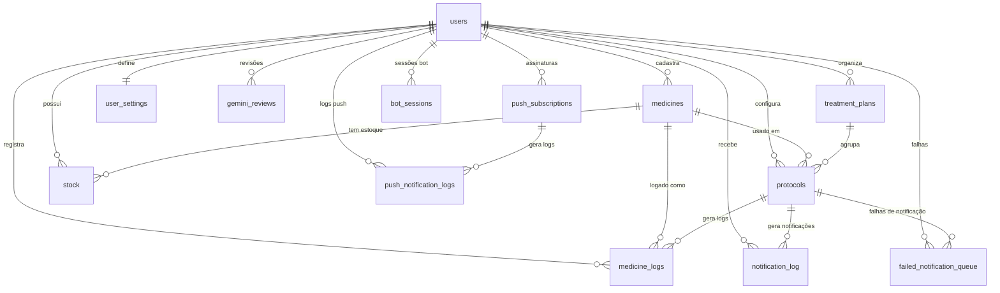

# 🗄️ Esquema do Banco de Dados

O banco de dados do **Meus Remédios** é hospedado no Supabase (PostgreSQL) e utiliza Row-Level Security (RLS) para garantir a privacidade dos dados de cada usuário.

> **Última atualização**: 2026-03-05
> **Fonte**: Exportação real do Supabase (produção)

## Diagrama de Tabelas


```mermaid
erDiagram
    users ||--o{ medicines : "cadastra"
    users ||--o{ protocols : "configura"
    users ||--o{ stock : "possui"
    users ||--o{ medicine_logs : "registra"
    users ||--o{ treatment_plans : "organiza"
    users ||--|| user_settings : "define"
    users ||--o{ notification_log : "recebe"
    users ||--o{ failed_notification_queue : "falhas"
    users ||--o{ gemini_reviews : "revisões"
    users ||--o{ push_subscriptions : "assinaturas"
    users ||--o{ push_notification_logs : "logs push"
    users ||--o{ bot_sessions : "sessões bot"

    medicines ||--o{ protocols : "usado em"
    medicines ||--o{ stock : "tem estoque"
    medicines ||--o{ medicine_logs : "logado como"

    treatment_plans ||--o{ protocols : "agrupa"
    protocols ||--o{ medicine_logs : "gera logs"
    protocols ||--o{ notification_log : "gera notificações"
    protocols ||--o{ failed_notification_queue : "falhas de notificação"

    push_subscriptions ||--o{ push_notification_logs : "gera logs"
```

---

## Tabelas do Sistema de Notificações (v3.0.0)

### `notification_log`

Tabela principal para rastrear todas as notificações enviadas.

| Campo | Tipo | Descrição |
|-------|------|-----------|
| `id` | uuid (PK) | ID único do registro |
| `user_id` | uuid (FK) | Usuário destinatário |
| `protocol_id` | uuid (FK) | Protocolo relacionado |
| `notification_type` | text | Tipo: 'dose_reminder', 'soft_reminder', 'stock_alert', 'daily_digest', etc. |
| `sent_at` | timestamptz | Data/hora do envio |
| `created_at` | timestamptz | Data de criação do registro |
| `status` | varchar | Status: 'pendente', 'enviada', 'falhou', 'entregue' |
| `telegram_message_id` | bigint | ID da mensagem no Telegram |
| `mensagem_erro` | text | Mensagem de erro (se falhou) |

**Check Constraint:**
```sql
CHECK (status::text = ANY (ARRAY['pendente'::character varying, 'enviada'::character varying, 'falhou'::character varying, 'entregue'::character varying]::text[]))
```

**Índices:**
- `idx_notif_log_user`: Para buscas por usuário
- `idx_notif_log_protocol`: Para buscas por protocolo
- `idx_notif_log_status`: Para filtrar por status
- `idx_notif_log_sent_at`: Para buscar notificações recentes

---

### `failed_notification_queue` (Dead Letter Queue)

Tabela para notificações que falharam após todas as tentativas de retry.

| Campo | Tipo | Descrição |
|-------|------|-----------|
| `id` | uuid (PK) | ID único |
| `user_id` | uuid (FK) | Usuário destinatário |
| `protocol_id` | uuid (FK) | Protocolo relacionado (nullable) |
| `correlation_id` | uuid | ID de correlação para rastreamento |
| `notification_type` | varchar(50) | Tipo da notificação |
| `notification_payload` | jsonb | Dados completos da notificação |
| `error_code` | varchar(50) | Código do erro |
| `error_message` | text | Mensagem de erro |
| `error_category` | varchar(50) | Categoria: 'network_error', 'rate_limit', 'invalid_chat', 'telegram_api_error', 'unknown' (default) |
| `retry_count` | integer | Tentativas realizadas (default: 0) |
| `max_retries` | integer | Máximo de tentativas (default: 3) |
| `status` | varchar(20) | Status: 'failed' (default), 'pending', 'retrying', 'resolved', 'discarded' |
| `resolution_notes` | text | Notas de resolução (quando resolvido) |
| `created_at` | timestamptz | Data de criação |
| `updated_at` | timestamptz | Data de atualização |
| `resolved_at` | timestamptz | Data de resolução |

**Check Constraint:**
```sql
CHECK (status::text = ANY (ARRAY['failed'::character varying, 'pending'::character varying, 'retrying'::character varying, 'resolved'::character varying, 'discarded'::character varying]::text[]))
```

**Índices:**
- `idx_failed_notif_user`: Por usuário
- `idx_failed_notif_status`: Por status (apenas failed/pending)
- `idx_failed_notif_correlation`: Por correlation ID
- `idx_failed_notif_created_at`: Por data de criação
- `idx_failed_notif_unique_pending`: Único por (user, protocolo, tipo) quando pending

**Políticas RLS:**
- Usuários veem apenas suas próprias notificações falhas
- Service role pode gerenciar tudo

---

### `push_subscriptions`

Assinaturas de notificações push para o PWA.

| Campo | Tipo | Descrição |
|-------|------|-----------|
| `id` | uuid (PK) | ID único |
| `user_id` | uuid (FK) | Usuário |
| `endpoint` | text (NOT NULL) | Endpoint do serviço push |
| `keys_p256dh` | text (NOT NULL) | Chave pública |
| `keys_auth` | text (NOT NULL) | Chave de autenticação |
| `device_info` | jsonb (default: '{}') | Informações do dispositivo |
| `created_at` | timestamptz | Data de criação |
| `updated_at` | timestamptz | Data de atualização |

---

### `push_notification_logs`

Logs de notificações push enviadas.

| Campo | Tipo | Descrição |
|-------|------|-----------|
| `id` | uuid (PK) | ID único |
| `user_id` | uuid (FK) | Usuário destinatário |
| `subscription_id` | uuid (FK) | Assinatura push |
| `notification_type` | text (NOT NULL) | Tipo da notificação |
| `title` | text (NOT NULL) | Título da notificação |
| `body` | text (NOT NULL) | Corpo da notificação |
| `sent_at` | timestamptz (default: now()) | Data de envio |
| `delivered` | boolean (default: false) | Se foi entregue |
| `error_message` | text | Mensagem de erro |

---

### `bot_sessions`

Sessões conversacionais do bot Telegram com TTL (Time To Live).

| Campo | Tipo | Descrição |
|-------|------|-----------|
| `id` | uuid (PK) | ID único da sessão |
| `user_id` | uuid (FK) | Referência ao usuário |
| `chat_id` | bigint (Unique, NOT NULL) | ID do chat do Telegram |
| `context` | jsonb (default: '{}') | Estado da conversa |
| `expires_at` | timestamptz (NOT NULL) | Timestamp de expiração |
| `created_at` | timestamptz (default: now()) | Data de criação |
| `updated_at` | timestamptz (default: now()) | Data da última atualização |

**Índices:**
- `idx_sessions_chat`: Índice em `chat_id` para buscas rápidas
- `idx_sessions_expires`: Índice em `expires_at` para cleanup eficiente
- `idx_sessions_user`: Índice em `user_id` para consultas por usuário

**Cleanup:**
Sessões expiradas são removidas automaticamente via função `cleanup_expired_bot_sessions()`.

---

## Tabelas Principais

### `auth.users` (Supabase Default)

Tabela interna do Supabase para gerenciamento de contas. O `id` do usuário é referenciado em todas as outras tabelas como `user_id`.

---

### `user_settings`

Configurações globais e integração com o Telegram.

| Campo | Tipo | Descrição |
|-------|------|-----------|
| `id` | uuid (PK) | ID único da configuração |
| `user_id` | uuid (FK, Unique, NOT NULL) | Referência ao usuário |
| `telegram_chat_id` | text | ID do chat do Telegram |
| `verification_token` | text | Token temporário para vinculação |
| `timezone` | text (default: 'America/Sao_Paulo') | Fuso horário |
| `onboarding_completed` | boolean (default: false) | Se o onboarding foi concluído |
| `created_at` | timestamptz (default: now()) | Data de criação |
| `updated_at` | timestamptz (default: now()) | Data da última atualização |

---

### `medicines`

Cadastro básico de medicamentos e suplementos.

| Campo | Tipo | Descrição |
|-------|------|-----------|
| `id` | uuid (PK) | ID único |
| `user_id` | uuid (FK, NOT NULL) | Dono do registro (default: '00000000-0000-0000-0000-000000000001') |
| `name` | text (NOT NULL) | Nome comercial |
| `laboratory` | text | Laboratório/Marca |
| `active_ingredient` | text | Princípio ativo |
| `dosage_per_pill` | numeric | Dosagem por unidade (ex: 50.0) |
| `price_paid` | numeric | Preço pago |
| `dosage_unit` | text (default: 'mg') | Unidade (mg, mcg, ml, etc) |
| `type` | text (default: 'medicine') | 'medicamento' ou 'suplemento' |
| `created_at` | timestamptz (default: now()) | Data de criação |

**Check Constraint:**
```sql
CHECK (type = ANY (ARRAY['medicamento'::text, 'suplemento'::text]))
```

---

### `treatment_plans`

Agrupadores de protocolos (ex: "Protocolo Anti-Inflamatório").

| Campo | Tipo | Descrição |
|-------|------|-----------|
| `id` | uuid (PK, default: uuid_generate_v4()) | ID único |
| `name` | text (NOT NULL) | Nome do plano |
| `description` | text | Descrição detalhada |
| `objective` | text | Objetivo do tratamento |
| `emoji` | text (default: '💊') | Emoji visual do plano (Wave 3) |
| `color` | text (default: '#6366f1') | Cor hex do badge do plano (Wave 3) |
| `user_id` | uuid (FK, NOT NULL) | Dono do registro |
| `created_at` | timestamptz (default: now()) | Data de criação |

---

### `protocols`

Dita como o medicamento deve ser tomado.

| Campo | Tipo | Descrição |
|-------|------|-----------|
| `id` | uuid (PK) | ID único |
| `medicine_id` | uuid (FK) | Referência ao medicamento |
| `treatment_plan_id` | uuid (FK) | Referência ao plano de tratamento |
| `name` | text (NOT NULL) | Nome do protocolo |
| `frequency` | text | 'diário', 'dias_alternados', 'semanal', 'personalizado', 'quando_necessário' |
| `time_schedule` | jsonb | Array de horários (ex: `["08:00", "20:00"]`) |
| `dosage_per_intake` | numeric | Quantidade por tomada |
| `target_dosage` | numeric | Dosagem alvo (para titulação) |
| `titration_status` | text (default: 'estável') | 'estável', 'titulando', 'alvo_atingido' |
| `titration_schedule` | jsonb (default: '[]') | Estágios da titulação |
| `current_stage_index` | integer (default: 0) | Índice do estágio atual |
| `stage_started_at` | timestamptz | Data de início do estágio |
| `start_date` | date (NOT NULL) | Data de início do protocolo - Usado para cálculo de adesão |
| `end_date` | date | Data de término do protocolo - NULL se ativo indefinidamente |
| `last_notified_at` | timestamptz | Última notificação enviada |
| `last_soft_reminder_at` | timestamptz | Último lembrete suave |
| `status_ultima_notificacao` | varchar | Status da última notificação: 'pendente', 'enviada', 'falhou', 'tentando_novamente' |
| `active` | boolean (default: true) | Se o protocolo está ativo |
| `notes` | text | Observações gerais |
| `user_id` | uuid (FK, NOT NULL) | Dono do registro (default: '00000000-0000-0000-0000-000000000001') |
| `created_at` | timestamptz (default: now()) | Data de criação |

**Check Constraints:**
```sql
CHECK (frequency = ANY (ARRAY['diário'::text, 'dias_alternados'::text, 'semanal'::text, 'personalizado'::text, 'quando_necessário'::text]))
```

```sql
CHECK (status_ultima_notificacao::text = ANY (ARRAY['pendente'::character varying, 'enviada'::character varying, 'falhou'::character varying, 'tentando_novamente'::character varying]::text[]))
```

---

### `stock`

Controle de inventário.

| Campo | Tipo | Descrição |
|-------|------|-----------|
| `id` | uuid (PK) | ID único |
| `medicine_id` | uuid (FK) | Referência ao medicamento |
| `quantity` | numeric (NOT NULL) | Quantidade em unidades |
| `purchase_date` | date | Data da compra |
| `expiration_date` | date | Data de validade |
| `unit_price` | numeric (default: 0) | Preço por unidade |
| `notes` | text | Observações |
| `user_id` | uuid (FK, NOT NULL) | Dono do registro (default: '00000000-0000-0000-0000-000000000001') |
| `created_at` | timestamptz (default: now()) | Data de criação |

---

### `medicine_logs`

Histórico de doses tomadas.

| Campo | Tipo | Descrição |
|-------|------|-----------|
| `id` | uuid (PK) | ID único |
| `protocol_id` | uuid (FK) | Referência ao protocolo |
| `medicine_id` | uuid (FK) | Referência ao medicamento |
| `taken_at` | timestamptz (default: now()) | Data/hora real da tomada |
| `quantity_taken` | numeric (NOT NULL) | Quantidade tomada |
| `notes` | text | Observações |
| `user_id` | uuid (FK, NOT NULL) | Dono do registro (default: '00000000-0000-0000-0000-000000000001') |

---

## Tabelas do Sistema Gemini Reviews (v3.0.0)

### `gemini_reviews`

Tabela para armazenar revisões de código geradas pela integração com Gemini Code Assist.

| Campo | Tipo | Descrição |
|-------|------|-----------|
| `id` | uuid (PK) | ID único da revisão |
| `pr_number` | integer (NOT NULL) | Número do Pull Request |
| `commit_sha` | text (NOT NULL) | SHA do commit |
| `file_path` | text (NOT NULL) | Caminho do arquivo revisado |
| `line_start` | integer | Linha inicial do problema |
| `line_end` | integer | Linha final do problema |
| `issue_hash` | text (NOT NULL) | Hash único do problema (para deduplicação) |
| `title` | text | Título do problema |
| `description` | text | Descrição detalhada |
| `suggestion` | text | Sugestão de correção |
| `created_at` | timestamptz (default: now()) | Data de criação |
| `updated_at` | timestamptz (default: now()) | Data da última atualização |
| `resolved_at` | timestamptz | Data de resolução |
| `resolved_by` | uuid (FK) | Usuário que resolveu |
| `user_id` | uuid (FK) | Usuário que criou |
| `status` | text | Status: 'detected', 'reported', 'assigned', 'resolved', 'partial', 'wontfix', 'duplicate', 'pendente', 'em_progresso', 'corrigido', 'descartado' |
| `priority` | text | Prioridade: 'critica', 'alta', 'media', 'baixa' |
| `category` | text | Categoria: 'estilo', 'bug', 'seguranca', 'performance', 'manutenibilidade' |
| `github_issue_number` | integer | Número da issue no GitHub |
| `resolution_type` | text | Tipo de resolução aplicada |

**Check Constraints:**
```sql
CHECK (status = ANY (ARRAY['detected'::text, 'reported'::text, 'assigned'::text, 'resolved'::text, 'partial'::text, 'wontfix'::text, 'duplicate'::text, 'pendente'::text, 'em_progresso'::text, 'corrigido'::text, 'descartado'::text]))
```

```sql
CHECK (priority IS NULL OR (priority = ANY (ARRAY['critica'::text, 'alta'::text, 'media'::text, 'baixa'::text])))
```

```sql
CHECK (category IS NULL OR (category = ANY (ARRAY['estilo'::text, 'bug'::text, 'seguranca'::text, 'performance'::text, 'manutenibilidade'::text])))
```

**Foreign Keys:**
- `resolved_by` → `auth.users(id)`
- `user_id` → `auth.users(id)`

---

### `gemini_reviews_backup_20260222`

Tabela de backup da `gemini_reviews` (criada em 2026-02-22).

> **Nota**: Esta é uma tabela de backup histórico e não possui constraints. Usada apenas para referência e recuperação de dados.

---

## Views e Funções

### `medicine_stock_summary` (View Materializada)

View materializada para otimização de consultas de estoque.

| Campo | Tipo | Descrição |
|-------|------|-----------|
| `medicine_id` | uuid | Referência ao medicamento |
| `user_id` | uuid | Dono do dado (para RLS) |
| `total_quantity` | numeric | Quantidade total disponível |
| `stock_entries_count` | bigint | Número de entradas ativas |
| `oldest_entry_date` | date | Data da entrada mais antiga |
| `newest_entry_date` | date | Data da entrada mais recente |

---

### `get_dlq_stats()` (Função PostgreSQL)

Função otimizada para obter estatísticas da Dead Letter Queue.

```sql
SELECT * FROM get_dlq_stats();
-- Retorna: status, count, error_category, oldest_failure
```

---

## Relacionamento entre Tabelas

```
┌─────────────────────────────────────────────────────────────┐
│                    auth.users                               │
│                      (PK: id)                                │
└────────────────────────┬────────────────────────────────────┘
                         │
         ┌───────────────┼────────────────┬────────────────┐
         │               │                │                │
         ▼               ▼                ▼                ▼
┌───────────────┐ ┌───────────────┐ ┌───────────────┐ ┌───────────────┐
│  user_settings │ │   medicines   │ │   protocols   │ │ gemini_reviews │
│   (FK: user)  │ │   (FK: user) │ │   (FK: user) │ │   (FK: user)  │
└───────────────┘ └───────────────┘ └───────┬───────┘ └───────────────┘
                                            │
         ┌──────────────────────────────────┼───────────────┐
         │                                  │               │
         ▼                                  ▼               ▼
┌───────────────┐               ┌───────────────┐ ┌───────────────┐
│ medicine_logs │               │     stock     │ │notification_log│
│ (FK: protocol)│               │  (FK: med)    │ │(FK: user,prot)│
└───────────────┘               └───────────────┘ └───────────────┘
                                                           │
                                                           ▼
                                                  ┌───────────────────┐
                                                  │failed_notif_queue │
                                                  │ (FK: user, prot)  │
                                                  └───────────────────┘
```

---

## Sincronização com Schemas Zod

Para garantir a consistência entre o banco de dados e a aplicação, consulte também:
- [`src/schemas/logSchema.js`](../src/schemas/logSchema.js)
- [`src/schemas/medicineSchema.js`](../src/schemas/medicineSchema.js)
- [`src/schemas/protocolSchema.js`](../src/schemas/protocolSchema.js)
- [`src/schemas/stockSchema.js`](../src/schemas/stockSchema.js)
- [`src/schemas/geminiReviewSchema.js`](../src/schemas/geminiReviewSchema.js) *(se existir)*

> ⚠️ **Nota**: Sempre que alterar o schema do banco, atualize os schemas Zod correspondentes e esta documentação.

---

## Migrações

### Migrações de Notificações (v3.0.0)

1. **`.migrations/add_notification_status.sql`**
   - Adiciona coluna `status_ultima_notificacao` em `protocols`
   - Cria tabela `notification_logs`

2. **`.migrations/add_dead_letter_queue.sql`**
   - Cria tabela `failed_notification_queue`
   - Adiciona índices e políticas RLS
   - Cria função `get_dlq_stats()` para estatísticas

### Migrações Gemini Integration (v3.0.0)

3. **`.migrations/add_gemini_reviews.sql`**
   - Cria tabela `gemini_reviews`
   - Adiciona CHECK constraints para status, priority e category
   - Adiciona Foreign Keys para `resolved_by` e `user_id`

---

## Considerações de Performance

### Índices Críticos para Notificações

```sql
-- Para busca de protocolos por horário
CREATE INDEX idx_protocols_active_user
  ON protocols(active, user_id)
  WHERE active = true;

-- Para logs de notificações recentes
CREATE INDEX idx_notif_log_sent_user
  ON notification_logs(sent_at DESC, user_id);

-- Para DLQ com filtros
CREATE INDEX idx_dlq_status_user
  ON failed_notification_queue(status, user_id)
  WHERE status IN ('failed', 'pending');

-- Para Gemini Reviews por PR
CREATE INDEX idx_gemini_reviews_pr
  ON gemini_reviews(pr_number, file_path);

-- Para Gemini Reviews por status
CREATE INDEX idx_gemini_reviews_status
  ON gemini_reviews(status, created_at DESC);
```

### Exemplo de Query Otimizada

```sql
-- Buscar protocolos que precisam de notificação HOJE
SELECT p.*, m.name as medicine_name
FROM protocols p
JOIN medicines m ON p.medicine_id = m.id
WHERE p.active = true
  AND p.user_id = 'usuario-uuid-aqui'
  AND p.time_schedule::text LIKE '%20:30%'
  AND p.last_notified_at < CURRENT_DATE;

-- Buscar revisões pendentes do Gemini por arquivo
SELECT *
FROM gemini_reviews
WHERE file_path = 'src/components/Button.jsx'
  AND status IN ('pendente', 'detected', 'reported')
ORDER BY priority DESC, created_at DESC;
```

---

## Schema SQL Completo (Referência)

> **Aviso**: O SQL abaixo é para referência e contexto. A ordem das tabelas e constraints pode não ser válida para execução direta.

```sql
-- Tabelas principais
CREATE TABLE public.medicines (...);
CREATE TABLE public.treatment_plans (...);
CREATE TABLE public.protocols (...);
CREATE TABLE public.stock (...);
CREATE TABLE public.medicine_logs (...);
CREATE TABLE public.user_settings (...);

-- Tabelas de notificação
CREATE TABLE public.notification_log (...);
CREATE TABLE public.failed_notification_queue (...);
CREATE TABLE public.push_subscriptions (...);
CREATE TABLE public.push_notification_logs (...);
CREATE TABLE public.bot_sessions (...);

-- Tabelas do sistema Gemini
CREATE TABLE public.gemini_reviews (...);
```

*Consulte o arquivo de exportação completo do Supabase para o schema exato com todas as constraints, índices e políticas RLS.*
