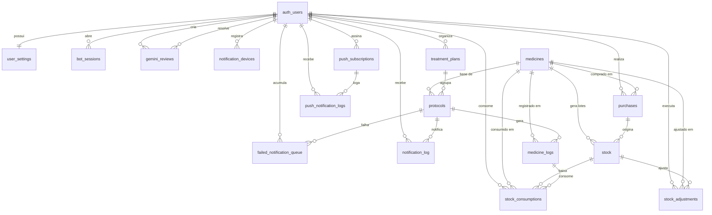

# 🗄️ Esquema do Banco de Dados

O banco de dados do **Meus Remédios** roda em **Supabase (PostgreSQL)** e usa `auth.users` como origem canônica de identidade. As tabelas do schema `public` armazenam os dados de negócio, preferências do usuário, estoque, notificações e integrações auxiliares.

> **Última atualização**: 2026-04-19
> **Fonte**: exportação real do schema atual do Supabase (DDL colado manualmente)
> **Escopo desta documentação**: tabelas, colunas, FKs e `CHECK constraints` presentes no DDL. Índices, triggers, políticas RLS, views e funções não foram incluídos porque não aparecem no SQL de origem desta revisão.

## Visão Geral

### Schema `auth`

- `auth.users`: tabela padrão do Supabase para autenticação. Todas as referências `user_id` apontam para `auth.users(id)` quando a FK existe.

### Schema `public`

```mermaid
erDiagram
    auth_users ||--|| user_settings : "possui"
    auth_users ||--o{ bot_sessions : "abre"
    auth_users ||--o{ failed_notification_queue : "acumula"
    auth_users ||--o{ gemini_reviews : "cria"
    auth_users ||--o{ gemini_reviews : "resolve"
    auth_users ||--o{ notification_devices : "registra"
    auth_users ||--o{ notification_log : "recebe"
    auth_users ||--o{ purchases : "realiza"
    auth_users ||--o{ push_subscriptions : "assina"
    auth_users ||--o{ push_notification_logs : "recebe"
    auth_users ||--o{ stock_adjustments : "executa"
    auth_users ||--o{ stock_consumptions : "consome"
    auth_users ||--o{ treatment_plans : "organiza"

    medicines ||--o{ protocols : "base de"
    medicines ||--o{ purchases : "comprado em"
    medicines ||--o{ stock : "gera lotes"
    medicines ||--o{ medicine_logs : "registrado em"
    medicines ||--o{ stock_adjustments : "ajustado em"
    medicines ||--o{ stock_consumptions : "consumido em"

    treatment_plans ||--o{ protocols : "agrupa"
    protocols ||--o{ medicine_logs : "gera"
    protocols ||--o{ notification_log : "notifica"
    protocols ||--o{ failed_notification_queue : "falha"

    purchases ||--o{ stock : "origina"
    stock ||--o{ stock_consumptions : "baixa"
    stock ||--o{ stock_adjustments : "ajusta"
    medicine_logs ||--o{ stock_consumptions : "consome"
    push_subscriptions ||--o{ push_notification_logs : "loga"
```

## Resumo por Domínio

| Domínio | Tabelas |
|--------|---------|
| Usuário e preferências | `user_settings`, `bot_sessions` |
| Catálogo e tratamento | `medicines`, `treatment_plans`, `protocols`, `medicine_logs` |
| Compras e estoque | `purchases`, `stock`, `stock_adjustments`, `stock_consumptions` |
| Notificações | `notification_devices`, `notification_log`, `failed_notification_queue`, `push_subscriptions`, `push_notification_logs` |
| Revisão de código | `gemini_reviews`, `gemini_reviews_backup_20260222` |

## Tabelas

### `user_settings`

Preferências globais do usuário, onboarding, vínculo com Telegram e metadados pessoais.

| Campo | Tipo | Restrições / Observações |
|------|------|---------------------------|
| `id` | uuid | PK, default `uuid_generate_v4()` |
| `user_id` | uuid | `NOT NULL`, `UNIQUE` |
| `telegram_chat_id` | text | Nullable |
| `created_at` | timestamptz | default `now()` |
| `updated_at` | timestamptz | default `now()` |
| `timezone` | text | default `'America/Sao_Paulo'` |
| `verification_token` | text | Nullable |
| `onboarding_completed` | boolean | default `false` |
| `emergency_card` | jsonb | Nullable |
| `display_name` | text | Nullable |
| `birth_date` | date | Nullable |
| `city` | text | Nullable |
| `state` | text | Nullable |
| `notification_preference` | text | default `'telegram'`; `telegram`, `mobile_push`, `both`, `none` |

**Observação:** no DDL colado, `user_settings` não explicita FK para `auth.users(id)`, embora `user_id` seja tratado pela aplicação como referência ao usuário autenticado.

---

### `bot_sessions`

Sessões conversacionais do bot Telegram com contexto serializado e expiração.

| Campo | Tipo | Restrições / Observações |
|------|------|---------------------------|
| `id` | uuid | PK, default `gen_random_uuid()` |
| `user_id` | uuid | `NOT NULL`, FK `auth.users(id)` |
| `chat_id` | bigint | `NOT NULL`, `UNIQUE` |
| `context` | jsonb | `NOT NULL`, default `'{}'::jsonb` |
| `expires_at` | timestamptz | `NOT NULL` |
| `created_at` | timestamptz | default `now()` |
| `updated_at` | timestamptz | default `now()` |

---

### `medicines`

Cadastro base de medicamentos e suplementos.

| Campo | Tipo | Restrições / Observações |
|------|------|---------------------------|
| `id` | uuid | PK, default `gen_random_uuid()` |
| `name` | text | `NOT NULL` |
| `laboratory` | text | Nullable |
| `active_ingredient` | text | Nullable |
| `dosage_per_pill` | numeric | Nullable |
| `price_paid` | numeric | Nullable |
| `created_at` | timestamptz | default `now()` |
| `user_id` | uuid | `NOT NULL`, default `00000000-0000-0000-0000-000000000001` |
| `type` | text | default `'medicine'`; `CHECK` aceita apenas `medicamento` ou `suplemento` |
| `dosage_unit` | text | default `'mg'` |
| `therapeutic_class` | text | Nullable |
| `regulatory_category` | text | Nullable |

**Inconsistência atual do schema:** `type` tem default `'medicine'`, mas o `CHECK` aceita apenas `'medicamento'` e `'suplemento'`. Na prática, a aplicação precisa sempre preencher esse campo explicitamente.

---

### `treatment_plans`

Agrupadores de protocolos de tratamento.

| Campo | Tipo | Restrições / Observações |
|------|------|---------------------------|
| `id` | uuid | PK, default `uuid_generate_v4()` |
| `name` | text | `NOT NULL` |
| `description` | text | Nullable |
| `objective` | text | Nullable |
| `created_at` | timestamptz | default `now()` |
| `user_id` | uuid | `NOT NULL` |
| `emoji` | text | default `'💊'` |
| `color` | text | default `'#6366f1'` |

**Observação:** no DDL colado, `treatment_plans.user_id` não traz FK explícita para `auth.users(id)`.

---

### `protocols`

Define a prescrição operacional: frequência, agenda, titulação e vínculo opcional com plano de tratamento.

| Campo | Tipo | Restrições / Observações |
|------|------|---------------------------|
| `id` | uuid | PK, default `gen_random_uuid()` |
| `medicine_id` | uuid | FK `medicines(id)` |
| `name` | text | `NOT NULL` |
| `frequency` | text | `diário`, `dias_alternados`, `semanal`, `personalizado`, `quando_necessário` |
| `time_schedule` | jsonb | Nullable |
| `dosage_per_intake` | numeric | Nullable |
| `notes` | text | Nullable |
| `active` | boolean | default `true` |
| `created_at` | timestamptz | default `now()` |
| `user_id` | uuid | `NOT NULL`, default `00000000-0000-0000-0000-000000000001` |
| `treatment_plan_id` | uuid | FK `treatment_plans(id)` |
| `target_dosage` | numeric | Nullable |
| `titration_status` | text | default `'estável'` |
| `titration_schedule` | jsonb | default `'[]'::jsonb` |
| `current_stage_index` | integer | default `0` |
| `stage_started_at` | timestamptz | Nullable |
| `last_notified_at` | timestamptz | Nullable |
| `last_soft_reminder_at` | timestamptz | Nullable |
| `status_ultima_notificacao` | varchar | `pendente`, `enviada`, `falhou`, `tentando_novamente` |
| `start_date` | date | `NOT NULL` |
| `end_date` | date | Nullable |

**Observação:** `protocols.user_id` não aparece com FK explícita no DDL colado.

---

### `medicine_logs`

Histórico de doses registradas.

| Campo | Tipo | Restrições / Observações |
|------|------|---------------------------|
| `id` | uuid | PK, default `gen_random_uuid()` |
| `protocol_id` | uuid | FK `protocols(id)` |
| `medicine_id` | uuid | FK `medicines(id)` |
| `taken_at` | timestamptz | default `now()` |
| `quantity_taken` | numeric | `NOT NULL` |
| `notes` | text | Nullable |
| `user_id` | uuid | `NOT NULL`, default `00000000-0000-0000-0000-000000000001` |

**Observação:** `medicine_logs.user_id` não traz FK explícita no DDL colado.

---

### `purchases`

Histórico imutável de compras.

| Campo | Tipo | Restrições / Observações |
|------|------|---------------------------|
| `id` | uuid | PK, default `gen_random_uuid()` |
| `user_id` | uuid | `NOT NULL`, FK `auth.users(id)` |
| `medicine_id` | uuid | `NOT NULL`, FK `medicines(id)` |
| `quantity_bought` | numeric | `NOT NULL`, `CHECK > 0` |
| `unit_price` | numeric | `NOT NULL`, default `0`, `CHECK >= 0` |
| `purchase_date` | date | `NOT NULL` |
| `expiration_date` | date | Nullable |
| `pharmacy` | text | Nullable |
| `laboratory` | text | Nullable |
| `notes` | text | Nullable |
| `legacy_stock_id` | uuid | `UNIQUE`, nullable |
| `created_at` | timestamptz | `NOT NULL`, default `now()` |

---

### `stock`

Saldo de estoque por lote, hoje vinculado opcionalmente a uma compra.

| Campo | Tipo | Restrições / Observações |
|------|------|---------------------------|
| `id` | uuid | PK, default `gen_random_uuid()` |
| `medicine_id` | uuid | FK `medicines(id)` |
| `quantity` | numeric | `NOT NULL` |
| `purchase_date` | date | Nullable |
| `expiration_date` | date | Nullable |
| `created_at` | timestamptz | default `now()` |
| `user_id` | uuid | `NOT NULL`, default `00000000-0000-0000-0000-000000000001` |
| `unit_price` | numeric | default `0` |
| `notes` | text | Nullable |
| `purchase_id` | uuid | FK `purchases(id)` |
| `original_quantity` | numeric | Nullable |
| `entry_type` | text | `purchase`, `adjustment`, `legacy_unrecoverable` |
| `updated_at` | timestamptz | default `now()` |

**Observação:** `stock.user_id` não aparece com FK explícita no DDL colado.

---

### `stock_adjustments`

Auditoria de ajustes manuais ou sistêmicos de estoque.

| Campo | Tipo | Restrições / Observações |
|------|------|---------------------------|
| `id` | uuid | PK, default `gen_random_uuid()` |
| `user_id` | uuid | `NOT NULL`, FK `auth.users(id)` |
| `medicine_id` | uuid | `NOT NULL`, FK `medicines(id)` |
| `stock_id` | uuid | FK `stock(id)` |
| `quantity_delta` | numeric | `NOT NULL`, `CHECK <> 0` |
| `reason` | text | `NOT NULL` |
| `reference_id` | uuid | Nullable |
| `notes` | text | Nullable |
| `created_at` | timestamptz | `NOT NULL`, default `now()` |

---

### `stock_consumptions`

Rastreia a baixa de estoque por lote a partir de um log de tomada.

| Campo | Tipo | Restrições / Observações |
|------|------|---------------------------|
| `id` | uuid | PK, default `gen_random_uuid()` |
| `user_id` | uuid | `NOT NULL`, FK `auth.users(id)` |
| `medicine_log_id` | uuid | `NOT NULL`, FK `medicine_logs(id)` |
| `medicine_id` | uuid | `NOT NULL`, FK `medicines(id)` |
| `stock_id` | uuid | `NOT NULL`, FK `stock(id)` |
| `quantity_consumed` | numeric | `NOT NULL`, `CHECK > 0` |
| `reversed_at` | timestamptz | Nullable |
| `created_at` | timestamptz | `NOT NULL`, default `now()` |

---

### `notification_devices`

Cadastro de dispositivos habilitados para push, com suporte a app nativo e PWA.

| Campo | Tipo | Restrições / Observações |
|------|------|---------------------------|
| `id` | uuid | PK, default `gen_random_uuid()` |
| `user_id` | uuid | `NOT NULL`, FK `auth.users(id)` |
| `app_kind` | text | `NOT NULL`; `native`, `pwa` |
| `platform` | text | `NOT NULL`; `ios`, `android`, `web` |
| `provider` | text | `NOT NULL`; `expo`, `webpush` |
| `push_token` | text | `NOT NULL` |
| `device_name` | text | Nullable |
| `device_fingerprint` | text | Nullable |
| `app_version` | text | Nullable |
| `is_active` | boolean | `NOT NULL`, default `true` |
| `last_seen_at` | timestamptz | `NOT NULL`, default `now()` |
| `created_at` | timestamptz | `NOT NULL`, default `now()` |
| `updated_at` | timestamptz | `NOT NULL`, default `now()` |

---

### `notification_log`

Log das notificações operacionais vinculadas a protocolos.

| Campo | Tipo | Restrições / Observações |
|------|------|---------------------------|
| `id` | uuid | PK, default `gen_random_uuid()` |
| `user_id` | uuid | `NOT NULL`, FK `auth.users(id)` |
| `protocol_id` | uuid | `NOT NULL`, FK `protocols(id)` |
| `notification_type` | text | `NOT NULL` |
| `sent_at` | timestamptz | default `now()` |
| `created_at` | timestamptz | default `now()` |
| `status` | varchar | default `'enviada'`; `pendente`, `enviada`, `falhou`, `entregue` |
| `telegram_message_id` | bigint | Nullable |
| `mensagem_erro` | text | Nullable |

---

### `failed_notification_queue`

Dead Letter Queue para notificações que falharam e precisam de retry, descarte ou resolução manual.

| Campo | Tipo | Restrições / Observações |
|------|------|---------------------------|
| `id` | uuid | PK, default `gen_random_uuid()` |
| `user_id` | uuid | `NOT NULL`, FK `auth.users(id)` |
| `protocol_id` | uuid | FK `protocols(id)` |
| `correlation_id` | uuid | `NOT NULL`, `UNIQUE` |
| `notification_type` | varchar | `NOT NULL` |
| `notification_payload` | jsonb | `NOT NULL` |
| `error_code` | varchar | Nullable |
| `error_message` | text | Nullable |
| `error_category` | varchar | `NOT NULL`, default `'unknown'` |
| `retry_count` | integer | default `0` |
| `max_retries` | integer | default `3` |
| `created_at` | timestamptz | default `now()` |
| `updated_at` | timestamptz | default `now()` |
| `resolved_at` | timestamptz | Nullable |
| `status` | varchar | `NOT NULL`, default `'failed'`; `failed`, `pending`, `retrying`, `resolved`, `discarded` |
| `resolution_notes` | text | Nullable |

---

### `push_subscriptions`

Assinaturas Web Push legadas/complementares, separadas do catálogo mais novo de `notification_devices`.

| Campo | Tipo | Restrições / Observações |
|------|------|---------------------------|
| `id` | uuid | PK, default `gen_random_uuid()` |
| `user_id` | uuid | FK `auth.users(id)` |
| `endpoint` | text | `NOT NULL` |
| `keys_p256dh` | text | `NOT NULL` |
| `keys_auth` | text | `NOT NULL` |
| `device_info` | jsonb | default `'{}'::jsonb` |
| `created_at` | timestamptz | default `now()` |
| `updated_at` | timestamptz | default `now()` |

---

### `push_notification_logs`

Histórico de envios Web Push.

| Campo | Tipo | Restrições / Observações |
|------|------|---------------------------|
| `id` | uuid | PK, default `gen_random_uuid()` |
| `user_id` | uuid | FK `auth.users(id)` |
| `subscription_id` | uuid | FK `push_subscriptions(id)` |
| `notification_type` | text | `NOT NULL` |
| `title` | text | `NOT NULL` |
| `body` | text | `NOT NULL` |
| `sent_at` | timestamptz | default `now()` |
| `delivered` | boolean | default `false` |
| `error_message` | text | Nullable |

---

### `gemini_reviews`

Persistência das revisões automatizadas de código.

| Campo | Tipo | Restrições / Observações |
|------|------|---------------------------|
| `id` | uuid | PK, default `gen_random_uuid()` |
| `pr_number` | integer | `NOT NULL` |
| `commit_sha` | text | `NOT NULL` |
| `file_path` | text | `NOT NULL` |
| `line_start` | integer | Nullable |
| `line_end` | integer | Nullable |
| `issue_hash` | text | `NOT NULL` |
| `title` | text | Nullable |
| `description` | text | Nullable |
| `suggestion` | text | Nullable |
| `created_at` | timestamptz | default `now()` |
| `updated_at` | timestamptz | default `now()` |
| `resolved_at` | timestamptz | Nullable |
| `resolved_by` | uuid | FK `auth.users(id)` |
| `user_id` | uuid | FK `auth.users(id)` |
| `status` | text | `detected`, `reported`, `assigned`, `resolved`, `partial`, `wontfix`, `duplicate`, `pendente`, `em_progresso`, `corrigido`, `descartado` |
| `priority` | text | `critica`, `alta`, `media`, `baixa` |
| `category` | text | `estilo`, `bug`, `seguranca`, `performance`, `manutenibilidade` |
| `github_issue_number` | integer | Nullable |
| `resolution_type` | text | Nullable |

---

### `gemini_reviews_backup_20260222`

Backup histórico da tabela `gemini_reviews`, criado em **2026-02-22**.

| Campo | Tipo | Restrições / Observações |
|------|------|---------------------------|
| `id` | uuid | Sem PK no DDL colado |
| `pr_number` | integer | Nullable |
| `commit_sha` | text | Nullable |
| `file_path` | text | Nullable |
| `line_start` | integer | Nullable |
| `line_end` | integer | Nullable |
| `issue_hash` | text | Nullable |
| `title` | text | Nullable |
| `description` | text | Nullable |
| `suggestion` | text | Nullable |
| `created_at` | timestamptz | Nullable |
| `updated_at` | timestamptz | Nullable |
| `resolved_at` | timestamptz | Nullable |
| `resolved_by` | uuid | Nullable |
| `user_id` | uuid | Nullable |
| `status` | text | Nullable |
| `priority` | text | Nullable |
| `category` | text | Nullable |

## Constraints Relevantes

### Enums e `CHECK` do schema atual

| Tabela | Campo | Valores aceitos |
|--------|-------|-----------------|
| `failed_notification_queue` | `status` | `failed`, `pending`, `retrying`, `resolved`, `discarded` |
| `medicines` | `type` | `medicamento`, `suplemento` |
| `notification_devices` | `app_kind` | `native`, `pwa` |
| `notification_devices` | `platform` | `ios`, `android`, `web` |
| `notification_devices` | `provider` | `expo`, `webpush` |
| `notification_log` | `status` | `pendente`, `enviada`, `falhou`, `entregue` |
| `protocols` | `frequency` | `diário`, `dias_alternados`, `semanal`, `personalizado`, `quando_necessário` |
| `protocols` | `status_ultima_notificacao` | `pendente`, `enviada`, `falhou`, `tentando_novamente` |
| `purchases` | `quantity_bought` | `> 0` |
| `purchases` | `unit_price` | `>= 0` |
| `stock` | `entry_type` | `purchase`, `adjustment`, `legacy_unrecoverable` |
| `stock_adjustments` | `quantity_delta` | `<> 0` |
| `stock_consumptions` | `quantity_consumed` | `> 0` |
| `user_settings` | `notification_preference` | `telegram`, `mobile_push`, `both`, `none` |
| `gemini_reviews` | `status` | `detected`, `reported`, `assigned`, `resolved`, `partial`, `wontfix`, `duplicate`, `pendente`, `em_progresso`, `corrigido`, `descartado` |
| `gemini_reviews` | `priority` | `critica`, `alta`, `media`, `baixa` |
| `gemini_reviews` | `category` | `estilo`, `bug`, `seguranca`, `performance`, `manutenibilidade` |

## Observações Arquiteturais

- Existem dois modelos de push no schema atual: `push_subscriptions`/`push_notification_logs` e o modelo mais novo `notification_devices`. Eles coexistem e a documentação precisa preservar essa distinção.
- Algumas tabelas de domínio ainda usam `user_id` com default para UUID fixo sem FK explícita no DDL (`medicines`, `protocols`, `medicine_logs`, `stock`). Isso é importante para evitar assumir constraints que não estão realmente aplicadas no banco.
- `treatment_plans` e `user_settings` também não exibem FK explícita no SQL colado, apesar de semanticamente dependerem do usuário autenticado.
- Esta revisão removeu referências antigas a objetos não presentes no DDL atual, como view materializada `medicine_stock_summary` e função `get_dlq_stats()`.

## Sincronização com a Aplicação

Ao alterar esse schema, revisar em conjunto:

- [`src/schemas`](/Users/coelhotv/Library/Mobile Documents/com~apple~CloudDocs/git/meus-remedios/src/schemas)
- [`src/features`](/Users/coelhotv/Library/Mobile Documents/com~apple~CloudDocs/git/meus-remedios/src/features)
- [`src/services`](/Users/coelhotv/Library/Mobile Documents/com~apple~CloudDocs/git/meus-remedios/src/services)
- [`src/shared/services`](/Users/coelhotv/Library/Mobile Documents/com~apple~CloudDocs/git/meus-remedios/src/shared/services)

Regras DEVFLOW mais relevantes para mudanças de schema:

- `R-020`: tratar datas locais corretamente
- `R-021`: enums Zod em português
- `R-022`: `quantity_taken` em unidades/pílulas, não em mg
- `R-082`: manter Zod e banco sincronizados
- `R-089`: verificar colunas reais antes de escrever queries/INSERTs
