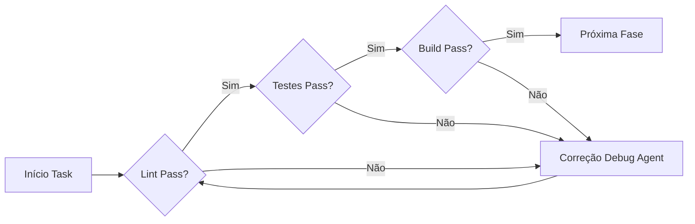

# Framework Arquitetural - Meus Remédios

**Versão:** 1.0  
**Data:** 04/02/2026  
**Status:** AUTHORIZED  
**Escopo:** Governança Técnica e Framework Multiagente Permanente

---

## 1. Visão Geral da Arquitetura Multiagente

### 1.1 Hierarquia de Agentes (Obrigatória)

```mermaid
flowchart TB
    subgraph ORQUESTRADOR[Orquestrador Central]
        OA[Arquiteto-Orchestrador<br/>Autorização e Coordenação]
    end
    
    subgraph AGENTES_PAI[7 Agentes-Pai Setoriais]
        direction TB
        A1[Backend Agent<br/>Supabase | SQL | RLS | Services]
        A2[Frontend Agent<br/>React | Vite | Components | Hooks]
        A3[Infraestrutura Agent<br/>Vercel | Config | Env | Deploy]
        A4[Qualidade Agent<br/>Testes | Lint | Gates | Coverage]
        A5[Documentação Agent<br/>Docs | README | API | Changelog]
        A6[Revisão Agent<br/>Code Review | Standards | Security]
        A7[Debug Agent<br/>Investigação | Correção | Organização]
    end
    
    subgraph SUBAGENTES[Subagentes Filhos Domain-Specific]
        direction TB
        
        subgraph BA[Backend Subagentes]
            BA1[Migration Specialist<br/>SQL DDL/DML]
            BA2[RLS Policy Expert<br/>Row Level Security]
            BA3[Service Developer<br/>API Services]
            BA4[Cache Architect<br/>Query Optimization]
        end
        
        subgraph FA[Frontend Subagentes]
            FA1[Component Engineer<br/>React Components]
            FA2[Hook Developer<br/>Custom Hooks]
            FA3[Widget Specialist<br/>Dashboard Widgets]
            FA4[Timeline Designer<br/>Visual Timelines]
        end
        
        subgraph IA[Infra Subagentes]
            IA1[Env Manager<br/>Variables & Secrets]
            IA2[Deploy Configurator<br/>Vercel Settings]
            IA3[Integration Specialist<br/>Third-party APIs]
        end
        
        subgraph QA[Qualidade Subagentes]
            QA1[Test Engineer<br/>Unit/Integration]
            QA2[Coverage Analyst<br/>Metrics & Reports]
            QA3[Lint Guardian<br/>ESLint/Prettier]
        end
        
        subgraph DA[Documentação Subagentes]
            DA1[Technical Writer<br/>Code Docs]
            DA2[API Documenter<br/>Endpoints & Schemas]
            DA3[User Guide Writer<br/>Instructions]
        end
        
        subgraph RA[Revisão Subagentes]
            RA1[Standards Enforcer<br/>Code Patterns]
            RA2[Security Reviewer<br/>Vulnerabilities]
            RA3[Performance Auditor<br/>Optimization]
        end
    end
    
    OA --> AGENTES_PAI
    A1 --> BA
    A2 --> FA
    A3 --> IA
    A4 --> QA
    A5 --> DA
    A6 --> RA
```

#### Responsabilidades e Permissões Granulares

| Agente-Pai | Responsabilidade Principal | Diretórios | Permissões |
|------------|---------------------------|------------|------------|
| **Backend Agent** | Camada de dados, persistência, segurança | `.migrations/`, `src/services/api/`, `server/services/`, `src/schemas/` | DDL/DML, RLS policies, service APIs |
| **Frontend Agent** | UI/UX React, componentes, hooks | `src/components/`, `src/hooks/`, `src/views/` | Componentes, hooks customizados, CSS |
| **Infraestrutura Agent** | Deploy, configurações, variáveis de ambiente | `.env*`, `vercel.json`, `api/`, `server/` | Configurações, secrets, integrações |
| **Qualidade Agent** | Testes, cobertura, linting, quality gates | `*.test.jsx`, `*.test.js`, `eslint.config.js` | Testes, métricas, lint enforcement |
| **Documentação Agent** | Documentação técnica, READMEs, guias de API | `docs/`, `README.md`, `CHANGELOG.md` | Documentação, release notes |
| **Revisão Agent** | Code review, padrões, segurança, performance | All source files | Revisão, standards enforcement |
| **Debug Agent** | Investigação de erros, correções críticas, organização | All source files | Correções, reorganização, análise |

### 1.2 Ciclo de Vida dos Agentes

```
┌─────────┐    ┌─────────────┐    ┌─────────────┐    ┌─────────┐    ┌───────────┐
│ DORMANT │───▶│ VALIDATING  │───▶│ AUTHORIZED  │───▶│ ACTIVE  │───▶│ SUSPENDED │
└─────────┘    └─────────────┘    └─────────────┘    └─────────┘    └───────────┘
     │               │                  │                │               │
     │               │                  │                │               │
     ▼               ▼                  ▼                ▼               ▼
  Configurado   Blueprint         Aprovado pelo      Executando    Pausa por
  não ativo     revisado          Orquestrador       tarefa        conflito ou
                                                                   fim de onda
```

| Estado | Descrição | Transições |
|--------|-----------|------------|
| **DORMANT** | Agente configurado mas não instanciado | → VALIDATING (início de onda) |
| **VALIDATING** | Blueprint sendo revisado pelo Orquestrador | → AUTHORIZED (aprovado) ou → DORMANT (rejeitado) |
| **AUTHORIZED** | Aprovado, aguardando ativação | → ACTIVE (tarefa designada) |
| **ACTIVE** | Executando tarefa designada | → SUSPENDED (fim de subtarefa) ou → DORMANT (fim de onda) |
| **SUSPENDED** | Pausa entre subtarefas | → ACTIVE (nova subtarefa) ou → DORMANT (fim de onda) |

### 1.3 Protocolos de Orquestração

#### Event Bus para Sincronização

```javascript
// Exemplo de eventos do sistema multiagente
const AGENT_EVENTS = {
  // Ciclo de vida
  AGENT_ACTIVATED: 'agent:activated',
  AGENT_SUSPENDED: 'agent:suspended',
  AGENT_COMPLETED: 'agent:completed',
  
  // Gates de qualidade
  LINT_FAILED: 'quality:lint:failed',
  TESTS_FAILED: 'quality:tests:failed',
  BUILD_FAILED: 'quality:build:failed',
  QUALITY_PASSED: 'quality:all:passed',
  
  // Dependências
  DEPENDENCY_MET: 'dependency:met',
  DEPENDENCY_BLOCKED: 'dependency:blocked',
  
  // Escalation
  ESCALATION_REQUIRED: 'escalation:required',
  HANDOFF_REQUEST: 'handoff:request'
}
```

#### Handshake de 5 Passos

```
Passo 1: Orquestrador designa tarefa ao Agente-Pai
Passo 2: Agente-Pai ativa Subagentes necessários
Passo 3: Subagentes reportam status ao Pai
Passo 4: Agente-Pai consolida e reporta ao Orquestrador
Passo 5: Orquestrador valida e autoriza próxima fase
```

#### Escalation Path para Conflitos

| Nível | Condição | Ação |
|-------|----------|------|
| **1 - Subagente** | Dúvida técnica domain-specific | Escalar para Agente-Pai |
| **2 - Agente-Pai** | Conflito entre subagentes | Escalar para Orquestrador |
| **3 - Orquestrador** | Conflito entre agentes-pai | Decisão autoritativa |
| **4 - Humano** | Decisão arquitetural crítica | Revisão humana obrigatória |

#### Gates de Qualidade Inter-Agentes



---

## 2. Governança de Qualidade

### 2.1 Pipeline de Validação (Obrigatório)

```bash
# Pipeline obrigatório em ORDEM
1. node -c arquivo.js          # Validação de sintaxe
2. npm run lint                # ESLint - qualidade de código
3. npm run test:critical       # Testes essenciais
4. npm run build               # Build de produção
```

#### Scripts Obrigatórios por Contexto

| Contexto | Comando | Quando Executar | Gatilho |
|----------|---------|-----------------|---------|
| **Pre-commit** | `npm run lint` | Sempre | Antes de `git commit` |
| **Pre-push** | `npm run test:critical` | Alterações em services/schemas/hooks | Antes de `git push` |
| **Pre-merge** | `npm run test:full` | PR para main | CI/CD ou manual |
| **CI/CD** | `npm run test:full + build` | Todos os merges | GitHub Actions |
| **Smoke** | `npm run test:smoke` | Verificação rápida | Diagnóstico |

### 2.2 Critérios Decisórios por Tipo de Arquivo

| Tipo de Arquivo | Validação Obrigatória | Agente Responsável |
|-----------------|----------------------|-------------------|
| Componente UI (`src/components/*`) | `test:related` + lint | Frontend Agent |
| Service API (`src/services/api/*`) | `test:critical` | Backend Agent |
| Schema (`src/schemas/*`) | `test:critical` + lint | Backend Agent |
| Hook (`src/hooks/*`) | `test:critical` | Frontend Agent |
| Utilitário (`src/utils/*`) | `test:critical` | Backend/Frontend* |
| Config (vite, eslint) | `test:smoke` | Qualidade Agent |
| CSS/Assets | `test:smoke` ou nenhum | Frontend Agent |
| Teste (`.test.js`) | `test:related` | Qualidade Agent |

*Depende do domínio do utilitário

### 2.3 Configurações de Teste

O projeto possui 3 configurações de teste otimizadas:

| Configuração | Arquivo | Propósito | Tempo |
|--------------|---------|-----------|-------|
| **Padrão** | `vite.config.js` | Testes completos | 10-15min |
| **Críticos** | `vitest.critical.config.js` | Services, utils, schemas, hooks | 2-3min |
| **Smoke** | `vitest.smoke.config.js` | Suite mínima de health check | 10-30s |

### 2.4 Scripts de Teste Disponíveis

```bash
# --- Testes Base ---
npm run test                    # Todos os testes (CI/CD)
npm run test:watch             # Modo watch para desenvolvimento

# --- Otimizações ---
npm run test:changed           # Apenas testes de arquivos modificados desde main
npm run test:related           # Testes relacionados aos arquivos staged
npm run test:critical          # Testes de services, utils, schemas, hooks
npm run test:unit              # Exclui testes de integração
npm run test:smoke             # Suite mínima de smoke tests

# --- Validação Rápida ---
npm run validate               # Lint + testes críticos
npm run validate:quick         # Lint + testes relacionados
```

---

## 3. Processos Obrigatórios

### 3.1 Git Workflow (Obrigatório)

#### Regra Fundamental

> **⚠️ NUNCA comitar diretamente na `main`. SEMPRE criar branch primeiro.**

#### Fluxo Obrigatório

```bash
# 1. Sempre começar na main atualizada
git checkout main
git pull origin main

# 2. Criar branch ANTES de qualquer alteração
git checkout -b feature/wave-X/nome-descritivo

# 3. Desenvolver com commits atômicos e semânticos

# 4. Pedir para o humano validar a experiência; perguntar sobre aprovação

# 5. Após aprovado, validar localmente antes de push
npm run lint
npm run test:critical
npm run build

# 6. Push e criar PR
git push origin feature/wave-X/nome-descritivo

# 7. Merge via PR apenas (com review)
```

#### Nomenclatura de Branches

| Tipo | Padrão | Exemplo |
|------|--------|---------|
| Feature | `feature/wave-X/nome-da-feature` | `feature/wave-2/adherence-widget` |
| Fix | `fix/wave-X/nome-do-fix` | `fix/wave-2/login-error` |
| Hotfix | `hotfix/nome-do-hotfix` | `hotfix/critical-security-fix` |
| Docs | `docs/wave-X/nome-da-doc` | `docs/wave-2/update-readme` |

#### Commits Semânticos Obrigatórios

```
<type>(<scope>): <subject>

<corpo opcional>

<footer opcional>
```

| Type | Quando Usar | Exemplo |
|------|-------------|---------|
| `feat` | Nova funcionalidade | `feat(widget): adicionar score de adesão` |
| `fix` | Correção de bug | `fix(bot): corrigir escape de markdown` |
| `docs` | Documentação | `docs(readme): atualizar instruções` |
| `test` | Testes | `test(service): adicionar testes de adesão` |
| `refactor` | Refatoração | `refac(hook): otimizar useCachedQuery` |
| `style` | Formatação | `style(lint): corrigir erros de lint` |
| `chore` | Manutenção | `chore(deps): atualizar dependências` |

### 3.2 Code Review Checklist (Obrigatório)

Antes de aprovar qualquer PR, o revisor DEVE verificar:

- [ ] **Lint passando** - `npm run lint` sem erros
- [ ] **Testes críticos passando** - `npm run test:critical` ok
- [ ] **Build passando** - `npm run build` sem erros
- [ ] **Sem `console.log` de debug** - Apenas logs necessários em produção
- [ ] **Sem código comentado** - Remover código morto
- [ ] **Documentação atualizada** - Se houver mudanças de API ou comportamento
- [ ] **Padrões de nomenclatura** - PascalCase componentes, camelCase funções
- [ ] **Validação Zod aplicada** - Todos os inputs de usuário validados

### 3.3 Documentação Obrigatória

| Tipo de Documento | Quando Criar | Localização |
|-------------------|--------------|-------------|
| **Task** | Toda nova tarefa | `plans/` ou referência no board |
| **Decisão Técnica** | Toda decisão arquitetural | `docs/past_deliveries/DECISOES_TECNICAS.md` |
| **Onda** | Toda onda de desenvolvimento | `plans/ONDA_X_DESENVOLVIMENTO.md` |
| **API** | Novos endpoints ou schemas | `docs/API_SERVICES.md` |
| **Changelog** | Toda release | `CHANGELOG.md` |

---

## 4. Padrões de Código

### 4.1 Estrutura de Arquivos Obrigatória

```
src/
├── components/           # Componentes React
│   ├── ui/              # Componentes genéricos (Button, Card, Modal)
│   ├── medicine/        # Domínio: Medicamentos
│   ├── protocol/        # Domínio: Protocolos
│   ├── stock/           # Domínio: Estoque
│   ├── log/             # Domínio: Registros
│   ├── adherence/       # Domínio: Adesão
│   ├── dashboard/       # Domínio: Dashboard
│   └── onboarding/      # Domínio: Onboarding
├── services/
│   └── api/             # Serviços de API (lógica de negócio)
├── hooks/               # Hooks customizados reutilizáveis
├── utils/               # Funções puras e utilitários
├── schemas/             # Schemas de validação Zod
└── lib/                 # Clientes e configurações (Supabase, cache)
```

#### Regras de Organização

```javascript
// ✅ BOM: Componente com estrutura clara
src/components/medicine/MedicineCard.jsx
src/components/medicine/MedicineCard.css
src/components/medicine/MedicineCard.test.jsx

// ❌ PROIBIDO: Estruturas inconsistentes
src/components/medicine-card/index.jsx      # kebab-case + index desnecessário
src/components/MedicineCard.js              # PascalCase em arquivo
```

### 4.2 Nomenclatura Obrigatória

| Elemento | Convenção | Exemplo |
|----------|-----------|---------|
| **Componentes React** | PascalCase | `AdherenceWidget.jsx` |
| **Funções** | camelCase | `calculateAdherence()` |
| **Variáveis** | camelCase | `medicineName` |
| **Constantes** | SCREAMING_SNAKE | `MAX_RETRY`, `CACHE_CONFIG` |
| **Hooks Customizados** | use + PascalCase | `useCachedQuery()` |
| **Arquivos** | kebab-case | `adherence-service.js` |
| **Branches** | kebab-case | `feature/wave-2/fix-login` |
| **Schemas** | nome + Schema | `medicineSchema.js` |

### 4.3 Lint Rules (Obrigatórias)

Configuração atual em [`eslint.config.js`](eslint.config.js:1):

```javascript
{
  rules: {
    'no-unused-vars': ['error', { varsIgnorePattern: '^[A-Z_]' }],
    'react-hooks/exhaustive-deps': 'error',
    'react-refresh/only-export-components': 'error',
    'no-console': ['warn', { allow: ['error', 'warn'] }]
  }
}
```

| Regra | Severidade | Descrição |
|-------|------------|-----------|
| `no-unused-vars` | error | Proíbe variáveis importadas mas não usadas |
| `react-hooks/exhaustive-deps` | error | Obriga dependências completas em hooks |
| `react-refresh/only-export-components` | error | Evita quebrar Fast Refresh do Vite |
| `no-console` | warn | Alerta sobre console.log em produção |

---

## 4.4 Padrões de Componentes Consolidados

### Mode-Based Components

Componentes que suportam múltiplos modos via prop `mode`:

```jsx
// ProtocolForm - modo 'full' (padrão) vs 'simple' (onboarding)
<ProtocolForm mode="full" medicines={medicines} ... />     // Completo
<ProtocolForm mode="simple" preselectedMedicine={med} ... /> // Simplificado
```

**Regras:**
- Valor padrão deve ser o modo mais completo (`mode='full'`)
- Modos devem ser mutuamente exclusivos e bem definidos
- Documentar diferenças entre modos

### Optional Feature Props

Features ativadas via props booleanas com default `false`:

```jsx
<Calendar
  markedDates={dates}
  enableLazyLoad={true}      // Default: false
  enableSwipe={true}         // Default: false
  enableMonthPicker={true}   // Default: false
/>
```

**Regras:**
- Prefixar com `enable` para clareza
- Sempre usar default `false` para backward compatibility
- Combinar features livremente

### Base Component Pattern

Componente base em `ui/` com wrappers específicos:

```jsx
// Base genérico em ui/
export default function AlertList({ variant = 'default', ... })

// Wrappers específicos por domínio
function SmartAlerts({ alerts }) {
  return <AlertList variant="smart" alerts={normalizeAlerts(alerts)} />
}

function StockAlertsWidget({ items }) {
  return <AlertList variant="stock" alerts={convertToAlerts(items)} />
}
```

**Regras:**
- Base em `ui/` deve ser genérico e reutilizável
- Wrappers devem fazer apenas transformação de dados
- Manter APIs públicas dos wrappers estáveis

### Onboarding Integration Pattern

Formulários que suportam onboarding via props opcionais:

```jsx
<MedicineForm
  onSave={handleSave}
  // Props de onboarding (todas opcionais)
  onSuccess={nextStep}
  autoAdvance={true}
  showCancelButton={false}
  submitButtonLabel="Salvar e Continuar"
/>
```

**Regras:**
- Props de onboarding devem ser totalmente opcionais
- Valores padrão devem preservar comportamento anterior
- Documentar claramente props de onboarding vs padrão

---

## 4.5 Checklist de Component Consolidation

Antes de consolidar componentes duplicados:

- [ ] Identificar todas as diferenças entre componentes
- [ ] Mapear APIs públicas de cada componente
- [ ] Definir estratégia: modo-based ou optional props
- [ ] Garantir 100% backward compatibility
- [ ] Documentar novas props no PADROES_CODIGO.md
- [ ] Atualizar consumidores gradualmente
- [ ] Testar todos os casos de uso
- [ ] Validar lint e testes críticos

---

## 5. Responsabilidades por Agente

### 5.1 Backend Agent

**Responsabilidades Principais:**
- Desenvolvimento de services e lógica de negócio
- Migrations e schemas de banco de dados
- RLS policies (Row Level Security)
- Cache e otimização de queries

**Obrigações:**
- Testes críticos obrigatórios para todo service
- Documentação de APIs e schemas
- Validação Zod em todos os inputs

**Comandos Obrigatórios:**
```bash
npm run test:critical    # Services, schemas
npm run lint             # Todo código JS
```

### 5.2 Frontend Agent

**Responsabilidades Principais:**
- Componentes React e UI
- Hooks customizados
- Widgets e visualizações
- CSS e responsividade

**Obrigações:**
- Testes para componentes complexos
- Validação visual (Storybook quando aplicável)
- Responsividade em todos os componentes

**Comandos Obrigatórios:**
```bash
npm run test:related     # Testes de componentes modificados
npm run lint             # Todo código JSX
npm run build            # Validação de build
```

### 5.3 Qualidade Agent

**Responsabilidades Principais:**
- Manter lint limpo (zero erros)
- Cobertura de testes mínima 70%
- Revisão de arquitetura
- Configurações de teste otimizadas

**Obrigações:**
- Configurar e manter scripts de teste
- Monitorar métricas de qualidade
- Atualizar configurações de lint/teste

**Comandos Obrigatórios:**
```bash
npm run lint             # Validar lint limpo
npm run test:coverage    # Verificar cobertura
npm run validate         # Validação completa
```

### 5.4 Debug Agent

**Responsabilidades Principais:**
- Investigação de erros e bugs
- Correções críticas
- Reorganização de código
- Documentação de incidentes

**Obrigações:**
- Usar `test:smoke` para validações rápidas
- Documentar root cause de bugs
- Aplicar `test:full` apenas quando solicitado

**Comandos:**
```bash
npm run test:smoke       # Validação rápida durante debug
npm run test:full        # Apenas quando explicitamente necessário
```

### 5.5 Infraestrutura Agent

**Responsabilidades Principais:**
- Configurações de deploy (Vercel)
- Variáveis de ambiente e secrets
- Integrações com APIs de terceiros
- CI/CD pipelines

**Obrigações:**
- Validar builds em preview
- Gerenciar secrets de forma segura
- Configurar webhooks e cron jobs

### 5.6 Documentação Agent

**Responsabilidades Principais:**
- Documentação técnica (docs/)
- READMEs e guias
- Changelogs e release notes
- Documentação de APIs

**Obrigações:**
- Atualizar CHANGELOG em toda release
- Manter docs/ organizados
- Documentar decisões técnicas

### 5.7 Revisão Agent

**Responsabilidades Principais:**
- Code review de PRs
- Enforcement de padrões
- Revisão de segurança
- Auditoria de performance

**Obrigações:**
- Aplicar checklist de review em todo PR
- Identificar vulnerabilidades de segurança
- Validar performance de novos componentes

---

## 6. Padrões de Integração de Terceiros (Third-Party APIs)

### 6.1 Telegram Bot Integration

**Responsabilidade:** Integration Specialist (IA3)

#### Limites Técnicos da API

| Limite | Valor | Consequência | Solução |
|--------|-------|--------------|---------|
| `callback_data` | 64 bytes | `BUTTON_DATA_INVALID` error | Usar índices numéricos |
| Mensagens/min | 30 | Rate limiting | Implementar throttling |
| Inline keyboard | 100 botões | Erro de renderização | Paginar quando necessário |

#### Padrão: callback_data com Índices Numéricos

```javascript
// ❌ NUNCA usar UUIDs (excede 64 bytes)
callback_data: `reg_med:${medicineId}:${protocolId}`
// Resultado: ~81 caracteres (excede limite)
// Erro: 400 Bad Request: BUTTON_DATA_INVALID

// ✅ SEMPRE usar índices numéricos
callback_data: `reg_med:${index}`
// Resultado: ~15 caracteres (dentro do limite)

// Armazenar mapeamento na sessão
session.set('medicineMap', medicines)  // medicine.id por índice

// Recuperar no callback
const medicines = session.get('medicineMap')
const medicine = medicines[index]
```

#### Cálculo de Dosagem no Bot

```javascript
// dosage_per_intake = comprimidos por dose (ex: 4)
// dosage_per_pill = mg por comprimido (ex: 500)
// dosage_real = 4 * 500 = 2000mg

// Buscar campos necessários
const { data: medicine } = await supabase
  .from('medicines')
  .select('dosage_per_pill, dosage_unit')
  .eq('id', medicineId)
  .single()

// GRAVAR no banco: quantity_taken = pillsToDecrease (comprimidos)
// ⚠️ NUNCA gravar mg (2000 excede limite do schema Zod = 100)
const pillsToDecrease = quantity / medicine.dosage_per_pill

// Ordem de operações: Validação → Gravação → Decremento
try {
  // 1. Validar estoque
  if (stock < pillsToDecrease) throw new Error('Estoque insuficiente')
  
  // 2. Gravar dose
  await logService.create({
    protocol_id: protocolId,
    quantity_taken: pillsToDecrease  // Em comprimidos!
  })
  
  // 3. Decrementar estoque
  await stockService.decrease(medicineId, pillsToDecrease)
} catch (error) {
  logger.error('Erro ao registrar dose:', error)
}
```

#### Sessão do Bot

```javascript
// SEMPRE usar await com getSession (função async)
const session = await getSession(chatId)
if (!session) {
  return bot.sendMessage(chatId, 'Sessão expirada. Use /start')
}

// SEMPRE obter userId dinamicamente (nunca MOCK_USER_ID)
const userId = await getUserIdByChatId(chatId)
```

---

## 7. Anti-Patterns Proibidos

### ❌ NUNCA commitar em main diretamente

**Consequência:** Código não revisado em produção  
**Prevenção:** Sempre criar branch primeiro, usar PR obrigatório

### ❌ NUNCA criar código sem branch primeiro

**Consequência:** Commits misturados, estado inconsistente  
**Prevenção:** Verificar `git branch` antes de iniciar, seguir workflow

### ❌ NUNCA ignorar erros de lint

**Consequência:** Build quebrado, código inconsistente  
**Prevenção:** `npm run lint` obrigatório pre-commit

### ❌ NUNCA duplicar lógica (violação DRY)

**Consequência:** Manutenção difícil, bugs em múltiplos lugares  
**Prevenção:** Extrair para services ou utils reutilizáveis

### ❌ NUNCA quebrar build

**Consequência:** Deploy bloqueado, main instável  
**Prevenção:** `npm run build` obrigatório pre-push

### ❌ NUNCA deixar `console.log` de debug em produção

**Consequência:** Poluição do console, possível vazamento de dados  
**Prevenção:** ESLint rule `no-console`, revisar antes de merge

### ❌ NUNCA ignorar dependências de hooks

**Consequência:** Bugs difíceis de debugar, comportamento inconsistente  
**Prevenção:** ESLint rule `react-hooks/exhaustive-deps` como error

### ❌ NUNCA exportar componentes e hooks do mesmo arquivo

**Consequência:** Fast Refresh do Vite quebrado  
**Prevenção:** ESLint rule `react-refresh/only-export-components` como error

---

## 8. Métricas de Qualidade

| Métrica | Mínimo | Ideal | Como Medir |
|---------|--------|-------|------------|
| **Lint errors** | 0 | 0 | `npm run lint` |
| **Test coverage** | 70% | 85% | `npm run test:coverage` |
| **Build time** | < 30s | < 20s | `npm run build` (cronometrado) |
| **PR review time** | < 24h | < 4h | GitHub/Git metrics |
| **Testes críticos** | 100% passando | 100% passando | `npm run test:critical` |
| **Testes smoke** | 100% passando | 100% passando | `npm run test:smoke` |

---

## 9. Referências Cruzadas

### Documentos Relacionados

| Documento | Propósito | Localização |
|-----------|-----------|-------------|
| `PADROES_CODIGO.md` | Convenções de código detalhadas | [`docs/PADROES_CODIGO.md`](docs/PADROES_CODIGO.md:1) |
| `LINT_COVERAGE.md` | Configurações e boas práticas de lint | [`docs/LINT_COVERAGE.md`](docs/LINT_COVERAGE.md:1) |
| `OTIMIZACAO_TESTES_ESTRATEGIA.md` | Estratégia completa de testes | [`docs/OTIMIZACAO_TESTES_ESTRATEGIA.md`](docs/OTIMIZACAO_TESTES_ESTRATEGIA.md:1) |
| `ARQUITETURA.md` | Visão arquitetural técnica | [`docs/ARQUITETURA.md`](docs/ARQUITETURA.md:1) |
| `ONDA_2_DESENVOLVIMENTO.md` | Lições aprendidas Onda 2 | [`plans/ONDA_2_DESENVOLVIMENTO.md`](plans/ONDA_2_DESENVOLVIMENTO.md:1) |
| `ARQUITETURA_MULTIAGENTE_ONDA2.md` | Blueprint multiagente | [`plans/ARQUITETURA_MULTIAGENTE_ONDA2.md`](plans/ARQUITETURA_MULTIAGENTE_ONDA2.md:1) |

### Templates

| Template | Localização |
|----------|-------------|
| Pull Request | [`docs/PULL_REQUEST_TEMPLATE.md`](docs/PULL_REQUEST_TEMPLATE.md:1) |

---

## 10. Versionamento deste Documento

| Versão | Data | Autor | Alterações |
|--------|------|-------|------------|
| 1.1 | 11/02/2026 | Architect Agent | Adicionada seção 6 (Padrões de Integração de Terceiros) com limites da API Telegram Bot |
| 1.0 | 04/02/2026 | Architect Agent | Framework inicial consolidando aprendizados da Onda 2 |

---

*Este documento é a fonte autoritativa de governança técnica do projeto Meus Remédios. Toda decisão arquitetural deve estar em conformidade com as diretrizes aqui estabelecidas.*
