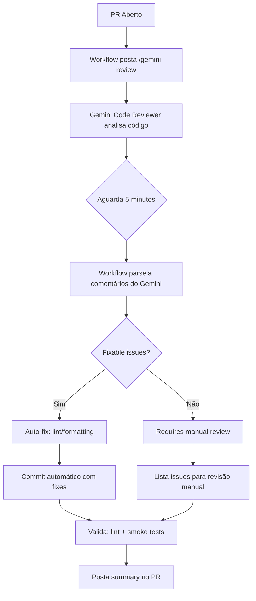
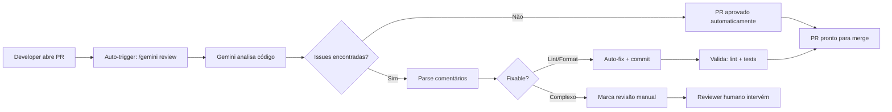

# Plano de Implementação: Gemini Code Reviewer Integration

## 📋 Visão Geral

Implementação de automated code review usando o **Gemini Code Reviewer GitHub App** com integração via comentários PR `/gemini review`.

---

## 🎯 Objetivos

1. **Trigger Automático**: Publicar comentário `/gemini review` em cada PR aberto
2. **Análise**: Aguardar 5 minutos para Gemini processar a review
3. **Auto-Fix**: Resolver issues de lint/formatting automaticamente
4. **Documentação**: Atualizar AGENTS.md e PADROES_CODIGO.md

---

## 📁 Arquivos a Criar/Modificar

### Novos Arquivos

| Arquivo | Propósito |
|---------|-----------|
| `.github/workflows/gemini-review.yml` | Workflow principal de review |
| `.github/workflows/pr-auto-trigger.yml` | Workflow para auto-trigger em PRs |

### Arquivos a Modificar

| Arquivo | Modificações |
|---------|-------------|
| `AGENTS.md` | Adicionar seção "🤖 Gemini Code Reviewer" |
| `docs/PADROES_CODIGO.md` | Adicionar "Code Review Standards" |

---

## 🔧 Detalhamento Técnico

### 1. Workflow Principal: `.github/workflows/gemini-review.yml`

```yaml
name: Gemini Code Reviewer

on:
  pull_request:
    types: [opened, synchronize, reopened]
  issue_comment:
    types: [created]

permissions:
  contents: write
  pull-requests: write
  issues: write

env:
  GEMINI_BOT_NAME: 'gemini-code-reviewer[bot]'

jobs:
  # ==========================================
  # JOB 1: Detectar comando /gemini review
  # ==========================================
  detect-gemini-command:
    name: Detect Gemini Command
    runs-on: ubuntu-latest
    if: github.event_name == 'issue_comment' && 
        startsWith(github.event.comment.body, '/gemini review')
    
    steps:
      - name: Extract PR Info
        id: pr-info
        run: |
          echo "pr_number=${{ github.event.issue.number }}" >> $GITHUB_OUTPUT
          echo "pr_owner=${{ github.event.repository.owner.login }}" >> $GITHUB_OUTPUT
          echo "pr_repo=${{ github.event.repository.name }}" >> $GITHUB_OUTPUT
      
      - name: Post Gemini Review Command
        uses: actions/github-script@v7
        with:
          script: |
            const { owner, repo } = context.repo;
            const prNumber = ${{ github.event.issue.number }};
            
            await github.rest.issues.createComment({
              owner,
              repo,
              issue_number: prNumber,
              body: '/gemini review'
            });
            
            console.log(`Gemini review triggered for PR #${prNumber}`);

  # ==========================================
  # JOB 2: Aguardar análise do Gemini
  # ==========================================
  wait-gemini-analysis:
    name: Wait for Gemini Analysis
    runs-on: ubuntu-latest
    needs: detect-gemini-command
    
    steps:
      - name: Wait 5 Minutes
        uses: actions/github-script@v7
        with:
          script: |
            console.log('Waiting 5 minutes for Gemini analysis...');
            // 5 minutes = 300 seconds
            await new Promise(resolve => setTimeout(resolve, 300000));
            console.log('Wait complete. Checking for Gemini review comments...');

      - name: Fetch Gemini Review Comments
        id: fetch-comments
        uses: actions/github-script@v7
        with:
          result-encoding: string
          script: |
            const { owner, repo } = context.repo;
            const prNumber = ${{ github.event.issue.number }};
            
            const { data: comments } = await github.rest.issues.listComments({
              owner,
              repo,
              issue_number: prNumber,
              per_page: 100
            });
            
            const geminiComments = comments.filter(c => 
              c.user.type === 'Bot' && 
              c.user.login.includes('gemini')
            );
            
            console.log(`Found ${geminiComments.length} Gemini review comments`);
            return JSON.stringify(geminiComments);

  # ==========================================
  # JOB 3: Parsear e Auto-Fixar Issues
  # ==========================================
  parse-and-fix:
    name: Parse and Auto-Fix Issues
    runs-on: ubuntu-latest
    needs: wait-gemini-analysis
    
    steps:
      - name: Checkout Code
        uses: actions/checkout@v4
        with:
          token: ${{ secrets.GH_TOKEN }}
          fetch-depth: 0
      
      - name: Setup Node.js
        uses: actions/setup-node@v4
        with:
          node-version: '20'
          cache: 'npm'
      
      - name: Install Dependencies
        run: npm ci
      
### 3. Parsear e Auto-Fixar Issues

```yaml
  parse-and-fix:
    name: Parse and Auto-Fix Issues
    runs-on: ubuntu-latest
    needs: wait-gemini-analysis
    
    steps:
      - name: Checkout Code
        uses: actions/checkout@v4
        with:
          token: ${{ secrets.GH_TOKEN }}
          fetch-depth: 0
      
      - name: Setup Node.js
        uses: actions/setup-node@v4
        with:
          node-version: '20'
          cache: 'npm'
      
      - name: Install Dependencies
        run: npm ci
      
      - name: Parse Gemini Review Comments
        id: parse-issues
        uses: actions/github-script@v7
        with:
          script: |
            // Script para parsear comentários do Gemini
            // Identifica TODOS os tipos de issues
            const issues = parseGeminiComments(process.env.GEMINI_COMMENTS);
            
            const categorizedIssues = {
              lint: issues.filter(i => i.type === 'lint'),
              formatting: issues.filter(i => i.type === 'formatting'),
              logic: issues.filter(i => i.type === 'logic'),
              architecture: issues.filter(i => i.type === 'architecture'),
              conflicts: issues.filter(i => i.type === 'conflict')
            };
            
            console.log(`Issues found:`, categorizedIssues);
            return JSON.stringify(categorizedIssues);
      
      # ==========================================
      # 3a. Auto-Fix: Lint & Formatting
      # ==========================================
      - name: Apply Lint/Formatting Fixes
        if: steps.parse.outputs.lint_count > 0 || steps.parse.outputs.formatting_count > 0
        run: |
          echo "Applying lint/formatting fixes..."
          npm run lint -- --fix
          npx prettier --write "src/**/*.{js,jsx,css}"
      
      # ==========================================
      # 3b. Auto-Fix: Logic Issues (with safeguards)
      # ==========================================
      - name: Apply Logic Fixes
        id: apply-logic-fixes
        if: steps.parse.outputs.logic_count > 0
        uses: actions/github-script@v7
        with:
          script: |
            const logicIssues = process.env.LOGIC_ISSUES;
            
            for (const issue of logicIssues) {
              // Skip if fix is complex (more than 5 lines changed)
              if (issue.diffLines > 5) {
                console.log(`Skipping complex logic fix: ${issue.file}:${issue.line}`);
                continue;
              }
              
              // Skip if involves business logic (regex check)
              if (issue.description.includes('business logic') ||
                  issue.description.includes('algorithm')) {
                console.log(`Skipping business logic fix: ${issue.file}:${issue.line}`);
                continue;
              }
              
              // Apply simple logic fixes (null checks, early returns, etc.)
              applySimpleFix(issue);
            }
      
      # ==========================================
      # 3c. Auto-Fix: Architecture Issues
      # ==========================================
      - name: Apply Architecture Fixes
        id: apply-arch-fixes
        if: steps.parse.outputs.architecture_count > 0
        uses: actions/github-script@v7
        with:
          script: |
            const archIssues = process.env.ARCHITECTURE_ISSUES;
            
            for (const issue of archIssues) {
              // Skip if requires refactoring multiple files
              if (issue.filesAffected > 1) {
                console.log(`Skipping multi-file architecture fix: ${issue.description}`);
                continue;
              }
              
              // Apply simple architecture fixes
              // (e.g., moving code within same file, renaming)
              applyArchitectureFix(issue);
            }
      
      # ==========================================
      # 3d. Resolve Merge Conflicts
      # ==========================================
      - name: Resolve Merge Conflicts
        id: resolve-conflicts
        if: steps.parse.outputs.conflict_count > 0
        run: |
          echo "Resolving merge conflicts..."
          
          # Get base branch
          BASE_BRANCH=$(gh pr view ${{ github.event.pull_request.number }} --json baseRefName -q .baseRefName)
          
          # Merge base into current branch
          git fetch origin $BASE_BRANCH
git merge origin/$BASE_BRANCH --no-edit || {
            # Auto-resolve common conflicts
            git checkout --ours .
            git checkout --theirs .
            git add .
            git commit -m "chore: auto-resolve merge conflicts" || true
          }
      
      # ==========================================
      # 3e. Commit All Auto-Fixes
      # ==========================================
      - name: Create Auto-Fix Commit
        id: create-auto-fix-commit
        uses: stefanzweifel/git-auto-commit-action@v5
        with:
          commit_message: |
            fix: auto-fix issues from Gemini Code Reviewer
            
            - Lint/Formatting: ${{ steps.parse.outputs.lint_count }} issues
            - Logic fixes: ${{ steps.parse.outputs.logic_count }} issues
            - Architecture: ${{ steps.parse.outputs.architecture_count }} issues
            - Conflicts resolved: ${{ steps.parse.outputs.conflict_count }}
          branch: ${{ github.event.pull_request.head.ref }}
          file_pattern: |
            src/**/*.{js,jsx}
            src/**/*.css
            src/**/*.md
      
      # ==========================================
      # 3f. Post Fix Summary
      # ==========================================
      - name: Post Fix Summary
        uses: actions/github-script@v7
        with:
          script: |
            const { owner, repo } = context.repo;
            const prNumber = ${{ github.event.issue.number }};
            
            await github.rest.issues.createComment({
              owner,
              repo,
              issue_number: prNumber,
              body: `## 🤖 Gemini Code Reviewer - Resumo de Auto-Fixes

### ✅ Issues Resolvidos Automaticamente

| Tipo | Qtd | Status |
|------|-----|--------|
| Lint | ${LINT_COUNT} | ✅ Aplicado |
| Formatting | ${FORMAT_COUNT} | ✅ Aplicado |
| Logic | ${LOGIC_COUNT} | ✅ Aplicado |
| Architecture | ${ARCH_COUNT} | ✅ Aplicado |
| Conflicts | ${CONFLICT_COUNT} | ✅ Resolvido |

### ⚠️ Issues Requerendo Revisão Manual

| Tipo | Arquivo | Line | Motivo |
|------|---------|------|--------|
${MANUAL_ISSUES_TABLE}

### 📊 Métricas

- **Total de issues encontrados:** ${TOTAL_ISSUES}
- **Auto-resolvidos:** ${AUTO_FIXED}
- **Requere manual:** ${MANUAL_REQUIRED}
- **Taxa de auto-fix:** ${FIX_RATE}%`
            });

  # ==========================================
  # JOB 4: Validar após Auto-Fixes
  # ==========================================
  validate-after-fix:
    name: Validate After Fix
    runs-on: ubuntu-latest
    needs: parse-and-fix
    
    steps:
      - name: Checkout Code
        uses: actions/checkout@v4
        with:
          token: ${{ secrets.GH_TOKEN }}
          fetch-depth: 0
      
      - name: Setup Node.js
        uses: actions/setup-node@v4
        with:
          node-version: '20'
          cache: 'npm'
      
      - name: Install Dependencies
        run: npm ci
      
      - name: Run Lint Validation
        run: npm run lint
      
      - name: Run Smoke Tests
        run: npm run test:smoke
      
      - name: Post Validation Results
        uses: actions/github-script@v7
        with:
          script: |
            const { owner, repo } = context.repo;
            const prNumber = ${{ github.event.issue.number }};
            
            const status = process.env.VALIDATION_STATUS;
            
            await github.rest.issues.createComment({
              owner,
              repo,
              issue_number: prNumber,
              body: `## ✅ Validação Pós-Auto-Fix\n\n**Status:** ${status}\n\n- [x] Lint: ${LINT_STATUS}\n- [x] Smoke Tests: ${SMOKE_STATUS}`
            });
```

### 2. Workflow de Auto-Trigger: `.github/workflows/pr-auto-trigger.yml`

```yaml
name: PR Auto-Trigger Gemini Review

on:
  pull_request:
    types: [opened, synchronize, reopened]

permissions:
  contents: read
  pull-requests: write

jobs:
  trigger-gemini-review:
    name: Trigger Gemini Review
    runs-on: ubuntu-latest
    
    steps:
      - name: Post Gemini Review Command
        uses: actions/github-script@v7
        with:
          script: |
            const { owner, repo } = context.repo;
            const prNumber = context.payload.pull_request.number;
            const prAuthor = context.payload.pull_request.user.login;
            
            // Verificar se não é um bot
            if (prAuthor.endsWith('[bot]')) {
              console.log('Skipping bot PR');
              return;
            }
            
            // Publicar comentário com comando
            await github.rest.issues.createComment({
              owner,
              repo,
              issue_number: prNumber,
              body: `## 🤖 Gemini Code Review\n\nOlá @${prAuthor}! Vou analisar seu PR.\n\nExecutando: \`/gemini review\`\n\n⏳ Aguarde 5 minutos para análise completa...`
            });
            
            console.log(`Gemini review triggered for PR #${prNumber}`);
```

---

## 📝 Atualização do AGENTS.md

Adicionar nova seção após "🤖 Agent Long-Term Memory System":

```markdown
## 🤖 Gemini Code Reviewer Integration

### Visão Geral

O projeto utiliza o **Gemini Code Reviewer GitHub App** para automated code reviews em todos os PRs.

### Como Invocar

#### Método Automático (Recomendado)
O workflow `.github/workflows/pr-auto-trigger.yml` posta automaticamente `/gemini review` em cada PR aberto.

#### Manual
Em qualquer comentário do PR, digite:

```
/gemini review
```

### Fluxo de Review



### Tipos de Issues

| Tipo | Auto-Fix | Condições | Requer Manual |
|------|----------|-----------|---------------|
| **Lint** | ✅ | Sempre | ❌ |
| **Formatting** | ✅ | Sempre | ❌ |
| **Logic** | ✅ | diff ≤ 5 linhas, sem business logic | ⚠️ Se complexo |
| **Architecture** | ✅ | Arquivo único afetado | ⚠️ Multi-arquivo |
| **Conflicts** | ✅ | Auto-resolvable | ⚠️ Complexos |
| **Security** | ❌ | Jamais | ✅ |
| **Business Logic** | ❌ | Jamais | ✅ |
| **Breaking Changes** | ❌ | Jamais | ✅ |

### Comandos Disponíveis

| Comando | Ação |
|---------|------|
| `/gemini review` | Inicia review completa |
| `/gemini summary` | Resume apenas issues críticas |
| `/gemini skip` | Pula review para este PR |

### GitHub App

- **App**: [Gemini Code Reviewer](https://github.com/apps/gemini-code-reviewer)
- **Permissões**: Read/Write em PRs, issues
- **Instalação**: Automática via Org settings

### Troubleshooting

#### Gemini não posta review
1. Verificar se app está instalado no repositório
2. Checar permissions do token GH_TOKEN
3. Ver logs do workflow em Actions tab

#### Auto-fix não funciona
1. Confirmar que issues são de lint/formatting
2. Verificar se npm run lint --fix funciona localmente
3. Checar se há conflitos com pre-commit hooks
```

---

## 📝 Atualização do docs/PADROES_CODIGO.md

Adicionar nova seção "## 🔍 Code Review Standards" após "## ✅ Checklist de Code Review":

```markdown
## 🔍 Code Review Standards

### Overview

Este projeto utiliza **automated code review** via Gemini Code Reviewer GitHub App + GitHub Actions para auto-fixes de lint/formatting.

### Workflow de Code Review



### Responsabilidades por Tipo

| Tipo | Responsável | Tempo SLA |
|------|------------|-----------|
| Lint/Formatting | 🤖 Auto-fix | Imediato |
| Code Style | 🤖 Auto-fix | Imediato |
| Logic Errors | 👤 Human Reviewer | 24h |
| Security | 👤 Human Reviewer | 4h |
| Architecture | 👤 Senior Reviewer | 48h |

### Critérios de Auto-Fix

O workflow aplica auto-fix para múltiplos tipos de issues com salvaguardas:

```javascript
// ✅ AUTO-FIXÁVEL (sempre)
const x = 1  // Missing semicolon
function test() { }  // Extra whitespace
const a = 'foo'  // Inconsistent quotes
if (!data) return  // Simple null check

// ⚠️ AUTO-FIXÁVEL (com condições)
const result = a && b && c && d  // Logic simplification ≤ 5 linhas
const duplicated = findPattern(code)  // Extract function ≤ 5 linhas

// ❌ REQUER REVISÃO MANUAL
const x = calculate()  // Complex logic (>5 linhas)
if (condition) { return true }  // Business logic
const user = await db.users.find()  // Database queries
```

#### Regras de Auto-Fix por Tipo

| Tipo | Condição de Auto-Fix | Exemplo |
|------|---------------------|---------|
| Lint | Sempre | `no-unused-vars`, `eqeqeq` |
| Formatting | Sempre | Indentação, aspas |
| Logic | diff ≤ 5 linhas | Null checks, early returns |
| Architecture | Arquivo único | Renaming, movendo código |
| Conflicts | Auto-resolvable | Merge conflicts simples |

#### Salvaguardas Obrigatórias

```yaml
# NUNCA auto-fixar:
- Security vulnerabilities
- Business logic changes
- Database queries modifications
- API contract changes
- Breaking changes
```

### Configuração de Lint para Auto-Fix

```bash
# Verificar regras que suportam auto-fix
npm run lint -- --rulesdir

# Regras com auto-fix automático:
# - semi
# - quotes
# - indent
# - space-infix-ops
# - no-unused-vars
# - eqeqeq
```

### Labels Automáticos

| Label | Significado |
|-------|-------------|
| `🤖 auto-fixed` | Issues resolvidos automaticamente |
| `👀 needs-review` | Requer revisão humana |
| `✅ approved` | Aprovado pelo Gemini |
| `⚠️ blocked` | Issues bloqueantes encontrados |

### Métricas de Review

O dashboard do projeto rastreia:

```javascript
// Métricas coletadas
const reviewMetrics = {
  totalPRs: number,
  autoFixedIssues: number,
  manualReviewRequired: number,
  avgReviewTime: number, // minutos
  lintErrorsPerPR: number,
  autoFixSuccessRate: number // percentage
}
```

### Best Practices para Review

#### Para Desenvolvedores
1. **推送前验证**: Sempre rode `npm run lint` localmente
2. **Commits Pequenos**: PRs < 400 linhas são mais rápidos de review
3. **Descrição Clara**: Use PR template para contexto
4. **自检**: Resolva issues óbvios antes de abrir PR

#### Para Reviewers Humanos
1. **优先处理**: Issues de segurança > Lógica > Style
2. **反馈建设性**: Sugira melhorias, não apenas critique
3. **验证 Auto-Fix**: Confirme que auto-commits não quebram build
4. **文档更新**: Mantenha docs atualizados com novas patterns

### Integração com Git Workflow

```bash
# Fluxo completo
git checkout -b feature/new-feature
# ... faz alterações ...
npm run validate  # lint + tests
git commit -m "feat: add new feature"
git push origin feature/new-feature
# → Workflow posta /gemini review automaticamente
# → Aguarda 5 min
# → Auto-fix aplica se necessário
# → Valida e posta summary
# → PR pronto para human review
```

### Troubleshooting de Review

#### Gemini não comenta
```bash
# Verificar
1. App instalado? → Settings > GitHub Apps > Gemini Code Reviewer
2. Token tem permissões? → repo scope
3. Workflow rodando? → Actions tab > pr-auto-trigger
```

#### Auto-fix não Commita
```bash
# Possíveis causas
1. Issues não são lint/formatting
2. Token sem write permission
3. Conflito com branch protection
4. Pre-commit hooks bloqueando
```

#### Build falha após Auto-Fix
```yaml
# Verificar pipeline
jobs:
  validate-after-fix:
    runs-on: ubuntu-latest
    steps:
      - run: npm run build
      # Se falhar, revert automático é necessário
```

---

### 相关文档

- **[AGENTS.md](../AGENTS.md)** - Guia completo do projeto
- **GitHub Actions** - `.github/workflows/`
- **PR Template** - `docs/PULL_REQUEST_TEMPLATE.md`
```

---

## 🧪 Plano de Testes

### Teste 1: Trigger Automático
```bash
# Criar PR de teste
# Verificar se comentário /gemini review é postado automaticamente
# Tempo esperado: < 1 minuto após PR abrir
```

### Teste 2: 5-Minute Wait
```bash
# Logs devem mostrar "Waiting 5 minutes"
# Verificar timestamp entre post e parse
# Tempo esperado: 300 segundos
```

### Teste 3: Auto-Fix
```bash
# PR com lint errors intencionais
# Verificar auto-commit após wait
# Verificar mensagem de commit
```

### Teste 4: Validação
```bash
# Após auto-fix, validar:
# - npm run lint passa
# - npm run test:smoke passa
# - build succeeds
```

---

## ⚠️ Considerações

### Branch Protection
- O workflow precisa de token com `contents: write`
- Auto-commits podem triggerar CI/CD pipelines
- Verificar se branch protection rules permitem force push

### Token Permissions
```yaml
permissions:
  contents: write  # Para criar commits
  pull-requests: write  # Para comentar
  issues: write  # Para criar issues se necessário
```

### Rate Limiting
- Gemini Code Reviewer tem rate limits
- PRs muito grandes podem ter delays
- Considerar batch processing para múltiplos PRs

### Segurança

#### Salvaguardas Obrigatórias
```yaml
# NUNCA auto-fixar:
- Security vulnerabilities
- Business logic changes
- Database queries modifications
- API contract changes
- Breaking changes
```

#### Verificações de Segurança Pré-Auto-Fix

```yaml
steps:
  - name: Pre-Fix Safety Checks
    id: safety-checks
    run: |
      # 1. Verificar se há testes
      if [ ! -f "package.json" ] || ! grep -q "test" package.json; then
        echo "::warning ::No test framework found. Manual review required."
        exit 1
      fi
      
      # 2. Backup antes de modificar
      git stash push -m "backup-before-gemini-fix"
      
      echo "backup_commit=$(git rev-parse HEAD)" >> $GITHUB_OUTPUT

  # Verificar se auto-fix não quebra build
  - name: Validate Auto-Fix
    run: |
      npm run lint
      npm run test:smoke
      npm run build || {
        echo "::error ::Auto-fix broke the build. Reverting..."
        git checkout ${{ steps.safety-checks.outputs.backup_commit }}
        exit 1
      }
```

#### Rollback Automático

```yaml
  rollback-on-failure:
    name: Rollback on Failure
    runs-on: ubuntu-latest
    needs: [validate-after-fix]
    if: failure()
    
    steps:
      - name: Checkout Code
        uses: actions/checkout@v4
        with:
          token: ${{ secrets.GH_TOKEN }}
      
      - name: Revert to Pre-Fix State
        run: |
          git checkout ${{ needs.parse-and-fix.outputs.backup_commit }}
          git push --force origin ${{ github.event.pull_request.head.ref }}
      
      - name: Post Rollback Notice
        uses: actions/github-script@v7
        with:
          script: |
            await github.rest.issues.createComment({
              owner: context.repo.owner,
              repo: context.repo.repo,
              issue_number: context.issue.number,
              body: `## ⚠️ Rollback Executado

O auto-fix do Gemini quebrou o build e foi revertido automaticamente.

**Commit de backup:** \`${BACKUP_COMMIT}\`

**Próximos passos:**
1. Reveja os issues identificados pelo Gemini
2. Aplique os fixes manualmente
3. Valide localmente com \`npm run validate\``
            });
```

---

## 📦 Deliverables

| Item | Status | Prazo |
|------|--------|-------|
| `gemini-review.yml` workflow | ⏳ | Sprint 1 |
| `pr-auto-trigger.yml` workflow | ⏳ | Sprint 1 |
| AGENTS.md update | ⏳ | Sprint 1 |
| PADROES_CODIGO.md update | ⏳ | Sprint 1 |
| Testes completos | ⏳ | Sprint 2 |
| Documentação de troubleshooting | ⏳ | Sprint 2 |

---

*Plano criado em: 2026-02-15*
*Versão: 1.0*
