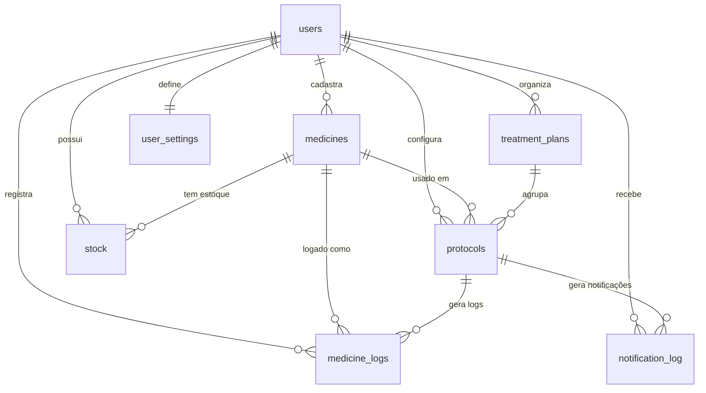

# 🗄️ Esquema do Banco de Dados

O banco de dados do **Meus Remédios** é hospedado no Supabase (PostgreSQL) e utiliza Row-Level Security (RLS) para garantir a privacidade dos dados de cada usuário.

> **Última atualização**: 2026-02-03  
> **Fonte**: Exportação real do Supabase (produção)

## Diagrama de Tabelas

## Detalhes das Tabelas

### `auth.users` (Supabase Default)
Tabela interna do Supabase para gerenciamento de contas. O `id` do usuário é referenciado em todas as outras tabelas como `user_id`.

---

### `user_settings`
Configurações globais e integração com o Telegram.

| Campo | Tipo | Descrição |
|-------|------|-----------|
| `id` | uuid (PK) | ID único da configuração |
| `user_id` | uuid (FK, Unique) | Referência ao usuário |
| `telegram_chat_id` | text | ID do chat do Telegram |
| `verification_token` | text | Token temporário para vinculação |
| `timezone` | text | Fuso horário (default: 'America/Sao_Paulo') |
| `onboarding_completed` | boolean | Se o onboarding foi concluído (default: false) |
| `created_at` | timestamptz | Data de criação |
| `updated_at` | timestamptz | Data da última atualização |

---

### `medicines`
Cadastro básico de medicamentos e suplementos.

| Campo | Tipo | Descrição |
|-------|------|-----------|
| `id` | uuid (PK) | ID único |
| `user_id` | uuid (FK) | Dono do registro |
| `name` | text (NOT NULL) | Nome comercial |
| `laboratory` | text | Laboratório/Marca |
| `active_ingredient` | text | Princípio ativo |
| `dosage_per_pill` | numeric | Dosagem por unidade (ex: 50.0) |
| `price_paid` | numeric | Preço pago |
| `dosage_unit` | text (default: 'mg') | Unidade (mg, mcg, ml, etc) |
| `type` | text (default: 'medicine') | 'medicine' ou 'supplement' |
| `created_at` | timestamptz | Data de criação |

**Check Constraint**: `type = ANY (ARRAY['medicine', 'supplement'])`

---

### `treatment_plans`
Agrupadores de protocolos (ex: "Protocolo Anti-Inflamatório").

| Campo | Tipo | Descrição |
|-------|------|-----------|
| `id` | uuid (PK) | ID único |
| `name` | text (NOT NULL) | Nome do plano |
| `description` | text | Descrição detalhada |
| `objective` | text | Objetivo do tratamento |
| `user_id` | uuid (FK) | Dono do registro |
| `created_at` | timestamptz | Data de criação |

---

### `protocols`
Dita como o medicamento deve ser tomado.

| Campo | Tipo | Descrição |
|-------|------|-----------|
| `id` | uuid (PK) | ID único |
| `medicine_id` | uuid (FK) | Referência ao medicamento |
| `treatment_plan_id` | uuid (FK) | Referência ao plano de tratamento |
| `name` | text (NOT NULL) | Nome do protocolo |
| `frequency` | text | 'daily', 'alternate', 'weekly', 'custom', 'as_needed' |
| `time_schedule` | jsonb | Array de horários (ex: `["08:00", "20:00"]`) |
| `dosage_per_intake` | numeric | Quantidade por tomada |
| `target_dosage` | numeric | Dosagem alvo (para titulação) |
| `titration_status` | text (default: 'estável') | 'estável', 'titulando', 'alvo_atingido' |
| `titration_schedule` | jsonb (default: '[]') | Estágios da titulação |
| `current_stage_index` | integer (default: 0) | Índice do estágio atual |
| `stage_started_at` | timestamptz | Data de início do estágio |
| `last_notified_at` | timestamptz | Última notificação enviada |
| `last_soft_reminder_at` | timestamptz | Último lembrete suave |
| `active` | boolean (default: true) | Se o protocolo está ativo |
| `notes` | text | Observações gerais |
| `user_id` | uuid (FK) | Dono do registro |
| `created_at` | timestamptz | Data de criação |

---

### `stock`
Controle de inventário.

| Campo | Tipo | Descrição |
|-------|------|-----------|
| `id` | uuid (PK) | ID único |
| `medicine_id` | uuid (FK) | Referência ao medicamento |
| `quantity` | numeric (NOT NULL) | Quantidade em unidades |
| `purchase_date` | date | Data da compra |
| `expiration_date` | date | Data de validade |
| `unit_price` | numeric (default: 0) | Preço por unidade |
| `notes` | text | Observações |
| `user_id` | uuid (FK) | Dono do registro |
| `created_at` | timestamptz | Data de criação |

---

### `medicine_logs`
Histórico de doses tomadas.

| Campo | Tipo | Descrição |
|-------|------|-----------|
| `id` | uuid (PK) | ID único |
| `protocol_id` | uuid (FK) | Referência ao protocolo |
| `medicine_id` | uuid (FK) | Referência ao medicamento |
| `taken_at` | timestamptz (default: now()) | Data/hora real da tomada |
| `quantity_taken` | numeric (NOT NULL) | Quantidade tomada |
| `notes` | text | Observações |
| `user_id` | uuid (FK) | Dono do registro (default: '00000000-0000-0000-0000-000000000001') |

**Foreign Keys**:
- `protocol_id` → `protocols(id)`
- `medicine_id` → `medicines(id)`

---

### `notification_log`
Log de notificações enviadas.

| Campo | Tipo | Descrição |
|-------|------|-----------|
| `id` | uuid (PK) | ID único |
| `user_id` | uuid (FK) | Destinatário |
| `protocol_id` | uuid (FK) | Protocolo relacionado |
| `notification_type` | text (NOT NULL) | Tipo da notificação |
| `sent_at` | timestamptz (default: now()) | Data do envio |
| `created_at` | timestamptz | Data de criação |

---

### `bot_sessions`
Sessões conversacionais do bot Telegram com TTL (Time To Live).

| Campo | Tipo | Descrição |
|-------|------|-----------|
| `id` | uuid (PK) | ID único da sessão |
| `user_id` | uuid (FK) | Referência ao usuário |
| `chat_id` | bigint (Unique) | ID do chat do Telegram |
| `context` | jsonb (default: '{}') | Estado da conversa |
| `expires_at` | timestamptz | Timestamp de expiração (TTL 30 min) |
| `created_at` | timestamptz | Data de criação |
| `updated_at` | timestamptz | Data da última atualização |

**Índices:**
- `idx_sessions_chat`: Índice em `chat_id` para buscas rápidas
- `idx_sessions_expires`: Índice em `expires_at` para cleanup eficiente
- `idx_sessions_user`: Índice em `user_id` para consultas por usuário

**Cleanup:**
Sessões expiradas são removidas automaticamente via função `cleanup_expired_bot_sessions()`.

---

### `medicine_stock_summary` (View)
View materializada para otimização de consultas de estoque.

| Campo | Tipo | Descrição |
|-------|------|-----------|
| `medicine_id` | uuid | Referência ao medicamento |
| `user_id` | uuid | Dono do dado (para RLS) |
| `total_quantity` | numeric | Quantidade total disponível |
| `stock_entries_count` | bigint | Número de entradas ativas |
| `oldest_entry_date` | date | Data da entrada mais antiga |
| `newest_entry_date` | date | Data da entrada mais recente |

---

## Sincronização com Schemas Zod

Para garantir a consistência entre o banco de dados e a aplicação, consulte também:
- [`src/schemas/logSchema.js`](../src/schemas/logSchema.js)
- [`src/schemas/medicineSchema.js`](../src/schemas/medicineSchema.js)
- [`src/schemas/protocolSchema.js`](../src/schemas/protocolSchema.js)
- [`src/schemas/stockSchema.js`](../src/schemas/stockSchema.js)

> ⚠️ **Nota**: Sempre que alterar o schema do banco, atualize os schemas Zod correspondentes e esta documentação.
