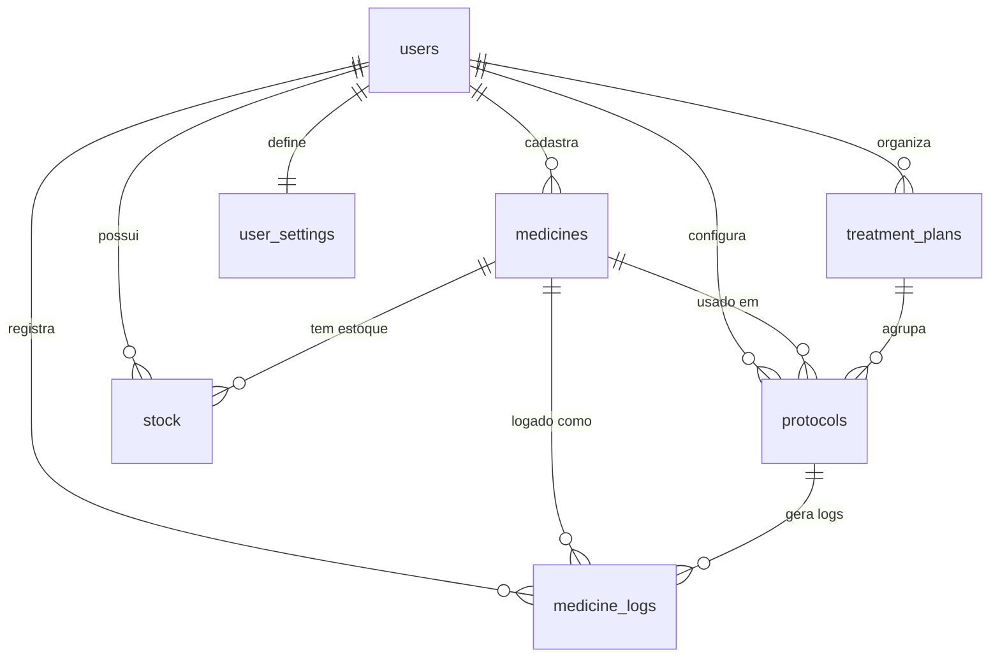

# 🗄️ Esquema do Banco de Dados

O banco de dados do **Meus Remédios** é hospedado no Supabase (PostgreSQL) e utiliza Row-Level Security (RLS) para garantir a privacidade dos dados de cada usuário.

## Diagrama de Tabelas



## Detalhes das Tabelas

### `auth.users` (Supabase Default)
Tabela interna do Supabase para gerenciamento de contas. O `id` do usuário é referenciado em todas as outras tabelas como `user_id`.

### `user_settings`
Configurações globais e integração com o Telegram.
- `id` (uuid, PK): ID único.
- `user_id` (uuid, FK, Unique): Referência ao usuário.
- `telegram_chat_id` (text): ID do chat do usuário no Telegram para notificações.
- `verification_token` (text): Código temporário para vincular o bot.

### `medicines`
Cadastro básico de medicamentos e suplementos.
- `id` (uuid, PK): ID único.
- `user_id` (uuid, FK): Dono do registro.
- `name` (text): Nome comercial.
- `laboratory` (text): Laboratório/Marca.
- `active_ingredient` (text): Princípio ativo.
- `dosage_per_pill` (numeric): Dosagem por unidade (ex: 50.0).
- `dosage_unit` (text): Unidade (mg, mcg, ml, etc).
- `type` (text): 'medicine' ou 'supplement'.

### `treatment_plans`
Agrupadores de protocolos (ex: "Protocolo Anti-Inflamatório").
- `id` (uuid, PK).
- `name` (text).
- `description` (text).
- `objective` (text).

### `protocols`
Dita como o medicamento deve ser tomado.
- `id` (uuid, PK).
- `medicine_id` (uuid, FK).
- `treatment_plan_id` (uuid, FK).
- `name` (text): Nome do protocolo.
- `frequency` (text): 'daily', 'alternate', 'weekly', 'custom', 'as_needed'.
- `time_schedule` (jsonb): Array de horários (ex: `["08:00", "20:00"]`).
- `dosage_per_intake` (numeric): Quantidade por tomada.
- `titration_status` (text): 'estável', 'titulando', 'alvo_atingido' (default: 'estável').
- `titration_schedule` (jsonb): Estágios da titulação (array de objetos).
- `current_stage_index` (int): Índice do estágio atual (default: 0).
- `stage_started_at` (timestamptz): Data de início do estágio atual.
- `active` (boolean): Se o protocolo está ativo (default: true).
- `notes` (text): Observações gerais.
- `created_at` (timestamptz).
- `user_id` (uuid, FK).

### `stock`
Controle de inventário.
- `id` (uuid, PK).
- `medicine_id` (uuid, FK).
- `quantity` (numeric): Quantidade atual em unidades.
- `purchase_date` (date).
- `expiration_date` (date).
- `unit_price` (numeric): Preço pago por unidade (ex: preço da caixa / quantidade total).

### `medicine_logs`
Histórico de doses tomadas.
- `id` (uuid, PK).
- `protocol_id` (uuid, FK).
- `medicine_id` (uuid, FK).
- `taken_at` (timestamptz): Data e hora real da tomada.
- `quantity_taken` (numeric).
- `status` (text): 'taken', 'skipped', 'late', 'missed' (default: 'taken').
- `scheduled_time` (text): Horário agendado no formato HH:MM.
- `notes` (text).

### `bot_sessions`
Sessões conversacionais do bot Telegram com TTL (Time To Live).
- `id` (uuid, PK): ID único da sessão.
- `chat_id` (text, unique): ID do chat do Telegram.
- `user_id` (uuid, FK): Referência ao usuário (opcional).
- `context` (jsonb): Estado da conversa armazenado como JSON.
- `expires_at` (timestamptz): Timestamp de expiração (TTL de 30 minutos).
- `created_at` (timestamptz): Data de criação.
- `updated_at` (timestamptz): Data da última atualização.

**Índices:**
- `idx_sessions_chat`: Índice em `chat_id` para buscas rápidas.
- `idx_sessions_expires`: Índice em `expires_at` para cleanup eficiente.
- `idx_sessions_user`: Índice em `user_id` para consultas por usuário.

**RLS Policy:**
- `Service role can manage sessions`: Permite acesso total para o service role do bot.

**Cleanup:**
Sessões expiradas são removidas automaticamente via função `cleanup_expired_bot_sessions()` chamada periodicamente.

### `medicine_stock_summary` (View)
View materializada para otimização de consultas de estoque (Onda 1.6).
- `medicine_id` (uuid): Referência ao medicamento.
- `user_id` (uuid): Dono do dado (para RLS).
- `total_quantity` (numeric): Quantidade total disponível.
- `stock_entries_count` (bigint): Número de entradas ativas.
- `oldest_entry_date` (date): Data da entrada mais antiga (PEPS/FIFO).
- `newest_entry_date` (date): Data da entrada mais recente.

**Performance:**
- ~5x mais rápida que cálculo client-side
- Usa índices otimizados: `idx_stock_medicine_user_quantity`
- Herda políticas RLS da tabela `stock`

**Funções Auxiliares:**
```sql
-- Retorna medicamentos com estoque baixo
SELECT * FROM get_low_stock_medicines(p_user_id, p_threshold);
```

---

## Row-Level Security (RLS)

Todas as tabelas possuem RLS habilitado. As políticas padrão são:
1. **SELECT**: `auth.uid() = user_id`.
2. **INSERT**: `auth.uid() = user_id`.
3. **UPDATE**: `auth.uid() = user_id`.
4. **DELETE**: `auth.uid() = user_id`.

**Nota**: O Bot do Telegram utiliza a `SUPABASE_SERVICE_ROLE_KEY` para ignorar estas políticas e gerenciar dados de múltiplos usuários de forma segura no lado do servidor.
