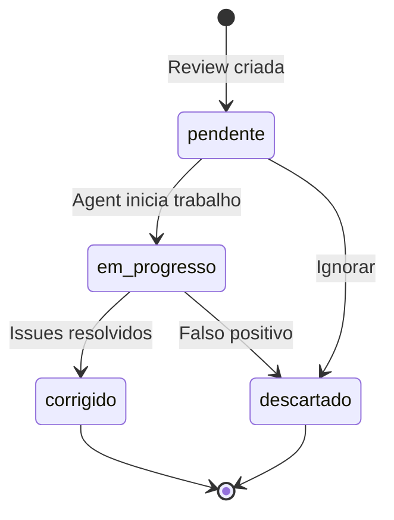

e# Protocolo Padronizado para Agents - Gemini Reviews

> **Documentação formal do protocolo de comunicação entre sistema de reviews do Gemini e agents de IA**
> **Versão:** 1.1.0 | Última atualização: 2026-02-24
> **Público-alvo:** Agents de IA e desenvolvedores

---

## 📐 Arquitetura de Dados

### Visão Geral

```
┌─────────────────┐     ┌──────────────────┐     ┌─────────────────┐
│  GitHub Actions │────▶│  Vercel API      │────▶│  Supabase       │
│  Workflow       │ JWT │  Endpoints       │ SRK │  Database       │
└─────────────────┘     └──────────────────┘     └─────────────────┘
        │                                                 │
        │                                                 │
        ▼                                                 ▼
┌─────────────────┐                             ┌─────────────────┐
│  Vercel Blob    │                             │  Source of      │
│  (Transporte)   │                             │  Truth          │
└─────────────────┘                             └─────────────────┘
```

### Camada de Transporte (Vercel Blob)

O Vercel Blob é usado como **transporte temporário** entre GitHub Actions e Vercel Endpoints:

| Aspecto | Detalhe |
|---------|---------|
| **TTL** | 7 dias |
| **Access** | Privado (token required) |
| **Conteúdo** | JSON estruturado do review |
| **Papel** | Transporte, NÃO persistência |

⚠️ **Importante:** Agents devem sempre consultar o Supabase para dados persistentes. O Blob é apenas para transporte interno do workflow.

---

## Categorias de Issues

As reviews do Gemini podem ser classificadas nas seguintes categorias:

- `estilo` - Problemas de estilo de código (nomenclatura, formatação)
- `bug` - Bugs potenciais ou erros de lógica
- `seguranca` - Problemas de segurança (injeção, XSS, etc.)
- `performance` - Oportunidades de otimização de performance
- `manutenibilidade` - Problemas que afetam a manutenibilidade do código

## Prioridades

As issues são classificadas por prioridade:

- `critica` - Issues críticos que devem ser resolvidos imediatamente
- `alta` - Issues importantes com impacto significativo
- `media` - Issues moderadas com impacto médio
- `baixa` - Issues menores ou sugestões de melhoria

---

## 📋 Visão Geral

Este documento define o protocolo padronizado para comunicação entre o sistema de reviews automáticas do Gemini Code Assist e agents de IA responsáveis por processar e resolver issues de código identificadas durante revisões de Pull Requests.

### Propósito

- **Padronizar** a comunicação entre Gemini e agents de IA
- **Estruturar** o fluxo de trabalho de resolução de issues
- **Garantir** consistência na gestão de reviews
- **Facilitar** a automação do processo de correção de código

### Escopo

Este protocolo aplica-se a:
- Endpoints API para gestão de reviews
- Estados e transições de reviews
- Formato de requisições e respostas
- Autenticação e autorização
- Webhooks para notificações em tempo real (P4.7)

---

## 🔌 Endpoints da API

Base URL: `https://api.meus-remedios.app/api`

### 1. Listar Reviews

```http
GET /gemini-reviews
```

Retorna a lista de reviews do Gemini Code Assist com suporte a filtros opcionais.

**Parâmetros de Query (opcionais):**

| Parâmetro | Tipo | Descrição | Exemplo |
|-----------|------|-----------|---------|
| `pr_number` | number | Número do PR | `42` |
| `status` | string | Status da review | `pendente` |
| `category` | string | Categoria da issue | `bug` |
| `priority` | string | Prioridade | `alta` |

**Resposta (200 OK):**

```json
{
  "success": true,
  "data": [
    {
      "id": "550e8400-e29b-41d4-a716-446655440000",
      "pr_number": 42,
      "commit_sha": "abc123def456",
      "file_path": "src/components/Button.jsx",
      "line_start": 15,
      "line_end": 20,
      "issue_hash": "hash123",
      "status": "pendente",
      "priority": "alta",
      "category": "bug",
      "title": "Possível null pointer exception",
      "description": "A variável 'user' pode ser null neste ponto",
      "suggestion": "Adicionar verificação: if (!user) return null;",
      "created_at": "2026-02-22T10:30:00.000Z",
      "updated_at": "2026-02-22T10:30:00.000Z",
      "resolved_at": null,
      "resolved_by": null
    }
  ],
  "count": 1
}
```

---

### 2. Obter Review Específica

```http
GET /gemini-reviews/:id
```

Retorna os detalhes de uma review específica pelo UUID.

**Parâmetros de Path:**

| Parâmetro | Tipo | Descrição | Obrigatório |
|-----------|------|-----------|-------------|
| `id` | string (UUID) | ID da review | Sim |

**Resposta (200 OK):**

```json
{
  "success": true,
  "data": {
    "id": "550e8400-e29b-41d4-a716-446655440000",
    "pr_number": 42,
    "commit_sha": "abc123def456",
    "file_path": "src/components/Button.jsx",
    "line_start": 15,
    "line_end": 20,
    "issue_hash": "hash123",
    "status": "pendente",
    "priority": "alta",
    "category": "bug",
    "title": "Possível null pointer exception",
    "description": "A variável 'user' pode ser null neste ponto",
    "suggestion": "Adicionar verificação: if (!user) return null;",
    "created_at": "2026-02-22T10:30:00.000Z",
    "updated_at": "2026-02-22T10:30:00.000Z",
    "resolved_at": null,
    "resolved_by": null
  }
}
```

**Resposta de Erro (404 Not Found):**

```json
{
  "success": false,
  "error": "Review não encontrada",
  "code": "NOT_FOUND"
}
```

---

### 3. Atualizar Status da Review

```http
PATCH /gemini-reviews/:id
```

Atualiza o status e resolução de uma review existente.

**Parâmetros de Path:**

| Parâmetro | Tipo | Descrição | Obrigatório |
|-----------|------|-----------|-------------|
| `id` | string (UUID) | ID da review | Sim |

**Corpo da Requisição:**

```json
{
  "status": "corrigido",
  "resolution": "fixed",
  "resolved_by": "550e8400-e29b-41d4-a716-446655440001",
  "notes": "Adicionada verificação de null conforme sugerido"
}
```

**Campos:**

| Campo | Tipo | Descrição | Obrigatório |
|-------|------|-----------|-------------|
| `status` | string | Novo status | Sim |
| `resolution` | string | Tipo de resolução | Condicional |
| `resolved_by` | string (UUID) | ID do agente/usuário | Opcional |
| `notes` | string | Notas adicionais | Opcional |

**Resposta (200 OK):**

```json
{
  "success": true,
  "data": {
    "id": "550e8400-e29b-41d4-a716-446655440000",
    "status": "corrigido",
    "resolution": "fixed",
    "resolved_at": "2026-02-22T11:45:00.000Z",
    "resolved_by": "550e8400-e29b-41d4-a716-446655440001",
    "updated_at": "2026-02-22T11:45:00.000Z"
  }
}
```

---

## 📐 Formato de Requisições/Respostas

### Headers Obrigatórios

Todas as requisições devem incluir:

| Header | Valor | Descrição |
|--------|-------|-----------|
| `Content-Type` | `application/json` | Tipo do conteúdo |
| `Authorization` | `Bearer {token}` | Token de autenticação |
| `Accept` | `application/json` | Formato de resposta esperado |

### JSON Schema - Requisição de Atualização

```json
{
  "$schema": "http://json-schema.org/draft-07/schema#",
  "type": "object",
  "required": ["status"],
  "properties": {
    "status": {
      "type": "string",
      "enum": ["pendente", "em_progresso", "corrigido", "descartado"]
    },
    "resolution": {
      "type": "string",
      "enum": ["fixed", "rejected", "partial"]
    },
    "resolved_by": {
      "type": "string",
      "format": "uuid"
    },
    "notes": {
      "type": "string",
      "maxLength": 1000
    }
  }
}
```

### Códigos de Resposta HTTP

| Código | Significado | Quando Ocorre |
|--------|-------------|---------------|
| `200` | OK | Requisição bem-sucedida |
| `201` | Created | Review criada com sucesso |
| `400` | Bad Request | Dados inválidos na requisição |
| `401` | Unauthorized | Token de autenticação ausente ou inválido |
| `403` | Forbidden | Sem permissão para acessar recurso |
| `404` | Not Found | Review não encontrada |
| `422` | Unprocessable Entity | Validação de schema falhou |
| `429` | Too Many Requests | Rate limit excedido |
| `500` | Internal Server Error | Erro interno do servidor |

---

## 🔄 Estados do Review

### Diagrama de Estados



### Estados Disponíveis

| Estado | Descrição | Transições Permitidas |
|--------|-----------|----------------------|
| `pendente` | Aguardando agent processar | `em_progresso`, `descartado` |
| `em_progresso` | Agent trabalhando na resolução | `corrigido`, `descartado` |
| `corrigido` | Issues resolvidos com sucesso | - (final) |
| `descartado` | Review descartada (falso positivo ou ignorada) | - (final) |

### Labels para Exibição

```javascript
const STATUS_LABELS = {
  pendente: 'Pendente',
  em_progresso: 'Em Progresso',
  corrigido: 'Corrigido',
  descartado: 'Descartado'
}
```

---

## ✅ Resoluções

Quando uma review é finalizada (status `corrigido`), a resolução descreve o resultado do trabalho:

### Tipos de Resolução

| Resolução | Descrição | Quando Usar |
|-----------|-----------|-------------|
| `fixed` | Issues corrigidos | Todas as issues identificadas foram resolvidas |
| `rejected` | Falsos positivos | O Gemini identificou issues que não existiam |
| `partial` | Parcialmente resolvido | Algumas issues corrigidas, outras não aplicáveis |

### Fluxo de Decisão

```
┌─────────────────┐
│  Review Final   │
│    Status       │
└────────┬────────┘
         │
    ┌────┴────┐
    ▼         ▼
┌───────┐  ┌────────┐
│Fixed? │  │False   │
│       │  │Positive│
└───┬───┘  └───┬────┘
    │          │
    ▼          ▼
┌────────┐  ┌────────┐
│ fixed  │  │rejected│
└────────┘  └────────┘
    │
    ▼
┌────────┐
│partial │ (se parcial)
└────────┘
```

---

## 📖 Exemplos de Uso

### 1. Listar Reviews Pendentes (cURL)

```bash
curl -X GET "https://api.meus-remedios.app/api/gemini-reviews?status=pendente&priority=alta" \
  -H "Content-Type: application/json" \
  -H "Authorization: Bearer ${SUPABASE_SERVICE_ROLE_KEY}" \
  -H "Accept: application/json"
```

**Resposta Esperada:**

```json
{
  "success": true,
  "data": [
    {
      "id": "550e8400-e29b-41d4-a716-446655440000",
      "pr_number": 42,
      "commit_sha": "abc123def456",
      "file_path": "src/services/userService.js",
      "line_start": 45,
      "line_end": 50,
      "issue_hash": "hash456",
      "status": "pendente",
      "priority": "alta",
      "category": "seguranca",
      "title": "Possível SQL Injection",
      "description": "Query construída com interpolação de string",
      "suggestion": "Usar prepared statements ou ORM",
      "created_at": "2026-02-22T10:30:00.000Z",
      "updated_at": "2026-02-22T10:30:00.000Z",
      "resolved_at": null,
      "resolved_by": null
    }
  ],
  "count": 1
}
```

---

### 2. Obter Review Específica (cURL)

```bash
curl -X GET "https://api.meus-remedios.app/api/gemini-reviews/550e8400-e29b-41d4-a716-446655440000" \
  -H "Content-Type: application/json" \
  -H "Authorization: Bearer ${SUPABASE_SERVICE_ROLE_KEY}" \
  -H "Accept: application/json"
```

**Resposta Esperada:**

```json
{
  "success": true,
  "data": {
    "id": "550e8400-e29b-41d4-a716-446655440000",
    "pr_number": 42,
    "commit_sha": "abc123def456",
    "file_path": "src/services/userService.js",
    "line_start": 45,
    "line_end": 50,
    "issue_hash": "hash456",
    "status": "pendente",
    "priority": "alta",
    "category": "seguranca",
    "title": "Possível SQL Injection",
    "description": "Query construída com interpolação de string",
    "suggestion": "Usar prepared statements ou ORM",
    "created_at": "2026-02-22T10:30:00.000Z",
    "updated_at": "2026-02-22T10:30:00.000Z",
    "resolved_at": null,
    "resolved_by": null
  }
}
```

---

### 3. Atualizar Status - Issue Corrigida (cURL)

```bash
curl -X PATCH "https://api.meus-remedios.app/api/gemini-reviews/550e8400-e29b-41d4-a716-446655440000" \
  -H "Content-Type: application/json" \
  -H "Authorization: Bearer ${SUPABASE_SERVICE_ROLE_KEY}" \
  -H "Accept: application/json" \
  -d '{
    "status": "corrigido",
    "resolution": "fixed",
    "resolved_by": "550e8400-e29b-41d4-a716-446655440001",
    "notes": "Substituída interpolação por prepared statements usando Supabase query builder"
  }'
```

**Resposta Esperada:**

```json
{
  "success": true,
  "data": {
    "id": "550e8400-e29b-41d4-a716-446655440000",
    "status": "corrigido",
    "resolution": "fixed",
    "resolved_at": "2026-02-22T11:45:00.000Z",
    "resolved_by": "550e8400-e29b-41d4-a716-446655440001",
    "updated_at": "2026-02-22T11:45:00.000Z"
  }
}
```

---

### 4. Descartar Review - Falso Positivo (cURL)

```bash
curl -X PATCH "https://api.meus-remedios.app/api/gemini-reviews/550e8400-e29b-41d4-a716-446655440000" \
  -H "Content-Type: application/json" \
  -H "Authorization: Bearer ${SUPABASE_SERVICE_ROLE_KEY}" \
  -H "Accept: application/json" \
  -d '{
    "status": "descartado",
    "resolution": "rejected",
    "resolved_by": "550e8400-e29b-41d4-a716-446655440002",
    "notes": "Falso positivo - a query já utiliza prepared statements internamente"
  }'
```

**Resposta Esperada:**

```json
{
  "success": true,
  "data": {
    "id": "550e8400-e29b-41d4-a716-446655440000",
    "status": "descartado",
    "resolution": "rejected",
    "resolved_at": "2026-02-22T11:50:00.000Z",
    "resolved_by": "550e8400-e29b-41d4-a716-446655440002",
    "updated_at": "2026-02-22T11:50:00.000Z"
  }
}
```

---

### 5. Usando JavaScript/Node.js

```javascript
// Listar reviews pendentes
const response = await fetch(
  'https://api.meus-remedios.app/api/gemini-reviews?status=pendente',
  {
    method: 'GET',
    headers: {
      'Content-Type': 'application/json',
      'Authorization': `Bearer ${process.env.SUPABASE_SERVICE_ROLE_KEY}`,
      'Accept': 'application/json'
    }
  }
);

const { success, data, count } = await response.json();

if (success) {
  console.log(`Encontradas ${count} reviews pendentes:`);
  data.forEach(review => {
    console.log(`- [${review.priority}] ${review.title} (${review.file_path}:${review.line_start})`);
  });
}
```

---

## 🔐 Autenticação

### Bearer Token

Todas as requisições à API de Gemini Reviews requerem autenticação via **Bearer Token** no header `Authorization`.

```http
Authorization: Bearer {SUPABASE_SERVICE_ROLE_KEY}
```

### Obtendo o Token

O token é a **Service Role Key** do Supabase, que deve ser configurada como variável de ambiente:

```bash
# .env
SUPABASE_SERVICE_ROLE_KEY=eyJhbGciOiJIUzI1NiIs...
```

⚠️ **ATENÇÃO:** A Service Role Key possui permissões elevadas e bypassa RLS. NUNCA exponha este token no frontend ou em repositórios públicos.

### Verificação de Permissões

Além do token válido, o usuário/agente deve ser um administrador. A verificação é feita comparando o `telegram_chat_id` com o `ADMIN_CHAT_ID` configurado:

```javascript
// Verificação de acesso admin
const { data: { user }, error } = await supabase.auth.getUser(token);

if (error || !user) {
  throw new Error('Não autorizado');
}

// Verificar se é admin
const { data: userData } = await supabase
  .from('user_settings')
  .select('telegram_chat_id')
  .eq('user_id', user.id)
  .single();

if (userData.telegram_chat_id !== process.env.ADMIN_CHAT_ID) {
  throw new Error('Acesso negado - requer privilégios de administrador');
}
```

---

## 🔔 Webhooks (Integração P4.7)

### Evento: `gemini_review_available`

Disparado quando uma nova review do Gemini é criada e está disponível para processamento.

### Payload do Webhook

```json
{
  "event": "gemini_review_available",
  "timestamp": "2026-02-22T10:30:00.000Z",
  "data": {
    "review_id": "550e8400-e29b-41d4-a716-446655440000",
    "pr_number": 42,
    "commit_sha": "abc123def456",
    "file_path": "src/components/Button.jsx",
    "priority": "alta",
    "category": "bug",
    "title": "Possível null pointer exception",
    "url": "https://api.meus-remedios.app/api/gemini-reviews/550e8400-e29b-41d4-a716-446655440000"
  }
}
```

### Como Responder ao Webhook

O agent deve:

1. **Validar** a assinatura do webhook (HMAC)
2. **Obter** detalhes completos via API
3. **Atualizar** status para `em_progresso`
4. **Processar** as correções necessárias
5. **Atualizar** status para `corrigido` ou `descartado`

```javascript
// Exemplo de handler de webhook
app.post('/webhook/gemini', async (req, res) => {
  const { event, data } = req.body;
  
  if (event === 'gemini_review_available') {
    // 1. Atualizar status
    await fetch(`${API_URL}/gemini-reviews/${data.review_id}`, {
      method: 'PATCH',
      headers: { 'Authorization': `Bearer ${TOKEN}` },
      body: JSON.stringify({ status: 'em_progresso' })
    });
    
    // 2. Obter detalhes completos
    const review = await fetch(`${API_URL}/gemini-reviews/${data.review_id}`, {
      headers: { 'Authorization': `Bearer ${TOKEN}` }
    }).then(r => r.json());
    
    try {
      // 3. Processar (implementação específica)
      await processReview(review.data);
      
      // 4. Finalizar com sucesso
      await fetch(`${API_URL}/gemini-reviews/${data.review_id}`, {
        method: 'PATCH',
        headers: { 'Authorization': `Bearer ${TOKEN}` },
        body: JSON.stringify({
          status: 'corrigido',
          resolution: 'fixed'
        })
      });
    } catch (error) {
      console.error('Falha ao processar a review:', error);
      // Reverter para pendente em caso de falha
      await fetch(`${API_URL}/gemini-reviews/${data.review_id}`, {
        method: 'PATCH',
        headers: { 'Authorization': `Bearer ${TOKEN}` },
        body: JSON.stringify({
          status: 'pendente',
          notes: `Falha no processamento automático: ${error.message}`
        })
      });
    }
  }
  
  res.status(200).json({ received: true });
});
```

---

## 📚 Referências

- [GEMINI_INTEGRATION.md](./GEMINI_INTEGRATION.md) - Documentação da integração GitHub Actions
- [TESTING.md](./TESTING.md) - Guia de testes
- [GIT_WORKFLOW.md](./GIT_WORKFLOW.md) - Workflow de Git

---

## 📝 Changelog

| Versão | Data | Descrição |
|--------|------|-----------|
| 1.1.0 | 2026-02-24 | Adicionada seção de arquitetura de dados com Vercel Blob |
| 1.0.0 | 2026-02-22 | Versão inicial do protocolo |

---

## 🤝 Contribuição

Para sugerir melhorias a este protocolo:

1. Crie uma issue no GitHub descrevendo a proposta
2. Discuta com a equipe na issue
3. Submeta um PR com as alterações
4. Aguarde review e aprovação

---

*Documentação mantida pela equipe Meus Remédios*  
*Para dúvidas, consulte a equipe de arquitetura*
