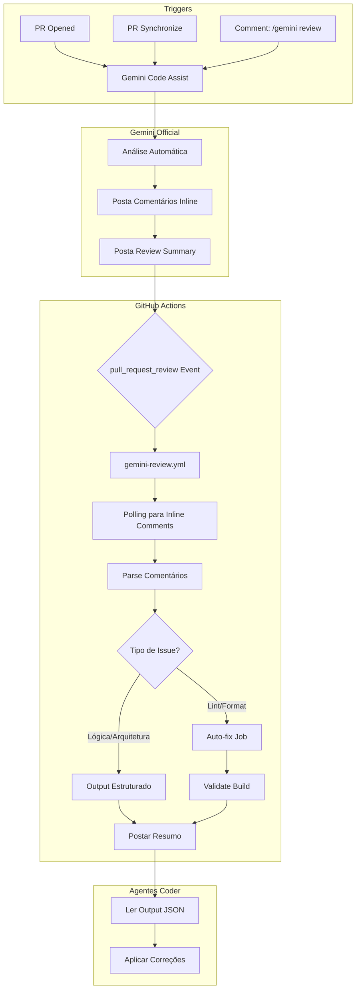

# Gemini Code Assist Integration

> **Documentação oficial da integração GitHub Actions + Gemini Code Assist**  
> **Versão:** 1.0.0 | Última atualização: 2026-02-19

---

## 📋 Visão Geral

O projeto **Meus Remédios** utiliza o [Gemini Code Assist](https://cloud.google.com/gemini/docs/codeassist) para revisão automática de código em Pull Requests. Esta integração foi projetada para:

- **Automatizar** a revisão de código com feedback em tempo real
- **Estruturar** os comentários do Gemini para consumo por agentes de IA
- **Otimizar** o tempo de revisão e reduzir minutos de GitHub Actions

---

## 🏗️ Arquitetura

### Fluxo de Revisão



### Componentes

| Componente | Arquivo | Função |
|------------|---------|--------|
| **Workflow** | `.github/workflows/gemini-review.yml` | Orquestra toda a integração |
| **Parser** | `.github/scripts/parse-gemini-comments.js` | Extrai e categoriza comentários |
| **Testes** | `.github/scripts/__tests__/parse-gemini-comments.test.js` | Validação do parser |
| **Config** | `.gemini/config.yaml` | Configuração do Gemini Code Assist |

---

## ⚙️ Workflow: `gemini-review.yml`

### Triggers

```yaml
on:
  pull_request_review:
    types: [submitted]
  issue_comment:
    types: [created]
  pull_request:
    types: [opened, synchronize]
```

| Evento | Condição | Descrição |
|--------|----------|-----------|
| `pull_request_review` | `submitted` | Dispara quando Gemini posta review |
| `issue_comment` | Contém `/gemini review` | Trigger manual via comentário |
| `pull_request` | `opened`, `synchronize` | Trigger inicial para detectar PR |

### Jobs

#### 1. Detect Gemini Review

```yaml
detect:
  runs-on: ubuntu-latest
  outputs:
    pr_number: ${{ steps.detect.outputs.pr_number }}
    should_run: ${{ steps.detect.outputs.should_run }}
```

**Função:** Detecta se o PR deve ser processado e extrai o número do PR.

#### 2. Poll for Gemini Review

```yaml
poll:
  needs: detect
  if: needs.detect.outputs.should_run == 'true'
  runs-on: ubuntu-latest
```

**Função:** Aguarda o Gemini postar o review inicial (polling com timeout de 5 minutos).

#### 3. Parse Gemini Comments

```yaml
parse:
  needs: [detect, poll]
  if: always() && needs.detect.outputs.should_run == 'true'
  runs-on: ubuntu-latest
```

**Função:** 
- Aguarda inline comments via polling (10 attempts × 15s = 2.5 min)
- Executa parser para extrair issues
- Gera output estruturado em `.gemini-output/review-{pr_number}.json`
- Faz upload do artifact

#### 4. Validate Build

```yaml
validate:
  needs: [detect, parse]
  if: always() && needs.detect.outputs.should_run == 'true'
  runs-on: ubuntu-latest
```

**Função:** Executa lint, smoke tests, critical tests e build.

#### 5. Apply Auto-Fixes

```yaml
auto-fix:
  needs: [detect, parse]
  if: always() && needs.parse.outputs.auto_fixable == 'true'
  runs-on: ubuntu-latest
```

**Função:** Aplica correções automáticas para issues simples (formatting, style).

#### 6. Post Summary

```yaml
post-summary:
  needs: [detect, parse, validate]
  if: always() && needs.detect.outputs.should_run == 'true'
  runs-on: ubuntu-latest
```

**Função:** Posta resumo estruturado no PR com estatísticas e tabela de issues.

---

## 📝 Parser: `parse-gemini-comments.js`

### Funções Principais

#### `parseGeminiComment(comment)`

Extrai informações estruturadas de um comentário do Gemini.

**Input:** Objeto de comentário da API do GitHub

**Output:**
```javascript
{
  id: 12345,
  file: 'src/services/api/medicineService.js',
  line: 42,
  issue: 'Missing error handling',
  suggestion: 'try { ... } catch (error) { ... }',
  priority: 'HIGH', // CRITICAL | HIGH | MEDIUM
  auto_fixable: false,
  raw: '... corpo completo do comentário ...',
  url: 'https://github.com/...'
}
```

#### `categorizeIssues(parsedComments)`

Categoriza issues em três grupos:

```javascript
{
  autoFixable: [...],   // Issues simples de estilo/formatação
  needsAgent: [...],    // Issues de lógica/arquitetura
  critical: [...]       // Issues de segurança ou críticos
}
```

#### `normalizePriority(priority)`

Normaliza a prioridade extraída do Gemini.

| Input | Output |
|-------|--------|
| `critical` | `CRITICAL` |
| `high` | `HIGH` |
| `medium` | `MEDIUM` |

### Formato de Prioridade do Gemini

O Gemini Code Assist usa **image badges** para indicar prioridade:

```markdown


```

O parser extrai a prioridade via regex:

```javascript
const priorityMatch = body.match(/!\[(critical|high|medium)\].*\.svg/);
```

---

## 📁 Output Estruturado

### Localização

```
.gemini-output/
└── review-{pr_number}.json
```

### Formato

```json
{
  "pr_number": 71,
  "timestamp": "2026-02-19T02:17:30Z",
  "summary": {
    "total_issues": 7,
    "auto_fixable": 0,
    "needs_agent": 7,
    "critical": 0
  },
  "issues": [
    {
      "id": 12345,
      "file": "src/utils/validationHelper.js",
      "line": 13,
      "issue": "Consider adding JSDoc documentation",
      "suggestion": "/** * Validates email format... */",
      "priority": "MEDIUM",
      "auto_fixable": false,
      "url": "https://github.com/..."
    }
  ],
  "critical_requires_human": false
}
```

### Consumo por Agentes Coder

```javascript
// Exemplo de uso por agente de IA
const fs = require('fs');
const output = JSON.parse(fs.readFileSync('.gemini-output/review-71.json'));

// Filtrar issues que requerem intervenção
const needsAttention = output.issues.filter(i => !i.auto_fixable);

// Processar cada issue
for (const issue of needsAttention) {
  console.log(`File: ${issue.file}:${issue.line}`);
  console.log(`Issue: ${issue.issue}`);
  console.log(`Suggestion: ${issue.suggestion}`);
}
```

---

## 🚀 Como Usar

### Revisão Automática

O Gemini Code Assist é invocado automaticamente quando:

1. Um PR é aberto
2. Um PR é atualizado (synchronize)
3. Um comentário com `/gemini review` é postado

### Revisão Manual

Para solicitar uma nova revisão:

```markdown
/gemini review
```

Ou mencione o bot:

```markdown
@gemini-code-assist please review this PR
```

### Verificar Output

1. Acesse a tab **Actions** no GitHub
2. Selecione o workflow run do `Gemini Code Review Parser`
3. Baixe o artifact `gemini-review-output`
4. Extraia e leia o JSON

---

## 📊 Resumo Postado no PR

O workflow posta um comentário estruturado no PR:

```markdown
## 🤖 Gemini Code Review - Resumo

### 📊 Estatísticas

| Categoria | Quantidade |
|-----------|------------|
| Total de Issues | 7 |
| Auto-fixable | 0 |
| Requer Agente | 7 |
| Críticos | 0 |

### 📋 Issues Principais

| Arquivo | Linha | Severidade | Auto-fixable |
|---------|-------|------------|--------------|
| validationHelper.js | 13 | MEDIUM | ❌ |
| validationHelper.js | 26 | MEDIUM | ❌ |

### ✅ Validação Pós-Fix

- **Lint:** ✅ Passou
- **Smoke Tests:** ✅ Passou

### 📁 Output Estruturado

O arquivo `.gemini-output/review-71.json` foi gerado com todos os issues parseados.
```

---

## 🔧 Configuração

### `.gemini/config.yaml`

```yaml
code_review:
  comment_severity_threshold: MEDIUM
  max_review_comments: 20
  
  pull_request_opened:
    help: true
    summary: true
    code_review: true
    
  pull_request_synchronize:
    code_review: true
```

### Variáveis de Ambiente

| Variável | Descrição | Obrigatório |
|----------|-----------|-------------|
| `GITHUB_TOKEN` | Token automático do GitHub Actions | Sim (automático) |
| `GEMINI_BOT_LOGIN` | Login do bot do Gemini | Sim (hardcoded) |

---

## 🧪 Testes

### Executar Testes do Parser

```bash
# Executar todos os testes
node .github/scripts/__tests__/parse-gemini-comments.test.js

# Executar com verbose
node --test .github/scripts/__tests__/parse-gemini-comments.test.js
```

### Cobertura

- 11 testes unitários
- Cobre parsing de prioridades, extração de issues, categorização
- Usa dados reais do PR #25 como fixture

---

## 🐛 Troubleshooting

### Problema: Nenhum comentário encontrado

**Sintoma:** `Total de Issues: 0`

**Causas possíveis:**
1. Gemini ainda não postou inline comments
2. Polling timeout excedido
3. PR não tem mudanças de código

**Solução:**
- Aguarde alguns segundos e solicite nova revisão com `/gemini review`
- Verifique logs do workflow para ver se polling encontrou comentários

### Problema: Artifact não encontrado

**Sintoma:** `No files were found with the provided path`

**Causa:** Diretório `.gemini-output` é hidden (começa com `.`)

**Solução:** Já corrigido com `include-hidden-files: true` no workflow

### Problema: Workflow não dispara

**Sintoma:** Workflow não aparece na tab Actions

**Causas possíveis:**
1. PR não atende aos critérios de trigger
2. Gemini não está configurado para o repositório

**Solução:**
- Verifique se o app Gemini Code Assist está instalado no repositório
- Use `/gemini review` para trigger manual

---

## 🔮 Evoluções Futuras (P2)

### 1. Integração com Agentes Coder

**Objetivo:** Permitir que agentes de IA (como Kilo Code) consumam automaticamente o output estruturado e apliquem correções.

**Implementação proposta:**
```yaml
# Novo job no workflow
agent-fix:
  needs: parse
  if: needs.parse.outputs.needs_agent == 'true'
  runs-on: ubuntu-latest
  steps:
    - name: Trigger Coder Agent
      uses: actions/github-script@v7
      with:
        script: |
          // Chamar API do agente coder
          await fetch('https://api.kilocode.dev/fix', {
            method: 'POST',
            body: JSON.stringify({
              pr_number: ${{ needs.detect.outputs.pr_number }},
              issues: require('./.gemini-output/review-${{ needs.detect.outputs.pr_number }}.json').issues
            })
          });
```

### 2. Labels Automáticas

**Objetivo:** Aplicar labels automaticamente baseado nos issues encontrados.

**Labels propostas:**
- `🤖 gemini-reviewed` - Review completo
- `🔧 auto-fix-pending` - Aguardando auto-fix
- `👀 needs-human-review` - Issues críticos
- `🔒 security-issue` - Vulnerabilidades detectadas

### 3. Métricas de Review

**Objetivo:** Rastrear efetividade da integração.

**Métricas propostas:**
- Tempo médio de review
- Taxa de auto-fix
- Falsos positivos
- Issues por categoria

### 4. Cache de Reviews

**Objetivo:** Evitar re-análise de código não alterado.

**Implementação:**
- Hash do conteúdo do arquivo
- Comparar com review anterior
- Reutilizar comentários para linhas não alteradas

### 5. Filtros de Path Inteligentes

**Objetivo:** Focar em código crítico e ignorar arquivos irrelevantes.

**Paths a ignorar:**
```yaml
ignore:
  - 'docs/archive/**'
  - 'dist/**'
  - '*.md'
  - '.github/**/*.yml'
```

### 6. Notificações Slack/Discord

**Objetivo:** Notificar equipe sobre issues críticos.

**Implementação:**
```yaml
notify:
  needs: parse
  if: needs.parse.outputs.critical == 'true'
  runs-on: ubuntu-latest
  steps:
    - name: Notify Slack
      uses: slackapi/slack-github-action@v1
      with:
        channel-id: 'C0123456789'
        slack-message: '🚨 Critical issues found in PR #${{ needs.detect.outputs.pr_number }}'
```

---

## 📚 Referências

- [Gemini Code Assist Documentation](https://cloud.google.com/gemini/docs/codeassist)
- [GitHub Pull Request Review Events](https://docs.github.com/en/developers/webhooks-and-events/webhooks/webhook-events-and-payloads#pull_request_review)
- [GitHub Actions Workflow Syntax](https://docs.github.com/en/actions/reference/workflow-syntax-for-github-actions)
- [Plano de Refatoração Original](../../plans/PLANO_REFATORACAO_GEMINI_INTEGRATION.md)

---

*Última atualização: 2026-02-19*  
*Versão: 1.0.0*  
*Status: ✅ Implementado e Validado*
