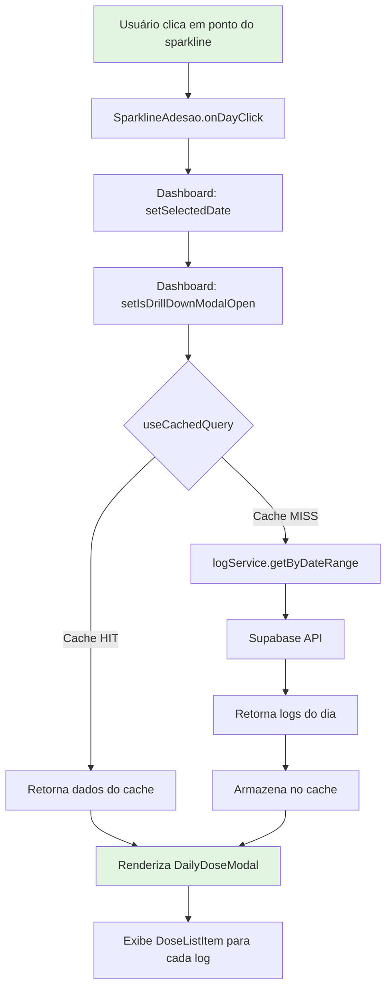
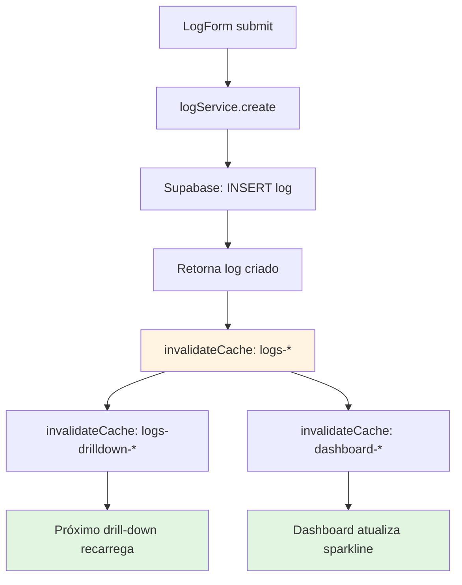
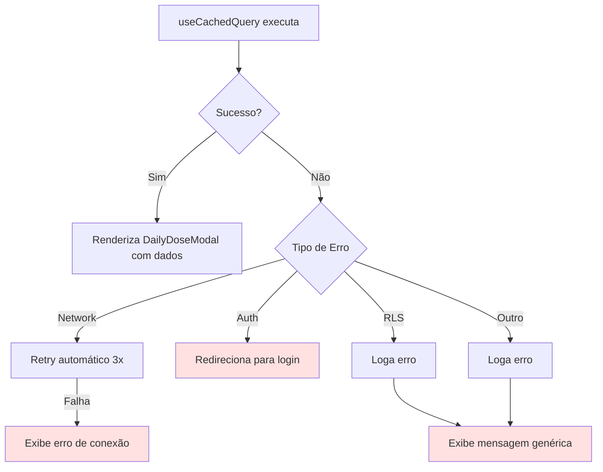

# Especificação Técnica: Sparkline Drill-Down

**Projeto:** Meus Remédios - Sistema de Gestão de Medicamentos  
**Versão:** 1.0.0  
**Data:** 2026-02-11  
**Status:** Pronto para Implementação

---

## 1. Visão Geral da Funcionalidade

### 1.1 Descrição
A funcionalidade de Drill-Down no Sparkline permite que os usuários cliquem em marcadores individuais do gráfico de adesão para visualizar detalhes completos das doses registradas naquele dia específico.

### 1.2 Objetivos
- Melhorar a transparência da adesão ao tratamento
- Permitir auditoria rápida de doses tomadas vs. perdidas
- Facilitar a navegação para correções de registros

### 1.3 Funcionalidades Principais
| Funcionalidade | Descrição |
|----------------|-----------|
| Click em Pontos | Cada ponto do sparkline é clicável e aciona o modal |
| Modal Detalhado | Exibe todas as doses prescritas para o dia selecionado |
| Status Visual | Distinção clara entre doses tomadas e perdidas |
| Navegação | Permite navegar para o registro de dose caso ausente |

---

## 2. Contrato de API

### 2.1 Análise de APIs Existentes

Após análise do [`logService.getByDateRange()`](../../src/services/api/logService.js:273), conclui-se que **nenhum novo endpoint é necessário**.

### 2.2 API Existente - logService.getByDateRange()

```typescript
interface LogService {
  /**
   * Busca logs por intervalo de datas
   * @param startDate - Data inicial (YYYY-MM-DD)
   * @param endDate - Data final (YYYY-MM-DD)  
   * @param limit - Limite de resultados (padrão: 50)
   * @param offset - Offset para paginação
   */
  getByDateRange(
    startDate: string,
    endDate: string,
    limit?: number,
    offset?: number
  ): Promise<PaginatedResult<Log>>
}
```

### 2.3 Estrutura de Resposta

```typescript
interface PaginatedResult<T> {
  data: T[]
  total: number
  hasMore: boolean
}

interface Log {
  id: string                    // UUID
  user_id: string              // UUID
  protocol_id: string | null
  medicine_id: string          // UUID
  taken_at: string             // ISO 8601 datetime
  quantity_taken: number       // Comprimidos (1-100)
  notes: string | null
  created_at: string
  updated_at: string
  protocol?: Protocol          // Join automático
  medicine?: Medicine          // Join automático
}
```

### 2.4 Uso para Data Única

```javascript
// Exemplo: Buscar logs para 2026-02-11
const { data, total } = await logService.getByDateRange('2026-02-11', '2026-02-11')
// Retorna todas as doses registradas naquele dia
```

### 2.5 Tratamento de Erros

| Código | Descrição | Ação |
|--------|-----------|------|
| `AUTH_ERROR` | Usuário não autenticado | Redirecionar para login |
| `RLS_VIOLATION` | Violação de política RLS | Logar erro, mostrar mensagem genérica |
| `NETWORK_ERROR` | Falha de conexão | Retry automático (3x) + mensagem de erro |
| `VALIDATION_ERROR` | Dados inválidos | Impossível (validação Zod no service) |

---

## 3. Mudanças no Gerenciamento de Estado

### 3.1 Novos Estados em Dashboard.jsx

```javascript
// src/views/Dashboard.jsx

export default function Dashboard({ onNavigate }) {
  // ... estados existentes ...
  
  // === NOVOS ESTADOS PARA DRILL-DOWN ===
  
  /**
   * Data selecionada no sparkline
   * @type {string | null} - Formato 'YYYY-MM-DD'
   */
  const [selectedDate, setSelectedDate] = useState(null)
  
  /**
   * Controle de abertura do modal
   * @type {boolean}
   */
  const [isDrillDownModalOpen, setIsDrillDownModalOpen] = useState(false)
  
  // ... resto do componente ...
}
```

### 3.2 Chaves de Cache

```javascript
// Chave de cache para dados de uma data específica
const DRILLDOWN_CACHE_KEY = `logs-drilldown-${date}`  // Ex: 'logs-drilldown-2026-02-11'

// Configuração de cache
const cacheConfig = {
  staleTime: 60 * 1000,      // 1 minuto (dados de dia passado raramente mudam)
  enabled: !!selectedDate     // Só executa quando há data selecionada
}
```

### 3.3 Hook useCachedQuery para Drill-Down

```javascript
const {
  data: dayLogs,
  isLoading: isDayLogsLoading,
  error: dayLogsError
} = useCachedQuery(
  selectedDate ? `logs-drilldown-${selectedDate}` : null,
  () => logService.getByDateRange(selectedDate, selectedDate, 50),
  {
    enabled: !!selectedDate,
    staleTime: 60000,
    onError: (err) => {
      console.error('Erro ao carregar logs do dia:', err)
      analyticsService.track('drilldown_error', { error: err.message, date: selectedDate })
    }
  }
)
```

### 3.4 Reset de Estado no Fechamento do Modal

```javascript
const handleCloseDrillDown = () => {
  setIsDrillDownModalOpen(false)
  // Aguardar animação de fechamento antes de limpar data
  setTimeout(() => {
    setSelectedDate(null)
  }, 300)
}
```

---

## 4. Atualizações na Hierarquia de Componentes

### 4.1 SparklineAdesao.jsx - Modificações

#### Novas Props

```typescript
interface SparklineAdesaoProps {
  adherenceByDay: Array<{
    date: string        // 'YYYY-MM-DD'
    adherence: number   // 0-100
    taken: number
    expected: number
  }>
  size?: 'small' | 'medium' | 'large'
  showAxis?: boolean
  showTooltip?: boolean
  className?: string
  onDayClick?: (dayData: DayData) => void  // NOVO
}

interface DayData {
  date: string
  dayName: string
  adherence: number
  taken: number
  expected: number
}
```

#### Modificações no SVG

```jsx
// Adicionar cursor pointer e handler de click nos círculos
{dataPoints.map((d, i) => (
  <motion.circle
    key={d.date}
    cx={d.x}
    cy={d.y}
    r={size === 'small' ? 1.5 : 2}
    fill={getAdherenceColor(d.adherence)}
    className="sparkline-dot"
    // NOVO: Handler de click individual
    onClick={(e) => {
      e.stopPropagation() // Evitar propagação para container
      onDayClick?.(d)
    }}
    // NOVO: Cursor pointer quando clicável
    style={{ 
      cursor: onDayClick ? 'pointer' : 'default',
      pointerEvents: onDayClick ? 'all' : 'none'
    }}
    // NOVO: Atributos de acessibilidade
    role="button"
    tabIndex={onDayClick ? 0 : -1}
    aria-label={`Ver detalhes de ${d.dayName}: ${d.adherence}% de adesão`}
    // Handlers de teclado
    onKeyDown={(e) => {
      if (e.key === 'Enter' || e.key === ' ') {
        e.preventDefault()
        onDayClick?.(d)
      }
    }}
    initial={{ scale: 0 }}
    animate={{ scale: 1 }}
    transition={{ 
      delay: prefersReducedMotion ? 0 : i * 0.1,
      duration: 0.2
    }}
  />
))}
```

### 4.2 DailyDoseModal - Novo Componente

#### Props Interface

```typescript
interface DailyDoseModalProps {
  date: string | null              // Data selecionada
  isOpen: boolean                  // Controle de visibilidade
  onClose: () => void              // Handler de fechamento
  logs: Log[]                      // Logs do dia (de useCachedQuery)
  isLoading: boolean               // Estado de loading
  error: Error | null              // Erro se houver
  dailySummary?: {                 // Resumo do dia (de adherenceByDay)
    adherence: number
    taken: number
    expected: number
  }
}
```

#### Estrutura do Componente

```jsx
// src/components/dashboard/DailyDoseModal.jsx
import Modal from '../ui/Modal'
import Loading from '../ui/Loading'
import EmptyState from '../ui/EmptyState'
import DoseListItem from './DoseListItem'

export function DailyDoseModal({
  date,
  isOpen,
  onClose,
  logs,
  isLoading,
  error,
  dailySummary
}) {
  const formatDate = (dateStr) => {
    const date = new Date(dateStr + 'T00:00:00')
    return date.toLocaleDateString('pt-BR', {
      weekday: 'long',
      day: 'numeric',
      month: 'long'
    })
  }

  return (
    <Modal
      isOpen={isOpen}
      onClose={onClose}
      title={date ? formatDate(date) : ''}
    >
      <div className="daily-dose-modal">
        {/* Header com resumo */}
        {dailySummary && (
          <div className="daily-dose-summary">
            <span className={`adherence-badge adherence-${
              dailySummary.adherence >= 80 ? 'good' :
              dailySummary.adherence >= 50 ? 'warning' : 'poor'
            }`}>
              {dailySummary.adherence}% adesão
            </span>
            <span className="dose-count">
              {dailySummary.taken} de {dailySummary.expected} doses
            </span>
          </div>
        )}

        {/* Estados de loading/erro/vazio */}
        {isLoading && <Loading message="Carregando doses..." />}
        
        {error && (
          <EmptyState
            icon="⚠️"
            title="Erro ao carregar"
            message="Não foi possível carregar os dados deste dia."
          />
        )}

        {!isLoading && !error && logs.length === 0 && (
          <EmptyState
            icon="📋"
            title="Nenhum registro"
            message={`Nenhuma dose registrada neste dia.`}
          />
        )}

        {/* Lista de doses */}
        {!isLoading && !error && logs.length > 0 && (
          <div className="dose-list" role="list">
            {logs.map((log) => (
              <DoseListItem
                key={log.id}
                log={log}
                isTaken={true}
              />
            ))}
          </div>
        )}
      </div>
    </Modal>
  )
}
```

### 4.3 DoseListItem - Novo Subcomponente

```typescript
interface DoseListItemProps {
  log: Log
  isTaken: boolean
  onClick?: () => void
}
```

```jsx
// src/components/dashboard/DoseListItem.jsx
import { motion } from 'framer-motion'

export function DoseListItem({ log, isTaken, onClick }) {
  const formatTime = (dateStr) => {
    const date = new Date(dateStr)
    return date.toLocaleTimeString('pt-BR', {
      hour: '2-digit',
      minute: '2-digit'
    })
  }

  return (
    <motion.div
      className={`dose-list-item dose-list-item--${isTaken ? 'taken' : 'missed'}`}
      role="listitem"
      onClick={onClick}
      initial={{ opacity: 0, y: 10 }}
      animate={{ opacity: 1, y: 0 }}
      transition={{ duration: 0.2 }}
    >
      <div className="dose-status-icon" aria-hidden="true">
        {isTaken ? '✅' : '❌'}
      </div>
      
      <div className="dose-info">
        <span className="dose-medicine-name">
          {log.medicine?.name || 'Remédio'}
        </span>
        <span className="dose-protocol-name">
          {log.protocol?.name || 'Protocolo'}
        </span>
      </div>
      
      <div className="dose-meta">
        <time className="dose-time" dateTime={log.taken_at}>
          {formatTime(log.taken_at)}
        </time>
        <span className="dose-quantity">
          {log.quantity_taken} {log.quantity_taken === 1 ? 'comprimido' : 'comprimidos'}
        </span>
      </div>
    </motion.div>
  )
}
```

### 4.4 Uso em Dashboard.jsx

```jsx
// Integração no Dashboard
<SparklineAdesao
  adherenceByDay={dailyAdherence}
  onDayClick={(dayData) => {
    setSelectedDate(dayData.date)
    setIsDrillDownModalOpen(true)
    analyticsService.track('sparkline_drilldown_opened', {
      date: dayData.date,
      adherence: dayData.adherence
    })
  }}
/>

<DailyDoseModal
  date={selectedDate}
  isOpen={isDrillDownModalOpen}
  onClose={handleCloseDrillDown}
  logs={dayLogs?.data || []}
  isLoading={isDayLogsLoading}
  error={dayLogsError}
  dailySummary={dailyAdherence.find(d => d.date === selectedDate)}
/>
```

---

## 5. Diagramas de Fluxo de Dados

### 5.1 Fluxo Principal: Click no Sparkline



### 5.2 Fluxo de Invalidação de Cache



### 5.3 Fluxo de Tratamento de Erros



---

## 6. Requisitos de Acessibilidade

### 6.1 Navegação por Teclado

| Elemento | Tecla | Ação |
|----------|-------|------|
| Ponto do Sparkline | `Tab` | Foco no ponto clicável |
| Ponto do Sparkline | `Enter` | Abre modal do dia |
| Ponto do Sparkline | `Space` | Abre modal do dia |
| Modal Aberto | `Escape` | Fecha modal |
| Lista de Doses | `Tab` | Navega entre itens |
| Item de Dose | `Enter` | Ação secundária (se houver) |

### 6.2 Atributos ARIA

```jsx
// SparklineAdesao.jsx - Container
<div
  role="img"
  aria-label={`Gráfico de adesão: ${stats.average}% média em 7 dias`}
>
  
// Pontos clicáveis
<motion.circle
  role="button"
  tabIndex={onDayClick ? 0 : -1}
  aria-label={`Ver detalhes de ${d.dayName}: ${d.adherence}% de adesão`}
/>

// DailyDoseModal.jsx
<Modal
  role="dialog"
  aria-modal="true"
  aria-labelledby="modal-title"
>
  <h2 id="modal-title">{formatDate(date)}</h2>
  
// Lista de doses
<div role="list" aria-label="Doses registradas neste dia">
  <DoseListItem role="listitem" />
</div>

// Status de adesão
<span 
  className="adherence-badge"
  aria-live="polite"
  aria-atomic="true"
>
  {adherence}% adesão
</span>
```

### 6.3 Anúncios para Screen Reader

```jsx
// Anúncio de carregamento
const announceLoading = () => {
  const announcer = document.getElementById('sr-announcer')
  if (announcer) {
    announcer.textContent = 'Carregando doses do dia...'
  }
}

// Anúncio de resultado
const announceResult = (count) => {
  const announcer = document.getElementById('sr-announcer')
  if (announcer) {
    announcer.textContent = `${count} doses encontradas para ${formatDate(date)}`
  }
}
```

### 6.4 Focus Trap no Modal

```jsx
// DailyDoseModal.jsx
import { useEffect, useRef } from 'react'

function useFocusTrap(isOpen, onClose) {
  const modalRef = useRef(null)
  const previousFocus = useRef(null)

  useEffect(() => {
    if (isOpen) {
      previousFocus.current = document.activeElement
      
      // Focar no primeiro elemento focável
      const focusable = modalRef.current?.querySelectorAll(
        'button, [href], input, select, textarea, [tabindex]:not([tabindex="-1"])'
      )
      focusable?.[0]?.focus()
    } else {
      previousFocus.current?.focus()
    }
  }, [isOpen])

  return modalRef
}
```

---

## 7. Tratamento de Timezone

### 7.1 Contexto

O aplicativo opera no timezone **GMT-3 (America/Sao_Paulo)**, mas o Supabase armazena em UTC. A dose tomada às 23:00 GMT-3 é armazenada como 02:00 UTC do dia seguinte.

### 7.2 Estratégia de Conversão

```javascript
// Expande o range de busca em ±24h para capturar doses do dia correto
const getDayBoundsWithTimezone = (dateStr) => {
  const startDate = new Date(dateStr + 'T00:00:00-03:00')  // 00:00 GMT-3
  const endDate = new Date(dateStr + 'T23:59:59-03:00')    // 23:59 GMT-3
  
  return {
    startISO: startDate.toISOString(),  // 03:00 UTC
    endISO: endDate.toISOString()       // 02:59 UTC+1
  }
}
```

### 7.3 Implementação no Service

O [`adherenceService.getDailyAdherence()`](../../src/services/api/adherenceService.js:341) já implementa essa estratégia:

```javascript
// Expansão do range por timezone
const adjustedStartDate = new Date(startDate)
adjustedStartDate.setHours(adjustedStartDate.getHours() - 24)

const adjustedEndDate = new Date(endDate)
adjustedEndDate.setHours(adjustedEndDate.getHours() + 24)

// Query com range expandido
.gte('taken_at', adjustedStartDate.toISOString())
.lte('taken_at', adjustedEndDate.toISOString())
```

### 7.4 Agrupamento por Data Local

```javascript
function groupLogsByDay(logs) {
  const days = new Map()

  logs.forEach(log => {
    const date = new Date(log.taken_at)
    // Usa componentes LOCAIS (respeita timezone do browser)
    const year = date.getFullYear()
    const month = String(date.getMonth() + 1).padStart(2, '0')
    const day = String(date.getDate()).padStart(2, '0')
    const dayKey = `${year}-${month}-${day}`
    days.set(dayKey, (days.get(dayKey) || 0) + 1)
  })

  return days
}
```

---

## 8. Considerações de Performance

### 8.1 Memoização

```jsx
// DailyDoseModal.jsx
import { useMemo } from 'react'

export function DailyDoseModal({ logs, dailySummary }) {
  // Memoizar cálculos de exibição
  const sortedLogs = useMemo(() => {
    return [...logs].sort((a, b) => 
      new Date(a.taken_at) - new Date(b.taken_at)
    )
  }, [logs])

  // Memoizar agrupamento por protocolo
  const logsByProtocol = useMemo(() => {
    return sortedLogs.reduce((acc, log) => {
      const protocolId = log.protocol_id || 'unknown'
      if (!acc[protocolId]) acc[protocolId] = []
      acc[protocolId].push(log)
      return acc
    }, {})
  }, [sortedLogs])

  // ...
}
```

### 8.2 Lazy Loading do Conteúdo do Modal

```jsx
// Carregar componente pesado sob demanda
import { Suspense, lazy } from 'react'

const DoseListItem = lazy(() => import('./DoseListItem'))

// No render
<Suspense fallback={<Loading />}>
  {logs.map(log => <DoseListItem key={log.id} log={log} />)}
</Suspense>
```

### 8.3 Preservação do Sparkline

```jsx
// Dashboard.jsx - useCallback para evitar recriação
const handleDayClick = useCallback((dayData) => {
  setSelectedDate(dayData.date)
  setIsDrillDownModalOpen(true)
}, [])

// SparklineAdesao usa React.memo para evitar re-render
export default React.memo(SparklineAdesao)
```

### 8.4 Otimização de Re-render

```jsx
// DailyDoseModal.jsx - memo para estabilidade
export default React.memo(DailyDoseModal, (prev, next) => {
  // Comparar apenas props relevantes
  return (
    prev.isOpen === next.isOpen &&
    prev.date === next.date &&
    prev.isLoading === next.isLoading &&
    prev.logs.length === next.logs.length
  )
})
```

### 8.5 Virtualização para Listas Grandes

```jsx
// Se houver muitas doses, usar virtualização
import { FixedSizeList } from 'react-window'

<FixedSizeList
  height={300}
  itemCount={logs.length}
  itemSize={60}
  width="100%"
>
  {({ index, style }) => (
    <DoseListItem
      log={logs[index]}
      style={style}
    />
  )}
</FixedSizeList>
```

---

## 9. Estrutura de Arquivos

```
src/
├── components/
│   └── dashboard/
│       ├── SparklineAdesao.jsx          # Modificado
│       ├── SparklineAdesao.css          # Modificado
│       ├── DailyDoseModal.jsx           # Novo
│       ├── DailyDoseModal.css           # Novo
│       ├── DoseListItem.jsx             # Novo
│       ├── DoseListItem.css             # Novo
│       └── __tests__/
│           ├── SparklineAdesao.test.jsx # Novo/Modificado
│           ├── DailyDoseModal.test.jsx  # Novo
│           └── DoseListItem.test.jsx    # Novo
│
├── views/
│   └── Dashboard.jsx                    # Modificado
│
└── services/api/
    └── logService.js                    # Existente (sem mudanças)
```

---

## 10. Checklist de Implementação

### 10.1 Componentes

- [ ] **SparklineAdesao.jsx**
  - [ ] Adicionar prop `onDayClick`
  - [ ] Adicionar handlers de click/teclado nos pontos SVG
  - [ ] Adicionar atributos ARIA (`role`, `aria-label`, `tabIndex`)
  - [ ] Adicionar estilos para cursor pointer
  - [ ] Testar navegação por teclado

- [ ] **DailyDoseModal.jsx**
  - [ ] Criar componente com props definidas
  - [ ] Integrar com componente Modal existente
  - [ ] Implementar header com resumo de adesão
  - [ ] Implementar estados de loading/erro/vazio
  - [ ] Adicionar focus trap
  - [ ] Implementar anúncios para screen reader

- [ ] **DoseListItem.jsx**
  - [ ] Criar componente para item individual
  - [ ] Implementar formatação de hora
  - [ ] Adicionar ícones de status (✅/❌)
  - [ ] Implementar animações de entrada
  - [ ] Adicionar atributos ARIA

### 10.2 Views

- [ ] **Dashboard.jsx**
  - [ ] Adicionar estado `selectedDate`
  - [ ] Adicionar estado `isDrillDownModalOpen`
  - [ ] Implementar `useCachedQuery` para logs do dia
  - [ ] Adicionar handler `handleDayClick`
  - [ ] Adicionar handler `handleCloseDrillDown`
  - [ ] Integrar `DailyDoseModal` no JSX
  - [ ] Passar `onDayClick` para `SparklineAdesao`

### 10.3 Estilos

- [ ] **SparklineAdesao.css**
  - [ ] Adicionar estilo `cursor: pointer` para pontos clicáveis
  - [ ] Adicionar estilo `:focus-visible` para foco por teclado
  - [ ] Adicionar hover effect nos pontos

- [ ] **DailyDoseModal.css**
  - [ ] Estilizar header com resumo
  - [ ] Estilizar lista de doses
  - [ ] Estilizar estados vazio/erro
  - [ ] Garantir responsividade mobile

- [ ] **DoseListItem.css**
  - [ ] Estilizar layout do item
  - [ ] Cores para status (tomada/perdida)
  - [ ] Animações de entrada

### 10.4 Testes

- [ ] **SparklineAdesao.test.jsx**
  - [ ] Testar prop `onDayClick` sendo chamada
  - [ ] Testar navegação por teclado
  - [ ] Testar atributos ARIA

- [ ] **DailyDoseModal.test.jsx**
  - [ ] Testar renderização com dados
  - [ ] Testar estado de loading
  - [ ] Testar estado vazio
  - [ ] Testar fechamento do modal
  - [ ] Testar focus trap

- [ ] **DoseListItem.test.jsx**
  - [ ] Testar renderização de log
  - [ ] Testar formatação de hora
  - [ ] Testar atributos ARIA

### 10.5 Documentação

- [ ] Atualizar `API_SERVICES.md` (se necessário)
- [ ] Adicionar exemplo em `HOOKS.md`
- [ ] Atualizar `TESTING_GUIDE.md` com novos testes

---

## 11. Métricas de Sucesso

| Métrica | Meta | Ferramenta |
|---------|------|------------|
| Tempo de abertura do modal | < 300ms | Lighthouse |
| Acessibilidade | 100% | axe-core |
| Cobertura de testes | > 80% | Vitest |
| Bundle size | < 5KB gzip | Rollup Analyzer |

---

## 12. Referências

- [`SparklineAdesao.jsx`](../../src/components/dashboard/SparklineAdesao.jsx) - Componente base
- [`logService.js`](../../src/services/api/logService.js) - Service de logs
- [`useCachedQuery.js`](../../src/hooks/useCachedQuery.js) - Hook de cache SWR
- [`Modal.jsx`](../../src/components/ui/Modal.jsx) - Componente de modal
- [`Dashboard.jsx`](../../src/views/Dashboard.jsx) - View principal

---

**Autor:** Arquiteto de Software  
**Aprovado por:** _______________  
**Data de Aprovação:** _______________
