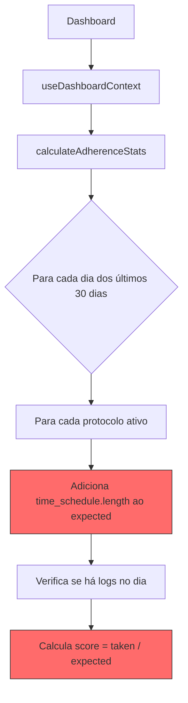
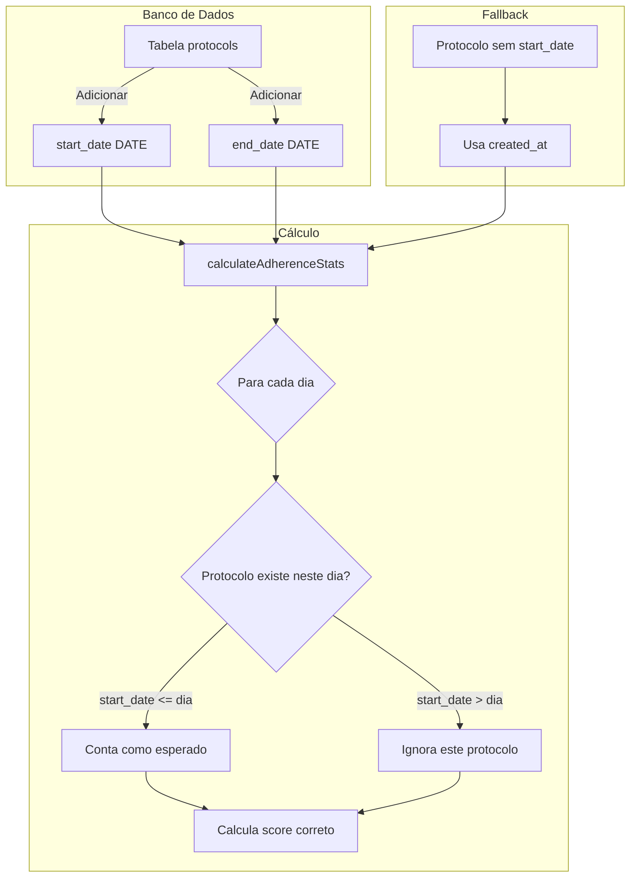

# Especificação Técnica: Correção do Cálculo de Adesão para Protocolos Novos

**Versão:** 1.0.0  
**Data:** 2026-02-18  
**Autor:** Arquiteto  
**Status:** Análise Completa

---

## 📋 Contexto

### Problema Relatado

Quando um novo protocolo é iniciado (ex: 16 de Fevereiro), tanto o **Health Score** quanto o **Daily Adherence Score** exibem valores baixos para dias anteriores à data de início, como se o usuário "não tivesse tomado aquelas doses". Isso é incorreto - o protocolo simplesmente não existia antes da data de início.

### Impacto

- Novos usuários ou usuários iniciando novos protocolos veem scores artificialmente baixos
- Isso pode causar frustração e confusão
- A experiência inicial do usuário é prejudicada

---

## 🔍 Análise

### Causa Raiz Identificada

O cálculo de adesão **NÃO considera a data de início do protocolo**. As funções de cálculo assumem que todos os protocolos ativos deveriam ter sido seguidos durante todo o período analisado (30 dias por padrão).

### Fluxo de Cálculo Atual



**Problema:** O passo F (destacado em vermelho) adiciona doses esperadas para todos os dias, independente de quando o protocolo foi criado.

### Arquivos Envolvidos

| Arquivo | Função | Problema |
|---------|--------|----------|
| [`src/services/api/adherenceService.js`](src/services/api/adherenceService.js) | `calculateExpectedDoses()` (L309-342) | Não considera data de início |
| [`src/services/api/adherenceService.js`](src/services/api/adherenceService.js) | `getDailyAdherence()` (L238-300) | Não filtra dias anteriores ao início |
| [`src/utils/adherenceLogic.js`](src/utils/adherenceLogic.js) | `calculateExpectedDoses()` (L14-45) | Não considera data de início |
| [`src/utils/adherenceLogic.js`](src/utils/adherenceLogic.js) | `calculateAdherenceStats()` (L54-134) | Não filtra dias anteriores ao início |
| [`src/hooks/useDashboardContext.jsx`](src/hooks/useDashboardContext.jsx) | `rawStats` (L61-66) | Usa função sem filtro de data |
| [`src/schemas/protocolSchema.js`](src/schemas/protocolSchema.js) | Schema | Não tem campo `start_date` |
| [`docs/architecture/DATABASE.md`](docs/architecture/DATABASE.md) | Tabela `protocols` | Não tem campo `start_date` |

### Código Problemático

#### 1. `calculateExpectedDoses()` em `adherenceService.js`

```javascript
// Linhas 309-342
function calculateExpectedDoses(protocols, days) {
  if (!protocols || protocols.length === 0) return 0

  return protocols.reduce((total, protocol) => {
    const timesPerDay = protocol.time_schedule?.length || 1
    const frequency = protocol.frequency || 'daily'

    let dailyDoses = timesPerDay
    // ... switch para frequência ...

    // ❌ PROBLEMA: Multiplica dailyDoses por days SEM verificar data de início
    return total + dailyDoses * days
  }, 0)
}
```

#### 2. `calculateAdherenceStats()` em `adherenceLogic.js`

```javascript
// Linhas 54-134
export function calculateAdherenceStats(logs, protocols, days = 30) {
  // ...
  
  for (let i = 0; i < days; i++) {
    const date = new Date()
    date.setDate(date.getDate() - i)
    const dateStr = toLocalDateString(date)
    const dayLogs = logsByDay.get(dateStr) || []

    let dayExpected = 0
    let dayFollowed = 0
    let dayTakenAnytime = 0

    protocols.forEach((protocol) => {
      // ❌ PROBLEMA: Assume que todos os protocolos ativos devem ser seguidos neste dia
      const schedule = protocol.time_schedule || []
      dayExpected += schedule.length
      // ...
    })
    // ...
  }
}
```

### Descoberta Importante: Lógica Já Existe

A função [`calculateDosesByDate()`](src/utils/adherenceLogic.js:308-534) **JÁ POSSUI** lógica para verificar `start_date` e `end_date`:

```javascript
// Linhas 322-336 em adherenceLogic.js
const applicableProtocols = protocols.filter((protocol) => {
  // Protocolo deve estar ativo
  if (!protocol.active) return false

  // ✅ Verificar se o protocolo já começou
  if (protocol.start_date) {
    const startDate = new Date(protocol.start_date)
    if (targetDate < startDate) return false
  }

  // ✅ Verificar se o protocolo já terminou
  if (protocol.end_date) {
    const endDate = new Date(protocol.end_date)
    if (targetDate > endDate) return false
  }
  // ...
})
```

**Porém**, essa função não é usada no cálculo principal de adesão.

---

## 💡 Proposta de Solução

### Abordagem Recomendada: Refatorar Cálculo de Adesão

**Decisão:** Adicionar campo `start_date` à tabela `protocols` e modificar as funções de cálculo para considerar apenas dias a partir da data de início.

**Justificativa:**
- Usa lógica já existente em `calculateDosesByDate()`
- Permite que usuários definam datas de início retroativas
- Mantém compatibilidade com dados existentes (usar `created_at` como fallback)
- Não requer mudanças na UI de criação de protocolo (data de início opcional)

### Diagrama da Solução



---

## 📝 Mudanças Necessárias

### 1. Banco de Dados (Supabase)

**Arquivo:** `.migrations/add_protocol_start_date.sql`

```sql
-- Adicionar campo start_date à tabela protocols
ALTER TABLE protocols 
ADD COLUMN IF NOT EXISTS start_date DATE;

-- Adicionar campo end_date à tabela protocols
ALTER TABLE protocols 
ADD COLUMN IF NOT EXISTS end_date DATE DEFAULT NULL;

-- ✅ MIGRAÇÃO: Copiar created_at para start_date em registros existentes
-- Converte timestamp para date (apenas a parte da data)
UPDATE protocols 
SET start_date = DATE(created_at)
WHERE start_date IS NULL;

-- Tornar start_date obrigatório após migração
ALTER TABLE protocols 
ALTER COLUMN start_date SET NOT NULL;

-- Criar índice para consultas por data
CREATE INDEX IF NOT EXISTS idx_protocols_start_date 
ON protocols(start_date) 
WHERE active = true;

-- Comentários documentais
COMMENT ON COLUMN protocols.start_date IS 'Data de início do protocolo. Obrigatório. Usuários podem ajustar na view de gestão de protocolos';
COMMENT ON COLUMN protocols.end_date IS 'Data de término do protocolo. Se NULL, protocolo não tem fim definido';
```

### 2. Schema Zod

**Arquivo:** [`src/schemas/protocolSchema.js`](src/schemas/protocolSchema.js)

```javascript
// Adicionar ao protocolSchema (após linha 137)
start_date: z
  .string()
  .regex(/^\d{4}-\d{2}-\d{2}$/, 'Data deve estar no formato YYYY-MM-DD')
  .refine((val) => {
    const date = new Date(val)
    return !isNaN(date.getTime())
  }, 'Data de início inválida'),

end_date: z
  .string()
  .regex(/^\d{4}-\d{2}-\d{2}$/, 'Data deve estar no formato YYYY-MM-DD')
  .optional()
  .nullable()
  .transform((val) => val || null),
```

### 3. Função `calculateAdherenceStats()`

**Arquivo:** [`src/utils/adherenceLogic.js`](src/utils/adherenceLogic.js)

```javascript
// Modificar linhas 86-102
protocols.forEach((protocol) => {
  // ✅ NOVO: Verificar se o protocolo estava ativo neste dia
  const protocolStartDate = new Date(protocol.start_date)
  const protocolEndDate = protocol.end_date ? new Date(protocol.end_date) : null
  const currentDate = new Date(dateStr)
  
  // Ignorar protocolo se ainda não tinha começado
  if (currentDate < protocolStartDate) return
  
  // Ignorar protocolo se já terminou
  if (protocolEndDate && currentDate > protocolEndDate) return
  
  // Continua com lógica existente...
  const schedule = protocol.time_schedule || []
  dayExpected += schedule.length
  // ...
})
```

### 4. Função `calculateExpectedDoses()`

**Arquivo:** [`src/services/api/adherenceService.js`](src/services/api/adherenceService.js)

```javascript
// Modificar linhas 309-342
function calculateExpectedDoses(protocols, days, endDate = new Date()) {
  if (!protocols || protocols.length === 0) return 0

  return protocols.reduce((total, protocol) => {
    const timesPerDay = protocol.time_schedule?.length || 1
    const frequency = protocol.frequency || 'daily'

    let dailyDoses = timesPerDay
    // ... switch para frequência ...

    // ✅ NOVO: Calcular dias efetivos do protocolo
    const protocolStartDate = new Date(protocol.start_date)
    const protocolEndDate = protocol.end_date ? new Date(protocol.end_date) : endDate
    
    const periodStart = new Date(endDate)
    periodStart.setDate(periodStart.getDate() - days)
    
    // Calcular interseção entre período do protocolo e período de análise
    const effectiveStart = new Date(Math.max(protocolStartDate, periodStart))
    const effectiveEnd = new Date(Math.min(protocolEndDate, endDate))
    
    // Calcular dias efetivos
    let effectiveDays = 0
    if (effectiveEnd >= effectiveStart) {
      effectiveDays = Math.ceil((effectiveEnd - effectiveStart) / (1000 * 60 * 60 * 24))
    }

    return total + dailyDoses * Math.max(effectiveDays, 0)
  }, 0)
}
```

### 5. Função `getDailyAdherence()`

**Arquivo:** [`src/services/api/adherenceService.js`](src/services/api/adherenceService.js)

```javascript
// Modificar linhas 272-297
// Calcular doses esperadas por dia
const dailyExpected = calculateDailyExpectedDoses(protocols)

// ✅ NOVO: Filtrar protocolos por data para cada dia
const dailyData = []
for (let i = days - 1; i >= 0; i--) {
  const date = new Date(endDate)
  date.setDate(date.getDate() - i)
  const dateKey = /* ... */

  // ✅ NOVO: Calcular expected apenas para protocolos ativos neste dia
  const dayExpected = protocols.reduce((total, protocol) => {
    const protocolStartDate = new Date(protocol.start_date)
    const protocolEndDate = protocol.end_date ? new Date(protocol.end_date) : null
    const currentDate = new Date(dateKey)
    
    if (currentDate < protocolStartDate) return total
    if (protocolEndDate && currentDate > protocolEndDate) return total
    
    return total + (protocol.time_schedule?.length || 1)
  }, 0)

  const taken = logsByDay.get(dateKey) || 0
  const adherence = dayExpected > 0 ? Math.round((taken / dayExpected) * 100) : 0

  dailyData.push({
    date: dateKey,
    taken,
    expected: Math.round(dayExpected),
    adherence: Math.min(adherence, 100),
  })
}
```

### 6. Atualizar Documentação

**Arquivo:** [`docs/architecture/DATABASE.md`](docs/architecture/DATABASE.md)

Adicionar campos à tabela `protocols`:

| Campo | Tipo | Descrição |
|-------|------|-----------|
| `start_date` | date (NOT NULL) | Data de início do protocolo. Obrigatório. Usuários podem ajustar na view de gestão |
| `end_date` | date | Data de término do protocolo (opcional) |

---

## ⚠️ Edge Cases

### 1. Protocolo Retroativo

**Cenário:** Usuário cria protocolo com `start_date` no passado (ex: 7 dias atrás).

**Comportamento Esperado:**
- Dias anteriores ao `start_date` são ignorados no cálculo
- Dias entre `start_date` e hoje são considerados
- Se não houver logs, adesão será 0% para esses dias (correto)

**Implementação:** Já coberta pela solução proposta.

### 2. Edição de Data de Início

**Cenário:** Usuário altera `start_date` de um protocolo existente.

**Comportamento Esperado:**
- Novo `start_date` é aplicado retroativamente
- Cálculo de adesão é atualizado automaticamente

**Implementação:** Já coberta - `start_date` é um campo editável.

### 3. Protocolo Pausado/Retomado

**Cenário:** Usuário pausa um protocolo (active = false) e retoma depois.

**Comportamento Esperado:**
- Dias com `active = false` não contam como esperado
- Apenas dias com `active = true` são considerados

**Implementação:** Parcialmente coberta - campo `active` já é considerado. Para pausas temporárias, seria necessário um histórico de ativação/desativação (fora do escopo desta correção).

### 4. Protocolos Existentes (Migração)

**Cenário:** Protocolos existentes não têm `start_date` definido.

**Comportamento Esperado:**
- Migração SQL copia `created_at` para `start_date`
- Usuários podem ajustar a data na view de gestão de protocolos

**Implementação:** Coberta pela migração SQL que executa `UPDATE protocols SET start_date = DATE(created_at) WHERE start_date IS NULL`.

### 5. Múltiplos Protocolos com Diferentes Datas de Início

**Cenário:** Usuário tem 3 protocolos iniciados em datas diferentes.

**Comportamento Esperado:**
- Cada protocolo contribui apenas para dias após sua data de início
- Score geral reflete adesão ponderada corretamente

**Implementação:** Já coberta pela solução proposta.

---

## 📊 Impacto

### Usuários Afetados

- **Novos usuários:** Verão scores corretos desde o primeiro dia
- **Usuários existentes:** Verão scores mais precisos (pode aumentar ou diminuir dependendo do caso)
- **Protocolos existentes:** `start_date` será populado com `created_at` via migração SQL

### Componentes Afetados

| Componente | Impacto |
|------------|---------|
| HealthScoreCard | Exibirá score mais preciso |
| SparklineAdesao | Exibirá adesão diária correta |
| Dashboard | Stats atualizados |
| ProtocolForm | Novo campo opcional `start_date` |

### Riscos

| Risco | Probabilidade | Mitigação |
|-------|---------------|-----------|
| Scores mudam para usuários existentes | Alta | Comunicar mudança como melhoria de precisão |
| Performance de cálculo | Baixa | Cálculo já é client-side, impacto mínimo |
| Migração de dados | Baixa | Migração simples com UPDATE direto |

---

## 📈 Estimativa de Esforço

| Tarefa | Complexidade | Prioridade |
|--------|--------------|------------|
| Migração SQL (start_date, end_date) | Baixa | P0 |
| Atualizar protocolSchema.js | Baixa | P0 |
| Modificar calculateAdherenceStats() | Média | P0 |
| Modificar calculateExpectedDoses() | Média | P0 |
| Modificar getDailyAdherence() | Média | P0 |
| Atualizar protocolService.js | Baixa | P1 |
| Atualizar ProtocolForm.jsx | Baixa | P1 |
| Atualizar documentação | Baixa | P2 |
| Testes unitários | Média | P0 |

**Total:** Médio (múltiplos arquivos, mas mudanças localizadas)

---

## ✅ Critérios de Aceitação

1. **Dado** um protocolo criado hoje  
   **Quando** calculo adesão dos últimos 7 dias  
   **Então** apenas hoje deve ter doses esperadas

2. **Dado** um protocolo com `start_date` em 16/02  
   **Quando** calculo adesão para 15/02  
   **Então** não deve haver doses esperadas

3. **Dado** um protocolo existente migrado  
   **Quando** o campo `start_date` foi populado via migração  
   **Então** deve conter a data de `created_at`

4. **Dado** múltiplos protocolos com diferentes datas de início  
   **Quando** calculo adesão geral  
   **Então** cada protocolo deve contribuir apenas para dias após sua data de início

5. **Dado** um protocolo com `end_date` definido  
   **Quando** calculo adesão para data após `end_date`  
   **Então** não deve haver doses esperadas

---

## 🔗 Referências

- [`src/services/api/adherenceService.js`](src/services/api/adherenceService.js)
- [`src/utils/adherenceLogic.js`](src/utils/adherenceLogic.js)
- [`src/hooks/useDashboardContext.jsx`](src/hooks/useDashboardContext.jsx)
- [`src/schemas/protocolSchema.js`](src/schemas/protocolSchema.js)
- [`docs/architecture/DATABASE.md`](docs/architecture/DATABASE.md)

---

*Documento criado em 2026-02-18*
