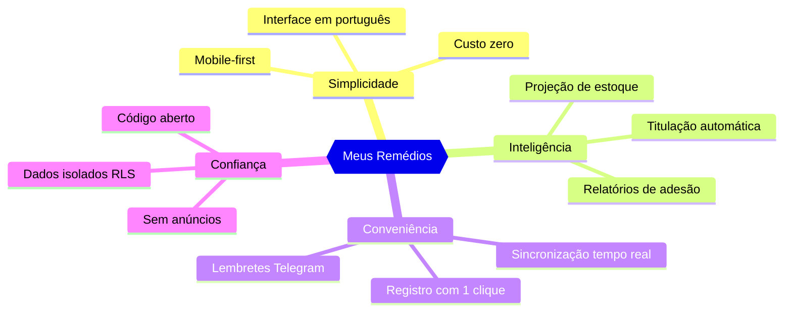
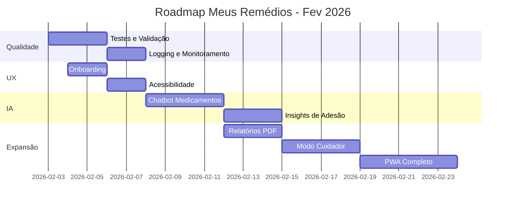

# 📊 Análise da Aplicação Meus Remédios e Roadmap de Evolução

**Data:** 03 de Fevereiro de 2026  
**Versão Analisada:** 2.2.1  
**Autor:** Análise por Agente IA (Architect Mode)

---

## 📑 Índice

1. [Resumo Executivo](#resumo-executivo)
2. [Funcionalidades Principais](#funcionalidades-principais)
3. [Proposta de Valor Atual](#proposta-de-valor-atual)
4. [Análise SWOT](#análise-swot)
5. [Oportunidades de Evolução](#oportunidades-de-evolução)
6. [Roadmap de Evolução](#roadmap-de-evolução)
7. [Detalhamento das Tarefas para Agentes IA](#detalhamento-das-tarefas-para-agentes-ia)
8. [Análise de Custos das Evoluções](#análise-de-custos-das-evoluções)

---

## 🎯 Resumo Executivo

O **Meus Remédios** é uma aplicação web brasileira para gerenciamento de medicamentos, protocolos de tratamento e estoque. A aplicação se destaca por:

- **Público-alvo:** Pessoas que tomam medicamentos de uso contínuo, especialmente protocolos complexos com titulação de dose
- **Diferencial:** Integração nativa com Telegram para lembretes e registro de doses
- **Stack:** React + Vite (frontend), Supabase/PostgreSQL (backend), Vercel (deploy)
- **Custo operacional:** R$ 0 (tier gratuito em todos os serviços)

### Status Geral de Maturidade

| Área | Maturidade | Observação |
|------|------------|------------|
| Frontend Web | ⭐⭐⭐⭐ Alto | Interface moderna, responsiva, com design system próprio |
| Backend/API | ⭐⭐⭐⭐ Alto | Arquitetura modular, RLS habilitado, bem estruturado |
| Bot Telegram | ⭐⭐⭐⭐ Alto | Funcionalidades completas das fases 1-4 implementadas |
| Testes | ⭐⭐ Básico | Apenas componentes críticos testados |
| Documentação | ⭐⭐⭐⭐ Alto | Boa cobertura técnica e guias de usuário |

---

## 🔧 Funcionalidades Principais

### 1. Gestão de Medicamentos
- Cadastro completo com nome comercial, laboratório, princípio ativo
- Especificação de dosagem por unidade (mg, mcg, ml)
- Classificação por tipo: medicamento ou suplemento

### 2. Protocolos de Tratamento
- Definição de frequência (1x/dia, 2x/dia, etc.)
- Agendamento de horários específicos (ex: 08:00, 20:00)
- Agrupamento em Planos de Tratamento
- **Titulação Inteligente:** Sistema completo de escalonamento de dose com:
  - Múltiplas etapas configuráveis
  - Detecção automática de transição
  - Alertas visuais no Dashboard

### 3. Controle de Estoque
- Registro de compras com data e validade
- Cálculo automático de preço médio ponderado
- Sistema PEPS (Primeiro que Entra, Primeiro que Sai)
- Projeção de dias restantes baseada no consumo

### 4. Histórico e Calendário
- Calendário interativo com navegação por mês
- Swipe para troca de mês (mobile)
- Registro retroativo de doses
- Edição e exclusão com restauração de estoque

### 5. Bot Telegram - Funcionalidades Completas
| Fase | Funcionalidade | Status |
|------|----------------|--------|
| 1 | Lembretes inteligentes com janela de tempo | ✅ |
| 1 | Avisos de estoque baixo | ✅ |
| 1 | Streak de adesão (gamificação) | ✅ |
| 2 | Comandos de consulta (/estoque, /hoje, /proxima) | ✅ |
| 2.2 | Busca inline (@bot medicamento) | ✅ |
| 3 | Fluxos conversacionais (/registrar, /adicionar_estoque) | ✅ |
| 4 | Alertas de estoque (diário 9h) | ✅ |
| 4 | Relatório semanal de adesão (domingo 20h) | ✅ |
| 4 | Alertas de titulação (diário 8h) | ✅ |
| 4 | Relatório mensal de tendências | ✅ |

### 6. Autenticação e Multi-usuário
- Login via Supabase Auth (email/senha)
- Row-Level Security (RLS) para isolamento de dados
- Vinculação Telegram via token temporário
- Migração de dados da fase piloto

---

## 💎 Proposta de Valor Atual

### Value Proposition Statement

> *Para pessoas que precisam tomar medicamentos de uso contínuo, especialmente protocolos complexos com titulação, o Meus Remédios é uma solução gratuita que simplifica o gerenciamento de doses, estoque e adesão através de uma interface web intuitiva e lembretes inteligentes via Telegram, diferentemente de apps genéricos de lembretes que não entendem a complexidade de protocolos médicos.*

### Pilares do Valor



### Análise do Value Prop Atual

| Aspecto | Avaliação | Score |
|---------|-----------|-------|
| **Problem-Solution Fit** | O problema (gerenciar medicamentos complexos) é real e o app resolve bem | 8/10 |
| **Diferenciação** | Titulação + Telegram são diferenciais únicos no mercado brasileiro | 9/10 |
| **Usabilidade** | Interface moderna mas com curva de aprendizado para titulação | 7/10 |
| **Acessibilidade** | Gratuito, mas requer conhecimento técnico para self-hosting | 6/10 |
| **Engajamento** | Bot Telegram aumenta retenção, mas falta gamificação profunda | 7/10 |

**Score Geral:** 7.4/10 - Proposta sólida com espaço para evolução

---

## 📈 Análise SWOT

### Forças (Strengths)
- ✅ Único app brasileiro focado em titulação de dose
- ✅ Integração Telegram robusta e completa
- ✅ Stack moderna e bem documentada
- ✅ Custo zero (tier gratuito)
- ✅ Código aberto e auditável
- ✅ Design system premium (Neo-Glass)

### Fraquezas (Weaknesses)
- ❌ Sem testes automatizados abrangentes
- ❌ Sessões in-memory no bot (perdem-se em restart)
- ❌ Sem app nativo mobile (apenas PWA)
- ❌ Dependência do Vercel para cron jobs
- ❌ Falta validação robusta de inputs

### Oportunidades (Opportunities)
- 🔮 Integração com IA para insights médicos
- 🔮 Marketplace de protocolos pré-configurados
- 🔮 Exportação de relatórios para médicos
- 🔮 Integração com farmácias (reposição automática)
- 🔮 Wearables integration (smartwatch)
- 🔮 Compartilhamento familiar (cuidadores)

### Ameaças (Threats)
- ⚠️ Apps de grandes farmácias entrando no mercado
- ⚠️ Mudanças nos tiers gratuitos (Supabase/Vercel)
- ⚠️ Regulamentação de apps de saúde (ANVISA)
- ⚠️ Dependência do Telegram API

---

## 🚀 Oportunidades de Evolução

### Curto Prazo (Sprint 1-2 - Próximos 7 dias)

1. **Robustez e Qualidade**
   - Ampliar cobertura de testes unitários
   - Implementar validação de inputs (Zod)
   - Adicionar logging estruturado
   - Persistência de sessões do bot (Redis/Supabase)

2. **UX Quick Wins**
   - Onboarding guiado para novos usuários
   - Atalhos de teclado no dashboard
   - Melhor feedback visual em erros

### Médio Prazo (Sprint 3-4 - 2 semanas)

3. **Inteligência Artificial**
   - Chatbot IA para dúvidas sobre medicamentos
   - Previsão de comportamento de adesão
   - Sugestões de otimização de horários

4. **Expansão de Funcionalidades**
   - Relatórios exportáveis (PDF)
   - Compartilhamento com cuidadores
   - Modo offline com sync

### Longo Prazo (Sprint 5+ - 1 mês+)

5. **Ecossistema**
   - Progressive Web App (PWA) com notificações push
   - API pública para integrações
   - Marketplace de protocolos médicos

---

## 📋 Roadmap de Evolução

### Visão Geral do Roadmap



---

## 🤖 Detalhamento das Tarefas para Agentes IA

Este roadmap foi projetado para execução por agentes autônomos de IA. Cada tarefa inclui contexto, critérios de sucesso e arquivos relevantes.

---

### 🔴 SPRINT 1: Qualidade e Robustez (Dias 1-3)

#### Tarefa 1.1: Ampliar Cobertura de Testes Unitários
**Prioridade:** Alta  
**Modo Recomendado:** Code

**Contexto:**
Os testes existentes cobrem apenas: [`src/services/api.test.js`](src/services/api.test.js), [`src/components/ui/Button.test.jsx`](src/components/ui/Button.test.jsx), [`src/components/protocol/ProtocolChecklistItem.test.jsx`](src/components/protocol/ProtocolChecklistItem.test.jsx), [`src/components/protocol/TitrationWizard.test.jsx`](src/components/protocol/TitrationWizard.test.jsx)

**Escopo:**
- [ ] Criar testes para [`src/services/api/logService.js`](src/services/api/logService.js)
- [ ] Criar testes para [`src/services/api/stockService.js`](src/services/api/stockService.js)
- [ ] Criar testes para [`src/utils/titrationUtils.js`](src/utils/titrationUtils.js)
- [ ] Criar testes para [`src/components/log/LogForm.jsx`](src/components/log/LogForm.jsx)
- [ ] Criar testes para [`src/components/stock/StockForm.jsx`](src/components/stock/StockForm.jsx)

**Critérios de Sucesso:**
- Cobertura mínima de 70% para services
- Todos os testes passando com `npm test`
- Mock do Supabase client configurado

**Arquivos de Referência:**
- Configuração: [`src/test/setup.js`](src/test/setup.js)
- Framework: Vitest + React Testing Library

---

#### Tarefa 1.2: Implementar Validação de Inputs com Zod
**Prioridade:** Alta  
**Modo Recomendado:** Code

**Contexto:**
Atualmente não há validação robusta nos formulários e API. Isso pode causar erros silenciosos ou dados corrompidos.

**Escopo:**
- [ ] Instalar Zod: `npm install zod`
- [ ] Criar schema de validação em `src/schemas/`:
  - [ ] `medicineSchema.js`
  - [ ] `protocolSchema.js`
  - [ ] `stockSchema.js`
  - [ ] `logSchema.js`
- [ ] Integrar validação nos services de API
- [ ] Adicionar mensagens de erro amigáveis nos forms

**Critérios de Sucesso:**
- Inputs inválidos rejeitados com mensagem clara
- Nenhum crash por dados malformados
- Validação client e server-side

---

#### Tarefa 1.3: Logging Estruturado no Bot
**Prioridade:** Média  
**Modo Recomendado:** Code

**Contexto:**
O bot usa apenas `console.log/error`. Não há rastreabilidade de erros em produção.

**Escopo:**
- [ ] Melhorar o logger existente [`server/bot/logger.js`](server/bot/logger.js)
- [ ] Padronizar níveis: ERROR, WARN, INFO, DEBUG, TRACE
- [ ] Adicionar contexto (userId, commandName, timestamp)
- [ ] Implementar em todos os comandos em [`server/bot/commands/`](server/bot/commands/)

**Critérios de Sucesso:**
- Logs com formato JSON parseable
- Contexto de usuário em toda ação
- Facilidade de debug em produção

---

### 🟠 SPRINT 2: UX e Onboarding (Dias 4-6)

#### Tarefa 2.1: Onboarding Guiado para Novos Usuários
**Prioridade:** Alta  
**Modo Recomendado:** Code

**Contexto:**
Novos usuários podem se perder na complexidade do app. Um wizard de onboarding ajudaria.

**Escopo:**
- [ ] Criar componente `src/components/onboarding/OnboardingWizard.jsx`
- [ ] Steps: 
  1. Boas-vindas e explicação
  2. Cadastro do primeiro medicamento
  3. Criação do primeiro protocolo
  4. Vinculação do Telegram (opcional)
- [ ] Salvar flag `onboarding_completed` em `user_settings`
- [ ] Exibir apenas para novos usuários

**Critérios de Sucesso:**
- 4 steps navegáveis
- Skip disponível em qualquer momento
- Não reaparece após conclusão

---

#### Tarefa 2.2: Melhorias de Acessibilidade (A11y)
**Prioridade:** Média  
**Modo Recomendado:** Code

**Contexto:**
O app deve ser usável por pessoas com deficiência visual ou motora.

**Escopo:**
- [ ] Auditar com Lighthouse (aba Accessibility)
- [ ] Adicionar `aria-labels` em todos os botões/ícones
- [ ] Garantir contraste mínimo WCAG AA (4.5:1)
- [ ] Navegação completa via teclado
- [ ] Skip links para conteúdo principal

**Critérios de Sucesso:**
- Score Lighthouse Accessibility > 90
- Navegação Tab sem bloqueios
- Screen reader friendly

---

#### Tarefa 2.3: Persistência de Sessões do Bot
**Prioridade:** Média  
**Modo Recomendado:** Code

**Contexto:**
As sessões conversacionais do bot são armazenadas in-memory ([`server/bot/state.js`](server/bot/state.js)) e se perdem em restarts.

**Escopo:**
- [ ] Avaliar opções: Redis (Upstash) vs Supabase table
- [ ] Criar tabela `bot_sessions` ou usar Upstash Redis
- [ ] Refatorar [`state.js`](server/bot/state.js) para usar storage persistente
- [ ] Implementar TTL de 30 minutos

**Critérios de Sucesso:**
- Sessões sobrevivem a restarts
- Cleanup automático de sessões antigas
- Latência < 100ms para read/write

---

### 🟡 SPRINT 3: Inteligência Artificial (Dias 7-10)

#### Tarefa 3.1: Chatbot IA para Dúvidas de Medicamentos
**Prioridade:** Alta  
**Modo Recomendado:** Code

**Contexto:**
Usuários frequentemente têm dúvidas sobre interações, efeitos colaterais ou horários ideais.

**Escopo:**
- [ ] Criar comando `/pergunta` no bot Telegram
- [ ] Integrar com API Claude/GPT via função serverless
- [ ] Contexto: enviar lista de medicamentos do usuário
- [ ] Limitar a perguntas sobre medicamentos (não diagnóstico)
- [ ] Adicionar disclaimer médico

**Critérios de Sucesso:**
- Respostas em < 5 segundos
- Disclaimer presente em toda resposta
- Rate limit de 10 perguntas/dia

**Prompt Base Sugerido:**
```
Você é um assistente farmacêutico. O usuário toma os seguintes medicamentos: {lista}. 
Responda perguntas sobre interações, horários e efeitos colaterais. 
NÃO forneça diagnósticos. Sempre recomende consultar um médico para dúvidas sérias.
```

---

#### Tarefa 3.2: Insights de Adesão com IA
**Prioridade:** Média  
**Modo Recomendado:** Code

**Contexto:**
Os dados de histórico permitem identificar padrões de esquecimento.

**Escopo:**
- [ ] Criar serviço `src/services/insightsService.js`
- [ ] Analisar padrões: horários com mais falhas, dias da semana
- [ ] Gerar insights mensais: "Você esquece mais doses às segundas-feiras"
- [ ] Integrar no relatório mensal do bot
- [ ] Adicionar card de insights no Dashboard

**Critérios de Sucesso:**
- Pelo menos 3 tipos de insights
- Baseado em dados reais do usuário
- Visualização clara no Dashboard

---

### 🟢 SPRINT 4: Expansão de Funcionalidades (Dias 11-14)

#### Tarefa 4.1: Relatórios Exportáveis em PDF
**Prioridade:** Alta  
**Modo Recomendado:** Code

**Contexto:**
Usuários precisam levar relatórios para consultas médicas.

**Escopo:**
- [ ] Instalar biblioteca de PDF (react-pdf ou jspdf)
- [ ] Criar componente `src/components/reports/AdherenceReport.jsx`
- [ ] Conteúdo do relatório:
  - Período selecionável
  - Lista de medicamentos e protocolos
  - Taxa de adesão por medicamento
  - Gráfico de evolução
  - Histórico de titulação
- [ ] Botão de exportação na página de Histórico

**Critérios de Sucesso:**
- PDF gerado em < 3 segundos
- Design profissional e legível
- Inclui logo e dados do usuário

---

#### Tarefa 4.2: Modo Cuidador (Compartilhamento)
**Prioridade:** Média  
**Modo Recomendado:** Code

**Contexto:**
Cuidadores de idosos ou pessoas com demência precisam acompanhar a adesão.

**Escopo:**
- [ ] Criar tabela `caregivers` (user_id, caregiver_user_id, permissions)
- [ ] Criar convite por código único
- [ ] Criar view read-only para cuidadores
- [ ] Notificações de dose esquecida para cuidador

**Critérios de Sucesso:**
- Cuidador vê apenas (não edita)
- Notificação em tempo real de falha
- Revogação de acesso pelo paciente

---

#### Tarefa 4.3: PWA Completo com Push Notifications
**Prioridade:** Baixa  
**Modo Recomendado:** Code

**Contexto:**
Atualmente o app é web-only. PWA permitiria instalação e notificações nativas.

**Escopo:**
- [ ] Configurar Service Worker com Vite PWA plugin
- [ ] Implementar Web Push API
- [ ] Criar manifest.json completo
- [ ] Adicionar prompt de instalação
- [ ] Cache offline para consultas básicas

**Critérios de Sucesso:**
- Instalável no celular
- Notificações push funcionando
- Modo offline com dados em cache

---

## 📊 Métricas de Sucesso do Roadmap

| Métrica | Baseline Atual | Meta Sprint 4 |
|---------|---------------|---------------|
| Cobertura de Testes | ~20% | >70% |
| Lighthouse Performance | ~85 | >95 |
| Lighthouse Accessibility | ~70 | >90 |
| Funcionalidades IA | 0 | 2 |
| Tempo médio de resposta Bot | ~1s | <500ms |
| NPS (se medido) | N/A | >40 |

---

## 🔄 Processo para Agentes Autônomos

### Workflow Recomendado

1. **Análise:** Ler arquivos relacionados antes de modificar
2. **Planejamento:** Criar branch específica (ex: `feature/tests-logservice`)
3. **Implementação:** Mudanças incrementais com commits pequenos
4. **Validação:** Rodar `npm test` e `npm run lint` após cada mudança
5. **Documentação:** Atualizar README/docs se necessário
6. **Review:** Criar PR com descrição clara

### Convenções de Código

- **TypeScript:** Não usar (projeto é JavaScript puro)
- **Estilo:** ESLint configurado em [`eslint.config.js`](eslint.config.js)
- **Componentes:** Functional components com hooks
- **CSS:** Classes em kebab-case, BEM para componentes complexos
- **Commits:** Conventional Commits (feat:, fix:, docs:, test:)

### Ordem de Execução Sugerida

```
Tarefa 1.1 (Testes) 
    → Tarefa 1.2 (Validação)
        → Tarefa 1.3 (Logging)
            → Tarefa 2.1 (Onboarding)
                → Tarefa 2.3 (Sessões)
                    → Tarefa 3.1 (Chatbot IA)
                        → Tarefa 4.1 (PDF)
```

---

## 💰 Análise de Custos das Evoluções

Esta seção analisa detalhadamente os custos adicionais que serão gerados ao implementar cada funcionalidade proposta, considerando que a aplicação atual opera com **custo zero** utilizando tiers gratuitos.

### 📊 Stack Atual - Free Tiers Utilizados

| Serviço | Tier | Limites Gratuitos | Uso Atual Estimado |
|---------|------|-------------------|-------------------|
| **Supabase** | Free | 500MB storage, 2GB bandwidth/mês, 50k MAUs | ~10% utilizado |
| **Vercel** | Hobby | 100GB bandwidth, 6k min execução/mês | ~20% utilizado |
| **Telegram Bot API** | Free | Ilimitado | N/A |
| **cron-job.org** | Free | 50 jobs | 3-5 jobs |
| **GitHub** | Free | Ilimitado repos privados | N/A |

---

### 🟢 Tarefas com Custo ZERO (100% dentro dos free tiers)

#### Sprint 1: Qualidade e Robustez

| Tarefa | Custo | Justificativa |
|--------|-------|---------------|
| **1.1 Testes Unitários** | R$ 0 | Roda localmente ou no CI/CD do Vercel |
| **1.2 Validação Zod** | R$ 0 | Biblioteca JavaScript, executa no cliente |
| **1.3 Logging Estruturado** | R$ 0 | console.log formatado, sem serviço externo |

#### Sprint 2: UX e Onboarding

| Tarefa | Custo | Justificativa |
|--------|-------|---------------|
| **2.1 Onboarding Wizard** | R$ 0 | Componente React, frontend-only |
| **2.2 Acessibilidade** | R$ 0 | Modificações CSS/HTML apenas |

#### Sprint 4: Expansão

| Tarefa | Custo | Justificativa |
|--------|-------|---------------|
| **4.1 Relatórios PDF** | R$ 0 | Geração client-side com jsPDF ou react-pdf |

---

### 🟡 Tarefas com Custo VARIÁVEL (podem requerer upgrade)

#### 2.3 Persistência de Sessões do Bot

**Opção A: Supabase Table (GRATUITA)**

| Item | Custo Mensal |
|------|-------------|
| Storage adicional | R$ 0 |
| Queries adicionais | R$ 0 |

**Implementação recomendada:**
```sql
CREATE TABLE bot_sessions (
  id UUID PRIMARY KEY,
  chat_id TEXT NOT NULL,
  state JSONB NOT NULL,
  expires_at TIMESTAMPTZ NOT NULL,
  created_at TIMESTAMPTZ DEFAULT NOW()
);
CREATE INDEX idx_sessions_chat ON bot_sessions(chat_id);
CREATE INDEX idx_sessions_expires ON bot_sessions(expires_at);
```
- Armazenamento mínimo (~1KB por sessão)
- TTL de 30 min mantém tabela pequena
- **Impacto no free tier: desprezível**

**Opção B: Upstash Redis (GRATUITA até limite)**

| Tier | Limite | Custo |
|------|--------|-------|
| Free | 10k comandos/dia | R$ 0 |
| Pay-as-you-go | > 10k | ~$0.20/100k comandos |

- Para app pessoal com poucos usuários: **R$ 0**
- Se escalar para 100+ usuários: **~R$ 5-15/mês**

**✅ Recomendação: Usar Supabase (opção A) para manter custo zero**

---

#### 4.2 Modo Cuidador

**Análise de Impacto no Supabase:**

| Item | Impacto |
|------|---------|
| Nova tabela `caregivers` | ~100 bytes/registro |
| RLS adicional | Performance ok |
| Notificações extras | +1-2% bandwidth |

**Custo estimado: R$ 0** (dentro do free tier mesmo com 10 cuidadores)

---

#### 4.3 PWA com Push Notifications

**Web Push requer armazenamento de tokens:**

| Serviço | Tier Gratuito | Custo se exceder |
|---------|---------------|------------------|
| Firebase Cloud Messaging | Ilimitado | R$ 0 |
| OneSignal | 10k subscribers | R$ 0 para uso pessoal |
| Supabase (armazenar tokens) | Incluso | R$ 0 |

**Implementação sugerida:**
- Usar **Web Push API nativa** + armazenar `PushSubscription` no Supabase
- Enviar via Vercel Serverless Function
- **Custo: R$ 0**

---

### 🔴 Tarefas com Custo OBRIGATÓRIO (requerem serviço pago)

#### 3.1 Chatbot IA para Dúvidas de Medicamentos

**Esta é a ÚNICA funcionalidade que adiciona custo real à aplicação.**

##### Opções de Provedores de LLM:

| Provedor | Modelo | Custo por 1k tokens | Estimativa Mensal* |
|----------|--------|---------------------|-------------------|
| **OpenAI** | GPT-4o-mini | $0.15 input / $0.60 output | ~R$ 15-40/mês |
| **OpenAI** | GPT-4o | $2.50 input / $10 output | ~R$ 80-200/mês |
| **Anthropic** | Claude 3 Haiku | $0.25 / $1.25 | ~R$ 20-50/mês |
| **Anthropic** | Claude 3.5 Sonnet | $3 / $15 | ~R$ 100-250/mês |
| **Groq** | Llama 3 70B | FREE (beta) | R$ 0* |
| **Google** | Gemini 1.5 Flash | $0.075 / $0.30 | ~R$ 10-25/mês |
| **Mistral** | Mistral 7B | $0.25 / $0.25 | ~R$ 15-35/mês |
| **Together AI** | Llama 3 8B | FREE (50k tokens/dia) | R$ 0* |

*Estimativa para uso pessoal: ~10 perguntas/dia, ~500 tokens/pergunta

##### Análise Detalhada de Custos:

**Cenário 1: Uso Pessoal (1 usuário, ~10 perguntas/dia)**
```
Tokens por pergunta: ~300 input + ~500 output = 800 tokens
Perguntas por mês: 10/dia × 30 = 300 perguntas
Tokens totais: 300 × 800 = 240k tokens/mês

GPT-4o-mini: 240k × ($0.15 + $0.60) / 1000 = $0.18/mês ≈ R$ 1/mês
Groq (free): R$ 0/mês
Together AI (free): R$ 0/mês
```

**Cenário 2: Uso Familiar (5 usuários, ~50 perguntas/dia total)**
```
Tokens totais: 50 × 30 × 800 = 1.2M tokens/mês

GPT-4o-mini: $0.90/mês ≈ R$ 5/mês
GPT-4o: $15/mês ≈ R$ 75/mês
Claude 3.5 Sonnet: $21.60/mês ≈ R$ 110/mês
```

**Cenário 3: Aplicação Pública (100 usuários, ~500 perguntas/dia)**
```
Tokens totais: 500 × 30 × 800 = 12M tokens/mês

GPT-4o-mini: $9/mês ≈ R$ 45/mês
GPT-4o: $150/mês ≈ R$ 750/mês
```

##### ✅ Recomendação para Manter Custo Baixo:

1. **Fase Inicial (R$ 0):** Usar **Groq** ou **Together AI** (cota gratuita generosa)
2. **Fallback:** Se cota exceder, mudar para **GPT-4o-mini** (~R$ 1-5/mês)
3. **Rate Limiting:** Limitar a 10 perguntas/dia/usuário
4. **Cache de Respostas:** Armazenar perguntas frequentes no Supabase

##### Implementação com Custo Zero (Groq):

```javascript
// api/ai-chat.js (Vercel Serverless)
import Groq from 'groq-sdk';

const groq = new Groq({ apiKey: process.env.GROQ_API_KEY });

export default async function handler(req, res) {
  const { question, medicines } = req.body;
  
  const completion = await groq.chat.completions.create({
    model: 'llama3-70b-8192',  // FREE durante beta
    messages: [
      { role: 'system', content: `Assistente farmacêutico. Medicamentos: ${medicines}` },
      { role: 'user', content: question }
    ],
    max_tokens: 500
  });
  
  res.json({ answer: completion.choices[0].message.content });
}
```

---

#### 3.2 Insights de Adesão com IA

**Duas abordagens:**

| Abordagem | Custo | Qualidade |
|-----------|-------|-----------|
| **A: Regras Hardcoded** | R$ 0 | Básica |
| **B: LLM para análise** | R$ 1-5/mês | Alta |

**Recomendação:** Iniciar com **Abordagem A** (regras simples) para manter custo zero:

```javascript
// src/services/insightsService.js
export function generateInsights(logs, protocols) {
  const insights = [];
  
  // Insight 1: Dia da semana com mais falhas
  const failuresByDay = groupFailuresByDayOfWeek(logs);
  const worstDay = Object.entries(failuresByDay).sort((a,b) => b[1] - a[1])[0];
  if (worstDay[1] > 3) {
    insights.push(`Você esquece mais doses às ${worstDay[0]}s`);
  }
  
  // Insight 2: Horário problemático
  // Insight 3: Streak atual
  // ... etc
  
  return insights;
}
```

**Se quiser usar LLM:** Incluir no mesmo chatbot da Tarefa 3.1 (não adiciona custo extra significativo)

---

### 📊 Resumo Consolidado de Custos

#### Cenário A: Implementação 100% Gratuita

| Sprint | Tarefa | Custo |
|--------|--------|-------|
| 1 | Todas (Testes, Zod, Logging) | R$ 0 |
| 2 | Todas (Onboarding, A11y, Sessões via Supabase) | R$ 0 |
| 3 | Chatbot IA (via Groq free) | R$ 0 |
| 3 | Insights (regras hardcoded) | R$ 0 |
| 4 | PDF, Cuidador, PWA | R$ 0 |

**Total Mensal: R$ 0**

#### Cenário B: Implementação com Melhor Qualidade

| Funcionalidade | Serviço | Custo Mensal |
|----------------|---------|--------------|
| Chatbot IA | GPT-4o-mini | R$ 5-15 |
| Sessões Bot | Upstash Redis (se escalar) | R$ 0-15 |
| PWA Push | FCM gratuito | R$ 0 |

**Total Mensal: R$ 5-30**

#### Cenário C: Aplicação Pública (100+ usuários)

| Funcionalidade | Serviço | Custo Mensal |
|----------------|---------|--------------|
| Chatbot IA | GPT-4o-mini | R$ 45-100 |
| Supabase | Pro tier (se exceder) | R$ 130 |
| Vercel | Pro tier (se exceder) | R$ 100 |

**Total Mensal: R$ 275-330**

---

### ⚠️ Riscos de Custos Inesperados

| Risco | Probabilidade | Mitigação |
|-------|---------------|-----------|
| Supabase exceder 500MB | Baixa (uso atual ~10%) | Cleanup de logs antigos |
| Vercel exceder bandwidth | Baixa | CDN para assets estáticos |
| LLM API custos altos | Média | Rate limiting + cache |
| Telegram limitar bots | Muito baixa | Nenhuma ação necessária |

---

### 🎯 Decisão Recomendada

Para manter o **custo zero** que é um diferencial da aplicação:

1. **Sprint 1-2:** Implementar normalmente (zero custo adicional)
2. **Sprint 3 (IA):**
   - Usar **Groq** ou **Together AI** (grátis)
   - Implementar cache agressivo de respostas
   - Rate limit de 10 perguntas/dia/usuário
3. **Sprint 4:** Implementar normalmente (zero custo adicional)

**Se precisar de qualidade superior no chatbot:** Alocar orçamento de **R$ 10-20/mês** para GPT-4o-mini

---

## 📝 Conclusão

O **Meus Remédios** é uma aplicação madura com forte diferenciação no mercado brasileiro. A proposta de valor é sólida (7.4/10) mas pode evoluir para 9/10 com:

1. **Qualidade:** Mais testes e validação robusta
2. **UX:** Onboarding e acessibilidade
3. **IA:** Chatbot e insights inteligentes
4. **Expansão:** Relatórios e compartilhamento

O roadmap proposto é executável por agentes autônomos de IA em aproximadamente 14 dias, com entregas incrementais a cada sprint de 3-4 dias.

---

**Documento gerado automaticamente em:** 03/02/2026 00:39 (UTC-3)  
**Próxima revisão sugerida:** Após Sprint 2
