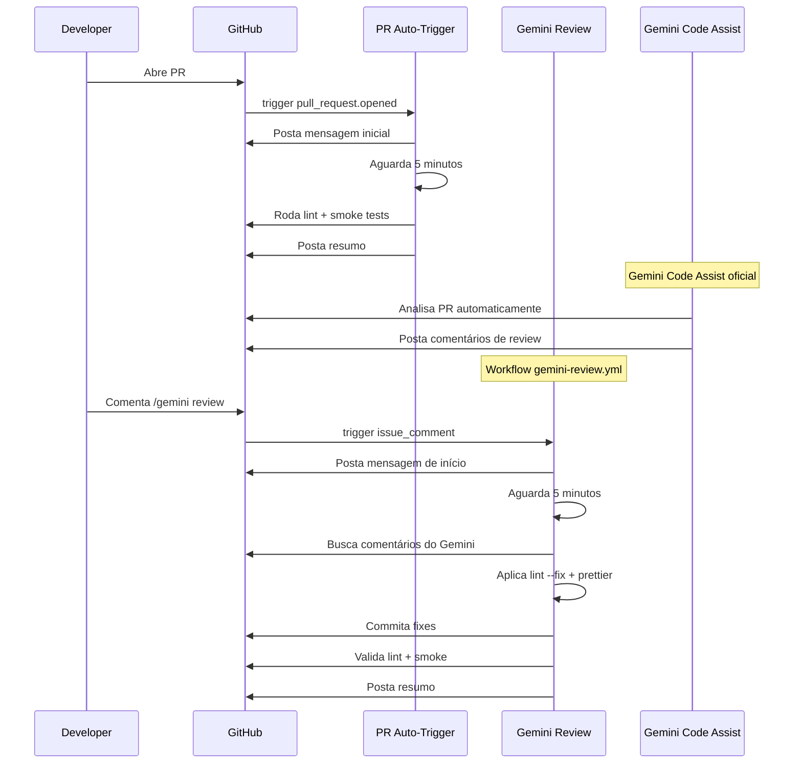

# Análise: Gemini Code Assist Integration (PR #24)

## 📋 Visão Geral

Este documento analisa a configuração atual do Gemini Code Assist no projeto Meus Remédios, implementada no PR #24, para identificar oportunidades de melhoria.

---

## 🗂️ Arquivos de Configuração Atuais

### 1. GitHub Workflows

| Arquivo | Propósito | Trigger |
|---------|-----------|---------|
| `.github/workflows/gemini-review.yml` | Workflow principal de review | `issue_comment` (created), `workflow_dispatch` |
| `.github/workflows/pr-auto-trigger.yml` | Auto-trigger em PRs | `pull_request` (opened, synchronize, reopened) |
| `.github/workflows/test.yml` | Suite de testes padrão | `push`, `pull_request` para main/develop |

### 2. Gemini Configuration

| Arquivo | Propósito |
|---------|-----------|
| `.gemini/config.yaml` | Configuração do Gemini Code Assist |
| `.gemini/styleguide.md` | Diretrizes de código para o Gemini seguir |

---

## 🔍 Análise Detalhada

### 1. `.github/workflows/gemini-review.yml`

**Estrutura:**
```
┌─────────────────────────────────────────────────────────────────┐
│                    GEMINI-REVIEW WORKFLOW                       │
├─────────────────────────────────────────────────────────────────┤
│                                                                 │
│  TRIGGERS:                                                      │
│  ├── issue_comment (created)                                    │
│  │   └── Condição: startsWith('/gemini review') OU              │
│  │              contains('@gemini-code-assist')                 │
│  └── workflow_dispatch (manual)                                 │
│      └── Inputs: pr_number, skip_wait                           │
│                                                                 │
│  JOBS:                                                          │
│  1. prepare → Extrai contexto do PR                             │
│  2. fetch-comments → Aguarda 5 min + busca comentários Gemini   │
│  3. fix → Aplica lint --fix + prettier                          │
│  4. validate → Roda lint + smoke tests                          │
│  5. summary → Posta resumo no PR                                │
│                                                                 │
└─────────────────────────────────────────────────────────────────┘
```

**Pontos Fortes:**
- ✅ Suporte a trigger manual via `workflow_dispatch`
- ✅ Opção de pular espera de 5 minutos (`skip_wait`)
- ✅ Auto-fix de lint e formatting
- ✅ Validação pós-fix com lint + smoke tests
- ✅ Resumo detalhado postado no PR

**Pontos de Atenção:**
- ⚠️ Aguarda 5 minutos fixos (pode ser longo para PRs pequenos)
- ⚠️ Busca comentários do Gemini mas não os processa para aplicar fixes específicos
- ⚠️ Não há integração com os comentários do Gemini Code Assist oficial

---

### 2. `.github/workflows/pr-auto-trigger.yml`

**Estrutura:**
```
┌─────────────────────────────────────────────────────────────────┐
│                  PR-AUTO-TRIGGER WORKFLOW                       │
├─────────────────────────────────────────────────────────────────┤
│                                                                 │
│  TRIGGERS:                                                      │
│  └── pull_request (opened, synchronize, reopened)               │
│      └── Branches: main, develop                                │
│                                                                 │
│  CONDIÇÃO:                                                      │
│  └── if: github.event.pull_request.user.type != 'Bot'           │
│                                                                 │
│  JOBS:                                                          │
│  1. post-initial-comment → Posta mensagem de início             │
│  2. wait-analysis → Aguarda 5 minutos                           │
│  3. validate-pr → Roda lint + smoke tests                       │
│  4. post-summary → Posta resumo no PR                           │
│                                                                 │
└─────────────────────────────────────────────────────────────────┘
```

**Pontos Fortes:**
- ✅ Trigger automático em PRs novos
- ✅ Ignora PRs de bots
- ✅ Mensagem diferenciada para PR novo vs. atualização

**Pontos de Atenção:**
- ⚠️ Não invoca o Gemini Code Assist oficial (aparentemente)
- ⚠️ Duplicação de validação com `test.yml`
- ⚠️ Aguarda 5 minutos mas não há análise do Gemini de fato

---

### 3. `.gemini/config.yaml`

```yaml
code_review:
  comment_severity_threshold: MEDIUM
  max_review_comments: 20
  pull_request_opened:
    help: true
    summary: true
    code_review: true
    include_drafts: false
```

**Interpretação:**
- `comment_severity_threshold: MEDIUM` → Apenas issues MEDIUM ou superior são comentados
- `max_review_comments: 20` → Limite de 20 comentários por review
- `pull_request_opened` → Ações automáticas ao abrir PR:
  - `help: true` → Oferece ajuda
  - `summary: true` → Gera resumo
  - `code_review: true` → Faz review de código
  - `include_drafts: false` → Ignora PRs em draft

**Pontos de Atenção:**
- ⚠️ Não há configuração de `pull_request_synchronize` para re-reviews
- ⚠️ Não há filtros por path (ignora certos diretórios)

---

### 4. `.gemini/styleguide.md`

**Regras de Ouro Definidas:**

| Regra | Descrição |
|-------|-----------|
| **Idiomas** | Código em inglês, mensagens/UI em português |
| **Ordem dos Hooks** | States → Memos → Effects → Handlers |
| **Cache** | Usar `useCachedQuery` (SWR) |
| **Telegram Bot** | callback_data < 64 bytes |
| **Estoque** | Doses em unidades, não mg |

**Foco da Revisão:**
- Segurança (RLS, validação)
- Performance (re-renders, memoização)
- Manutenibilidade (funções > 30 linhas)

**Salvaguardas:**
- Não quebrar compatibilidade com plano gratuito Supabase/Vercel
- Respeitar estrutura de diretórios existente

---

## 🔄 Fluxo Atual (Como Funciona)



---

## ⚠️ Problemas Identificados

### 1. **Desconexão entre Workflows**

O `pr-auto-trigger.yml` não invoca o Gemini Code Assist oficial. Ele apenas:
1. Posta uma mensagem
2. Aguarda 5 minutos
3. Roda validações locais

**Impacto:** O Gemini Code Assist oficial roda em paralelo, mas seus comentários não são processados pelo workflow.

### 2. **Comentários do Gemini Não São Processados**

O `gemini-review.yml` busca comentários do Gemini:
```yaml
const geminiComments = comments.filter(c => 
  c.user.type === 'Bot' && 
  (c.user.login.includes('gemini') || c.user.login.includes('google'))
);
```

Mas esses comentários são apenas salvos como artifact, não processados para aplicar fixes específicos.

### 3. **Duplicação de Validação**

Três workflows rodam validações similares:
- `test.yml` → lint + smoke + critical + build
- `pr-auto-trigger.yml` → lint + smoke
- `gemini-review.yml` → lint + smoke

**Impacto:** Consumo desnecessário de minutos do GitHub Actions.

### 4. **Tempo de Espera Fixo**

5 minutos de espera é arbitrário:
- PRs pequenos: tempo excessivo
- PRs grandes: pode ser insuficiente

### 5. **Falta de Integração com Gemini Code Assist Oficial**

O Gemini Code Assist (Google) é um GitHub App separado que:
- Analisa código automaticamente
- Posta comentários inline
- Sugere mudanças

Mas o workflow atual não se integra com ele de forma efetiva.

---

## 📊 Comparação: Esperado vs. Realizado

| Funcionalidade | Esperado | Realizado | Status |
|----------------|----------|-----------|--------|
| Auto-trigger em PR | ✅ | ✅ | OK |
| Invocar Gemini oficial | ✅ | ❌ | Gap |
| Processar comentários Gemini | ✅ | ❌ | Gap |
| Auto-fix baseado em review | ✅ | Parcial | Parcial |
| Validação pós-fix | ✅ | ✅ | OK |
| Resumo no PR | ✅ | ✅ | OK |

---

## 💡 Recomendações

### Curto Prazo (Quick Wins)

1. **Remover duplicação de validação**
   - `pr-auto-trigger.yml` não precisa rodar lint/smoke (já tem `test.yml`)
   - Focar apenas em invocar o Gemini

2. **Processar comentários do Gemini**
   - Implementar parsing dos comentários
   - Aplicar fixes específicos baseados nas sugestões

3. **Configurar `pull_request_synchronize`**
   - Adicionar no `config.yaml` para re-reviews em commits novos

### Médio Prazo

4. **Integração com Gemini Code Assist API**
   - Verificar se há API para interagir com o Gemini Code Assist
   - Implementar feedback loop entre Gemini e workflow

5. **Tempo de espera dinâmico**
   - Calcular baseado no tamanho do PR
   - Usar webhook/polling ao invés de espera fixa

### Longo Prazo

6. **Dashboard de métricas**
   - Taxa de auto-fix
   - Issues encontrados por categoria
   - Tempo médio de review

---

## 🎯 Próximos Passos

1. Validar esta análise com o usuário
2. Priorizar recomendações
3. Criar plano de implementação
4. Executar mudanças em PRs separados

---

## 📚 Referências

- [Gemini Code Assist Documentation](https://cloud.google.com/gemini/docs/codeassist)
- [GitHub Actions Workflow Syntax](https://docs.github.com/en/actions/reference/workflow-syntax-for-github-actions)
- [PR #24 - Gemini Code Reviewer Integration](https://github.com/coelhotv/meus-remedios/pull/24)

---

*Análise realizada em: 2026-02-18*
*Versão do projeto: 3.0.0*
