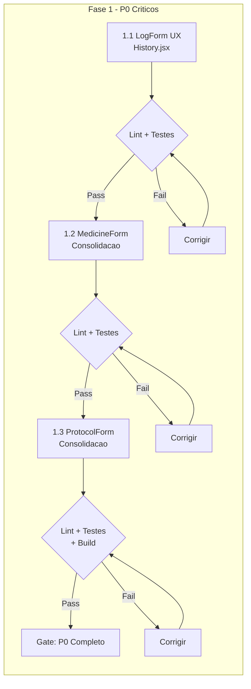
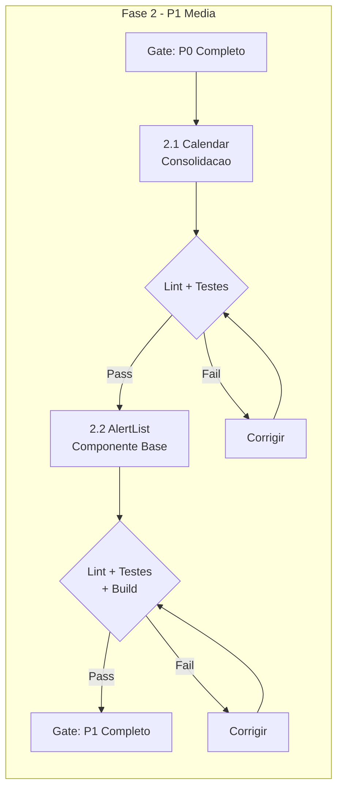

# Plano de Consolidacao de Componentes - Meus Remedios

**Versao:** 1.0  
**Data:** 11/02/2026  
**Status:** AUTHORIZED  
**Arquiteto Responsavel:** Architect Agent  

---

## 1. Resumo Executivo

Este documento especifica o blueprint tecnico completo para consolidacao de 7 grupos de componentes duplicados no aplicativo Meus Remedios. A consolidacao visa reduzir ~500 linhas de codigo duplicado, padronizar UX e melhorar manutenibilidade.

### Impacto Estimado

| Metrica | Valor |
|---------|-------|
| Linhas de codigo a remover | ~500 |
| Componentes afetados | 13 arquivos |
| Novos arquivos a criar | 3 |
| Arquivos a remover | 3 (apos depreciacao) |
| Views impactadas | 2 (Dashboard, History) |

---

## 2. Especificacao Tecnica por Componente

### 2.1 P0 - LogForm UX Padronizacao (CRITICO)

#### Problema
O componente [`LogForm.jsx`](src/components/log/LogForm.jsx:1) é usado em [`Dashboard.jsx`](src/views/Dashboard.jsx:670) e [`History.jsx`](src/views/History.jsx:290), mas com UX diferente:
- Dashboard: recebe `treatmentPlans` → mostra botao "Plano Completo"
- History: nao recebe `treatmentPlans` → botao "Plano Completo" oculto

#### Decisao Arquitetural
**Opcao A selecionada:** Habilitar "Plano Completo" no History passando `treatmentPlans`.

Justificativa:
- UX consistente em toda aplicacao
- Menor complexidade que criar modo explicito
- Reutiliza logica existente de bulk registration
- Sem breaking changes na API do componente

#### Interface/Props (sem alteracao)

```jsx
export default function LogForm({
  protocols,
  treatmentPlans = [],  // Ja existe, sera passado no History
  initialValues,
  onSave,
  onCancel
})
```

#### Modificacoes Necessarias

**Arquivo:** `src/views/History.jsx`

```jsx
// Adicionar no state (linha ~40)
const [treatmentPlans, setTreatmentPlans] = useState([])

// Adicionar no useEffect de loadInitialData (linha ~60)
const [protocolsData, plansData, logsForMonth] = await Promise.all([
  protocolService.getActive(),
  treatmentPlanService.getAll(),  // ← ADICIONAR
  logService.getByMonth(new Date().getFullYear(), new Date().getMonth())
])
setProtocols(protocolsData)
setTreatmentPlans(plansData)  // ← ADICIONAR

// No Modal LogForm (linha ~290)
<LogForm
  protocols={protocols}
  treatmentPlans={treatmentPlans}  // ← ADICIONAR
  initialValues={editingLog}
  onSave={handleLogMedicine}
  onCancel={...}
/>
```

**Import necessario:**
```jsx
import { treatmentPlanService } from '../../services/api/treatmentPlanService'
```

#### Testes Obrigatorios
- [ ] Teste: Botao "Plano Completo" visivel em History quando ha treatmentPlans
- [ ] Teste: Registro bulk funciona em History
- [ ] Teste: Edicao de log individual continua funcionando
- [ ] Teste: Lint passa sem erros

#### Estimativa
- **Linhas removidas:** 0
- **Linhas modificadas:** ~15
- **Tempo estimado:** 2-3h

---

### 2.2 P0 - MedicineForm Consolidacao (CRITICO)

#### Problema
[`MedicineForm.jsx`](src/components/medicine/MedicineForm.jsx:1) e [`FirstMedicineStep.jsx`](src/components/onboarding/FirstMedicineStep.jsx:1) compartilham ~200 linhas de codigo duplicado para formulario de medicamento.

#### Estrategia de Consolidacao
Extender `MedicineForm` com props opcionais para comportamento de onboarding.

#### Nova Interface/Props

```jsx
/**
 * @typedef {Object} MedicineFormProps
 * @property {Object} [medicine] - Dados para edicao (modo edicao)
 * @property {Function} onSave - Callback ao salvar (recebe dados validados)
 * @property {Function} [onCancel] - Callback ao cancelar
 * @property {Function} [onSuccess] - Callback apos sucesso (para onboarding)
 * @property {boolean} [autoAdvance=false] - Se true, chama onSuccess apos delay
 * @property {boolean} [showSuccessMessage=true] - Mostrar mensagem de sucesso
 * @property {boolean} [showCancelButton=true] - Mostrar botao cancelar
 * @property {string} [submitButtonLabel] - Label customizado do botao submit
 * @property {string} [title] - Titulo customizado do formulario
 */

export default function MedicineForm({
  medicine,
  onSave,
  onCancel,
  onSuccess,
  autoAdvance = false,
  showSuccessMessage = true,
  showCancelButton = true,
  submitButtonLabel,
  title
})
```

#### Implementacao

O componente `MedicineForm` sera atualizado para:

1. **Adicionar estado de sucesso:**
```jsx
const [saveSuccess, setSaveSuccess] = useState(false)
```

2. **Modificar handleSubmit:**
```jsx
const handleSubmit = async (e) => {
  // ... validacao existente ...
  
  try {
    const dataToSave = { /* ... */ }
    const savedMedicine = await onSave(dataToSave)
    
    if (showSuccessMessage) {
      setSaveSuccess(true)
    }
    
    if (autoAdvance && onSuccess) {
      setTimeout(() => {
        onSuccess(savedMedicine)
      }, 800)
    }
  } catch (error) {
    // ... tratamento existente ...
  }
}
```

3. **Adicionar mensagem de sucesso condicional:**
```jsx
{saveSuccess && showSuccessMessage && (
  <div className="success-message">
    {/* ... */}
  </div>
)}
```

4. **Botao submit dinamico:**
```jsx
<Button type="submit" ...>
  {isSubmitting ? 'Salvando...' : 
    submitButtonLabel || (medicine ? 'Atualizar' : 'Salvar')
  }
</Button>
```

#### Migracao FirstMedicineStep

```jsx
// Substituir formulario interno por MedicineForm
import MedicineForm from '../medicine/MedicineForm'
import { cachedMedicineService } from '../../services/api/cachedServices'

// No render:
<MedicineForm
  onSave={async (data) => {
    const saved = await cachedMedicineService.create(data)
    updateOnboardingData('medicine', saved)
    return saved
  }}
  onSuccess={(saved) => nextStep()}
  autoAdvance={true}
  showCancelButton={false}
  submitButtonLabel="Salvar e Continuar"
  title="Cadastre seu primeiro medicamento"
/>
```

#### Arquivos Modificados
- `src/components/medicine/MedicineForm.jsx` - Adicionar novas props e logica
- `src/components/onboarding/FirstMedicineStep.jsx` - Usar MedicineForm

#### Arquivos a Remover (apos depreciacao)
- `src/components/onboarding/FirstMedicineStep.jsx` (conteudo migrado para wrapper)
- `src/components/onboarding/FirstMedicineStep.css` (estilos migrados)

#### Testes Obrigatorios
- [ ] Teste: Modo normal (edicoes/cancelamento) funciona
- [ ] Teste: Modo onboarding (autoAdvance, sem cancelar) funciona
- [ ] Teste: Valores default de props funcionam
- [ ] Teste: ShakeEffect continua funcionando em validacoes

#### Estimativa
- **Linhas removidas:** ~200
- **Linhas adicionadas:** ~50 (em MedicineForm)
- **Tempo estimado:** 4-6h

---

### 2.3 P0 - ProtocolForm Consolidacao (CRITICO)

#### Problema
[`ProtocolForm.jsx`](src/components/protocol/ProtocolForm.jsx:1) (406 linhas) e [`FirstProtocolStep.jsx`](src/components/onboarding/FirstProtocolStep.jsx:1) (330 linhas) compartilham ~300 linhas de logica de formulario de protocolo.

#### Estrategia de Consolidacao
Extender `ProtocolForm` com modo `simple` para onboarding.

#### Nova Interface/Props

```jsx
/**
 * @typedef {Object} ProtocolFormProps
 * @property {Array} medicines - Lista de medicamentos disponiveis
 * @property {Array} [treatmentPlans=[]] - Planos de tratamento
 * @property {Object} [protocol] - Protocolo para edicao
 * @property {Object} [initialValues] - Valores iniciais
 * @property {Function} onSave - Callback ao salvar
 * @property {Function} [onCancel] - Callback ao cancelar
 * @property {Function} [onSuccess] - Callback apos sucesso
 * @property {'full'|'simple'} [mode='full'] - Modo de exibicao
 * @property {boolean} [autoAdvance=false] - Avanco automatico
 * @property {boolean} [preselectedMedicine] - Medicamento pre-selecionado
 * @property {string} [title] - Titulo customizado
 */

export default function ProtocolForm({
  medicines,
  treatmentPlans = [],
  protocol,
  initialValues,
  onSave,
  onCancel,
  onSuccess,
  mode = 'full',
  autoAdvance = false,
  preselectedMedicine = null,
  title
})
```

#### Diferencas entre Modos

| Feature | Modo 'full' | Modo 'simple' |
|---------|-------------|---------------|
| Selecao de medicamento | Dropdown completo | Pre-selecionado ou escondido |
| TitrationWizard | Disponivel | Oculto |
| TreatmentPlan | Disponivel | Oculto |
| Campo notes | Visivel | Opcional |
| Layout | Formulario padrao | Estilo onboarding |
| Botao cancelar | Visivel | Oculto |

#### Implementacao do Modo Simple

```jsx
// No inicio do componente
const isSimpleMode = mode === 'simple'
const medicineId = preselectedMedicine?.id || protocol?.medicine_id

// No form, campo medicine_id condicional:
{!isSimpleMode && (
  <div className="form-group">
    <label>Medicamento *</label>
    <select ...>{/* ... */}</select>
  </div>
)}

{isSimpleMode && medicineId && (
  <input type="hidden" name="medicine_id" value={medicineId} />
)}

// TitrationWizard condicional:
{!isSimpleMode && enableTitration && (
  <TitrationWizard ... />
)}

// TreatmentPlan condicional:
{!isSimpleMode && (
  <div className="form-group">
    <label>Plano de Tratamento</label>
    {/* ... */}
  </div>
)}
```

#### Migracao FirstProtocolStep

```jsx
import ProtocolForm from '../protocol/ProtocolForm'
import { cachedProtocolService } from '../../services/api/cachedServices'

// Verificacao de medicine existente:
if (!medicine) {
  return <ErrorState ... />
}

// Render:
<ProtocolForm
  medicines={[medicine]}  // Apenas o medicamento do onboarding
  preselectedMedicine={medicine}
  initialValues={onboardingData.protocol}
  onSave={async (data) => {
    const saved = await cachedProtocolService.create({
      ...data,
      titration_status: 'estável',
      active: true
    })
    updateOnboardingData('protocol', saved)
    return saved
  }}
  onSuccess={() => nextStep()}
  mode="simple"
  autoAdvance={true}
  title={`Crie seu primeiro protocolo para ${medicine.name}`}
/>
```

#### Arquivos Modificados
- `src/components/protocol/ProtocolForm.jsx` - Adicionar modo simple
- `src/components/onboarding/FirstProtocolStep.jsx` - Usar ProtocolForm

#### Arquivos a Remover (apos depreciacao)
- `src/components/onboarding/FirstProtocolStep.jsx`
- `src/components/onboarding/FirstProtocolStep.css`

#### Testes Obrigatorios
- [ ] Teste: Modo full (completo) funciona normalmente
- [ ] Teste: Modo simple (onboarding) esconde features avancadas
- [ ] Teste: TitrationWizard so aparece em modo full
- [ ] Teste: Medicine pre-selecionado funciona em modo simple
- [ ] Teste: Auto-advance funciona corretamente

#### Estimativa
- **Linhas removidas:** ~300
- **Linhas adicionadas:** ~80 (em ProtocolForm)
- **Tempo estimado:** 6-8h

---

### 2.4 P1 - Calendar Consolidacao (MEDIA)

#### Problema
[`Calendar.jsx`](src/components/ui/Calendar.jsx:1) (80 linhas) e [`CalendarWithMonthCache.jsx`](src/components/ui/CalendarWithMonthCache.jsx:1) (198 linhas) duplicam logica de renderizacao de calendario.

#### Estrategia de Consolidacao
Unificar em `Calendar.jsx` com features opcionais via props.

#### Interface/Props Consolidada

```jsx
/**
 * @typedef {Object} CalendarProps
 * @property {Array<string>} [markedDates=[]] - Datas com marcacao
 * @property {Date} [selectedDate] - Data selecionada
 * @property {Function} [onDayClick] - Callback ao clicar em dia
 * @property {boolean} [enableLazyLoad=false] - Habilitar lazy loading de meses
 * @property {Function} [onLoadMonth] - Callback para carregar dados do mes
 * @property {boolean} [enableSwipe=false] - Habilitar navegacao por swipe
 * @property {boolean} [enableMonthPicker=false] - Habilitar seletor de mes
 * @property {Object} [monthPickerRange] - Range do seletor {start, end} em meses
 */

export default function Calendar({
  markedDates = [],
  selectedDate,
  onDayClick,
  enableLazyLoad = false,
  onLoadMonth,
  enableSwipe = false,
  enableMonthPicker = false,
  monthPickerRange = { start: -12, end: 3 }
})
```

#### Implementacao

Unificar a logica de `CalendarWithMonthCache` em `Calendar`:

```jsx
export default function Calendar({
  markedDates = [],
  selectedDate,
  onDayClick,
  enableLazyLoad = false,
  onLoadMonth,
  enableSwipe = false,
  enableMonthPicker = false,
  monthPickerRange = { start: -12, end: 3 }
}) {
  const [viewDate, setViewDate] = useState(new Date())
  const [isLoading, setIsLoading] = useState(false)
  const [touchStart, setTouchStart] = useState(null)
  const [touchEnd, setTouchEnd] = useState(null)

  // Lazy loading effect
  useEffect(() => {
    if (!enableLazyLoad || !onLoadMonth) return
    
    const year = viewDate.getFullYear()
    const month = viewDate.getMonth()
    
    setIsLoading(true)
    onLoadMonth(year, month).finally(() => setIsLoading(false))
  }, [viewDate, enableLazyLoad, onLoadMonth])

  // Navigation handlers
  const handlePreviousMonth = () => {/* ... */}
  const handleNextMonth = () => {/* ... */}

  // Touch handlers (so se enableSwipe)
  const handleTouchStart = enableSwipe ? (e) => {/* ... */} : undefined
  const handleTouchMove = enableSwipe ? (e) => {/* ... */} : undefined
  const handleTouchEnd = enableSwipe ? () => {/* ... */} : undefined

  // Month picker (so se enableMonthPicker)
  const generateMonthOptions = () => {/* ... */}

  // Render controls baseado nas features
  const renderControls = () => {
    if (enableMonthPicker) {
      return (
        <div className="calendar-controls">
          <button onClick={handlePreviousMonth} disabled={isLoading}><</button>
          <select value={`${year}-${month}`} onChange={handleMonthSelect}>
            {generateMonthOptions().map(opt => <option key={opt.value} value={opt.value}>{opt.label}</option>)}
          </select>
          <button onClick={handleNextMonth} disabled={isLoading}>></button>
        </div>
      )
    }
    
    // Controles simples (default)
    return (
      <div className="calendar-controls">
        <button onClick={handlePreviousMonth} disabled={isLoading}><</button>
        <div className="current-month">{monthNames[month]} {year}</div>
        <button onClick={handleNextMonth} disabled={isLoading}>></button>
      </div>
    )
  }

  return (
    <div className="calendar-widget">
      {renderControls()}
      <div className="calendar-weekdays">{/* ... */}</div>
      <div 
        className="calendar-grid"
        onTouchStart={handleTouchStart}
        onTouchMove={handleTouchMove}
        onTouchEnd={handleTouchEnd}
      >
        {isLoading ? (
          <div className="calendar-skeleton">{/* ... */}</div>
        ) : (
          renderDays()
        )}
      </div>
    </div>
  )
}
```

#### Migracao de Consumidores

**History.jsx (usa lazy load):**
```jsx
// Antes:
import CalendarWithMonthCache from '../components/ui/CalendarWithMonthCache'
<CalendarWithMonthCache onLoadMonth={loadMonthData} ... />

// Depois:
import Calendar from '../components/ui/Calendar'
<Calendar 
  enableLazyLoad={true}
  onLoadMonth={loadMonthData}
  enableSwipe={true}
  enableMonthPicker={true}
  ... 
/>
```

**Outros usos (sem lazy load):**
```jsx
// Antes:
import Calendar from '../components/ui/Calendar'
<Calendar markedDates={dates} ... />

// Depois: (sem alteracao - valores default mantem comportamento)
<Calendar markedDates={dates} ... />
```

#### Arquivos Modificados
- `src/components/ui/Calendar.jsx` - Consolidacao completa

#### Arquivos a Remover (apos depreciacao)
- `src/components/ui/CalendarWithMonthCache.jsx`

#### Testes Obrigatorios
- [ ] Teste: Modo basico (sem features) funciona
- [ ] Teste: Lazy loading funciona quando habilitado
- [ ] Teste: Swipe navigation funciona quando habilitado
- [ ] Teste: Month picker funciona quando habilitado
- [ ] Teste: Combinacao de features funciona

#### Estimativa
- **Linhas removidas:** ~80
- **Linhas adicionadas:** ~40 (em Calendar)
- **Tempo estimado:** 4-6h

---

### 2.5 P1 - AlertList Componente Base (MEDIA)

#### Problema
[`SmartAlerts.jsx`](src/components/dashboard/SmartAlerts.jsx:1) e [`StockAlertsWidget.jsx`](src/components/dashboard/StockAlertsWidget.jsx:1) compartilham estrutura UI similar para listagem de alertas.

#### Estrategia de Consolidacao
Criar componente base `AlertList` reutilizavel, manter wrappers especificos.

#### Nova Interface/Props - AlertList

```jsx
/**
 * @typedef {Object} Alert
 * @property {string} id - Identificador unico
 * @property {string} severity - 'critical' | 'warning' | 'info'
 * @property {string} title - Titulo do alerta
 * @property {string} message - Mensagem descritiva
 * @property {Array<AlertAction>} [actions] - Acoes disponiveis
 */

/**
 * @typedef {Object} AlertAction
 * @property {string} label - Texto do botao
 * @property {string} type - Tipo visual 'primary' | 'secondary' | 'danger'
 * @property {string} [title] - Tooltip
 * @property {string} actionId - Identificador da acao
 */

/**
 * @typedef {Object} AlertListProps
 * @property {Array<Alert>} alerts - Lista de alertas
 * @property {Function} [onAction] - Callback (alert, action) => void
 * @property {string} [variant='default'] - Variante visual
 * @property {boolean} [showExpandButton=true] - Mostrar botao expandir
 * @property {number} [maxVisible=3] - Maximo de itens visiveis
 * @property {string} [emptyIcon] - Icone quando vazio
 * @property {string} [emptyMessage] - Mensagem quando vazio
 * @property {string} [title] - Titulo do widget
 * @property {React.ReactNode} [headerAction] - Acao adicional no header
 */

export default function AlertList({
  alerts = [],
  onAction,
  variant = 'default',
  showExpandButton = true,
  maxVisible = 3,
  emptyIcon = '✅',
  emptyMessage = 'Nenhum alerta',
  title,
  headerAction
})
```

#### Implementacao

```jsx
// src/components/ui/AlertList.jsx
import { useState } from 'react'
import './AlertList.css'

export default function AlertList({
  alerts = [],
  onAction,
  variant = 'default',
  showExpandButton = true,
  maxVisible = 3,
  emptyIcon = '✅',
  emptyMessage = 'Nenhum alerta',
  title,
  headerAction
}) {
  const [expanded, setExpanded] = useState(false)
  
  const totalAlerts = alerts.length
  const hasAlerts = totalAlerts > 0
  const displayLimit = expanded ? Infinity : maxVisible
  const displayItems = alerts.slice(0, displayLimit)
  const hasMore = alerts.length > displayLimit

  // Estado vazio
  if (!hasAlerts) {
    return (
      <div className={`alert-list alert-list--empty alert-list--${variant}`}>
        {title && (
          <div className="alert-list__header">
            <h3 className="alert-list__title">{title}</h3>
            {headerAction}
          </div>
        )}
        <div className="alert-list__empty">
          <span className="alert-list__empty-icon">{emptyIcon}</span>
          <p className="alert-list__empty-message">{emptyMessage}</p>
        </div>
      </div>
    )
  }

  return (
    <div className={`alert-list alert-list--${variant}`}>
      {title && (
        <div className="alert-list__header">
          <div className="alert-list__title-group">
            <h3 className="alert-list__title">{title}</h3>
            {totalAlerts > 0 && (
              <span className="alert-list__badge">{totalAlerts}</span>
            )}
          </div>
          {headerAction}
        </div>
      )}

      <div className="alert-list__content">
        {displayItems.map((alert) => (
          <div 
            key={alert.id} 
            className={`alert-list__item alert-list__item--${alert.severity}`}
          >
            <div className="alert-list__item-icon">
              {alert.severity === 'critical' ? '⚠️' : 
               alert.severity === 'warning' ? '⚡' : 'ℹ️'}
            </div>
            
            <div className="alert-list__item-content">
              <h4 className="alert-list__item-title">{alert.title}</h4>
              <p className="alert-list__item-message">{alert.message}</p>
            </div>

            {alert.actions?.length > 0 && (
              <div className="alert-list__item-actions">
                {alert.actions.map((action) => (
                  <button
                    key={action.actionId || action.label}
                    className={`alert-list__btn alert-list__btn--${action.type}`}
                    title={action.title}
                    onClick={() => onAction?.(alert, action)}
                  >
                    {action.label}
                  </button>
                ))}
              </div>
            )}
          </div>
        ))}
      </div>

      {showExpandButton && hasMore && (
        <button 
          className="alert-list__expand-btn"
          onClick={() => setExpanded(!expanded)}
        >
          {expanded ? 'Ver menos ↑' : `Ver mais (${alerts.length - displayLimit}) ↓`}
        </button>
      )}
    </div>
  )
}
```

#### Refatoracao SmartAlerts

```jsx
// src/components/dashboard/SmartAlerts.jsx
import AlertList from '../ui/AlertList'

export default function SmartAlerts({ alerts = [], onAction }) {
  if (!alerts || alerts.length === 0) return null

  // Mapear alerts para formato padrao
  const normalizedAlerts = alerts.map(alert => ({
    id: alert.id,
    severity: alert.severity,
    title: alert.title,
    message: alert.message,
    actions: alert.actions?.map(a => ({
      label: a.label,
      type: a.type,
      title: a.title,
      actionId: a.label  // Usar label como id se nao tiver
    }))
  }))

  return (
    <AlertList
      alerts={normalizedAlerts}
      onAction={onAction}
      variant="smart"
      showExpandButton={false}
      maxVisible={alerts.length}  // Mostrar todos
    />
  )
}
```

#### Refatoracao StockAlertsWidget

```jsx
// src/components/dashboard/StockAlertsWidget.jsx
import AlertList from '../ui/AlertList'

export default function StockAlertsWidget({ 
  lowStockItems = [], 
  outOfStockItems = [],
  onAddStock,
  onViewAll
}) {
  // Converter items para formato de alerta
  const alerts = [
    ...outOfStockItems.map(item => ({
      id: `out-${item.medicineId}`,
      severity: 'critical',
      title: item.name,
      message: 'Sem estoque disponivel',
      actions: [{
        label: '+ Estoque',
        type: 'primary',
        actionId: 'add-stock'
      }],
      medicineId: item.medicineId
    })),
    ...lowStockItems.map(item => ({
      id: `low-${item.medicineId}`,
      severity: 'warning',
      title: item.name,
      message: `${item.currentStock} ${item.unit || 'un'} restantes (min: ${item.minStock})`,
      actions: [{
        label: '+ Estoque',
        type: 'secondary',
        actionId: 'add-stock'
      }],
      medicineId: item.medicineId
    }))
  ]

  const handleAction = (alert, action) => {
    if (action.actionId === 'add-stock') {
      onAddStock?.(alert.medicineId)
    }
  }

  return (
    <AlertList
      alerts={alerts}
      onAction={handleAction}
      variant="stock"
      title="Alertas de Estoque"
      emptyIcon="📦"
      emptyMessage="Todos os medicamentos com estoque adequado"
      headerAction={
        <button className="stock-alerts__view-all" onClick={onViewAll}>
          Gerenciar estoques →
        </button>
      }
      showExpandButton={true}
      maxVisible={3}
    />
  )
}
```

#### Arquivos Criados
- `src/components/ui/AlertList.jsx` - Componente base
- `src/components/ui/AlertList.css` - Estilos

#### Arquivos Modificados
- `src/components/dashboard/SmartAlerts.jsx` - Usar AlertList
- `src/components/dashboard/StockAlertsWidget.jsx` - Usar AlertList

#### Testes Obrigatorios
- [ ] Teste: AlertList renderiza lista de alertas
- [ ] Teste: Estado vazio funciona corretamente
- [ ] Teste: Expandir/colapsar funciona
- [ ] Teste: Acoes chamam onAction corretamente
- [ ] Teste: SmartAlerts continua funcionando
- [ ] Teste: StockAlertsWidget continua funcionando

#### Estimativa
- **Linhas removidas:** ~50 (duplicacao entre SmartAlerts e StockAlertsWidget)
- **Linhas adicionadas:** ~180 (AlertList) + ~30 (refatoracoes)
- **Tempo estimado:** 3-4h

---

### 2.6 P2 - Adherence Documentacao (BAIXA)

#### Acao
Adicionar JSDoc aos componentes:
- [`AdherenceWidget.jsx`](src/components/adherence/AdherenceWidget.jsx:1)
- [`AdherenceProgress.jsx`](src/components/adherence/AdherenceProgress.jsx:1)

#### Documentacao a Adicionar

```jsx
/**
 * AdherenceWidget - Widget completo de adesao ao tratamento
 * 
 * Inclui:
 * - Grafico de tendencia de adesao
 * - Seletor de periodo (7d, 30d, 90d)
 * - Streak atual
 * - Scores por protocolo
 * 
 * @param {Object} props
 * @param {string} [props.className] - Classes CSS adicionais
 * @param {Function} [props.onPeriodChange] - Callback ao mudar periodo
 */
```

```jsx
/**
 * AdherenceProgress - Componente visual de progresso circular
 * 
 * Componente puro de visualizacao. Para widget completo com dados,
 * usar AdherenceWidget.
 * 
 * @param {Object} props
 * @param {number} props.percentage - Percentual de adesao (0-100)
 * @param {string} [props.size='md'] - Tamanho: 'sm' | 'md' | 'lg'
 * @param {boolean} [props.showLabel=true] - Mostrar label no centro
 * @param {string} [props.className] - Classes CSS adicionais
 */
```

#### Estimativa
- **Linhas adicionadas:** ~30 (comentarios JSDoc)
- **Tempo estimado:** 1h

---

### 2.7 P2 - DashboardWidgets Simplificacao (BAIXA)

#### Problema
[`DashboardWidgets.jsx`](src/components/dashboard/DashboardWidgets.jsx:1) eh um container desnecessario que apenas orquestra outros widgets.

#### Decisao Arquitetural
**Manter por enquanto.** A remocao requer refatoracao do Dashboard.jsx que esta fora do escopo desta consolidacao. O componente sera avaliado em futura refatoracao de arquitetura.

#### Acao
- Adicionar comentario TODO no codigo indicando possivel simplificacao futura
- Documentar no plano que esta otimizacao foi **adiada**

---

## 3. Sequencia de Implementacao

### Fase 1: P0 - Consolidacoes Criticas (Semana 1)



| Ordem | Componente | Dependencias | Gate de Qualidade |
|-------|------------|--------------|-------------------|
| 1.1 | LogForm UX | Nenhuma | `npm run lint` + `npm run test:related` |
| 1.2 | MedicineForm | Nenhuma | `npm run lint` + `npm run test:critical` |
| 1.3 | ProtocolForm | MedicineForm (padrao) | `npm run validate` + `npm run build` |

### Fase 2: P1 - Componentes Media (Semana 2)



| Ordem | Componente | Dependencias | Gate de Qualidade |
|-------|------------|--------------|-------------------|
| 2.1 | Calendar | Nenhuma | `npm run lint` + `npm run test:related` |
| 2.2 | AlertList | Nenhuma | `npm run validate` + `npm run build` |

### Fase 3: P2 - Finalizacao (Semana 2)

| Ordem | Componente | Dependencias | Gate de Qualidade |
|-------|------------|--------------|-------------------|
| 3.1 | Adherence JSDoc | Nenhuma | `npm run lint` |
| 3.2 | Remocao arquivos deprecados | Todas as fases | `npm run validate` |

---

## 4. Estrategia de Backward Compatibility

### 4.1 Periodo de Depreciacao

**Fase 1-2 (Implementacao):** 2-3 semanas
- Arquivos antigos mantidos
- Warnings no console sobre depreciacao
- Documentacao atualizada

**Fase 3 (Remocao):** Apos validacao
- Arquivos deprecados removidos
- Testes finais executados

### 4.2 Mapeamento de Migracao

| Componente Antigo | Novo Componente | Props Alteradas |
|-------------------|-----------------|-----------------|
| `FirstMedicineStep` | `MedicineForm` | Adicionar `autoAdvance`, `onSuccess` |
| `FirstProtocolStep` | `ProtocolForm` | Adicionar `mode='simple'`, `preselectedMedicine` |
| `CalendarWithMonthCache` | `Calendar` | Adicionar `enableLazyLoad={true}` |

### 4.3 Wrapper de Compatibilidade (Temporario)

Para suavizar a transicao, wrappers temporarios podem ser criados:

```jsx
// src/components/onboarding/FirstMedicineStep.jsx (wrapper temporario)
import MedicineForm from '../medicine/MedicineForm'

/**
 * @deprecated Use MedicineForm com props de onboarding diretamente
 */
export default function FirstMedicineStep(props) {
  console.warn('FirstMedicineStep is deprecated. Use MedicineForm with autoAdvance prop.')
  return <MedicineForm {...props} autoAdvance={true} />
}
```

---

## 5. Critérios de Aceitacao

### 5.1 Checklist por Componente

#### LogForm UX
- [ ] Botao "Plano Completo" visivel em History quando ha treatmentPlans
- [ ] Registro bulk funciona em History
- [ ] Edicao de log individual continua funcionando
- [ ] Dashboard nao quebrou
- [ ] Lint passa: `npm run lint`

#### MedicineForm Consolidado
- [ ] Modo normal (edicoes/cancelamento) funciona
- [ ] Modo onboarding (autoAdvance, sem cancelar) funciona
- [ ] FirstMedicineStep usa MedicineForm
- [ ] Formulario de medicamentos em /medicines funciona
- [ ] Testes criticos passam: `npm run test:critical`

#### ProtocolForm Consolidado
- [ ] Modo full (completo) funciona normalmente
- [ ] Modo simple (onboarding) esconde features avancadas
- [ ] FirstProtocolStep usa ProtocolForm
- [ ] Formulario de protocolos em /protocols funciona
- [ ] Testes criticos passam: `npm run test:critical`

#### Calendar Consolidado
- [ ] Modo basico funciona (sem features)
- [ ] History.jsx usa Calendar com lazy loading
- [ ] Swipe funciona em mobile
- [ ] Month picker funciona
- [ ] Testes relacionados passam: `npm run test:related`

#### AlertList
- [ ] Componente base renderiza corretamente
- [ ] SmartAlerts usa AlertList
- [ ] StockAlertsWidget usa AlertList
- [ ] Estado vazio funciona
- [ ] Expandir/colapsar funciona

### 5.2 Gates de Qualidade Obrigatorios

```bash
# Pre-commit (toda alteracao)
npm run lint

# Pre-push (apos cada fase)
npm run validate  # lint + testes criticos

# Pre-merge (final de cada fase)
npm run validate
npm run build

# Smoke test (validacao rapida)
npm run test:smoke
```

### 5.3 Metricas de Sucesso

| Metrica | Antes | Depois | Minimo Aceitavel |
|---------|-------|--------|------------------|
| Linhas de codigo duplicado | ~600 | ~100 | < 150 |
| Tempo de build | baseline | +0% | < +10% |
| Testes passando | 100% | 100% | 100% |
| Lint errors | 0 | 0 | 0 |
| Bundle size | baseline | -5KB | -3KB |

---

## 6. Riscos e Mitigacoes

### 6.1 Riscos Tecnicos

| Risco | Impacto | Probabilidade | Mitigacao |
|-------|---------|---------------|-----------|
| Breaking change em formularios | Alto | Media | Testes extensivos, backward compatibility |
| Regressao em onboarding | Alto | Baixa | Testar fluxo completo de onboarding |
| Performance de Calendar degradada | Medio | Baixa | Lazy loading continua funcionando, testes de perf |
| Conflitos de CSS/estilos | Medio | Media | Isolamento de classes, testes visuais |
| Complexidade excessive de props | Medio | Media | Valores default apropriados, documentacao clara |

### 6.2 Estrategias de Rollback

#### Rollback Parcial (por componente)
```bash
# Se um componente especifico quebrar:
git revert <commit-do-componente>
# Restaurar arquivo antigo temporariamente
```

#### Rollback Completo (emergencia)
```bash
# Criar branch de hotfix a partir de main
git checkout -b hotfix/rollback-consolidacao main

# Reverter commits da consolidacao
git revert <commit-inicial>..<commit-final>

# Validar e deploy
npm run validate && npm run build
```

#### Backup de Arquivos Antigos
Durante a fase de transicao (2-3 semanas), manter copias dos arquivos originais:
```
backup/consolidacao/
├── FirstMedicineStep.jsx.bak
├── FirstProtocolStep.jsx.bak
├── CalendarWithMonthCache.jsx.bak
```

### 6.3 Plano de Contingencia

**Cenario:** Bug critico em producao apos consolidacao

1. **Imediato (0-15min):**
   - Identificar componente afetado
   - Avaliar se eh possivel hotfix rapido

2. **Curto prazo (15-60min):**
   - Se hotfix nao for trivial: ativar rollback parcial
   - Restaurar arquivo antigo do backup

3. **Medio prazo (1-24h):**
   - Investigar root cause
   - Corrigir e testar em ambiente de staging
   - Deploy correcao

---

## 7. Documentacao de Referencia

### 7.1 Documentos Relacionados

| Documento | Proposito | Localizacao |
|-----------|-----------|-------------|
| Analise inicial | Identificacao dos duplicados | [`plans/ANALISE_COMPONENTES_DUPLICADOS.md`](plans/ANALISE_COMPONENTES_DUPLICADOS.md:1) |
| Framework | Governanca e padroes | [`docs/ARQUITETURA_FRAMEWORK.md`](docs/ARQUITETURA_FRAMEWORK.md:1) |
| Padroes de codigo | Convencoes obrigatorias | [`docs/PADROES_CODIGO.md`](docs/PADROES_CODIGO.md:1) |

### 7.2 Comandos Uteis

```bash
# Validacao rapida durante desenvolvimento
npm run lint
npm run test:related

# Validacao completa antes de merge
npm run validate
npm run build

# Verificar arquivos modificados
git diff --name-only

# Contagem de linhas de codigo
find src/components -name '*.jsx' -not -path '*/node_modules/*' | xargs wc -l
```

---

## 8. Aprovacoes

| Role | Nome | Data | Status |
|------|------|------|--------|
| Arquiteto | Architect Agent | 11/02/2026 | AUTHORIZED |
| Tech Lead | [A designar] | - | PENDING |
| Product Owner | [A designar] | - | PENDING |

---

## 9. Historico de Revisoes

| Versao | Data | Autor | Alteracoes |
|--------|------|-------|------------|
| 1.0 | 11/02/2026 | Architect Agent | Blueprint inicial completo |

---

*Este documento eh a especificacao autoritativa para a consolidacao de componentes. Toda implementacao deve seguir rigorosamente as especificacoes aqui definidas.*
