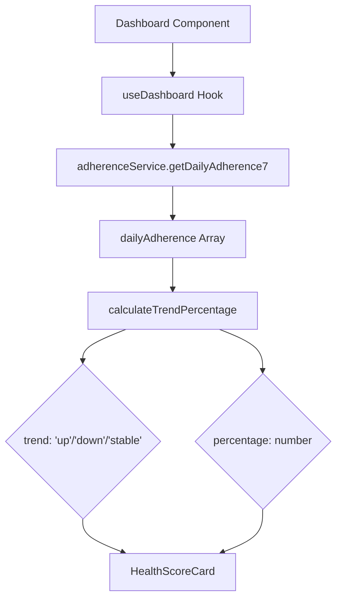
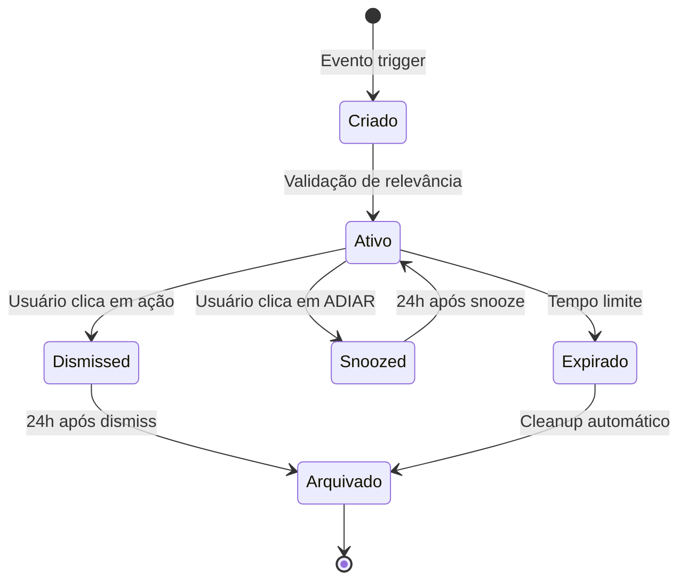

# Design de Implementação: Integração de Lógica de Backend no Dashboard

**Branch:** `feat/fase3.5-melhorias-visuais`
**Data:** 2026-02-09
**Autor:** Architect Mode

---

## Resumo Executivo

Este documento define a abordagem de implementação para integrar lógica de negócio de backend nos componentes do dashboard melhorados visualmente na Fase 3.5. O foco é tornar os componentes dinâmicos e context-aware, utilizando dados reais de adesão, streaks e comportamento do usuário.

**Componentes Alvo:**
1. **HealthScoreCard** - Calcular tendência percentual dinâmica
2. **InsightCard** - Gerar insights contextuais baseados em dados do usuário
3. **SmartAlerts** - Revisar e garantir relevância dos alertas

---

## 1. Trend Percentage no HealthScoreCard

### 1.1 Estado Atual

```jsx
// Dashboard.jsx - Linha 358-364
<HealthScoreCard
  score={stats.score}
  streak={stats.currentStreak}
  trend="up"
  trendPercentage={12}  // ← Valor estático
  onClick={() => setIsHealthDetailsOpen(true)}
/>
```

### 1.2 Estrutura de Dados Disponível

**SparklineAdesao** já calcula tendência (lines 145-167):
```javascript
// SparklineAdesao.jsx
const stats = useMemo(() => {
  if (chartData.length === 0) return { average: 0, trend: 'stable' }

  const validData = chartData.filter(d => d.adherence > 0)
  if (validData.length === 0) return { average: 0, trend: 'stable' }

  const average = Math.round(validData.reduce((sum, d) => sum + d.adherence, 0) / validData.length)

  // Calcular tendência
  let trend = 'stable'
  if (validData.length >= 2) {
    const firstHalf = validData.slice(0, Math.floor(validData.length / 2))
    const secondHalf = validData.slice(Math.floor(validData.length / 2))
    
    const firstAvg = firstHalf.reduce((sum, d) => sum + d.adherence, 0) / firstHalf.length
    const secondAvg = secondHalf.reduce((sum, d) => sum + d.adherence, 0) / secondHalf.length

    if (secondAvg > firstAvg + 5) trend = 'up'
    else if (secondAvg < firstAvg - 5) trend = 'down'
  }

  return { average, trend }
}, [chartData])
```

**Dados de Adesão Diária** (via `adherenceService.getDailyAdherence(7)`):
```javascript
[
  { date: '2026-02-03', adherence: 85, taken: 4, expected: 5 },
  { date: '2026-02-04', adherence: 100, taken: 5, expected: 5 },
  { date: '2026-02-05', adherence: 80, taken: 4, expected: 5 },
  { date: '2026-02-06', adherence: 90, taken: 5, expected: 5 },
  { date: '2026-02-07', adherence: 100, taken: 5, expected: 5 },
  { date: '2026-02-08', adherence: 95, taken: 5, expected: 5 },
  { date: '2026-02-09', adherence: 100, taken: 5, expected: 5 }
]
```

### 1.3 Algoritmo de Cálculo de Tendência Percentual

#### Abordagem 1: Comparação Semanal (Recomendada)

Comparar média da semana atual vs semana anterior:

```javascript
function calculateTrendPercentage(dailyAdherence) {
  if (!dailyAdherence || dailyAdherence.length < 7) {
    return { trend: 'stable', percentage: 0 }
  }

  // Últimos 7 dias (semana atual)
  const currentWeek = dailyAdherence.slice(-7)
  const currentAvg = currentWeek.reduce((sum, d) => sum + d.adherence, 0) / currentWeek.length

  // 7 dias anteriores (semana anterior)
  const previousWeek = dailyAdherence.slice(-14, -7)
  const previousAvg = previousWeek.reduce((sum, d) => sum + d.adherence, 0) / previousWeek.length

  // Calcular variação percentual
  const percentageChange = previousAvg > 0
    ? ((currentAvg - previousAvg) / previousAvg) * 100
    : 0

  // Determinar tendência
  let trend = 'stable'
  if (percentageChange > 5) trend = 'up'
  else if (percentageChange < -5) trend = 'down'

  return {
    trend,
    percentage: Math.abs(Math.round(percentageChange))
  }
}
```

#### Abordagem 2: Comparação Primeira Metade vs Segunda Metade (Simplificada)

Já implementada no SparklineAdesao, mas precisa calcular percentual:

```javascript
function calculateTrendPercentageSimple(dailyAdherence) {
  if (!dailyAdherence || dailyAdherence.length < 2) {
    return { trend: 'stable', percentage: 0 }
  }

  const validData = dailyAdherence.filter(d => d.adherence > 0)
  if (validData.length < 2) {
    return { trend: 'stable', percentage: 0 }
  }

  const midPoint = Math.floor(validData.length / 2)
  const firstHalf = validData.slice(0, midPoint)
  const secondHalf = validData.slice(midPoint)

  const firstAvg = firstHalf.reduce((sum, d) => sum + d.adherence, 0) / firstHalf.length
  const secondAvg = secondHalf.reduce((sum, d) => sum + d.adherence, 0) / secondHalf.length

  const percentageChange = firstAvg > 0
    ? ((secondAvg - firstAvg) / firstAvg) * 100
    : 0

  let trend = 'stable'
  if (percentageChange > 5) trend = 'up'
  else if (percentageChange < -5) trend = 'down'

  return {
    trend,
    percentage: Math.abs(Math.round(percentageChange))
  }
}
```

### 1.4 Casos de Borda

| Caso | Comportamento | Justificativa |
|------|---------------|---------------|
| Menos de 7 dias de dados | `trend: 'stable', percentage: 0` | Dados insuficientes para comparação |
| Primeira semana de uso | `trend: 'stable', percentage: 0` | Sem baseline para comparação |
| Todos os dias com 0% de adesão | `trend: 'stable', percentage: 0` | Sem variação significativa |
| Variação < 5% | `trend: 'stable', percentage: 0` | Variação dentro da margem de erro |
| Variação > 100% | Cap em 100% | Evitar valores extremos |

### 1.5 Fluxo de Dados


```mermaid
graph TD
    A[Dashboard Component] --> B[useDashboard Hook]
    B --> C[adherenceService.getDailyAdherence7]
    C --> D[dailyAdherence Array]
    D --> E[calculateTrendPercentage]
    E --> F{trend: 'up'/'down'/'stable'}
    E --> G{percentage: number}
    F --> H[HealthScoreCard]
    G --> H
```

### 1.6 Implementação Recomendada

**Opção A: Hook Customizado `useTrendPercentage`**

```javascript
// src/hooks/useTrendPercentage.js
import { useMemo } from 'react'

export function useTrendPercentage(dailyAdherence) {
  return useMemo(() => {
    if (!dailyAdherence || dailyAdherence.length < 7) {
      return { trend: 'stable', percentage: 0 }
    }

    const currentWeek = dailyAdherence.slice(-7)
    const previousWeek = dailyAdherence.slice(-14, -7)

    // Se não há dados da semana anterior
    if (previousWeek.length === 0) {
      return { trend: 'stable', percentage: 0 }
    }

    const currentAvg = currentWeek.reduce((sum, d) => sum + d.adherence, 0) / currentWeek.length
    const previousAvg = previousWeek.reduce((sum, d) => sum + d.adherence, 0) / previousWeek.length

    const percentageChange = previousAvg > 0
      ? ((currentAvg - previousAvg) / previousAvg) * 100
      : 0

    let trend = 'stable'
    if (percentageChange > 5) trend = 'up'
    else if (percentageChange < -5) trend = 'down'

    return {
      trend,
      percentage: Math.abs(Math.round(percentageChange))
    }
  }, [dailyAdherence])
}
```

**Uso no Dashboard:**

```javascript
// Dashboard.jsx
import { useTrendPercentage } from '../hooks/useTrendPercentage'

// Dentro do componente
const { trend, trendPercentage } = useTrendPercentage(dailyAdherence)

// No JSX
<HealthScoreCard
  score={stats.score}
  streak={stats.currentStreak}
  trend={trend}
  trendPercentage={trendPercentage}
  onClick={() => setIsHealthDetailsOpen(true)}
/>
```

**Opção B: Função Utilitária em `adherenceLogic.js`**

```javascript
// src/utils/adherenceLogic.js

export function calculateTrendPercentage(dailyAdherence) {
  if (!dailyAdherence || dailyAdherence.length < 7) {
    return { trend: 'stable', percentage: 0 }
  }

  const currentWeek = dailyAdherence.slice(-7)
  const previousWeek = dailyAdherence.slice(-14, -7)

  if (previousWeek.length === 0) {
    return { trend: 'stable', percentage: 0 }
  }

  const currentAvg = currentWeek.reduce((sum, d) => sum + d.adherence, 0) / currentWeek.length
  const previousAvg = previousWeek.reduce((sum, d) => sum + d.adherence, 0) / previousWeek.length

  const percentageChange = previousAvg > 0
    ? ((currentAvg - previousAvg) / previousAvg) * 100
    : 0

  let trend = 'stable'
  if (percentageChange > 5) trend = 'up'
  else if (percentageChange < -5) trend = 'down'

  return {
    trend,
    percentage: Math.abs(Math.round(percentageChange))
  }
}
```

**Uso no Dashboard:**

```javascript
// Dashboard.jsx
import { calculateTrendPercentage } from '../utils/adherenceLogic'

// Dentro do componente
const { trend, trendPercentage } = useMemo(
  () => calculateTrendPercentage(dailyAdherence),
  [dailyAdherence]
)

// No JSX
<HealthScoreCard
  score={stats.score}
  streak={stats.currentStreak}
  trend={trend}
  trendPercentage={trendPercentage}
  onClick={() => setIsHealthDetailsOpen(true)}
/>
```

### 1.7 Recomendação

**Usar Opção B (Função Utilitária)** porque:
- Mantém consistência com `adherenceLogic.js`
- Reutiliza lógica em outros componentes se necessário
- Menos overhead que criar um hook customizado
- Fácil de testar unitariamente

---

## 2. Dynamic InsightCard Content

### 2.1 Estado Atual

```jsx
// Dashboard.jsx - Linhas 374-380
<InsightCard
  icon="💡"
  text="Você tem 40% melhor adesão nos dias que toma café antes do protocolo matinal."
  highlight="40% melhor adesão"
  actionLabel="Configurar Lembrete Extra"
  onAction={() => onNavigate?.('settings')}
/>
```

### 2.2 Tipos de Insights

#### 2.2.1 Insight de Reforço Positivo

**Objetivo:** Celebrar conquistas e manter motivação

**Variantes:**

| ID | Condição | Texto | Highlight | Icon | Action |
|----|----------|-------|-----------|------|--------|
| `streak_achievement` | `stats.currentStreak >= 7` | "Você está em uma sequência de {streak} dias! Continue assim!" | "{streak} dias" | 🔥 | Ver Histórico |
| `perfect_week` | `stats.adherence === 100` | "Semana perfeita! 100% de adesão nos últimos 7 dias." | "100% de adesão" | ⭐ | Compartilhar |
| `improvement` | `trend === 'up' && trendPercentage >= 10` | "Sua adesão melhorou {percentage}% em relação à semana anterior!" | "{percentage}% melhor" | 📈 | Ver Detalhes |
| `stock_healthy` | `stockSummary.every(s => !s.isLow && !s.isZero)` | "Todos os medicamentos com estoque saudável. Ótimo planejamento!" | "estoque saudável" | ✅ | Ver Estoque |

#### 2.2.2 Insight Motivacional

**Objetivo:** Encorajar usuário a melhorar adesão

**Variantes:**

| ID | Condição | Texto | Highlight | Icon | Action |
|----|----------|-------|-----------|------|--------|
| `missed_doses_today` | `todayMissed > 0 && todayMissed <= 2` | "Você tem {missed} doses pendentes hoje. Que tal completar agora?" | "{missed} doses pendentes" | ⏰ | Registrar Doses |
| `low_adherence_week` | `stats.adherence < 70` | "Sua adesão esta semana está em {adherence}%. Vamos melhorar juntos!" | "{adherence}%" | 💪 | Ver Protocolos |
| `streak_broken` | `stats.currentStreak === 0 && stats.longestStreak >= 3` | "Seu streak foi interrompido. Seu recorde foi {longest} dias. Recomece agora!" | "{longest} dias" | 🔄 | Registrar Dose |
| `stock_low_warning` | `stockSummary.some(s => s.isLow)` | "Atenção: {count} medicamentos com estoque baixo. Evite ficar sem!" | "{count} medicamentos" | ⚠️ | Ver Estoque |

#### 2.2.3 Insight Informativo

**Objetivo:** Fornecer contexto e informações úteis

**Variantes:**

| ID | Condição | Texto | Highlight | Icon | Action |
|----|----------|-------|-----------|------|--------|
| `best_time` | `bestTimeOfDay !== null` | "Você tem melhor adesão às {time}. Considere agendar mais doses neste horário." | "{time}" | 🕐 | Configurar Lembretes |
| `most_missed` | `mostMissedMedicine !== null` | "{medicine} é o medicamento mais esquecido. Configure um lembrete extra!" | "{medicine}" | 💊 | Configurar Lembrete |
| `weekly_summary` | `isMonday` | "Resumo da semana passada: {adherence}% de adesão. {trend} em relação à anterior." | "{adherence}%" | 📊 | Ver Relatório |

### 2.3 Sistema de Prioridade

```javascript
const INSIGHT_PRIORITY = {
  critical: 1,  // Stock zero, doses críticas atrasadas
  high: 2,      // Stock baixo, streak quebrado
  medium: 3,    // Baixa adesão, doses pendentes
  low: 4,       // Reforço positivo, informativo
  info: 5       // Dicas gerais
}
```

### 2.4 Algoritmo de Seleção de Insight

```javascript
// src/services/insightService.js

export function selectBestInsight(stats, dailyAdherence, stockSummary, logs) {
  const insights = generateAllInsights(stats, dailyAdherence, stockSummary, logs)
  
  // Filtrar insights aplicáveis
  const applicableInsights = insights.filter(insight => insight.condition)
  
  if (applicableInsights.length === 0) {
    return getDefaultInsight()
  }
  
  // Ordenar por prioridade
  const sortedInsights = applicableInsights.sort((a, b) => 
    INSIGHT_PRIORITY[a.priority] - INSIGHT_PRIORITY[b.priority]
  )
  
  // Retornar o insight de maior prioridade
  return sortedInsights[0]
}

function generateAllInsights(stats, dailyAdherence, stockSummary, logs) {
  const insights = []
  
  // Insights de Reforço Positivo
  insights.push({
    id: 'streak_achievement',
    priority: 'low',
    condition: stats.currentStreak >= 7,
    icon: '🔥',
    text: `Você está em uma sequência de ${stats.currentStreak} dias! Continue assim!`,
    highlight: `${stats.currentStreak} dias`,
    actionLabel: 'Ver Histórico',
    onAction: () => onNavigate?.('history')
  })
  
  insights.push({
    id: 'perfect_week',
    priority: 'low',
    condition: stats.adherence === 100,
    icon: '⭐',
    text: 'Semana perfeita! 100% de adesão nos últimos 7 dias.',
    highlight: '100% de adesão',
    actionLabel: 'Compartilhar',
    onAction: () => shareAchievement()
  })
  
  // Insights Motivacionais
  insights.push({
    id: 'stock_low_warning',
    priority: 'high',
    condition: stockSummary.some(s => s.isLow),
    icon: '⚠️',
    text: `Atenção: ${stockSummary.filter(s => s.isLow).length} medicamentos com estoque baixo. Evite ficar sem!`,
    highlight: `${stockSummary.filter(s => s.isLow).length} medicamentos`,
    actionLabel: 'Ver Estoque',
    onAction: () => onNavigate?.('stock')
  })
  
  // ... mais insights
  
  return insights
}

function getDefaultInsight() {
  return {
    id: 'default',
    priority: 'info',
    icon: '💡',
    text: 'Continue registrando suas doses para manter o controle do seu tratamento.',
    highlight: '',
    actionLabel: 'Saiba mais',
    onAction: () => onNavigate?.('help')
  }
}
```

### 2.5 Sistema de Frequency Capping

Evitar mostrar o mesmo insight repetidamente:

```javascript
// src/services/insightService.js

const STORAGE_KEY = 'mr_insight_history'
const MAX_HISTORY = 10
const MIN_DISPLAY_INTERVAL = 24 * 60 * 60 * 1000 // 24 horas

export function getInsightHistory() {
  try {
    const data = localStorage.getItem(STORAGE_KEY)
    return data ? JSON.parse(data) : []
  } catch {
    return []
  }
}

export function saveInsightToHistory(insightId) {
  try {
    const history = getInsightHistory()
    history.unshift({
      id: insightId,
      timestamp: Date.now()
    })
    
    // Manter apenas os últimos MAX_HISTORY
    const trimmedHistory = history.slice(0, MAX_HISTORY)
    localStorage.setItem(STORAGE_KEY, JSON.stringify(trimmedHistory))
  } catch {
    // Silenciar erro
  }
}

export function shouldShowInsight(insightId) {
  const history = getInsightHistory()
  const lastShown = history.find(h => h.id === insightId)
  
  if (!lastShown) return true
  
  const timeSinceLastShown = Date.now() - lastShown.timestamp
  return timeSinceLastShown >= MIN_DISPLAY_INTERVAL
}

export function selectBestInsightWithCapping(stats, dailyAdherence, stockSummary, logs) {
  const insights = generateAllInsights(stats, dailyAdherence, stockSummary, logs)
  
  // Filtrar insights aplicáveis e que podem ser mostrados
  const applicableInsights = insights.filter(insight => 
    insight.condition && shouldShowInsight(insight.id)
  )
  
  if (applicableInsights.length === 0) {
    return getDefaultInsight()
  }
  
  // Ordenar por prioridade
  const sortedInsights = applicableInsights.sort((a, b) => 
    INSIGHT_PRIORITY[a.priority] - INSIGHT_PRIORITY[b.priority]
  )
  
  const selectedInsight = sortedInsights[0]
  
  // Salvar no histórico
  saveInsightToHistory(selectedInsight.id)
  
  return selectedInsight
}
```

### 2.6 Estrutura de Código Recomendada

**Arquivo:** `src/services/insightService.js`

```javascript
/**
 * insightService.js - Serviço de geração e seleção de insights contextuais
 * 
 * Funcionalidades:
 * - Geração de insights baseados em dados do usuário
 * - Sistema de prioridade
 * - Frequency capping para evitar repetição
 * - Persistência em localStorage
 */

const STORAGE_KEY = 'mr_insight_history'
const MAX_HISTORY = 10
const MIN_DISPLAY_INTERVAL = 24 * 60 * 60 * 1000 // 24 horas

const INSIGHT_PRIORITY = {
  critical: 1,
  high: 2,
  medium: 3,
  low: 4,
  info: 5
}

/**
 * Seleciona o melhor insight para exibir
 * @param {Object} stats - Estatísticas de adesão
 * @param {Array} dailyAdherence - Dados de adesão diária
 * @param {Array} stockSummary - Resumo de estoque
 * @param {Array} logs - Logs de doses
 * @param {Function} onNavigate - Função de navegação
 * @returns {Object} Insight selecionado
 */
export function selectBestInsight(stats, dailyAdherence, stockSummary, logs, onNavigate) {
  const insights = generateAllInsights(stats, dailyAdherence, stockSummary, logs, onNavigate)
  
  const applicableInsights = insights.filter(insight => 
    insight.condition && shouldShowInsight(insight.id)
  )
  
  if (applicableInsights.length === 0) {
    return getDefaultInsight(onNavigate)
  }
  
  const sortedInsights = applicableInsights.sort((a, b) => 
    INSIGHT_PRIORITY[a.priority] - INSIGHT_PRIORITY[b.priority]
  )
  
  const selectedInsight = sortedInsights[0]
  saveInsightToHistory(selectedInsight.id)
  
  return selectedInsight
}

/**
 * Gera todos os insights possíveis
 */
function generateAllInsights(stats, dailyAdherence, stockSummary, logs, onNavigate) {
  const insights = []
  
  // Insights de Reforço Positivo
  insights.push(createStreakAchievementInsight(stats, onNavigate))
  insights.push(createPerfectWeekInsight(stats, onNavigate))
  insights.push(createImprovementInsight(stats, dailyAdherence, onNavigate))
  insights.push(createStockHealthyInsight(stockSummary, onNavigate))
  
  // Insights Motivacionais
  insights.push(createMissedDosesInsight(stats, logs, onNavigate))
  insights.push(createLowAdherenceInsight(stats, onNavigate))
  insights.push(createStreakBrokenInsight(stats, onNavigate))
  insights.push(createStockLowWarningInsight(stockSummary, onNavigate))
  
  // Insights Informativos
  insights.push(createBestTimeInsight(dailyAdherence, onNavigate))
  insights.push(createMostMissedInsight(logs, onNavigate))
  insights.push(createWeeklySummaryInsight(stats, dailyAdherence, onNavigate))
  
  return insights.filter(insight => insight !== null)
}

// Funções auxiliares para criar cada tipo de insight
function createStreakAchievementInsight(stats, onNavigate) {
  if (stats.currentStreak < 7) return null
  
  return {
    id: 'streak_achievement',
    priority: 'low',
    icon: '🔥',
    text: `Você está em uma sequência de ${stats.currentStreak} dias! Continue assim!`,
    highlight: `${stats.currentStreak} dias`,
    actionLabel: 'Ver Histórico',
    onAction: () => onNavigate?.('history')
  }
}

function createPerfectWeekInsight(stats, onNavigate) {
  if (stats.adherence !== 100) return null
  
  return {
    id: 'perfect_week',
    priority: 'low',
    icon: '⭐',
    text: 'Semana perfeita! 100% de adesão nos últimos 7 dias.',
    highlight: '100% de adesão',
    actionLabel: 'Compartilhar',
    onAction: () => shareAchievement()
  }
}

// ... mais funções de criação de insights

function getDefaultInsight(onNavigate) {
  return {
    id: 'default',
    priority: 'info',
    icon: '💡',
    text: 'Continue registrando suas doses para manter o controle do seu tratamento.',
    highlight: '',
    actionLabel: 'Saiba mais',
    onAction: () => onNavigate?.('help')
  }
}

/**
 * Verifica se um insight pode ser mostrado (frequency capping)
 */
function shouldShowInsight(insightId) {
  const history = getInsightHistory()
  const lastShown = history.find(h => h.id === insightId)
  
  if (!lastShown) return true
  
  const timeSinceLastShown = Date.now() - lastShown.timestamp
  return timeSinceLastShown >= MIN_DISPLAY_INTERVAL
}

/**
 * Obtém histórico de insights mostrados
 */
function getInsightHistory() {
  try {
    const data = localStorage.getItem(STORAGE_KEY)
    return data ? JSON.parse(data) : []
  } catch {
    return []
  }
}

/**
 * Salva insight no histórico
 */
function saveInsightToHistory(insightId) {
  try {
    const history = getInsightHistory()
    history.unshift({
      id: insightId,
      timestamp: Date.now()
    })
    
    const trimmedHistory = history.slice(0, MAX_HISTORY)
    localStorage.setItem(STORAGE_KEY, JSON.stringify(trimmedHistory))
  } catch {
    // Silenciar erro
  }
}

/**
 * Compartilha conquista (placeholder)
 */
function shareAchievement() {
  // Implementação futura: Web Share API
  console.log('Compartilhar conquista')
}

export default { selectBestInsight }
```

### 2.7 Integração no Dashboard

```javascript
// Dashboard.jsx
import { selectBestInsight } from '../services/insightService'

// Dentro do componente
const insight = useMemo(
  () => selectBestInsight(stats, dailyAdherence, stockSummary, logs, onNavigate),
  [stats, dailyAdherence, stockSummary, logs, onNavigate]
)

// No JSX
<InsightCard
  icon={insight.icon}
  text={insight.text}
  highlight={insight.highlight}
  actionLabel={insight.actionLabel}
  onAction={insight.onAction}
/>
```

### 2.8 Exemplos de Insights em Ação

**Cenário 1: Usuário com streak de 14 dias**
```
🔥 Você está em uma sequência de 14 dias! Continue assim!
   [14 dias] [Ver Histórico →]
```

**Cenário 2: Usuário com estoque baixo**
```
⚠️ Atenção: 2 medicamentos com estoque baixo. Evite ficar sem!
   [2 medicamentos] [Ver Estoque →]
```

**Cenário 3: Usuário com melhoria de 15%**
```
📈 Sua adesão melhorou 15% em relação à semana anterior!
   [15% melhor] [Ver Detalhes →]
```

---

## 3. Smart Alerts Logic Review

### 3.1 Estado Atual

**Alertas Implementados** (Dashboard.jsx, lines 189-276):

| Tipo | Condição | Severidade | Ações |
|------|----------|------------|-------|
| Estoque Zerado | `item.isZero` | `critical` | COMPRAR, ESTOQUE |
| Estoque Baixo | `item.isLow` | `warning` | COMPRAR, ESTOQUE |
| Dose Atrasada Crítica | `delay > 240` (4h) | `critical` | TOMAR, ADIAR |
| Dose Atrasada | `delay > 120` (2h) | `warning` | TOMAR, ADIAR |

### 3.2 Ciclo de Vida do Alerta


```mermaid
stateDiagram-v2
    [*] --> Criado: Evento trigger
    Criado --> Ativo: Validação de relevância
    Ativo --> Dismissed: Usuário clica em ação
    Ativo --> Snoozed: Usuário clica em ADIAR
    Ativo --> Expirado: Tempo limite
    Dismissed --> Arquivado: 24h após dismiss
    Snoozed --> Ativo: 24h após snooze
    Expirado --> Arquivado: Cleanup automático
    Arquivado --> [*]
```

### 3.3 Algoritmo de Filtragem de Relevância

**Filtros Atuais:**
1. **Filtro de Snooze:** `!snoozedAlertIds.has(alert.id)`
2. **Filtro de Severidade:** Ordenação por `critical` primeiro
3. **Filtro de Tempo:** Doses atrasadas apenas se `delay < 1440` (24h)

**Melhorias Sugeridas:**

```javascript
// Dashboard.jsx - Melhoria no useMemo de smartAlerts

const smartAlerts = useMemo(() => {
  const alerts = []
  const now = new Date()
  const currentMinutes = now.getHours() * 60 + now.getMinutes()
  
  // 1. Alertas de Estoque (prioridade máxima)
  const processedMedicineIds = new Set()
  
  stockSummary.forEach(item => {
    const medId = item.medicine.id
    if (processedMedicineIds.has(medId)) return
    
    // Priorização rígida
    if (item.isZero || item.isLow) {
      const severity = item.isZero ? 'critical' : 'warning'
      const title = item.isZero ? 'Estoque Zerado' : 'Estoque Baixo'
      
      let daysLabel = ''
      if (item.isZero || item.daysRemaining === 0) {
        daysLabel = 'hoje'
      } else if (item.daysRemaining === Infinity) {
        daysLabel = 'em breve'
      } else {
        daysLabel = `em ${item.daysRemaining} dias`
      }
      
      const message = item.isZero
        ? `O estoque total de ${item.medicine.name} acabou.`
        : `${item.medicine.name} acabará ${daysLabel} (Total: ${item.total} restantes).`
      
      alerts.push({
        id: `stock-${item.medicine.id}`,
        type: 'stock',
        severity,
        title,
        message,
        medicine_id: item.medicine.id,
        priority: item.isZero ? 1 : 2, // Prioridade numérica
        createdAt: now.getTime(),
        actions: [
          { label: 'COMPRAR', type: 'placeholder', title: 'Em breve: integração com farmácias para compra direta' },
          { label: 'ESTOQUE', type: 'secondary' }
        ]
      })
      processedMedicineIds.add(medId)
    }
  })
  
  // 2. Alertas de Doses Atrasadas
  rawProtocols.forEach(p => {
    p.time_schedule?.forEach(time => {
      const [h, m] = time.split(':').map(Number)
      const doseMinutes = h * 60 + m
      const delay = currentMinutes - doseMinutes
      
      // Uma dose é considerada atrasada apenas se passaram mais de 120 minutos
      // E ela deve ser de hoje (delay < 1440)
      const isPastTolerance = delay > 120
      
      if (delay > 0 && delay < 1440) {
        // Verificar se já foi tomada dentro da janela de tolerância
        const alreadyTaken = logs.some(l =>
          l.protocol_id === p.id &&
          isDoseInToleranceWindow(time, l.taken_at)
        )
        
        if (!alreadyTaken && isPastTolerance) {
          const severity = delay > 240 ? 'critical' : 'warning'
          const title = delay > 240 ? 'Atraso Crítico' : 'Dose Atrasada'
          
          alerts.push({
            id: `delay-${p.id}-${time}`,
            type: 'dose_delay',
            severity,
            title,
            message: `${p.medicine?.name} era às ${time} (${Math.floor(delay/60)}h ${delay%60}min atrás)`,
            protocol_id: p.id,
            scheduled_time: time,  // ← CRÍTICO: Necessário para cálculo de expiração do snooze
            delay_minutes: delay,
            priority: delay > 240 ? 3 : 4, // Prioridade numérica
            createdAt: now.getTime(),
            actions: [
              { label: 'TOMAR', type: 'primary' },
              { label: 'ADIAR', type: 'secondary' }
            ]
          })
        }
      }
    })
  })
  
  // NOTA IMPORTANTE: O campo `scheduled_time` é CRÍTICO para o sistema de snoozing
  // Sem ele, não é possível calcular quando o alerta deve reaparecer
  // Ver seção 3.6.1 para detalhes da implementação de snoozing com expiração
  
  // 3. Alertas de Streak (novo)
  if (stats.currentStreak === 0 && stats.longestStreak >= 7) {
    alerts.push({
      id: 'streak-broken',
      type: 'streak',
      severity: 'warning',
      title: 'Streak Interrompido',
      message: `Seu streak foi interrompido. Seu recorde foi de ${stats.longestStreak} dias.`,
      priority: 5,
      createdAt: now.getTime(),
      actions: [
        { label: 'RECOMEÇAR', type: 'primary' },
        { label: 'VER HISTÓRICO', type: 'secondary' }
      ]
    })
  }
  
  // 4. Alertas de Milestone (novo)
  const newMilestones = checkNewMilestones(stats)
  if (newMilestones.length > 0) {
    const milestone = newMilestones[0]
    alerts.push({
      id: `milestone-${milestone.id}`,
      type: 'milestone',
      severity: 'info',
      title: 'Nova Conquista!',
      message: `Parabéns! Você alcançou: ${milestone.name}`,
      priority: 6,
      createdAt: now.getTime(),
      actions: [
        { label: 'VER CONQUISTAS', type: 'primary' }
      ]
    })
  }
  
  // Filtrar alertas snoozed
  const activeAlerts = alerts.filter(alert => !snoozedAlertIds.has(alert.id))
  
  // Ordenar por prioridade (menor número = maior prioridade)
  const sortedAlerts = activeAlerts.sort((a, b) => a.priority - b.priority)
  
  // Limitar a 5 alertas para não sobrecarregar UI
  return sortedAlerts.slice(0, 5)
}, [rawProtocols, logs, stockSummary, isDoseInToleranceWindow, snoozedAlertIds, stats])
```

### 3.4 Sistema de Prioridade Numérica

| Prioridade | Tipo | Descrição |
|------------|------|-----------|
| 1 | Estoque Zerado | Crítico - usuário sem medicamento |
| 2 | Estoque Baixo | Alto - risco de ficar sem |
| 3 | Dose Atrasada Crítica | Alto - mais de 4h de atraso |
| 4 | Dose Atrasada | Médio - 2-4h de atraso |
| 5 | Streak Interrompido | Médio - motivação |
| 6 | Milestone | Baixo - celebração |

### 3.5 Gerenciamento de Frequência

**Problema:** Usuário pode ser bombardeado com alertas repetidos

**Solução:** Sistema de cooldown por tipo de alerta

```javascript
// src/services/alertCooldownService.js

const STORAGE_KEY = 'mr_alert_cooldown'
const COOLDOWN_PERIODS = {
  stock_zero: 12 * 60 * 60 * 1000,      // 12 horas
  stock_low: 24 * 60 * 60 * 1000,       // 24 horas
  dose_delay_critical: 2 * 60 * 60 * 1000, // 2 horas
  dose_delay: 4 * 60 * 60 * 1000,      // 4 horas
  streak_broken: 24 * 60 * 60 * 1000,   // 24 horas
  milestone: 7 * 24 * 60 * 60 * 1000   // 7 dias
}

export function getAlertCooldowns() {
  try {
    const data = localStorage.getItem(STORAGE_KEY)
    return data ? JSON.parse(data) : {}
  } catch {
    return {}
  }
}

export function setAlertCooldown(alertType) {
  try {
    const cooldowns = getAlertCooldowns()
    cooldowns[alertType] = Date.now()
    localStorage.setItem(STORAGE_KEY, JSON.stringify(cooldowns))
  } catch {
    // Silenciar erro
  }
}

export function isAlertInCooldown(alertType) {
  const cooldowns = getAlertCooldowns()
  const lastShown = cooldowns[alertType]
  
  if (!lastShown) return false
  
  const cooldownPeriod = COOLDOWN_PERIODS[alertType] || 24 * 60 * 60 * 1000
  const timeSinceLastShown = Date.now() - lastShown
  
  return timeSinceLastShown < cooldownPeriod
}

export function clearAlertCooldown(alertType) {
  try {
    const cooldowns = getAlertCooldowns()
    delete cooldowns[alertType]
    localStorage.setItem(STORAGE_KEY, JSON.stringify(cooldowns))
  } catch {
    // Silenciar erro
  }
}
```

**Integração no Dashboard:**

```javascript
// Dashboard.jsx
import { isAlertInCooldown, setAlertCooldown } from '../services/alertCooldownService'

// Dentro do useMemo de smartAlerts
stockSummary.forEach(item => {
  const medId = item.medicine.id
  if (processedMedicineIds.has(medId)) return
  
  if (item.isZero || item.isLow) {
    const alertType = item.isZero ? 'stock_zero' : 'stock_low'
    
    // Verificar cooldown
    if (isAlertInCooldown(alertType)) return
    
    // ... criar alerta
    
    // Marcar cooldown
    setAlertCooldown(alertType)
    
    processedMedicineIds.add(medId)
  }
})
```

### 3.6 Melhorias Sugeridas

#### 3.6.1 CORREÇÃO CRÍTICA: Sistema de Snoozing com Expiração

**Problema Atual:**
```javascript
// Dashboard.jsx - Linha 258
id: `delay-${p.id}-${time}`  // Ex: delay-abc123-08:00

// Linha 407-411 - Handler ADIAR
} else if (action.label === 'ADIAR') {
  setSnoozedAlertIds(prev => {
    const newSet = new Set(prev);
    newSet.add(alert.id);  // ← Adiciona ID permanentemente
    return newSet;
  });
}

// Linha 274 - Filtro
.filter(alert => !snoozedAlertIds.has(alert.id))  // ← Nunca remove
```

**Problemas:**
1. Alert ID inclui horário (`delay-abc123-08:00`)
2. Quando snoozed, ID fica no Set **permanentemente** até refresh
3. Amanhã às 08:00, novo alerta com MESMO ID será criado e filtrado
4. Usuário nunca mais verá alerta daquele horário

**Solução: Snoozing com Expiração Temporal**

```javascript
// Dashboard.jsx

// Estrutura de snoozedAlerts: Map<alertId, { snoozedAt: timestamp, expiresAt: timestamp }>
const [snoozedAlerts, setSnoozedAlerts] = useState(new Map())

// Handler ADIAR com expiração
} else if (action.label === 'ADIAR') {
  setSnoozedAlerts(prev => {
    const newMap = new Map(prev);
    
    // Calcular tempo de expiração: horário previsto + 4 horas
    const scheduledTime = alert.scheduled_time; // "08:00"
    const [h, m] = scheduledTime.split(':').map(Number);
    const scheduledDate = new Date();
    scheduledDate.setHours(h, m, 0, 0);
    
    // Se horário já passou hoje, usar amanhã
    const now = new Date();
    if (scheduledDate < now) {
      scheduledDate.setDate(scheduledDate.getDate() + 1);
    }
    
    const expiresAt = scheduledDate.getTime() + (4 * 60 * 60 * 1000); // +4h
    
    newMap.set(alert.id, {
      snoozedAt: Date.now(),
      expiresAt: expiresAt,
      scheduledTime: scheduledTime
    });
    
    return newMap;
  });
}

// Filtro com limpeza automática de expirados
const now = Date.now();

// Limpar alertas expirados
const cleanedSnoozedAlerts = new Map();
snoozedAlerts.forEach((value, key) => {
  if (value.expiresAt > now) {
    cleanedSnoozedAlerts.set(key, value);
  }
});

// Atualizar estado se houve limpeza
if (cleanedSnoozedAlerts.size !== snoozedAlerts.size) {
  setSnoozedAlerts(cleanedSnoozedAlerts);
}

// Filtrar alertas não expirados
return alerts
  .filter(alert => {
    const snoozed = cleanedSnoozedAlerts.get(alert.id);
    if (!snoozed) return true; // Não está snoozed
    return snoozed.expiresAt <= now; // Expirou? Mostrar novamente
  })
  .sort((a) => (a.severity === 'critical' ? -1 : 1));
```

**Comportamento Resultante:**

| Cenário | Comportamento |
|---------|---------------|
| Usuário clica ADIAR às 10:00 (dose era às 08:00) | Alerta fica oculto até 12:00 (08:00 + 4h) |
| Usuário clica ADIAR às 23:00 (dose era às 08:00) | Alerta fica oculto até amanhã 12:00 (amanhã 08:00 + 4h) |
| Amanhã às 08:00 | Novo alerta criado, NÃO está snoozed (expirou) |
| Usuário não toma dose amanhã | Alerta reaparece normalmente |

#### 3.6.2 Persistência de SnoozedAlerts

```javascript
// Dashboard.jsx
const SNOOZE_STORAGE_KEY = 'mr_snoozed_alerts'

const [snoozedAlerts, setSnoozedAlerts] = useState(() => {
  try {
    const data = localStorage.getItem(SNOOZE_STORAGE_KEY)
    if (!data) return new Map()
    
    // Converter array de volta para Map
    const parsed = JSON.parse(data)
    const map = new Map()
    
    // Limpar expirados ao carregar
    const now = Date.now()
    parsed.forEach(([id, value]) => {
      if (value.expiresAt > now) {
        map.set(id, value)
      }
    })
    
    return map
  } catch {
    return new Map()
  }
})

// Atualizar localStorage quando mudar
useEffect(() => {
  // Converter Map para array para serialização
  const array = Array.from(snoozedAlerts.entries())
  localStorage.setItem(SNOOZE_STORAGE_KEY, JSON.stringify(array))
}, [snoozedAlerts])
```

2. **Limpeza Automática de Alertas Antigos**
   - Remover alertas snoozed após 24h
   - Limpar cooldowns expirados

```javascript
// Dashboard.jsx
useEffect(() => {
  // Limpar snoozedAlertIds antigos (mais de 24h)
  const ONE_DAY = 24 * 60 * 60 * 1000
  const now = Date.now()
  
  // Implementar se tivermos timestamp de snooze
  // Por enquanto, limpar todos ao iniciar nova sessão
  setSnoozedAlertIds(new Set())
}, [])
```

3. **Agrupamento de Alertas Similares**
   - Múltiplas doses atrasadas do mesmo medicamento → um alerta
   - Múltiplos medicamentos com estoque baixo → um alerta agregado

```javascript
// Exemplo de agrupamento de doses atrasadas
const delayedDosesByMedicine = new Map()

rawProtocols.forEach(p => {
  p.time_schedule?.forEach(time => {
    // ... lógica de delay
    
    if (!alreadyTaken && isPastTolerance) {
      const medicineName = p.medicine?.name || 'Medicamento'
      
      if (!delayedDosesByMedicine.has(medicineName)) {
        delayedDosesByMedicine.set(medicineName, [])
      }
      
      delayedDosesByMedicine.get(medicineName).push({
        protocol_id: p.id,
        time,
        delay
      })
    }
  })
})

// Criar alertas agrupados
delayedDosesByMedicine.forEach((doses, medicineName) => {
  if (doses.length === 1) {
    // Alerta individual (comportamento atual)
    const dose = doses[0]
    alerts.push({
      id: `delay-${dose.protocol_id}-${dose.time}`,
      // ... resto do alerta
    })
  } else {
    // Alerta agrupado
    const maxDelay = Math.max(...doses.map(d => d.delay))
    const severity = maxDelay > 240 ? 'critical' : 'warning'
    const title = maxDelay > 240 ? 'Atrasos Críticos' : 'Doses Atrasadas'
    
    alerts.push({
      id: `delay-group-${medicineName}`,
      type: 'dose_delay_group',
      severity,
      title,
      message: `${medicineName}: ${doses.length} doses atrasadas (até ${Math.floor(maxDelay/60)}h atrás)`,
      protocol_ids: doses.map(d => d.protocol_id),
      priority: maxDelay > 240 ? 3 : 4,
      createdAt: now.getTime(),
      actions: [
        { label: 'REGISTRAR TODAS', type: 'primary' },
        { label: 'VER DETALHES', type: 'secondary' }
      ]
    })
  }
})
```

### 3.7 Resumo de Melhorias

| Melhoria | Prioridade | Impacto | Esforço |
|----------|------------|---------|---------|
| Sistema de cooldown por tipo de alerta | Alta | Reduz spam | Médio |
| Persistência de snoozedAlertIds | Média | Melhora UX | Baixo |
| Agrupamento de alertas similares | Média | Reduz clutter | Alto |
| Alertas de streak e milestone | Baixa | Engajamento | Baixo |
| Limpeza automática de alertas antigos | Baixa | Manutenção | Baixo |

---

## 4. Estrutura de Código Recomendada

### 4.1 Novos Arquivos

```
src/
├── hooks/
│   └── useTrendPercentage.js          (Opcional - se usar hook)
├── services/
│   ├── insightService.js               (NOVO)
│   └── alertCooldownService.js        (NOVO)
└── utils/
    └── adherenceLogic.js              (EXISTENTE - adicionar calculateTrendPercentage)
```

### 4.2 Arquivos Modificados

```
src/
├── views/
│   └── Dashboard.jsx                  (MODIFICAR)
└── components/
    └── dashboard/
        ├── HealthScoreCard.jsx       (SEM ALTERAÇÕES)
        ├── InsightCard.jsx           (SEM ALTERAÇÕES)
        └── SmartAlerts.jsx           (SEM ALTERAÇÕES)
```

### 4.3 Ordem de Implementação

1. **Fase 1: Trend Percentage** (Baixa complexidade)
   - Adicionar `calculateTrendPercentage` em `adherenceLogic.js`
   - Integrar no `Dashboard.jsx`
   - Testar casos de borda

2. **Fase 2: Dynamic InsightCard** (Média complexidade)
   - Criar `insightService.js`
   - Implementar 3-5 insights iniciais
   - Adicionar sistema de frequency capping
   - Integrar no `Dashboard.jsx`

3. **Fase 3: Smart Alerts Improvements** (Alta complexidade)
   - Criar `alertCooldownService.js`
   - Adicionar persistência de snoozedAlertIds
   - Implementar alertas de streak e milestone
   - Opcional: agrupamento de alertas

---

## 5. Considerações de Performance

### 5.1 Otimizações

1. **useMemo para cálculos pesados**
   - Já implementado no Dashboard.jsx
   - Adicionar para cálculo de insights

2. **Debounce de atualizações**
   - Não necessário para este caso (dados atualizados via refresh)

3. **Lazy loading de serviços**
   - Carregar `insightService` apenas quando necessário

### 5.2 Impacto no Tamanho do Bundle

| Arquivo | Tamanho Estimado | Impacto |
|---------|------------------|---------|
| `insightService.js` | ~5 KB | Baixo |
| `alertCooldownService.js` | ~2 KB | Baixo |
| `calculateTrendPercentage` | ~1 KB | Mínimo |

**Total:** ~8 KB adicionais (gzip: ~2-3 KB)

---

## 6. Testes Sugeridos

### 6.1 Testes Unitários

```javascript
// tests/utils/adherenceLogic.test.js
describe('calculateTrendPercentage', () => {
  it('deve retornar stable quando há menos de 7 dias de dados', () => {
    const result = calculateTrendPercentage([
      { date: '2026-02-09', adherence: 100 }
    ])
    expect(result).toEqual({ trend: 'stable', percentage: 0 })
  })
  
  it('deve calcular tendência corretamente quando há melhoria', () => {
    const result = calculateTrendPercentage([
      // Semana anterior
      { date: '2026-02-03', adherence: 70 },
      { date: '2026-02-04', adherence: 75 },
      { date: '2026-02-05', adherence: 80 },
      { date: '2026-02-06', adherence: 72 },
      { date: '2026-02-07', adherence: 78 },
      { date: '2026-02-08', adherence: 76 },
      { date: '2026-02-09', adherence: 74 },
      // Semana atual
      { date: '2026-02-10', adherence: 85 },
      { date: '2026-02-11', adherence: 90 },
      { date: '2026-02-12', adherence: 88 },
      { date: '2026-02-13', adherence: 92 },
      { date: '2026-02-14', adherence: 95 },
      { date: '2026-02-15', adherence: 93 },
      { date: '2026-02-16', adherence: 96 }
    ])
    expect(result.trend).toBe('up')
    expect(result.percentage).toBeGreaterThan(0)
  })
})

// tests/services/insightService.test.js
describe('selectBestInsight', () => {
  it('deve selecionar insight de estoque baixo quando há medicamentos com estoque baixo', () => {
    const stats = { adherence: 80, currentStreak: 5 }
    const stockSummary = [
      { medicine: { name: 'Medicamento A' }, isLow: true, isZero: false }
    ]
    
    const insight = selectBestInsight(stats, [], stockSummary, [], jest.fn())
    
    expect(insight.id).toBe('stock_low_warning')
    expect(insight.priority).toBe('high')
  })
  
  it('deve respeitar frequency capping', () => {
    // Testar que o mesmo insight não é mostrado repetidamente
  })
})
```

### 6.2 Testes de Integração

- Testar Dashboard com dados reais do Supabase
- Verificar que insights mudam conforme estado do usuário
- Validar que alertas são mostrados/ocultados corretamente

### 6.3 Testes E2E (Opcional)

- Cenário: Usuário com streak de 7 dias → insight de streak aparece
- Cenário: Usuário com estoque baixo → alerta de estoque aparece
- Cenário: Usuário clica em ADIAR → alerta desaparece

---

## 7. Acessibilidade

### 7.1 Considerações

1. **HealthScoreCard**
   - Já tem `aria-label` no SVG
   - Adicionar `aria-live` para atualizações de tendência

2. **InsightCard**
   - Usar `role="alert"` para insights críticos
   - Adicionar `aria-label` para leitores de tela

3. **SmartAlerts**
   - Já tem `aria-live="polite"` na seção
   - Manter para notificações de alertas

### 7.2 Exemplo de Melhoria

```jsx
<InsightCard
  icon={insight.icon}
  text={insight.text}
  highlight={insight.highlight}
  actionLabel={insight.actionLabel}
  onAction={insight.onAction}
  role={insight.priority === 'critical' ? 'alert' : 'status'}
  aria-label={`Insight: ${insight.text}`}
/>
```

---

## 8. Internacionalização (i18n)

### 8.1 Preparação para Futuro

Embora o projeto atualmente seja em PT-BR, é importante preparar o código para internacionalização:

```javascript
// src/services/insightService.js
import { t } from '../i18n' // Futuro

function createStreakAchievementInsight(stats, onNavigate) {
  if (stats.currentStreak < 7) return null
  
  return {
    id: 'streak_achievement',
    priority: 'low',
    icon: '🔥',
    text: t('insights.streak_achievement', { streak: stats.currentStreak }),
    highlight: `${stats.currentStreak} ${t('common.days')}`,
    actionLabel: t('actions.view_history'),
    onAction: () => onNavigate?.('history')
  }
}
```

---

## 9. Conclusão

### 9.1 Resumo de Implementações

| Componente | Implementação | Prioridade | Esforço |
|-------------|---------------|------------|---------|
| HealthScoreCard - Trend | `calculateTrendPercentage` em `adherenceLogic.js` | Alta | Baixo |
| InsightCard - Dynamic | `insightService.js` com 3-5 insights | Alta | Médio |
| SmartAlerts - Cooldown | `alertCooldownService.js` | Média | Baixo |
| SmartAlerts - Persistência | localStorage para snoozedAlertIds | Média | Baixo |
| SmartAlerts - Novos tipos | Streak e milestone alerts | Baixa | Baixo |

### 9.2 Próximos Passos

1. **Revisar este documento** com o time de desenvolvimento
2. **Aprovar abordagem** de implementação
3. **Criar branch** `feat/fase3.5-backend-integration`
4. **Implementar Fase 1** (Trend Percentage)
5. **Testar e validar** antes de prosseguir
6. **Implementar Fase 2** (Dynamic InsightCard)
7. **Implementar Fase 3** (Smart Alerts Improvements)
8. **Testes completos** (unitários, integração, E2E)
9. **Documentação** atualizada
10. **Merge** para `main`

### 9.3 Riscos e Mitigações

| Risco | Probabilidade | Impacto | Mitigação |
|-------|---------------|---------|-----------|
| Dados insuficientes para cálculo de tendência | Alta | Baixo | Retornar `stable` com `percentage: 0` |
| Insights repetitivos | Média | Médio | Sistema de frequency capping |
| Alertas spamando usuário | Média | Alta | Sistema de cooldown |
| Performance impactada | Baixa | Médio | useMemo para cálculos pesados |
| Complexidade de manutenção | Média | Médio | Código bem documentado e testado |

---

## 10. Integração com AnalyticsService

### 10.1 Dados Disponíveis

O `analyticsService` armazena eventos locais do usuário com as seguintes capacidades:

**Eventos Rastreados Atualmente:**
- `page_view` - Navegação entre páginas
- `dose_registered` - Registro de doses
- `swipe_used` - Uso de swipe para registro
- `theme_changed` - Mudança de tema
- `sparkline_tapped` - Interação com sparkline
- `milestone_achieved` - Conquistas alcançadas
- `confetti_triggered` - Celebrações disparadas

**Capacidades do Serviço:**
- `track(name, properties)` - Registrar evento
- `getEvents(filter)` - Buscar eventos com filtros
- `getSummary(options)` - Resumo de contagem de eventos
- `clearOldEvents(days)` - Limpar eventos antigos

### 10.2 Insights Baseados em Analytics

#### 10.2.1 Padrões de Uso

**Horário de Maior Atividade:**

```javascript
// src/services/insightService.js

/**
 * Determina o horário de maior atividade do usuário
 * @returns {Object|null} { hour: number, count: number } ou null
 */
function getMostActiveHour() {
  const doseEvents = analyticsService.getEvents({
    name: 'dose_registered',
    since: new Date(Date.now() - 7 * 24 * 60 * 60 * 1000) // Últimos 7 dias
  })

  if (doseEvents.length === 0) return null

  const hourCounts = {}
  doseEvents.forEach(event => {
    const hour = new Date(event.timestamp).getHours()
    hourCounts[hour] = (hourCounts[hour] || 0) + 1
  })

  const mostActiveHour = Object.entries(hourCounts)
    .sort((a, b) => b[1] - a[1])[0]

  return {
    hour: parseInt(mostActiveHour[0]),
    count: mostActiveHour[1]
  }
}

/**
 * Cria insight sobre melhor horário para lembretes
 */
function createBestTimeInsight(dailyAdherence, onNavigate) {
  const mostActive = getMostActiveHour()
  
  if (!mostActive || mostActive.count < 3) return null

  const timeLabel = formatHour(mostActive.hour)

  return {
    id: 'best_time',
    priority: 'info',
    icon: '🕐',
    text: `Você costuma registrar doses às ${timeLabel}. Considere agendar mais lembretes neste horário!`,
    highlight: timeLabel,
    actionLabel: 'Configurar Lembretes',
    onAction: () => onNavigate?.('settings')
  }
}

function formatHour(hour) {
  const h = hour % 12 || 12
  const ampm = hour < 12 ? 'da manhã' : hour < 18 ? 'da tarde' : 'da noite'
  return `${h}h ${ampm}`
}
```

#### 10.2.2 Frequência de Uso de Features

**Feature Adoption:**

```javascript
/**
 * Determina quais features o usuário mais utiliza
 * @returns {Object} { mostUsed: string, leastUsed: string }
 */
function getFeatureUsage() {
  const summary = analyticsService.getSummary({
    since: new Date(Date.now() - 30 * 24 * 60 * 60 * 1000) // Últimos 30 dias
  })

  const featureEvents = {
    swipe_used: summary.eventCounts['swipe_used'] || 0,
    sparkline_tapped: summary.eventCounts['sparkline_tapped'] || 0,
    milestone_achieved: summary.eventCounts['milestone_achieved'] || 0
  }

  const sorted = Object.entries(featureEvents)
    .sort((a, b) => b[1] - a[1])

  return {
    mostUsed: sorted[0]?.[0] || null,
    leastUsed: sorted[sorted.length - 1]?.[0] || null
  }
}

/**
 * Cria insight sobre feature não utilizada
 */
function createFeatureDiscoveryInsight(onNavigate) {
  const usage = getFeatureUsage()
  
  // Se usuário nunca usou sparkline
  if (usage.leastUsed === 'sparkline_tapped' && usage.mostUsed === 'swipe_used') {
    return {
      id: 'feature_discovery_sparkline',
      priority: 'info',
      icon: '📊',
      text: 'Você sabia que pode tocar no gráfico de adesão para ver detalhes diários?',
      highlight: 'tocar no gráfico',
      actionLabel: 'Experimentar',
      onAction: () => {
        analyticsService.track('insight_action', { insight_id: 'feature_discovery_sparkline' })
      }
    }
  }

  return null
}
```

#### 10.2.3 Padrões de Adesão por Dia da Semana

```javascript
/**
 * Analisa adesão por dia da semana
 * @returns {Object} { bestDay: string, worstDay: string }
 */
function getAdherenceByDayOfWeek() {
  const doseEvents = analyticsService.getEvents({
    name: 'dose_registered',
    since: new Date(Date.now() - 30 * 24 * 60 * 60 * 1000) // Últimos 30 dias
  })

  if (doseEvents.length === 0) return null

  const dayCounts = {}
  doseEvents.forEach(event => {
    const day = new Date(event.timestamp).toLocaleDateString('pt-BR', { weekday: 'long' })
    dayCounts[day] = (dayCounts[day] || 0) + 1
  })

  const sorted = Object.entries(dayCounts)
    .sort((a, b) => b[1] - a[1])

  return {
    bestDay: sorted[0]?.[0] || null,
    worstDay: sorted[sorted.length - 1]?.[0] || null
  }
}

/**
 * Cria insight sobre dia da semana com menor adesão
 */
function createWeakDayInsight(onNavigate) {
  const dayAnalysis = getAdherenceByDayOfWeek()
  
  if (!dayAnalysis || !dayAnalysis.worstDay) return null

  // Se o pior dia tem significativamente menos doses
  const bestCount = dayAnalysis.bestDay ? 
    Object.values(getAdherenceByDayOfWeek()).find(d => d.day === dayAnalysis.bestDay)?.count : 0
  
  if (bestCount > 0 && bestCount / dayAnalysis.worstDay > 2) {
    return {
      id: 'weak_day',
      priority: 'medium',
      icon: '📅',
      text: `Sua adesão é menor aos ${dayAnalysis.worstDay}. Configure lembretes extras para este dia!`,
      highlight: dayAnalysis.worstDay,
      actionLabel: 'Configurar Lembretes',
      onAction: () => onNavigate?.('settings')
    }
  }

  return null
}
```

### 10.3 Integração no InsightService

```javascript
// src/services/insightService.js

import { analyticsService } from './analyticsService'

function generateAllInsights(stats, dailyAdherence, stockSummary, logs, onNavigate) {
  const insights = []
  
  // Insights de Reforço Positivo
  insights.push(createStreakAchievementInsight(stats, onNavigate))
  insights.push(createPerfectWeekInsight(stats, onNavigate))
  insights.push(createImprovementInsight(stats, dailyAdherence, onNavigate))
  insights.push(createStockHealthyInsight(stockSummary, onNavigate))
  
  // Insights Motivacionais
  insights.push(createMissedDosesInsight(stats, logs, onNavigate))
  insights.push(createLowAdherenceInsight(stats, onNavigate))
  insights.push(createStreakBrokenInsight(stats, onNavigate))
  insights.push(createStockLowWarningInsight(stockSummary, onNavigate))
  
  // Insights Informativos (com Analytics)
  insights.push(createBestTimeInsight(dailyAdherence, onNavigate))
  insights.push(createMostMissedInsight(logs, onNavigate))
  insights.push(createWeeklySummaryInsight(stats, dailyAdherence, onNavigate))
  
  // Insights Baseados em Padrões de Uso (NOVO)
  insights.push(createFeatureDiscoveryInsight(onNavigate))
  insights.push(createWeakDayInsight(onNavigate))
  
  return insights.filter(insight => insight !== null)
}
```

### 10.4 Exemplos de Insights com Analytics

**Cenário 1: Usuário ativo às 8h da manhã**
```
🕐 Você costuma registrar doses às 8h da manhã. Considere agendar mais lembretes neste horário!
   [8h da manhã] [Configurar Lembretes →]
```

**Cenário 2: Usuário nunca interagiu com sparkline**
```
📊 Você sabia que pode tocar no gráfico de adesão para ver detalhes diários?
   [tocar no gráfico] [Experimentar →]
```

**Cenário 3: Usuário tem baixa adesão aos domingos**
```
📅 Sua adesão é menor aos domingos. Configure lembretes extras para este dia!
   [domingos] [Configurar Lembretes →]
```

### 10.5 Rastreamento de Interações com Insights

```javascript
// src/services/insightService.js

export function selectBestInsightWithTracking(stats, dailyAdherence, stockSummary, logs, onNavigate) {
  const insights = generateAllInsights(stats, dailyAdherence, stockSummary, logs, onNavigate)
  
  const applicableInsights = insights.filter(insight => 
    insight.condition && shouldShowInsight(insight.id)
  )
  
  if (applicableInsights.length === 0) {
    return getDefaultInsight(onNavigate)
  }
  
  const sortedInsights = applicableInsights.sort((a, b) => 
    INSIGHT_PRIORITY[a.priority] - INSIGHT_PRIORITY[b.priority]
  )
  
  const selectedInsight = sortedInsights[0]
  
  // Rastrear insight mostrado
  analyticsService.track('insight_shown', {
    insight_id: selectedInsight.id,
    priority: selectedInsight.priority
  })
  
  // Envelopar onAction para rastrear cliques
  const trackedOnAction = () => {
    analyticsService.track('insight_action', {
      insight_id: selectedInsight.id,
      action_label: selectedInsight.actionLabel
    })
    selectedInsight.onAction()
  }
  
  // Retornar insight com onAction rastreado
  return {
    ...selectedInsight,
    onAction: trackedOnAction
  }
}
```

### 10.6 Benefícios da Integração com Analytics

| Benefício | Descrição | Exemplo |
|-----------|-----------|---------|
| **Personalização** | Insights baseados em comportamento real do usuário | Horário de maior atividade |
| **Feature Discovery** | Descoberta de features não utilizadas | Usuário nunca tocou no sparkline |
| **Padrões de Comportamento** | Identificação de padrões de uso | Dia da semana com menor adesão |
| **Engajamento** | Insights mais relevantes aumentam engajamento | Sugestões baseadas em uso real |
| **Melhoria Contínua** | Dados para melhorar algoritmos de seleção | Taxa de clique por tipo de insight |

### 10.7 Considerações de Privacidade

- Todos os dados são armazenados localmente (localStorage)
- Nenhuma transferência de dados para servidores externos
- Retenção de 30 dias por padrão
- Limite de 1000 eventos ou 500KB
- Usuário pode limpar dados a qualquer momento via `analyticsService.clearAll()`

---

## 11. Apêndice

### 11.1 Referências

- [Documentação do SparklineAdesao](../src/components/dashboard/SparklineAdesao.jsx)
- [Documentação do adherenceService](../src/services/api/adherenceService.js)
- [Documentação do useDashboard](../src/hooks/useDashboardContext.jsx)
- [Documentação do adherenceLogic](../src/utils/adherenceLogic.js)
- [Documentação do analyticsService](../src/services/analyticsService.js)
- [Memory Entry - Fase 3.5](../.kilocode/rules/memory.md)

### 11.2 Glossário

| Termo | Definição |
|-------|-----------|
| **Adesão** | Porcentagem de doses tomadas em relação às esperadas |
| **Streak** | Dias consecutivos com adesão >= 80% |
| **Tendência** | Direção da mudança na adesão (up/down/stable) |
| **Insight** | Mensagem contextual baseada em dados do usuário |
| **Smart Alert** | Notificação inteligente com ações contextuais |
| **Frequency Capping** | Limite de frequência para evitar repetição |
| **Cooldown** | Período de espera antes de mostrar novamente |
| **Analytics** | Rastreamento local de eventos do usuário |
| **Feature Discovery** | Descoberta de features não utilizadas pelo usuário |

---

**Fim do Documento**
