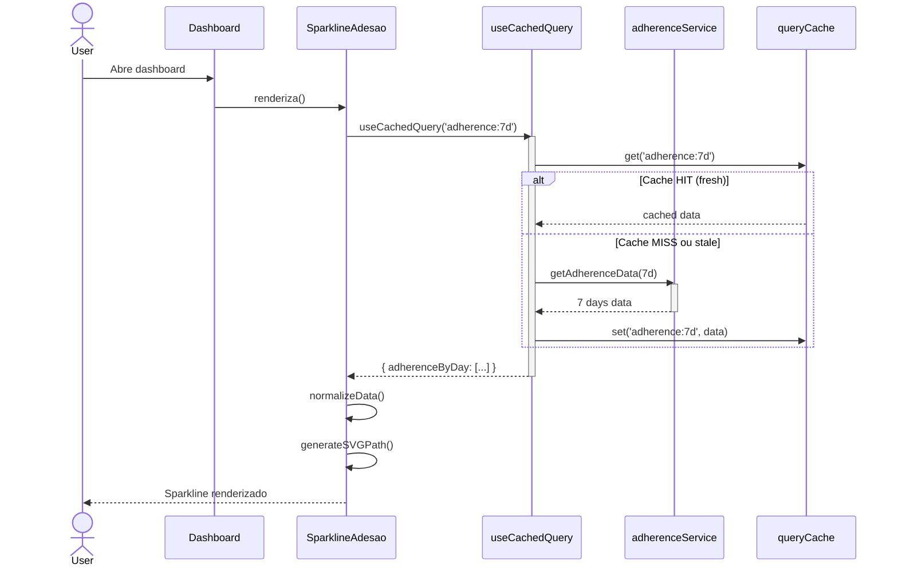
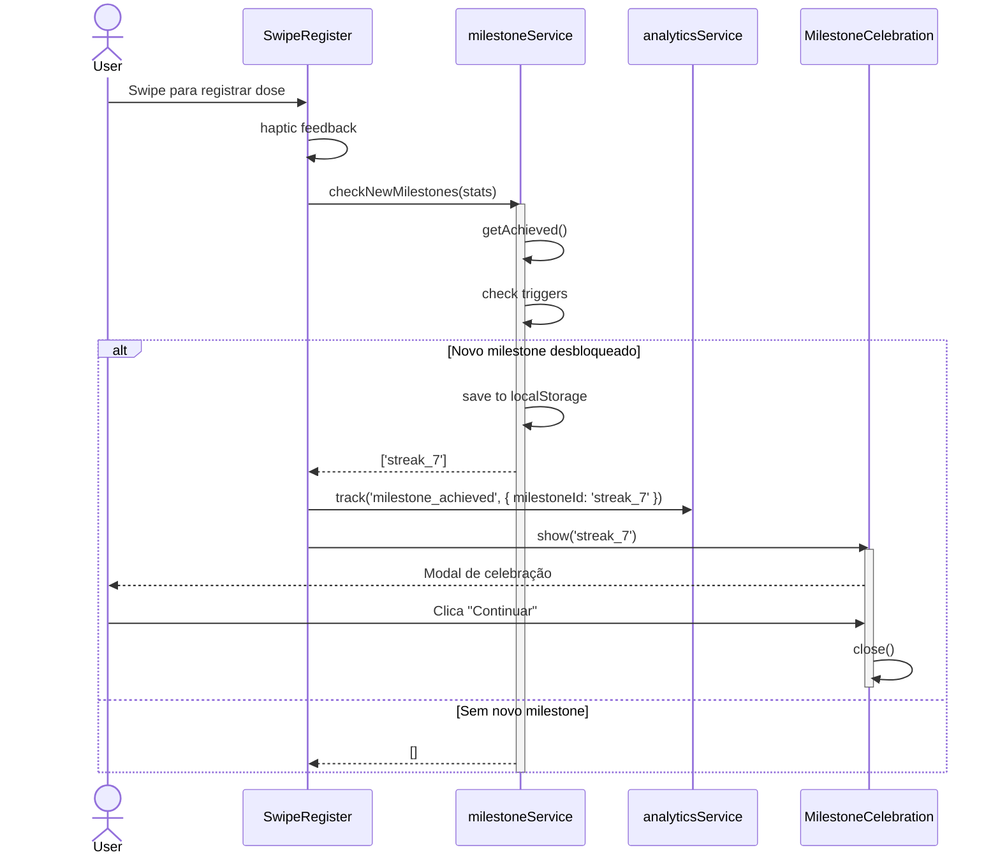

  --accent-warning: #f59e0b;
  --accent-danger: #ef4444;
  --border: #e5e7eb;
}

[data-theme="dark"] {
  --bg-primary: #0a0a0f;
  --bg-secondary: #1a1a2e;
  --bg-card: #16213e;
  --text-primary: #e8e8e8;
  --text-secondary: #9ca3af;
  --accent-primary: #818cf8;
  --accent-success: #34d399;
  --accent-warning: #fbbf24;
  --accent-danger: #f87171;
  --border: #374151;
}

/* Transição suave entre temas */
*,
*::before,
*::after {
  transition: background-color 200ms ease, color 200ms ease, border-color 200ms ease;
}
```

#### 3.5.3 Hook useTheme

```javascript
// src/hooks/useTheme.js
import { useState, useEffect, useCallback } from 'react';

const THEME_KEY = 'mr_theme_preference';
const SYSTEM_PREFERENCE = 'system';

export function useTheme() {
  const [theme, setTheme] = useState(() => {
    // 1. Verificar preferência salva pelo usuário
    const saved = localStorage.getItem(THEME_KEY);
    if (saved) return saved;
    
    // 2. Fallback para preferência do sistema
    return SYSTEM_PREFERENCE;
  });
  
  const [systemPreference, setSystemPreference] = useState('light');
  
  // Detectar preferência do sistema
  useEffect(() => {
    const mediaQuery = window.matchMedia('(prefers-color-scheme: dark)');
    setSystemPreference(mediaQuery.matches ? 'dark' : 'light');
    
    const handler = (e) => {
      setSystemPreference(e.matches ? 'dark' : 'light');
    };
    
    mediaQuery.addEventListener('change', handler);
    return () => mediaQuery.removeEventListener('change', handler);
  }, []);
  
  // Aplicar tema ao documento
  useEffect(() => {
    const actualTheme = theme === SYSTEM_PREFERENCE ? systemPreference : theme;
    document.documentElement.setAttribute('data-theme', actualTheme);
  }, [theme, systemPreference]);
  
  const toggleTheme = useCallback(() => {
    const newTheme = theme === 'dark' ? 'light' : 'dark';
    setTheme(newTheme);
    localStorage.setItem(THEME_KEY, newTheme);
  }, [theme]);
  
  const setLightTheme = useCallback(() => {
    setTheme('light');
    localStorage.setItem(THEME_KEY, 'light');
  }, []);
  
  const setDarkTheme = useCallback(() => {
    setTheme('dark');
    localStorage.setItem(THEME_KEY, 'dark');
  }, []);
  
  const resetToSystem = useCallback(() => {
    setTheme(SYSTEM_PREFERENCE);
    localStorage.removeItem(THEME_KEY);
  }, []);
  
  return {
    theme,                    // 'light', 'dark' ou 'system'
    actualTheme: theme === SYSTEM_PREFERENCE ? systemPreference : theme,
    isDark: (theme === SYSTEM_PREFERENCE ? systemPreference : theme) === 'dark',
    toggleTheme,
    setLightTheme,
    setDarkTheme,
    resetToSystem
  };
}
```

#### 3.5.4 Componente ThemeToggle

```jsx
// src/components/ui/ThemeToggle.jsx
import { useTheme } from '../../hooks/useTheme';
import './ThemeToggle.css';

export function ThemeToggle({ className }) {
  const { theme, actualTheme, toggleTheme, setLightTheme, setDarkTheme } = useTheme();
  
  return (
    <div className={`theme-toggle ${className || ''}`}>
      <button
        className={`theme-btn ${actualTheme === 'light' ? 'active' : ''}`}
        onClick={setLightTheme}
        aria-label="Modo claro"
        title="Modo claro"
      >
        <SunIcon />
      </button>
      
      <button
        className={`theme-btn ${theme === 'system' ? 'system' : ''}`}
        onClick={toggleTheme}
        aria-label={`Alternar tema (atual: ${actualTheme})`}
        title={`Tema: ${actualTheme === 'dark' ? 'Escuro' : 'Claro'}`}
      >
        <SystemIcon />
      </button>
      
      <button
        className={`theme-btn ${actualTheme === 'dark' ? 'active' : ''}`}
        onClick={setDarkTheme}
        aria-label="Modo escuro"
        title="Modo escuro"
      >
        <MoonIcon />
      </button>
    </div>
  );
}

function SunIcon() {
  return (
    <svg width="20" height="20" viewBox="0 0 24 24" fill="none" stroke="currentColor" strokeWidth="2">
      <circle cx="12" cy="12" r="5" />
      <path d="M12 1v2M12 21v2M4.22 4.22l1.42 1.42M18.36 18.36l1.42 1.42M1 12h2M21 12h2M4.22 19.78l1.42-1.42M18.36 5.64l1.42-1.42" />
    </svg>
  );
}

function MoonIcon() {
  return (
    <svg width="20" height="20" viewBox="0 0 24 24" fill="none" stroke="currentColor" strokeWidth="2">
      <path d="M21 12.79A9 9 0 1 1 11.21 3 7 7 0 0 0 21 12.79z" />
    </svg>
  );
}

function SystemIcon() {
  return (
    <svg width="20" height="20" viewBox="0 0 24 24" fill="none" stroke="currentColor" strokeWidth="2">
      <rect x="2" y="3" width="20" height="14" rx="2" ry="2" />
      <line x1="8" y1="21" x2="16" y2="21" />
      <line x1="12" y1="17" x2="12" y2="21" />
    </svg>
  );
}
```

#### 3.5.5 Critérios de Aceitação

- [ ] Tema segue preferência do sistema por padrão
- [ ] Usuário pode alternar manualmente via toggle
- [ ] Preferência manual persistida em localStorage
- [ ] Transição suave entre temas (sem flash)
- [ ] Contraste WCAG AA em ambos os temas (ratio >= 4.5:1)
- [ ] Todos os componentes existentes funcionam em ambos os temas
- [ ] HealthScoreCard SVG adapta cores ao tema

---

### 3.6 Feature F3.6: Analytics Local (Privacy-First)

#### 3.6.1 Especificação Técnica

| Aspecto | Detalhe |
|---------|---------|
| **Service** | analyticsService.js |
| **Storage** | localStorage (`mr_analytics`) |
| **Rotação** | Últimos 30 dias (cleanup automático) |
| **Limite** | 500KB máximo |
| **Privacy** | Zero dados externos |

#### 3.6.2 Estrutura de Arquivos

```
src/services/
├── analyticsService.js          # Service principal
└── analyticsConstants.js        # Constantes de eventos
src/hooks/
└── useAnalytics.js              # Hook wrapper
```

#### 3.6.3 Constantes de Eventos

```javascript
// src/services/analyticsConstants.js
export const ANALYTICS_EVENTS = {
  // Page views
  PAGE_VIEW: 'page_view',
  
  // Ações do usuário
  DOSE_REGISTERED: 'dose_registered',
  DOSE_SKIPPED: 'dose_skipped',
  MEDICINE_ADDED: 'medicine_added',
  MEDICINE_REMOVED: 'medicine_removed',
  PROTOCOL_CREATED: 'protocol_created',
  
  // Features
  SWIPE_USED: 'swipe_used',
  SPARKLINE_TAPPED: 'sparkline_tapped',
  MILESTONE_ACHIEVED: 'milestone_achieved',
  THEME_CHANGED: 'theme_changed',
  
  // Onboarding
  ONBOARDING_STARTED: 'onboarding_started',
  ONBOARDING_COMPLETED: 'onboarding_completed',
  
  // Erros
  ERROR_OCCURRED: 'error_occurred'
};

export const ANALYTICS_CONFIG = {
  MAX_DAYS: 30,           // Manter últimos 30 dias
  MAX_SIZE_BYTES: 500 * 1024,  // 500KB máximo
  BATCH_SIZE: 10          // Processar em batches
};
```

#### 3.6.4 Service de Analytics

```javascript
// src/services/analyticsService.js
import { ANALYTICS_EVENTS, ANALYTICS_CONFIG } from './analyticsConstants';

const STORAGE_KEY = 'mr_analytics';

export const analyticsService = {
  /**
   * Registra um evento de analytics
   * @param {string} event - Nome do evento
   * @param {Object} properties - Propriedades do evento
   */
  track(event, properties = {}) {
    if (!ANALYTICS_EVENTS[event] && !event.startsWith('custom_')) {
      console.warn(`Evento desconhecido: ${event}`);
      return;
    }
    
    const eventData = {
      event,
      properties,
      timestamp: new Date().toISOString(),
      userAgent: navigator.userAgent,
      page: window.location.pathname
    };
    
    const events = this.getEvents();
    events.push(eventData);
    
    // Limpar se exceder limite de tamanho
    this.enforceLimits(events);
    
    // Persistir
    this.saveEvents(events);
  },
  
  /**
   * Retorna todos os eventos
   * @param {Object} filter - Filtros opcionais
   */
  getEvents(filter = {}) {
    try {
      const data = localStorage.getItem(STORAGE_KEY);
      let events = data ? JSON.parse(data) : [];
      
      // Aplicar filtros
      if (filter.event) {
        events = events.filter(e => e.event === filter.event);
      }
      
      if (filter.startDate) {
        events = events.filter(e => new Date(e.timestamp) >= filter.startDate);
      }
      
      if (filter.endDate) {
        events = events.filter(e => new Date(e.timestamp) <= filter.endDate);
      }
      
      return events;
    } catch {
      return [];
    }
  },
  
  /**
   * Retorna resumo agregado de eventos
   */
  getSummary() {
    const events = this.getEvents();
    const summary = {
      totalEvents: events.length,
      uniqueEvents: new Set(events.map(e => e.event)).size,
      byEvent: {},
      byDay: {},
      firstEvent: null,
      lastEvent: null
    };
    
    events.forEach(e => {
      // Por tipo de evento
      summary.byEvent[e.event] = (summary.byEvent[e.event] || 0) + 1;
      
      // Por dia
      const day = e.timestamp.split('T')[0];
      summary.byDay[day] = (summary.byDay[day] || 0) + 1;
      
      // Timestamps
      if (!summary.firstEvent || e.timestamp < summary.firstEvent) {
        summary.firstEvent = e.timestamp;
      }
      if (!summary.lastEvent || e.timestamp > summary.lastEvent) {
        summary.lastEvent = e.timestamp;
      }
    });
    
    return summary;
  },
  
  /**
   * Limpa todos os eventos
   */
  clear() {
    localStorage.removeItem(STORAGE_KEY);
  },
  
  /**
   * Enforce limits (30 dias e 500KB)
   */
  enforceLimits(events) {
    const thirtyDaysAgo = new Date();
    thirtyDaysAgo.setDate(thirtyDaysAgo.getDate() - ANALYTICS_CONFIG.MAX_DAYS);
    
    // Filtrar por data
    events = events.filter(e => new Date(e.timestamp) >= thirtyDaysAgo);
    
    // Se ainda exceder tamanho, remover mais antigos
    while (JSON.stringify(events).length > ANALYTICS_CONFIG.MAX_SIZE_BYTES && events.length > 0) {
      events.shift();  // Remove o mais antigo
    }
    
    return events;
  },
  
  /**
   * Persistir eventos
   */
  saveEvents(events) {
    try {
      localStorage.setItem(STORAGE_KEY, JSON.stringify(events));
    } catch {
      console.warn('Analytics: Falha ao salvar eventos (storage cheio)');
    }
  },
  
  /**
   * Exportar dados para JSON
   */
  exportJSON() {
    const events = this.getEvents();
    return JSON.stringify(events, null, 2);
  }
};
```

#### 3.6.5 Hook useAnalytics

```javascript
// src/hooks/useAnalytics.js
import { useCallback } from 'react';
import { analyticsService } from '../services/analyticsService';
import { ANALYTICS_EVENTS } from '../services/analyticsConstants';

export function useAnalytics() {
  const track = useCallback((event, properties) => {
    analyticsService.track(event, properties);
  }, []);
  
  const trackPageView = useCallback((page) => {
    analyticsService.track(ANALYTICS_EVENTS.PAGE_VIEW, { page });
  }, []);
  
  const trackDoseRegistered = useCallback((medicineId, method) => {
    analyticsService.track(ANALYTICS_EVENTS.DOSE_REGISTERED, {
      medicineId,
      method,  // 'swipe', 'button', 'bot'
      timestamp: new Date().toISOString()
    });
  }, []);
  
  const trackMilestone = useCallback((milestoneId) => {
    analyticsService.track(ANALYTICS_EVENTS.MILESTONE_ACHIEVED, {
      milestoneId
    });
  }, []);
  
  const trackThemeChanged = useCallback((from, to) => {
    analyticsService.track(ANALYTICS_EVENTS.THEME_CHANGED, {
      from,
      to
    });
  }, []);
  
  return {
    track,
    trackPageView,
    trackDoseRegistered,
    trackMilestone,
    trackThemeChanged
  };
}
```

#### 3.6.6 Critérios de Aceitação

- [ ] Eventos registrados com timestamp, nome e propriedades
- [ ] Rotação automática de eventos > 30 dias
- [ ] Limite de 500KB respeitado com cleanup automático
- [ ] Método `getSummary()` retorna contagens agregadas por evento
- [ ] Nenhum dado enviado para serviços externos
- [ ] Performance: `track()` executa em < 5ms

---

## 4. Diagramas de Sequência - Fluxos Principais

### 4.1 Fluxo: Renderização do Sparkline



### 4.2 Fluxo: Celebração de Milestone



### 4.3 Fluxo: Alternância de Tema

```mermaid
sequenceDiagram
    actor User
    participant ThemeToggle
    participant useTheme
    participant document
    participant analyticsService
    
    User->>ThemeToggle: Clica toggle de tema
    
    ThemeToggle->>useTheme: toggleTheme()
    activate useTheme
    
    useTheme->>useTheme: Calcula novo tema
    useTheme->>useTheme: localStorage.setItem('mr_theme', 'dark')
    
    useTheme->>document: document.documentElement.setAttribute('data-theme', 'dark')
    
    useTheme->>analyticsService: track('theme_changed', { from
## 5. Estratégia de Implementação por Fases

### 5.1 Priorização de Features

| Fase | Features | Esforço | Justificativa |
|------|----------|---------|---------------|
| **Fase 1** | F3.6 + F3.5 | 6 pts | Foundation: Analytics e Tema afetam todas as outras features |
| **Fase 2** | F3.1 + F3.4 | 5 pts | Visualizações: Sparkline e Empty States |
| **Fase 3** | F3.2 + F3.3 | 8 pts | Interatividade: Micro-interações e Celebrações |

### 5.2 Cronograma Visual

```mermaid
gantt
    title Cronograma Fase 3 - Polish UX e Gamificação
    dateFormat YYYY-MM-DD
    section Fase 1: Foundation
    F3.6 Analytics Local           :f1_1, 2026-02-09, 2d
    F3.5 Tema Claro/Escuro         :f1_2, after f1_1, 2d
    
    section Fase 2: Visualizações
    F3.1 Sparkline Adesão          :f2_1, after f1_2, 2d
    F3.4 Empty States              :f2_2, after f2_1, 1d
    
    section Fase 3: Interatividade
    F3.2 Micro-interações          :f3_1, after f2_2, 3d
    F3.3 Celebrações Milestone      :f3_2, after f3_1, 2d
    
    section Validação
    Testes e Ajustes               :buf, after f3_2, 2d
```

### 5.3 Justificativa da Priorização

1. **Fase 1 (Foundation):** Analytics Local e Tema Claro/Escuro são infraestrutura que afeta todas as outras features. Analytics é base para métricas de adoção, Tema afeta visivelmente todos os componentes.

2. **Fase 2 (Visualizações):** Sparkline depende apenas de adherenceService existente, Empty States são componentes isolados de UI.

3. **Fase 3 (Interatividade):** Micro-interações e Celebrações são interdependentes (Celebrações usam animações da F3.2) e têm maior complexidade de Framer Motion.

---

## 6. Estimativas de Esforço

### 6.1 Resumo por Feature

| Feature | Esforço Total | Duração Estimada | Dependências |
|---------|---------------|------------------|--------------|
| F3.1 Sparkline | 3 pts | 1-2 dias | adherenceService |
| F3.2 Micro-interações | 5 pts | 2-3 dias | Framer Motion |
| F3.3 Celebrações | 3 pts | 1-2 dias | F3.2, adherenceService |
| F3.4 Empty States | 2 pts | 1 dia | Nenhuma |
| F3.5 Tema Escuro | 3 pts | 1-2 dias | Nenhuma |
| F3.6 Analytics Local | 3 pts | 1-2 dias | Nenhuma |
| **TOTAL** | **19 pts** | **9-10 dias úteis** | - |

---

## 7. Checklist de Conformidade com Padrões

### 7.1 Pre-Implementation Checklist

- [ ] Branch `feat/fase-3/polish-ux` criada seguindo padrão
- [ ] Todo list atualizada com subtarefas
- [ ] Arquivos relacionados analisados
- [ ] Dependências identificadas e disponíveis (Framer Motion 12 ✓)

### 7.2 Code Quality Checklist

- [ ] **Lint:** `npm run lint` sem erros
- [ ] **Sintaxe:** `node -c` em todos os arquivos JS/JSX
- [ ] **Testes Críticos:** `npm run test:critical` passando
- [ ] **Build:** `npm run build` sem erros
- [ ] **Nomenclatura:** PascalCase componentes, camelCase funções
- [ ] **Acessibilidade:** `prefers-reduced-motion` implementado em todas as animações
- [ ] **Performance:** Animações usam `will-change` e GPU acceleration

### 7.3 Padrões Específicos Frontend Agent

- [ ] Componentes com props desestruturadas
- [ ] CSS custom properties para cores do tema
- [ ] SVG inline com `role="img"` e `aria-label`
- [ ] Responsividade mobile-first (≥320px)
- [ ] Framer Motion com `AnimatePresence` para unmount

---

## 8. Métricas de Sucesso

### 8.1 Métricas Técnicas

| Métrica | Baseline Atual | Meta Fase 3 | Como Medir |
|---------|---------------|-------------|------------|
| Cobertura Testes | ~75% | >80% | `npm run test:coverage` |
| Lighthouse Performance | 95 | >95 | Lighthouse CI |
| Lighthouse Accessibility | ~90% | >95% | Lighthouse CI |
| Bundle Size | ~450KB | <465KB | `npm run build` |
| Performance Animation | N/A | 60fps (16ms) | Chrome DevTools |

### 8.2 Métricas Funcionais (Do PRD)

| KPI | Meta | Ferramenta |
|-----|------|------------|
| Streak médio | >3 dias | Query Supabase |
| Adoção sparkline | >30% sessões | Analytics local |
| Adoção tema escuro | >20% usuários | localStorage |
| Milestones conquistados | >1 por usuário ativo | localStorage |
| Tempo para primeira ação | <3s | Analytics local |

---

## 9. Riscos e Mitigações

| Risco | Prob. | Impacto | Mitigação |
|-------|-------|---------|-----------|
| Animações causam jank em dispositivos low-end | Média | Alto | GPU acceleration, testar em dispositivos reais, `prefers-reduced-motion` |
| localStorage cheio impede analytics | Baixa | Baixo | Limite 500KB com cleanup automático, fallback silencioso |
| Tema quebra componentes existentes | Média | Médio | Migração incremental, testes visuais, fallback para tema claro |
| Framer Motion aumenta bundle | Baixa | Médio | Tree-shaking já ativo, lazy loading |
| Baixa adoção de animações | Média | Baixo | Analytics local para tracking |

---

## 10. Pipeline de Integração Contínua

### 10.1 Git Workflow

```bash
# 1. Criar branch
git checkout main
git pull origin main
git checkout -b feat/fase-3/polish-ux/nome-da-feature

# 2. Desenvolver com commits semânticos
git commit -m "feat(dashboard): add sparkline de adesão"

# 3. Validar local
npm run lint
npm run test:critical
npm run build

# 4. Push e PR
git push origin feat/fase-3/polish-ux/nome-da-feature

# 5. Merge (após review)
git checkout main
git pull origin main
git merge feat/fase-3/polish-ux/nome-da-feature --no-ff
git push origin main
```

---

## 11. Documentação a Produzir

| Documento | Responsável | Quando | Local |
|-----------|-------------|--------|-------|
| Guia de Animações | Documentação Agent | Após F3.2 | `docs/ANIMACOES.md` |
| Guia Tema Claro/Escuro | Documentação Agent | Após F3.5 | `docs/TEMA_ESCURO.md` |
| Guia Analytics Local | Documentação Agent | Após F3.6 | `docs/ANALYTICS_LOCAL.md` |
| CHANGELOG v2.6.0 | Documentação Agent | Release | `CHANGELOG.md` |

---

## 12. Matriz de Rastreabilidade

### 12.1 Rastreabilidade Roadmap → PRD → Plano Técnico

| Roadmap ID | Feature PRD | Feature Plano | Agente | SP |
|------------|-------------|---------------|--------|-----|
| **P03** | F3.1 Sparkline | Sparkline Adesão Semanal | Frontend | 3 |
| **P04** | F3.2 Micro-interações | Feedback Tátil e Visual | Frontend | 5 |
| **P07** | F3.3 Celebrações | Milestone Gamification | Frontend | 3 |
| **P17** | F3.4 Empty States | Ilustrativos Motivacionais | Frontend | 2 |
| **N06** | F3.5 Tema Escuro | Dark/Light Mode | Frontend | 3 |
| **N04** | F3.6 Analytics | Privacy-First Tracking | Frontend | 3 |

### 12.2 Dependencies Matrix

| Feature | Pré-requisitos | Bloqueia |
|---------|---------------|----------|
| F3.1 Sparkline | adherenceService | Nenhuma |
| F3.2 Micro-interações | Framer Motion 12 | F3.3 |
| F3.3 Celebrações | F3.2, adherenceService | Nenhuma |
| F3.4 Empty States | Nenhuma | Nenhuma |
| F3.5 Tema Escuro | Nenhuma | Todos |
| F3.6 Analytics Local | Nenhuma | Métricas |

---

## Aprovação e Autorização

Este plano técnico revisado está em estado **PLANEJAMENTO** e requer aprovação do Arquiteto-Orchestrador antes da ativação dos agentes.

| Papel | Aprovação | Data |
|-------|-----------|------|
| Arquiteto-Orchestrador | ⏳ Pendente | - |
| Frontend Agent | ⏳ Pendente | - |
| Qualidade Agent | ⏳ Pendente | - |
| Documentação Agent | ⏳ Pendente | - |

---

## Referências

- [`docs/ARQUITETURA_FRAMEWORK.md`](docs/ARQUITETURA_FRAMEWORK.md:1) - Framework arquitetural multiagente
- [`docs/PADROES_CODIGO.md`](docs/PADROES_CODIGO.md:1) - Padrões de código
- [`plans/roadmap_2026_meus_remedios.md`](plans/roadmap_2026_meus_remedios.md:1) - Roadmap estratégico 2026
- [`plans/PRD_FASE_3_ROADMAP_2026.md`](plans/PRD_FASE_3_ROADMAP_2026.md:1) - PRD específico da Fase 3

---

*Documento elaborado em conformidade com [`docs/ARQUITETURA_FRAMEWORK.md`](docs/ARQUITETURA_FRAMEWORK.md:1) e [`docs/PADROES_CODIGO.md`](docs/PADROES_CODIGO.md:1)*
*Baseline: v2.5.0 (Health Command Center)*
*Próxima revisão: Após conclusão da Fase 3*
