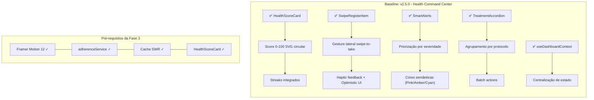
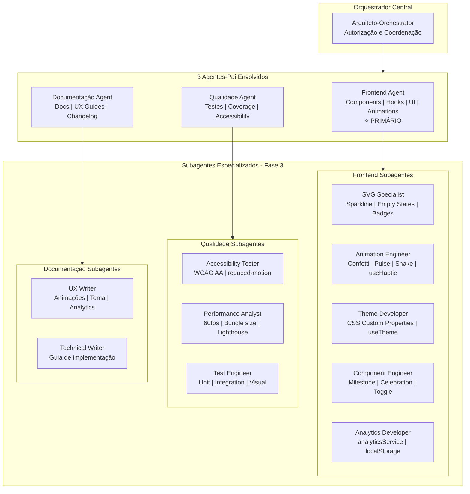
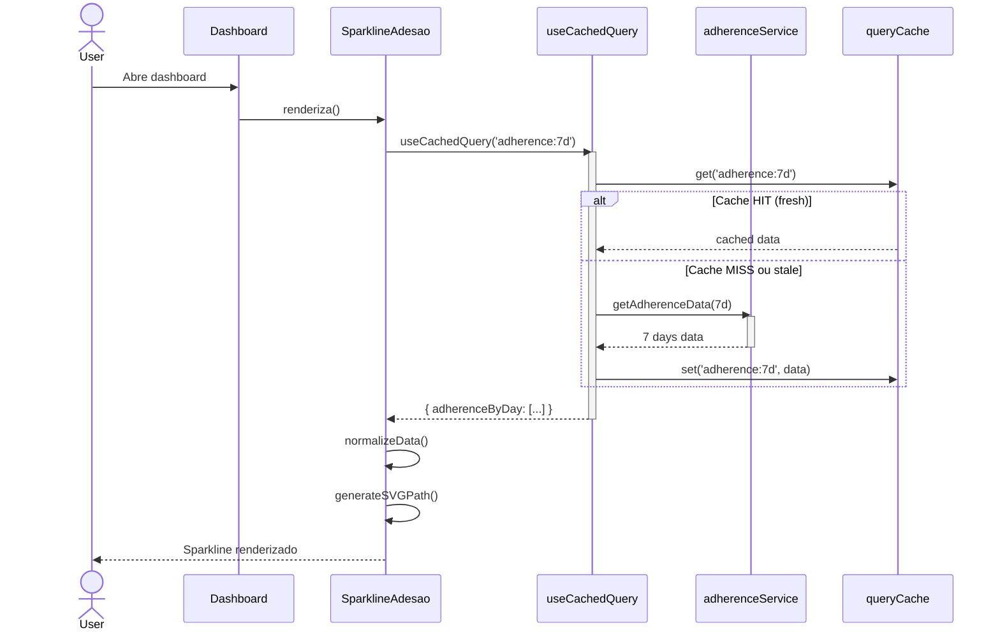
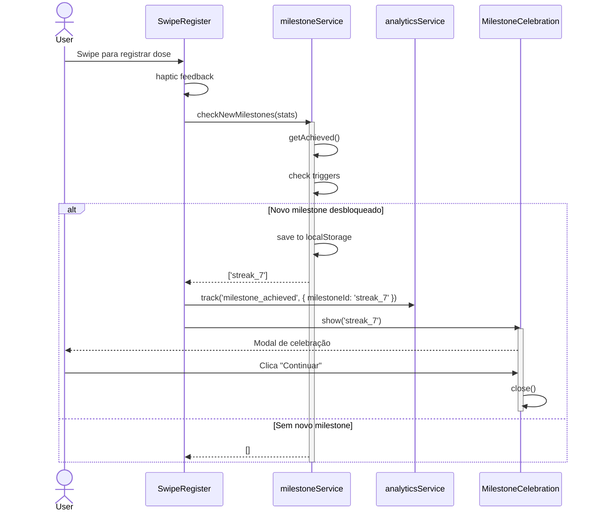
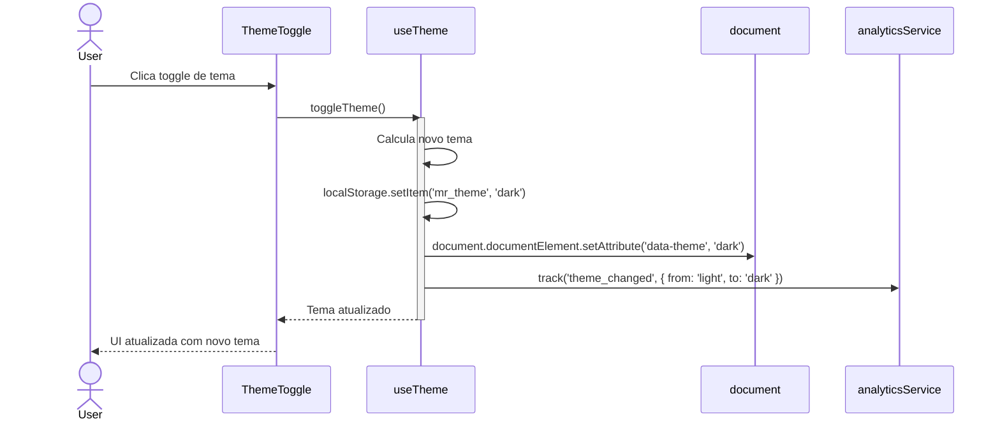
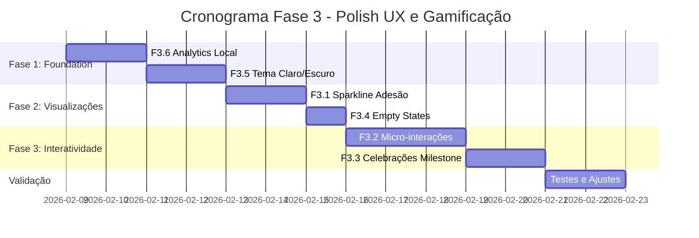

# 📋 Plano Técnico Executável - Fase 3 (Polish UX e Gamificação Avançada)

**Status:** PLANEJAMENTO  
**Data de Elaboração:** 08/02/2026  
**Data de Revisão:** 08/02/2026  
**Versão do Framework:** 2.0  
**Baseline:** v2.5.0 (Health Command Center entregue)  
**Autoridade Arquitetural:** [`docs/ARQUITETURA_FRAMEWORK.md`](../docs/ARQUITETURA_FRAMEWORK.md)  

> **⚠️ NOTA DE REVISÃO:** Este documento substitui completamente o plano anterior "Onda 3 - Expansão" para alinhar com a Fase 3 do Roadmap 2026. O escopo foi alterado de "Expansão (PDF, Cuidador, PWA)" para "Polish UX e Gamificação Avançada (Sparkline, Micro-interações, Celebrações, Tema Escuro, Analytics Local)".

---

## 1. Sumário Executivo

### 1.1 Contexto e Escopo da Fase 3

A **Fase 3 - Polish UX e Gamificação Avançada** representa a evolução do **Health Command Center (v2.5.0)** com foco em elevar o engajamento e retenção através de micro-interações, visualizações de tendência e reforço emocional positivo. Esta fase transforma a experiência mobile do Meus Remédios com interações nativas, gamificação e feedback visual que diferenciam o produto no mercado.

| Aspecto | Especificação |
|---------|---------------|
| **Features Planejadas** | 6 (F3.1 a F3.6) |
| **Duração Estimada** | 9-10 dias úteis (19 story points) |
| **Custo Operacional** | R$ 0 (mantém princípio de free tier) |
| **Agentes Envolvidos** | Frontend Agent (primário), Qualidade Agent, Documentação Agent |
| **Novas Dependências** | Nenhuma (Framer Motion 12 já instalado) |

### 1.2 Features da Fase 3

| ID | Feature | Prioridade | Story Points | Descrição |
|----|---------|------------|-------------|-----------|
| **F3.1** | Sparkline de Adesão Semanal | P0 | 3 | Gráfico SVG inline mostrando tendência de adesão dos últimos 7 dias |
| **F3.2** | Micro-interações e Feedback Tátil | P1 | 5 | Animações de confete, pulse, shake e Vibration API |
| **F3.3** | Celebrações de Milestone | P1 | 3 | Modais de celebração com badges para streaks e metas |
| **F3.4** | Empty States Ilustrados | P2 | 2 | Ilustrações SVG com CTAs motivacionais |
| **F3.5** | Tema Claro/Escuro | P1 | 3 | CSS custom properties com detecção de preferência do sistema |
| **F3.6** | Analytics Local (Privacy-First) | P1 | 3 | Tracking em localStorage sem dados externos |

### 1.3 Estado Atual do Projeto (Baseline v2.5.0)



### 1.4 Objetivos Estratégicos Atendidos pela Fase 3

| OE | Descrição | Features Relacionadas |
|----|-----------|---------------------|
| **OE3.1** | Engajamento diário com feedback visual imediato | F3.2, F3.3 |
| **OE3.2** | Retenção via gamificação (streaks, celebrações) | F3.3, F3.1 |
| **OE3.3** | Acessibilidade e conforto visual (WCAG AA >95%) | F3.5, F3.4 |
| **OE3.4** | Visualização rápida de tendência de adesão | F3.1, F3.6 |

---

## 2. Hierarquia de Agentes - Configuração Fase 3

### 2.1 Estrutura Hierárquica



### 2.2 Matriz de Responsabilidades por Feature

| Feature | Agente-Pai Primário | Subagentes | Estado Inicial |
|---------|---------------------|------------|----------------|
| **F3.1** Sparkline | Frontend Agent | FA1, FA5, QA2 | DORMANT |
| **F3.2** Micro-interações | Frontend Agent | FA2, QA1, QA2 | DORMANT |
| **F3.3** Celebrações | Frontend Agent | FA4, FA2, FA5, QA2 | DORMANT |
| **F3.4** Empty States | Frontend Agent | FA1, QA1, QA3 | DORMANT |
| **F3.5** Tema Escuro | Frontend Agent | FA3, QA1, QA2 | DORMANT |
| **F3.6** Analytics Local | Frontend Agent | FA5, QA3 | DORMANT |

### 2.3 Gatilhos de Ativação por Agente

| Agente | Condição de Ativação | Dependências |
|--------|---------------------|--------------|
| **Frontend Agent** | Aprovação do plano pelo Arquiteto | Nenhuma (features são UI-only) |
| **Qualidade Agent** | F3.1 ou F3.5 implementados | Frontend Agent |
| **Documentação Agent** | Feature atinge critérios de aceitação | Frontend + Qualidade |

---

## 3. Análise Técnica das Features da Fase 3

### 3.1 Feature F3.1: Sparkline de Adesão Semanal

#### 3.1.1 Especificação Técnica

| Aspecto | Detalhe |
|---------|---------|
| **Componente Principal** | `src/components/dashboard/SparklineAdesao.jsx` |
| **Tecnologia** | SVG inline (sem biblioteca externa) |
| **Dados** | adherenceService via cache SWR existente |
| **Responsividade** | 100% largura do container, altura fixa 40px |
| **Performance Target** | Renderização <16ms (60fps) |

#### 3.1.2 Critérios de Aceitação

- [ ] Renderiza corretamente em viewports >= 320px
- [ ] Dados dos últimos 7 dias exibidos com precisão
- [ ] Não dispara chamadas adicionais ao Supabase (usa cache existente)
- [ ] Respeita `prefers-reduced-motion` (sem animação de entrada se ativado)
- [ ] Performance: renderização < 16ms (60fps)
- [ ] Cores semânticas: verde >= 80%, âmbar 50-79%, vermelho < 50%

---

### 3.2 Feature F3.2: Micro-interações e Feedback Tátil

#### 3.2.1 Especificação Técnica

| Aspecto | Detalhe |
|---------|---------|
| **Componentes** | ConfettiAnimation, PulseEffect, ShakeEffect |
| **Hook** | useHapticFeedback.js |
| **Tecnologia** | CSS Keyframes + Framer Motion |
| **Performance** | GPU acceleration (transform/opacity only) |

#### 3.2.2 Critérios de Aceitação

- [ ] Confete dispara ao atingir 100% de adesão no dia
- [ ] Pulse anima o HealthScoreCard ao registrar dose via swipe
- [ ] Shake anima campos com erro de validação Zod
- [ ] Vibration API funciona em Android Chrome (fallback silencioso em iOS/desktop)
- [ ] Todas as animações rodam a 60fps (sem jank)
- [ ] `prefers-reduced-motion: reduce` desabilita animações visuais
- [ ] Nenhuma animação bloqueia interação do usuário

---

### 3.3 Feature F3.3: Celebrações de Milestone

#### 3.3.1 Especificação Técnica

| Aspecto | Detalhe |
|---------|---------|
| **Componentes** | MilestoneCelebration.jsx, BadgeDisplay.jsx |
| **Service** | milestoneService.js |
| **Persistência** | localStorage (evitar repetição) |
| **Modal** | Framer Motion AnimatePresence |

#### 3.3.2 Critérios de Aceitação

- [ ] Milestone detectado corretamente após registro de dose
- [ ] Modal de celebração exibido com animação suave (300ms entrada, 200ms saída)
- [ ] Cada milestone exibido apenas uma vez (persistido em localStorage)
- [ ] Badge exibido no perfil/dashboard após conquista
- [ ] Botão "Fechar" ou tap fora do modal para dispensar
- [ ] Respeita `prefers-reduced-motion`

---

### 3.4 Feature F3.4: Empty States Ilustrados

#### 3.4.1 Especificação Técnica

| Aspecto | Detalhe |
|---------|---------|
| **Componente Principal** | EmptyState.jsx (reutilizável) |
| **Ilustrações** | 4 SVGs inline (<20KB total) |
| **Props** | illustration, title, description, ctaLabel, ctaAction |
| **Estilo** | Design system existente |

#### 3.4.2 Critérios de Aceitação

- [ ] 4 empty states implementados (dashboard, histórico, estoque, protocolos)
- [ ] Cada empty state tem ilustração SVG, título, descrição e CTA
- [ ] CTA navega para ação relevante (ex: "Cadastrar medicamento")
- [ ] SVGs responsivos e acessíveis (role="img", aria-label)
- [ ] Tamanho total dos SVGs < 20KB

---

### 3.5 Feature F3.5: Tema Claro/Escuro

#### 3.5.1 Especificação Técnica

| Aspecto | Detalhe |
|---------|---------|
| **Implementação** | CSS custom properties |
| **Hook** | useTheme.js |
| **Componente** | ThemeToggle.jsx |
| **Persistência** | localStorage |
| **Transição** | 200ms suave |

#### 3.5.2 Critérios de Aceitação

- [ ] Tema segue preferência do sistema por padrão
- [ ] Usuário pode alternar manualmente via toggle
- [ ] Preferência manual persistida em localStorage
- [ ] Transição suave entre temas (sem flash)
- [ ] Contraste WCAG AA em ambos os temas (ratio >= 4.5:1)
- [ ] Todos os componentes existentes funcionam em ambos os temas
- [ ] HealthScoreCard SVG adapta cores ao tema

---

### 3.6 Feature F3.6: Analytics Local (Privacy-First)

#### 3.6.1 Especificação Técnica

| Aspecto | Detalhe |
|---------|---------|
| **Service** | analyticsService.js |
| **Storage** | localStorage (`mr_analytics`) |
| **Rotação** | Últimos 30 dias (cleanup automático) |
| **Limite** | 500KB máximo |
| **Privacy** | Zero dados externos |

#### 3.6.2 Critérios de Aceitação

- [ ] Eventos registrados com timestamp, nome e propriedades
- [ ] Rotação automática de eventos > 30 dias
- [ ] Limite de 500KB respeitado com cleanup automático
- [ ] Método `getSummary()` retorna contagens agregadas por evento
- [ ] Nenhum dado enviado para serviços externos
- [ ] Performance: `track()` executa em < 5ms

---

## 4. Diagramas de Sequência - Fluxos Principais

### 4.1 Fluxo: Renderização do Sparkline



### 4.2 Fluxo: Celebração de Milestone



### 4.3 Fluxo: Alternância de Tema



---

## 5. Estratégia de Implementação por Fases

### 5.1 Priorização de Features

| Fase | Features | Esforço | Justificativa |
|------|----------|---------|---------------|
| **Fase 1** | F3.6 + F3.5 | 6 pts | Foundation: Analytics e Tema afetam todas as outras features |
| **Fase 2** | F3.1 + F3.4 | 5 pts | Visualizações: Sparkline e Empty States |
| **Fase 3** | F3.2 + F3.3 | 8 pts | Interatividade: Micro-interações e Celebrações |

### 5.2 Cronograma Visual



### 5.3 Justificativa da Priorização

1. **Fase 1 (Foundation):** Analytics Local e Tema Claro/Escuro são infraestrutura que afeta todas as outras features. Analytics é base para métricas de adoção, Tema afeta visivelmente todos os componentes.

2. **Fase 2 (Visualizações):** Sparkline depende apenas de adherenceService existente, Empty States são componentes isolados de UI.

3. **Fase 3 (Interatividade):** Micro-interações e Celebrações são interdependentes (Celebrações usam animações da F3.2) e têm maior complexidade de Framer Motion.

---

## 6. Estimativas de Esforço

### 6.1 Resumo por Feature

| Feature | Esforço Total | Duração Estimada | Dependências |
|---------|---------------|------------------|--------------|
| F3.1 Sparkline | 3 pts | 1-2 dias | adherenceService |
| F3.2 Micro-interações | 5 pts | 2-3 dias | Framer Motion |
| F3.3 Celebrações | 3 pts | 1-2 dias | F3.2, adherenceService |
| F3.4 Empty States | 2 pts | 1 dia | Nenhuma |
| F3.5 Tema Escuro | 3 pts | 1-2 dias | Nenhuma |
| F3.6 Analytics Local | 3 pts | 1-2 dias | Nenhuma |
| **TOTAL** | **19 pts** | **9-10 dias úteis** | - |

---

## 7. Checklist de Conformidade com Padrões

### 7.1 Pre-Implementation Checklist

- [ ] Branch `feat/fase-3/polish-ux` criada seguindo padrão
- [ ] Todo list atualizada com subtarefas
- [ ] Arquivos relacionados analisados
- [ ] Dependências identificadas e disponíveis (Framer Motion 12 ✓)

### 7.2 Code Quality Checklist

- [ ] **Lint:** `npm run lint` sem erros
- [ ] **Sintaxe:** `node -c` em todos os arquivos JS/JSX
- [ ] **Testes Críticos:** `npm run test:critical` passando
- [ ] **Build:** `npm run build` sem erros
- [ ] **Nomenclatura:** PascalCase componentes, camelCase funções
- [ ] **Acessibilidade:** `prefers-reduced-motion` implementado em todas as animações
- [ ] **Performance:** Animações usam `will-change` e GPU acceleration

### 7.3 Padrões Específicos Frontend Agent

- [ ] Componentes com props desestruturadas
- [ ] CSS custom properties para cores do tema
- [ ] SVG inline com `role="img"` e `aria-label`
- [ ] Responsividade mobile-first (≥320px)
- [ ] Framer Motion com `AnimatePresence` para unmount

---

## 8. Métricas de Sucesso

### 8.1 Métricas Técnicas

| Métrica | Baseline Atual | Meta Fase 3 | Como Medir |
|---------|---------------|-------------|------------|
| Cobertura Testes | ~75% | >80% | `npm run test:coverage` |
| Lighthouse Performance | 95 | >95 | Lighthouse CI |
| Lighthouse Accessibility | ~90% | >95% | Lighthouse CI |
| Bundle Size | ~450KB | <465KB | `npm run build` |
| Performance Animation | N/A | 60fps (16ms) | Chrome DevTools |

### 8.2 Métricas Funcionais (Do PRD)

| KPI | Meta | Ferramenta |
|-----|------|------------|
| Streak médio | >3 dias | Query Supabase |
| Adoção sparkline | >30% sessões | Analytics local |
| Adoção tema escuro | >20% usuários | localStorage |
| Milestones conquistados | >1 por usuário ativo | localStorage |
| Tempo para primeira ação | <3s | Analytics local |

---

## 9. Riscos e Mitigações

| Risco | Prob. | Impacto | Mitigação |
|-------|-------|---------|-----------|
| Animações causam jank em dispositivos low-end | Média | Alto | GPU acceleration, testar em dispositivos reais, `prefers-reduced-motion` |
| localStorage cheio impede analytics | Baixa | Baixo | Limite 500KB com cleanup automático, fallback silencioso |
| Tema quebra componentes existentes | Média | Médio | Migração incremental, testes visuais, fallback para tema claro |
| Framer Motion aumenta bundle | Baixa | Médio | Tree-shaking já ativo, lazy loading |
| Baixa adoção de animações | Média | Baixo | Analytics local para tracking |

---

## 10. Pipeline de Integração Contínua

### 10.1 Git Workflow

```bash
# 1. Criar branch
git checkout main
git pull origin main
git checkout -b feat/fase-3/polish-ux/nome-da-feature

# 2. Desenvolver com commits semânticos
git commit -m "feat(dashboard): add sparkline de adesão"

# 3. Validar local
npm run lint
npm run test:critical
npm run build

# 4. Push e PR
git push origin feat/fase-3/polish-ux/nome-da-feature

# 5. Merge (após review)
git checkout main
git pull origin main
git merge feat/fase-3/polish-ux/nome-da-feature --no-ff
git push origin main
```

---

## 11. Documentação a Produzir

| Documento | Responsável | Quando | Local |
|-----------|-------------|--------|-------|
| Guia de Animações | Documentação Agent | Após F3.2 | `docs/ANIMACOES.md` |
| Guia Tema Claro/Escuro | Documentação Agent | Após F3.5 | `docs/TEMA_ESCURO.md` |
| Guia Analytics Local | Documentação Agent | Após F3.6 | `docs/ANALYTICS_LOCAL.md` |
| CHANGELOG v2.6.0 | Documentação Agent | Release | `CHANGELOG.md` |

---

## 12. Matriz de Rastreabilidade

### 12.1 Rastreabilidade Roadmap → PRD → Plano Técnico

| Roadmap ID | Feature PRD | Feature Plano | Agente | SP |
|------------|-------------|---------------|--------|-----|
| **P03** | F3.1 Sparkline | Sparkline Adesão Semanal | Frontend | 3 |
| **P04** | F3.2 Micro-interações | Feedback Tátil e Visual | Frontend | 5 |
| **P07** | F3.3 Celebrações | Milestone Gamification | Frontend | 3 |
| **P17** | F3.4 Empty States | Ilustrativos Motivacionais | Frontend | 2 |
| **N06** | F3.5 Tema Escuro | Dark/Light Mode | Frontend | 3 |
| **N04** | F3.6 Analytics | Privacy-First Tracking | Frontend | 3 |

### 12.2 Dependencies Matrix

| Feature | Pré-requisitos | Bloqueia |
|---------|---------------|----------|
| F3.1 Sparkline | adherenceService | Nenhuma |
| F3.2 Micro-interações | Framer Motion 12 | F3.3 |
| F3.3 Celebrações | F3.2, adherenceService | Nenhuma |
| F3.4 Empty States | Nenhuma | Nenhuma |
| F3.5 Tema Escuro | Nenhuma | Todos |
| F3.6 Analytics Local | Nenhuma | Métricas |

---

## Aprovação e Autorização

Este plano técnico revisado está em estado **PLANEJAMENTO** e requer aprovação do Arquiteto-Orchestrador antes da ativação dos agentes.

| Papel | Aprovação | Data |
|-------|-----------|------|
| Arquiteto-Orchestrator | ⏳ Pendente | - |
| Frontend Agent | ⏳ Pendente | - |
| Qualidade Agent | ⏳ Pendente | - |
| Documentação Agent | ⏳ Pendente | - |

---

## Referências

- [`docs/ARQUITETURA_FRAMEWORK.md`](../docs/ARQUITETURA_FRAMEWORK.md) - Framework arquitetural multiagente
- [`docs/PADROES_CODIGO.md`](../docs/PADROES_CODIGO.md) - Padrões de código
- [`plans/roadmap_2026_meus_remedios.md`](roadmap_2026_meus_remedios.md) - Roadmap estratégico 2026
- [`plans/PRD_FASE_3_ROADMAP_2026.md`](PRD_FASE_3_ROADMAP_2026.md) - PRD específico da Fase 3

---

*Documento elaborado em conformidade com [`docs/ARQUITETURA_FRAMEWORK.md`](../docs/ARQUITETURA_FRAMEWORK.md) e [`docs/PADROES_CODIGO.md`](../docs/PADROES_CODIGO.md)*  
*Baseline: v2.5.0 (Health Command Center)*  
*Próxima revisão: Após conclusão da Fase 3*
