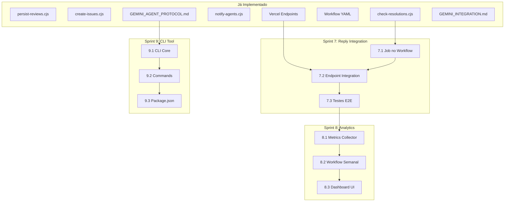

# Plano de Próximas Fases: Gemini Code Assist Integration

> **Documento de planejamento para continuação da integração Gemini Code Assist**
> **Versão:** 2.0.0 | **Data:** 2026-02-24
> **Status:** 📋 Plano Revisado Após Auditoria
> **Autor:** Architect Mode

---

## 📋 Sumário Executivo

### Auditoria Realizada

Este plano foi revisado após auditoria completa dos scripts e workflows existentes em:
- [`.github/scripts/`](.github/scripts/) - 11 scripts implementados
- [`.github/workflows/gemini-review.yml`](.github/workflows/gemini-review.yml) - Workflow completo
- [`api/gemini-reviews/`](api/gemini-reviews/) - 4 endpoints Vercel

### Estado Atual Real

| Componente | Status | Observação |
|------------|--------|------------|
| **Workflow Intelligence** | ✅ IMPLEMENTADO | Hash SHA-256 + estados expandidos |
| **persist-reviews.cjs** | ✅ IMPLEMENTADO | Deduplicação por hash |
| **create-issues.cjs** | ✅ IMPLEMENTADO | Cria issues com deduplicação |
| **check-resolutions.cjs** | ✅ IMPLEMENTADO | Detecta "Fixes #X" + atualiza Supabase |
| **notify-agents.cjs** | ✅ IMPLEMENTADO | Webhooks para agents externos |
| **Workflow YAML** | ✅ IMPLEMENTADO | 8 jobs funcionais |
| **Vercel Endpoints** | ✅ IMPLEMENTADO | 4 endpoints com JWT auth |
| **Reply to Comments** | ⚠️ PARCIAL | Script existe, mas job não integrado |
| **Analytics Dashboard** | ❌ NÃO IMPLEMENTADO | Métricas semanais |
| **Agent Protocol Doc** | ❌ NÃO IMPLEMENTADO | GEMINI_AGENT_PROTOCOL.md |
| **CLI Tool** | ❌ NÃO IMPLEMENTADO | gemini-agent CLI |
| **UI Human Review** | ❌ NÃO IMPLEMENTADO | Dashboard para revisores |

### O Que Realmente Precisa Ser Feito

| Sprint | Nome | Status Anterior | Status Real |
|--------|------|-----------------|-------------|
| ~~Sprint 7~~ | ~~Workflow Intelligence~~ | ❌ Proposto | ✅ JÁ EXISTE |
| ~~Sprint 9~~ | ~~Agent Protocol Doc~~ | ❌ Proposto | ✅ JÁ EXISTE |
| **Sprint 7** | Reply to Comments Integration | ❌ Proposto | ⚠️ PARCIAL |
| **Sprint 8** | Analytics Dashboard | ❌ Proposto | ❌ PENDENTE |
| **Sprint 9** | CLI Tool | ❌ Proposto | ❌ PENDENTE |

### Documentação Já Existente

| Documento | Localização | Linhas | Status |
|-----------|-------------|--------|--------|
| Agent Protocol | [`docs/standards/GEMINI_AGENT_PROTOCOL.md`](docs/standards/GEMINI_AGENT_PROTOCOL.md) | 679 | ✅ Completo |
| Integration Guide | [`docs/standards/GEMINI_INTEGRATION.md`](docs/standards/GEMINI_INTEGRATION.md) | 536 | ✅ Completo |

---

## 🎯 Sprint 7: Reply to Comments Integration

### Situação Atual

O script [`check-resolutions.cjs`](.github/scripts/check-resolutions.cjs) JÁ EXISTE com:
- Detecção de "Fixes #X" em commits
- Estados expandidos (detected, reported, assigned, resolved, partial, wontfix, duplicate)
- Função `updateReviewStatus()` para atualizar Supabase
- Função `checkResolutionCompleteness()` para verificar resolução

**O que FALTA:**
- Job `check-resolutions` no workflow YAML
- Integração com endpoint Vercel para atualização em lote
- Testes de integração end-to-end

### Entregáveis

| # | Entregável | Descrição | Arquivo |
|---|------------|-----------|---------|
| 7.1 | Job no Workflow | Adicionar job `check-resolutions` | `.github/workflows/gemini-review.yml` |
| 7.2 | Endpoint Integration | Chamar `/api/gemini-reviews/update-status` | Job no workflow |
| 7.3 | Testes E2E | Validar fluxo completo | `.github/scripts/__tests__/check-resolutions.test.js` |

### Implementação do Job

```yaml
# Adicionar ao workflow existente
check-resolutions:
  name: Check Resolutions
  runs-on: ubuntu-latest
  needs: [detect, persist]
  if: always() && needs.persist.result == 'success'
  
  steps:
    - name: Checkout
      uses: actions/checkout@v4
    
    - name: Check Resolutions via Vercel API
      uses: actions/github-script@v7
      env:
        VERCEL_GITHUB_ACTIONS_SECRET: ${{ secrets.VERCEL_GITHUB_ACTIONS_SECRET }}
      with:
        script: |
          const { SignJWT } = require('jose');
          const prNumber = parseInt("${{ needs.detect.outputs.pr_number }}");
          
          // Gerar JWT
          const secret = new TextEncoder().encode(process.env.VERCEL_GITHUB_ACTIONS_SECRET);
          const jwt = await new SignJWT({ iss: 'github-actions', aud: 'vercel-api' })
            .setProtectedHeader({ alg: 'HS256' })
            .setIssuedAt()
            .setExpirationTime('5m')
            .sign(secret);
          
          // Chamar endpoint
          const response = await fetch('https://meus-remedios.vercel.app/api/gemini-reviews/update-status', {
            method: 'POST',
            headers: { 'Authorization': `Bearer ${jwt}` },
            body: JSON.stringify({ pr_number: prNumber })
          });
          
          const result = await response.json();
          console.log(`✅ Resolutions checked: ${result.data?.updated || 0} updated`);
```

### Dependências

```
persist ──▶ check-resolutions
                │
                ▼
         update-status endpoint (JÁ EXISTE)
```

### Critérios de Sucesso

- [ ] Job `check-resolutions` executando após `persist`
- [ ] Endpoint `/api/gemini-reviews/update-status` sendo chamado
- [ ] Status no Supabase atualizado corretamente
- [ ] Testes passando

### Riscos

| Risco | Probabilidade | Impacto | Mitigação |
|-------|---------------|---------|-----------|
| Job falhar silenciosamente | Média | LOW | Logs detalhados + alertas |

---

## 📊 Sprint 8: Analytics Dashboard

### Situação Atual

**NÃO IMPLEMENTADO** - Não existe:
- Script de coleta de métricas
- Workflow semanal de relatórios
- Dashboard UI

### Entregáveis

| # | Entregável | Descrição | Arquivo |
|---|------------|-----------|---------|
| 8.1 | Metrics Collector | Coleta de métricas do Supabase | `.github/scripts/metrics-collector.cjs` |
| 8.2 | Workflow Semanal | Geração de relatório automático | `.github/workflows/metrics-report.yml` |
| 8.3 | Dashboard UI | Interface para visualização | `src/views/admin/GeminiMetrics.jsx` |

### Métricas a Coletar

| Métrica | Query Supabase |
|---------|----------------|
| Total de Reviews | `SELECT COUNT(*) FROM gemini_reviews` |
| Por Prioridade | `SELECT priority, COUNT(*) FROM gemini_reviews GROUP BY priority` |
| Taxa de Resolução | `SELECT status, COUNT(*) FROM gemini_reviews GROUP BY status` |
| Tempo Médio | `SELECT AVG(resolved_at - created_at) FROM gemini_reviews WHERE status = 'resolved'` |

### Dependências

```
Sprint 7 (check-resolutions) ──▶ 8.1 (Metrics Collector)
                                         │
                                         ▼
                                  8.2 (Workflow Semanal)
                                         │
                                         ▼
                                  8.3 (Dashboard UI)
```

### Critérios de Sucesso

- [ ] Workflow executando às segundas-feiras 9h
- [ ] GitHub Issue criada automaticamente com relatório
- [ ] Dashboard carregando em < 2s

---

## 🖥️ Sprint 9: CLI Tool

### Situação Atual

**NÃO IMPLEMENTADO** - Não existe CLI para interação com o sistema.

### Entregáveis

| # | Entregável | Descrição | Arquivo |
|---|------------|-----------|---------|
| 9.1 | CLI Core | Estrutura base do CLI | `scripts/gemini-agent-cli.js` |
| 9.2 | Commands | Comandos list, claim, show, resolve | No mesmo arquivo |
| 9.3 | Package.json | Adicionar bin | `package.json` |

### Comandos

```bash
# Listar reviews pendentes
gemini-agent list --status pending

# Reservar review
gemini-agent claim --pr 71

# Ver detalhes
gemini-agent show --pr 71

# Marcar como resolvido
gemini-agent resolve --pr 71 --commit abc123
```

### Dependências

```
Docs Existentes ──▶ 9.1 (CLI Core)
[GEMINI_AGENT_PROTOCOL.md]    │
                               ▼
                        9.2 (Commands)
                               │
                               ▼
                        9.3 (Package.json)
```

### Critérios de Sucesso

- [ ] CLI instalável via `npm link`
- [ ] Todos os comandos funcionais
- [ ] Documentação no README

---

## 📐 Matriz de Dependências Revisada

### Visão Geral



### Matriz Detalhada

| Entregável | Depende De | Bloqueia | Prioridade |
|------------|------------|----------|------------|
| **7.1 Job no Workflow** | check-resolutions.cjs (EXISTE) | 7.2, 8.1 | HIGH |
| **7.2 Endpoint Integration** | 7.1, update-status endpoint (EXISTE) | 7.3 | HIGH |
| **7.3 Testes E2E** | 7.2 | Sprint 8 | MEDIUM |
| **8.1 Metrics Collector** | 7.3 | 8.2 | MEDIUM |
| **8.2 Workflow Semanal** | 8.1 | 8.3 | MEDIUM |
| **8.3 Dashboard UI** | 8.2 | - | LOW |
| **9.1 CLI Core** | GEMINI_AGENT_PROTOCOL.md (EXISTE) | 9.2 | LOW |
| **9.2 Commands** | 9.1 | 9.3 | LOW |
| **9.3 Package.json** | 9.2 | - | LOW |

---

## 🔄 Estratégia de PRs por Sprint

### Regras (Conforme R-060 a R-065)

1. **Cada Sprint = Um PR** com nome `feat/sprint-X/description`
2. **Code Agent cria PR** → **Debug Agent revisa** → **DevOps merge**
3. **Gemini Code Assist review** é obrigatório
4. **Nenhum agent pode mergear seu próprio PR**

### Fluxo por Sprint

```
┌─────────────────────────────────────────────────────────────────┐
│                    FLUXO DE PR POR SPRINT                       │
├─────────────────────────────────────────────────────────────────┤
│                                                                 │
│  1. INÍCIO DO SPRINT                                            │
│     ├── Architect cria plano detalhado                         │
│     ├── Code Agent cria branch: feat/sprint-X/description      │
│     └── Code Agent implementa entregáveis                       │
│                                                                 │
│  2. VALIDAÇÃO                                                   │
│     ├── npm run validate:agent (DEVE PASSAR)                   │
│     ├── Testes unitários adicionados                           │
│     └── Documentação atualizada (se aplicável)                 │
│                                                                 │
│  3. CRIAÇÃO DO PR                                               │
│     ├── Título: feat(sprint-X): descrição                      │
│     ├── Body: Checklist de entregáveis                         │
│     └── Labels: sprint-X, gemini-reviewed                      │
│                                                                 │
│  4. REVIEW                                                      │
│     ├── Gemini Code Assist review automático                   │
│     ├── Debug Agent revisa manualmente                         │
│     └── Correções aplicadas (se necessário)                    │
│                                                                 │
│  5. MERGE                                                       │
│     ├── Aprovação explícita do usuário                         │
│     ├── DevOps Agent executa merge --no-ff                     │
│     └── Branch deletada                                         │
│                                                                 │
└─────────────────────────────────────────────────────────────────┘
```

### Template de PR

```markdown
## Sprint X: [Nome do Sprint]

### Entregáveis
- [ ] Entregável 1
- [ ] Entregável 2

### Validação
- [ ] `npm run validate:agent` passando
- [ ] Testes adicionados
- [ ] Documentação atualizada

### Checklist de Review
- [ ] Código segue `.gemini/styleguide.md`
- [ ] Regras R-060 a R-065 respeitadas
- [ ] Sem arquivos duplicados
```

---

## 🛡️ Análise de Riscos Revisada

### Riscos por Sprint

| Sprint | Risco | Probabilidade | Impacto | Mitigação |
|--------|-------|---------------|---------|-----------|
| **7** | Job falhar silenciosamente | Média | LOW | Logs + alertas |
| **8** | Dados insuficientes no início | Alta | LOW | Período de acumulação |
| **9** | Documentação desatualizada | Média | MEDIUM | Review trimestral |
| **10** | CLI não adotado | Média | LOW | Focar em UI web |

### Plano de Contingência

Se um sprint falhar:
1. **Pausar** - Não iniciar próximo sprint
2. **Analisar** - Identificar causa raiz
3. **Corrigir** - Hotfix branch se necessário
4. **Documentar** - Atualizar `.memory/anti-patterns.md`
5. **Retomar** - Apenas após validação

---

## ✅ Critérios de Sucesso por Sprint

### Sprint 7: Reply to Comments Integration

| Critério | Métrica | Validação |
|----------|---------|-----------|
| Job executando | Job aparece no workflow | GitHub Actions log |
| Endpoint chamado | 200 response | Vercel logs |
| Supabase atualizado | Status correto | Query no banco |
| Testes | 100% coverage novo | Vitest |

### Sprint 8: Analytics Dashboard

| Critério | Métrica | Validação |
|----------|---------|-----------|
| Workflow semanal | Executa segundas 9h | GitHub Actions |
| GitHub Issue | Criada automaticamente | Verificação manual |
| Dashboard | Carrega < 2s | Lighthouse |

### Sprint 9: CLI Tool

| Critério | Métrica | Validação |
|----------|---------|-----------|
| Instalação | npm link funciona | Teste manual |
| Comandos | Todos funcionais | Teste manual |
| Docs | README atualizado | Review |

---

## 📅 Cronograma Revisado

### Sequência Recomendada

```
SEMANA 1: Sprint 7 (Reply to Comments Integration)
├── Dia 1: 7.1 Job no Workflow
├── Dia 2: 7.2 Endpoint Integration
├── Dia 3: 7.3 Testes E2E
└── Dia 4-5: Review + Merge

SEMANA 2-3: Sprint 8 (Analytics Dashboard)
├── Dia 1-2: 8.1 Metrics Collector
├── Dia 3-4: 8.2 Workflow Semanal
├── Dia 5-7: 8.3 Dashboard UI
└── Dia 8-10: Review + Merge

SEMANA 4-5: Sprint 9 (CLI Tool)
├── Dia 1-2: 9.1 CLI Core
├── Dia 3-4: 9.2 Commands
├── Dia 5: 9.3 Package.json
└── Dia 6-10: Review + Merge
```

### Marcos

| Marco | Data | Entregável |
|-------|------|------------|
| M1 | Semana 1 | Sprint 7 completo - Reply Integration funcionando |
| M2 | Semana 3 | Sprint 8 completo - Analytics Dashboard visível |
| M3 | Semana 5 | Sprint 9 completo - CLI funcional |

---

## 📚 Referências

### Arquivos Já Implementados

| Componente | Localização | Status |
|------------|-------------|--------|
| persist-reviews.cjs | [`.github/scripts/persist-reviews.cjs`](.github/scripts/persist-reviews.cjs) | ✅ |
| create-issues.cjs | [`.github/scripts/create-issues.cjs`](.github/scripts/create-issues.cjs) | ✅ |
| check-resolutions.cjs | [`.github/scripts/check-resolutions.cjs`](.github/scripts/check-resolutions.cjs) | ✅ |
| notify-agents.cjs | [`.github/scripts/notify-agents.cjs`](.github/scripts/notify-agents.cjs) | ✅ |
| Workflow YAML | [`.github/workflows/gemini-review.yml`](.github/workflows/gemini-review.yml) | ✅ |
| persist endpoint | [`api/gemini-reviews/persist.js`](api/gemini-reviews/persist.js) | ✅ |
| create-issues endpoint | [`api/gemini-reviews/create-issues.js`](api/gemini-reviews/create-issues.js) | ✅ |
| update-status endpoint | [`api/gemini-reviews/update-status.js`](api/gemini-reviews/update-status.js) | ✅ |
| batch-update endpoint | [`api/gemini-reviews/batch-update.js`](api/gemini-reviews/batch-update.js) | ✅ |
| security utils | [`api/gemini-reviews/shared/security.js`](api/gemini-reviews/shared/security.js) | ✅ |

### Documentação de Referência

| Documento | Localização |
|-----------|-------------|
| Status Atual | [`status-integracao-gemini.md`](status-integracao-gemini.md) |
| Regras do Projeto | [`.memory/rules.md`](.memory/rules.md) |
| Styleguide | [`.gemini/styleguide.md`](.gemini/styleguide.md) |

---

## 📝 Notas de Implementação

### Antes de Iniciar Cada Sprint

1. **Ler memória**: Todo agent DEVE ler `.memory/rules.md` e `.memory/anti-patterns.md`
2. **Verificar styleguide**: Seguir `.gemini/styleguide.md`
3. **Verificar duplicatas**: Executar `find src -name "*TargetFile*" -type f`
4. **Criar branch**: Seguir naming `feat/sprint-X/description`

### Durante Implementação

1. **Commits atômicos**: Um entregável por commit
2. **Mensagens semânticas**: `feat(scope): descrição`
3. **Validação contínua**: `npm run validate:agent` frequentemente
4. **Arquitetura**: GitHub Actions → Vercel Endpoints → Supabase (NUNCA direto)

### Após Completar Cada Sprint

1. **Criar PR**: Um PR por sprint
2. **Aguardar review**: Debug Agent + Gemini Code Assist
3. **Aprovação explícita**: Usuário deve aprovar
4. **DevOps merge**: Apenas DevOps pode mergear
5. **Atualizar memória**: Documentar lições aprendidas

---

*Documento revisado em: 2026-02-24*
*Versão: 2.0.0*
*Próxima revisão: Após Sprint 7*
