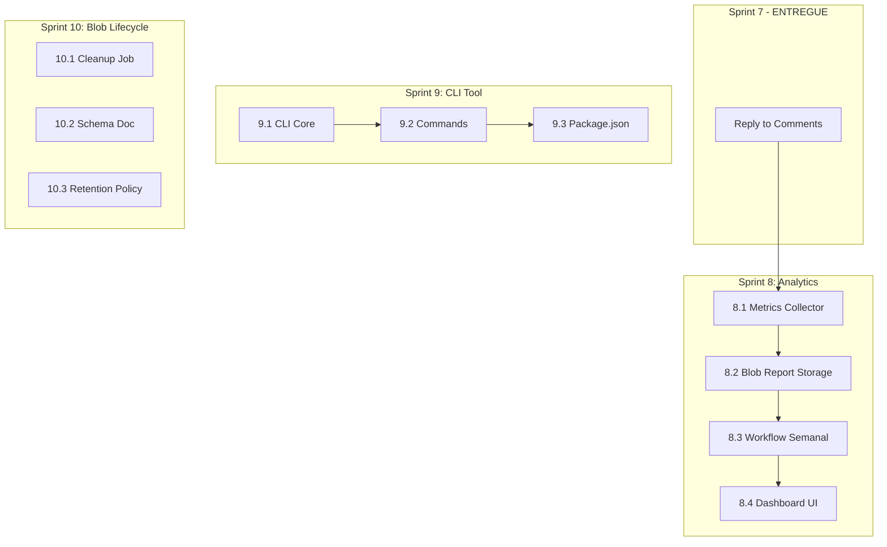

# Plano de Próximas Fases: Gemini Code Assist Integration

> **Documento de planejamento para continuação da integração Gemini Code Assist**
> **Versão:** 3.0.0 | **Data:** 2026-02-24
> **Status:** 📋 Plano Atualizado com Vercel Blob Enhancements
> **Autor:** Architect Mode
> **Baseado em:** `plans/vercel-blobs-analysis.md`

---

## 📋 Sumário Executivo

### Mudanças nesta Versão

Esta versão (v3.0.0) incorpora as descobertas da análise de Vercel Blobs:
- Sprint 7 marcado como **ENTREGUE**
- Novo Sprint 10: **Blob Lifecycle Management**
- Sprint 8 expandido com **Analytics via Blobs**
- Matriz de dependências atualizada

### Estado Atual Real

| Componente | Status | Observação |
|------------|--------|------------|
| **Workflow Intelligence** | ✅ IMPLEMENTADO | Hash SHA-256 + estados expandidos |
| **persist-reviews.cjs** | ✅ IMPLEMENTADO | Deduplicação por hash |
| **create-issues.cjs** | ✅ IMPLEMENTADO | Cria issues com deduplicação |
| **check-resolutions.cjs** | ✅ IMPLEMENTADO | Detecta "Fixes #X" + atualiza Supabase |
| **notify-agents.cjs** | ✅ IMPLEMENTADO | Webhooks para agents externos |
| **Workflow YAML** | ✅ IMPLEMENTADO | 10 jobs funcionais |
| **Vercel Endpoints** | ✅ IMPLEMENTADO | 4 endpoints com JWT auth |
| **Reply to Comments** | ✅ ENTREGUE | Sprint 7 completo |
| **Vercel Blob Transport** | ✅ IMPLEMENTADO | Transporte temporário (7 dias TTL) |
| **Analytics Dashboard** | ❌ NÃO IMPLEMENTADO | Métricas semanais |
| **CLI Tool** | ❌ NÃO IMPLEMENTADO | gemini-agent CLI |
| **Blob Lifecycle Management** | ❌ NÃO IMPLEMENTADO | Cleanup + schema docs |

### O Que Precisa Ser Feito

| Sprint | Nome | Status | Prioridade |
|--------|------|--------|------------|
| ~~Sprint 7~~ | ~~Reply to Comments Integration~~ | ✅ ENTREGUE | - |
| **Sprint 8** | Analytics Dashboard | ❌ PENDENTE | MEDIUM |
| **Sprint 9** | CLI Tool | ❌ PENDENTE | LOW |
| **Sprint 10** | Blob Lifecycle Management | ❌ NOVO | MEDIUM |

---

## 📦 Vercel Blob - Contexto Atual

### Arquitetura de Dados

```
┌─────────────────┐     ┌──────────────────┐     ┌─────────────────┐
│  GitHub Actions │────▶│  Vercel API      │────▶│  Supabase       │
│  Workflow       │ JWT │  Endpoints       │ SRK │  Database       │
│                 │     │                  │     │                 │
│ • detect        │     │ • persist.js     │     │ • gemini_       │
│ • parse         │     │ • create-issues  │     │   reviews       │
│ • upload-to-blob│     │ • update-status  │     │                 │
│ • persist       │     │                  │     │ SOURCE OF TRUTH │
└─────────────────┘     └──────────────────┘     └─────────────────┘
        │                                                 │
        │                                                 │
        ▼                                                 ▼
┌─────────────────┐                             ┌─────────────────┐
│  Vercel Blob    │                             │  Query          │
│  (Transporte)   │                             │  Analytics      │
│  TTL: 7 dias    │                             └─────────────────┘
└─────────────────┘
```

### Características Atuais do Blob

| Característica | Valor | Propósito |
|----------------|-------|-----------|
| **TTL** | 7 dias | Armazenamento temporário |
| **Access** | Privado | Requer `VERCEL_BLOB_TOKEN` |
| **Path Pattern** | `reviews/pr-{n}/review-{ts}.json` | Único por PR + timestamp |
| **Papel** | Transporte | NÃO é source of truth |

### Oportunidades Identificadas

| Oportunidade | Descrição | Benefício | Sprint |
|--------------|-----------|-----------|--------|
| **Blob Cleanup Job** | Remover blobs antigos | Gestão de custos | Sprint 10 |
| **Analytics Blobs** | Armazenar métricas agregadas | Dashboard rápido | Sprint 8 |
| **Historical Archive** | Estender TTL para auditoria | Compliance | Sprint 10 (opcional) |

---

## 📊 Sprint 8: Analytics Dashboard (Expandido)

### Situação Atual

**NÃO IMPLEMENTADO** - Não existe:
- Script de coleta de métricas
- Workflow semanal de relatórios
- Dashboard UI

### Novo: Analytics via Blobs

Além de coletar métricas do Supabase, o Sprint 8 agora inclui armazenamento de relatórios agregados em Vercel Blobs para carregamento rápido do dashboard.

```
┌─────────────────────────────────────────────────────────────────────────────┐
│                    ANALYTICS ARCHITECTURE                                   │
├─────────────────────────────────────────────────────────────────────────────┤
│                                                                             │
│  ┌──────────────┐    ┌──────────────┐    ┌──────────────┐                 │
│  │ Supabase     │───▶│ Aggregate    │───▶│ Store in     │                 │
│  │ (raw data)   │    │ Metrics      │    │ Vercel Blob  │                 │
│  └──────────────┘    └──────────────┘    └──────────────┘                 │
│                             │                      │                        │
│                             │                      ▼                        │
│                             │              ┌──────────────┐                │
│                             │              │ Dashboard UI │                │
│                             │              │ (fast load)  │                │
│                             │              └──────────────┘                │
│                             │                                               │
│                             ▼                                               │
│                      ┌──────────────┐                                      │
│                      │ GitHub Issue │                                      │
│                      │ (weekly)     │                                      │
│                      └──────────────┘                                      │
│                                                                             │
└─────────────────────────────────────────────────────────────────────────────┘
```

### Entregáveis Atualizados

| # | Entregável | Descrição | Arquivo |
|---|------------|-----------|---------|
| 8.1 | Metrics Collector | Coleta de métricas do Supabase | `.github/scripts/metrics-collector.cjs` |
| 8.2 | **Blob Report Storage** | Armazena relatório em blob | `.github/scripts/store-metrics-blob.cjs` |
| 8.3 | Workflow Semanal | Geração de relatório automático | `.github/workflows/metrics-report.yml` |
| 8.4 | Dashboard UI | Interface para visualização | `src/views/admin/GeminiMetrics.jsx` |

### Blob Storage para Analytics

```javascript
// .github/scripts/store-metrics-blob.cjs
const { put } = require('@vercel/blob');

async function storeMetricsBlob(metrics) {
  const timestamp = new Date().toISOString().split('T')[0];
  const blob = await put(`reports/weekly/week-${timestamp}.json`, JSON.stringify(metrics), {
    access: 'private',
    token: process.env.VERCEL_BLOB_TOKEN,
  });
  
  return blob;
}
```

### Métricas a Coletar

| Métrica | Query Supabase | Blob Storage |
|---------|----------------|--------------|
| Total de Reviews | `SELECT COUNT(*) FROM gemini_reviews` | ✅ |
| Por Prioridade | `SELECT priority, COUNT(*) FROM gemini_reviews GROUP BY priority` | ✅ |
| Taxa de Resolução | `SELECT status, COUNT(*) FROM gemini_reviews GROUP BY status` | ✅ |
| Tempo Médio | `SELECT AVG(resolved_at - created_at) FROM gemini_reviews WHERE status = 'resolved'` | ✅ |

### Dependências

```
Sprint 7 (ENTREGUE) ──▶ 8.1 (Metrics Collector)
                              │
                              ▼
                       8.2 (Blob Report Storage)
                              │
                              ▼
                       8.3 (Workflow Semanal)
                              │
                              ▼
                       8.4 (Dashboard UI)
```

### Critérios de Sucesso

- [ ] Workflow executando às segundas-feiras 9h
- [ ] Relatório armazenado em Vercel Blob
- [ ] GitHub Issue criada automaticamente com relatório
- [ ] Dashboard carregando em < 2s (lendo do blob)

---

## 🖥️ Sprint 9: CLI Tool

### Situação Atual

**NÃO IMPLEMENTADO** - Não existe CLI para interação com o sistema.

### Entregáveis

| # | Entregável | Descrição | Arquivo |
|---|------------|-----------|---------|
| 9.1 | CLI Core | Estrutura base do CLI | `scripts/gemini-agent-cli.js` |
| 9.2 | Commands | Comandos list, claim, show, resolve | No mesmo arquivo |
| 9.3 | Package.json | Adicionar bin | `package.json` |

### Comandos

```bash
# Listar reviews pendentes
gemini-agent list --status pending

# Reservar review
gemini-agent claim --pr 71

# Ver detalhes
gemini-agent show --pr 71

# Marcar como resolvido
gemini-agent resolve --pr 71 --commit abc123
```

### Dependências

```
Docs Existentes ──▶ 9.1 (CLI Core)
[GEMINI_AGENT_PROTOCOL.md]    │
                               ▼
                        9.2 (Commands)
                               │
                               ▼
                        9.3 (Package.json)
```

### Critérios de Sucesso

- [ ] CLI instalável via `npm link`
- [ ] Todos os comandos funcionais
- [ ] Documentação no README

---

## 🧹 Sprint 10: Blob Lifecycle Management (NOVO)

### Situação Atual

**NÃO IMPLEMENTADO** - Não existe:
- Job de cleanup de blobs antigos
- Documentação formal do schema do blob
- Política de retenção estendida

### Entregáveis

| # | Entregável | Descrição | Arquivo |
|---|------------|-----------|---------|
| 10.1 | **Blob Cleanup Job** | Remove blobs > 30 dias | `.github/workflows/blob-cleanup.yml` |
| 10.2 | **Blob Schema Doc** | Documenta schema do JSON | `src/schemas/geminiBlobSchema.js` |
| 10.3 | **Retention Policy** | Política de retenção | `docs/operations/BLOB_RETENTION.md` |

### Blob Cleanup Job

```yaml
# .github/workflows/blob-cleanup.yml
name: Blob Cleanup

on:
  schedule:
    - cron: '0 0 * * 0'  # Weekly on Sunday at midnight
  workflow_dispatch:

jobs:
  cleanup:
    runs-on: ubuntu-latest
    steps:
      - name: Delete old blobs
        uses: actions/github-script@v7
        with:
          script: |
            const { list, del } = require('@vercel/blob');
            
            // List all blobs with reviews/ prefix
            const { blobs } = await list({ prefix: 'reviews/' });
            
            // Delete blobs older than 30 days
            const cutoff = Date.now() - 30 * 24 * 60 * 60 * 1000;
            let deleted = 0;
            
            for (const blob of blobs) {
              if (new Date(blob.uploadedAt).getTime() < cutoff) {
                await del(blob.url);
                deleted++;
              }
            }
            
            console.log(`Deleted ${deleted} blobs older than 30 days`);
```

### Blob Schema

```javascript
// src/schemas/geminiBlobSchema.js
import { z } from 'zod';

/**
 * Schema para o conteúdo do Vercel Blob
 * usado no transporte de reviews entre jobs
 */
export const geminiBlobSchema = z.object({
  pr_number: z.number().int().positive(),
  commit_sha: z.string().min(1),
  summary: z.object({
    total_issues: z.number().int().nonnegative(),
    auto_fixable: z.number().int().nonnegative(),
    critical: z.number().int().nonnegative(),
    needs_agent: z.number().int().nonnegative(),
  }),
  issues: z.array(z.object({
    file_path: z.string(),
    line_start: z.number().int().optional(),
    line_end: z.number().int().optional(),
    title: z.string(),
    description: z.string().optional(),
    suggestion: z.string().optional(),
    priority: z.enum(['CRITICAL', 'HIGH', 'MEDIUM', 'LOW']),
    category: z.string().optional(),
  })),
  timestamp: z.string().datetime().optional(),
});
```

### Dependências

```
Nenhuma (independente de outros sprints)
```

### Critérios de Sucesso

- [ ] Workflow de cleanup executando semanalmente
- [ ] Blobs > 30 dias sendo removidos automaticamente
- [ ] Schema documentado e validado
- [ ] Política de retenção documentada

### Riscos

| Risco | Probabilidade | Impacto | Mitigação |
|-------|---------------|---------|-----------|
| Deletar blob ainda necessário | Baixa | LOW | TTL de 30 dias é generoso |
| Workflow falhar | Média | LOW | Alertas + retry automático |

---

## 📐 Matriz de Dependências Atualizada

### Visão Geral



### Matriz Detalhada

| Entregável | Depende De | Bloqueia | Prioridade |
|------------|------------|----------|------------|
| **8.1 Metrics Collector** | Sprint 7 (ENTREGUE) | 8.2 | MEDIUM |
| **8.2 Blob Report Storage** | 8.1 | 8.3 | MEDIUM |
| **8.3 Workflow Semanal** | 8.2 | 8.4 | MEDIUM |
| **8.4 Dashboard UI** | 8.3 | - | LOW |
| **9.1 CLI Core** | Nada | 9.2 | LOW |
| **9.2 Commands** | 9.1 | 9.3 | LOW |
| **9.3 Package.json** | 9.2 | - | LOW |
| **10.1 Cleanup Job** | Nada | - | MEDIUM |
| **10.2 Schema Doc** | Nada | - | LOW |
| **10.3 Retention Policy** | 10.1, 10.2 | - | LOW |

---

## 🔄 Estratégia de PRs por Sprint

### Regras (Conforme R-060 a R-065)

1. **Cada Sprint = Um PR** com nome `feat/sprint-X/description`
2. **Code Agent cria PR** → **Debug Agent revisa** → **DevOps merge**
3. **Gemini Code Assist review** é obrigatório
4. **Nenhum agent pode mergear seu próprio PR**

### Ordem de Execução Recomendada

```
┌─────────────────────────────────────────────────────────────────┐
│                    ORDEM DE EXECUÇÃO                            │
├─────────────────────────────────────────────────────────────────┤
│                                                                 │
│  Sprint 8 (Analytics)     Sprint 10 (Blob Lifecycle)           │
│  ├── 8.1 Collector        ├── 10.1 Cleanup Job                 │
│  ├── 8.2 Blob Storage     ├── 10.2 Schema Doc                  │
│  ├── 8.3 Workflow         └── 10.3 Retention Policy            │
│  └── 8.4 Dashboard                                             │
│                                                                 │
│  (Podem ser executados em paralelo)                            │
│                                                                 │
│  Sprint 9 (CLI Tool)                                            │
│  ├── 9.1 CLI Core                                              │
│  ├── 9.2 Commands                                              │
│  └── 9.3 Package.json                                          │
│                                                                 │
│  (Independente, pode ser feito a qualquer momento)             │
│                                                                 │
└─────────────────────────────────────────────────────────────────┘
```

---

## 🛡️ Análise de Riscos Atualizada

### Riscos por Sprint

| Sprint | Risco | Probabilidade | Impacto | Mitigação |
|--------|-------|---------------|---------|-----------|
| **8** | Dados insuficientes no início | Alta | LOW | Período de acumulação |
| **8** | Blob storage costs | Baixa | LOW | Cleanup job (Sprint 10) |
| **9** | Documentação desatualizada | Média | MEDIUM | Review trimestral |
| **9** | CLI não adotado | Média | LOW | Focar em UI web |
| **10** | Deletar blob necessário | Baixa | LOW | TTL 30 dias generoso |

### Plano de Contingência

Se um sprint falhar:
1. **Pausar** - Não iniciar sprint dependente
2. **Analisar** - Identificar causa raiz
3. **Corrigir** - Hotfix branch se necessário
4. **Documentar** - Atualizar `.memory/anti-patterns.md`
5. **Retomar** - Apenas após validação

---

## ✅ Critérios de Sucesso por Sprint

### Sprint 8: Analytics Dashboard

| Critério | Métrica | Validação |
|----------|---------|-----------|
| Workflow semanal | Executa segundas 9h | GitHub Actions |
| Blob storage | Relatório armazenado | Vercel Blob list |
| GitHub Issue | Criada automaticamente | Verificação manual |
| Dashboard | Carrega < 2s | Lighthouse |

### Sprint 9: CLI Tool

| Critério | Métrica | Validação |
|----------|---------|-----------|
| Instalação | npm link funciona | Teste manual |
| Comandos | Todos funcionais | Teste manual |
| Docs | README atualizado | Review |

### Sprint 10: Blob Lifecycle Management

| Critério | Métrica | Validação |
|----------|---------|-----------|
| Cleanup Job | Executa semanalmente | GitHub Actions |
| Blobs removidos | > 30 dias deletados | Blob list antes/depois |
| Schema | Validado com Zod | Testes unitários |
| Documentação | Política publicada | Review |

---

## 📅 Cronograma Atualizado

### Sequência Recomendada

```
SEMANA 1-2: Sprint 8 (Analytics Dashboard)
├── Dia 1-2: 8.1 Metrics Collector
├── Dia 3: 8.2 Blob Report Storage
├── Dia 4-5: 8.3 Workflow Semanal
├── Dia 6-8: 8.4 Dashboard UI
└── Dia 9-10: Review + Merge

SEMANA 1-2 (PARALELO): Sprint 10 (Blob Lifecycle)
├── Dia 1: 10.1 Cleanup Job
├── Dia 2: 10.2 Schema Doc
├── Dia 3: 10.3 Retention Policy
└── Dia 4-5: Review + Merge

SEMANA 3-4: Sprint 9 (CLI Tool)
├── Dia 1-2: 9.1 CLI Core
├── Dia 3-4: 9.2 Commands
├── Dia 5: 9.3 Package.json
└── Dia 6-10: Review + Merge
```

### Marcos

| Marco | Data | Entregável |
|-------|------|------------|
| M1 | Semana 2 | Sprint 8 + 10 completos - Analytics + Blob Lifecycle |
| M2 | Semana 4 | Sprint 9 completo - CLI funcional |

---

## 📚 Referências

### Arquivos Já Implementados

| Componente | Localização | Status |
|------------|-------------|--------|
| persist-reviews.cjs | [`.github/scripts/persist-reviews.cjs`](.github/scripts/persist-reviews.cjs) | ✅ |
| create-issues.cjs | [`.github/scripts/create-issues.cjs`](.github/scripts/create-issues.cjs) | ✅ |
| check-resolutions.cjs | [`.github/scripts/check-resolutions.cjs`](.github/scripts/check-resolutions.cjs) | ✅ |
| notify-agents.cjs | [`.github/scripts/notify-agents.cjs`](.github/scripts/notify-agents.cjs) | ✅ |
| upload-to-vercel-blob.cjs | [`.github/scripts/upload-to-vercel-blob.cjs`](.github/scripts/upload-to-vercel-blob.cjs) | ✅ |
| Workflow YAML | [`.github/workflows/gemini-review.yml`](.github/workflows/gemini-review.yml) | ✅ |
| persist endpoint | [`api/gemini-reviews/persist.js`](api/gemini-reviews/persist.js) | ✅ |
| create-issues endpoint | [`api/gemini-reviews/create-issues.js`](api/gemini-reviews/create-issues.js) | ✅ |
| update-status endpoint | [`api/gemini-reviews/update-status.js`](api/gemini-reviews/update-status.js) | ✅ |
| batch-update endpoint | [`api/gemini-reviews/batch-update.js`](api/gemini-reviews/batch-update.js) | ✅ |
| security utils | [`api/gemini-reviews/shared/security.js`](api/gemini-reviews/shared/security.js) | ✅ |

### Documentação de Referência

| Documento | Localização |
|-----------|-------------|
| Status Atual | [`status-integracao-gemini.md`](status-integracao-gemini.md) |
| Análise de Blobs | [`plans/vercel-blobs-analysis.md`](plans/vercel-blobs-analysis.md) |
| Regras do Projeto | [`.memory/rules.md`](.memory/rules.md) |
| Styleguide | [`.gemini/styleguide.md`](.gemini/styleguide.md) |
| Agent Protocol | [`docs/standards/GEMINI_AGENT_PROTOCOL.md`](docs/standards/GEMINI_AGENT_PROTOCOL.md) |
| Integration Guide | [`docs/standards/GEMINI_INTEGRATION.md`](docs/standards/GEMINI_INTEGRATION.md) |

---

## 📝 Notas de Implementação

### Antes de Iniciar Cada Sprint

1. **Ler memória**: Todo agent DEVE ler `.memory/rules.md` e `.memory/anti-patterns.md`
2. **Verificar styleguide**: Seguir `.gemini/styleguide.md`
3. **Verificar duplicatas**: Executar `find src -name "*TargetFile*" -type f`
4. **Criar branch**: Seguir naming `feat/sprint-X/description`

### Durante Implementação

1. **Commits atômicos**: Um entregável por commit
2. **Mensagens semânticas**: `feat(scope): descrição`
3. **Validação contínua**: `npm run validate:agent` frequentemente
4. **Arquitetura**: GitHub Actions → Vercel Endpoints → Supabase (NUNCA direto)

### Após Completar Cada Sprint

1. **Criar PR**: Um PR por sprint
2. **Aguardar review**: Debug Agent + Gemini Code Assist
3. **Aprovação explícita**: Usuário deve aprovar
4. **DevOps merge**: Apenas DevOps pode mergear
5. **Atualizar memória**: Documentar lições aprendidas

---

## 📝 Changelog

| Versão | Data | Descrição |
|--------|------|-----------|
| 3.0.0 | 2026-02-24 | Incorporação da análise de Vercel Blobs; Sprint 7 marcado como ENTREGUE; Novo Sprint 10 (Blob Lifecycle); Sprint 8 expandido com Analytics via Blobs |
| 2.0.0 | 2026-02-24 | Revisão após auditoria - estado real dos componentes |
| 1.0.0 | 2026-02-19 | Versão inicial do plano |

---

*Documento criado em 2026-02-24*
*Próxima revisão: após Sprint 8 e 10*
*Responsável: DevOps Team*
