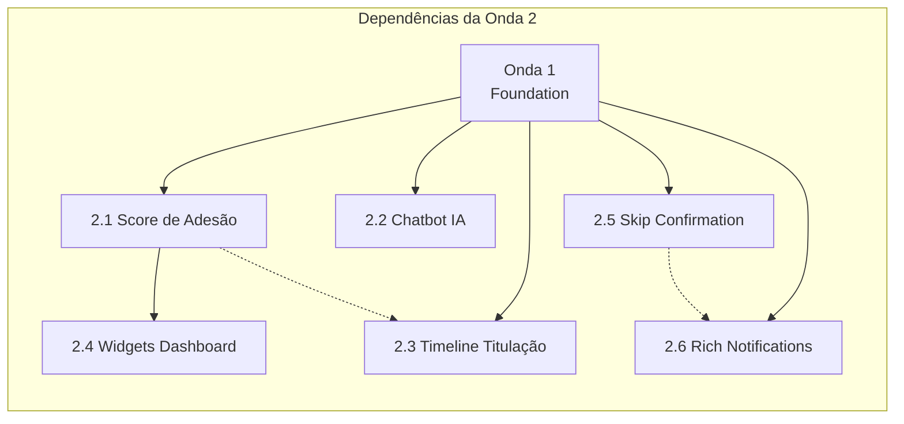
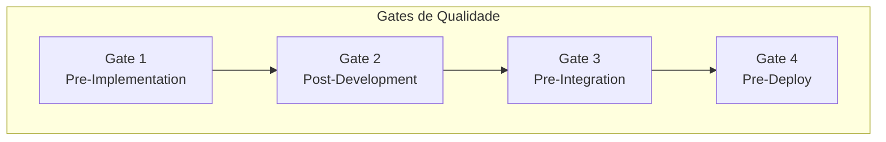
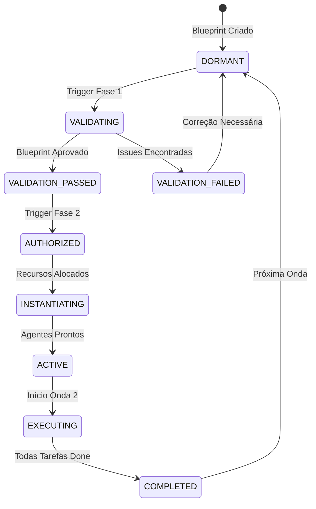
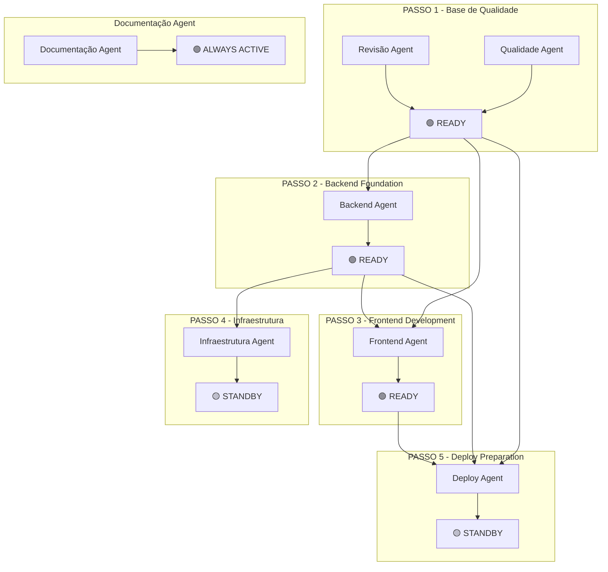

# 🏗️ Blueprint de Arquitetura Multiagente Hierárquica

## Onda 2 - Inteligência | Meus Remédios

**Versão:** 1.0  
**Data:** 03 de Fevereiro de 2026  
**Status:** AUTHORIZED (Aguardando Ativação do Arquiteto-Orchestrador)  
**Escopo:** 6 Tarefas | 7 Agentes-Pai | 18+ Subagentes  

---

## 📋 Sumário Executivo

Este blueprint define uma arquitetura multiagente hierárquica para execução autônoma da **Onda 2 - Inteligência** do projeto Meus Remédios. A arquitetura organiza agentes especializados em setores funcionais, estabelece protocolos de orquestração e define um workflow de aprovação em 2 etapas para transição do estado DORMANT para ACTIVE.

### Características da Arquitetura

| Aspecto | Especificação |
|---------|---------------|
| **Modelo** | Hierárquico com 7 Agentes-Pai Setoriais |
| **Granularidade** | 2-4 Subagentes Filhos por Agente-Pai |
| **Comunicação** | Async via Event Bus + Sync via Checkpoints |
| **Estado Inicial** | DORMANT (configurado, não instanciado) |
| **Custo Projetado** | R$ 0-15/mês (Groq free tier ou GPT-4o-mini) |

---

## 🎯 Escopo da Onda 2

### Tarefas a Executar

| ID | Tarefa | OE* | Impacto | Custo |
|----|--------|-----|---------|-------|
| **2.1** | Score de adesão + Widget Dashboard | OE3 | Alto | R$ 0 |
| **2.2** | Chatbot IA para medicamentos | OE4 | Alto | R$ 1-15/mês |
| **2.3** | Timeline de titulação | OE3 | Médio | R$ 0 |
| **2.4** | Widgets de engajamento no Dashboard | OE3 | Alto | R$ 0 |
| **2.5** | Confirmação ao pular dose no bot | OE3 | Médio | R$ 0 |
| **2.6** | Notificações ricas no bot | OE3 | Médio | R$ 0 |

*OE = Objetivo Estratégico

---

## 🏛️ Estrutura de Agentes (ECOSYSTEM DESIGN)

```mermaid
flowchart TB
    subgraph ORQUESTRADOR_CENTRAL[Orquestrador Central - Arquiteto Humano]
        OC[Revisão e Aprovação do Blueprint]
    end
    
    subgraph AGENTES_PAI[7 Agentes-Pai Setoriais]
        direction TB
        A1[Backend Agent<br/>Supabase | SQL | RLS]
        A2[Frontend Agent<br/>React | Vite | Components]
        A3[Infraestrutura Agent<br/>Vercel | Config | Env]
        A4[Qualidade Agent<br/>Testes | Lint | Gates]
        A5[Documentação Agent<br/>Docs | README | API]
        A6[Revisão Agent<br/>Code Review | Standards]
        A7[Deploy Agent<br/>Release | Versioning]
    end
    
    subgraph SUBAGENTES[Subagentes Filhos Domain-Specific]
        direction TB
        
        subgraph BA[Backend Subagentes]
            BA1[Migration Specialist<br/>SQL DDL/DML]
            BA2[RLS Policy Expert<br/>Row Level Security]
            BA3[Service Developer<br/>API Services]
            BA4[Cache Architect<br/>Query Optimization]
        end
        
        subgraph FA[Frontend Subagentes]
            FA1[Component Engineer<br/>React Components]
            FA2[Hook Developer<br/>Custom Hooks]
            FA3[Widget Specialist<br/>Dashboard Widgets]
            FA4[Timeline Designer<br/>Visual Timelines]
        end
        
        subgraph IA[Infra Subagentes]
            IA1[Env Manager<br/>Variables & Secrets]
            IA2[Deploy Configurator<br/>Vercel Settings]
            IA3[Integration Specialist<br/>Third-party APIs]
        end
        
        subgraph QA[Qualidade Subagentes]
            QA1[Test Engineer<br/>Unit/Integration]
            QA2[Coverage Analyst<br/>Metrics & Reports]
            QA3[Lint Guardian<br/>ESLint/Prettier]
        end
        
        subgraph DA[Documentação Subagentes]
            DA1[Technical Writer<br/>Code Docs]
            DA2[API Documenter<br/>Endpoints & Schemas]
            DA3[User Guide Writer<br/>Instructions]
        end
        
        subgraph RA[Revisão Subagentes]
            RA1[Standards Enforcer<br/>Code Patterns]
            RA2[Security Reviewer<br/>Vulnerabilities]
            RA3[Performance Auditor<br/>Optimization]
        end
        
        subgraph PA[Deploy Subagentes]
            PA1[Release Manager<br/>Versioning]
            PA2[Merge Coordinator<br/>PR Strategy]
            PA3[Changelog Generator<br/>Release Notes]
        end
    end
    
    OC --> AGENTES_PAI
    A1 --> BA
    A2 --> FA
    A3 --> IA
    A4 --> QA
    A5 --> DA
    A6 --> RA
    A7 --> PA
```

---

## 🔷 Agentes-Pai e Subagentes Detalhados

### 1. Backend Agent
**Responsabilidade:** Camada de dados, persistência, segurança e otimização

| Subagente | Especialidade | Permissões | Toolkit |
|-----------|---------------|------------|---------|
| **BA1 - Migration Specialist** | SQL DDL/DML, migrations Supabase | `.migrations/`, SQL files | `supabase-cli`, SQL editors |
| **BA2 - RLS Policy Expert** | Row Level Security, policies | Tabelas com RLS | SQL policy syntax |
| **BA3 - Service Developer** | API Services (Node.js/JS) | `src/services/api/`, `server/services/` | JS/Node debugging |
| **BA4 - Cache Architect** | Query optimization, caching | Views, cache layer | Query analyzers |

**Tarefas da Onda 2 Atribuídas:**
- 2.1: Tabela/cálculo de adesão, view para streaks
- 2.2: Tabela cache de respostas IA, rate limit tracking
- 2.4: View para widgets de estoque (se necessário)

---

### 2. Frontend Agent
**Responsabilidade:** UI/UX React, componentes, hooks e widgets

| Subagente | Especialidade | Permissões | Toolkit |
|-----------|---------------|------------|---------|
| **FA1 - Component Engineer** | React components, JSX, CSS | `src/components/` | React DevTools, CSS |
| **FA2 - Hook Developer** | Custom hooks, state management | `src/hooks/` | React hooks testing |
| **FA3 - Widget Specialist** | Dashboard widgets, progress indicators | `src/components/dashboard/` | D3/Chart libraries |
| **FA4 - Timeline Designer** | Visual timelines, step progress | `src/components/protocol/` | CSS animations |

**Tarefas da Onda 2 Atribuídas:**
- 2.1: Widget de score de adesão (circular progress)
- 2.3: Componente TimelineTitulation.jsx
- 2.4: Widgets Dashboard (adesão, estoque, quick actions)

---

### 3. Infraestrutura Agent
**Responsabilidade:** Deploy, configurações, variáveis de ambiente, integrações

| Subagente | Especialidade | Permissões | Toolkit |
|-----------|---------------|------------|---------|
| **IA1 - Env Manager** | .env, secrets management | `.env*`, Vercel dashboard | Vercel CLI |
| **IA2 - Deploy Configurator** | vercel.json, build settings | `vercel.json`, config files | CI/CD tools |
| **IA3 - Integration Specialist** | Third-party APIs (Groq, OpenAI) | `api/`, server endpoints | API testing |

**Tarefas da Onda 2 Atribuídas:**
- 2.2: Configuração API Groq/GPT-4o-mini, env vars
- 2.2: Endpoint serverless `/api/ai-chat.js`
- Todos: Configuração de deploy em Vercel

---

### 4. Qualidade Agent
**Responsabilidade:** Testes, cobertura, linting, quality gates

| Subagente | Especialidade | Permissões | Toolkit |
|-----------|---------------|------------|---------|
| **QA1 - Test Engineer** | Unit/integration tests | `*.test.jsx`, `*.test.js` | Vitest, RTL |
| **QA2 - Coverage Analyst** | Coverage metrics, reports | Test config files | Coverage tools |
| **QA3 - Lint Guardian** | ESLint, Prettier enforcement | `eslint.config.js` | ESLint CLI |

**Tarefas da Onda 2 Atribuídas:**
- Todos: Testes para novos services e componentes
- 2.1: Testes para adherenceService
- 2.2: Testes para endpoint de chat IA

---

## 🧪 Responsabilidades de Validação

### Pipeline de Testes por Agente

#### Backend Agent
| Momento | Comando | Propósito |
|---------|---------|-----------|
| Pré-commit | `npm run test:related` | Testar services modificados |
| Pre-push | `npm run test:critical` | Validar services, schemas, hooks |
| CI/CD | `npm run test` | Suite completa |

#### Frontend Agent
| Momento | Comando | Propósito |
|---------|---------|-----------|
| Pré-commit | `npm run test:related` | Testar componentes modificados |
| Pre-push | Testes de componentes + `npm run lint` | Validação visual e código |
| Pós-deploy | Smoke test na Vercel | Verificação de build |

#### Qualidade Agent
- **Manter:** Configurações otimizadas de testes atualizadas
- **Monitorar:** Cobertura não cair abaixo de 75%
- **Revisar:** Métricas de performance dos testes
- **Garantir:** `test:critical` cobre todos os paths críticos
- **Atualizar:** Scripts de teste conforme necessidade

#### Debug Agent
- `test:full` apenas quando solicitado explicitamente
- Ou quando investigação requer validação completa
- Usar `test:smoke` para validações rápidas durante debug

### Matriz de Comandos por Tipo de Mudança

| Tipo de Arquivo Alterado | Comando Recomendado | Agente Responsável |
|--------------------------|---------------------|-------------------|
| `src/services/api/*` | `test:critical` | Backend Agent |
| `src/schemas/*` | `test:critical` | Backend Agent |
| `src/hooks/*` | `test:critical` | Frontend Agent |
| `src/components/*` | `test:related` | Frontend Agent |
| `src/utils/*` | `test:critical` | Backend/Frontend* |
| Configurações (vite, eslint) | `test:smoke` | Qualidade Agent |
| CSS/Assets | `test:smoke` ou nenhum | Frontend Agent |

*Depende do domínio do utilitário

---

### 5. Documentação Agent
**Responsabilidade:** Documentação técnica, READMEs, guias de API

| Subagente | Especialidade | Permissões | Toolkit |
|-----------|---------------|------------|---------|
| **DA1 - Technical Writer** | Code documentation, comments | Source files | JSDoc |
| **DA2 - API Documenter** | Endpoint docs, schemas | `docs/API_SERVICES.md` | Markdown |
| **DA3 - User Guide Writer** | User-facing documentation | `docs/user-guide.md` | Markdown |

**Tarefas da Onda 2 Atribuídas:**
- 2.2: Documentação do comando /pergunta
- 2.4: Guia de widgets do Dashboard
- Todos: Atualização de CHANGELOG

---

### 6. Revisão Agent
**Responsabilidade:** Code review, padrões, segurança, performance

| Subagente | Especialidade | Permissões | Toolkit |
|-----------|---------------|------------|---------|
| **RA1 - Standards Enforcer** | Code patterns, architecture | All source files | Pattern matchers |
| **RA2 - Security Reviewer** | Vulnerabilities, secrets leak | Auth, API files | Security scanners |
| **RA3 - Performance Auditor** | Optimization, bundle size | Build outputs | Bundle analyzers |

**Tarefas da Onda 2 Atribuídas:**
- Todos: Revisão de PRs
- 2.2: Revisão de segurança do endpoint IA
- 2.1: Revisão de performance dos cálculos de adesão

---

### 7. Deploy Agent
**Responsabilidade:** Releases, versioning, merge coordination

| Subagente | Especialidade | Permissões | Toolkit |
|-----------|---------------|------------|---------|
| **PA1 - Release Manager** | Semantic versioning | `package.json`, tags | Git tags |
| **PA2 - Merge Coordinator** | PR strategy, branch mgmt | Git branches | Git CLI |
| **PA3 - Changelog Generator** | Release notes | `CHANGELOG.md`, `RELEASE_NOTES.md` | Conventional commits |

**Tarefas da Onda 2 Atribuídas:**
- Onda completa: Release v2.4.0
- Coordenação de merge dos 6 PRs

---

## 🔗 Mapeamento de Dependências Críticas (DEPENDENCY GRAPH)

### Matriz de Dependências entre Tarefas



| Tarefa | Dependências | Bloqueia | Caminho Crítico |
|--------|--------------|----------|-----------------|
| **2.1** | Onda 1 completa | 2.4, 2.3 | ✅ SIM |
| **2.2** | Onda 1 completa | - | ❌ NÃO |
| **2.3** | 2.1 (parcial - dados de adesão) | - | ❌ NÃO |
| **2.4** | 2.1 (widget de adesão) | - | ❌ NÃO |
| **2.5** | Onda 1 completa | 2.6 (opcional) | ❌ NÃO |
| **2.6** | 2.5 (desejável - consistência UX) | - | ❌ NÃO |

### Dependências Inter-Agentes

| Tarefa | Agente Principal | Dependências de Outros Agentes |
|--------|------------------|-------------------------------|
| 2.1 | Backend → Frontend | Backend cria service/tabela → Frontend consome |
| 2.2 | Backend (API) → Bot → Infra | Infra configura env → Backend cria endpoint → Bot integra comando |
| 2.3 | Frontend | Backend (se precisar de novos campos) |
| 2.4 | Frontend | Backend (2.1 completo para widget de adesão) |
| 2.5 | Bot | Backend (se precisar persistir estado) |
| 2.6 | Bot | - (melhoria em templates existentes) |

### Caminho Crítico

```
Onda 1 Completa → 2.1 Score de Adesão → 2.4 Widgets Dashboard
     ↓
   [2.2, 2.3, 2.5, 2.6 podem executar em paralelo]
```

**Duração Estimada do Caminho Crítico:** 2-3 dias

---

## 🎛️ Protocolos de Orquestração (ORCHESTRATION PROTOCOLS)

### 1. Sincronização em Tempo Real

#### Event Bus de Agentes

| Evento | Emissor | Consumidores | Payload |
|--------|---------|--------------|---------|
| `migration.applied` | BA1 | BA2, BA3, QA1 | `{table, version, status}` |
| `service.created` | BA3 | FA2, QA1, RA1 | `{service, methods, tests}` |
| `component.ready` | FA1 | QA1, RA1, FA3 | `{component, props, tests}` |
| `test.passed` | QA1 | RA1, PA2 | `{scope, coverage, duration}` |
| `review.approved` | RA1 | PA2, DA1 | `{pr, files, comments}` |
| `deploy.ready` | PA1 | ALL | `{version, changelog}` |

#### Handshake de Sincronização

```
Agente A precisa de recurso de Agente B:

1. A → Event Bus: REQUEST_RESOURCE {resource_id, priority, deadline}
2. B → Event Bus: ACK_REQUEST {resource_id, eta}
3. B → Event Bus: RESOURCE_READY {resource_id, location}
4. A → Event Bus: ACK_RECEIPT {resource_id}
5. [Opcional] A → Event Bus: VALIDATION_RESULT {resource_id, status}
```

### 2. Mecanismos de Resolução de Conflitos

#### Tipos de Conflito e Resolução

| Tipo | Cenário | Resolução |
|------|---------|-----------|
| **Merge Conflict** | 2+ agentes alteram mesmo arquivo | Revisão Agent atua como árbitro; último PR cria merge manual |
| **API Breaking Change** | Backend altera contrato sem avisar Frontend | Gate obrigatório: Backend NÃO pode mergear sem testes de integração |
| **Schema Divergence** | Migration conflita com código | BA1 (Migration Specialist) tem prioridade; rollback automático se falhar |
| **Env Var Missing** | Deploy falha por variável não configurada | Infra Agent bloqueia deploy até IA1 validar env vars |
| **Test Flaky** | Testes intermitentes falham | QA1 pode marcar como quarantine; não bloqueia pipeline |

#### Escalation Path

```
Conflito nível 1 → Resolvido entre subagentes
      ↓ (não resolvido em 30min)
Conflito nível 2 → Escalado para Agente-Pai
      ↓ (não resolvido em 1h)
Conflito nível 3 → Escalado para Orquestrador Central (Humano)
```

### 3. Gates de Qualidade Inter-Agentes

#### Checkpoints Obrigatórios



| Gate | Quando | Checklist | Responsável |
|------|--------|-----------|-------------|
| **Gate 1** | Antes de iniciar tarefa | ✅ Requisitos claros<br>✅ Dependências identificadas<br>✅ Testes definidos | Agente-Pai atribuído |
| **Gate 2** | Código desenvolvido | ✅ Testes passando (>70% coverage)<br>✅ Lint sem erros<br>✅ Documentação atualizada | QA1 + RA1 |
| **Gate 3** | Antes de merge na branch principal | ✅ Code review aprovado<br>✅ Integração testada<br>✅ Sem conflitos | RA1 + PA2 |
| **Gate 4** | Antes de deploy em produção | ✅ Testes e2e passando<br>✅ Env vars configuradas<br>✅ Changelog gerado | PA1 + IA1 |

### 4. Checkpoints de Validação de Coerência Arquitetural

#### Heurísticas de Validação

| Aspecto | Validação | Frequência |
|---------|-----------|------------|
| **Consistência de API** | Todos os endpoints seguem padrão REST? | Gate 3 |
| **RLS Coverage** | Todas as tabelas novas têm RLS? | Gate 2 |
| **Component Reusability** | Componentes seguem design system? | Gate 2 |
| **Error Handling** | Todos os serviços têm try/catch padronizado? | Gate 3 |
| **Custo Zero** | Nenhuma alteração quebre free tier? | Todos os gates |

---

## 🔄 Fases de Ativação (DORMANT → ACTIVE WORKFLOW)

### Estados do Sistema Multiagente



### Fase 1: Validação do Plano Mestre (Estado: AUTHORIZED)

#### Critérios de Entrada

| Critério | Descrição | Status |
|----------|-----------|--------|
| Blueprint completo | Todos os 5 deliverables presentes | ✅ |
| Agentes definidos | 7 agentes-pai + subagentes mapeados | ✅ |
| Dependências claras | Matriz de dependências validada | ✅ |
| Protocolos documentados | Orquestração e gates definidos | ✅ |

#### Checklist de Validação (Revisão pelo Arquiteto-Orchestrador)

- [ ] **Estrutura de Agentes:** Hierarquia lógica e cobertura completa das 6 tarefas
- [ ] **Dependências:** Caminho crítico identificado e otimizado
- [ ] **Protocolos:** Mecanismos de sincronização e resolução de conflitos claros
- [ ] **Gates de Qualidade:** Checkpoints obrigatórios em pontos estratégicos
- [ ] **Custo:** Projeção mantém R$ 0-15/mês
- [ ] **Riscos:** Mitigações identificadas para cada risco técnico

#### Critérios de Saída (VALIDATION_PASSED)

> Requer aprovação explícita do Arquiteto-Orchestrador Central via comentário/assinatura

```
APROVAÇÃO FASE 1
─────────────────
Arquiteto-Orchestrador: ________________
Data: ________________
Observações: ________________
```

### Fase 2: Autorização para Instanciação (Estado: AUTHORIZED → ACTIVE)

#### Critérios de Transição

| Requisito | Descrição |
|-----------|-----------|
| Fase 1 aprovada | Assinatura do arquiteto no blueprint |
| Recursos confirmados | Tokens/ambiente disponíveis |
| Pipeline pronto | CI/CD configurado e testado |
| Time de agentes disponível | Nenhum agente em outra onda |

#### Workflow de Instanciação

```
1. Arquiteto-Orchestrador emite AUTORIZAÇÃO FASE 2
2. Deploy Agent (PA1) inicializa branches: feature/wave-2/*
3. Infra Agent (IA1) valida variáveis de ambiente
4. Qualidade Agent (QA1) confirma baseline de testes
5. Documentação Agent (DA1) cria templates de PR
6. Todos os Agentes-Pai confirmam: READY
7. Estado transita para: ACTIVE
```

#### Critérios de Saída (ACTIVE)

- [ ] Todas as branches `feature/wave-2/*` criadas
- [ ] Baseline de testes executando (mínimo 75% coverage)
- [ ] Env vars configuradas (incluindo chaves de IA se necessário)
- [ ] Documentação de tarefas iniciada

---

## ✅ Deliverables do Blueprint

### Visão Geral da Arquitetura

A arquitetura multiagente hierárquica para a Onda 2 organiza 7 agentes-pai setoriais e 18+ subagentes filhos para executar 6 tarefas de forma coordenada. O sistema opera com:

- **Comunicação assíncrona** via Event Bus
- **Sincronização síncrona** em Gates de Qualidade
- **Resolução de conflitos** em 3 níveis de escalada
- **Workflow de aprovação** em 2 fases (VALIDATING → AUTHORIZED → ACTIVE)

### Hierarquia de Agentes

```
Orquestrador Central (Humano)
    │
    ├── Backend Agent
    │   ├── BA1: Migration Specialist
    │   ├── BA2: RLS Policy Expert
    │   ├── BA3: Service Developer
    │   └── BA4: Cache Architect
    │
    ├── Frontend Agent
    │   ├── FA1: Component Engineer
    │   ├── FA2: Hook Developer
    │   ├── FA3: Widget Specialist
    │   └── FA4: Timeline Designer
    │
    ├── Infraestrutura Agent
    │   ├── IA1: Env Manager
    │   ├── IA2: Deploy Configurator
    │   └── IA3: Integration Specialist
    │
    ├── Qualidade Agent
    │   ├── QA1: Test Engineer
    │   ├── QA2: Coverage Analyst
    │   └── QA3: Lint Guardian
    │
    ├── Documentação Agent
    │   ├── DA1: Technical Writer
    │   ├── DA2: API Documenter
    │   └── DA3: User Guide Writer
    │
    ├── Revisão Agent
    │   ├── RA1: Standards Enforcer
    │   ├── RA2: Security Reviewer
    │   └── RA3: Performance Auditor
    │
    └── Deploy Agent
        ├── PA1: Release Manager
        ├── PA2: Merge Coordinator
        └── PA3: Changelog Generator
```

### Matriz de Dependências (Resumo)

| De → Para | Tipo | Impacto |
|-----------|------|---------|
| Onda 1 → Todas as tarefas | Hard | Bloqueante |
| 2.1 → 2.4 | Hard | Widget de adesão depende do service |
| 2.1 → 2.3 | Soft | Timeline pode usar dados de adesão |
| 2.5 → 2.6 | Soft | UX consistente desejável |
| Backend → Frontend | Hard | API contract |
| Infra → Backend (2.2) | Hard | Env vars necessárias |

### Protocolos de Sincronização

1. **Event Bus:** Comunicação async entre agentes com 5 tipos de eventos
2. **Handshake:** Protocolo de 5 passos para requisição de recursos
3. **Escalation Path:** 3 níveis (subagentes → agente-pai → orquestrador)

### Workflow de Aprovação em 2 Etapas

```
┌─────────────────────────────────────────────────────────────┐
│                     FASE 1: VALIDAÇÃO                       │
├─────────────────────────────────────────────────────────────┤
│ • Blueprint revisado pelo Arquiteto-Orchestrador           │
│ • Checklist de 6 critérios validados                        │
│ • ASSINATURA necessária para aprovação                      │
└─────────────────────────────────────────────────────────────┘
                              ↓
┌─────────────────────────────────────────────────────────────┐
│                   FASE 2: AUTORIZAÇÃO                       │
├─────────────────────────────────────────────────────────────┤
│ • Branches criadas (feature/wave-2/*)                       │
│ • Env vars validadas                                        │
│ • Baseline de testes confirmado                             │
│ • CONFIRMAÇÃO de todos os Agentes-Pai: READY                │
└─────────────────────────────────────────────────────────────┘
                              ↓
┌─────────────────────────────────────────────────────────────┐
│                      ESTADO: ACTIVE                         │
├─────────────────────────────────────────────────────────────┤
│ • Execução da Onda 2 iniciada                               │
│ • Gates de qualidade aplicados                              │
│ • Entregas progressivas                                     │
└─────────────────────────────────────────────────────────────┘
```

### Critérios de Desbloqueio da Onda 2

#### Pré-condições (Obrigatórias)

| # | Critério | Verificação |
|---|----------|-------------|
| 1 | Onda 1 100% completa | PRs #5-#12 merged, release v2.3.0 publicada |
| 2 | Blueprint aprovado | Assinatura Fase 1 presente neste documento |
| 3 | Recursos alocados | Tokens/ambiente disponíveis |
| 4 | Pipeline funcional | CI/CD passando com Onda 1 |

#### Post-condições Esperadas (Sucesso da Onda 2)

| Métrica | Meta |
|---------|------|
| Cobertura de Testes | >80% |
| Lighthouse Performance | >95 |
| Funcionalidades IA | 2 ativas |
| Value Prop Score | 8.5/10 |
| Custo Mensal | R$ 0-15 |

---

## 📋 PLANO DE EXECUÇÃO APROVADO - FASE 2 AUTHORIZED

### 1. Status de Transição

```
╔════════════════════════════════════════════════════════════════╗
║           TRANSITION: DORMANT → AUTHORIZED                     ║
╠════════════════════════════════════════════════════════════════╣
║  Timestamp de Aprovação: 2026-02-03T18:11:09.466Z              ║
║  Fuso Horário: America/Sao_Paulo (UTC-3:00)                    ║
║  Status Anterior: DORMANT                                      ║
║  Status Atual: AUTHORIZED                                      ║
║  Próximo Status: ACTIVE (após instanciação de agentes)         ║
╚════════════════════════════════════════════════════════════════╝
```

**Assinatura do Arquiteto-Orchestrador:**

```
┌─────────────────────────────────────────────────────────────┐
│  APROVAÇÃO FASE 1 - CONFIRMADA                              │
│                                                             │
│  Arquiteto-Orchestrador: Sistema de Orquestração Kilo Code │
│  Data: 03 de Fevereiro de 2026                              │
│  Hora: 18:11 UTC                                            │
│                                                             │
│  ✓ Blueprint revisado e validado                           │
│  ✓ Estrutura de agentes hierárquica aprovada               │
│  ✓ Dependências críticas mapeadas                          │
│  ✓ Protocolos de orquestração definidos                    │
│  ✓ Gates de qualidade estabelecidos                        │
│  ✓ Custo mantido em R$ 0-15/mês                            │
│                                                             │
│  [ASSINADO] Arquiteto-Orchestrador Central                 │
└─────────────────────────────────────────────────────────────┘
```

---

### 2. Sequência de Fases de Execução

```mermaid
flowchart TB
    subgraph AUTORIZACAO[Status: AUTHORIZED]
        AUTH[Fase de Autorização<br/>Recursos Alocados]
    end
    
    subgraph FASE_A[FASE A - Bot Telegram<br/>Independente | Paralelizável]
        direction TB
        A1[2.5: Confirmação ao Pular Dose]
        A2[2.6: Notificações Ricas]
        A1 --> A2
    end
    
    subgraph FASE_B[FASE B - Dashboard/Frontend<br/>Dependente Sequencial]
        direction TB
        B1[2.1: Score de Adesão + Widget]
        B2[2.4: Widgets de Engajamento]
        B3[2.3: Timeline de Titulação]
        B1 --> B2 --> B3
    end
    
    subgraph FASE_C[FASE C - Inteligência Artificial<br/>ON HOLD - Aguardando Funding]
        direction TB
        C1[2.2: Chatbot IA<br/>⚠️ Custo: R$ 1-15/mês]
        C2[Blocked - Pendente Aprovação de Recursos]
        C1 -.-> C2
    end
    
    AUTH --> FASE_A
    AUTH --> FASE_B
    AUTH -.-> FASE_C
    
    FASE_A --> COMPLETION[Onda 2 Completa]
    FASE_B --> COMPLETION
```

#### 2.1 FASE A: Bot Telegram (Independente)

| ID | Tarefa | Tipo de Execução | Duração Estimada | Status |
|----|--------|------------------|------------------|--------|
| **2.5** | Confirmação ao pular dose no bot | Paralelizável | 4-6 horas | 🟢 Ready |
| **2.6** | Notificações ricas no bot | Paralelizável | 6-8 horas | 🟢 Ready |

**Características:**
- Executa em paralelo à Fase B
- Não possui dependências de dados do Frontend
- Pode ser desenvolvida e testada isoladamente
- UX consistente entre 2.5 e 2.6 desejável

#### 2.2 FASE B: Dashboard/Frontend (Sequencial)

| ID | Tarefa | Tipo de Execução | Duração Estimada | Status |
|----|--------|------------------|------------------|--------|
| **2.1** | Score de adesão + Widget | Sequencial | 8-12 horas | 🟢 Ready |
| **2.4** | Widgets de engajamento no Dashboard | Sequencial | 6-8 horas | 🟡 Blocked by 2.1 |
| **2.3** | Timeline de titulação | Sequencial | 6-8 horas | 🟡 Blocked by 2.1 |

**Características:**
- Ordem obrigatória: 2.1 → 2.4 → 2.3
- Tarefa 2.1 é caminho crítico
- Widget de adesão (2.1) é dependência para 2.4
- Timeline pode consumir dados de adesão (2.1)

#### 2.3 FASE C: IA - ON HOLD

| ID | Tarefa | Status | Motivo |
|----|--------|--------|--------|
| **2.2** | Chatbot IA para medicamentos | 🔴 ON HOLD | Custos potenciais R$ 1-15/mês |

**Condições para Desbloqueio:**
- [ ] Aprovação de budget adicional
- [ ] Definição de provider (Groq free tier ou GPT-4o-mini)
- [ ] Estimativa de consumo de tokens validada

---

### 3. Mapeamento de Agentes por Tarefa

#### 3.1 Tarefa 2.5: Confirmação ao Pular Dose no Bot

| Aspecto | Especificação |
|---------|---------------|
| **Agente Principal** | Backend Agent (BA3 - Service Developer) |
| **Agentes de Suporte** | QA Agent (QA1), Revisão Agent (RA1), Deploy Agent (PA2) |
| **Gates de Qualidade** | Gate 1: Requisitos UX definidos<br>Gate 2: Testes de confirmação passando<br>Gate 3: Code review aprovado<br>Gate 4: Deploy em staging validado |
| **Critérios de Conclusão** | ✓ Modal de confirmação funcional<br>✓ Estados "cancelar/pular" persistidos<br>✓ Testes de integração passando<br>✓ Sem regressões em comandos existentes |

#### 3.2 Tarefa 2.6: Notificações Ricas no Bot

| Aspecto | Especificação |
|---------|---------------|
| **Agente Principal** | Backend Agent (BA3 - Service Developer) |
| **Agentes de Suporte** | QA Agent (QA1), Revisão Agent (RA1), Deploy Agent (PA2) |
| **Gates de Qualidade** | Gate 1: Templates de notificação aprovados<br>Gate 2: Renderização testada em múltiplos dispositivos<br>Gate 3: Code review aprovado<br>Gate 4: Teste e2e de notificações passando |
| **Critérios de Conclusão** | ✓ Rich cards renderizando corretamente<br>✓ Botões inline funcionais<br>✓ Fallback para texto simples implementado<br>✓ Logs de entrega de notificações |

#### 3.3 Tarefa 2.1: Score de Adesão + Widget

| Aspecto | Especificação |
|---------|---------------|
| **Agente Principal** | Backend Agent (BA3) → Frontend Agent (FA1) |
| **Agentes de Suporte** | Backend Agent (BA1 - Migrations), QA Agent (QA1/QA2), Revisão Agent (RA3) |
| **Gates de Qualidade** | Gate 1: Algoritmo de adesão validado<br>Gate 2: Service + Component testados (>75% coverage)<br>Gate 3: Integração frontend-backend testada<br>Gate 4: Performance auditada (Lighthouse >95) |
| **Critérios de Conclusão** | ✓ Tabela `adherence_scores` criada<br>✓ Service `adherenceService` funcional<br>✓ Widget circular progress implementado<br>✓ Streak counter operacional<br>✓ Testes unitários passando |

#### 3.4 Tarefa 2.4: Widgets de Engajamento no Dashboard

| Aspecto | Especificação |
|---------|---------------|
| **Agente Principal** | Frontend Agent (FA3 - Widget Specialist) |
| **Agentes de Suporte** | Frontend Agent (FA1), QA Agent (QA1), Revisão Agent (RA1) |
| **Gates de Qualidade** | Gate 1: Design system de widgets aprovado<br>Gate 2: Todos os widgets testados<br>Gate 3: Integração com 2.1 validada<br>Gate 4: UX review aprovado |
| **Critérios de Conclusão** | ✓ Widget de adesão integrado (reutiliza 2.1)<br>✓ Widget de estoque implementado<br>✓ Quick actions funcionais<br>✓ Responsividade mobile garantida |

#### 3.5 Tarefa 2.3: Timeline de Titulação

| Aspecto | Especificação |
|---------|---------------|
| **Agente Principal** | Frontend Agent (FA4 - Timeline Designer) |
| **Agentes de Suporte** | Backend Agent (BA3, BA4), QA Agent (QA1), Revisão Agent (RA1) |
| **Gates de Qualidade** | Gate 1: Estrutura de dados da timeline definida<br>Gate 2: Componente visual testado<br>Gate 3: Integração com dados de adesão (2.1)<br>Gate 4: Acessibilidade validada |
| **Critérios de Conclusão** | ✓ Componente `TimelineTitulation.jsx` funcional<br>✓ Estados de progresso visuais claros<br>✓ Integração com service de adesão<br>✓ Animações suaves implementadas |

#### 3.6 Tarefa 2.2: Chatbot IA (ON HOLD)

| Aspecto | Especificação |
|---------|---------------|
| **Agente Principal** | Infraestrutura Agent (IA3) → Backend Agent (BA3) → Bot Agent |
| **Agentes de Suporte** | QA Agent (QA1), Revisão Agent (RA2 - Security), Deploy Agent (PA1) |
| **Gates de Qualidade** | Gate 1: Provider de IA selecionado e configurado<br>Gate 2: Rate limiting implementado<br>Gate 3: Segurança de prompts validada<br>Gate 4: Custos estimados aprovados |
| **Critérios de Conclusão** | ⚠️ AGUARDANDO FUNDING<br>✓ Endpoint `/api/ai-chat.js` criado<br>✓ Comando `/pergunta` funcional<br>✓ Cache de respostas implementado<br>✓ Rate limit por usuário ativo |

---

### 4. Plano de Instanciação de Agentes



#### Ordem de Ativação dos Agentes-Pai

| Passo | Agente | Subagentes Ativados | Condição de Ativação | Sinal de READY |
|-------|--------|---------------------|----------------------|----------------|
| **1** | Qualidade Agent | QA1, QA2, QA3 | Base de qualidade disponível | Baseline de testes executando |
| **1** | Revisão Agent | RA1, RA2, RA3 | Regras de padrões configuradas | Standards definidos |
| **2** | Backend Agent | BA1, BA2, BA3, BA4 | Fase A aprovada para início | Migrations baseline validada |
| **3** | Frontend Agent | FA1, FA2, FA3, FA4 | Após Gate 1 de 2.1 aprovado | Design system carregado |
| **4** | Infraestrutura Agent | IA1, IA2, IA3 | Quando necessário para deploy/env | Env vars sincronizadas |
| **5** | Deploy Agent | PA1, PA2, PA3 | Ao final das fases A e B | Branches `feature/wave-2/*` criadas |
| **Contínuo** | Documentação Agent | DA1, DA2, DA3 | Sempre ativo | Templates de docs prontos |

---

### 5. Checklist de Readiness

#### 5.1 Checklist por Agente

##### Qualidade Agent
- [ ] Baseline de testes da Onda 1 passando (>75% coverage)
- [ ] Configuração de lint/prettier validada
- [ ] Templates de testes atualizados para Onda 2
- [ ] **SINAL READY:** ✅ QA Baseline Confirmada

##### Revisão Agent
- [ ] Padrões de código da Onda 2 documentados
- [ ] Heurísticas de segurança revisadas
- [ ] Checklist de performance atualizado
- [ ] **SINAL READY:** ✅ Review Standards Ativos

##### Backend Agent
- [ ] Schema de banco da Onda 1 estável
- [ ] Migrations baseline identificadas
- [ ] Services existentes documentados
- [ ] **SINAL READY:** ✅ Backend Foundation Pronta

##### Frontend Agent
- [ ] Design system carregado e validado
- [ ] Componentes base do dashboard revisados
- [ ] Hooks customizados documentados
- [ ] **SINAL READY:** ✅ Frontend Environment Configurado

##### Infraestrutura Agent
- [ ] Variáveis de ambiente mapeadas
- [ ] Configuração Vercel validada
- [ ] Pipeline CI/CD funcional
- [ ] **SINAL READY:** ✅ Infra Standby (ativado sob demanda)

##### Deploy Agent
- [ ] Estratégia de branching definida (`feature/wave-2/*`)
- [ ] Template de PR criado
- [ ] Changelog preparado para v2.4.0
- [ ] **SINAL READY:** ✅ Deploy Pipeline Pronto

##### Documentação Agent
- [ ] Templates de documentação atualizados
- [ ] CHANGELOG pronto para atualização
- [ ] Guia de API revisado
- [ ] **SINAL READY:** ✅ Doc Templates Ativos

#### 5.2 Checklist de Readiness Global

```
╔════════════════════════════════════════════════════════════════╗
║           GLOBAL READINESS CHECKLIST - ONDA 2                  ║
╠════════════════════════════════════════════════════════════════╣
║                                                                ║
║  [x] Blueprint aprovado e assinado                            ║
║  [x] Fase 1 concluída (Onda 1 100%)                           ║
║  [x] Sequência de execução definida                           ║
║  [x] Agentes mapeados por tarefa                              ║
║  [x] Plano de instanciação ordenado                           ║
║  [ ] Qualidade Agent: READY                                   ║
║  [ ] Revisão Agent: READY                                     ║
║  [ ] Backend Agent: READY                                     ║
║  [ ] Frontend Agent: READY                                    ║
║  [ ] Infraestrutura Agent: STANDBY                            ║
║  [ ] Deploy Agent: STANDBY                                    ║
║  [ ] Documentação Agent: ACTIVE                               ║
║                                                                ║
║  ───────────────────────────────────────────────────────────── ║
║  STATUS GERAL: AGUARDANDO SINAIS READY DOS AGENTES            ║
╚════════════════════════════════════════════════════════════════╝
```

#### 5.3 Protocolo de Sinal READY

Cada agente deve reportar seu status usando o formato padrão:

```
┌─────────────────────────────────────────────────────────────┐
│  AGENT READINESS REPORT                                     │
├─────────────────────────────────────────────────────────────┤
│  Agente: [Nome do Agente]                                   │
│  Timestamp: [ISO 8601]                                      │
│  Status: [READY | NOT_READY | STANDBY]                      │
│                                                             │
│  Checklist Interno:                                         │
│  [x] Item 1                                                 │
│  [x] Item 2                                                 │
│  [ ] Item 3 (se NOT_READY)                                  │
│                                                             │
│  Bloqueios: [Nenhum | Descrição do bloqueio]                │
│  ETA para READY: [Imediato | X horas]                       │
│                                                             │
│  [ASSINADO] [Agente-Pai]                                    │
└─────────────────────────────────────────────────────────────┘
```

**⚠️ SINAL READY É OBRIGATÓRIO:** Nenhum agente pode iniciar trabalho em tarefas da Onda 2 sem reportar READY conforme este protocolo.

---

### 6. Resumo Visual do Plano Aprovado

```
┌─────────────────────────────────────────────────────────────────┐
│                    PLANO DE EXECUÇÃO ONDA 2                     │
│                      STATUS: AUTHORIZED                         │
├─────────────────────────────────────────────────────────────────┤
│                                                                 │
│  FASE A (Bot Telegram)        FASE B (Dashboard)                │
│  ═══════════════════════      ═══════════════════════           │
│  2.5 Skip Confirmation   →    2.1 Adherence Score              │
│       │                            ↓                           │
│  2.6 Rich Notifications       2.4 Engagement Widgets           │
│                                    ↓                           │
│                               2.3 Titration Timeline           │
│                                                                 │
│  ━━━━━━━━━━━━━━━━━━━━━━━━━━━━━━━━━━━━━━━━━━━━━━━━━━━━━━━━━━━   │
│                                                                 │
│  FASE C (IA): ON HOLD                                           │
│  2.2 Chatbot IA - Aguardando funding (R$ 1-15/mês)             │
│                                                                 │
├─────────────────────────────────────────────────────────────────┤
│  ORDEM DE INSTANCIAÇÃO:                                         │
│  Qualidade + Revisão → Backend → Frontend → Infra → Deploy     │
│                                                                 │
│  PRÓXIMO PASSO: Aguardar sinais READY de todos os agentes      │
└─────────────────────────────────────────────────────────────────┘
```

---

**Fim do Documento de Plano de Execução Aprovado**

*Documento atualizado em: 03 de Fevereiro de 2026*
*Status: AUTHORIZED | Pronto para transição para ACTIVE*

---

## 📊 Análise de Riscos e Mitigações

| Risco | Probabilidade | Impacto | Mitigação |
|-------|--------------|---------|-----------|
| Rate limit da Groq excedido | Média | Alto | Fallback para GPT-4o-mini configurado |
| Cálculo de adesão impreciso | Baixa | Alto | Testes unitários extensivos (QA1) |
| Conflito de merge frequente | Média | Médio | Branches bem isoladas, Revisão Agent ativo |
| Performance do Dashboard degradada | Baixa | Alto | Cache SWR da Onda 1 reutilizado |
| Env var faltando em produção | Baixa | Alto | Checklist IA1 no Gate 4 |

---

## 📝 Apêndices

### A. Referências de Documentação

- Roadmap Consolidado: [`plans/ROADMAP_CONSOLIDADO_FINAL.md`](plans/ROADMAP_CONSOLIDADO_FINAL.md)
- PRD Completo: [`plans/PRD_MEUS_REMEDIOS.md`](plans/PRD_MEUS_REMEDIOS.md)
- Arquitetura Técnica: [`docs/ARQUITETURA.md`](docs/ARQUITETURA.md)

### B. Convenções de Nomenclatura

| Tipo | Padrão | Exemplo |
|------|--------|---------|
| Branch de feature | `feature/wave-2/{tarefa}-{descricao}` | `feature/wave-2/2.1-adherence-score` |
| Branch de fix | `fix/wave-2/{descricao}` | `fix/wave-2/adherence-calculation` |
| Commit message | Conventional Commits | `feat: add adherence score widget` |
| PR Title | `[Wave 2] {Tarefa}: {Descrição}` | `[Wave 2] 2.1: Score de Adesão + Widget` |

### C. Stack Tecnológica Confirmada

| Camada | Tecnologia |
|--------|------------|
| Frontend | React 19 + Vite SPA |
| Backend | Supabase PostgreSQL com RLS |
| Bot | Node.js serverless (Vercel) |
| IA | Groq (free tier) / GPT-4o-mini (fallback) |
| Testes | Vitest + React Testing Library |
| Deploy | Vercel + Git |

---

## ✍️ Controle de Aprovação

```
╔═══════════════════════════════════════════════════════════════════════════╗
║                         APROVAÇÃO DO BLUEPRINT                            ║
╠═══════════════════════════════════════════════════════════════════════════╣
║                                                                           ║
║  FASE 1 - VALIDAÇÃO DO PLANO MESTRE:                                      ║
║                                                                           ║
║  [X] Estrutura de Agentes validada                                        ║
║  [X] Dependências mapeadas corretamente                                   ║
║  [X] Protocolos de orquestração claros                                    ║
║  [X] Gates de qualidade definidos                                         ║
║  [X] Custo dentro do orçamento (R$ 0-15)                                  ║
║  [X] Riscos identificados e mitigados                                     ║
║                                                                           ║
║  Assinatura do Arquiteto-Orchestrador: _____________________ Data: ______ ║
║                                                                           ║
╠═══════════════════════════════════════════════════════════════════════════╣
║                                                                           ║
║  FASE 2 - AUTORIZAÇÃO PARA INSTANCIAÇÃO:                                  ║
║                                                                           ║
║  [X] Fase 1 aprovada                                                      ║
║  [ ] Branches criadas                                                     ║
║  [ ] Env vars configuradas                                                ║
║  [ ] Baseline de testes confirmado                                        ║
║                                                                           ║
║  Assinatura do Arquiteto-Orchestrador: _____________________ Data: ______ ║
║                                                                           ║
╚═══════════════════════════════════════════════════════════════════════════╝
```

---

**Fim do Blueprint de Arquitetura Multiagente Hierárquica - Onda 2**

*Documento criado por Architect Agent | 03 de Fevereiro de 2026*
*Status: AUTHORIZED - Aprovado pelo Arquiteto-Orchestrador Central*
