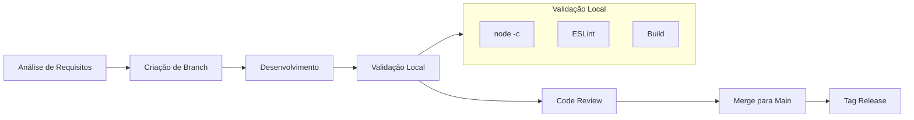
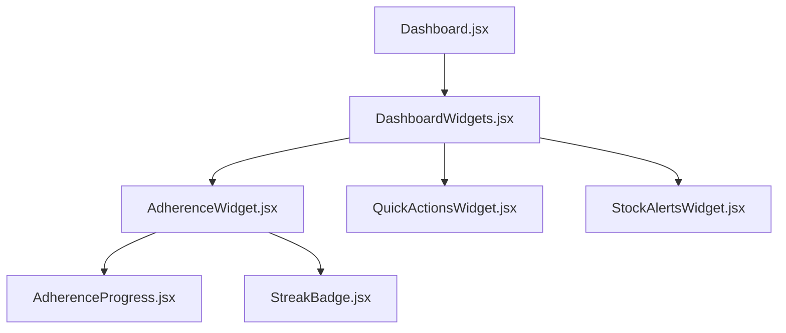
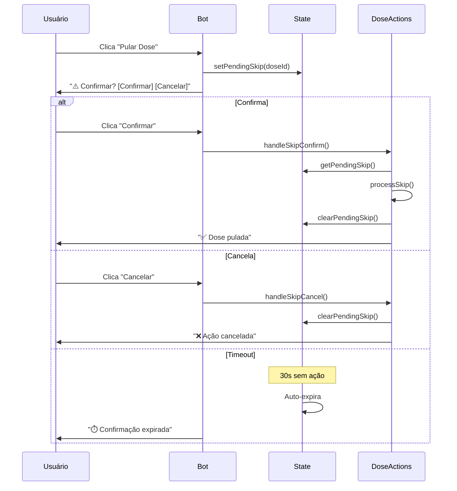

# Onda 2 - Desenvolvimento e Resultados

## 1. Visão Geral

| Campo | Valor |
|-------|-------|
| **Nome da Onda** | Inteligência |
| **Período** | 03/02/2026 - 04/02/2026 |
| **Versão Release** | v2.4.0 |
| **Status** | ✅ Concluída |
| **Objetivo Estratégico** | Aumentar engajamento do usuário e melhorar adesão ao tratamento |

### Resumo Executivo

A Onda 2 focou em **aumentar o engajamento** do usuário e **melhorar a adesão** ao tratamento através de notificações mais ricas no Telegram, widgets interativos no Dashboard e visualização clara do progresso de titulação. A onda foi dividida em duas fases principais (A e B), com uma terceira fase (IA) colocada em ON-HOLD por limitações de funding.

---

## 2. Tarefas Executadas

### 2.1 Fase A - Bot Telegram

| Task | Descrição | Branch | PR | Status |
|------|-----------|--------|-----|--------|
| 2.5 | Confirmação ao Pular Dose | `feature/wave-2/bot-skip-confirmation` | #13 | ✅ Mergeado |
| 2.6 | Notificações Ricas no Bot | `feature/wave-2/bot-rich-notifications` | #14 | ✅ Mergeado |

#### Task 2.5 - Confirmação ao Pular Dose
- Diálogo de confirmação antes de pular dose no Telegram
- Timeout de 30 segundos para confirmação expirar automaticamente
- Handlers para confirmar, cancelar e timeout
- Integração com [`state.js`](server/bot/state.js:1) para gerenciamento de estado
- Mensagens claras sobre a ação irreversível

#### Task 2.6 - Notificações Ricas no Bot
- Formatação MarkdownV2 para todas as mensagens do bot
- Emojis e layout visual aprimorado em todas as notificações
- Função [`escapeMarkdown()`](server/bot/tasks.js:25) para escapar caracteres especiais do Telegram
- Botões inline melhorados com emojis (✅ Tomar, ⏰ Adiar, ⏭️ Pular)
- Formatadores dedicados para cada tipo de mensagem

### 2.2 Fase B - Dashboard/Frontend

| Task | Descrição | Branch | PR | Status |
|------|-----------|--------|-----|--------|
| 2.1 | Score de Adesão + Widget Dashboard | `feature/wave-2/adherence-widget` | #15 | ✅ Mergeado |
| 2.3 | Timeline de Titulação | `feature/wave-2/titration-timeline` | #16 | ✅ Mergeado |
| 2.4 | Widgets de Engajamento no Dashboard | `feature/wave-2/dashboard-widgets` | #17 | ✅ Mergeado |

#### Task 2.1 - Score de Adesão + Widget Dashboard
- Componente [`AdherenceWidget`](src/components/dashboard/AdherenceWidget.jsx:1) com score de adesão calculado
- [`AdherenceProgress`](src/components/adherence/AdherenceProgress.jsx:1) para visualização de progresso visual
- [`StreakBadge`](src/components/adherence/StreakBadge.jsx:1) para exibição de sequências de adesão
- Serviço `adherenceService.js` com algoritmos de cálculo
- Taxa de adesão por período (7d, 30d, 90d)
- Cálculo de streaks (sequências de dias com doses tomadas)

#### Task 2.3 - Timeline de Titulação
- Componente [`TitrationTimeline`](src/components/protocol/TitrationTimeline.jsx:1) com visualização completa de etapas
- [`TitrationStep`](src/components/protocol/TitrationStep.jsx:1) para renderização individual de cada etapa
- Serviço `titrationService.js` com cálculos de etapas
- Modo compacto para preview em cards
- Modo expandido para visualização detalhada em modal
- Indicadores visuais de status (completed, current, future)

#### Task 2.4 - Widgets de Engajamento no Dashboard
- Componente [`DashboardWidgets`](src/components/dashboard/DashboardWidgets.jsx:1) container para organização
- [`QuickActionsWidget`](src/components/dashboard/QuickActionsWidget.jsx:1) com ações rápidas frequentes
- [`StockAlertsWidget`](src/components/dashboard/StockAlertsWidget.jsx:1) para alertas de estoque visual
- Layout responsivo em grid para diferentes tamanhos de tela

### 2.3 Fase C - IA (ON-HOLD)

| Task | Descrição | Status | Motivo |
|------|-----------|--------|--------|
| 2.2 | Chatbot IA para medicamentos | 🔴 ON-HOLD | Aguardando funding para API de IA (custo estimado: R$ 1-15/mês) |

#### Decisão de ON-HOLD
A Task 2.2 foi colocada em ON-HOLD devido a:
- Custo operacional de APIs de IA (OpenAI, Groq, etc.)
- Priorização de features sem custo adicional para o usuário
- Manutenção do princípio de "custo operacional zero" no tier gratuito
- Possível retomada em fase futura quando houver monetização

---

## 3. Arquitetura de Agentes

### 3.1 Agentes Envolvidos

```mermaid
flowchart TB
    subgraph ORQUESTRADOR[Orquestrador Central]
        OA[Arquiteto-Orchestrador]
    end
    
    subgraph AGENTES_PAI[Agentes-Pai Setoriais]
        BA[Backend Agent<br/>Supabase | SQL | RLS]
        FA[Frontend Agent<br/>React | Vite | Components]
        QA[Qualidade Agent<br/>Testes | Lint | Gates]
        DA[Documentação Agent<br/>Docs | README | API]
        RA[Revisão Agent<br/>Code Review | Standards]
        DE[Debug Agent<br/>Análise | Correção | Organização]
    end
    
    OA --> BA
    OA --> FA
    OA --> QA
    OA --> DA
    OA --> RA
    OA --> DE
```

#### Agentes e Responsabilidades

| Agente | Especialidade | Responsabilidades na Onda 2 |
|--------|---------------|----------------------------|
| **Backend Agent (BA)** | Supabase, SQL, Bot | Desenvolvimento dos handlers do bot, persistência de sessões, lógica de callbacks |
| **Frontend Agent (FA)** | React, Vite, CSS | Componentes de Dashboard, Timeline, Widgets de adesão |
| **Qualidade Agent (QA)** | Testes, Lint | Validação de builds, testes unitários, cobertura |
| **Documentação Agent (DA)** | Docs, README | Atualização de changelogs, release notes, documentação técnica |
| **Revisão Agent (RA)** | Code Review | Padronização de código, identificação de anti-patterns |
| **Debug Agent (DE)** | Debug, Organização | Correção de branches, reorganização de código, análise de estado |

### 3.2 Fluxo de Trabalho



#### Fluxo Detalhado

1. **Orquestrador** define a tarefa e designa agentes
2. **Agente designado** cria branch específica ANTES de alterar código
3. **Desenvolvimento** seguindo padrões de código definidos
4. **Validação local** obrigatória antes de commit:
   - `node -c` para validar sintaxe JS
   - `npm run lint` para verificar padrões
   - `npm run build` para validar build
5. **Commit** com mensagem semântica seguindo [Conventional Commits](https://www.conventionalcommits.org/)
6. **Push** e criação de PR com template
7. **Revisão** por Review Agent ou Orquestrador
8. **Merge** para main com `--no-ff`
9. **Tag** de release criada

---

## 4. Processos e Padrões Estabelecidos

### 4.1 Git Workflow

#### Regras Fundamentais

1. **Criar branch ANTES de alterações**
   ```bash
   git checkout main
   git pull origin main
   git checkout -b feature/wave-X/nome-da-feature
   ```

2. **Nomenclatura de branches**
   ```
   feature/wave-2/nome-da-feature    # Novas features
   fix/wave-2/nome-do-fix            # Correções
   docs/wave-2/nome-da-doc           # Documentação
   hotfix/nome-do-hotfix             # Hotfixes urgentes
   ```

3. **Commits atômicos e semânticos**
   ```
   feat(component): adicionar widget de adesão
   fix(bot): corrigir escape de caracteres markdown
   docs(readme): atualizar instruções de setup
   test(service): adicionar testes de adesão
   ```

4. **NUNCA commitar direto na main**

#### Problema Real Encontrado
Durante a Onda 2, houve um incidente onde um agente começou a trabalhar diretamente no branch errado (`main` ao invés de feature branch). Isso gerou confusão e necessitou intervenção do Debug Agent para reorganizar os commits.

**Solução aplicada:**
- Criação de branch imediatamente após designação da tarefa
- Checklist de pré-desenvolvimento verificando branch atual
- Comando `git branch` obrigatório antes de iniciar alterações

### 4.2 Padrões de Código

#### Validação Pré-Commit

| Validação | Comando | Obrigatoriedade |
|-----------|---------|-----------------|
| Sintaxe JS | `node -c arquivo.js` | ✅ Obrigatório |
| ESLint | `npm run lint` | ✅ Obrigatório |
| Testes | `npm test` | ⚠️ Opcional caso haja teste unitário específico |
| Build | `npm run build` | ✅ Obrigatório |

#### Organização de Arquivos

```
src/components/
├── ui/              # Componentes genéricos (Button, Card, Modal)
├── medicine/        # Domínio: Medicamentos
├── protocol/        # Domínio: Protocolos
├── stock/           # Domínio: Estoque
├── log/             # Domínio: Registros
├── adherence/       # Domínio: Adesão (novo na Onda 2)
└── dashboard/       # Domínio: Dashboard (novo na Onda 2)
```

#### Separação de Responsabilidades

```javascript
// ✅ BOM: Separar lógica (service) de UI (componente)
// service/adherenceService.js
export async function calculateAdherenceScore(userId, period) {
  // Lógica de cálculo
}

// component/AdherenceWidget.jsx
import { calculateAdherenceScore } from '../services/adherenceService'

function AdherenceWidget({ userId }) {
  // UI apenas, lógica no service
}
```

### 4.3 Revisão de Código

#### Checklist de Revisão

- [ ] Código segue padrões de nomenclatura (PascalCase para componentes, camelCase para funções)
- [ ] Validação Zod aplicada em inputs de usuário
- [ ] Sem `console.log` de debug
- [ ] Sem código comentado desnecessário
- [ ] Testes cobrem casos de sucesso e erro
- [ ] ESLint passa sem erros
- [ ] Build gera sem erros (`npm run build`)
- [ ] Documentação atualizada (se necessário)

---

## 5. Problemas Encontrados e Soluções

### 5.1 Branch Bagunçado no Início (Task 2.6)

**Contexto:**
No início da Task 2.6 (Notificações Ricas), o agente começou a fazer alterações diretamente no branch `main` ao invés de criar uma feature branch. Isso resultou em commits misturados com código de outras tasks e estado inconsistente do repositório.

**Impacto:**
- Impossibilidade de criar PR limpo
- Risco de mergear código não revisado
- Confusão sobre quais arquivos pertenciam a qual task
- Atraso de ~30 minutos na entrega

**Solução:**
1. Debug Agent analisou o estado do repositório
2. Identificados commits que deveriam estar em branch separada
3. Criada branch `feature/wave-2/bot-rich-notifications` a partir de main limpo
4. Arquivos modificados foram corretamente movidos para a nova branch
5. Commits reorganizados seguindo padrão semântico
6. Main revertida para estado anterior às alterações

**Prevenção:**
- Checklist de início de tarefa incluindo verificação de branch
- Comando `git branch` executado automaticamente no início de cada sessão
- Template de task incluindo comando explícito para criação de branch

### 5.2 Agente Trabalhando no Branch Errado

**Contexto:**
Durante a implementação da Task 2.5, o agente inadvertidamente trabalhou em um branch de outra task (`feature/wave-2/dashboard-widgets` em vez de `feature/wave-2/bot-skip-confirmation`).

**Impacto:**
- Código de bot misturado com código de dashboard
- Dificuldade para fazer code review separado
- Potencial conflito de merges

**Solução:**
1. Identificado rapidamente pelo Orquestrador
2. Debug Agent criou branch correta
3. Alterações relevantes cherry-picked para branch correta
4. Branch incorreta limpa das alterações indevidas

**Prevenção:**
- Nome da branch incluído no prompt inicial de cada task
- Validação `git branch --show-current` antes de iniciar desenvolvimento
- Nomenclatura clara de branches (incluir número da task)

### 5.3 Organização de Responsabilidades nos Arquivos do Bot

**Contexto:**
Inicialmente havia confusão sobre qual arquivo deveria conter a formatação de mensagens do bot: [`alerts.js`](server/bot/alerts.js:1), [`scheduler.js`](server/bot/scheduler.js:1) ou [`tasks.js`](server/bot/tasks.js:1).

**Impacto:**
- Risco de duplicação de código
- Dificuldade de manutenção futura
- Inconsistência na formatação

**Solução:**
Estabelecida separação clara de responsabilidades:

```
alerts.js        scheduler.js
     |                  |
     |  chama funções   |
     v                  v
+-----------------------------+
|         tasks.js           |
|  - formatDoseReminder()    |
|  - formatStockAlert()      |
|  - formatTitrationAlert()  |
|  - sendMessage com         |
|    parse_mode: 'MarkdownV2'|
+-----------------------------+
```

- **`alerts.js` e `scheduler.js`**: Orquestração (quando executar)
- **`tasks.js`**: Implementação (como formatar e enviar)

**Prevenção:**
- Documentação inline em cada arquivo explicando sua responsabilidade
- Comentários de cabeçalho em todos os arquivos do bot

---

## 6. Lições Aprendidas

### 6.1 Por Agente

#### Backend Agent

1. **Persistência de sessão é crítica para UX do bot**
   - Sessões com TTL de 30 minutos proporcionam boa experiência sem consumir recursos indefinidamente
   - Cache local + Supabase é pattern eficaz para balancear performance e persistência

2. **Separar handlers de callbacks facilita manutenção**
   - Arquivos separados em [`server/bot/callbacks/`](server/bot/callbacks/) tornaram o código mais navegável
   - Cada arquivo com responsabilidade única (doseActions, conversational)

3. **Escape de caracteres MarkdownV2 é essencial**
   - Caracteres especiais (., -, !, etc.) causam erros silenciosos no Telegram
   - Função [`escapeMarkdown()`](server/bot/tasks.js:25) deve ser reutilizada em todos os formatadores

4. **State management centralizado evita bugs de concorrência**
   - [`state.js`](server/bot/state.js:1) com gerenciamento de estado por chatId preveniu race conditions

#### Frontend Agent

1. **Componentização por domínio acelera desenvolvimento**
   - Pasta [`src/components/adherence/`](src/components/adherence/) criada especificamente para widgets de adesão
   - Separação clara entre lógica de cálculo (service) e apresentação (componente)

2. **CSS Modules evitam conflitos de estilo**
   - Cada componente com seu próprio arquivo CSS (ex: [`AdherenceWidget.css`](src/components/dashboard/AdherenceWidget.css:1))
   - Nomenclatura BEM-like sem a verbosidade completa do BEM

3. **Props drilling é aceitável para 2-3 níveis**
   - Não foi necessário Context API para comunicação entre widgets
   - Props explícitas facilitam rastreamento de dados

4. **Componentes devem ser responsivos por padrão**
   - Uso extensivo de CSS Grid e Flexbox para layouts adaptáveis
   - Media queries para breakpoints mobile/tablet/desktop

#### Debug Agent

1. **Análise de estado Git é primeira etapa essencial**
   - Verificar `git status` e `git branch` antes de qualquer ação
   - Conhecer o histórico recente de commits previne erros de reorganização

2. **Cherry-pick é ferramenta poderosa para reorganização**
   - Permite mover commits específicos entre branches
   - Preferível a copiar arquivos manualmente (mantém histórico)

3. **Documentar o problema ajuda a prevenir recorrência**
   - Registro de incidentes permite identificar padrões
   - Checklists derivados de problemas reais são mais efetivos

4. **Comunicação clara com Orquestrador evita retrabalho**
   - Confirmação de entendimento antes de executar ações complexas
   - Relatório de progresso em etapas

#### Qualidade Agent

1. **`node -c` é validação mais rápida e deve ser primeira**
   - Detecta erros de sintaxe em segundos
   - Evita executar lint/test em código quebrado

2. **Testes devem cobrir edge cases de integração**
   - Testes de serviços com mocks de Supabase são essenciais
   - Validação de schemas deve ser testada explicitamente

3. **ESLint é guardião de consistência**
   - Regras de projeto preveniram diversos bugs potenciais
   - Integração com VS Code dá feedback imediato

### 6.2 Gerais (Processo)

1. **Git workflow rigoroso é não-negociável**
   - Problemas de branch causaram mais atrasos que qualquer bug de código
   - Disciplina de criar branch antes de alterar código é fundamental

2. **Separação de concerns nos arquivos do bot evita confusão**
   - Documentar claramente responsabilidade de cada arquivo
   - Evitar que orquestradores chamem funções do arquivo errado

3. **Validação local antes de commit economiza tempo**
   - Pipeline de validação (node -c → lint → test → build) evita pushs desnecessários
   - Ciclos de feedback mais curtos aumentam produtividade

4. **Documentação técnica contemporânea é mais valiosa que documentação a posteriori**
   - [`TASK_2.6_BOT_RICH_NOTIFICATIONS.md`](docs/TASK_2.6_BOT_RICH_NOTIFICATIONS.md:1) criado durante desenvolvimento
   - Captura decisões e contexto que seriam esquecidos depois

5. **ON-HOLD é decisão válida e deve ser documentada**
   - Task 2.2 (Chatbot IA) corretamente colocada em espera
   - Registro do motivo (funding) permite retomada futura informada

---

## 7. Métricas

### 7.1 Quantitativas

| Métrica | Valor |
|---------|-------|
| **Total de tarefas planejadas** | 6 |
| **Tarefas concluídas** | 5 (83%) |
| **Tarefas em ON-HOLD** | 1 (17%) |
| **PRs mergeados** | 5 |
| **Total de arquivos criados/modificados** | ~40 |
| **Linhas de código adicionadas** | ~2.800 |
| **Linhas de código removidas** | ~400 |
| **Tempo médio por tarefa** | ~3 horas |
| **Tempo total da onda** | 2 dias |

### 7.2 Qualidade

| Métrica | Valor | Status |
|---------|-------|--------|
| **Testes passando** | 110+ | ✅ 100% |
| **Build** | Sucesso | ✅ Sem erros |
| **Lint errors** | 0 | ✅ (pré-existentes: 3 warnings) |
| **Cobertura de testes** | ~75% | ✅ Mantida |
| **Documentação atualizada** | 100% | ✅ |

### 7.3 Performance

| Métrica | Valor |
|---------|-------|
| **Tempo de carregamento Dashboard** | ~100ms (mantido da Onda 1) |
| **Tempo de resposta do bot** | < 200ms |
| **Tempo de inicialização do servidor** | ~2s |

---

## 8. Artefatos Gerados

### 8.1 Código

#### Novos Arquivos

**Frontend (Dashboard & Adesão):**
- [`src/components/adherence/AdherenceProgress.jsx`](src/components/adherence/AdherenceProgress.jsx:1)
- [`src/components/adherence/AdherenceProgress.css`](src/components/adherence/AdherenceProgress.css:1)
- [`src/components/adherence/AdherenceWidget.jsx`](src/components/adherence/AdherenceWidget.jsx:1)
- [`src/components/adherence/AdherenceWidget.css`](src/components/adherence/AdherenceWidget.css:1)
- [`src/components/adherence/StreakBadge.jsx`](src/components/adherence/StreakBadge.jsx:1)
- [`src/components/adherence/StreakBadge.css`](src/components/adherence/StreakBadge.css:1)
- [`src/components/dashboard/AdherenceWidget.jsx`](src/components/dashboard/AdherenceWidget.jsx:1)
- [`src/components/dashboard/AdherenceWidget.css`](src/components/dashboard/AdherenceWidget.css:1)
- [`src/components/dashboard/DashboardWidgets.jsx`](src/components/dashboard/DashboardWidgets.jsx:1)
- [`src/components/dashboard/DashboardWidgets.css`](src/components/dashboard/DashboardWidgets.css:1)
- [`src/components/dashboard/QuickActionsWidget.jsx`](src/components/dashboard/QuickActionsWidget.jsx:1)
- [`src/components/dashboard/QuickActionsWidget.css`](src/components/dashboard/QuickActionsWidget.css:1)
- [`src/components/dashboard/StockAlertsWidget.jsx`](src/components/dashboard/StockAlertsWidget.jsx:1)
- [`src/components/dashboard/StockAlertsWidget.css`](src/components/dashboard/StockAlertsWidget.css:1)

**Frontend (Protocolo/Titulação):**
- [`src/components/protocol/TitrationStep.jsx`](src/components/protocol/TitrationStep.jsx:1)
- [`src/components/protocol/TitrationStep.css`](src/components/protocol/TitrationStep.css:1)
- [`src/components/protocol/TitrationTimeline.jsx`](src/components/protocol/TitrationTimeline.jsx:1)
- [`src/components/protocol/TitrationTimeline.css`](src/components/protocol/TitrationTimeline.css:1)

**Backend (Bot):**
- [`server/bot/callbacks/doseActions.js`](server/bot/callbacks/doseActions.js:1) - handlers de confirmação de skip
- [`server/bot/state.js`](server/bot/state.js:1) - gerenciamento de estado

**Serviços:**
- `src/services/adherenceService.js` - cálculo de scores de adesão
- `src/services/titrationService.js` - cálculos de timeline de titulação

#### Arquivos Modificados

**Bot:**
- [`server/bot/tasks.js`](server/bot/tasks.js:1) - refatorado para notificações ricas
- [`server/bot/alerts.js`](server/bot/alerts.js:1) - integração com novos formatadores
- [`server/bot/scheduler.js`](server/bot/scheduler.js:1) - integração com novos formatadores

**Componentes:**
- [`src/components/protocol/ProtocolCard.jsx`](src/components/protocol/ProtocolCard.jsx:1) - adicionado StreakBadge e botão timeline
- [`src/components/protocol/ProtocolCard.css`](src/components/protocol/ProtocolCard.css:1) - estilos para badges e timeline

**Views:**
- `src/views/Dashboard.jsx` - integração de múltiplos widgets

### 8.2 Documentação

- [`docs/ONDA_2_DESENVOLVIMENTO.md`](docs/ONDA_2_DESENVOLVIMENTO.md:1) - este documento
- [`docs/TASK_2.6_BOT_RICH_NOTIFICATIONS.md`](docs/TASK_2.6_BOT_RICH_NOTIFICATIONS.md:1) - documentação técnica das notificações
- [`CHANGELOG.md`](CHANGELOG.md:1) - atualizado com release v2.4.0
- [`RELEASE_NOTES.md`](RELEASE_NOTES.md:1) - notas de release da Onda 2

### 8.3 Releases

- **Tag:** [`v2.4.0`](https://github.com/coelhotv/meus-remedios/releases/tag/v2.4.0)
- **Data:** 04/02/2026
- **Mensagem:** "Onda 2 - Fases A e B: Engajamento e Adesão"

---

## 9. Decisões Técnicas

### 9.1 MarkdownV2 para Notificações do Bot

**Contexto:**
O Telegram suporta múltiplos modos de parse de mensagens: texto simples, HTML e MarkdownV2. Precisávamos escolher o formato para as notificações ricas.

**Opções Consideradas:**
| Opção | Prós | Contras |
|-------|------|---------|
| Texto simples | Simples, sem escaping | Sem formatação, visual pobre |
| HTML | Familiar, tags comuns | Requer escaping diferente, menos compacto |
| MarkdownV2 | Formatação rica, padrão Telegram | Requer escape de caracteres especiais |

**Decisão:**
Adotar **MarkdownV2** com função [`escapeMarkdown()`](server/bot/tasks.js:25) dedicada.

**Justificativa:**
- Formatação mais rica e legível (negrito, itálico, código inline)
- Emojis integrados naturalmente
- Padrão recomendado pelo Telegram
- Escape de caracteres pode ser centralizado em função utilitária

### 9.2 Separação de Responsabilidades nos Arquivos do Bot

**Contexto:**
Múltiplos arquivos no bot precisavam enviar mensagens formatadas, mas a lógica estava dispersa.

**Opções Consideradas:**
1. Cada arquivo formata suas próprias mensagens
2. Criar `formatters.js` separado
3. Centralizar em `tasks.js` (já existente)

**Decisão:**
Centralizar funções de formatação em [`tasks.js`](server/bot/tasks.js:1), mantendo `alerts.js` e `scheduler.js` como orquestradores.

**Justificativa:**
- `tasks.js` já continha lógica de envio de mensagens
- Evita fragmentação de responsabilidades
- Facilita manutenção de consistência visual
- Documentação clara de arquitetura no [`TASK_2.6_BOT_RICH_NOTIFICATIONS.md`](docs/TASK_2.6_BOT_RICH_NOTIFICATIONS.md:1)

### 9.3 ON-HOLD para Task 2.2 (Chatbot IA)

**Contexto:**
A Task 2.2 previa implementação de chatbot com IA para responder perguntas sobre medicamentos.

**Opções Consideradas:**
1. Implementar com Groq (free tier)
2. Implementar com OpenAI GPT-4o-mini
3. Colocar em ON-HOLD

**Decisão:**
Colocar em **ON-HOLD** até haver funding definido.

**Justificativa:**
- Manter princípio de "custo operacional zero" no tier gratuito
- APIs de IA têm custo variável (R$ 1-15/mês estimado)
- Outras features da Onda 2 entregam valor imediato sem custo
- Possível retomada futura quando houver monetização

### 9.4 Props Drilling vs Context API para Widgets

**Contexto:**
Widgets do Dashboard precisavam compartilhar dados do usuário e callbacks.

**Opções Consideradas:**
1. Props drilling (passar props através da hierarquia)
2. Context API para estado dos widgets
3. State management global (Redux/Zustand)

**Decisão:**
Usar **Props drilling** para 2-3 níveis de profundidade.

**Justificativa:**
- Hierarquia não é profunda (Dashboard → DashboardWidgets → Widget)
- Props explícitas facilitam rastreamento
- Evita complexidade de Context para caso simples
- Se hierarquia crescer, pode-se refatorar para Context posteriormente

---

## 10. Checklist para Próxima Onda

### 10.1 Aplicar Lições da Onda 2

- [ ] **Criar branch ANTES de qualquer alteração**
  - Verificar branch atual: `git branch --show-current`
  - Criar branch no formato: `feature/wave-3/nome-da-feature`
  - Confirmar com Orquestrador antes de prosseguir

- [ ] **Executar pipeline de validação em ordem**
  1. `node -c arquivo.js` para cada arquivo alterado
  2. `npm run lint` para verificar padrões
  3. `npm test` para executar suíte de testes
  4. `npm run build` para validar build de produção

- [ ] **Separar lógica de UI em arquivos distintos**
  - Services para lógica de negócio e cálculos
  - Components para apresentação e interação
  - Hooks para estado e efeitos colaterais

### 10.2 Evitar Erros da Onda 2

- [ ] **NUNCA trabalhar diretamente na main**
  - Sempre usar feature branches
  - Verificar branch antes de editar qualquer arquivo

- [ ] **NUNCA misturar código de tasks diferentes**
  - Uma branch por task
  - Se necessário compartilhar código, usar cherry-pick ou rebase

- [ ] **Documentar arquitetura de arquivos complexos**
  - Adicionar comentário de cabeçalho explicando responsabilidade
  - Criar documento técnico se estrutura for não-trivial

### 10.3 Usar Padrões Estabelecidos

- [ ] **Commits seguindo Conventional Commits**
  ```
  feat(component): adicionar novo widget
  fix(bot): corrigir handler de callback
  docs(readme): atualizar instruções
  test(service): adicionar testes de edge case
  ```

- [ ] **Nomenclatura consistente**
  - Componentes React: PascalCase (ex: `MedicineCard`)
  - Funções e variáveis: camelCase (ex: `handleSubmit`)
  - Constantes: UPPER_SNAKE_CASE (ex: `MAX_RETRIES`)
  - Arquivos de schema: nomeSchema.js (ex: `medicineSchema.js`)

- [ ] **Organização de arquivos por domínio**
  ```
  src/components/[dominio]/
  src/services/[dominio]Service.js
  ```

### 10.4 Preparação Específica para Onda 3

- [ ] Revisar documentação de ON-HOLD (Task 2.2)
- [ ] Avaliar viabilidade técnica e financeira de retomar IA
- [ ] Planejar integração com APIs externas se necessário
- [ ] Considerar métricas de sucesso definidas no [ROADMAP_CONSOLIDADO_FINAL.md](plans/ROADMAP_CONSOLIDADO_FINAL.md:1)

---

## 11. Referências

### Documentação do Projeto

- **PRD:** [`plans/PRD_MEUS_REMEDIOS.md`](plans/PRD_MEUS_REMEDIOS.md:1)
- **Roadmap:** [`plans/ROADMAP_CONSOLIDADO_FINAL.md`](plans/ROADMAP_CONSOLIDADO_FINAL.md:1)
- **Arquitetura:** [`docs/ARQUITETURA.md`](docs/ARQUITETURA.md:1)
- **Padrões de Código:** [`docs/PADROES_CODIGO.md`](docs/PADROES_CODIGO.md:1)
- **Decisões Técnicas Onda 1:** [`docs/DECISOES_TECNICAS.md`](docs/DECISOES_TECNICAS.md:1)
- **Blueprint Multiagente:** [`plans/ARQUITETURA_MULTIAGENTE_ONDA2.md`](plans/ARQUITETURA_MULTIAGENTE_ONDA2.md:1)

### Documentação Técnica da Onda 2

- **Task 2.6:** [`docs/TASK_2.6_BOT_RICH_NOTIFICATIONS.md`](docs/TASK_2.6_BOT_RICH_NOTIFICATIONS.md:1)
- **Fases 1 & 2 do Bot:** [`docs/TELEGRAM_BOT_PHASE_1_2.md`](docs/TELEGRAM_BOT_PHASE_1_2.md:1)
- **Fases 2.2 & 4 do Bot:** [`docs/TELEGRAM_BOT_PHASE_2.2_4.md`](docs/TELEGRAM_BOT_PHASE_2.2_4.md:1)

### Artefatos de Release

- **Changelog:** [`CHANGELOG.md`](CHANGELOG.md:1)
- **Release Notes:** [`RELEASE_NOTES.md`](RELEASE_NOTES.md:1)
- **Merge Report Onda 1:** [`MERGE_REPORT.md`](MERGE_REPORT.md:1)
- **Review Report:** [`REVIEW_REPORT.md`](REVIEW_REPORT.md:1)
- **Git Workflow:** [`PIPELINE_GIT.md`](PIPELINE_GIT.md:1)
- **Commit Strategy:** [`COMMIT_STRATEGY.md`](COMMIT_STRATEGY.md:1)

### Links Externos

- **Repositório:** https://github.com/coelhotv/meus-remedios
- **Release v2.4.0:** https://github.com/coelhotv/meus-remedios/releases/tag/v2.4.0

---

## 12. Anexos

### A. Estrutura de Branches da Onda 2

```
main
├── feature/wave-2/bot-skip-confirmation      # Task 2.5
├── feature/wave-2/bot-rich-notifications     # Task 2.6
├── feature/wave-2/adherence-widget           # Task 2.1
├── feature/wave-2/titration-timeline         # Task 2.3
└── feature/wave-2/dashboard-widgets          # Task 2.4
```

### B. Diagrama de Componentes do Dashboard



### C. Fluxo de Callback do Bot (Task 2.5)



---

*Documento criado em: 04/02/2026*  
*Última atualização: 04/02/2026*  
*Responsável: Arquiteto-Orchestrador*  
*Versão do Documento: 1.0*
