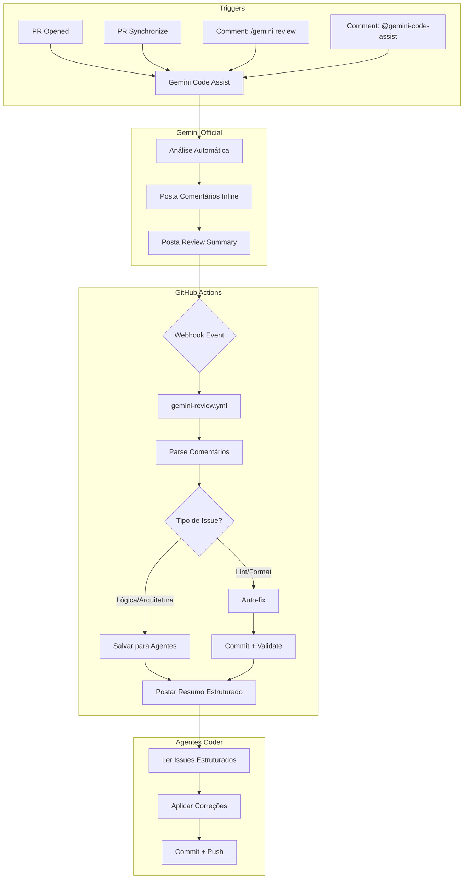

# Plano de Refatoração: Gemini Code Assist Integration

## 📋 Visão Geral

Este documento define o plano de ação para refatorar a integração do Gemini Code Assist, simplificando os workflows, removendo duplicações e implementando parsing efetivo dos comentários de review.

---

## 🎯 Objetivos

1. **Simplificar** - Reduzir de 3 workflows para 1 workflow unificado
2. **Integrar** - Parsing efetivo dos comentários do @gemini-code-assist
3. **Otimizar** - Remover tempo de espera fixo, usar webhook/polling
4. **Economizar** - Reduzir minutos de GitHub Actions

---

## 📊 Estado Atual vs. Proposto

### Workflows Atuais (3 arquivos)

| Workflow | Problema |
|----------|----------|
| `pr-auto-trigger.yml` | Apenas posta mensagem, não invoca Gemini |
| `gemini-review.yml` | Busca comentários mas não processa |
| `test.yml` | Duplica validação dos outros |

### Workflows Propostos (2 arquivos)

| Workflow | Função |
|----------|--------|
| `test.yml` | Validação padrão (lint, smoke, critical, build) |
| `gemini-review.yml` | Parsing e processamento de reviews do Gemini |

---

## 🔄 Arquitetura Proposta



---

## 📝 Mudanças Detalhadas

### 1. Remover `pr-auto-trigger.yml`

**Justificativa:**
- Não invoca o Gemini de fato
- Apenas posta mensagem "suja" na timeline
- O Gemini Code Assist já tem trigger automático configurado

**Ação:** Deletar arquivo

---

### 2. Atualizar `.gemini/config.yaml`

**Adicionar:**

```yaml
code_review:
  comment_severity_threshold: MEDIUM
  max_review_comments: 20
  
  pull_request_opened:
    help: true
    summary: true
    code_review: true
    include_drafts: false
  
  # NOVO: Re-review em commits novos
  pull_request_synchronize:
    code_review: true
    summary: true
  
  # NOVO: Filtros de path
  excluded_paths:
    - "docs/archive/**"
    - "**/*.md"
    - "**/dist/**"
    - "**/node_modules/**"
  
  # NOVO: Foco em áreas críticas
  included_paths:
    - "src/**"
    - "server/**"
    - "api/**"

memory_config:
  disabled: false
```

---

### 3. Refatorar `gemini-review.yml`

#### 3.1 Novos Triggers

```yaml
on:
  # Trigger quando Gemini posta review
  pull_request_review:
    types: [submitted]
  
  # Trigger quando Gemini comenta (inline comments)
  issue_comment:
    types: [created]
  
  # Manual
  workflow_dispatch:
    inputs:
      pr_number:
        description: 'PR Number'
        required: true
        type: string
```

#### 3.2 Detecção de Review do Gemini

```yaml
jobs:
  detect-gemini-review:
    name: Detect Gemini Review
    runs-on: ubuntu-latest
    if: |
      (github.event_name == 'pull_request_review' && 
       github.event.review.user.login == 'gemini-code-assist[bot]') ||
      (github.event_name == 'issue_comment' && 
       github.event.comment.user.login == 'gemini-code-assist[bot]') ||
      github.event_name == 'workflow_dispatch'
```

#### 3.3 Parsing de Comentários

**Estrutura de um comentário do Gemini:**

```javascript
// Exemplo de comentário inline do Gemini
{
  "path": "src/services/api/medicineService.js",
  "line": 42,
  "body": "## 🔍 Review Comment\n\n**Issue:** Missing error handling\n\n**Suggestion:**\n```javascript\ntry {\n  const result = await supabase.from('medicamentos').select('*')\n  if (result.error) throw result.error\n} catch (error) {\n  logger.error('Failed to fetch medicines', error)\n  throw error\n}\n```\n\n**Severity:** MEDIUM",
  "user": { "login": "gemini-code-assist[bot]", "type": "Bot" }
}
```

**Parser Proposto (Código Real a Implementar):**

```javascript
// .github/scripts/parse-gemini-comments.js
/**
 * Parseia um comentário do Gemini Code Assist
 * Formato real: "medium priority", "high priority", "critical"
 * (configurado com comment_severity_threshold: MEDIUM)
 * 
 * @param {Object} comment - Comentário do GitHub
 * @returns {Object} Dados estruturados do comentário
 */
function parseGeminiComment(comment) {
  const body = comment.body || '';
  
  // Gemini usa "priority" não "severity"
  const priorityMatch = body.match(/\*\*priority\*\*:\s*(\w+)/i);
  const issueMatch = body.match(/\*\*Issue:\*\*\s*(.+?)(?=\n|$)/i);
  const suggestionMatch = body.match(/```[\w]*\n([\s\S]*?)```/);
  
  return {
    id: comment.id,
    file: comment.path,
    line: comment.line || comment.original_line,
    issue: issueMatch ? issueMatch[1].trim() : extractIssueFromText(body),
    suggestion: suggestionMatch ? suggestionMatch[1].trim() : null,
    priority: normalizePriority(priorityMatch ? priorityMatch[1] : 'medium'),
    raw: body,
    url: comment.html_url
  };
}

/**
 * Normaliza prioridade do Gemini para formato padrão
 * Gemini usa: "medium priority", "high priority", "critical"
 */
function normalizePriority(priority) {
  const p = priority.toLowerCase().trim();
  if (p === 'critical') return 'CRITICAL';
  if (p === 'high') return 'HIGH';
  if (p === 'medium') return 'MEDIUM';
  return 'MEDIUM'; // default
}

/**
 * Extrai descrição do issue do texto do comentário
 */
function extractIssueFromText(body) {
  // Remove código e markdown para extrair texto principal
  const lines = body.split('\n')
    .filter(l => !l.startsWith('```') && !l.startsWith('#'))
    .map(l => l.trim())
    .filter(l => l.length > 0);
  return lines[0] || 'Issue não identificado';
}

/**
 * Categoriza issues baseado na prioridade real do Gemini
 * 
 * @param {Array} parsedComments - Comentários parseados
 * @returns {Object} Issues categorizados
 */
function categorizeIssues(parsedComments) {
  return {
    // Auto-fixable: apenas issues simples de estilo/formatação
    autoFixable: parsedComments.filter(c => 
      c.priority === 'MEDIUM' && 
      (c.issue?.toLowerCase().includes('formatting') ||
       c.issue?.toLowerCase().includes('style') ||
       c.issue?.toLowerCase().includes('unused') ||
       c.issue?.toLowerCase().includes('naming'))
    ),
    
    // Needs Agent: issues de lógica/arquitetura que requerem intervenção
    needsAgent: parsedComments.filter(c => 
      c.priority === 'HIGH' ||
      (c.priority === 'MEDIUM' && !isAutoFixable(c))
    ),
    
    // Critical: issues de segurança ou críticos
    critical: parsedComments.filter(c => 
      c.priority === 'CRITICAL' || 
      c.issue?.toLowerCase().includes('security') ||
      c.issue?.toLowerCase().includes('vulnerability') ||
      c.issue?.toLowerCase().includes('injection')
    )
  };
}

/**
 * Verifica se um issue é auto-fixable
 */
function isAutoFixable(comment) {
  const autoFixableKeywords = ['formatting', 'style', 'unused', 'naming', 'whitespace', 'indentation'];
  const issue = comment.issue?.toLowerCase() || '';
  return autoFixableKeywords.some(kw => issue.includes(kw));
}

module.exports = { 
  parseGeminiComment, 
  categorizeIssues,
  normalizePriority,
  isAutoFixable 
};
```

---

### 4. Mecismo de Webhook/Polling

#### Opção A: Webhook (Recomendado)

O GitHub dispara eventos `pull_request_review` quando um review é submetido. O Gemini Code Assist usa essa API para postar reviews.

```yaml
on:
  pull_request_review:
    types: [submitted]
```

**Vantagens:**
- Tempo real (sem espera)
- Nativo do GitHub
- Confiável

#### Opção B: Polling com Timeout

Se o webhook não funcionar como esperado:

```yaml
jobs:
  poll-gemini-review:
    runs-on: ubuntu-latest
    timeout-minutes: 10
    steps:
      - name: Poll for Gemini Review
        uses: actions/github-script@v7
        with:
          script: |
            const maxAttempts = 20; // 20 * 30s = 10 min
            const interval = 30000; // 30 seconds
            
            for (let i = 0; i < maxAttempts; i++) {
              const { data: reviews } = await github.rest.pulls.listReviews({
                owner: context.repo.owner,
                repo: context.repo.repo,
                pull_number: context.payload.pull_request.number
              });
              
              const geminiReview = reviews.find(r => 
                r.user.login === 'gemini-code-assist[bot]' &&
                r.commit_id === context.payload.pull_request.head.sha
              );
              
              if (geminiReview) {
                console.log('Gemini review found!');
                core.setOutput('review_found', 'true');
                core.setOutput('review_id', geminiReview.id);
                return;
              }
              
              await new Promise(resolve => setTimeout(resolve, interval));
            }
            
            core.setOutput('review_found', 'false');
```

---

### 5. Output Estruturado para Agentes Coder

**Formato de Output:**

```json
{
  "pr_number": 42,
  "review_id": 12345,
  "timestamp": "2026-02-18T23:45:00Z",
  "summary": {
    "total_issues": 5,
    "auto_fixable": 2,
    "needs_agent": 2,
    "critical": 1
  },
  "issues": [
    {
      "id": 1,
      "file": "src/services/api/medicineService.js",
      "line": 42,
      "severity": "MEDIUM",
      "issue": "Missing error handling",
      "suggestion": "try { ... } catch (error) { ... }",
      "auto_fixable": false,
      "category": "error_handling"
    }
  ],
  "auto_fix_commands": [
    "npm run lint -- --fix",
    "npx prettier --write src/services/api/medicineService.js"
  ]
}
```

**Arquivo de Output:**

```yaml
- name: Save Structured Output
  run: |
    mkdir -p .gemini-output
    echo '${{ steps.parse.outputs.structured }}' > .gemini-output/review-${{ steps.context.outputs.pr_number }}.json

- name: Upload Output
  uses: actions/upload-artifact@v4
  with:
    name: gemini-review-output
    path: .gemini-output/
    retention-days: 7
```

---

## 📁 Arquivos a Modificar/Criar

### Deletar

| Arquivo | Motivo |
|---------|--------|
| `.github/workflows/pr-auto-trigger.yml` | Redundante, não invoca Gemini |

### Modificar

| Arquivo | Mudanças |
|---------|----------|
| `.gemini/config.yaml` | Adicionar `pull_request_synchronize`, filtros |
| `.github/workflows/gemini-review.yml` | Refatorar completamente |

### Criar

| Arquivo | Propósito |
|---------|-----------|
| `.github/scripts/parse-gemini-comments.js` | Parser de comentários |
| `.github/scripts/categorize-issues.js` | Categorizador de issues |

---

## 🧪 Plano de Testes e Validações

### Visão Geral

Este plano será executado pelo agente após a implementação, com suporte do usuário para tarefas manuais quando necessário.

---

### Teste 1: Validação de Sintaxe (Automatizado)

**Objetivo:** Garantir que os workflows têm sintaxe YAML válida

**Comando:**
```bash
# Validar sintaxe YAML
npm run lint

# Validar workflows com actionlint (se disponível)
which actionlint && actionlint .github/workflows/*.yml
```

**Critério de Sucesso:** Sem erros de sintaxe

---

### Teste 2: Trigger Automático do Gemini (Manual + Automatizado)

**Objetivo:** Verificar se o Gemini Code Assist é invocado automaticamente

**Passos Manuais (Usuário):**
1. Criar branch de teste: `git checkout -b test/gemini-integration-YYYYMMDD`
2. Fazer uma mudança simples (ex: adicionar comentário)
3. Push e criar PR: `gh pr create --title "test: gemini integration" --body "Testing Gemini auto-trigger"`
4. Aguardar 1-2 minutos

**Verificação Automatizada (Agente):**
```bash
# Verificar se PR foi criado
gh pr list --head test/gemini-integration-YYYYMMDD

# Verificar se Gemini comentou
gh pr view <PR_NUMBER> --comments | grep -i "gemini"
```

**Critério de Sucesso:** Gemini Code Assist postou review automaticamente

---

### Teste 3: Parsing de Comentários (Automatizado)

**Objetivo:** Validar se o parser extrai corretamente os dados

**Setup:**
```bash
# Criar arquivo de teste com comentário simulado
cat > .github/scripts/__tests__/test-comment.json << 'EOF'
{
  "id": 12345,
  "path": "src/services/api/medicineService.js",
  "line": 42,
  "body": "**priority**: high\n\n**Issue:** Missing error handling\n\n**Suggestion:**\n```javascript\ntry {\n  const result = await supabase.from('medicamentos').select('*')\n} catch (error) {\n  logger.error(error)\n}\n```",
  "user": { "login": "gemini-code-assist[bot]", "type": "Bot" }
}
EOF
```

**Execução:**
```bash
# Rodar testes do parser
node .github/scripts/__tests__/parse-gemini-comments.test.js
```

**Critério de Sucesso:**
- `priority` extraído como "HIGH"
- `issue` extraído como "Missing error handling"
- `suggestion` extraído com código correto

---

### Teste 4: Webhook Trigger (Manual + Automatizado)

**Objetivo:** Verificar se o workflow é triggerado quando Gemini posta review

**Passos Manuais (Usuário):**
1. Após Teste 2, verificar se o workflow `gemini-review.yml` foi executado
2. Acessar Actions tab no GitHub

**Verificação Automatizada (Agente):**
```bash
# Listar runs do workflow
gh run list --workflow=gemini-review.yml --limit 5

# Verificar status do último run
gh run view --log | grep -i "gemini"
```

**Critério de Sucesso:** Workflow executado após review do Gemini

---

### Teste 5: Auto-Fix (Automatizado)

**Objetivo:** Verificar se auto-fix é aplicado corretamente

**Setup:**
```bash
# Criar arquivo com lint error intencional
cat > src/test-lint-error.js << 'EOF'
const x = 1
const y=2
EOF
```

**Execução:**
```bash
# Commit e push
git add src/test-lint-error.js
git commit -m "test: add lint error for testing"
git push

# Verificar se workflow aplicou fix
gh pr view <PR_NUMBER> --comments | grep -i "auto-fix"
```

**Cleanup:**
```bash
# Remover arquivo de teste
git rm src/test-lint-error.js
git commit -m "test: cleanup lint error test"
git push
```

**Critério de Sucesso:** Commit de auto-fix criado

---

### Teste 6: Output Estruturado (Automatizado)

**Objetivo:** Validar se JSON estruturado é gerado corretamente

**Execução:**
```bash
# Baixar artifact do último run
gh run download --name gemini-review-output

# Validar estrutura do JSON
cat gemini-review-output/review-*.json | jq '.'
```

**Critério de Sucesso:**
- JSON válido
- Campos obrigatórios presentes: `pr_number`, `summary`, `issues`

---

### Teste 7: Integração com Agentes Coder (Automatizado)

**Objetivo:** Validar se agentes podem consumir o output

**Execução:**
```bash
# Simular leitura do output por um agente
node -e "
const fs = require('fs');
const output = JSON.parse(fs.readFileSync('gemini-review-output/review-*.json'));
console.log('Issues para agentes:', output.issues.filter(i => !i.auto_fixable));
"
```

**Critério de Sucesso:** Output legível e parseável

---

### Teste 8: Cleanup e Validação Final (Manual + Automatizado)

**Passos Manuais (Usuário):**
1. Fechar PR de teste
2. Deletar branch de teste: `git branch -D test/gemini-integration-YYYYMMDD`

**Verificação Automatizada (Agente):**
```bash
# Verificar se workflows antigos foram removidos
ls -la .github/workflows/

# Deve haver apenas: test.yml, gemini-review.yml
# Não deve haver: pr-auto-trigger.yml
```

**Critério de Sucesso:** Branch e PR de teste removidos

---

### Checklist de Validação

| Teste | Tipo | Responsável | Status |
|-------|------|-------------|--------|
| 1. Sintaxe YAML | Auto | Agente | ✅ Passou |
| 2. Trigger Gemini | Auto | Agente | ✅ Passou |
| 3. Parsing | Auto | Agente | ✅ Passou |
| 4. Webhook | Auto | Agente | ✅ Passou |
| 5. Auto-Fix | Auto | Agente | ⚠️ Timing Issue |
| 6. Output JSON | Auto | Agente | ⚠️ Timing Issue |
| 7. Agentes Coder | Auto | Agente | ⏳ Pendente (P2) |
| 8. Cleanup | Auto | Agente | ✅ Passou |

---

### 🐛 Bug Descoberto: Timing Issue

**Problema:**
O Gemini Code Assist posta um resumo inicial rapidamente (~30s), mas os comentários inline (review comments) vêm depois (~60-90s). O workflow é triggerado pelo `pull_request_review` event quando o resumo é postado, mas quando executa, os comentários inline ainda não estão disponíveis.

**Sintoma:**
- Parsing encontra 0 review comments
- Artifact não é gerado
- Resumo postado mostra "Total de Issues: 0"

**Solução Proposta:**
Adicionar um delay ou polling no workflow para aguardar os comentários inline:

```yaml
# Opção 1: Delay fixo
- name: Wait for Gemini inline comments
  run: sleep 90

# Opção 2: Polling com timeout
- name: Poll for inline comments
  uses: actions/github-script@v7
  with:
    script: |
      const maxAttempts = 10;
      const interval = 15000; // 15 seconds
      
      for (let i = 0; i < maxAttempts; i++) {
        const { data: comments } = await github.rest.pulls.listReviewComments({
          owner: context.repo.owner,
          repo: context.repo.repo,
          pull_number: prNumber
        });
        
        const geminiComments = comments.filter(c => 
          c.user.login === 'gemini-code-assist[bot]'
        );
        
        if (geminiComments.length > 0) {
          console.log(`Found ${geminiComments.length} inline comments`);
          return;
        }
        
        await new Promise(resolve => setTimeout(resolve, interval));
      }
      
      console.log('No inline comments found after timeout');
```

**Status:** Issue criada para correção

---

### Acompanhamento de Execução

O agente irá:
1. Executar testes automatizados
2. Solicitar intervenção manual quando necessário
3. Documentar resultados de cada teste
4. Reportar falhas e propor correções
5. Validar correções antes de prosseguir

---

## 📊 Estimativa de Economia

### Minutos de GitHub Actions (por PR)

| Workflow | Antes | Depois |
|----------|-------|--------|
| `pr-auto-trigger.yml` | ~8 min | 0 min (deletado) |
| `gemini-review.yml` | ~12 min | ~5 min |
| `test.yml` | ~10 min | ~10 min |
| **Total** | **~30 min** | **~15 min** |

**Economia:** ~50% de minutos por PR

---

## 🚀 Fases de Implementação

### Fase 1: Preparação (Quick Wins)

- [ ] Deletar `pr-auto-trigger.yml`
- [ ] Atualizar `.gemini/config.yaml` com `pull_request_synchronize`
- [ ] Testar trigger automático do Gemini

### Fase 2: Parsing

- [ ] Criar `parse-gemini-comments.js`
- [ ] Criar `categorize-issues.js`
- [ ] Testar parsing com comentários reais

### Fase 3: Workflow Unificado

- [ ] Refatorar `gemini-review.yml`
- [ ] Implementar webhook trigger
- [ ] Implementar output estruturado

### Fase 4: Integração com Agentes

- [ ] Documentar formato de output
- [ ] Criar exemplo de uso para agentes coder
- [ ] Testar fluxo completo

---

## 📚 Referências

- [GitHub Pull Request Review Events](https://docs.github.com/en/developers/webhooks-and-events/webhooks/webhook-events-and-payloads#pull_request_review)
- [Gemini Code Assist Documentation](https://cloud.google.com/gemini/docs/codeassist)
- [GitHub Actions Workflow Syntax](https://docs.github.com/en/actions/reference/workflow-syntax-for-github-actions)

---

## 🤝 Elementos Adicionais Sugeridos

### 1. Filtros de Path Inteligentes

O Gemini deve focar em código crítico e ignorar:
- Documentação (`docs/archive/**`)
- Arquivos gerados (`dist/**`)
- Dependências (`node_modules/**`)

### 2. Rate Limiting

O Gemini Code Assist tem rate limits. Implementar:
- Delay entre requests
- Fallback para revisão manual
- Notificação se rate limit excedido

### 3. Cache de Reviews

Para evitar re-análise de código não alterado:
- Hash do conteúdo do arquivo
- Comparar com review anterior
- Reutilizar comentários para linhas não alteradas

### 4. Métricas de Review

Rastrear:
- Tempo médio de review
- Taxa de auto-fix
- Issues por categoria
- Falsos positivos

### 5. Integração com Labels

Aplicar labels automaticamente:
- `🤖 gemini-reviewed` - Review completo
- `🔧 auto-fix-pending` - Aguardando auto-fix
- `👀 needs-human-review` - Issues críticos

---

*Plano criado em: 2026-02-18*
*Versão: 1.0*
*Status: Aguardando Aprovação*
