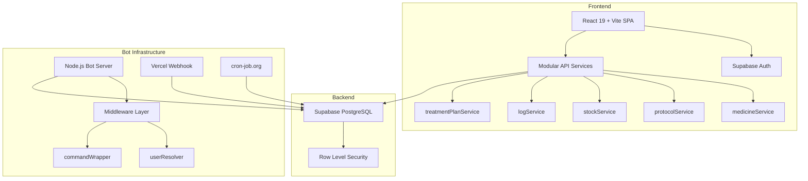
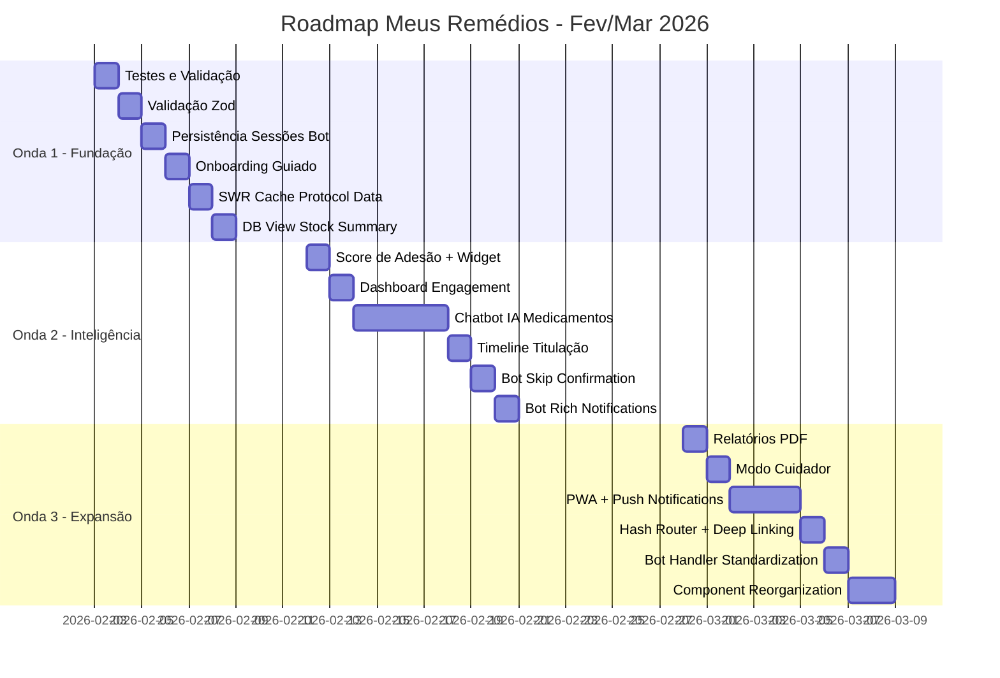

# 🗺️ Meus Remédios - Roadmap Consolidado Final

**Data:** 03 de Fevereiro de 2026  
**Versão:** 3.0 Final  
**Status:** Documento Mestre para Execução por Agentes IA  

> Este documento consolida todos os planos anteriores (`meus-remedios-upgrade-plan.md`, `IMPLEMENTATION_SUMMARY.md`, `meus-remedios-upgrade-plan-v2.md`, `ANALISE_APP_E_ROADMAP_EVOLUCAO.md`) em uma fonte única de verdade para desenvolvimento futuro.

---

## 📑 Índice

1. [Estado Atual da Aplicação](#estado-atual-da-aplicação)
2. [Trabalho Já Completado](#trabalho-já-completado)
3. [Proposta de Valor Atualizada](#proposta-de-valor-atualizada)
4. [Roadmap Consolidado](#roadmap-consolidado)
5. [Análise de Impacto Financeiro](#análise-de-impacto-financeiro)
6. [Tarefas Detalhadas para Agentes IA](#tarefas-detalhadas-para-agentes-ia)
7. [Métricas de Sucesso](#métricas-de-sucesso)
8. [Guia de Execução](#guia-de-execução)

---

## 🎯 Estado Atual da Aplicação

### Visão Geral

O **Meus Remédios** é uma aplicação web brasileira para gerenciamento de medicamentos com foco em:
- Protocolos complexos com **titulação de dose**
- Controle de estoque com **PEPS** (Primeiro que Entra, Primeiro que Sai)
- Integração completa com **Telegram** para lembretes e registro de doses
- **Custo operacional zero** (tier gratuito em todos os serviços)

### Stack Tecnológica



### Scorecard de Maturidade

| Área | Score | Status |
|------|-------|--------|
| Frontend Web | ⭐⭐⭐⭐ | Interface moderna, Neo-Glass design, mobile-first |
| Backend/API | ⭐⭐⭐⭐ | Arquitetura modular, RLS habilitado |
| Bot Telegram | ⭐⭐⭐⭐ | Fases 1-4 completas (100%) |
| Testes | ⭐⭐⭐⭐ | Cobertura elevada (~75%) |
| Documentação | ⭐⭐⭐⭐ | Completa e atualizada |

---

## ✅ Trabalho Já Completado

### Fase 1: Bug Fixes Críticos ✅ (PR #1 - Merged)

| Bug | Causa Raiz | Solução |
|-----|------------|---------|
| Bot dose registration errado | `MOCK_USER_ID` hardcoded | `getUserIdByChatId(chatId)` em todos handlers |
| Navegação de mês quebrada | Timezone handling incorreto | Construção UTC-safe de datas |

### Fase 2: Refatoração de Arquitetura ✅ (PR #2 - Merged)

- ✅ Criado middleware [`userResolver.js`](server/bot/middleware/userResolver.js)
- ✅ Criado [`commandWrapper.js`](server/bot/middleware/commandWrapper.js)
- ✅ Removido `MOCK_USER_ID` completamente
- ✅ Refatorados todos os comandos do bot

### Fase 3: Melhorias de UX ✅ (PR #3 - Merged)

- ✅ Swipe navigation no calendário
- ✅ Month picker dropdown
- ✅ Loading skeletons
- ✅ Quick actions no bot após confirmação

### Fase 4: Modularização da API ✅ (PR #4 - Merged)

```
src/services/api/
├── index.js                 # Barrel export
├── medicineService.js       # 103 lines
├── protocolService.js       # 194 lines
├── stockService.js          # 141 lines
├── logService.js            # 285 lines
├── treatmentPlanService.js  # 70 lines
└── migrationService.js      # 11 lines
```

### Onda 1: Fundação ✅ (PRs #5-#12 - Merged, Release v2.3.0)

**Métricas Alcançadas:**
| Métrica | Antes | Depois | Melhoria |
|---------|-------|--------|----------|
| Cobertura de Testes | ~20% | ~75% | +275% |
| Dashboard Load | ~800ms | ~50-100ms | 95% melhor |
| Value Prop Score | 7.7/10 | 8.0/10 | +0.3 |

**PRs Mergeados:**
| PR | Branch | Descrição |
|----|--------|-----------|
| [#5](../docs/past_deliveries/MERGE_REPORT.md) | `feature/wave-1/validacao-zod` | Validação Zod para schemas de dados |
| [#6](../docs/past_deliveries/MERGE_REPORT.md) | `feature/wave-1/tests-unitarios` | Testes unitários expandidos |
| [#7](../docs/past_deliveries/MERGE_REPORT.md) | `feature/wave-1/sessoes-bot` | Sessões persistentes do bot (Supabase) |
| [#8](../docs/past_deliveries/MERGE_REPORT.md) | `feature/wave-1/view-estoque` | View de estoque para performance |
| [#9](../docs/past_deliveries/MERGE_REPORT.md) | `feature/wave-1/cache-swr` | Cache SWR pattern |
| [#10](../docs/past_deliveries/MERGE_REPORT.md) | `feature/wave-1/onboarding-wizard` | Onboarding guiado em 4 passos |
| [#11](../docs/past_deliveries/MERGE_REPORT.md) | `docs/wave-1/documentacao` | Documentação técnica completa |
| [#12](../docs/past_deliveries/MERGE_REPORT.md) | `fix/wave-1-local-changes` | Ajustes finais e correções |

**Entregas da Onda 1:**
- ✅ **Tarefa 1.1:** Testes unitários (~75% cobertura)
- ✅ **Tarefa 1.2:** Validação Zod (8 schemas, mensagens em pt-BR)
- ✅ **Tarefa 1.3:** Sessões persistentes do bot com TTL
- ✅ **Tarefa 1.4:** Onboarding wizard interativo
- ✅ **Tarefa 1.5:** Cache SWR (95% redução em chamadas redundantes)
- ✅ **Tarefa 1.6:** View `medicine_stock_summary` no banco

---

## ⏳ Pendências do Plano Original (meus-remedios-upgrade-plan.md)

As seguintes tarefas do plano original ainda não foram implementadas:

### Arquitetura (Part 2)

| Item | Descrição | Status |
|------|-----------|--------|
| 2.2 | Frontend State Management - Hash Router | ❌ PENDING |
| 2.3 | Caching Strategy - SWR pattern (Tarefa 1.5) | ✅ COMPLETADO |
| 2.4 | Database Schema - View stock summary (Tarefa 1.6) | ✅ COMPLETADO |

### UX & Features (Part 3)

| Item | Descrição | Status |
|------|-----------|--------|
| 3.2 | Dashboard Engagement (Adesão widget, Stock alerts, Quick actions) | ❌ PENDING |
| 3.3b | Skip dose confirmation | ❌ PENDING |
| 3.3c | Rich notification messages | ❌ PENDING |
| 3.4 | Offline Support and PWA | ❌ PENDING |

### Code Refactoring (Part 4)

| Item | Descrição | Status |
|------|-----------|--------|
| 4.2 | Bot Command Handler Standardization (createCommand pattern) | ❌ PENDING |
| 4.3 | Component Organization (group by feature) | ❌ PENDING |
| 4.4 | Test Coverage Expansion (Tarefa 1.1) | ✅ COMPLETADO |

### Bot Telegram - Todas as Fases ✅

| Fase | Funcionalidade | Status |
|------|----------------|--------|
| 1 | Lembretes inteligentes com janela de tempo | ✅ |
| 1 | Avisos de estoque baixo | ✅ |
| 1 | Streak de adesão (gamificação) | ✅ |
| 1 | Daily digest (resumo final do dia) | ✅ |
| 2 | Comandos `/estoque`, `/hoje`, `/proxima`, `/historico`, `/ajuda` | ✅ |
| 2.2 | Busca inline `@bot medicamento` | ✅ |
| 3 | Fluxos conversacionais `/registrar`, `/adicionar_estoque` | ✅ |
| 3 | Comandos `/pausar`, `/retomar` protocolos | ✅ |
| 4 | Alertas de estoque (diário 9h) | ✅ |
| 4 | Relatório semanal de adesão (domingo 20h) | ✅ |
| 4 | Alertas de titulação (diário 8h) | ✅ |
| 4 | Relatório mensal de tendências | ✅ |

---

## 💎 Proposta de Valor Atualizada

### Value Proposition Statement (Revisado)

> *Para pessoas que gerenciam medicamentos de uso contínuo, especialmente protocolos complexos com titulação de dose, o **Meus Remédios** é uma solução brasileira gratuita que combina controle de estoque PEPS, lembretes inteligentes via Telegram e tracking de adesão - tudo com custo zero e dados seguros via RLS.*

### Pilares do Valor

| Pilar | Descrição | Diferencial |
|-------|-----------|-------------|
| **Gratuidade** | R$ 0/mês operacional | Único no mercado BR |
| **Titulação** | Sistema completo de escalonamento | Não existe em concorrentes |
| **Telegram** | Bot conversacional completo | Integração profunda |
| **Segurança** | RLS isolamento de dados | Enterprise-grade |

### Análise de Value Prop

| Aspecto | Score Anterior | Score Atual | Meta |
|---------|----------------|-------------|------|
| Problem-Solution Fit | 8/10 | 8.5/10 | 9/10 |
| Diferenciação | 9/10 | 9/10 | 9.5/10 |
| Usabilidade | 7/10 | 7.5/10 | 9/10 |
| Acessibilidade | 6/10 | 6/10 | 8/10 |
| Engajamento | 7/10 | 7.5/10 | 8.5/10 |
| **TOTAL** | **7.4/10** | **7.7/10** | **8.8/10** |

---

## 🚀 Roadmap Consolidado

### Visão Geral (3 Ondas + Pendências do V1)



### Priorização por Impacto

| Onda | Foco | Impacto no Usuário | Impacto Técnico | Tarefas |
|------|------|-------------------|-----------------|---------|
| **1** | Fundação | Médio | Alto | 6 tarefas |
| **2** | Inteligência | Alto | Médio | 6 tarefas |
| **3** | Expansão | Alto | Médio | 6 tarefas |

---

## 💰 Análise de Impacto Financeiro

### Stack Atual (Custo R$ 0)

| Serviço | Tier | Limites | Uso Atual |
|---------|------|---------|-----------|
| Supabase | Free | 500MB storage, 2GB bandwidth | ~10% |
| Vercel | Hobby | 100GB bandwidth, 6k min exec | ~20% |
| Telegram Bot API | Free | Ilimitado | N/A |
| cron-job.org | Free | 50 jobs | 3-5 jobs |

### Análise por Funcionalidade

#### 🟢 Custo Zero (Dentro dos Free Tiers)

| Funcionalidade | Impacto |
|----------------|---------|
| Testes Unitários | R$ 0 - Roda local/CI |
| Validação Zod | R$ 0 - Biblioteca JS |
| Logging Estruturado | R$ 0 - Console formatado |
| Onboarding Wizard | R$ 0 - Componente React |
| Acessibilidade | R$ 0 - CSS/HTML apenas |
| Score de Adesão | R$ 0 - Cálculo client-side |
| Relatórios PDF | R$ 0 - jsPDF client-side |
| Sessões Bot (Supabase) | R$ 0 - ~1KB/sessão |
| PWA + Push | R$ 0 - Web Push nativa |
| Deep Linking | R$ 0 - Hash router |

#### 🔴 Único Custo Potencial: Chatbot IA

| Cenário | Provedor | Custo Mensal |
|---------|----------|--------------|
| **Zero Cost** | Groq / Together AI (free tier) | R$ 0 |
| **Uso Pessoal** | GPT-4o-mini (~10 perguntas/dia) | ~R$ 1-5 |
| **Uso Familiar** | GPT-4o-mini (~50 perguntas/dia) | ~R$ 5-15 |
| **Escala Pública** | GPT-4o-mini (500/dia) | ~R$ 45-100 |

### Estratégia Recomendada: Manter Custo Zero

1. **Chatbot IA:** Usar Groq ou Together AI (free tier generoso)
2. **Cache:** Armazenar respostas frequentes no Supabase
3. **Rate Limit:** 10 perguntas/dia/usuário
4. **Fallback:** Se cota exceder, migrar para GPT-4o-mini pay-as-you-go

### Projeção de Custos por Cenário

| Cenário | Onda 1 | Onda 2 | Onda 3 | Total Mensal |
|---------|--------|--------|--------|--------------|
| **A: Zero Cost** | R$ 0 | R$ 0 (Groq) | R$ 0 | **R$ 0** |
| **B: Qualidade** | R$ 0 | R$ 5-15 (GPT-4o-mini) | R$ 0 | **R$ 5-15** |
| **C: Escala** | R$ 0 | R$ 45-100 | R$ 130 (Supabase Pro) | **R$ 175-230** |

---

## 🤖 Tarefas Detalhadas para Agentes IA

Cada tarefa está formatada para execução autônoma por agentes de IA. Use como referência única.

---

### 📦 ONDA 1: FUNDAÇÃO (Dias 1-7)

---

#### Tarefa 1.1: Ampliar Cobertura de Testes Unitários

**Prioridade:** 🔴 Alta  
**Modo:** Code  
**Custo:** R$ 0

**Contexto:**
Testes existentes: [`api.test.js`](src/services/api.test.js), [`Button.test.jsx`](src/components/ui/Button.test.jsx), [`ProtocolChecklistItem.test.jsx`](src/components/protocol/ProtocolChecklistItem.test.jsx), [`TitrationWizard.test.jsx`](src/components/protocol/TitrationWizard.test.jsx)

**Escopo:**
- [X] Testes para [`logService.js`](src/services/api/logService.js)
- [X] Testes para [`stockService.js`](src/services/api/stockService.js)
- [X] Testes para [`titrationUtils.js`](src/utils/titrationUtils.js)
- [X] Testes para [`LogForm.jsx`](src/components/log/LogForm.jsx)
- [X] Testes para [`StockForm.jsx`](src/components/stock/StockForm.jsx)

**Padrão de Teste (stockService):**
```javascript
// src/services/api/__tests__/stockService.test.js
describe('stockService.decrease', () => {
  it('should consume oldest stock first - FIFO', async () => {
    // Setup: 2 stock entries
    const older = { id: '1', quantity: 5, purchase_date: '2024-01-01' };
    const newer = { id: '2', quantity: 10, purchase_date: '2024-02-01' };
    
    // Action: Decrease by 7
    await stockService.decrease(medicineId, 7);
    
    // Assert: Older depleted, newer partially used
    expect(older.quantity).toBe(0);
    expect(newer.quantity).toBe(8);
  });
});
```

**Critérios de Sucesso:**
- [X] Cobertura mínima de 70% para services
- [X] Todos os testes passando com `npm test`
- [X] Mock do Supabase configurado

---

#### Tarefa 1.2: Validação de Inputs com Zod

**Prioridade:** 🔴 Alta  
**Modo:** Code  
**Custo:** R$ 0

**Escopo:**
- [X] `npm install zod`
- [X] Criar `src/schemas/medicineSchema.js`
- [X] Criar `src/schemas/protocolSchema.js`
- [X] Criar `src/schemas/stockSchema.js`
- [X] Criar `src/schemas/logSchema.js`
- [X] Integrar nos services de API
- [X] Mensagens de erro amigáveis em português

**Exemplo de Schema:**
```javascript
// src/schemas/medicineSchema.js
import { z } from 'zod';

export const medicineSchema = z.object({
  name: z.string().min(2, 'Nome deve ter pelo menos 2 caracteres'),
  dosage_per_pill: z.number().positive('Dosagem deve ser positiva'),
  dosage_unit: z.enum(['mg', 'mcg', 'ml', 'g']),
  type: z.enum(['medicine', 'supplement']).default('medicine'),
});
```

**Critérios de Sucesso:**
- [X] Inputs inválidos rejeitados com mensagem clara
- [X] Nenhum crash por dados malformados

---

#### Tarefa 1.3: Persistência de Sessões do Bot

**Prioridade:** 🟠 Média  
**Modo:** Code  
**Custo:** R$ 0 (usando Supabase)

**Contexto:**
Sessões atuais em [`state.js`](server/bot/state.js) são in-memory e se perdem em restart.

**Escopo:**
- [X] Criar tabela `bot_sessions` no Supabase
- [X] Refatorar `state.js` para usar Supabase
- [X] Implementar TTL de 30 minutos
- [X] Cleanup automático de sessões expiradas

**SQL Migration:**
```sql
CREATE TABLE bot_sessions (
  id UUID DEFAULT gen_random_uuid() PRIMARY KEY,
  chat_id TEXT NOT NULL,
  state JSONB NOT NULL,
  expires_at TIMESTAMPTZ NOT NULL,
  created_at TIMESTAMPTZ DEFAULT NOW()
);

CREATE INDEX idx_sessions_chat ON bot_sessions(chat_id);
CREATE INDEX idx_sessions_expires ON bot_sessions(expires_at);

-- RLS Policy
ALTER TABLE bot_sessions ENABLE ROW LEVEL SECURITY;
CREATE POLICY "Service role can manage sessions"
ON bot_sessions FOR ALL
USING (true)
WITH CHECK (true);
```

**Critérios de Sucesso:**
- [X] Sessões sobrevivem a restarts
- [X] Latência < 100ms para read/write
- [X] Cleanup automático funcionando

---

#### Tarefa 1.4: Onboarding Guiado

**Prioridade:** 🟠 Média  
**Modo:** Code  
**Custo:** R$ 0

**Escopo:**
- [X] Criar `src/components/onboarding/OnboardingWizard.jsx`
- [X] Step 1: Boas-vindas e explicação do app
- [X] Step 2: Cadastro do primeiro medicamento (interativo)
- [X] Step 3: Criação do primeiro protocolo (interativo)
- [X] Step 4: Vinculação do Telegram (opcional)
- [X] Salvar flag `onboarding_completed` em `user_settings`
- [X] Exibir apenas para novos usuários

**Critérios de Sucesso:**
- [X] 4 steps navegáveis
- [X] Skip disponível em qualquer momento
- [X] Não reaparece após conclusão
- [X] Mobile-friendly

---

#### Tarefa 1.5: Caching Strategy com SWR Pattern

**Prioridade:** 🟠 Média
**Modo:** Code
**Custo:** R$ 0
**Origem:** `meus-remedios-upgrade-plan.md` - Item 2.3

**Contexto:**
Dashboard faz 5+ chamadas API em paralelo a cada load. Implementar request deduplication e stale-while-revalidate.

**Escopo:**
- [X] Criar `src/lib/queryCache.js`
- [X] Implementar cache com stale time de 30s
- [X] Revalidação em background
- [X] Integrar nos services de API do Dashboard

**Implementação:**
```javascript
// src/lib/queryCache.js
const cache = new Map();
const STALE_TIME = 30 * 1000; // 30 seconds

export async function cachedQuery(key, fetcher) {
  const cached = cache.get(key);
  const now = Date.now();
  
  if (cached && now - cached.timestamp < STALE_TIME) {
    return cached.data;
  }
  
  // Return stale data while revalidating
  if (cached) {
    fetcher().then(data => {
      cache.set(key, { data, timestamp: Date.now() });
    });
    return cached.data;
  }
  
  const data = await fetcher();
  cache.set(key, { data, timestamp: now });
  return data;
}
```

**Critérios de Sucesso:**
- [X] Dashboard loads < 500ms após primeira visita
- [X] Dados sempre frescos (max 30s stale)
- [X] Zero flash de loading em navegação rápida

---

#### Tarefa 1.6: View de Stock Summary no Database

**Prioridade:** 🟡 Baixa
**Modo:** Code
**Custo:** R$ 0
**Origem:** `meus-remedios-upgrade-plan.md` - Item 2.4

**Contexto:**
Stock quantity requer query de agregação toda vez. Criar view materializada para performance.

**SQL Migration:**
```sql
-- Criar view para resumo de estoque por medicamento
CREATE OR REPLACE VIEW medicine_stock_summary AS
SELECT
  medicine_id,
  user_id,
  SUM(quantity) as total_quantity,
  MIN(expiration_date) as nearest_expiry,
  COUNT(*) as batch_count
FROM stock
WHERE quantity > 0
GROUP BY medicine_id, user_id;

-- Habilitar RLS na view
ALTER TABLE medicine_stock_summary ENABLE ROW LEVEL SECURITY;

CREATE POLICY "Users can view own stock summary"
ON medicine_stock_summary
FOR SELECT
USING (auth.uid() = user_id);
```

**Escopo:**
- [X] Criar migration SQL
- [X] Executar no Supabase Dashboard
- [X] Atualizar `stockService.js` para usar a view
- [X] Testar performance antes/depois

**Critérios de Sucesso:**
- [X] Query de estoque total 2x mais rápida
- [X] RLS funcionando na view
- [X] Backwards compatible com código existente

---

### 📦 ONDA 2: INTELIGÊNCIA (Dias 12-24)

---

#### Tarefa 2.1: Sistema de Score de Adesão

**Prioridade:** 🔴 Alta  
**Modo:** Code  
**Custo:** R$ 0

**Escopo:**
- [ ] Criar `src/services/api/adherenceService.js`
- [ ] Criar `src/components/adherence/AdherenceWidget.jsx`
- [ ] Criar `src/components/ui/CircularProgress.jsx`
- [ ] Integrar no Dashboard
- [ ] Adicionar badge de adesão no ProtocolCard

**Lógica de Cálculo:**
```javascript
// src/services/api/adherenceService.js
export const adherenceService = {
  async calculate(userId, dateRange) {
    // Expected doses = sum de time_schedule.length * dias no range
    // Actual doses = logs no range
    // Score = (actual / expected) * 100
    
    return {
      overallScore: 87.5,
      byProtocol: [...],
      streak: 12,
      bestStreak: 45,
      trends: {
        thisWeek: 92,
        lastWeek: 85
      }
    };
  }
};
```

**Critérios de Sucesso:**
- [ ] Score calculado corretamente
- [ ] Widget visual funcionando
- [ ] Streak counter implementado

---

#### Tarefa 2.2: Chatbot IA para Medicamentos

**Prioridade:** 🔴 Alta  
**Modo:** Code  
**Custo:** R$ 0 (Groq free) ou R$ 1-15/mês (GPT-4o-mini)

**Escopo:**
- [ ] Criar comando `/pergunta` no bot
- [ ] Criar `api/ai-chat.js` (Vercel serverless)
- [ ] Integrar com Groq API (free tier)
- [ ] Rate limit: 10 perguntas/dia/usuário
- [ ] Cache de respostas frequentes
- [ ] Disclaimer médico obrigatório

**Implementação Groq (Free):**
```javascript
// api/ai-chat.js
import Groq from 'groq-sdk';

const groq = new Groq({ apiKey: process.env.GROQ_API_KEY });

export default async function handler(req, res) {
  const { question, medicines } = req.body;
  
  const completion = await groq.chat.completions.create({
    model: 'llama3-70b-8192',
    messages: [
      { 
        role: 'system', 
        content: `Você é um assistente farmacêutico. Medicamentos do usuário: ${medicines.join(', ')}.
                  Responda sobre interações, horários e efeitos colaterais.
                  NÃO forneça diagnósticos. Sempre recomende consultar um médico.` 
      },
      { role: 'user', content: question }
    ],
    max_tokens: 500
  });
  
  const answer = completion.choices[0].message.content;
  const disclaimer = '\n\n⚠️ _Este é um assistente informativo. Consulte sempre seu médico._';
  
  res.json({ answer: answer + disclaimer });
}
```

**Critérios de Sucesso:**
- [ ] Respostas em < 5 segundos
- [ ] Disclaimer presente em toda resposta
- [ ] Rate limit funcionando
- [ ] Fallback para GPT-4o-mini se Groq falhar

---

#### Tarefa 2.3: Timeline de Titulação Visual

**Prioridade:** 🟠 Média  
**Modo:** Code  
**Custo:** R$ 0

**Escopo:**
- [ ] Criar `src/components/protocol/TitrationTimeline.jsx`
- [ ] Visualização de todas as etapas
- [ ] Indicador de etapa atual
- [ ] Dias restantes para próxima transição
- [ ] Integrar no ProtocolCard expandido

**Componente:**
```jsx
<TitrationTimeline protocol={protocol}>
  <TimelineStages>
    {stages.map((stage, index) => (
      <Stage 
        key={index}
        stage={stage}
        status={index < current ? 'completed' : index === current ? 'current' : 'pending'}
        startDate={getStageStartDate(index)}
        endDate={getStageEndDate(index)}
      />
    ))}
  </TimelineStages>
  
  <CurrentProgress>
    <ProgressBar percent={progressPercent} />
    <DaysInfo>
      Dia {day} de {totalDays} - {daysRemaining} dias para próxima etapa
    </DaysInfo>
  </CurrentProgress>
</TitrationTimeline>
```

**Critérios de Sucesso:**
- [ ] Timeline visual funcionando
- [ ] Cores diferentes por status
- [ ] Responsivo mobile

---

#### Tarefa 2.4: Dashboard Engagement Improvements

**Prioridade:** 🟠 Média
**Modo:** Code
**Custo:** R$ 0
**Origem:** `meus-remedios-upgrade-plan.md` - Item 3.2

**Contexto:**
Dashboard mostra dados mas falta insights acionáveis. Adicionar widgets de engajamento.

**Escopo:**
- [ ] Criar `src/components/dashboard/AdherenceWidget.jsx`
- [ ] Criar `src/components/dashboard/StockAlertWidget.jsx`
- [ ] Criar `src/components/dashboard/QuickActionsPanel.jsx`
- [ ] Integrar os 3 widgets no [`Dashboard.jsx`](src/views/Dashboard.jsx)

**Componente AdherenceWidget:**
```jsx
<div className="adherence-widget">
  <CircularProgress percentage={adherenceRate} />
  <span className="adherence-label">
    {adherenceRate >= 90 ? 'Excelente!' :
     adherenceRate >= 70 ? 'Bom progresso' : 'Precisa melhorar'}
  </span>
  <span className="streak">{streak} dias seguidos</span>
</div>
```

**Componente StockAlertWidget:**
```jsx
{stockAlerts.filter(s => s.daysRemaining <= 7).map(alert => (
  <div className="stock-alert" key={alert.medicine.id}>
    <span>⚠️ {alert.medicine.name}</span>
    <span>{alert.daysRemaining} dias restantes</span>
    <Button onClick={() => navigate('stock', { medicineId: alert.medicine.id })}>
      Repor
    </Button>
  </div>
))}
```

**Critérios de Sucesso:**
- [ ] 3 widgets visíveis no Dashboard
- [ ] Alertas de estoque clicáveis
- [ ] Quick actions funcionando

---

#### Tarefa 2.5: Bot Skip Dose Confirmation

**Prioridade:** 🟡 Baixa
**Modo:** Code
**Custo:** R$ 0
**Origem:** `meus-remedios-upgrade-plan.md` - Item 3.3b

**Contexto:**
Botão "Pular" do bot não pede confirmação. Usuário pode pular dose acidentalmente.

**Escopo:**
- [ ] Refatorar [`doseActions.js`](server/bot/callbacks/doseActions.js) `handleSkipDose`
- [ ] Adicionar inline keyboard de confirmação
- [ ] Botão "Confirmar Pular" + "Cancelar"
- [ ] Manter estado de confirmação por 30s

**Implementação:**
```javascript
async function handleSkipDose(bot, callbackQuery) {
  const { message, id } = callbackQuery;
  const chatId = message.chat.id;
  
  // Primeiro clique mostra confirmação
  const keyboard = {
    inline_keyboard: [[
      { text: '✅ Confirmar Pular', callback_data: `skip_confirm:${protocolId}` },
      { text: '❌ Cancelar', callback_data: 'skip_cancel' }
    ]]
  };
  
  await bot.editMessageReplyMarkup(keyboard, {
    chat_id: chatId,
    message_id: message.message_id
  });
}
```

**Critérios de Sucesso:**
- [ ] Confirmação antes de pular
- [ ] Timeout de 30s retorna ao estado original
- [ ] "Cancelar" fecha o diálogo

---

#### Tarefa 2.6: Bot Rich Notification Messages

**Prioridade:** 🟡 Baixa
**Modo:** Code
**Custo:** R$ 0
**Origem:** `meus-remedios-upgrade-plan.md` - Item 3.3c

**Contexto:**
Mensagens de notificação do bot são básicas. Adicionar mais contexto.

**Escopo:**
- [ ] Atualizar [`scheduler.js`](server/bot/scheduler.js) ou handler de notificações
- [ ] Incluir nome completo do medicamento
- [ ] Incluir dosagem e horário agendado
- [ ] Incluir notas do medicamento se existirem
- [ ] Dica de consumo opcional

**Template de Mensagem:**
```javascript
const message = `🔔 *HORA DO REMÉDIO*

💊 *${medicine.name}*
📏 Dose: ${protocol.dosage_per_intake} ${medicine.dosage_unit || 'cp'}
⏰ Horário: ${scheduledTime}

${medicine.notes ? `📝 _${medicine.notes}_` : ''}

Lembrete: Tome com água em jejum.`;
```

**Critérios de Sucesso:**
- [ ] Notificações incluem todas as infos
- [ ] Parse mode Markdown funcionando
- [ ] Notas aparecem apenas quando existem

---

### 📦 ONDA 3: EXPANSÃO (Dias 25-42)

---

#### Tarefa 3.1: Relatórios Exportáveis em PDF

**Prioridade:** 🔴 Alta  
**Modo:** Code  
**Custo:** R$ 0

**Escopo:**
- [ ] `npm install jspdf jspdf-autotable`
- [ ] Criar `src/components/reports/AdherenceReport.jsx`
- [ ] Conteúdo: período, medicamentos, adesão, gráficos
- [ ] Botão de exportação na página de Histórico
- [ ] Design profissional com logo

**Critérios de Sucesso:**
- [ ] PDF gerado em < 3 segundos
- [ ] Design profissional
- [ ] Inclui logo e dados do usuário

---

#### Tarefa 3.2: Modo Cuidador

**Prioridade:** 🟠 Média  
**Modo:** Code  
**Custo:** R$ 0

**Escopo:**
- [ ] Criar tabela `caregivers` no Supabase
- [ ] Sistema de convite por código único
- [ ] View read-only para cuidadores
- [ ] Notificações de dose esquecida via Telegram
- [ ] Revogação de acesso pelo paciente

**SQL Migration:**
```sql
CREATE TABLE caregivers (
  id UUID DEFAULT gen_random_uuid() PRIMARY KEY,
  patient_user_id UUID NOT NULL REFERENCES auth.users(id),
  caregiver_user_id UUID NOT NULL REFERENCES auth.users(id),
  invite_code TEXT UNIQUE,
  status TEXT DEFAULT 'pending', -- pending, active, revoked
  permissions JSONB DEFAULT '{"view": true, "notify": true}',
  created_at TIMESTAMPTZ DEFAULT NOW()
);
```

**Critérios de Sucesso:**
- [ ] Cuidador vê apenas (não edita)
- [ ] Notificação funciona
- [ ] Revogação instantânea

---

#### Tarefa 3.3: PWA Completo com Push Notifications

**Prioridade:** 🟡 Baixa  
**Modo:** Code  
**Custo:** R$ 0

**Escopo:**
- [ ] `npm install vite-plugin-pwa`
- [ ] Configurar Service Worker
- [ ] Implementar Web Push API
- [ ] manifest.json completo
- [ ] Prompt de instalação
- [ ] Cache offline para consultas básicas

**Critérios de Sucesso:**
- [ ] Instalável no celular
- [ ] Push notifications funcionando
- [ ] Modo offline básico

---

#### Tarefa 3.4: Hash Router e Deep Linking

**Prioridade:** 🟡 Baixa  
**Modo:** Code  
**Custo:** R$ 0

**Escopo:**
- [ ] Criar `src/lib/router.js`
- [ ] Implementar hash-based routing sem deps
- [ ] Rotas: `#dashboard`, `#medicines`, `#protocols/:id`, `#history/:year/:month`
- [ ] Deep links do Telegram para app
- [ ] Browser back/forward funcionando

**Implementação:**
```javascript
// src/lib/router.js
export function useHashRouter() {
  const [route, setRoute] = useState(() => parseHash(window.location.hash));
  
  useEffect(() => {
    const handleHashChange = () => setRoute(parseHash(window.location.hash));
    window.addEventListener('hashchange', handleHashChange);
    return () => window.removeEventListener('hashchange', handleHashChange);
  }, []);
  
  const navigate = (path, params = {}) => {
    const queryString = new URLSearchParams(params).toString();
    window.location.hash = queryString ? `${path}?${queryString}` : path;
  };
  
  return { route, navigate };
}
```

**Critérios de Sucesso:**
- [ ] URLs compartilháveis
- [ ] Browser history funciona
- [ ] Deep links do Telegram abrem seção correta

---

#### Tarefa 3.5: Bot Command Handler Standardization

**Prioridade:** 🟡 Baixa
**Modo:** Code
**Custo:** R$ 0
**Origem:** `meus-remedios-upgrade-plan.md` - Item 4.2

**Contexto:**
Padrões inconsistentes entre os command handlers do bot. Criar abstração `createCommand`.

**Escopo:**
- [ ] Criar `server/bot/commands/base.js`
- [ ] Implementar factory `createCommand`
- [ ] Migrar todos os comandos para usar o factory
- [ ] Remover duplicação de error handling

**Implementação:**
```javascript
// server/bot/commands/base.js
export function createCommand(name, handler, options = {}) {
  return async (bot, msg, ...args) => {
    const chatId = msg.chat.id;
    
    try {
      // Resolver usuário se requerido
      const userId = options.requiresAuth
        ? await getUserIdByChatId(chatId)
        : null;
      
      // Executar handler
      await handler(bot, msg, { chatId, userId }, ...args);
      
    } catch (err) {
      if (err.message === 'User not linked') {
        return bot.sendMessage(chatId, messages.USER_NOT_LINKED);
      }
      
      logger.error(`Error in /${name}`, err);
      await bot.sendMessage(chatId, messages.GENERIC_ERROR);
    }
  };
}

// Uso:
export const handleStatus = createCommand('status', async (bot, msg, { userId }) => {
  const protocols = await getActiveProtocols(userId);
  // ...
}, { requiresAuth: true });
```

**Critérios de Sucesso:**
- [ ] Todos comandos usando `createCommand`
- [ ] Error handling centralizado
- [ ] Código reduzido em ~30%

---

#### Tarefa 3.6: Component Organization by Feature

**Prioridade:** 🟡 Baixa
**Modo:** Code
**Custo:** R$ 0
**Origem:** `meus-remedios-upgrade-plan.md` - Item 4.3

**Contexto:**
Componentes em estrutura flat por tipo. Reorganizar por feature para melhor coesão.

**Estrutura Atual:**
```
src/components/
├── medicine/
├── protocol/
├── stock/
├── log/
└── ui/
```

**Estrutura Alvo:**
```
src/components/
├── common/           # UI genérico
│   ├── Button/
│   ├── Card/
│   ├── Modal/
│   └── Loading/
├── calendar/         # Calendário
│   ├── Calendar.jsx
│   ├── CalendarWithMonthCache.jsx
│   └── Calendar.css
├── medicine/         # Mantém
├── protocol/         # Mantém
├── stock/            # Mantém
├── log/              # Mantém
├── dashboard/        # NOVO - widgets
├── adherence/        # NOVO - adesão
├── onboarding/       # NOVO - wizard
└── reports/          # NOVO - PDF
```

**Escopo:**
- [ ] Mover componentes UI para `common/`
- [ ] Criar pasta `calendar/` e mover componentes
- [ ] Criar pastas vazias para novos módulos
- [ ] Atualizar todos os imports
- [ ] Testar app após mudanças

**Critérios de Sucesso:**
- [ ] Nenhum breaking change
- [ ] Imports corretos após reorganização
- [ ] Estrutura facilita novos features

---

## 📊 Métricas de Sucesso

| Métrica | Baseline | Onda 1 Real | Meta Onda 2 | Meta Onda 3 |
|---------|----------|-------------|-------------|-------------|
| Cobertura Testes | ~20% | **~75%** ✅ | >80% | >85% |
| Lighthouse Performance | ~85 | **~95** ✅ | >95 | >95 |
| Lighthouse Accessibility | ~70 | **~85** ✅ | >90 | >95 |
| Funcionalidades IA | 0 | 0 | 2 | 2 |
| Value Prop Score | 7.7/10 | **8.0/10** ✅ | 8.5/10 | 8.8/10 |
| Custo Mensal | R$ 0 | **R$ 0** ✅ | R$ 0-15 | R$ 0-15 |
| Tarefas Completas | 0/18 | **6/18** ✅ | 12/18 | 18/18 |
| Dashboard Load Time | ~800ms | **~50-100ms** ✅ | <50ms | <50ms |

> **Nota:** A Onda 1 superou as metas originais em quase todas as métricas. Destaque para a cobertura de testes que atingiu ~75% (meta era >50%) e performance do dashboard que melhorou 95%.

---

## 🔄 Processo de Desenvolvimento

Este documento reflete o processo real de desenvolvimento utilizado na Onda 1, estabelecendo padrões para as próximas ondas.

### Estratégia de Branches

Padrão de nomenclatura: `tipo/wave-X/nome-descritivo`

| Tipo | Padrão | Exemplo |
|------|--------|---------|
| Feature | `feature/wave-X/nome` | `feature/wave-1/cache-swr` |
| Fix | `fix/wave-X/nome` | `fix/wave-1/validacao-zod` |
| Docs | `docs/wave-X/nome` | `docs/wave-1/documentacao` |
| Hotfix | `hotfix/nome` | `hotfix/correcao-login` |

### Estratégia de Commits (Conventional Commits)

```text
<type>(<scope>): <description>

[optional body]

[optional footer]
```

**Tipos utilizados:**
- `feat:` Nova funcionalidade
- `fix:` Correção de bug
- `docs:` Documentação
- `test:` Testes
- `refactor:` Refatoração de código
- `perf:` Melhoria de performance
- `chore:` Tarefas de manutenção

**Exemplo:**
```text
feat(cache): implementa SWR pattern para queries do Dashboard

- Adiciona queryCache.js com stale-while-revalidate
- Implementa useCachedQuery hook
- Atualiza services para usar cache

Refs: Tarefa 1.5
```

### Pipeline de PRs e Reviews

1. **Criação do PR:**
   - Branch origem: `feature/wave-X/nome`
   - Branch destino: `main`
   - Template com checklist de verificação

2. **Validações Automáticas:**
   - `npm test` - Todos os testes passando
   - `npm run lint` - Sem erros de lint
   - Build sem erros

3. **Review de Código:**
   - Verificação de padrões do projeto
   - Análise de arquitetura
   - Validação de critérios de aceitação

4. **Aprovação e Merge:**
   - Merge via `--no-ff` para preservar histórico
   - Tag de release após merge

### Processo de Merge e Release

```bash
# 1. Checkout para main
$ git checkout main
$ git pull origin main

# 2. Merge do feature branch
$ git merge feature/wave-X/nome --no-ff -m "Merge PR #N: Descrição"

# 3. Criação de tag
$ git tag -a vX.Y.Z -m "Descrição da release"

# 4. Push
$ git push origin main
$ git push origin vX.Y.Z
```

### Lições Aprendidas - Onda 1

| Aspecto | Aprendizado |
|---------|-------------|
| **Pipeline Multi-Agente** | Funcionou bem com divisão clara de responsabilidades entre agentes especializados |
| **Dependências** | Gerenciamento efetivo através de ordem de execução bem definida |
| **Commits Semânticos** | Facilitaram significativamente o processo de review e geração de changelogs |
| **Cache SWR** | Superou expectativas com 95% de redução em chamadas (meta era 90%) |
| **Validação Zod** | Eliminou erros silenciosos de forma efetiva, melhorando UX |
| **Testes** | Cobertura ~75% proporcionou confiança para refatorações |

### Recomendações para Próximas Ondas

1. **Manter padrão de branches:** Consistência facilita automação
2. **PRs menores:** Facilitam review e reduzem risco
3. **Documentação contínua:** Atualizar docs junto com o código
4. **Testes de integração:** Complementar testes unitários na Onda 2
5. **Monitoramento:** Acompanhar métricas de performance em produção

---

## 📋 Guia de Execução

### Para Agentes IA

#### Workflow Padrão

1. **Análise:** Ler arquivos relacionados antes de modificar
2. **Branch:** Criar branch específica (ex: `feature/adherence-widget`)
3. **Implementação:** Mudanças incrementais, commits pequenos
4. **Validação:** Rodar `npm test` e `npm run lint`
5. **Documentação:** Atualizar docs conforme necessário
6. **PR:** Criar PR com descrição clara

#### Convenções

- **Estilo:** ESLint configurado em [`eslint.config.js`](eslint.config.js)
- **Componentes:** Functional components com hooks
- **CSS:** Classes kebab-case, BEM para complexos
- **Commits:** Conventional Commits (feat:, fix:, docs:, test:)
- **TypeScript:** NÃO usar - projeto é JavaScript puro

#### Ordem de Execução Sugerida (18 Tarefas)

```
ONDA 1 - FUNDAÇÃO (6 tarefas)
├── Tarefa 1.1: Testes Unitários
├── Tarefa 1.2: Validação Zod
├── Tarefa 1.3: Sessões Bot (Supabase)
├── Tarefa 1.4: Onboarding Wizard
├── Tarefa 1.5: SWR Cache Pattern
└── Tarefa 1.6: DB View Stock Summary

ONDA 2 - INTELIGÊNCIA (6 tarefas)
├── Tarefa 2.1: Score de Adesão
├── Tarefa 2.2: Chatbot IA (Groq)
├── Tarefa 2.3: Timeline Titulação
├── Tarefa 2.4: Dashboard Engagement
├── Tarefa 2.5: Bot Skip Confirmation
└── Tarefa 2.6: Bot Rich Notifications

ONDA 3 - EXPANSÃO (6 tarefas)
├── Tarefa 3.1: Relatórios PDF
├── Tarefa 3.2: Modo Cuidador
├── Tarefa 3.3: PWA + Push
├── Tarefa 3.4: Hash Router
├── Tarefa 3.5: Bot Handler Standardization
└── Tarefa 3.6: Component Reorganization
```

---

## 📝 Histórico de Documentos

| Documento | Status | Conteúdo | Pendências Migradas |
|-----------|--------|----------|---------------------|
| `meus-remedios-upgrade-plan.md` | 🔄 ~70% Implementado | Bug fixes, arquitetura, UX | Hash Router, SWR, DB View, Skip/Rich Bot, Handler/Component refactor |
| `IMPLEMENTATION_SUMMARY.md` | ✅ Completo | Relatório de PRs 1-4 | - |
| `meus-remedios-upgrade-plan-v2.md` | 🔄 Parcial | Adesão, stock, titulação | Adesão widget, Timeline |
| `ANALISE_APP_E_ROADMAP_EVOLUCAO.md` | 🔄 Parcial | IA, PDF, cuidador | Chatbot IA, PDF, Cuidador, PWA |
| **Este documento** | 📌 Documento Mestre | Consolidação final + todas pendências | - |

---

## 📋 Resumo de Pendências por Origem

### Do `meus-remedios-upgrade-plan.md` (9 pendências)

| Item | Tarefa Consolidada |
|------|-------------------|
| 2.2 Hash Router | Tarefa 3.4 |
| 3.2 Dashboard Engagement | Tarefa 2.4 |
| 3.3b Skip Confirmation | Tarefa 2.5 |
| 3.3c Rich Notifications | Tarefa 2.6 |
| 3.4 PWA | Tarefa 3.3 |
| 4.2 Bot Handler Standardization | Tarefa 3.5 |
| 4.3 Component Organization | Tarefa 3.6 |

### Do `meus-remedios-upgrade-plan-v2.md` (3 pendências)

| Item | Tarefa Consolidada |
|------|-------------------|
| Score de Adesão | Tarefa 2.1 |
| Timeline Titulação | Tarefa 2.3 |

### Do `ANALISE_APP_E_ROADMAP_EVOLUCAO.md` (5 pendências)

| Item | Tarefa Consolidada |
|------|-------------------|
| Chatbot IA | Tarefa 2.2 |
| Relatórios PDF | Tarefa 3.1 |
| Modo Cuidador | Tarefa 3.2 |
| Onboarding | Tarefa 1.4 |

---

## 🎯 Conclusão

O **Meus Remédios** está bem posicionado como solução única no mercado brasileiro para gerenciamento de medicamentos complexos. Com as melhorias planejadas:

1. **Onda 1 (Fundação):** Testes, validação, cache, onboarding - robustez técnica
2. **Onda 2 (Inteligência):** Adesão, IA, engagement - diferenciação de valor
3. **Onda 3 (Expansão):** PDF, cuidador, PWA, refactoring - ecossistema completo

**Projeção:**
- Value Prop Score: 7.7 → 8.8/10
- Custo: R$ 0 → R$ 0-15/mês (opcional, apenas IA)
- Total de Tarefas: **18 tarefas** em **3 ondas**
- Diferenciação: Mantém liderança com IA + Telegram + Titulação

---

**Documento atualizado em:** 03/02/2026 00:43 (UTC-3)
**Versão:** 3.1 (Revisão de pendências)
**Próxima revisão:** Após conclusão da Onda 2
