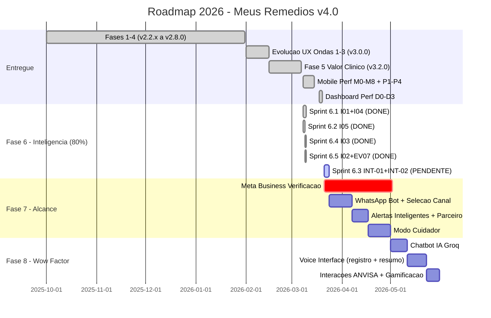

# Roadmap 2026 — Meus Remedios (v4.0)

**Versao:** 5.0 (Atualizado apos Mobile Perf M0-M8 + P1-P4 + D0-D3 + Fase 6 sprints 1,2,4,5 CONCLUIDOS)
**Data:** 20/03/2026
**Status:** Fase 6 em andamento — 4/5 sprints entregues ✅ (apenas Sprint 6.3 pendente)
**Baseline:** v3.2.0 → v3.3.0 (Fases 1-5 COMPLETAS + Mobile Perf + Fase 6 parcial)
**Principio:** Valor ao paciente primeiro. Custo operacional R$0 ate Fase 8.

> **Mudancas em relacao a v4.3:**
> - Mobile Performance Initiative completa: M0-M8 + P1-P4 + D0-D3 (13 sprints)
> - Bundle otimizado: 989KB → 102.47kB gzip (89% reducao)
> - Dashboard first load: -757KB JS, -2 queries, -2 auth roundtrips
> - Fase 6: Sprints 6.1, 6.2, 6.4, 6.5 ENTREGUES — apenas Sprint 6.3 (INT-01 + INT-02) pendente
> - Testes: 473 → 539+ (100% passing)
> - Novas regras de performance: R-111 a R-131, AP-A01 a AP-P17

---

## Indice

1. [Estado Atual](#1-estado-atual)
2. [Fases Entregues](#2-fases-entregues)
3. [Visao de Produto](#3-visao-de-produto)
4. [Panorama de Fases](#4-panorama-de-fases)
5. [Timeline Visual](#5-timeline-visual)
6. [Metricas de Sucesso](#6-metricas-de-sucesso)
7. [Diferenciacao no Mercado Brasileiro](#7-diferenciacao-no-mercado-brasileiro)
8. [Gestao de Riscos](#8-gestao-de-riscos)
9. [Stack e Custos](#9-stack-e-custos)
10. [Documentacao Relacionada](#10-documentacao-relacionada)

---

## 1. Estado Atual

| Dimensao | Valor |
|----------|-------|
| Versao do app | v3.3.0 ✅ |
| Stack frontend | React 19 + Vite 7 + Framer Motion 12 |
| Stack backend | Supabase (Postgres + Auth + RLS) + Zod 4 |
| Testes | Vitest 4 |
| Deploy | Vercel Hobby (gratis) |
| Bot | Telegram via Node.js |
| Custo operacional | R$0 |

### Metricas de Qualidade

| Metrica | Valor Atual |
|---------|-------------|
| Testes criticos passando | 539/539 (100%) ✅ |
| Test files | 30+ (100% passing) ✅ |
| Coverage minimo | 100% (services + components) ✅ |
| Bundle size (gzip) | **102.47 kB** (de 989KB original, 89% reducao via M2) ✅ |
| Main bundle first load | **678 kB** (de 1435KB, -53% via D0) ✅ |
| Lighthouse PWA | >=90 ✅ |
| Lighthouse Performance | >=90 ✅ |
| Auth roundtrips (first load) | **1** (de 13 original, via P4+D3) ✅ |
| Supabase GETs (first load) | **5** (de 7, via D1+D2) ✅ |
| Mobile Performance | M0-M8 + P1-P4 + D0-D3 completos ✅ |

---

## 2. Fases Entregues

| Fase | Versao | Entregas Principais |
|------|--------|---------------------|
| Pre-Wave | v2.2.x | Bug fixes criticos, refactor bot, UX calendar |
| Wave 1 — Fundacao | v2.3.0 | Zod (23 schemas), 110+ testes, cache SWR, onboarding |
| Wave 2 — Inteligencia | v2.4.0 | Score de adesao, streaks, timeline titulacao, widgets |
| HCC — Health Command Center | v2.5.0 | HealthScoreCard, SwipeRegisterItem, SmartAlerts, TreatmentAccordion |
| Fase 3.5 — Design Uplift | v2.6.0 | Glassmorphism, gradientes, micro-interacoes, tokens CSS |
| Fase 4 — Instalabilidade | v2.8.0 | Hash Router, PWA, Push Notifications, Analytics, Bot Standardization |
| Evolucao UX — Onda 1 | v3.0.0 | Componentes visuais: RingGauge, StockBars, Sparkline, DoseTimeline |
| Evolucao UX — Onda 2 | v3.0.0 | Hooks de logica: useDoseZones, useComplexityMode, ViewModeToggle, BatchRegister |
| Evolucao UX — Onda 3 | v3.0.0 | Navegacao 5->4 tabs: Hoje/Tratamento/Estoque/Perfil, TreatmentWizard, HealthHistory |
| Fase 5 — Valor Clinico (100%) ✅ | v3.2.0 | PDF Reports, CSV/JSON Export, Sharing, Modo Consulta, Cartao Emergencia, Rastreador Prescricoes, Bot Proativo, Calendario Visual, Analise Custo, Base ANVISA, Onboarding v3.2, Landing Redesign |
| Mobile Perf — M0-M8 ✅ | v3.3.0 | M0: Emergency fixes (HealthHistory freeze), M1: Virtualization (react-virtuoso), M2: Code splitting (89% bundle reduction), M3: DB optimization (views + indexes), M5: Assets/CSS/fonts, M6: Touch UX |
| Mobile Perf — P1-P4 ✅ | v3.3.0 | P1: cachedAdherenceService SWR, P2: loadData faseado (requestIdleCallback), P3: slim select timeline (76% payload reduction), P4: slim dashboard logs + getUserId cache (13→1 auth) + calculateStreaks optimization |
| Dashboard Perf — D0-D3 ✅ | v3.3.0 | D0: Fix lazy loading (-757KB modulepreload), D1+D2: dailyAdherence client-side (-2 queries), D3: getCurrentUser cache (-2 auth roundtrips) |
| Fase 6 — Insights (80%) 🚧 | v3.3.0 | Sprint 6.1: Refill Prediction + Protocol Risk, Sprint 6.2: Real Cost Analysis, Sprint 6.4: Reminder Optimizer, Sprint 6.5: Adherence Heatmap + Stock Timeline |

**Status da Fase 5 (07/03/2026):** 100% COMPLETA ✅ — Resumo em `plans/EXEC_SPEC_FASE_5_FINAL.md`

**Versão v3.2.0 Released** — Tag criada, documentação atualizada.

---

### Mobile Performance Initiative (M0-M8 + P1-P4 + D0-D3) — v3.3.0

**Objetivo:** Otimizar performance mobile end-to-end: bundle, rendering, network, auth, DB queries.

| Sprint | Entrega | Impacto | PR |
|--------|---------|---------|-----|
| M0 | Emergency fixes (HealthHistory freeze) | 4 cascading freezes eliminados | #339 |
| M1 | Timeline virtualization (react-virtuoso) | FPS <50 → ≥55, DOM N → ~10 | #342 |
| M2 | Code splitting + lazy routes | **989KB → 102.47kB gzip (89%)** | #391 |
| M3 | DB optimization (views + indexes) | Sparkline 3-4x, Heatmap 10x faster | #393 |
| M5 | Assets, CSS, font sizes | LCP ~200ms faster, favicon 192KB→<1KB | #394 |
| M6 | Mobile touch & UX | 300ms iOS delay removed, overscroll contained | — |
| P1 | cachedAdherenceService SWR | protocols 3x→1x query | #398 |
| P2 | loadData faseado (requestIdleCallback) | 12+→2 concurrent requests | #399 |
| P3 | Slim select timeline | ~500→~120 bytes/log (76% reducao) | #400 |
| P4 | Slim dashboard + auth cache + streaks | **13→1 auth roundtrip**, CPU 71.3%→negligivel | #403 |
| D0 | Fix lazy loading (vendor-pdf) | **-757KB modulepreload** no first load | #404 |
| D1+D2 | dailyAdherence client-side | -2 queries GET, -1 useEffect | #404 |
| D3 | getCurrentUser cache | -2 auth roundtrips (3→1) | #404 |

**Specs:** `plans/EXEC_SPEC_MOBILE_PERFORMANCE.md` (M0-M8), `plans/EXEC_SPEC_DASHBOARD_FIRST_LOAD.md` (D0-D3)
**Standards:** `docs/standards/MOBILE_PERFORMANCE.md`
**Testes:** 539/539 passando apos todas as otimizacoes

---

## 3. Visao de Produto

> "A ferramenta indispensavel para gestao de medicamentos no Brasil — gratuita, inteligente, integrada ao WhatsApp."

### Pilares Estrategicos

| Pilar | Descricao |
|-------|-----------|
| **Conveniencia** | Simplificar ao maximo a rotina diaria do paciente |
| **Inteligencia** | Transformar dados em predicoes acionaveis (client-side, custo zero) |
| **Alcance** | Estar onde o paciente ja esta (WhatsApp, 147M brasileiros) |
| **Encorajamento** | Gamificacao, streaks, badges, cuidador — motivar adesao |
| **Wow Factor** | IA conversacional, voz, surpresas que fidelizam |

---

## 4. Panorama de Fases

### Fase 5: Valor Clinico — FECHAR (v3.2.0, ~31 SP restantes, R$0)

**Objetivo:** Completar as features restantes, renovar onboarding e redesenhar a landing para fechar a fase.

| ID | Feature | SP | Status | Merge Commit |
|----|---------|-----|--------|-------------|
| F5.10 | Analise de Custo + EV-06 Cost Chart | 5 | ✅ **CONCLUIDO** | 894bb98 |
| ETL-1 | Script process-anvisa.js (CSV → JSON deduplicado) | 1 | ✅ **CONCLUIDO** | 7a887dc |
| F5.6 | Base ANVISA + autocomplete no formulario de medicamento | ~12 | ✅ **CONCLUIDO** | 7a887dc |
| F5.C | Onboarding Wizard renovado (v3.2 benefits + StockStep) | 5 | ✅ **CONCLUIDO** | 17371b4 |
| F5.D | Redesign Landing Page (showcase UX v3.2 + features Fase 5) | 8 | ✅ **CONCLUIDO** | c1069ea |

**F5.10 Quality Gate:** ✅ PASSED
- Tests: 425/425 passing, 95.65% coverage
- Code Review: 1 CRITICAL + 3 HIGH/MEDIUM resolvidas
- Performance: O(M*P) → O(M+P) otimizado
- Merge: PR #277 (substituiu PR #264 encerrado inadvertidamente)

**Spike ANVISA concluido:** CSV `public/medicamentos-ativos-anvisa.csv` baixado (10.206 registros).
Autocomplete preenche 4 campos automaticamente; dosagem permanece manual (nao esta no CSV ANVISA).
`CLASSE_TERAPEUTICA` incluida no JSON para habilitar F8.2 sem nova fonte de dados.

**Onboarding (F5.C):** Wizard passa de 4 para 5 steps (adiciona StockStep). WelcomeStep redesignado
com os 5 value props da UX v3.2. TelegramStep atualizado com capacidades do bot proativo.

**Landing (F5.D):** Redesign completo — hero com AppPreview em CSS, secao "Como Funciona" (3 passos),
features grid de 8 cards (vs. 6 textuais), CTA e footer atualizados. Sem quebra de identidade visual.

**Spec:** `plans/EXEC_SPEC_FASE_5_FINAL.md` | **Analise ANVISA:** `plans/ANALISE_CSV_ANVISA.md`

#### Resumo das Entregas Fase 5 (detalhes em `plans/EXEC_SPEC_FASE_5_FINAL.md`)

- F5.10: costAnalysisService O(M+P), 38 testes, 95.65% coverage (PR #277, commit 894bb98)
- F5.6: Base ANVISA 6.816 meds + autocomplete 4 campos, 48 testes, 100% coverage (PR #278, commit 7a887dc)
- F5.C: Onboarding renovado 5 steps + StockStep (PR #283, commit 17371b4)
- F5.D: Landing redesign Hero + Features grid + dark theme (PR #290, commit c1069ea)

---

### Fase 6: Inteligencia & Insights (v3.3.0, 39 SP, R$0) — 80% COMPLETA 🚧

**Objetivo:** Transformar dados acumulados em predicoes acionaveis que tornam o app indispensavel.

| ID | Feature | SP | Status | Sprint |
|----|---------|-----|--------|--------|
| I01 | Previsao de reposicao (consumo real 30d -> data de esgotamento) | 5 | ✅ ENTREGUE | 6.1 |
| I04 | Score de risco por protocolo (adesao 14d rolling + tendencia) | 5 | ✅ ENTREGUE | 6.1 |
| I05 | Analise de custo avancada (consumo real x preco unitario) | 5 | ✅ ENTREGUE | 6.2 |
| I03 | Otimizador de horario de lembrete (delta schedule vs taken_at) | 8 | ✅ ENTREGUE | 6.4 |
| I02 | Heatmap de padroes de adesao (dia-da-semana x periodo) | 8 | ✅ ENTREGUE | 6.5 |
| EV-07 | Timeline visual de prescricoes (StockTimeline) | 3 | ✅ ENTREGUE | 6.5 |
| INT-01 | Risk Score no PDF Reports | 2 | ⬚ PENDENTE | 6.3 |
| INT-02 | Refill Prediction nos alertas do bot | 3 | ⬚ PENDENTE | 6.3 |

**Entregue:** 34/39 SP (87%) — Sprints 6.1, 6.2, 6.4, 6.5 COMPLETOS
**Pendente:** Sprint 6.3 (INT-01 + INT-02, 5 SP) — integracoes cross-cutting (PDF + Bot)

**Principio:** Zero chamadas novas ao Supabase — computacao pura sobre cache SWR existente.
Nenhuma dependencia nova de npm. Insights so exibidos com dados suficientes (minimo 14 dias).

**Aprendizados de performance aplicados:**
- R-111: `calculateExpectedDoses()` (nao `calculateDailyIntake()`) para respeitar frequencia
- R-112: Aderencia por `sum(quantity_taken)`, nao `count(logs)`
- R-113: Filtrar logs por `protocol_id` APENAS (nao `|| medicine_id`)
- R-114: `.setHours(0,0,0,0)` em boundaries de data

**Spec:** `plans/PHASE_6_SPEC.md` | **SSOT:** `plans/EXEC_SPEC_FASE_6.md`

---

### Fase 7: Crescimento & Alcance (v4.0.0, 63 SP, R$0)

**Objetivo:** Expandir de Telegram para WhatsApp e introduzir suporte a cuidadores.

| ID | Feature | SP |
|----|---------|-----|
| W01 | WhatsApp Bot (Meta Cloud API, adapter pattern, feature parity Telegram) | 21 |
| W02 | Selecao de canal nas configuracoes (Telegram ou WhatsApp) | 5 |
| W03 | Alertas inteligentes multi-canal (usa outputs Fase 6) | 8 |
| C02 | Parceiro de responsabilidade (resumo semanal, sem acesso a conta) | 8 |
| C01 | Modo cuidador completo (convite, read-only, multi-canal) | 21 |

**Acao critica:** Iniciar verificacao Meta Business 4-8 semanas antes do desenvolvimento.
O processo de aprovacao da Meta pode bloquear o desenvolvimento se nao iniciado antecipadamente.

**Spec:** `plans/PHASE_7_SPEC.md`

---

### Fase 8: Experiencia Inteligente & Wow Factor (v4.1.0, 44 SP, R$0-5/mes)

**Objetivo:** Elevar a experiencia com IA conversacional, voz e interacoes que surpreendem.

| ID | Feature | SP |
|----|---------|-----|
| F8.1 | Chatbot IA multi-canal via Groq (contextual, com disclaimer medico) | 13 |
| V01 | Registro de dose por voz (Web Speech API nativa, zero custo) | 13 |
| V02 | Resumo de doses por voz (Speech Synthesis, lista do dia) | 5 |
| F8.2 | Interacoes medicamentosas ANVISA (base seed, alertas automaticos) | 13 |

**Foco:** Conveniencia, encorajamento e fator wow — NAO monetizacao.
Custo condicional: Groq free tier (R$0) ou pago (R$1-5/mes) dependendo do volume.

**Spec:** `plans/PHASE_8_SPEC.md`

---

### Backlog Futuro (sem prazo, trigger-gated)

Features que dependem de gatilhos de usuarios, receita ou demanda validada:

| Feature | Gatilho |
|---------|---------|
| Afiliacao farmacia (CPA) | 100+ usuarios ativos |
| Portal B2B para profissionais de saude | Demanda validada |
| i18n (PT-PT, ES) | Expansao internacional confirmada |
| OCR importacao de receita | Friccao de onboarding confirmada |
| Offline-first com sync (IndexedDB) | Demanda validada |
| Multi-perfil familia | 50+ usuarios ativos |
| Backup automatico criptografado | Demanda validada |

**Spec:** `plans/BACKLOG_FUTURO.md`

---

## 5. Timeline Visual

---

## 6. Metricas de Sucesso

### Produto

| KPI | Meta | Atual |
|-----|------|-------|
| Cobertura de testes | >90% | ✅ 100% (services + components) |
| Performance dashboard | <50ms | ✅ (useMemo client-side) |
| Lighthouse PWA | >=90 | ✅ >=90 |
| Bundle size (gzip) | <150KB | ✅ 102.47kB (89% reducao) |
| First load JS | <700KB | ✅ 678KB (-53% via D0) |
| Auth roundtrips | 1 | ✅ 1 (de 13 original) |

### Engajamento

| KPI | Meta |
|-----|------|
| DAU/MAU ratio | >30% |
| Retencao D7 | >50% |
| Retencao D30 | >40% |
| Streak medio | >5 dias |
| Doses registradas/dia/usuario | >2 |

### Crescimento

| KPI | Meta |
|-----|------|
| Usuarios registrados | 100+ |
| Usuarios ativos mensais (MAU) | 50+ |
| Instalacoes PWA | 30%+ dos usuarios mobile |
| Usuarios WhatsApp | >30% dos novos usuarios |

---

## 7. Diferenciacao no Mercado Brasileiro

1. **Custo zero genuino** — Todas as features essenciais sao gratuitas para sempre. Nenhum paywall escondido. Nenhum freemium frustrante. O paciente nunca precisa pagar para cuidar da propria saude.

2. **WhatsApp-nativo** — 147M de brasileiros usam WhatsApp diariamente. Lembretes, confirmacoes e alertas no canal que o paciente ja tem aberto. Sem instalar mais nada.

3. **Inteligencia client-side** — Predicoes de reposicao, scores de risco e otimizacao de horarios calculados localmente, sem API externa, sem custo de servidor, sem exposicao de dados.

4. **Cuidador via WhatsApp** — Familiares acompanham a adesao do paciente pelo WhatsApp. Sem criar conta, sem instalar app. Maximo alcance, minima friccao.

5. **Portabilidade clinica** — PDF de consulta medica, cartao de emergencia offline, exportacao completa. O paciente e dono dos seus dados e pode leva-los a qualquer medico.

6. **IA conversacional gratuita** — Chatbot contextual via Groq free tier. Perguntas sobre medicamentos, lembretes inteligentes, encorajamento personalizado. Sem custo para o paciente.

7. **Voz como interface** — Registro de dose por voz para pacientes idosos ou com mobilidade reduzida. Web Speech API nativa, sem dependencia externa, funciona no navegador.

---

## 8. Gestao de Riscos

| Risco | Probabilidade | Impacto | Mitigacao |
|-------|---------------|---------|-----------|
| Supabase Free Tier 500MB | Media | Alto | Monitorar uso, cleanup de logs antigos, politica de retencao |
| Vercel Hobby bandwidth (100GB) | Baixa | Alto | Otimizar assets, CDN cache agressivo, lazy loading |
| Meta Business verificacao demora/rejeita | Alta | Medio | Iniciar processo 4-8 semanas antes do dev, documentacao completa |
| Web Speech API limitado em iOS | Media | Medio | Graceful degradation, feature flag, fallback texto |
| Dados insuficientes para insights | Media | Baixo | UI adaptativa com threshold de 14 dias, onboarding guiado |
| Groq free tier descontinuado | Media | Baixo | Chatbot e condicional, alternativas: Cloudflare Workers AI, Ollama |
| LGPD — cuidador com dados medicos | Media | Alto | Consentimento explicito duplo, dados minimos, link com expiracao |

---

## 9. Stack e Custos

| Componente | Tecnologia | Tier | Custo Fases 5-7 | Custo Fase 8 |
|------------|-----------|------|-----------------|--------------|
| Frontend | React 19 + Vite 7 | Gratuito | R$0 | R$0 |
| UI | Framer Motion 12 | Gratuito | R$0 | R$0 |
| Backend | Supabase (Postgres + Auth + RLS) | Free Tier | R$0 | R$0 |
| Validacao | Zod 4 | Gratuito | R$0 | R$0 |
| Testes | Vitest 4 + Testing Library | Gratuito | R$0 | R$0 |
| Deploy | Vercel Hobby | Gratuito | R$0 | R$0 |
| Bot Telegram | node-telegram-bot-api | Gratuito | R$0 | R$0 |
| Bot WhatsApp | Meta Cloud API | Free Tier (1000 conv/mes) | R$0 | R$0 |
| IA | Groq API | Free Tier / Pago | — | R$0-5/mes |
| Voz | Web Speech API | Nativo browser | — | R$0 |
| PDF | jsPDF + jspdf-autotable | Gratuito | R$0 | R$0 |

**Total por fase:** Fases 5-7: R$0 | Fase 8: R$0-5/mes (condicional Groq)

---

## 10. Documentacao Relacionada

| Documento | Caminho |
|-----------|---------|
| Visao UX e Experiencia do Paciente | `plans/UX_VISION_EXPERIENCIA_PACIENTE.md` |
| Exec Spec Fase 5 (fechamento) | `plans/EXEC_SPEC_FASE_5_FINAL.md` |
| Analise CSV ANVISA (spike concluido) | `plans/ANALISE_CSV_ANVISA.md` |
| Exec Spec Fase 6 (SSOT) | `plans/EXEC_SPEC_FASE_6.md` |
| Spec Fase 6 — Inteligencia & Insights | `plans/PHASE_6_SPEC.md` |
| Spec Fase 7 — Crescimento & Alcance | `plans/PHASE_7_SPEC.md` |
| Spec Fase 8 — Experiencia Inteligente | `plans/PHASE_8_SPEC.md` |
| Mobile Performance Spec (M0-M8) | `plans/EXEC_SPEC_MOBILE_PERFORMANCE.md` |
| Dashboard First Load Spec (D0-D3) | `plans/EXEC_SPEC_DASHBOARD_FIRST_LOAD.md` |
| Mobile Performance Standards | `docs/standards/MOBILE_PERFORMANCE.md` |
| Backlog Futuro | `plans/BACKLOG_FUTURO.md` |
| Roadmaps supersedidos | `plans/archive_old/roadmap_v3/` |

---

*Documento atualizado — 20/03/2026.*
*Versao 5.0 — Supersede v4.3.*
