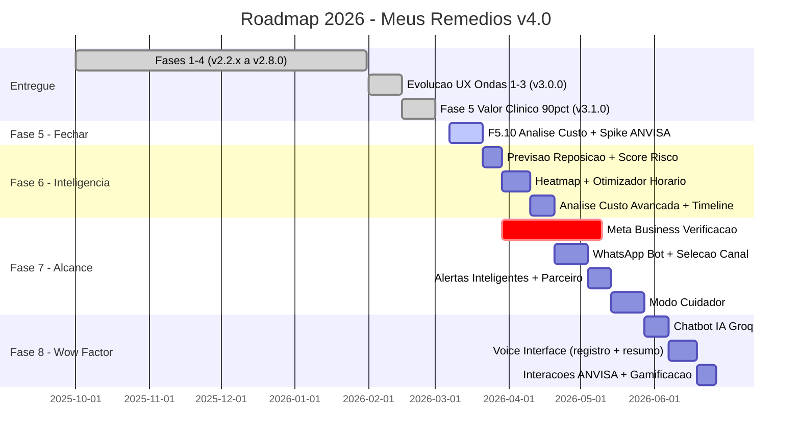

# Roadmap 2026 — Meus Remedios (v4.0)

**Versao:** 4.0
**Data:** 06/03/2026
**Status:** Aprovado
**Baseline:** v3.1.0 (Fases 1-4 + Evolucao UX Ondas 1-3 completas)
**Principio:** Valor ao paciente primeiro. Custo operacional R$0 ate Fase 8.

> **Mudancas em relacao a v3.2:**
> - Fases 5.5, 6 e 7 do roadmap anterior foram reorganizadas e renumeradas
> - Fase 5.5 (Inteligencia Preditiva) promovida a Fase 6 com escopo refinado
> - Fase 6 anterior (WhatsApp + Social + Offline) torna-se Fase 7 com foco em alcance
> - Fase 7 anterior (Voz + IA) torna-se Fase 8 com foco em experiencia inteligente
> - Monetizacao e expansao internacional movidos para Backlog Futuro (trigger-gated)
> - Evolucao UX (3 ondas) registrada como entrega concluida
> - Fase 5 atualizada para refletir 90% de conclusao

---

## Indice

1. [Estado Atual](#1-estado-atual)
2. [Fases Entregues](#2-fases-entregues)
3. [Visao de Produto](#3-visao-de-produto)
4. [Panorama de Fases](#4-panorama-de-fases)
5. [Timeline Visual](#5-timeline-visual)
6. [Metricas de Sucesso](#6-metricas-de-sucesso)
7. [Diferenciacao no Mercado Brasileiro](#7-diferenciacao-no-mercado-brasileiro)
8. [Gestao de Riscos](#8-gestao-de-riscos)
9. [Stack e Custos](#9-stack-e-custos)
10. [Documentacao Relacionada](#10-documentacao-relacionada)

---

## 1. Estado Atual

| Dimensao | Valor |
|----------|-------|
| Versao do app | v3.1.0 |
| Stack frontend | React 19 + Vite 7 + Framer Motion 12 |
| Stack backend | Supabase (Postgres + Auth + RLS) + Zod 4 |
| Testes | Vitest 4 |
| Deploy | Vercel Hobby (gratis) |
| Bot | Telegram via Node.js |
| Custo operacional | R$0 |

### Metricas de Qualidade

| Metrica | Valor Atual |
|---------|-------------|
| Testes criticos passando | 93/93 (100%) |
| Bundle size | <1MB |
| Lighthouse PWA | >=90 |
| Lighthouse Performance | >=90 |

---

## 2. Fases Entregues

| Fase | Versao | Entregas Principais |
|------|--------|---------------------|
| Pre-Wave | v2.2.x | Bug fixes criticos, refactor bot, UX calendar |
| Wave 1 — Fundacao | v2.3.0 | Zod (23 schemas), 110+ testes, cache SWR, onboarding |
| Wave 2 — Inteligencia | v2.4.0 | Score de adesao, streaks, timeline titulacao, widgets |
| HCC — Health Command Center | v2.5.0 | HealthScoreCard, SwipeRegisterItem, SmartAlerts, TreatmentAccordion |
| Fase 3.5 — Design Uplift | v2.6.0 | Glassmorphism, gradientes, micro-interacoes, tokens CSS |
| Fase 4 — Instalabilidade | v2.8.0 | Hash Router, PWA, Push Notifications, Analytics, Bot Standardization |
| Evolucao UX — Onda 1 | v3.0.0 | Componentes visuais: RingGauge, StockBars, Sparkline, DoseTimeline |
| Evolucao UX — Onda 2 | v3.0.0 | Hooks de logica: useDoseZones, useComplexityMode, ViewModeToggle, BatchRegister |
| Evolucao UX — Onda 3 | v3.0.0 | Navegacao 5->4 tabs: Hoje/Tratamento/Estoque/Perfil, TreatmentWizard, HealthHistory |
| Fase 5 — Valor Clinico (90%) | v3.1.0 | PDF Reports, CSV/JSON Export, Sharing, Modo Consulta, Cartao Emergencia, Rastreador Prescricoes, Bot Proativo, Calendario Visual |

**Pendentes da Fase 5:** F5.10 Analise de Custo, Spike ANVISA (pesquisa de viabilidade).

---

## 3. Visao de Produto

> "A ferramenta indispensavel para gestao de medicamentos no Brasil — gratuita, inteligente, integrada ao WhatsApp."

### Pilares Estrategicos

| Pilar | Descricao |
|-------|-----------|
| **Conveniencia** | Simplificar ao maximo a rotina diaria do paciente |
| **Inteligencia** | Transformar dados em predicoes acionaveis (client-side, custo zero) |
| **Alcance** | Estar onde o paciente ja esta (WhatsApp, 147M brasileiros) |
| **Encorajamento** | Gamificacao, streaks, badges, cuidador — motivar adesao |
| **Wow Factor** | IA conversacional, voz, surpresas que fidelizam |

---

## 4. Panorama de Fases

### Fase 5: Valor Clinico — FECHAR (v3.2.0, ~21 SP restantes, R$0)

**Objetivo:** Completar as 2-3 features restantes e fechar a fase.

| ID | Feature | SP |
|----|---------|-----|
| F5.10 | Analise de Custo + EV-06 Cost Chart | 5 |
| Spike | ANVISA: pesquisa de viabilidade de integracao com base de medicamentos | 2-3 |
| F5.6 | Base ANVISA medicamentos (se spike viavel) | ~13 |

A Fase 5 esta 90% completa. Os itens restantes sao incrementais e nao requerem spec separado.
Status detalhado nos PRDs arquivados.

---

### Fase 6: Inteligencia & Insights (v3.3.0, 39 SP, R$0)

**Objetivo:** Transformar dados acumulados em predicoes acionaveis que tornam o app indispensavel.

| ID | Feature | SP |
|----|---------|-----|
| I01 | Previsao de reposicao (consumo real 30d -> data de esgotamento) | 5 |
| I04 | Score de risco por protocolo (adesao 14d rolling + tendencia) | 5 |
| I05 | Analise de custo avancada (consumo real x preco unitario) | 5 |
| I02 | Heatmap de padroes de adesao (dia-da-semana x periodo) | 8 |
| I03 | Otimizador de horario de lembrete (delta schedule vs taken_at) | 8 |
| EV-07 | Timeline visual de prescricoes | 3 |
| INT-01 | Risk Score no PDF Reports | 2 |
| INT-02 | Refill Prediction nos alertas do bot | 3 |

**Principio:** Zero chamadas novas ao Supabase — computacao pura sobre cache SWR existente.
Nenhuma dependencia nova de npm. Insights so exibidos com dados suficientes (minimo 14 dias).

**Spec:** `plans/PHASE_6_SPEC.md`

---

### Fase 7: Crescimento & Alcance (v4.0.0, 63 SP, R$0)

**Objetivo:** Expandir de Telegram para WhatsApp e introduzir suporte a cuidadores.

| ID | Feature | SP |
|----|---------|-----|
| W01 | WhatsApp Bot (Meta Cloud API, adapter pattern, feature parity Telegram) | 21 |
| W02 | Selecao de canal nas configuracoes (Telegram ou WhatsApp) | 5 |
| W03 | Alertas inteligentes multi-canal (usa outputs Fase 6) | 8 |
| C02 | Parceiro de responsabilidade (resumo semanal, sem acesso a conta) | 8 |
| C01 | Modo cuidador completo (convite, read-only, multi-canal) | 21 |

**Acao critica:** Iniciar verificacao Meta Business 4-8 semanas antes do desenvolvimento.
O processo de aprovacao da Meta pode bloquear o desenvolvimento se nao iniciado antecipadamente.

**Spec:** `plans/PHASE_7_SPEC.md`

---

### Fase 8: Experiencia Inteligente & Wow Factor (v4.1.0, 44 SP, R$0-5/mes)

**Objetivo:** Elevar a experiencia com IA conversacional, voz e interacoes que surpreendem.

| ID | Feature | SP |
|----|---------|-----|
| F8.1 | Chatbot IA multi-canal via Groq (contextual, com disclaimer medico) | 13 |
| V01 | Registro de dose por voz (Web Speech API nativa, zero custo) | 13 |
| V02 | Resumo de doses por voz (Speech Synthesis, lista do dia) | 5 |
| F8.2 | Interacoes medicamentosas ANVISA (base seed, alertas automaticos) | 13 |

**Foco:** Conveniencia, encorajamento e fator wow — NAO monetizacao.
Custo condicional: Groq free tier (R$0) ou pago (R$1-5/mes) dependendo do volume.

**Spec:** `plans/PHASE_8_SPEC.md`

---

### Backlog Futuro (sem prazo, trigger-gated)

Features que dependem de gatilhos de usuarios, receita ou demanda validada:

| Feature | Gatilho |
|---------|---------|
| Afiliacao farmacia (CPA) | 100+ usuarios ativos |
| Portal B2B para profissionais de saude | Demanda validada |
| i18n (PT-PT, ES) | Expansao internacional confirmada |
| OCR importacao de receita | Friccao de onboarding confirmada |
| Offline-first com sync (IndexedDB) | Demanda validada |
| Multi-perfil familia | 50+ usuarios ativos |
| Backup automatico criptografado | Demanda validada |

**Spec:** `plans/BACKLOG_FUTURO.md`

---

## 5. Timeline Visual

---

## 6. Metricas de Sucesso

### Produto

| KPI | Meta |
|-----|------|
| Cobertura de testes | >90% |
| Performance dashboard | <50ms |
| Lighthouse PWA | >=95 |
| Bundle size | <1MB |

### Engajamento

| KPI | Meta |
|-----|------|
| DAU/MAU ratio | >30% |
| Retencao D7 | >50% |
| Retencao D30 | >40% |
| Streak medio | >5 dias |
| Doses registradas/dia/usuario | >2 |

### Crescimento

| KPI | Meta |
|-----|------|
| Usuarios registrados | 100+ |
| Usuarios ativos mensais (MAU) | 50+ |
| Instalacoes PWA | 30%+ dos usuarios mobile |
| Usuarios WhatsApp | >30% dos novos usuarios |

---

## 7. Diferenciacao no Mercado Brasileiro

1. **Custo zero genuino** — Todas as features essenciais sao gratuitas para sempre. Nenhum paywall escondido. Nenhum freemium frustrante. O paciente nunca precisa pagar para cuidar da propria saude.

2. **WhatsApp-nativo** — 147M de brasileiros usam WhatsApp diariamente. Lembretes, confirmacoes e alertas no canal que o paciente ja tem aberto. Sem instalar mais nada.

3. **Inteligencia client-side** — Predicoes de reposicao, scores de risco e otimizacao de horarios calculados localmente, sem API externa, sem custo de servidor, sem exposicao de dados.

4. **Cuidador via WhatsApp** — Familiares acompanham a adesao do paciente pelo WhatsApp. Sem criar conta, sem instalar app. Maximo alcance, minima friccao.

5. **Portabilidade clinica** — PDF de consulta medica, cartao de emergencia offline, exportacao completa. O paciente e dono dos seus dados e pode leva-los a qualquer medico.

6. **IA conversacional gratuita** — Chatbot contextual via Groq free tier. Perguntas sobre medicamentos, lembretes inteligentes, encorajamento personalizado. Sem custo para o paciente.

7. **Voz como interface** — Registro de dose por voz para pacientes idosos ou com mobilidade reduzida. Web Speech API nativa, sem dependencia externa, funciona no navegador.

---

## 8. Gestao de Riscos

| Risco | Probabilidade | Impacto | Mitigacao |
|-------|---------------|---------|-----------|
| Supabase Free Tier 500MB | Media | Alto | Monitorar uso, cleanup de logs antigos, politica de retencao |
| Vercel Hobby bandwidth (100GB) | Baixa | Alto | Otimizar assets, CDN cache agressivo, lazy loading |
| Meta Business verificacao demora/rejeita | Alta | Medio | Iniciar processo 4-8 semanas antes do dev, documentacao completa |
| Web Speech API limitado em iOS | Media | Medio | Graceful degradation, feature flag, fallback texto |
| Dados insuficientes para insights | Media | Baixo | UI adaptativa com threshold de 14 dias, onboarding guiado |
| Groq free tier descontinuado | Media | Baixo | Chatbot e condicional, alternativas: Cloudflare Workers AI, Ollama |
| LGPD — cuidador com dados medicos | Media | Alto | Consentimento explicito duplo, dados minimos, link com expiracao |

---

## 9. Stack e Custos

| Componente | Tecnologia | Tier | Custo Fases 5-7 | Custo Fase 8 |
|------------|-----------|------|-----------------|--------------|
| Frontend | React 19 + Vite 7 | Gratuito | R$0 | R$0 |
| UI | Framer Motion 12 | Gratuito | R$0 | R$0 |
| Backend | Supabase (Postgres + Auth + RLS) | Free Tier | R$0 | R$0 |
| Validacao | Zod 4 | Gratuito | R$0 | R$0 |
| Testes | Vitest 4 + Testing Library | Gratuito | R$0 | R$0 |
| Deploy | Vercel Hobby | Gratuito | R$0 | R$0 |
| Bot Telegram | node-telegram-bot-api | Gratuito | R$0 | R$0 |
| Bot WhatsApp | Meta Cloud API | Free Tier (1000 conv/mes) | R$0 | R$0 |
| IA | Groq API | Free Tier / Pago | — | R$0-5/mes |
| Voz | Web Speech API | Nativo browser | — | R$0 |
| PDF | jsPDF + jspdf-autotable | Gratuito | R$0 | R$0 |

**Total por fase:** Fases 5-7: R$0 | Fase 8: R$0-5/mes (condicional Groq)

---

## 10. Documentacao Relacionada

| Documento | Caminho |
|-----------|---------|
| Visao UX e Experiencia do Paciente | `plans/UX_VISION_EXPERIENCIA_PACIENTE.md` |
| Spec Fase 6 — Inteligencia & Insights | `plans/PHASE_6_SPEC.md` |
| Spec Fase 7 — Crescimento & Alcance | `plans/PHASE_7_SPEC.md` |
| Spec Fase 8 — Experiencia Inteligente | `plans/PHASE_8_SPEC.md` |
| Backlog Futuro | `plans/BACKLOG_FUTURO.md` |
| Roadmaps supersedidos | `plans/archive_old/roadmap_v3/` |

---

*Documento aprovado — 06/03/2026.*
*Supersede `roadmap_2026_meus_remedios_v32.md`.*
