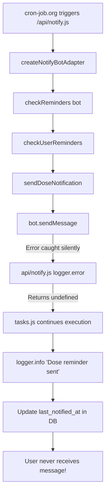
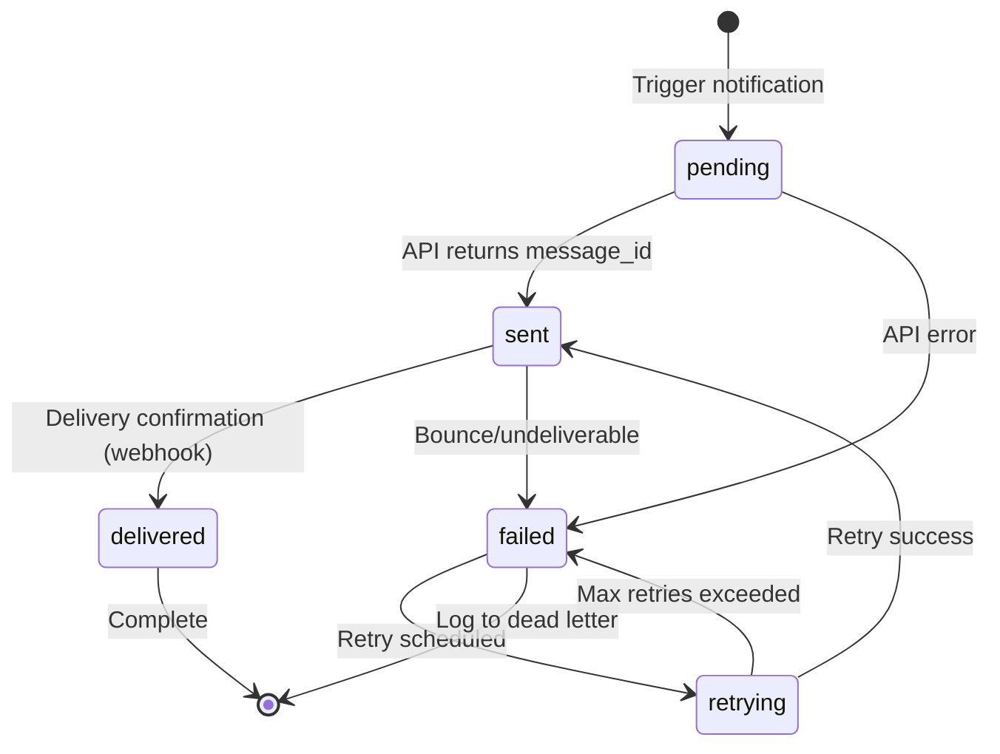

# Telegram Notification System - Critical Architecture Review

> **Status:** CRITICAL ISSUES IDENTIFIED  
> **Review Date:** 2026-02-15  
> **Reviewers:** Architect Mode Analysis  
> **Priority:** P0 - Immediate Action Required

---

## Executive Summary

The Telegram bot notification system has a **fundamental error handling flaw** that causes silent failures while falsely reporting success. The database is being updated with `last_notified_at` timestamps **even when Telegram messages fail to send**, leading to:

- **Missed medication reminders** (users never receive notifications)
- **False confidence in system reliability** (logs show "sent" when actually failed)
- **No retry mechanism** for failed notifications
- **Data inconsistency** between actual delivery and recorded state

---

## 1. Current State Analysis

### 1.1 Code Flow Architecture



### 1.2 Critical Code Paths

#### File: `api/notify.js` (lines 34-48)

```javascript
sendMessage: async (chatId, text, options = {}) => {
  try {
    const result = await telegramFetch('sendMessage', { chat_id: chatId, text, ...options });
    if (result) {
      logger.debug(`Telegram message sent successfully`, { chatId, messageId: result.message_id });
    } else {
      logger.error(`Telegram sendMessage failed`, { chatId });
    }
    return result;  // Returns undefined on failure!
  } catch (err) {
    logger.error(`Telegram sendMessage error`, err, { chatId });
    throw err;  // This throw is caught at line 28, not propagated!
  }
}
```

**Issue:** When `telegramFetch` returns `{ ok: false }`, `result` is `undefined` (line 27 returns `data.result` where `data.ok === false`). The error is logged but **NOT thrown**.

#### File: `api/notify.js` (lines 16-31)

```javascript
const telegramFetch = async (method, body) => {
  try {
    const res = await fetch(`https://api.telegram.org/bot${token}/${method}`, {...});
    const data = await res.json();
    if (!data.ok) {
      logger.error(`Telegram API Error (${method})`, null, { error: data });
      // MISSING: throw new Error() here!
    }
    return data.result;  // Returns undefined when data.ok is false
  } catch (err) {
    logger.error(`Fetch Error (${method})`, err);
    // Error swallowed here too!
  }
};
```

**Issue:** When Telegram API returns `ok: false`, the error is logged but **not thrown**, and `undefined` is returned silently.

#### File: `server/bot/tasks.js` (lines 269-281)

```javascript
await sendDoseNotification(bot, chatId, p, currentHHMM);  // Returns undefined on failure
logger.info(`Dose reminder sent`, {                       // Always logs as success!
  userId,
  medicine: p.medicine?.name,
  time: currentHHMM,
  protocolId: p.id,
  chatId
});

await supabase
  .from('protocols')
  .update({ last_notified_at: new Date().toISOString() })  // Always updates!
  .eq('id', p.id);
```

**Issue:** No check if `sendDoseNotification` succeeded. The database is updated regardless of actual send status.

### 1.3 Notification Deduplicator Flow

File: `server/services/notificationDeduplicator.js` (lines 13-58)

```javascript
export async function shouldSendNotification(userId, protocolId, notificationType) {
  // ... checks notification_log for recent entries
  
  // Not a duplicate - log it and return true
  const loggedSuccessfully = await logNotification(userId, protocolId, notificationType);
  return loggedSuccessfully;  // Logs BEFORE actual send attempt!
}
```

**Issue:** The `notification_log` table records **intent to send**, not actual delivery. This creates false positives in deduplication.

### 1.4 Database Schema Issues

File: `.migrations/add_last_notified_at.sql`

```sql
ALTER TABLE protocols 
ADD COLUMN IF NOT EXISTS last_notified_at TIMESTAMPTZ;

COMMENT ON COLUMN protocols.last_notified_at IS 'Timestamp of the last notification sent for this protocol';
```

**Issue:** This column tracks **attempt time**, not **delivery time**. There's no `last_notification_status` field.

---

## 2. Identified Flaws and Impact

### 2.1 Error Handling Flaws

| Flaw | Location | Impact |
|------|----------|--------|
| Silent failures in `telegramFetch` | `api/notify.js:24-27` | Errors logged but not thrown; caller receives `undefined` |
| No return value checking | `tasks.js:269-281` | Assumes success regardless of actual result |
| Generic catch blocks swallow errors | `tasks.js:340-342` | Individual notification failures hidden |
| Missing error propagation | `api/notify.js:28-30` | Fetch errors logged but not re-thrown |

### 2.2 Database State Management Flaws

| Flaw | Impact |
|------|--------|
| `last_notified_at` updated on attempt | Prevents retry even when message failed |
| No `notification_status` field | Cannot track delivery vs failure vs pending |
| `notification_log` logs intent | Deduplication based on false positives |
| No transaction wrapping | Partial state updates possible |

### 2.3 Logging Strategy Flaws

| Flaw | Impact |
|------|--------|
| "Dose reminder sent" logged before confirmation | False confidence in system health |
| Error logs in `api/notify.js` but success in `tasks.js` | Inconsistent observability |
| No correlation ID between log entries | Cannot trace notification lifecycle |
| Vercel logs vs database log divergence | Two sources of truth |

### 2.4 Reliability Flaws

| Flaw | Impact |
|------|--------|
| No retry mechanism | Transient failures become permanent misses |
| No dead letter queue | Failed notifications lost forever |
| No circuit breaker | Repeated failures not detected |
| No alerting on failure rates | Silent degradation |

---

## 3. Recommended Architecture Changes

### 3.1 Error Handling Flow (Priority: P0)

#### Pattern: Result Object Pattern

Replace silent failures with explicit result objects:

```typescript
// New type: NotificationResult
interface NotificationResult {
  success: boolean;
  messageId?: string;
  error?: {
    code: string;
    message: string;
    retryable: boolean;
  };
  timestamp: string;
}
```

#### Implementation:

```javascript
// api/notify.js - Fixed telegramFetch
const telegramFetch = async (method, body) => {
  try {
    const res = await fetch(`https://api.telegram.org/bot${token}/${method}`, {...});
    const data = await res.json();
    
    if (!data.ok) {
      logger.error(`Telegram API Error (${method})`, null, { error: data });
      throw new Error(`Telegram API Error: ${data.error_code} - ${data.description}`);
    }
    
    return data.result;
  } catch (err) {
    logger.error(`Fetch Error (${method})`, err);
    throw err;  // ALWAYS re-throw
  }
};

// api/notify.js - Fixed sendMessage with result pattern
sendMessage: async (chatId, text, options = {}) => {
  try {
    const result = await telegramFetch('sendMessage', { chat_id: chatId, text, ...options });
    
    return {
      success: true,
      messageId: result.message_id,
      timestamp: new Date().toISOString()
    };
  } catch (err) {
    logger.error(`Telegram sendMessage failed`, err, { chatId });
    
    return {
      success: false,
      error: {
        code: err.name || 'SEND_FAILED',
        message: err.message,
        retryable: isRetryableError(err)
      },
      timestamp: new Date().toISOString()
    };
  }
}
```

### 3.2 Database State Management (Priority: P0)

#### Migration: Add Status Tracking

```sql
-- Add status column to protocols
ALTER TABLE protocols 
ADD COLUMN IF NOT EXISTS last_notification_status VARCHAR(20) 
  CHECK (last_notification_status IN ('pending', 'sent', 'failed', 'retrying'));

-- Add retry tracking
ALTER TABLE protocols 
ADD COLUMN IF NOT EXISTS notification_retry_count INTEGER DEFAULT 0;

ALTER TABLE protocols 
ADD COLUMN IF NOT EXISTS next_retry_at TIMESTAMPTZ;

-- Update notification_log to track actual delivery
ALTER TABLE notification_log 
ADD COLUMN IF NOT EXISTS status VARCHAR(20) DEFAULT 'sent'
  CHECK (status IN ('pending', 'sent', 'failed', 'delivered'));

ALTER TABLE notification_log 
ADD COLUMN IF NOT EXISTS error_message TEXT;

ALTER TABLE notification_log 
ADD COLUMN IF NOT EXISTS telegram_message_id BIGINT;
```

#### New Pattern: State Machine for Notifications



### 3.3 Logging Strategy (Priority: P1)

#### Unified Logging with Correlation IDs

```javascript
// New: notificationLogger.js
import { createLogger } from './logger.js';

const logger = createLogger('Notification');

export function createNotificationLogger(correlationId) {
  const context = { correlationId, component: 'notification' };
  
  return {
    started: (data) => logger.info('Notification started', { ...context, phase: 'started', ...data }),
    sent: (data) => logger.info('Notification sent', { ...context, phase: 'sent', ...data }),
    failed: (error, data) => logger.error('Notification failed', error, { ...context, phase: 'failed', ...data }),
    retrying: (data) => logger.info('Notification retrying', { ...context, phase: 'retrying', ...data }),
    delivered: (data) => logger.info('Notification delivered', { ...context, phase: 'delivered', ...data }),
  };
}
```

#### Database Audit Log

```sql
-- New table for comprehensive audit trail
CREATE TABLE notification_audit_log (
  id UUID PRIMARY KEY DEFAULT gen_random_uuid(),
  correlation_id UUID NOT NULL,
  user_id UUID NOT NULL REFERENCES auth.users(id),
  protocol_id UUID REFERENCES protocols(id),
  notification_type VARCHAR(50) NOT NULL,
  phase VARCHAR(20) NOT NULL CHECK (phase IN ('triggered', 'sent', 'failed', 'retrying', 'delivered', 'expired')),
  telegram_message_id BIGINT,
  error_code VARCHAR(50),
  error_message TEXT,
  metadata JSONB,
  created_at TIMESTAMPTZ DEFAULT now()
);

-- Index for querying notification lifecycle
CREATE INDEX idx_notification_audit_correlation ON notification_audit_log(correlation_id);
CREATE INDEX idx_notification_audit_user_time ON notification_audit_log(user_id, created_at);
```

### 3.4 Reliability Patterns (Priority: P1)

#### Retry Mechanism with Exponential Backoff

```javascript
// New: retryService.js
const RETRY_CONFIG = {
  maxRetries: 3,
  baseDelay: 5000,      // 5 seconds
  maxDelay: 60000,      // 1 minute
  retryableErrors: [
    'ETIMEDOUT',
    'ECONNRESET',
    'ENOTFOUND',
    'ECONNREFUSED',
    'Socket hang up'
  ]
};

function isRetryableError(error) {
  return RETRY_CONFIG.retryableErrors.some(code => 
    error.message?.includes(code) || 
    error.code === code
  );
}

export async function withRetry(operation, context) {
  let lastError;
  
  for (let attempt = 1; attempt <= RETRY_CONFIG.maxRetries; attempt++) {
    try {
      return await operation();
    } catch (error) {
      lastError = error;
      
      if (!isRetryableError(error) || attempt === RETRY_CONFIG.maxRetries) {
        throw error;
      }
      
      const delay = Math.min(
        RETRY_CONFIG.baseDelay * Math.pow(2, attempt - 1),
        RETRY_CONFIG.maxDelay
      );
      
      logger.info(`Retrying notification`, {
        attempt,
        maxRetries: RETRY_CONFIG.maxRetries,
        delay,
        context
      });
      
      await new Promise(resolve => setTimeout(resolve, delay));
    }
  }
  
  throw lastError;
}
```

#### Dead Letter Queue

```sql
-- Failed notifications queue
CREATE TABLE notification_dead_letter (
  id UUID PRIMARY KEY DEFAULT gen_random_uuid(),
  user_id UUID NOT NULL,
  protocol_id UUID,
  notification_type VARCHAR(50) NOT NULL,
  payload JSONB NOT NULL,
  error_code VARCHAR(50),
  error_message TEXT,
  retry_count INTEGER DEFAULT 0,
  failed_at TIMESTAMPTZ DEFAULT now(),
  last_retry_at TIMESTAMPTZ,
  resolved_at TIMESTAMPTZ,
  resolution_notes TEXT
);

-- Function to reprocess dead letter items
CREATE OR REPLACE FUNCTION reprocess_notification(notification_id UUID)
RETURNS void AS $$
BEGIN
  -- Move back to active queue
  -- Implementation depends on retry service
END;
$$ LANGUAGE plpgsql;
```

---

## 4. Implementation Plan

### Phase 1: Critical Fixes (P0) - Immediate

| Task | File | Description | Effort |
|------|------|-------------|--------|
| 1.1 | `api/notify.js` | Fix `telegramFetch` to throw on API errors | Small |
| 1.2 | `api/notify.js` | Fix `sendMessage` to return result object | Small |
| 1.3 | `server/bot/tasks.js` | Check `sendDoseNotification` result before logging/updating | Medium |
| 1.4 | `.migrations/` | Add `last_notification_status` column | Small |
| 1.5 | `server/services/notificationDeduplicator.js` | Only log after successful send | Medium |

### Phase 2: Reliability (P1) - Week 1

| Task | File | Description | Effort |
|------|------|-------------|--------|
| 2.1 | `server/services/retryService.js` | Create retry mechanism | Medium |
| 2.2 | `server/bot/tasks.js` | Integrate retry into notification flow | Medium |
| 2.3 | `.migrations/` | Create `notification_dead_letter` table | Small |
| 2.4 | `server/services/deadLetterService.js` | Create dead letter management | Medium |

### Phase 3: Observability (P1) - Week 2

| Task | File | Description | Effort |
|------|------|-------------|--------|
| 3.1 | `server/bot/notificationLogger.js` | Create correlation ID logger | Medium |
| 3.2 | `.migrations/` | Create `notification_audit_log` table | Small |
| 3.3 | `api/notify.js` | Add correlation IDs to all notifications | Medium |
| 3.4 | `api/telegram.js` | Add delivery webhook handling | Medium |

### Phase 4: Monitoring (P2) - Week 3

| Task | File | Description | Effort |
|------|------|-------------|--------|
| 4.1 | `api/monitoring.js` | Create notification health endpoint | Medium |
| 4.2 | `server/services/alertingService.js` | Alert on high failure rates | Medium |
| 4.3 | Dashboard | Add notification reliability metrics | Large |

---

## 5. Testing Strategy

### Unit Tests

```javascript
// tests/api/notify.test.js
describe('telegramFetch', () => {
  it('should throw when Telegram API returns ok: false', async () => {
    global.fetch = vi.fn().mockResolvedValue({
      json: () => Promise.resolve({ ok: false, error_code: 400, description: 'Bad Request' })
    });
    
    await expect(telegramFetch('sendMessage', {}))
      .rejects.toThrow('Telegram API Error: 400 - Bad Request');
  });
  
  it('should throw on network errors', async () => {
    global.fetch = vi.fn().mockRejectedValue(new Error('ETIMEDOUT'));
    
    await expect(telegramFetch('sendMessage', {}))
      .rejects.toThrow('ETIMEDOUT');
  });
});

describe('sendDoseNotification', () => {
  it('should not update last_notified_at on failure', async () => {
    bot.sendMessage.mockResolvedValue({ success: false, error: { retryable: false } });
    
    await sendDoseNotification(bot, chatId, protocol, time);
    
    expect(supabase.from).not.toHaveBeenCalledWith('protocols');
  });
});
```

### Integration Tests

```javascript
// tests/integration/notification-flow.test.js
describe('Notification E2E Flow', () => {
  it('should retry on transient failures and eventually succeed', async () => {
    // Mock: First 2 calls fail, 3rd succeeds
    // Verify: retry count, exponential backoff, final success
  });
  
  it('should move to dead letter after max retries', async () => {
    // Mock: All retries fail
    // Verify: entry in dead_letter table, no infinite loop
  });
  
  it('should maintain correlation ID through entire flow', async () => {
    // Verify: same correlation ID in all log entries
  });
});
```

---

## 6. Migration Path

### Rollback Strategy

```sql
-- If issues arise, rollback to simple logging
ALTER TABLE protocols 
DROP COLUMN IF EXISTS last_notification_status,
DROP COLUMN IF EXISTS notification_retry_count,
DROP COLUMN IF EXISTS next_retry_at;

-- Keep notification_audit_log for debugging but stop writing
```

### Deployment Order

1. **Database migrations** (add columns, new tables)
2. **Retry service** (new code, no existing behavior change)
3. **api/notify.js fixes** (critical error handling)
4. **tasks.js integration** (check results before DB updates)
5. **Monitoring and alerting** (observe new behavior)

---

## 7. Success Metrics

| Metric | Current | Target |
|--------|---------|--------|
| Silent failure rate | Unknown (hidden) | 0% |
| False positive logs | >0 | 0 |
| Successful retry rate | 0% | >80% of transient failures |
| Time to detect failure | ∞ (never detected) | <5 minutes |
| Notification delivery visibility | Partial | Full lifecycle tracking |

---

## 8. References

- [AGENTS.md](../AGENTS.md) - Project coding standards
- [Error Handling Patterns](https://nodejs.org/api/errors.html)
- [Telegram Bot API Documentation](https://core.telegram.org/bots/api)
- [Supabase RLS Best Practices](https://supabase.com/docs/guides/auth/row-level-security)

---

## Appendix: Current vs Proposed Code Comparison

### Current (BROKEN)

```javascript
// api/notify.js
if (!data.ok) {
  logger.error(`Telegram API Error (${method})`, null, { error: data });
  // No throw!
}
return data.result;  // undefined when !data.ok

// tasks.js
await sendDoseNotification(bot, chatId, p, currentHHMM);  // Never fails
await supabase.from('protocols').update({ last_notified_at: now() });  // Always updates
```

### Proposed (FIXED)

```javascript
// api/notify.js
if (!data.ok) {
  logger.error(`Telegram API Error (${method})`, null, { error: data });
  throw new Error(`Telegram API Error: ${data.error_code}`);
}
return data.result;

// tasks.js
const result = await sendDoseNotification(bot, chatId, p, currentHHMM);
if (!result.success) {
  await handleNotificationFailure(result, p);
  return;  // Don't update last_notified_at!
}
await supabase.from('protocols').update({ 
  last_notified_at: now(),
  last_notification_status: 'sent'
});
```

---

*Document generated by Architect Mode analysis. Immediate action required on Phase 1 tasks.*
