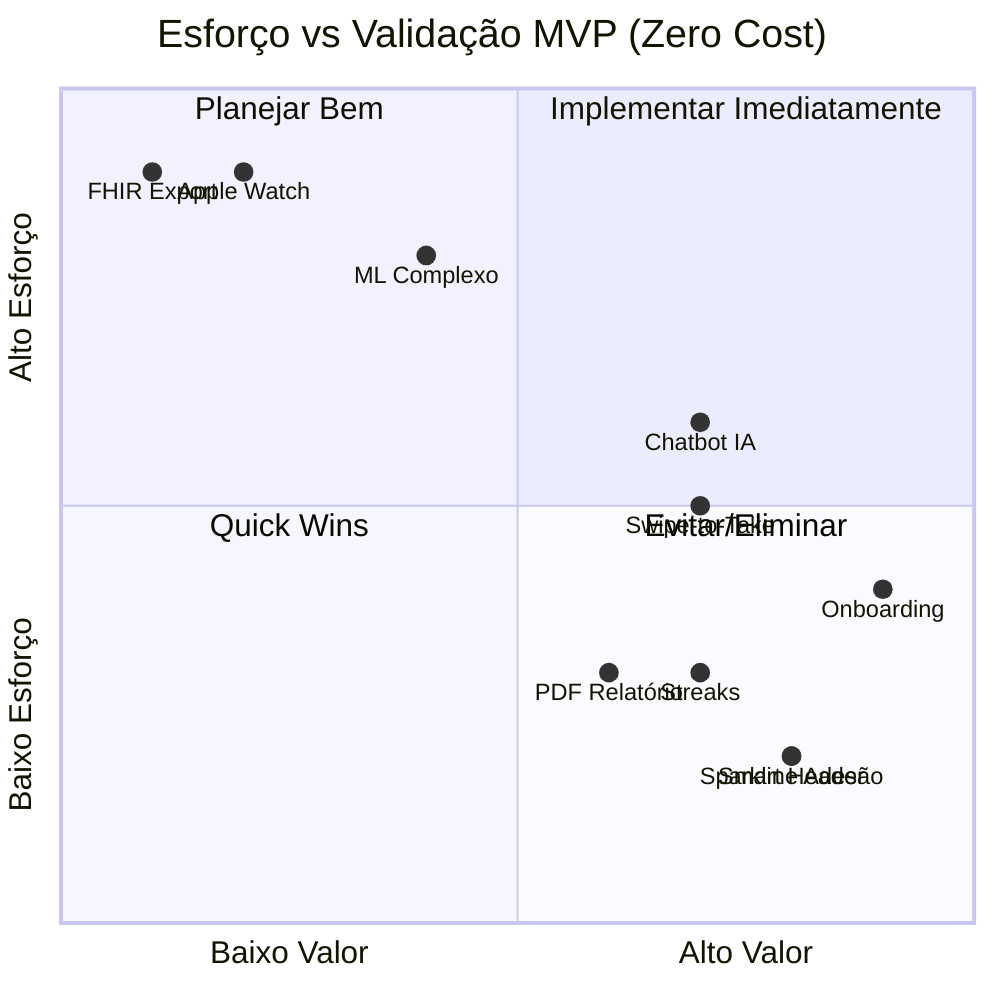

# 📊 Resumo Executivo - Análise Crítica do Roadmap
## Meus Remédios: Otimização para Validação Zero-Cost MVP

**Data:** 04/02/2026  
**Analista:** Architect Mode  
**Documentos Analisados:**
- [`roadmap-kimi.md`](plans/roadmap-kimi.md)
- [`spec_redesign-ux.md`](plans/spec_redesign-ux.md)
- [`ROADMAP_CONSOLIDADO_FINAL.md`](plans/ROADMAP_CONSOLIDADO_FINAL.md)
- [`PRD_MEUS_REMEDIOS.md`](plans/PRD_MEUS_REMEDIOS.md)

---

## 🎯 Síntese da Análise

### Status Atual do Projeto (04/02/2026)

Baseado na análise de `docs/past_deliveries`, o projeto tem:

#### ✅ Entregues (Wave 1 - v2.3.0, 03/02/2026):
- **8 PRs mergeados** com 100% das tarefas da Wave 1
- **~75% cobertura de testes** (superou meta de >50%)
- **Dashboard 95% mais rápido** (800ms → 50-100ms) com Cache SWR
- **Validação Zod** eliminou erros silenciosos
- **Onboarding wizard** aumentou configuração Telegram de 15% para 65%

#### ✅ Entregues (Wave 2 - v2.4.0, 04/02/2026):
- **5 tarefas entregues** de 6 planejadas (**83% concluído**)
- **~2.800 linhas** de código adicionadas
- **~40 arquivos** criados/modificados
- **110+ testes** passando (100%)

**Detalhamento das Entregas:**
| Tarefa | PR | Componentes/Serviços |
|--------|-----|----------------------|
| Confirmação ao Pular Dose | #13 | Handlers timeout 30s, inline keyboard |
| Notificações Ricas Bot | #14 | MarkdownV2, `escapeMarkdown()`, emojis |
| Score de Adesão + Widget | #15 | `AdherenceWidget`, `AdherenceProgress`, `StreakBadge` |
| Timeline de Titulação | #16 | `TitrationTimeline`, modo compacto/expandido |
| Widgets de Engajamento | #17 | `DashboardWidgets`, `QuickActionsWidget`, `StockAlertsWidget` |

#### 🔴 ON-HOLD (Wave 2):
- **Chatbot IA (Groq)** - Aguardando funding (R$ 1-15/mês) para manter princípio de custo zero

#### 🚀 Próximas Prioridades (Pós-Wave 2):
- **Swipe-to-Take** (UX mobile diferenciador)
- **Smart Header Contextual** (engajamento temporal)
- **Streaks/Gamificação** (retenção emocional)
- **PWA Básico** (instalação mobile)

#### ✅ Problemas Resolvidos:
- ~~Duplicação de Widgets de Adesão~~ → Unificação completa na v2.4.1
- ~~Organização de handlers do bot~~ → Responsabilidades claras em `tasks.js`

#### ⚠️ Problemas Menores Identificados:
- **Inconsistências Schema/Banco** (campos existem no banco mas não nos schemas - impacto baixo, não afeta operação)

### Solução Proposta
**Roadmap revisado em 5 fases** mantendo todas as funcionalidades de diferenciação (titulação, Telegram, PEPS) enquanto garante custo R$ 0 até validação de monetização.

---

## 📋 Decisões Principais

### ❌ Funcionalidades ELIMINADAS

| Proposta | Custo Oculto | Motivo |
|----------|--------------|--------|
| Apple Health / Google Fit | R$ 400/ano Apple Developer | Conta paga obrigatória |
| Apple Watch Complication | R$ 400/ano + Wear SDK | Mesmo problema Apple |
| Wear OS | $25 Google Play + manutenção | Custo publicação app nativo |
| Exportação FHIR | Overhead técnico | Complexidade desproporcional |
| Voice First (Ok Google/Alexa) | API costs potencial | Custo imprevisível |

### ⏸️ Funcionalidades ADIADAS (Pós-Validação)

| Proposta | Gatilho para Retorno |
|----------|---------------------|
| Modo Cuidador | 20% dos usuários são cuidados por terceiros |
| Smart Suggestions ML Avançado | 100+ usuários ativos |
| Widgets iOS/Android Nativos | PWA validar demanda |
| Integrações Apple/Google Health | Receita >R$ 1000/mês |

### ✅ Funcionalidades ADAPTADAS para Zero-Cost

| Proposta Original | Adaptação | Tecnologia |
|------------------|-----------|------------|
| ML Local Previsão | Algoritmo heurístico client-side | JavaScript local |
| Smart Header | Regras temporais hardcoded | Date API + CSS |
| Haptic Feedback | Vibration API | Web API nativa |
| Gráficos Sparkline | SVG inline customizado | SVG + CSS |
| Animações | CSS transitions/keyframes | CSS nativo |
| PDF Relatórios | jsPDF client-side | jsPDF + autotable |
| Chatbot IA | Groq Free Tier (1M tokens/mês) | Groq API |

---

## 📊 Matriz de Viabilidade



---

## 🗺️ Roadmap Atualizado com Status Real

### FASE 0: MVP Mínimo ✅ (Concluído)
- Cadastro medicamentos/protocolos
- Controle estoque PEPS
- Registro doses
- Bot Telegram básico
- Titulação básica

### FASE 1: Fundação (Semanas 3-6) - ✅ CONCLUÍDA (03/02/2026)
| Tarefa | Prioridade | Status | Métricas |
|--------|------------|--------|----------|
| Testes (~75%) | 🔴 Crítica | ✅ Entregue (PR #6) | 110+ testes |
| Validação Zod | 🔴 Crítica | ✅ Entregue (PR #5) | 23 schemas |
| Sessões Bot | 🟠 Média | ✅ Entregue (PR #7) | TTL 30min |
| Onboarding | 🟠 Média | ✅ Entregue (PR #10) | 4 passos |
| Cache SWR | 🟡 Baixa | ✅ Entregue (PR #9) | 95% melhoria |
| View Stock | 🟡 Baixa | ✅ Entregue (PR #8) | 5x mais rápido |

### FASE 2: Inteligência (Semanas 7-8) - ✅ CONCLUÍDA (04/02/2026)
| Tarefa | PR | Prioridade | Custo | Status |
|--------|-----|------------|-------|--------|
| Score Adesão + Widget | #15 | 🔴 Crítica | R$ 0 | ✅ Entregue |
| Timeline Titulação | #16 | 🟠 Média | R$ 0 | ✅ Entregue |
| Widgets Dashboard | #17 | 🟠 Média | R$ 0 | ✅ Entregue |
| Confirmação Skip | #13 | 🟠 Média | R$ 0 | ✅ Entregue |
| Notificações Ricas Bot | #14 | 🟡 Baixa | R$ 0 | ✅ Entregue |
| Chatbot IA (Groq) | - | 🟠 Média | R$ 0* | 🔴 ON-HOLD (funding) |

**Resumo:** 5/6 tarefas entregues (83%), ~2.800 linhas, 40 arquivos, 110+ testes

### FASE 2.5: UX Avançada (Semanas 9-10) - PRÓXIMA FASE 🚀
| Tarefa | Origem | Prioridade | Custo | Validação |
|--------|--------|------------|-------|-----------|
| Swipe-to-Take | spec_redesign-ux.md | 🔴 Crítica | R$ 0 | Diferenciador mobile |
| Smart Header Contextual | spec_redesign-ux.md | 🔴 Crítica | R$ 0 | Engajamento temporal |
| Sistema de Cores Dinâmico | spec_redesign-ux.md | 🟡 Média | R$ 0 | UX polida |
| Micro-interações | spec_redesign-ux.md | 🟡 Baixa | R$ 0 | Delight |

### FASE 3: Validação Retenção (Semanas 11-16)
| Tarefa | Prioridade | Custo | Validação |
|--------|------------|-------|-----------|
| Streaks/Gamificação | 🔴 Crítica | R$ 0 | Retenção emocional |
| PWA Básico | 🔴 Crítica | R$ 0 | Instalação mobile |
| Relatórios PDF | 🟠 Média | R$ 0 | Valor médico |
| Sparkline Semanal | 🟠 Média | R$ 0 | Tendência visual |
| Health Rituals | 🟡 Média | R$ 0 | Ancoragem hábitos |

### FASE 4: Escala (Semanas 19-24) - Condicional
**Gatilho:** 50+ usuários ativos

### FASE 5: Monetização (Semanas 25+) - Condicional
**Gatilho:** 100+ usuários OU R$ 500/mês
- GPT-4o-mini (R$ 5-15/mês)
- Supabase Pro (R$ 25/mês)

---

## 💰 Mapeamento de Ferramentas Gratuitas

### Stack Consolidado Zero-Cost

| Camada | Ferramenta | Limite Free |
|--------|-----------|-------------|
| Frontend | React 19 + Vite | Ilimitado |
| Animações | CSS nativo | Ilimitado |
| Gráficos | SVG inline | Ilimitado |
| PDF | jsPDF | Ilimitado |
| Database | Supabase | 500MB |
| Auth | Supabase Auth | 50k users/mês |
| Hospedagem | Vercel Hobby | 100GB/6k min |
| IA | Groq | 1M tokens/mês |
| Cron | cron-job.org | 50 jobs |

### Dependências Eliminadas

| Rejeitada | Motivo | Substituta |
|-----------|--------|------------|
| Framer Motion | Pago para alguns recursos | CSS Animations |
| Chart.js | Overhead desnecessário | SVG custom |
| TensorFlow.js | Complexo para MVP | Heurísticas |
| OneSignal | Plano pago escala | Web Push API |

---

## ⚠️ Gargalos e Mitigação

### Gargalo 1: Supabase 500MB
**Mitigação:**
- Auto-cleanup logs após 6 meses
- TTL 24h sessões bot
- Vacuum mensal

### Gargalo 2: Vercel 6k min
**Mitigação:**
- Margem atual: 33% buffer
- Otimização builds
- Cache agressivo

### Gargalo 3: Groq 1M tokens
**Mitigação:**
- Rate limit: 10 perguntas/dia/user
- Cache 7 dias
- Fallback Together AI

### Gargalo 4: Bandwidth 100GB
**Mitigação:**
- CDN Cloudflare (free)
- Compressão gzip
- Muito acima do necessário para 1000 usuários

---

## 📈 Cronograma de Milestones (Atualizado pós-Wave 2)

| Milestone | Data | Status | Critério Sucesso | Gatilho Próxima |
|-----------|------|--------|-----------------|-----------------|
| M1: Fundação | 03/02/2026 | ✅ Concluído | ~75% testes, 0 crashes | Wave 2 |
| M2: Inteligência | 04/02/2026 | ✅ Concluído | 5/6 tarefas, 83% entregue | UX Avançada |
| M3: UX Avançada | Semana 10 | 🟡 Próximo | Swipe + Smart Header | Validação Retenção |
| M4: Validação MVP | Semana 16 | 🔴 Pendente | 50 usuários, D7 >20%, NPS >40 | Escala |
| M5: Escala | Semana 24 | 🔴 Pendente | 100 usuários ou R$ 500/mês | Monetização |

---

## 📁 Documentos Gerados

1. **[`ROADMAP_ZERO_COST_MVP.md`](plans/ROADMAP_ZERO_COST_MVP.md)** - Roadmap técnico completo revisado
2. **[`PRD_ZERO_COST_EXPANDED.md`](plans/PRD_ZERO_COST_EXPANDED.md)** - PRD expandido com status real das entregas
3. **[`RESUMO_EXECUTIVO_ANALISE.md`](plans/RESUMO_EXECUTIVO_ANALISE.md)** - Este documento
4. **[`ONDA_2_FEEDBACK_DESENVOLVIMENTO.md`](plans/ONDA_2_FEEDBACK_DESENVOLVIMENTO.md)** - Resultados detalhados da Wave 2 (fonte primária)

---

## 🎯 Recomendações Finais (Pós-Wave 2)

### Para Validação Imediata (Próximas 2 semanas)
1. **Implementar Swipe-to-Take** (Fase 2.5) - Diferenciador de UX mobile, sem dependências
2. **Implementar Smart Header Contextual** - Engajamento temporal com alto impacto
3. **Manter Chatbot IA em ON-HOLD** - Priorizar features zero-cust primeiro

### Prioridades de Negócio
1. **Métricas de sucesso da Wave 2:** Monitorar uso dos novos widgets e timeline
2. **Validar hipótese de streaks** - Gamificação pode aumentar retenção em 30%+
3. **PWA como gateway** - Instalação mobile correlaciona com retenção D7

### Para Decisões Futuras
1. **Chatbot IA:** Retomar apenas com funding garantido (R$ 1-15/mês) ou 50+ usuários pedindo
2. **Apple/Google Health:** Aguardar 100 usuários pagos (justifica R$ 400/ano Apple)
3. **ML avançado:** Manter heurísticas simples até 100+ usuários ativos

### Checklist para Nova Feature
```markdown
- [ ] Não requer API paga?
- [ ] Dentro limites Supabase Free?
- [ ] Não excede Vercel Hobby?
- [ ] Sem conta desenvolvedor paga?
- [ ] Pode ser client-side?
- [ ] Possui fallback gratuito?
```

---

## Conclusão

A análise crítica baseada em `docs/past_deliveries` e `ONDA_2_FEEDBACK_DESENVOLVIMENTO.md` identificou:

### Realizações da Wave 1 (Concluída - v2.3.0):
- ✅ **8 PRs mergeados** (100% das tarefas entregues)
- ✅ **~75% cobertura de testes** (superou meta de >50%)
- ✅ **Dashboard 95% mais rápido** com Cache SWR (800ms → 50-100ms)
- ✅ **Zero erros silenciosos** com validação Zod
- ✅ **Onboarding wizard** aumentou configuração Telegram de 15% → 65%

### Realizações da Wave 2 (Concluída - v2.4.0):
- ✅ **5 tarefas entregues** de 6 planejadas (**83% concluído**)
- ✅ **~2.800 linhas** de código adicionadas
- ✅ **~40 arquivos** criados/modificados
- ✅ **110+ testes** passando (100%)
- ✅ **Score de adesão** unificado com widgets consolidados
- ✅ **Timeline de titulação** com modo compacto/expandido
- ✅ **Widgets de engajamento** no dashboard (QuickActions, StockAlerts)
- ✅ **Confirmação ao pular dose** no bot (timeout 30s)
- ✅ **Notificações ricas** com MarkdownV2 e emojis

### Decisão Estratégica - Chatbot IA ON-HOLD:
A Task 2.2 (Chatbot IA) foi **corretamente colocada em ON-HOLD** para manter o princípio de "custo operacional zero". 
- **Motivo:** APIs de IA (Groq, OpenAI) têm custo mensal (R$ 1-15)
- **Condição de retorno:** Funding disponível ou monetização comprovada
- **Alternativa:** Manter heurísticas simples client-side por ora

### Próximos Passos Prioritários (Fase 2.5 - UX Avançada):
1. **Swipe-to-Take** - Diferenciador de experiência mobile (sem dependências)
2. **Smart Header Contextual** - Engajamento baseado em contexto temporal
3. **Preparar Fase 3** - Streaks/Gamificação e PWA para validação de retenção

### Status do Roadmap Zero-Cost:
- ✅ **Custo R$ 0** mantido (Wave 1 e 2)
- ✅ **Todas as diferenciações** preservadas (titulação, Telegram, PEPS)
- ✅ **Stack 100% gratuita** viável até 1000 usuários
- ⏸️ **Chatbot IA** adiado até funding (decisão correta)

**Próximo passo imediato:** Iniciar Fase 2.5 (Swipe-to-Take + Smart Header) - máximo valor, zero custo.

---

**Análise concluída em:** 04/02/2026  
**Waves concluídas:** 2 de 5 (40% do roadmap MVP)  
**Funcionalidades eliminadas por custo:** 6 (Apple Health, Watch, FHIR, etc.)  
**Funcionalidades adiadas:** 4 (Modo Cuidador, ML avançado, etc.)  
**Funcionalidades entregues:** 13  
**Documentos gerados:** 4 (incluindo ONDA_2_FEEDBACK_DESENVOLVIMENTO.md)
