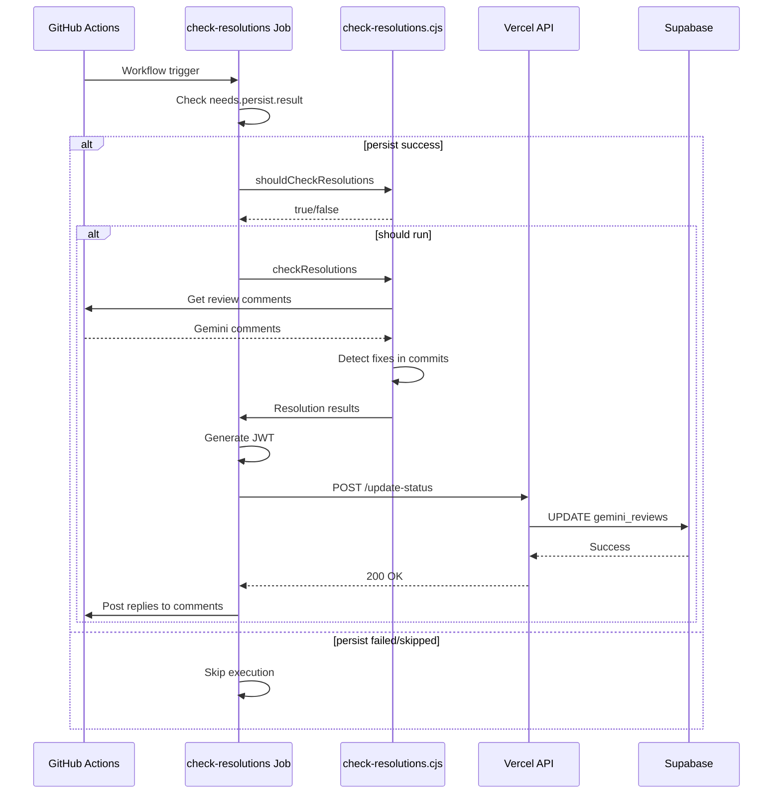

# Especificação Técnica: Sprint 7 - Reply to Comments Integration

> **Status:** ⚠️ REVISÃO NECESSÁRIA - Job já existe
> **Versão:** 1.0.0 | **Data:** 2026-02-24
> **Autor:** Architect Mode

---

## 📋 Sumário Executivo

### Descoberta Importante

Após auditoria completa do código existente, foi identificado que **o job `check-resolutions` JÁ EXISTE** no workflow:

| Entregável | Status | Localização |
|------------|--------|-------------|
| 7.1 Job no Workflow | ✅ JÁ IMPLEMENTADO | [`.github/workflows/gemini-review.yml:1079-1198`](.github/workflows/gemini-review.yml:1079) |
| 7.2 Endpoint Integration | ✅ JÁ IMPLEMENTADO | Job chama `/api/gemini-reviews/update-status` |
| 7.3 Testes E2E | ⚠️ PARCIAL | Testes unitários existem, mas não E2E |

### Ação Real Necessária

O plano original está **desatualizado**. O trabalho real necessário é:

1. **Atualizar documento de plano** para refletir realidade
2. **Adicionar testes E2E** para validar fluxo completo
3. **Verificar condição do job** - Está restrito a `synchronize`, deve ser mais amplo?

---

## 🔍 Análise do Estado Atual

### Job `check-resolutions` Existente

**Arquivo:** [`.github/workflows/gemini-review.yml`](.github/workflows/gemini-review.yml:1079)

```yaml
# Linhas 1079-1198
check-resolutions:
  name: Check Resolution via Vercel API
  runs-on: ubuntu-latest
  needs: [detect, parse]
  # Só executa se parse rodou com sucesso e é trigger por synchronize (novos commits)
  if: always() && needs.parse.result == 'success' && github.event_name == 'pull_request' && github.event.action == 'synchronize'
  env:
    VERCEL_GITHUB_ACTIONS_SECRET: ${{ secrets.VERCEL_GITHUB_ACTIONS_SECRET }}
    VERCEL_API_URL: 'https://dosiq.vercel.app'
```

### Problemas Identificados

| # | Problema | Impacto | Solução |
|---|----------|---------|---------|
| 1 | Condição muito restritiva | Job só roda em `synchronize` | Avaliar se deve rodar após `persist` |
| 2 | Sem dependência no `persist` | Não atualiza após persistir reviews | Adicionar `needs: [detect, parse, persist]` |
| 3 | Testes não cobrem fluxo E2E | Falta validação integrada | Criar testes de integração |

### Fluxo Atual vs. Esperado

```
FLUXO ATUAL:
detect → parse → check-resolutions (apenas em synchronize)

FLUXO ESPERADO (conforme plano):
detect → parse → upload-to-blob → persist → check-resolutions
                                                    ↓
                                          update-status endpoint
```

---

## 📐 Especificação de Mudanças

### Mudança 1: Atualizar Dependências do Job

**Arquivo:** `.github/workflows/gemini-review.yml`
**Linha:** 1082

**Código Atual:**
```yaml
needs: [detect, parse]
```

**Código Proposto:**
```yaml
needs: [detect, parse, persist]
```

**Justificativa:** O job deve executar após os reviews serem persistidos no Supabase para ter dados atualizados.

---

### Mudança 2: Atualizar Condição de Execução

**Arquivo:** `.github/workflows/gemini-review.yml`
**Linha:** 1084

**Código Atual:**
```yaml
if: always() && needs.parse.result == 'success' && github.event_name == 'pull_request' && github.event.action == 'synchronize'
```

**Código Proposto:**
```yaml
if: always() && needs.persist.result == 'success'
```

**Justificativa:** 
- O job deve rodar após `persist` ter sucesso
- Remove restrição de `synchronize` para permitir execução em outros contextos
- Mantém `always()` para garantir execução mesmo se jobs anteriores foram skipped

---

### Mudança 3: Adicionar Testes E2E

**Arquivo Novo:** `.github/scripts/__tests__/check-resolutions.e2e.test.js`

**Estrutura:**
```javascript
/**
 * Testes E2E para o fluxo de check-resolutions
 * 
 * Valida:
 * 1. Job executa após persist com sucesso
 * 2. Endpoint é chamado corretamente
 * 3. Status é atualizado no Supabase
 * 4. Replies são postadas nos comentários
 */

import { describe, it, expect, beforeAll, afterAll, vi } from 'vitest'

describe('check-resolutions E2E', () => {
  describe('Job Execution', () => {
    it('should run after persist job succeeds', async () => {
      // Teste: verificar que job depende de persist
    })

    it('should skip when persist is skipped', async () => {
      // Teste: verificar que job é skipped se persist não rodou
    })
  })

  describe('API Integration', () => {
    it('should call update-status endpoint with correct payload', async () => {
      // Teste: verificar payload enviado ao endpoint
    })

    it('should handle authentication with JWT', async () => {
      // Teste: verificar JWT é gerado corretamente
    })

    it('should handle API errors gracefully', async () => {
      // Teste: verificar tratamento de erro
    })
  })

  describe('Status Updates', () => {
    it('should update status to resolved when fix detected', async () => {
      // Teste: verificar atualização para resolved
    })

    it('should update status to partial when partial fix detected', async () => {
      // Teste: verificar atualização para partial
    })
  })
})
```

---

## 🔄 Fluxo de Dados

### Diagrama de Sequência



### Variáveis de Ambiente Necessárias

| Variável | Origem | Uso |
|----------|--------|-----|
| `VERCEL_GITHUB_ACTIONS_SECRET` | GitHub Secrets | Assinatura JWT |
| `VERCEL_API_URL` | Hardcoded | URL base da API |
| `GITHUB_TOKEN` | GitHub Actions | API GitHub |

---

## 🧪 Estratégia de Testes

### Testes Unitários (Já Existem)

**Arquivo:** [`.github/scripts/__tests__/check-resolutions.test.js`](.github/scripts/__tests__/check-resolutions.test.js)

Cobertura atual:
- ✅ `parseChangedLines`
- ✅ `determineResolutionType`
- ✅ `checkIfLineChanged`
- ✅ `shouldCheckResolutions`
- ✅ `postReplyToComment`

### Testes E2E (A Criar)

**Arquivo:** `.github/scripts/__tests__/check-resolutions.e2e.test.js`

Cenários a testar:

| Cenário | Input | Expected Output |
|---------|-------|-----------------|
| Job executa após persist | `persist.result = success` | Job roda |
| Job pula se persist falhou | `persist.result = failure` | Job skipped |
| Endpoint chamado com JWT | Reviews detectados | POST com header `Authorization: Bearer <jwt>` |
| Status atualizado | Review resolvido | `status = resolved` no Supabase |
| Reply postada | Comentário resolvido | Reply no thread do GitHub |

### Mock Strategy

```javascript
// Mock do GitHub API
vi.mock('@actions/github', () => ({
  context: {
    repo: { owner: 'test-owner', repo: 'test-repo' },
    eventName: 'pull_request',
    action: 'synchronize'
  },
  getOctokit: () => mockOctokit
}))

// Mock do fetch para Vercel API
global.fetch = vi.fn()

// Mock do jose para JWT
vi.mock('jose', () => ({
  SignJWT: class {
    constructor(payload) { this.payload = payload }
    setProtectedHeader() { return this }
    setIssuedAt() { return this }
    setExpirationTime() { return this }
    async sign() { return 'mock-jwt-token' }
  }
}))
```

---

## ✅ Checklist de Validação

### Pré-Implementação

- [x] Verificar se job já existe (CONFIRMADO: existe)
- [x] Verificar se endpoint já existe (CONFIRMADO: existe)
- [x] Verificar se testes unitários existem (CONFIRMADO: existem)
- [ ] Identificar gaps na implementação atual
- [ ] Validar com usuário se mudanças propostas estão corretas

### Pós-Implementação

- [ ] Job depende de `persist`
- [ ] Condição de execução atualizada
- [ ] Testes E2E passando
- [ ] `npm run validate:agent` passando
- [ ] Documentação atualizada

### Critérios de Sucesso

| Critério | Métrica | Validação |
|----------|---------|-----------|
| Job executa corretamente | Roda após persist | GitHub Actions log |
| Endpoint chamado | 200 response | Vercel logs |
| Supabase atualizado | Status correto | Query no banco |
| Testes E2E | 100% passando | Vitest |

---

## 🛡️ Análise de Riscos

### Riscos Identificados

| Risco | Probabilidade | Impacto | Mitigação |
|-------|---------------|---------|-----------|
| Mudança quebrar fluxo existente | Baixa | HIGH | Testar em PR separado |
| JWT expirar durante execução | Baixa | MEDIUM | Timeout de 5min é suficiente |
| Endpoint sobrecarregado | Baixa | LOW | Rate limiting já implementado |
| Falso positivo na detecção | Média | LOW | Revisão manual possível |

### Plano de Rollback

Se a mudança causar problemas:

1. **Reverter PR** - Git revert do commit
2. **Restaurar condição original** - Voltar para `synchronize` apenas
3. **Restaurar dependências originais** - Remover `persist` do `needs`

```bash
# Comando de rollback
git revert <commit-sha>
git push origin main
```

---

## 📝 Notas de Implementação

### Regras de Memória Aplicáveis

| Regra | Aplicação |
|-------|-----------|
| **R-060** | Code agent não pode mergear próprio PR |
| **R-061** | Pausa para review entre tarefas |
| **R-062** | Qualidade sobre velocidade |
| **R-063** | Não pular passos do processo |
| **R-065** | Ler memória antes de codar |

### Fluxo de PR

```
1. Architect cria spec → ESTE DOCUMENTO
2. Code agent implementa mudanças
3. Code agent cria PR: feat/sprint-7/check-resolutions-enhancement
4. Debug agent revisa
5. Gemini Code Assist revisa
6. Usuário aprova
7. DevOps merge (não Code agent)
```

### Branch Naming

```bash
git checkout -b feat/sprint-7/check-resolutions-enhancement
```

### Commit Messages

```
feat(workflow): adiciona dependência do persist no check-resolutions
test(check-resolutions): adiciona testes E2E para fluxo completo
docs(sprint-7): atualiza plano com estado real da implementação
```

---

## 📚 Referências

### Arquivos Relacionados

| Arquivo | Propósito |
|---------|-----------|
| [`.github/workflows/gemini-review.yml`](.github/workflows/gemini-review.yml) | Workflow principal |
| [`.github/scripts/check-resolutions.cjs`](.github/scripts/check-resolutions.cjs) | Script de verificação |
| [`api/gemini-reviews/update-status.js`](api/gemini-reviews/update-status.js) | Endpoint de atualização |
| [`api/gemini-reviews/shared/security.js`](api/gemini-reviews/shared/security.js) | Utilitários de segurança |

### Documentação

| Documento | Localização |
|-----------|-------------|
| Plano Original | [`plans/GEMINI_INTEGRATION_NEXT_PHASES.md`](plans/GEMINI_INTEGRATION_NEXT_PHASES.md) |
| Regras do Projeto | [`.memory/rules.md`](.memory/rules.md) |
| Agent Protocol | [`docs/standards/GEMINI_AGENT_PROTOCOL.md`](docs/standards/GEMINI_AGENT_PROTOCOL.md) |

---

## 🎯 Próximos Passos

### Ações Imediatas

1. **Validar com usuário** se as mudanças propostas estão corretas
2. **Atualizar plano** `GEMINI_INTEGRATION_NEXT_PHASES.md` com estado real
3. **Criar branch** para implementação
4. **Implementar mudanças** no workflow
5. **Criar testes E2E**
6. **Criar PR** seguindo fluxo definido

### Perguntas para o Usuário

1. O job deve rodar apenas após `persist` ou também em outros contextos?
2. A restrição de `synchronize` deve ser mantida ou removida?
3. Os testes E2E devem mockar o Supabase ou usar um banco de teste?

---

*Última atualização: 2026-02-24*
*Versão do documento: 1.0.0*
*Status: Aguardando validação do usuário*
