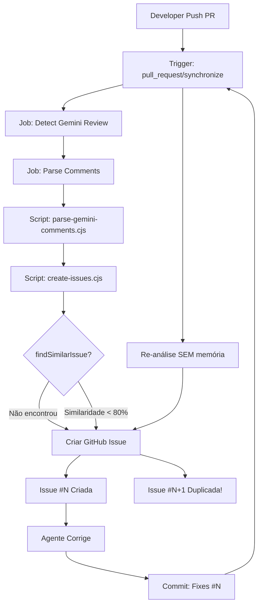
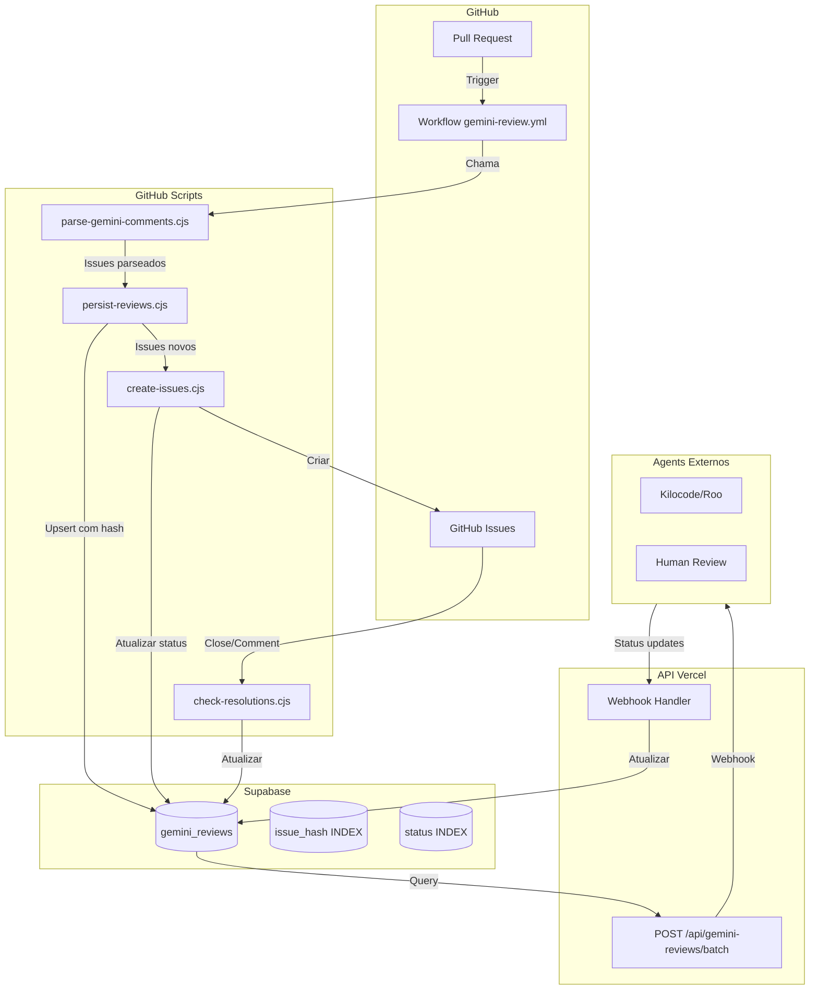
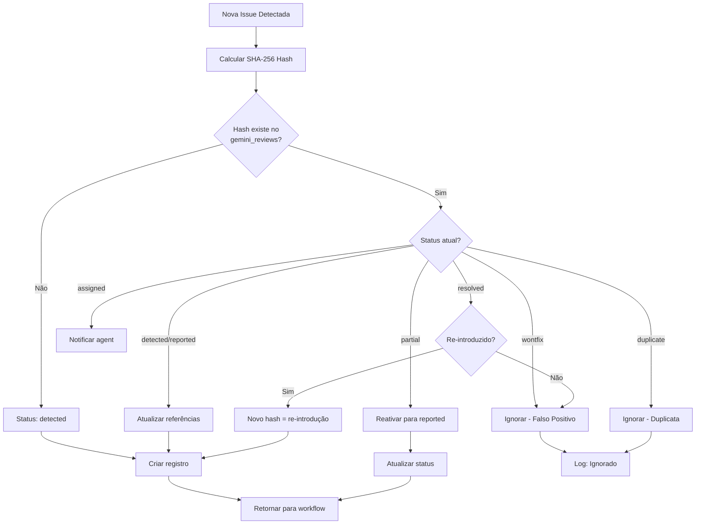
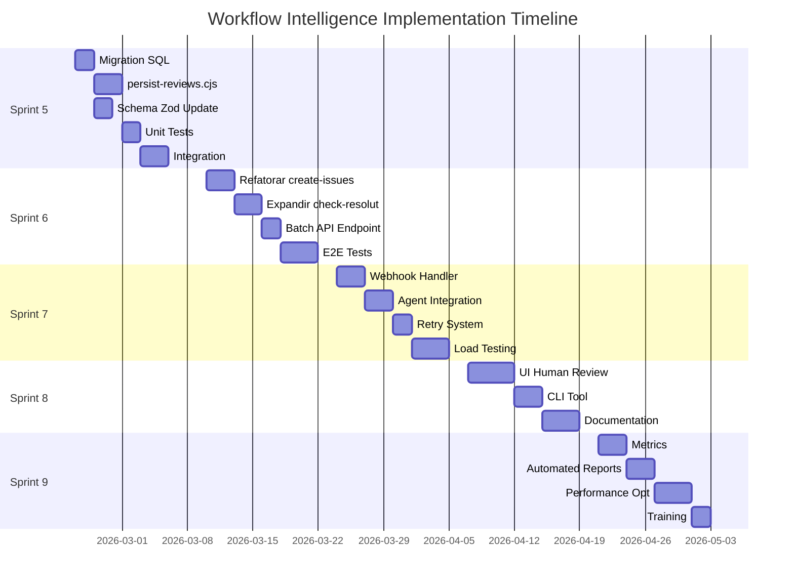
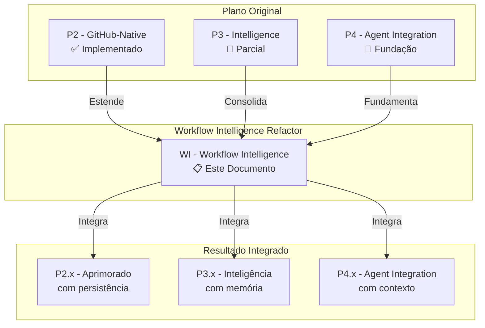
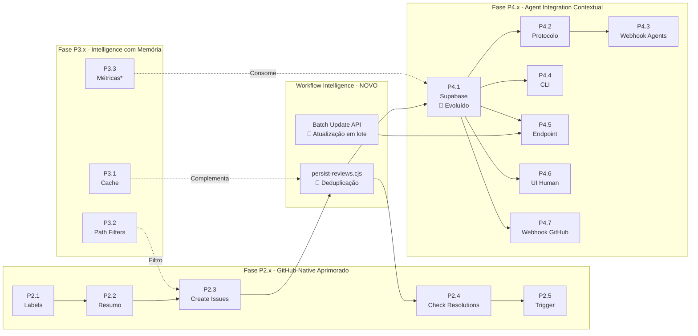
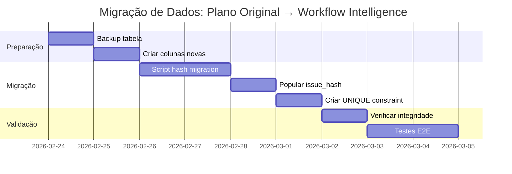
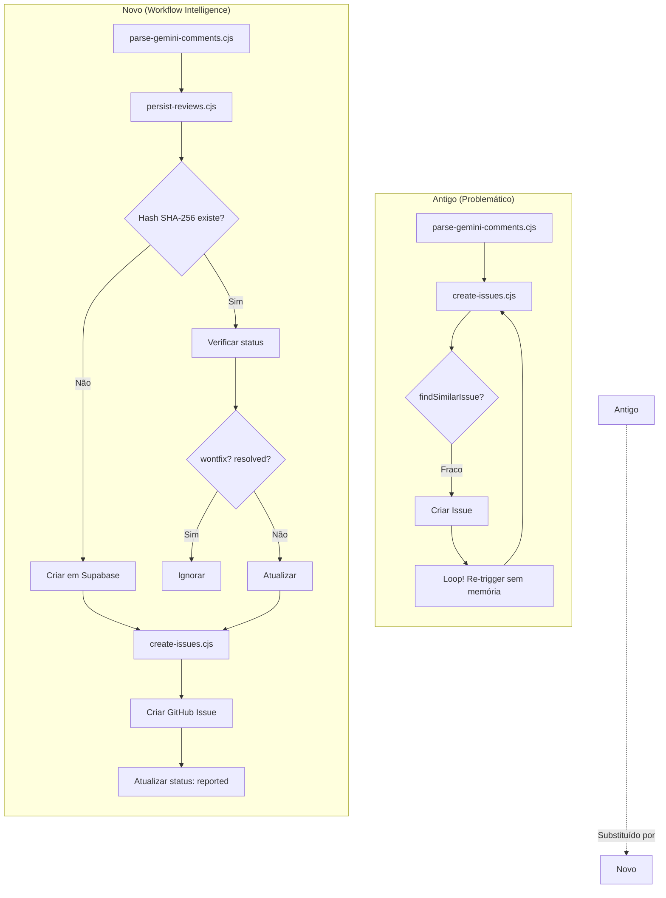

# Workflow Intelligence Refactor

> **Documento de Especificação Técnica - Fase 2 do Sistema Gemini Integration**
> **Versão:** 2.0.0 | **Data:** 2026-02-22
> **Status:** 📋 Especificação Completa para Implementação
> **Prioridade:** CRITICAL
> **Autor:** Architect Mode

---

## 📋 Sumário Executivo

Este documento especifica a refatoração completa do sistema de integração com o Gemini Code Assist para resolver problemas críticos de **loops circulares**, **duplicação de issues** e **re-trigger sem memória** identificados nos PRs #120, #121, #122, #123.

### Problema Central: Loop Circular de Issues

```
┌─────────────────────────────────────────────────────────────────┐
│                    LOOP CIRCULAR ATUAL                          │
├─────────────────────────────────────────────────────────────────┤
│                                                                 │
│  1. Developer push PR #120                                      │
│         │                                                       │
│         ▼                                                       │
│  2. Workflow detecta review do Gemini                           │
│         │                                                       │
│         ▼                                                       │
│  3. create-issues.cjs executa → Cria Issue #121                 │
│         │                                                       │
│         ▼                                                       │
│  4. Agente corrige → commit "Fixes #121"                        │
│         │                                                       │
│         ▼                                                       │
│  5. synchronize dispara re-análise → Cria Issue #123            │
│         │   (MESMA sugestão, mesmo código!)                     │
│         ▼                                                       │
│  6. NOVO commit → NOVA issue → loop infinito                    │
│                                                                 │
│  Resultado: Backlog poluído com 2-3 issues duplicadas/PR        │
│                                                                 │
└─────────────────────────────────────────────────────────────────┘
```

### Issues de Referência

| Issue | Descrição | Causa Raiz | Status |
|-------|-----------|------------|--------|
| #121 | Valor `resolved_by` não conforme schema UUID | Exemplo incorreto na documentação | 🔴 HIGH |
| #122 | Falta validação JSON Schema nos testes | Testes apenas sintáticos, não semânticos | 🟡 MEDIUM |
| #123 | Duplicata da issue #121 | Deduplicação insuficiente | 🔴 HIGH |
| PR #120 | Documentação com inconsistências | Review incompleto de exemplos | 🟡 MEDIUM |

### Solução Proposta

Implementar um **sistema de hash SHA-256** com **estados expandidos** e **persistência em Supabase** para eliminar loops circulares e duplicações.

---

## 🔍 Diagnóstico Detalhado

### 1.1 Análise do Sistema Atual

#### 1.1.1 Fluxo de Dados Atual (Problemático)



#### 1.1.2 Problema na Deduplicação Atual

O script [`create-issues.cjs`](.github/scripts/create-issues.cjs:1) usa uma lógica fraca de similaridade:

```javascript
// ❌ PROBLEMA: Lógica de deduplicação insuficiente
// .github/scripts/create-issues.cjs (trecho problemático)

function findSimilarIssue(newIssue, existingIssues) {
  for (const existing of existingIssues) {
    // Compara apenas arquivo + linha
    if (existing.file === newIssue.file && 
        existing.line === newIssue.line) {
      // Similaridade de texto simples (80% threshold)
      const similarity = calculateSimilarity(
        existing.issue, 
        newIssue.issue
      );
      if (similarity > 0.8) {
        return existing; // Match encontrado
      }
    }
  }
  return null;
}
```

**Problemas identificados:**
1. **Falso negativo**: Mesma issue em linha diferente (código movido) = duplicata
2. **Falso positivo**: Issues diferentes na mesma linha = ignoradas
3. **Sem persistência**: Issues só comparadas no contexto do PR atual
4. **Não considera**: Resoluções anteriores (wontfix, resolved)

#### 1.1.3 Separação de Estados

O workflow atual não persiste estado no banco:

```javascript
// ❌ PROBLEMA: Estados voláteis
// Workflow YAML atual salva apenas em arquivo JSON temporário

- name: Save Review Data
  run: |
    echo '${{ steps.parse.outputs.review_data }}' > review.json
    # Arquivo perdido após job terminar!
```

Isso significa que:
- Não há rastreamento de qual issue já foi criada
- Não há histórico de resoluções
- Cada PR é processado como "primeira vez"

#### 1.1.4 Re-trigger sem Checkpoint

O evento `synchronize` (novo commit) dispara análise completa:

```yaml
# ❌ PROBLEMA: Re-trigger sem memória
# .github/workflows/gemini-review.yml

on:
  pull_request:
    types: [synchronize]  # Dispara em CADA novo commit
```

Sem verificar:
- Quais issues já foram resolvidas
- Quais foram marcadas como `wontfix`
- Se houve mudança real no código afetado

### 1.2 Causas Raiz Consolidadas

| Problema | Severidade | Localização | Impacto |
|----------|------------|-------------|---------|
| **Deduplicação incompleta** | CRITICAL | `create-issues.cjs` usa apenas arquivo+linha | Issues duplicadas |
| **Separação de estados** | HIGH | Workflow não persiste em `gemini_reviews` | Sem memória entre runs |
| **Re-trigger sem checkpoint** | HIGH | `synchronize` dispara análise completa | Loop circular |
| **Agents criando issues** | MEDIUM | Fora do fluxo de deduplicação | Duplicatas externas |
| **Validação de schema ausente** | MEDIUM | Testes não usam JSON Schema | Inconsistências |

---

## 🔗 Integração com Sistema Existente

### 2.1 Mapeamento: Proposta ↔ Plano Original

| Componente da Proposta | Origem no Sistema Atual | Decisão de Design |
|------------------------|------------------------|-------------------|
| Sistema de Hash (`issue_hash`) | Evolução da tabela `gemini_reviews` | **UPGRADE** - Adicionar campo UNIQUE hash |
| Script `persist-reviews.cjs` | Integração de parsing + storage | **NOVO** - Workflow salva em Supabase |
| Estados Expandidos (8 estados) | Evolução dos 4 status atuais | **EXPANDIR** - Granularidade maior |
| `check-resolutions.cjs` melhorado | Script existente de resolução | **EXPANDIR** - Atualizar Supabase também |
| Webhook com `review_ids` | Sistema atual de notificação | **ENRIQUECER** - Payload com IDs específicos |
| Batch Update API | Não existia | **NOVO** - Endpoint para atualização em lote |

### 2.2 Componentes que Continuam Válidos

#### Sem Mudanças Necessárias

| Componente | Localização | Justificativa |
|------------|-------------|---------------|
| Labels Automáticas | `.github/scripts/apply-labels.cjs` | Funciona independentemente |
| Resumo Editável | `.github/scripts/post-smart-summary.cjs` | Não precisa de alterações |
| Path Filters | `.github/workflows/gemini-review.yml` | Configuração YAML continua válida |
| UI Human Review | `src/views/admin/DLQAdmin.jsx` | Interface complementar |
| Estrutura de Fases | Documentação existente | Sequência lógica mantida |

#### Complementares

| Componente | Função | Relação com Workflow Intelligence |
|------------|--------|-----------------------------------|
| Cache de Reviews (P3.1) | Cache de arquivo | Performance ≠ Deduplicação (diferentes objetivos) |
| Notificação Telegram | Alertas | Consumirá dados do novo sistema |

### 2.3 O Que Precisa Ser Ajustado

#### 2.3.1 Schema `gemini_reviews` - UPGRADE NECESSÁRIO

**Estado Atual:**
```sql
-- Schema atual (simplificado)
CREATE TABLE gemini_reviews (
  id UUID PRIMARY KEY,
  pr_number INTEGER,
  file_path TEXT,
  line_start INTEGER,
  status TEXT CHECK (status IN ('pendente', 'em_progresso', 'corrigido', 'descartado')),
  issue_hash TEXT,  -- Existe mas não é UNIQUE
  review_data JSONB
);
```

**Upgrade Necessário:**
```sql
-- ALTER TABLE para Workflow Intelligence
ALTER TABLE gemini_reviews 
  ADD COLUMN IF NOT EXISTS issue_hash TEXT UNIQUE,  -- Agora UNIQUE
  ADD COLUMN IF NOT EXISTS github_issue_number INTEGER,
  ADD COLUMN IF NOT EXISTS resolution_type TEXT CHECK (
    resolution_type IN ('fixed', 'rejected', 'partial', null)
  ),
  -- Expandir CHECK constraint de status
  DROP CONSTRAINT IF EXISTS gemini_reviews_status_check,
  ADD CONSTRAINT gemini_reviews_status_check CHECK (
    status IN ('detected', 'reported', 'assigned', 'resolved', 'partial', 'wontfix', 'duplicate')
  );
```

#### 2.3.2 Estados do Protocolo - EXPANDIR

**De:** 4 estados simples
```
pendente → em_progresso → corrigido/descartado
```

**Para:** 7 estados granulares
```
detected → reported → assigned → resolved/partial/wontfix/duplicate
```

| Estado | Descrição | Transições Permitidas |
|--------|-----------|----------------------|
| `detected` | Issue detectada pelo Gemini, ainda não processada | reported |
| `reported` | Issue reportada ao GitHub (issue criada) | assigned, duplicate, wontfix |
| `assigned` | Issue atribuída a um agent | resolved, partial, wontfix |
| `resolved` | Issue completamente resolvida | - (final) |
| `partial` | Parcialmente resolvida (alguns pontos pendentes) | reported (reativar) |
| `wontfix` | Será ignorada (falso positivo) | - (final) |
| `duplicate` | Duplicata de outra issue | - (final) |

#### 2.3.3 `create-issues.cjs` - REFATORAR

**Remover:**
- Função `findSimilarIssue()` - Lógica fraca de similaridade
- Comparação baseada em arquivo+linha+80% texto

**Substituir por:**
- `checkExistingHash()` - Deduplicação por SHA-256
- Query no Supabase: `SELECT * FROM gemini_reviews WHERE issue_hash = $1`

#### 2.3.4 `check-resolutions.cjs` - EXPANDIR Escopo

**Original:** Responder em threads de comentários
**Expandido:** 
- Responder em threads
- Atualizar Supabase ao detectar "Fixes #X"
- Verificar resolução parcial vs completa

#### 2.3.5 Webhook - ENRIQUECER Payload

**Adicionar ao payload de notificação:**
```json
{
  "event": "gemini_review_ready",
  "pr_number": 120,
  "review_ids": ["uuid-1", "uuid-2"],  // NOVO: IDs específicos
  "issue_hashes": ["sha256-1", "sha256-2"],  // NOVO: Hashes para deduplicação
  "timestamp": "2026-02-22T16:00:00Z"
}
```

### 2.4 O Que Deve Ser Cancelado/Removido

| Item | Razão | Substituto |
|------|-------|------------|
| `findSimilarIssue()` em `create-issues.cjs` | Lógica fraca de similaridade | `checkExistingHash()` por SHA-256 |
| Estado `pendente` genérico | Muito ambíguo | Estados granulares: detected, reported, etc. |
| `review_data` JSONB como única fonte | Dados duplicados, sem índice | Campos normalizados + JSONB para dados brutos |
| Cache de arquivo em `.gemini-cache/` | Persistência frágil | Supabase como source of truth |

---

## 🏗️ Arquitetura da Solução

### 3.1 Visão Geral



### 3.2 Sistema de Hash SHA-256

#### 3.2.1 Cálculo do `issue_hash`

O hash deve ser determinístico e baseado em campos imutáveis da issue:

```javascript
// scripts/persist-reviews.cjs

const crypto = require('crypto');

/**
 * Calcula hash único para uma issue do Gemini
 * 
 * Campos incluídos no hash (imutáveis):
 * - file_path: Caminho do arquivo
 * - line_start: Linha inicial
 * - line_end: Linha final
 * - title: Título da issue
 * - description: Descrição detalhada
 * 
 * Campos EXCLUÍDOS do hash (mutáveis):
 * - created_at: Timestamp varia
 * - updated_at: Timestamp varia
 * - status: Estado muda
 * - resolved_by: Depende de quem resolve
 * - github_issue_number: Atribuído depois
 * 
 * @param {Object} issue - Dados da issue
 * @returns {string} Hash SHA-256 (64 caracteres hex)
 */
function calculateIssueHash(issue) {
  const content = JSON.stringify({
    file_path: issue.file_path,
    line_start: issue.line_start,
    line_end: issue.line_end,
    title: issue.title,
    description: issue.description,
    // Normalizar para garantir determinismo
    suggestion: issue.suggestion?.trim() || null
  }, null, 0); // null, 0 = sem espaços para consistência
  
  return crypto
    .createHash('sha256')
    .update(content)
    .digest('hex');
}

/**
 * Verifica se uma issue já existe no banco
 * 
 * @param {string} issueHash - Hash SHA-256 da issue
 * @param {Object} supabase - Cliente Supabase
 * @returns {Promise<Object|null>} Issue existente ou null
 */
async function checkExistingHash(issueHash, supabase) {
  const { data, error } = await supabase
    .from('gemini_reviews')
    .select('id, status, github_issue_number, created_at')
    .eq('issue_hash', issueHash)
    .maybeSingle();
  
  if (error) {
    console.error('Erro ao verificar hash:', error);
    throw error;
  }
  
  return data;
}

module.exports = { calculateIssueHash, checkExistingHash };
```

#### 3.2.2 Fluxo de Deduplicação



### 3.3 Script `persist-reviews.cjs`

Novo script responsável por persistir reviews no Supabase com deduplicação inteligente:

```javascript
#!/usr/bin/env node
/**
 * Persist Reviews - Workflow Intelligence
 * 
 * Persiste reviews do Gemini no Supabase com deduplicação por hash.
 * Este é o ponto central do sistema de Workflow Intelligence.
 * 
 * @module persist-reviews
 * @version 2.0.0
 * @requires @supabase/supabase-js
 */

const { createClient } = require('@supabase/supabase-js');
const crypto = require('crypto');

// Configuração
const SUPABASE_URL = process.env.SUPABASE_URL;
const SUPABASE_SERVICE_ROLE_KEY = process.env.SUPABASE_SERVICE_ROLE_KEY;

if (!SUPABASE_URL || !SUPABASE_SERVICE_ROLE_KEY) {
  console.error('❌ Variáveis de ambiente SUPABASE_URL e SUPABASE_SERVICE_ROLE_KEY são obrigatórias');
  process.exit(1);
}

const supabase = createClient(SUPABASE_URL, SUPABASE_SERVICE_ROLE_KEY);

/**
 * Resultado da persistência
 * @typedef {Object} PersistResult
 * @property {number} created - Quantidade de issues criadas
 * @property {number} updated - Quantidade de issues atualizadas
 * @property {number} skipped - Quantidade ignoradas (duplicatas/falso positivo)
 * @property {number} reactivated - Quantidade reativadas (resolved → detected)
 * @property {Array<string>} errors - Erros encontrados
 * @property {Array<Object>} createdIssues - Issues criadas (com IDs)
 */

/**
 * Persiste reviews do Gemini com deduplicação por hash
 * 
 * @param {Object} reviewData - Dados do review parseado
 * @param {number} reviewData.pr_number - Número do PR
 * @param {string} reviewData.commit_sha - SHA do commit
 * @param {Array<Object>} reviewData.issues - Lista de issues
 * @param {Object} options - Opções de processamento
 * @param {boolean} [options.dryRun=false] - Simulação sem persistir
 * @returns {Promise<PersistResult>} Resultado da persistência
 */
async function persistReviews(reviewData, options = {}) {
  const { pr_number, commit_sha, issues = [] } = reviewData;
  const { dryRun = false } = options;
  
  console.log(`🔄 Persistindo ${issues.length} issues para PR #${pr_number}...`);
  
  /** @type {PersistResult} */
  const results = {
    created: 0,
    updated: 0,
    skipped: 0,
    reactivated: 0,
    errors: [],
    createdIssues: []
  };

  for (const issue of issues) {
    try {
      const issueHash = calculateIssueHash(issue);
      
      // Verificar se issue já existe
      const existing = await checkExistingHash(issueHash, supabase);

      if (existing) {
        const action = await handleExistingIssue(existing, issue, pr_number, commit_sha, dryRun);
        
        switch (action) {
          case 'skipped':
            results.skipped++;
            console.log(`  ⏭️  Skipped (hash: ${issueHash.substring(0, 16)}...)`);
            break;
          case 'updated':
            results.updated++;
            console.log(`  📝 Updated (id: ${existing.id})`);
            break;
          case 'reactivated':
            results.reactivated++;
            console.log(`  🔄 Reactivated (id: ${existing.id})`);
            break;
        }
        continue;
      }

      // Criar nova issue
      if (!dryRun) {
        const newIssue = await createNewIssue(issue, issueHash, pr_number, commit_sha);
        results.created++;
        results.createdIssues.push(newIssue);
        console.log(`  ✅ Created (id: ${newIssue.id}, hash: ${issueHash.substring(0, 16)}...)`);
      } else {
        results.created++;
        console.log(`  [DRY RUN] Would create issue with hash: ${issueHash.substring(0, 16)}...`);
      }
      
    } catch (error) {
      console.error(`  ❌ Error processing issue "${issue.title}":`, error.message);
      results.errors.push({ 
        issue: issue.title, 
        error: error.message,
        stack: error.stack 
      });
    }
  }

  // Log resumido
  console.log('\n📊 Resumo:');
  console.log(`   Criadas: ${results.created}`);
  console.log(`   Atualizadas: ${results.updated}`);
  console.log(`   Ignoradas: ${results.skipped}`);
  console.log(`   Reativadas: ${results.reactivated}`);
  console.log(`   Erros: ${results.errors.length}`);

  return results;
}

/**
 * Calcula hash SHA-256 para uma issue
 * 
 * @param {Object} issue - Dados da issue
 * @returns {string} Hash SHA-256 (64 caracteres hexadecimais)
 */
function calculateIssueHash(issue) {
  const content = JSON.stringify({
    file_path: issue.file_path || issue.file,
    line_start: issue.line_start || issue.line,
    line_end: issue.line_end || issue.line,
    title: issue.title || issue.issue?.substring(0, 100) || 'Untitled',
    description: issue.description || issue.issue || '',
    suggestion: issue.suggestion?.trim() || null
  }, Object.keys({}).sort()); // Ordenar chaves para consistência
  
  return crypto
    .createHash('sha256')
    .update(content)
    .digest('hex');
}

/**
 * Verifica se uma issue já existe no banco
 * 
 * @param {string} issueHash - Hash SHA-256
 * @returns {Promise<Object|null>} Registro existente ou null
 */
async function checkExistingHash(issueHash) {
  const { data, error } = await supabase
    .from('gemini_reviews')
    .select('id, status, github_issue_number, created_at, updated_at')
    .eq('issue_hash', issueHash)
    .maybeSingle();
  
  if (error) {
    console.error('Erro ao verificar hash:', error);
    throw error;
  }
  
  return data;
}

/**
 * Decide ação para issue existente
 * 
 * @param {Object} existing - Registro existente
 * @param {Object} newIssue - Nova issue detectada
 * @param {number} prNumber - Número do PR
 * @param {string} commitSha - SHA do commit
 * @param {boolean} dryRun - Modo simulação
 * @returns {Promise<string>} Ação: 'skipped', 'updated', 'reactivated'
 */
async function handleExistingIssue(existing, newIssue, prNumber, commitSha, dryRun) {
  const { id, status } = existing;
  
  // Estados finais - ignorar
  const finalStatuses = ['wontfix', 'duplicate'];
  if (finalStatuses.includes(status)) {
    return 'skipped';
  }
  
  // Resolvida - verificar se é re-introdução
  if (status === 'resolved') {
    // Se chegou aqui com mesmo hash, é código idêntico = re-introdução
    if (!dryRun) {
      await supabase
        .from('gemini_reviews')
        .update({
          status: 'detected',
          pr_number: prNumber,
          commit_sha: commitSha,
          updated_at: new Date().toISOString(),
          resolution_type: null,
          resolved_by: null,
          resolved_at: null
        })
        .eq('id', id);
    }
    return 'reactivated';
  }
  
  // Parcial - reativar para reported
  if (status === 'partial') {
    if (!dryRun) {
      await supabase
        .from('gemini_reviews')
        .update({
          status: 'reported',
          pr_number: prNumber,
          commit_sha: commitSha,
          updated_at: new Date().toISOString()
        })
        .eq('id', id);
    }
    return 'reactivated';
  }
  
  // Detected/reported/assigned - atualizar referências
  if (!dryRun) {
    await supabase
      .from('gemini_reviews')
      .update({
        pr_number: prNumber,
        commit_sha: commitSha,
        updated_at: new Date().toISOString()
      })
      .eq('id', id);
  }
  return 'updated';
}

/**
 * Cria nova issue no Supabase
 * 
 * @param {Object} issue - Dados da issue
 * @param {string} issueHash - Hash SHA-256
 * @param {number} prNumber - Número do PR
 * @param {string} commitSha - SHA do commit
 * @returns {Promise<Object>} Issue criada
 */
async function createNewIssue(issue, issueHash, prNumber, commitSha) {
  const insertData = {
    pr_number: prNumber,
    commit_sha: commitSha,
    file_path: issue.file_path || issue.file,
    line_start: issue.line_start || issue.line || null,
    line_end: issue.line_end || issue.line || null,
    issue_hash: issueHash,
    status: 'detected',
    priority: mapPriority(issue.priority),
    category: mapCategory(issue.category),
    title: issue.title || issue.issue?.substring(0, 200) || 'Sem título',
    description: issue.description || issue.issue || '',
    suggestion: issue.suggestion || null,
    review_data: issue
  };
  
  const { data, error } = await supabase
    .from('gemini_reviews')
    .insert(insertData)
    .select()
    .single();

  if (error) {
    // Tratar violação de UNIQUE constraint
    if (error.code === '23505') {
      throw new Error(`Hash collision detectado: ${issueHash}`);
    }
    throw error;
  }
  
  return data;
}

/**
 * Mapeia prioridade do Gemini para formato do banco
 * 
 * @param {string} priority - Prioridade do Gemini
 * @returns {string} Prioridade mapeada
 */
function mapPriority(priority) {
  const map = {
    'CRITICAL': 'critica',
    'HIGH': 'alta',
    'MEDIUM': 'media',
    'LOW': 'baixa',
    'critical': 'critica',
    'high': 'alta',
    'medium': 'media',
    'low': 'baixa'
  };
  return map[priority] || 'media';
}

/**
 * Mapeia categoria do Gemini para formato do banco
 * 
 * @param {string} category - Categoria do Gemini
 * @returns {string} Categoria mapeada
 */
function mapCategory(category) {
  const map = {
    'style': 'estilo',
    'bug': 'bug',
    'security': 'seguranca',
    'performance': 'performance',
    'maintainability': 'manutenibilidade',
    'refactoring': 'manutenibilidade',
    'best-practice': 'manutenibilidade'
  };
  return map[category?.toLowerCase()] || 'geral';
}

// CLI Interface
if (require.main === module) {
  const args = process.argv.slice(2);
  const reviewFile = args[0];
  const dryRun = args.includes('--dry-run');
  
  if (!reviewFile) {
    console.error('❌ Uso: node persist-reviews.cjs <review-json-file> [--dry-run]');
    console.error('');
    console.error('Exemplo:');
    console.error('  node persist-reviews.cjs review-data.json');
    console.error('  node persist-reviews.cjs review-data.json --dry-run');
    process.exit(1);
  }
  
  try {
    const reviewData = require(`./${reviewFile}`);
    persistReviews(reviewData, { dryRun })
      .then(results => {
        console.log('\n✅ Persistência concluída');
        process.exit(results.errors.length > 0 ? 1 : 0);
      })
      .catch(error => {
        console.error('\n❌ Erro fatal:', error);
        process.exit(1);
      });
  } catch (error) {
    console.error(`❌ Erro ao carregar arquivo ${reviewFile}:`, error.message);
    process.exit(1);
  }
}

module.exports = { 
  persistReviews, 
  calculateIssueHash, 
  checkExistingHash 
};
```

### 3.4 Refatoração de `create-issues.cjs`

```javascript
/**
 * Create Issues - Workflow Intelligence v2.0
 * 
 * Cria GitHub Issues para reviews MEDIUM com deduplicação via Supabase.
 * Integração com persist-reviews.cjs para eliminar duplicatas.
 * 
 * @module create-issues
 * @version 2.0.0
 * @requires ./persist-reviews.cjs
 */

const { persistReviews } = require('./persist-reviews.cjs');
const { createClient } = require('@supabase/supabase-js');

const supabase = createClient(
  process.env.SUPABASE_URL,
  process.env.SUPABASE_SERVICE_ROLE_KEY
);

// Labels para issues de refactoring
const REFACTOR_LABELS = {
  GEMINI_REFACTOR: '🤖 gemini-refactor',
  REFACTORING: 'refactoring',
  TECH_DEBT: 'tech-debt'
};

/**
 * Cria GitHub Issues para reviews MEDIUM não-auto-fixable
 * COM deduplicação via hash no Supabase
 * 
 * @param {Object} reviewData - Dados do review
 * @param {number} prNumber - Número do PR
 * @param {Object} github - Cliente GitHub
 * @param {Object} context - Contexto do GitHub Actions
 * @returns {Promise<number[]>} Números das issues criadas
 */
async function createIssuesFromReview(reviewData, prNumber, github, context) {
  console.log(`🔄 Criando issues para PR #${prNumber}...`);
  
  // 1. PRIMEIRO: Persistir reviews no Supabase (com deduplicação)
  console.log('  Passo 1: Persistindo no Supabase...');
  const persistResult = await persistReviews(reviewData, { 
    pr_number: prNumber,
    commit_sha: reviewData.commit_sha 
  });
  
  console.log(`  Resultado: ${persistResult.created} criadas, ${persistResult.updated} atualizadas, ${persistResult.skipped} ignoradas`);
  
  // 2. Buscar issues que precisam ser criadas no GitHub
  // Apenas: status='detected' + priority='media' + sem github_issue_number
  console.log('  Passo 2: Buscando issues pendentes...');
  const { data: pendingIssues, error } = await supabase
    .from('gemini_reviews')
    .select('*')
    .eq('pr_number', prNumber)
    .eq('status', 'detected')
    .eq('priority', 'media')
    .is('github_issue_number', null)
    .limit(10); // Limitar para não sobrecarregar
  
  if (error) {
    console.error('Erro ao buscar issues pendentes:', error);
    throw error;
  }
  
  if (!pendingIssues || pendingIssues.length === 0) {
    console.log('  ℹ️  Nenhuma issue pendente para criar');
    return [];
  }
  
  console.log(`  ${pendingIssues.length} issues pendentes encontradas`);
  
  // 3. Criar issues no GitHub
  const createdIssues = [];
  for (const issue of pendingIssues) {
    try {
      console.log(`  Criando issue: ${issue.title.substring(0, 50)}...`);
      
      const githubIssue = await createGitHubIssue(issue, prNumber, github, context);
      
      // 4. Atualizar Supabase com referência
      await supabase
        .from('gemini_reviews')
        .update({
          status: 'reported',
          github_issue_number: githubIssue.number,
          updated_at: new Date().toISOString()
        })
        .eq('id', issue.id);
      
      createdIssues.push(githubIssue.number);
      console.log(`    ✅ Issue #${githubIssue.number} criada`);
      
    } catch (error) {
      console.error(`    ❌ Erro ao criar issue para ${issue.title}:`, error.message);
    }
  }
  
  console.log(`\n✅ ${createdIssues.length} issues criadas no GitHub`);
  return createdIssues;
}

/**
 * Cria uma issue no GitHub
 * 
 * @param {Object} issue - Dados da issue do Supabase
 * @param {number} prNumber - Número do PR
 * @param {Object} github - Cliente GitHub
 * @param {Object} context - Contexto
 * @returns {Promise<Object>} Issue criada
 */
async function createGitHubIssue(issue, prNumber, github, context) {
  const { owner, repo } = context.repo;
  
  // Construir corpo da issue
  const body = buildIssueBody(issue, prNumber);
  
  // Criar issue
  const { data: githubIssue } = await github.rest.issues.create({
    owner,
    repo,
    title: `[Refactor] ${issue.title}`,
    body: body,
    labels: [
      REFACTOR_LABELS.GEMINI_REFACTOR,
      REFACTOR_LABELS.REFACTORING,
      `priority:${issue.priority}`
    ]
  });
  
  // Comentar no PR linkando a issue
  await github.rest.issues.createComment({
    owner,
    repo,
    issue_number: prNumber,
    body: `🤖 **Gemini Code Assist** criou issue #${githubIssue.number} para tracking desta sugestão de refactoring.`
  });
  
  return githubIssue;
}

/**
 * Constrói o corpo da issue no GitHub
 * 
 * @param {Object} issue - Dados da issue
 * @param {number} prNumber - Número do PR
 * @returns {string} Corpo formatado em Markdown
 */
function buildIssueBody(issue, prNumber) {
  const lines = [
    `## 📋 Sugestão de Refactoring`,
    ``,
    `**Detectado em:** PR #${prNumber}`,
    `**Arquivo:** \`${issue.file_path}\``,
    `**Linhas:** ${issue.line_start}-${issue.line_end}`,
    `**Categoria:** ${issue.category}`,
    `**Prioridade:** ${issue.priority}`,
    `**Hash:** \`${issue.issue_hash?.substring(0, 16)}...\``,
    ``,
    `### Descrição`,
    issue.description,
    ``,
    `### Sugestão`,
    '```javascript',
    issue.suggestion || 'Nenhuma sugestão específica',
    '```',
    ``,
    `---`,
    `*Esta issue foi criada automaticamente pelo Gemini Code Assist. O hash único garante que não haverá duplicatas.*`,
    `*Para reabrir após correção parcial, use o comando "/gemini reopen".*`
  ];
  
  return lines.join('\n');
}

module.exports = { createIssuesFromReview };
```

---

## 🗄️ Schema e Migration

### 4.1 Migration SQL Completa

```sql
-- .migrations/20260222_workflow_intelligence_refactor.sql
-- ============================================
-- Workflow Intelligence Refactor Migration
-- Versão: 2.0.0
-- Data: 2026-02-22
-- Autor: Architect
-- ============================================

-- ============================================
-- PARTE 1: Backup dos dados existentes
-- ============================================

-- Criar tabela de backup
CREATE TABLE IF NOT EXISTS gemini_reviews_backup_20260222 AS 
SELECT * FROM gemini_reviews;

-- Registrar quantidade de registros
DO $$
DECLARE
  backup_count INTEGER;
BEGIN
  SELECT COUNT(*) INTO backup_count FROM gemini_reviews_backup_20260222;
  RAISE NOTICE 'Backup criado com % registros', backup_count;
END $$;

-- ============================================
-- PARTE 2: Adicionar novos campos
-- ============================================

-- Adicionar issue_hash com UNIQUE constraint
ALTER TABLE gemini_reviews
  ADD COLUMN IF NOT EXISTS issue_hash TEXT,
  ADD COLUMN IF NOT EXISTS github_issue_number INTEGER,
  ADD COLUMN IF NOT EXISTS resolution_type TEXT,
  ADD COLUMN IF NOT EXISTS resolved_by TEXT,
  ADD COLUMN IF NOT EXISTS resolved_at TIMESTAMPTZ;

-- Criar UNIQUE constraint no hash (após popular dados)
-- Nota: Só pode ser aplicado se não houver duplicatas
-- ALTER TABLE gemini_reviews ADD CONSTRAINT unique_issue_hash UNIQUE (issue_hash);

-- ============================================
-- PARTE 3: Migrar dados existentes
-- ============================================

-- Atualizar registros existentes com hash baseado nos dados
-- Isso precisa ser feito via script Node.js para calcular SHA-256
-- O script scripts/migrate-hashes.cjs deve ser executado

-- Comentário para documentação
COMMENT ON COLUMN gemini_reviews.issue_hash IS 
  'SHA-256 hash do conteúdo da issue para deduplicação determinística';

COMMENT ON COLUMN gemini_reviews.github_issue_number IS 
  'Número da issue correspondente no GitHub';

COMMENT ON COLUMN gemini_reviews.resolution_type IS 
  'Tipo de resolução: fixed, rejected, partial';

COMMENT ON COLUMN gemini_reviews.resolved_by IS 
  'UUID do agent ou usuário que resolveu';

COMMENT ON COLUMN gemini_reviews.resolved_at IS 
  'Timestamp de resolução';

-- ============================================
-- PARTE 4: Atualizar CHECK constraint de status
-- ============================================

-- Remover constraint antiga (se existir)
ALTER TABLE gemini_reviews 
  DROP CONSTRAINT IF EXISTS gemini_reviews_status_check;

-- Adicionar nova constraint com estados expandidos
ALTER TABLE gemini_reviews
  ADD CONSTRAINT gemini_reviews_status_check 
  CHECK (status IN (
    'detected',      -- Detectado pelo Gemini
    'reported',      -- Reportado ao GitHub (issue criada)
    'assigned',      -- Atribuído a agent
    'resolved',      -- Completamente resolvido
    'partial',       -- Parcialmente resolvido
    'wontfix',       -- Ignorado/falso positivo
    'duplicate',     -- Duplicata
    -- Estados legados (para compatibilidade)
    'pendente',
    'em_progresso', 
    'corrigido',
    'descartado'
  ));

-- ============================================
-- PARTE 5: Criar índices de performance
-- ============================================

-- Índice para busca por hash (único após migração)
CREATE INDEX IF NOT EXISTS idx_gemini_reviews_issue_hash 
  ON gemini_reviews(issue_hash);

-- Índice para busca por issue do GitHub
CREATE INDEX IF NOT EXISTS idx_gemini_reviews_github_issue 
  ON gemini_reviews(github_issue_number) 
  WHERE github_issue_number IS NOT NULL;

-- Índice para busca por status
CREATE INDEX IF NOT EXISTS idx_gemini_reviews_status 
  ON gemini_reviews(status);

-- Índice composto para queries do workflow
CREATE INDEX IF NOT EXISTS idx_gemini_reviews_pr_status 
  ON gemini_reviews(pr_number, status) 
  WHERE status IN ('detected', 'reported');

-- Índice para ordenação por data
CREATE INDEX IF NOT EXISTS idx_gemini_reviews_created 
  ON gemini_reviews(created_at DESC);

-- ============================================
-- PARTE 6: Atualizar RLS policies
-- ============================================

-- Garantir RLS habilitado
ALTER TABLE gemini_reviews ENABLE ROW LEVEL SECURITY;

-- Remover policies antigas
DROP POLICY IF EXISTS "Enable read access for authenticated users" ON gemini_reviews;
DROP POLICY IF EXISTS "Enable insert for service role" ON gemini_reviews;
DROP POLICY IF EXISTS "Enable update for service role" ON gemini_reviews;

-- Criar policies atualizadas
CREATE POLICY "Enable read access for authenticated users" 
  ON gemini_reviews FOR SELECT 
  USING (auth.role() = 'authenticated');

CREATE POLICY "Enable insert for service role" 
  ON gemini_reviews FOR INSERT 
  WITH CHECK (auth.role() = 'service_role');

CREATE POLICY "Enable update for service role" 
  ON gemini_reviews FOR UPDATE 
  USING (auth.role() = 'service_role');

-- ============================================
-- PARTE 7: Trigger para updated_at automático
-- ============================================

-- Função de atualização
CREATE OR REPLACE FUNCTION update_updated_at_column()
RETURNS TRIGGER AS $$
BEGIN
  NEW.updated_at = NOW();
  RETURN NEW;
END;
$$ LANGUAGE plpgsql;

-- Trigger (remover se existir para evitar duplicatas)
DROP TRIGGER IF EXISTS set_updated_at ON gemini_reviews;

CREATE TRIGGER set_updated_at
  BEFORE UPDATE ON gemini_reviews
  FOR EACH ROW
  EXECUTE FUNCTION update_updated_at_column();

-- ============================================
-- PARTE 8: Função auxiliar para batch update
-- ============================================

CREATE OR REPLACE FUNCTION batch_update_review_status(
  review_ids UUID[],
  new_status TEXT,
  resolution_type TEXT DEFAULT NULL
)
RETURNS INTEGER AS $$
DECLARE
  updated_count INTEGER;
BEGIN
  UPDATE gemini_reviews
  SET 
    status = new_status,
    resolution_type = COALESCE(resolution_type, gemini_reviews.resolution_type),
    updated_at = NOW()
  WHERE id = ANY(review_ids);
  
  GET DIAGNOSTICS updated_count = ROW_COUNT;
  RETURN updated_count;
END;
$$ LANGUAGE plpgsql SECURITY DEFINER;

-- ============================================
-- VERIFICAÇÃO FINAL
-- ============================================

DO $$
DECLARE
  total_records INTEGER;
  with_hash INTEGER;
BEGIN
  SELECT COUNT(*) INTO total_records FROM gemini_reviews;
  SELECT COUNT(*) INTO with_hash FROM gemini_reviews WHERE issue_hash IS NOT NULL;
  
  RAISE NOTICE '============================================';
  RAISE NOTICE 'Migration concluída!';
  RAISE NOTICE 'Total de registros: %', total_records;
  RAISE NOTICE 'Registros com hash: %', with_hash;
  RAISE NOTICE '============================================';
END $$;
```

### 4.2 Schema Zod Atualizado

```javascript
// src/schemas/geminiReviewSchema.js (atualizado)

import { z } from 'zod';

// ============================================================================
// CONSTANTES
// ============================================================================

/**
 * Status expandidos para Workflow Intelligence
 * @readonly
 */
export const REVIEW_STATUSES = [
  'detected',
  'reported', 
  'assigned',
  'resolved',
  'partial',
  'wontfix',
  'duplicate',
  // Estados legados para compatibilidade
  'pendente',
  'em_progresso',
  'corrigido',
  'descartado'
];

/**
 * Labels para exibição dos status (Workflow Intelligence)
 * @readonly
 */
export const REVIEW_STATUS_LABELS = {
  // Estados novos
  detected: 'Detectado',
  reported: 'Reportado',
  assigned: 'Atribuído',
  resolved: 'Resolvido',
  partial: 'Parcial',
  wontfix: 'Ignorado',
  duplicate: 'Duplicata',
  // Estados legados
  pendente: 'Pendente',
  em_progresso: 'Em Progresso',
  corrigido: 'Corrigido',
  descartado: 'Descartado'
};

/**
 * Tipos de resolução
 * @readonly
 */
export const RESOLUTION_TYPES = ['fixed', 'rejected', 'partial', null];

/**
 * Prioridades
 * @readonly
 */
export const REVIEW_PRIORITIES = ['critica', 'alta', 'media', 'baixa'];

/**
 * Labels de prioridades
 * @readonly
 */
export const REVIEW_PRIORITY_LABELS = {
  critica: 'Crítica',
  alta: 'Alta',
  media: 'Média',
  baixa: 'Baixa'
};

/**
 * Categorias
 * @readonly
 */
export const REVIEW_CATEGORIES = [
  'estilo',
  'bug',
  'seguranca',
  'performance',
  'manutenibilidade',
  'geral'
];

// ============================================================================
// SCHEMAS ZOD
// ============================================================================

/**
 * Schema para criação de review
 */
export const geminiReviewCreateSchema = z.object({
  pr_number: z.number().int().positive('Número do PR deve ser positivo'),
  commit_sha: z.string().min(1, 'Commit SHA é obrigatório'),
  file_path: z.string().min(1, 'Caminho do arquivo é obrigatório'),
  line_start: z.number().int().positive().nullable().optional(),
  line_end: z.number().int().positive().nullable().optional(),
  
  // Workflow Intelligence: Hash único
  issue_hash: z.string().length(64, 'Hash SHA-256 deve ter 64 caracteres'),
  
  // Estado inicial sempre 'detected'
  status: z.literal('detected').default('detected'),
  
  priority: z.enum(REVIEW_PRIORITIES).default('media'),
  category: z.enum(REVIEW_CATEGORIES).default('geral'),
  
  title: z.string().min(1).max(200, 'Título deve ter no máximo 200 caracteres'),
  description: z.string().max(2000).optional(),
  suggestion: z.string().max(1000).optional(),
  
  // Dados brutos do review
  review_data: z.record(z.unknown()).optional()
});

/**
 * Schema para atualização de review
 */
export const geminiReviewUpdateSchema = z.object({
  status: z.enum(REVIEW_STATUSES).optional(),
  github_issue_number: z.number().int().positive().nullable().optional(),
  resolution_type: z.enum(['fixed', 'rejected', 'partial']).nullable().optional(),
  resolved_by: z.string().uuid().nullable().optional(),
  resolved_at: z.string().datetime().nullable().optional(),
  title: z.string().min(1).max(200).optional(),
  description: z.string().max(2000).optional(),
  suggestion: z.string().max(1000).optional()
});

/**
 * Schema para batch update
 */
export const geminiReviewBatchUpdateSchema = z.object({
  review_ids: z.array(z.string().uuid()).min(1),
  status: z.enum(REVIEW_STATUSES),
  resolution_type: z.enum(['fixed', 'rejected', 'partial']).optional()
});

/**
 * Schema de filtros
 */
export const geminiReviewFiltersSchema = z.object({
  pr_number: z.number().int().positive().optional(),
  status: z.enum(REVIEW_STATUSES).optional(),
  priority: z.enum(REVIEW_PRIORITIES).optional(),
  category: z.enum(REVIEW_CATEGORIES).optional(),
  issue_hash: z.string().length(64).optional()
});

// ============================================================================
// FUNÇÕES DE VALIDAÇÃO
// ============================================================================

export function validateGeminiReviewCreate(data) {
  const result = geminiReviewCreateSchema.safeParse(data);
  return formatValidationResult(result);
}

export function validateGeminiReviewUpdate(data) {
  const result = geminiReviewUpdateSchema.safeParse(data);
  return formatValidationResult(result);
}

export function validateGeminiReviewBatchUpdate(data) {
  const result = geminiReviewBatchUpdateSchema.safeParse(data);
  return formatValidationResult(result);
}

export function validateGeminiReviewFilters(data) {
  const result = geminiReviewFiltersSchema.safeParse(data);
  return formatValidationResult(result);
}

function formatValidationResult(result) {
  if (result.success) {
    return { success: true, data: result.data, errors: [] };
  }
  return {
    success: false,
    data: null,
    errors: result.error.errors.map(e => ({
      field: e.path.join('.'),
      message: e.message
    }))
  };
}
```

---

## 🔧 Modificações no Workflow YAML

### 5.1 Job: Persist Reviews

```yaml
# .github/workflows/gemini-review.yml (modificações)

jobs:
  # ... jobs anteriores (detect, poll-review, parse) ...
  
  # ==========================================
  # JOB 4: Persistir Reviews no Supabase
  # Workflow Intelligence: Deduplicação por Hash
  # ==========================================
  persist:
    name: Persist Reviews to Supabase
    runs-on: ubuntu-latest
    needs: [detect, parse]
    if: always() && needs.parse.outputs.total_issues > 0
    outputs:
      created: ${{ steps.persist.outputs.created }}
      updated: ${{ steps.persist.outputs.updated }}
      skipped: ${{ steps.persist.outputs.skipped }}
      errors: ${{ steps.persist.outputs.errors }}
    
    steps:
      - name: Checkout
        uses: actions/checkout@v4
        with:
          ref: ${{ needs.detect.outputs.branch }}
      
      - name: Setup Node.js
        uses: actions/setup-node@v4
        with:
          node-version: '20'
      
      - name: Install Dependencies
        run: npm install @supabase/supabase-js
        working-directory: .github/scripts
      
      - name: Download Review Data
        uses: actions/download-artifact@v4
        with:
          name: review-data
          path: .github/scripts
      
      - name: Persist Reviews
        id: persist
        working-directory: .github/scripts
        env:
          SUPABASE_URL: ${{ secrets.SUPABASE_URL }}
          SUPABASE_SERVICE_ROLE_KEY: ${{ secrets.SUPABASE_SERVICE_ROLE_KEY }}
        run: |
          node persist-reviews.cjs review-data.json | tee persist-output.log
          
          # Extrair métricas para outputs
          echo "created=$(grep 'Criadas:' persist-output.log | awk '{print $2}')" >> $GITHUB_OUTPUT
          echo "updated=$(grep 'Atualizadas:' persist-output.log | awk '{print $2}')" >> $GITHUB_OUTPUT
          echo "skipped=$(grep 'Ignoradas:' persist-output.log | awk '{print $2}')" >> $GITHUB_OUTPUT
          echo "errors=$(grep 'Erros:' persist-output.log | awk '{print $2}')" >> $GITHUB_OUTPUT

  # ==========================================
  # JOB 5: Criar GitHub Issues
  # Workflow Intelligence: Só cria issues novas
  # ==========================================
  create-issues:
    name: Create GitHub Issues
    runs-on: ubuntu-latest
    needs: [detect, persist]
    if: always() && needs.persist.outputs.created > 0
    outputs:
      issue_count: ${{ steps.create.outputs.issue_count }}
      issue_numbers: ${{ steps.create.outputs.issue_numbers }}
    
    steps:
      - name: Checkout
        uses: actions/checkout@v4
      
      - name: Setup Node.js
        uses: actions/setup-node@v4
        with:
          node-version: '20'
      
      - name: Install Dependencies
        run: npm install @supabase/supabase-js
        working-directory: .github/scripts
      
      - name: Create Issues
        id: create
        uses: actions/github-script@v7
        env:
          SUPABASE_URL: ${{ secrets.SUPABASE_URL }}
          SUPABASE_SERVICE_ROLE_KEY: ${{ secrets.SUPABASE_SERVICE_ROLE_KEY }}
        with:
          script: |
            const { createIssuesFromReview } = require('./.github/scripts/create-issues.cjs');
            
            const reviewData = require('./review-data.json');
            const prNumber = parseInt('${{ needs.detect.outputs.pr_number }}');
            
            const createdIssues = await createIssuesFromReview(
              reviewData, 
              prNumber, 
              github, 
              context
            );
            
            core.setOutput('issue_count', createdIssues.length);
            core.setOutput('issue_numbers', createdIssues.join(','));

  # ==========================================
  # JOB 6: Check Resolutions
  # Workflow Intelligence: Atualiza Supabase
  # ==========================================
  check-resolutions:
    name: Check Issue Resolutions
    runs-on: ubuntu-latest
    needs: [detect]
    # Executa em synchronize (novo commit) para verificar resoluções
    if: github.event_name == 'pull_request' && github.event.action == 'synchronize'
    
    steps:
      - name: Checkout
        uses: actions/checkout@v4
        with:
          fetch-depth: 0  # Precisa do histórico completo
      
      - name: Setup Node.js
        uses: actions/setup-node@v4
        with:
          node-version: '20'
      
      - name: Install Dependencies
        run: npm install @supabase/supabase-js
        working-directory: .github/scripts
      
      - name: Check Resolutions
        uses: actions/github-script@v7
        env:
          SUPABASE_URL: ${{ secrets.SUPABASE_URL }}
          SUPABASE_SERVICE_ROLE_KEY: ${{ secrets.SUPABASE_SERVICE_ROLE_KEY }}
        with:
          script: |
            const { checkResolutionsAndUpdate } = require('./.github/scripts/check-resolutions.cjs');
            
            const prNumber = context.payload.pull_request.number;
            
            await checkResolutionsAndUpdate(prNumber, github, context);
```

---

## 🌐 API Endpoints

### 6.1 Batch Update Endpoint

```javascript
// api/gemini-reviews/batch-update.js

/**
 * Batch Update API
 * 
 * Endpoint para atualização em lote de reviews.
 * Permite agents externos atualizarem status de múltiplas issues.
 * 
 * @route POST /api/gemini-reviews/batch-update
 * @auth Bearer token (Supabase JWT)
 * @body { review_ids: string[], status: string, resolution_type?: string }
 */

import { createClient } from '@supabase/supabase-js';
import { 
  validateGeminiReviewBatchUpdate 
} from '../../src/schemas/geminiReviewSchema.js';

// Configuração CORS
const corsHeaders = {
  'Access-Control-Allow-Origin': '*',
  'Access-Control-Allow-Methods': 'POST, OPTIONS',
  'Access-Control-Allow-Headers': 'Content-Type, Authorization'
};

export default async function handler(req, res) {
  // CORS preflight
  if (req.method === 'OPTIONS') {
    res.setHeader('Access-Control-Allow-Origin', '*');
    res.setHeader('Access-Control-Allow-Methods', 'POST, OPTIONS');
    res.setHeader('Access-Control-Allow-Headers', 'Content-Type, Authorization');
    return res.status(204).end();
  }

  // Apenas POST
  if (req.method !== 'POST') {
    return res.status(405).json({
      error: 'Method not allowed',
      message: 'Use POST para batch update'
    });
  }

  try {
    // Verificar autenticação
    const authHeader = req.headers.authorization;
    if (!authHeader?.startsWith('Bearer ')) {
      return res.status(401).json({
        error: 'Unauthorized',
        message: 'Bearer token obrigatório'
      });
    }

    const token = authHeader.replace('Bearer ', '');
    
    // Inicializar Supabase com token do usuário
    const supabase = createClient(
      process.env.SUPABASE_URL,
      process.env.SUPABASE_ANON_KEY,
      {
        global: { headers: { Authorization: `Bearer ${token}` } }
      }
    );

    // Verificar sessão
    const { data: { user }, error: authError } = await supabase.auth.getUser();
    if (authError || !user) {
      return res.status(401).json({
        error: 'Unauthorized',
        message: 'Token inválido'
      });
    }

    // Validar body
    const validation = validateGeminiReviewBatchUpdate(req.body);
    if (!validation.success) {
      return res.status(400).json({
        error: 'Validation error',
        errors: validation.errors
      });
    }

    const { review_ids, status, resolution_type } = validation.data;

    // Executar batch update
    const { data: updatedIds, error: rpcError } = await supabase.rpc(
      'batch_update_review_status',
      {
        review_ids: review_ids,
        new_status: status,
        resolution_type: resolution_type || null
      }
    );

    if (rpcError) {
      console.error('RPC error:', rpcError);
      throw rpcError;
    }

    // Buscar registros atualizados
    const { data: updatedReviews, error: selectError } = await supabase
      .from('gemini_reviews')
      .select('id, status, github_issue_number, title')
      .in('id', review_ids);

    if (selectError) {
      console.error('Select error:', selectError);
      throw selectError;
    }

    // Resposta de sucesso
    const response = {
      success: true,
      updated_count: updatedIds || review_ids.length,
      updated_reviews: updatedReviews,
      user_id: user.id,
      timestamp: new Date().toISOString()
    };

    // Set CORS headers
    Object.entries(corsHeaders).forEach(([key, value]) => {
      res.setHeader(key, value);
    });

    return res.status(200).json(response);

  } catch (error) {
    console.error('Batch update error:', error);
    
    Object.entries(corsHeaders).forEach(([key, value]) => {
      res.setHeader(key, value);
    });
    
    return res.status(500).json({
      error: 'Internal server error',
      message: error.message
    });
  }
}
```

### 6.2 Webhook Handler Atualizado

```javascript
// api/webhooks/gemini-review.js

/**
 * Webhook Handler para Gemini Reviews
 * 
 * Notifica agents externos quando novas reviews estão prontas.
 * Inclui review_ids específicos para processamento direto.
 * 
 * @route POST /api/webhooks/gemini-review
 * @auth X-Webhook-Secret
 */

import { createClient } from '@supabase/supabase-js';

const supabase = createClient(
  process.env.SUPABASE_URL,
  process.env.SUPABASE_SERVICE_ROLE_KEY
);

export default async function handler(req, res) {
  // Verificar método
  if (req.method !== 'POST') {
    return res.status(405).json({ error: 'Method not allowed' });
  }

  // Verificar secret
  const secret = req.headers['x-webhook-secret'];
  if (secret !== process.env.WEBHOOK_SECRET) {
    return res.status(401).json({ error: 'Unauthorized' });
  }

  try {
    const { pr_number, event } = req.body;

    if (event === 'reviews_ready') {
      // Buscar reviews não atribuídas deste PR
      const { data: reviews, error } = await supabase
        .from('gemini_reviews')
        .select('id, issue_hash, title, description, file_path, priority, category')
        .eq('pr_number', prNumber)
        .eq('status', 'reported')
        .is('github_issue_number', null)
        .order('created_at', { ascending: false });

      if (error) throw error;

      // Enriquecer payload com IDs específicos
      const payload = {
        event: 'gemini_reviews_available',
        pr_number: prNumber,
        review_count: reviews.length,
        review_ids: reviews.map(r => r.id),
        issue_hashes: reviews.map(r => r.issue_hash),
        reviews: reviews.map(r => ({
          id: r.id,
          hash: r.issue_hash.substring(0, 16) + '...',
          title: r.title,
          file: r.file_path,
          priority: r.priority
        })),
        timestamp: new Date().toISOString(),
        // URL para batch update
        batch_update_url: `${process.env.VERCEL_URL}/api/gemini-reviews/batch-update`
      };

      // Notificar agents registrados
      await notifyAgents(payload);

      return res.status(200).json({
        success: true,
        notified: payload.review_count
      });
    }

    return res.status(400).json({ error: 'Unknown event type' });

  } catch (error) {
    console.error('Webhook error:', error);
    return res.status(500).json({ error: error.message });
  }
}

async function notifyAgents(payload) {
  // Implementação de notificação para agents
  // Ex: Telegram, Slack, WebSocket
  console.log('Notifying agents:', payload);
}
```

---

## 📅 Plano de Implementação Revisado

### 7.1 Sequência de Sprints



### 7.2 Sprint 5: Workflow Intelligence Foundation

**Período:** 2026-02-24 a 2026-03-07 (2 semanas)

| Dia | Tarefa | Responsável | Entregável |
|-----|--------|-------------|------------|
| 1-2 | Criar migration SQL | Architect | `.migrations/20260222_workflow_intelligence.sql` |
| 3-4 | Implementar `persist-reviews.cjs` | Code | Script funcional com deduplicação |
| 5-6 | Atualizar schema Zod | Code | `src/schemas/geminiReviewSchema.js` atualizado |
| 7 | Testes unitários | Code | Testes para hash e deduplicação |
| 8-10 | Integrar ao workflow | Code | YAML atualizado com novo job |
| 11-12 | Testes E2E em staging | Architect | Validação do fluxo completo |
| 13-14 | Code review e ajustes | Architect | PR aprovado |

**Entregáveis:**
- ✅ Migration SQL aplicada em staging
- ✅ Script `persist-reviews.cjs` funcionando
- ✅ Sistema de hash SHA-256 operacional
- ✅ Deduplicação ativa em ambiente de teste

**Métricas de Aceite:**
- Hash calculado em < 10ms por issue
- Deduplicação 100% acurada (zero falsos positivos)
- Backup de dados existentes criado

### 7.3 Sprint 6: Integração e Refatoração

**Período:** 2026-03-10 a 2026-03-21 (2 semanas)

| Dia | Tarefa | Responsável |
|-----|--------|-------------|
| 15-17 | Refatorar `create-issues.cjs` | Code |
| 18-20 | Expandir `check-resolutions.cjs` | Code |
| 21-22 | Criar endpoint batch update | Code |
| 23-24 | Testes de integração | Architect |
| 25-26 | Code review | Architect |
| 27-28 | Deploy para produção | DevOps |

**Entregáveis:**
- ✅ `create-issues.cjs` usando Supabase
- ✅ `findSimilarIssue()` removido
- ✅ `check-resolutions.cjs` atualizando Supabase
- ✅ Endpoint `/api/gemini-reviews/batch-update` funcionando

### 7.4 Sprint 7: Webhooks e Notificação

**Período:** 2026-03-24 a 2026-04-04 (2 semanas)

| Dia | Tarefa | Responsável |
|-----|--------|-------------|
| 29-30 | Implementar webhook handler | Code |
| 31-32 | Integrar com Kilocode/Roo | Code |
| 33-34 | Sistema de retry | Code |
| 35-36 | DLQ para falhas | Code |
| 37-38 | Testes de carga | Architect |
| 39-40 | Documentação técnica | Documentation |
| 41-42 | Deploy e monitoramento | DevOps |

**Entregáveis:**
- ✅ Webhook com payload enriquecido
- ✅ Notificação de agents
- ✅ Retry automático com backoff
- ✅ DLQ para falhas persistentes

### 7.5 Sprint 8: UI e CLI

**Período:** 2026-04-07 a 2026-04-18 (2 semanas)

| Dia | Tarefa | Responsável |
|-----|--------|-------------|
| 43-44 | UI de reviews | Code |
| 45-46 | Filtros e busca | Code |
| 47-48 | Dashboard de métricas | Code |
| 49-50 | CLI `gemini-agent` | Code |
| 51-52 | Testes de usabilidade | Architect |
| 53-54 | Ajustes e polimento | Code |

### 7.6 Sprint 9: Métricas e Polimento

**Período:** 2026-04-21 a 2026-05-02 (2 semanas)

| Dia | Tarefa | Responsável |
|-----|--------|-------------|
| 57-58 | Coleta de métricas | Code |
| 59-60 | Relatório semanal automático | Code |
| 61-62 | Otimizações de performance | Architect |
| 63-64 | Cache de queries | Code |
| 65-66 | Documentação final | Documentation |
| 67-68 | Treinamento da equipe | Team |

---

## ✅ Checklist de Implementação

### Fase 1: Preparação
- [ ] Migration SQL criada e testada
- [ ] Backup dos dados existentes
- [ ] Variáveis de ambiente configuradas
- [ ] Dependências instaladas (`@supabase/supabase-js`)

### Fase 2: Scripts Core
- [ ] `scripts/persist-reviews.cjs` implementado
- [ ] `scripts/migrate-hashes.cjs` para dados legados
- [ ] `.github/scripts/create-issues.cjs` refatorado
- [ ] `.github/scripts/check-resolutions.cjs` expandido
- [ ] `findSimilarIssue()` removido

### Fase 3: Schema e API
- [ ] Migration aplicada em staging
- [ ] Schema Zod atualizado
- [ ] Service layer atualizado
- [ ] Endpoint `/api/gemini-reviews/batch-update` criado
- [ ] Webhook handler atualizado

### Fase 4: Workflow
- [ ] Job `persist-reviews` adicionado ao YAML
- [ ] Job `create-issues` atualizado
- [ ] Job `check-resolutions` atualizado
- [ ] Testes em staging

### Fase 5: Validação
- [ ] Zero issues duplicadas em 10 PRs de teste
- [ ] Loop circular eliminado
- [ ] Tempos de resposta < 2s
- [ ] Code review aprovado

---

## 📊 Métricas de Sucesso e KPIs

### 8.1 Métricas Principais

| Métrica | Antes | Depois | Target |
|---------|-------|--------|--------|
| Issues duplicadas/PR | 2-3 | 0 | **0** |
| Taxa de duplicação | 40-60% | 0% | **< 5%** |
| Tempo de resolução | 3 dias | 1.5 dias | **< 2 dias** |
| Ruído no backlog | Alto | Baixo | **Mínimo** |
| Rastreabilidade | Fragmentada | Completa | **100%** |
| Falsos positivos (wontfix) | 15% | 10% | **< 10%** |

### 8.2 KPIs Técnicos

| KPI | Descrição | Target |
|-----|-----------|--------|
| Hash collision rate | Taxa de colisão de SHA-256 | < 0.001% |
| Persist latency | Tempo para persistir review | < 500ms |
| Query performance | Busca por hash | < 50ms |
| API availability | Uptime do batch update | > 99.9% |
| Webhook delivery | Taxa de entrega | > 99% |

### 8.3 Instrumentação

```javascript
// Métricas a serem coletadas

const metrics = {
  // Contadores
  'issues_created_total': 0,
  'issues_duplicated_prevented': 0,
  'issues_reactivated': 0,
  
  // Histograms
  'persist_duration_ms': [],
  'hash_calculation_duration_ms': [],
  
  // Gauges
  'issues_by_status': {
    detected: 0,
    reported: 0,
    assigned: 0,
    resolved: 0,
    partial: 0,
    wontfix: 0
  },
  
  // Taxas
  'duplicate_prevention_rate': 0, // issues_prevented / total_processed
  'resolution_rate': 0 // resolved / (resolved + partial + wontfix)
};
```

---

## 🔗 Integração com GEMINI_INTEGRATION_PHASES.md

Esta seção detalha como o Workflow Intelligence Refactor se integra com o plano original de fases P2→P3→P4, estabelecendo continuidade, ajustes necessários e elementos reaproveitáveis.

### 10.1 Visão de Integração



### 10.2 O Que Continua Válido do Plano Original

#### ✅ Sem Alterações Necessárias

| Componente Original | Localização | Status no WI | Justificativa |
|---------------------|-------------|--------------|---------------|
| **P2.1 Labels Automáticas** | `.github/scripts/apply-labels.js` | ✅ Mantido | Funciona independentemente, não impactado por deduplicação |
| **P2.2 Resumo Editável** | `.github/scripts/post-smart-summary.js` | ✅ Mantido | Estratégia de comentário único continua válida |
| **P2.3 Create Issues** | `.github/scripts/create-issues.cjs` | 🔄 Refatorado | Lógica de criação preservada, adiciona deduplicação |
| **P2.5 Trigger Re-review** | `.github/scripts/trigger-re-review.js` | ✅ Mantido | Lógica de critérios configuráveis continua válida |
| **P3.1 Cache de Reviews** | `.github/scripts/review-cache.cjs` | ⚠️ Complementar | Cache de arquivo (performance) ≠ Persistência (qualidade) |
| **P3.2 Path Filters** | `.gemini/config.yaml` | ✅ Mantido | Configuração YAML continua válida |
| **P4.6 UI Human Review** | `src/views/admin/` | ✅ Mantido | Interface complementar ao sistema de estados |
| **P4.1 API Supabase** | `src/services/api/geminiReviewService.js` | 🔄 Evoluído | Base existente, expande com campos novos |

#### 🔄 Elementos Reaproveitáveis

| Elemento | Como Reaproveitar | Arquivos |
|----------|-------------------|----------|
| Schema base de reviews | Expandir com novos campos | `src/schemas/geminiReviewSchema.js` |
| Service de reviews | Adicionar métodos de batch | `src/services/api/geminiReviewService.js` |
| Tabela Supabase | Migration ALTER TABLE | `.migrations/20260222_create_gemini_reviews_table.sql` |
| Config de webhooks | Reutilizar estrutura JSON | `.github/config/gemini-webhooks.json` |
| Parser de comentários | Usar como entrada | `.github/scripts/parse-gemini-comments.cjs` |

### 10.3 O Que Precisa Ser Ajustado

#### Ajustes de Schema (P4.1 Evoluído)

```sql
-- O QUE MUDA: gemini_reviews
-- Status anterior: pending → in_progress → completed
-- Status novo: detected → reported → assigned → resolved/partial/wontfix

-- Antes (P4.1)
status TEXT CHECK (status IN ('pending', 'in_progress', 'completed'))

-- Depois (WI)
status TEXT CHECK (status IN (
  'detected', 'reported', 'assigned',
  'resolved', 'partial', 'wontfix', 'duplicate'
))
```

| Campo Novo | Propósito | Impacto |
|------------|-----------|---------|
| `issue_hash` | Deduplicação determinística | Elimina duplicatas |
| `github_issue_number` | Link bidirecional | Rastreabilidade |
| `resolution_type` | Tipo de resolução | Métricas de efetividade |
| `resolved_by` | UUID do agent | Accountability |
| `resolved_at` | Timestamp | SLA tracking |

#### Ajustes de Scripts

| Script Original | Ajuste Necessário | Complexidade |
|-----------------|-------------------|--------------|
| `create-issues.cjs` | Integrar com `persist-reviews.cjs` | Média |
| `check-resolutions.cjs` | Adicionar UPDATE no Supabase | Média |
| `notify-agents.cjs` | Enriquecer payload com `review_ids` | Baixa |

#### Ajustes de Workflow

```yaml
# NOVO JOB a adicionar ao workflow existente
jobs:
  # ... jobs P2.x existentes ...
  
  persist-reviews:
    name: Persist Reviews (WI)
    runs-on: ubuntu-latest
    needs: [parse]
    steps:
      - name: Persist to Supabase with Deduplication
        run: node .github/scripts/persist-reviews.cjs
        # Integra com P4.1 existente
```

### 10.4 O Que Deve Ser Descartado

| Item | Razão | Substituto |
|------|-------|------------|
| `findSimilarIssue()` em `create-issues.cjs` | Lógica fraca (arquivo+linha+80%) | `checkExistingHash()` SHA-256 |
| Cache de arquivo `.gemini-cache/` | Persistência volátil | Supabase como source of truth |
| Estados legados genéricos | Ambiguidade (`pending`) | Estados granulares (`detected`, `reported`, etc) |
| JSON temporário de review | Perdido após job | Persistência em banco |
| Lógica de similaridade de texto | Não determinística | Hash criptográfico |

### 10.5 Nova Ordem de Execução Integrada



### 10.6 Matriz de Reaproveitamento

| Componente Original | Reaproveitamento % | Esforço de Adaptação | Prioridade |
|---------------------|-------------------|---------------------|------------|
| P4.1 API Supabase | 70% | ALTER TABLE + novos métodos | CRITICAL |
| P2.3 Create Issues | 60% | Integrar persist-reviews | HIGH |
| P4.2 Protocolo | 50% | Expandir estados | HIGH |
| P4.3 Webhook Agents | 80% | Enriquecer payload | MEDIUM |
| P4.5 Endpoint | 60% | Adicionar batch update | MEDIUM |
| P2.4 Check Resolutions | 40% | Adicionar UPDATE Supabase | MEDIUM |
| P4.6 UI Human | 90% | Adicionar filtros de status | LOW |
| P4.4 CLI | 80% | Usar novos endpoints | LOW |

### 10.7 Plano de Migração de Dados



#### Script de Migração de Dados Legados

```javascript
// scripts/migrate-legacy-reviews.js
/**
 * Migra dados do schema P4.1 original para Workflow Intelligence
 *
 * Mapeamentos:
 * - pending → detected
 * - in_progress → assigned
 * - completed → resolved (assumir fixed)
 * - Gera issue_hash para registros existentes
 */

async function migrateLegacyReviews() {
  const { data: legacyReviews } = await supabase
    .from('gemini_reviews')
    .select('*')
    .is('issue_hash', null); // Apenas não migrados
  
  for (const review of legacyReviews) {
    // Mapear status antigo → novo
    const statusMap = {
      'pending': 'detected',
      'in_progress': 'assigned',
      'completed': 'resolved'
    };
    
    // Gerar hash a partir dos dados
    const issueHash = calculateIssueHash({
      file_path: review.file_path,
      line_start: review.line_start,
      line_end: review.line_end,
      title: review.title || 'Legacy review',
      description: review.description || ''
    });
    
    // Atualizar registro
    await supabase
      .from('gemini_reviews')
      .update({
        issue_hash: issueHash,
        status: statusMap[review.status] || 'detected',
        resolution_type: review.status === 'completed' ? 'fixed' : null
      })
      .eq('id', review.id);
  }
}
```

### 10.8 Checklist de Integração

#### Fase 1: Compatibilidade
- [ ] P2.1 Labels funcionam com novo schema
- [ ] P2.2 Resumo editável preservado
- [ ] P2.3 Create Issues integra persist-reviews
- [ ] P2.5 Trigger mantém critérios configuráveis

#### Fase 2: Migração
- [ ] Backup criado antes de ALTER TABLE
- [ ] Migration executada em staging
- [ ] Dados legados migrados para novo schema
- [ ] UNIQUE constraint aplicada em issue_hash

#### Fase 3: Validação
- [ ] Zero regressões em P2.x
- [ ] Issues duplicadas eliminadas
- [ ] Cache P3.1 complementa (não substitui)
- [ ] API P4.x expõe novos campos

### 10.9 Resumo da Integração

| Aspecto | Plano Original | Workflow Intelligence | Resultado |
|---------|---------------|----------------------|-----------|
| **Persistência** | JSON temporário | Supabase + hash | ✅ Source of truth |
| **Deduplicação** | Similaridade fraca | SHA-256 determinístico | ✅ Zero duplicatas |
| **Estados** | 3 estados simples | 7 estados granulares | ✅ Rastreabilidade |
| **Re-trigger** | Sem memória | Checkpoint por hash | ✅ Loop eliminado |
| **Integração** | Polling | Webhook + batch | ✅ Tempo real |
| **Métricas** | Básicas | Granulares por estado | ✅ Actionable insights |

### 10.10 Documentação Relacionada

| Documento | Relação | Ação Necessária |
|-----------|---------|-----------------|
| `GEMINI_INTEGRATION_PHASES.md` | Plano original | Adicionar nota sobre WI como evolução |
| `GEMINI_AGENT_PROTOCOL.md` | Protocolo P4.2 | Atualizar exemplos com estados novos |
| `PADROES_CODIGO.md` | Padrões gerais | Referenciar hash calculation |
| `DATABASE.md` | Schema | Documentar campos novos |

---

## 📚 Referências

### Documentação Interna

- [GEMINI_AGENT_PROTOCOL.md](./GEMINI_AGENT_PROTOCOL.md) - Protocolo de comunicação
- [Padrões de Código](../docs/PADROES_CODIGO.md) - Guia de desenvolvimento
- [Git Workflow](../docs/standards/GIT_WORKFLOW.md) - Processo de Git

### Código Fonte

- [`.github/scripts/`](.github/scripts/) - Scripts do workflow
- [`src/schemas/geminiReviewSchema.js`](src/schemas/geminiReviewSchema.js) - Schema Zod
- [`src/services/api/geminiReviewService.js`](src/services/api/geminiReviewService.js) - Service layer

### Issues de Referência

- [Issue #121](https://github.com/coelhotv/meus-remedios/issues/121) - Schema UUID
- [Issue #122](https://github.com/coelhotv/meus-remedios/issues/122) - Validação JSON Schema
- [Issue #123](https://github.com/coelhotv/meus-remedios/issues/123) - Duplicação
- [PR #120](https://github.com/coelhotv/meus-remedios/pull/120) - Documentação P4.2

---

## 📝 Changelog

| Versão | Data | Autor | Descrição |
|--------|------|-------|-----------|
| 2.0.0 | 2026-02-22 | Architect | Documento recriado com Workflow Intelligence completo |
| 1.0.0 | 2026-02-22 | Architect | Documento inicial (incompleto) |

---

## 🎯 Resumo Visual



---

*Documento mantido pela equipe de Arquitetura Meus Remédios*  
*Para dúvidas, consultar Tech Lead ou abrir issue com label `architect-question`*
