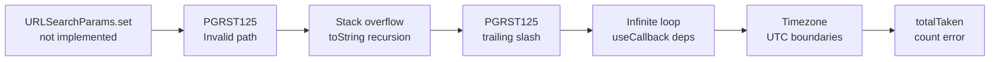
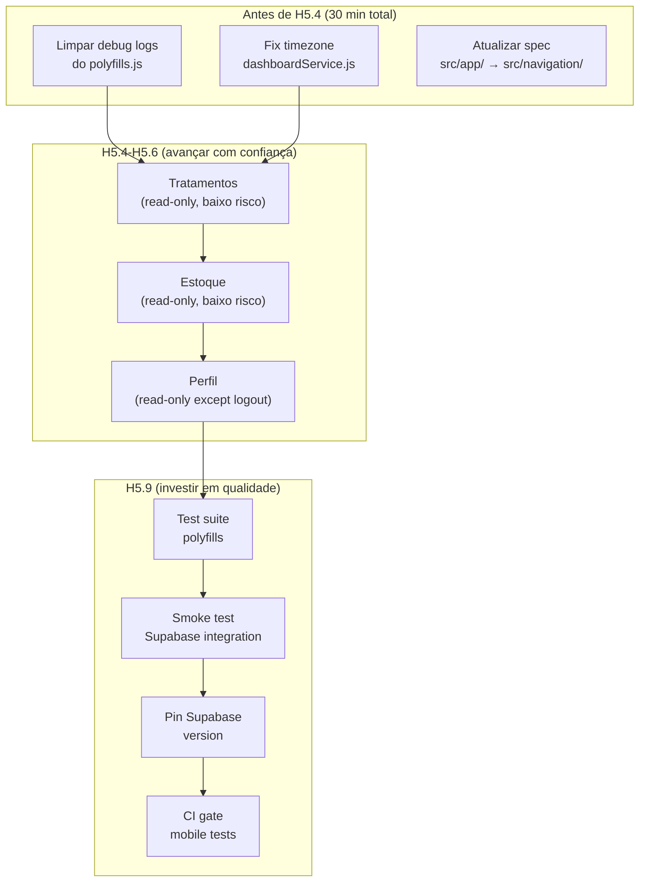

# 🔬 Revisão Arquitetural: Projeto Híbrido Meus Remédios

> **Data:** 2026-04-14 | **Escopo:** Avaliação completa H0–H5.3 + projeção H5.4–H8
> **Solicitante:** Maintainer (PO)
> **Status da análise:** ✅ Completa — baseada em código, commits, docs, memória DEVFLOW e specs

---

## Índice

1. [Resumo Executivo](#1-resumo-executivo)
2. [Evidências Quantitativas — O Caos dos PRs 465/466](#2-evidências-quantitativas)
3. [Análise de Causa Raiz](#3-análise-de-causa-raiz)
4. [O que Está Certo (e Deve ser Preservado)](#4-o-que-está-certo)
5. [O que Está Errado (e Deve Mudar)](#5-o-que-está-errado)
6. [Matriz de Risco para H5.4–H5.10](#6-matriz-de-risco)
7. [Recomendações Concretas](#7-recomendações-concretas)
8. [Decisões Pendentes para o Maintainer](#8-decisões-pendentes)
9. [Conclusão Final](#9-conclusão-final)
10. [Pós-Revisão: Fixes Aplicados (2026-04-14)](#10-pós-revisão)

---

## 1. Resumo Executivo

> [!IMPORTANT]
> **Veredicto: o caminho escolhido está fundamentalmente CORRETO, mas a execução precisa de ajustes significativos para H5.4+.**

A arquitetura híbrida desenhada na Master Spec é sólida. Os princípios não-negociáveis (P-001 a P-010), a estrutura de packages, a separação de plataformas, e a estratégia ADR-first são exatamente o que um projeto deste tipo precisa.

O problema não é o *plano*, é a **lacuna entre plano e execução**. Os sprints H5.1–H5.3 sofreram com:

| Problema | Impacto |
|----------|---------|
| Polyfill Hermes×Supabase sem validação prévia | **~80% dos commits foram fixes/debug** |
| Ausência de integration test no simulador antes de código de produto | Features escritas sobre fundação instável |
| Ambiente iCloud causando erros de Watchman | Tempo perdido em falsos positivos |
| Logs de debug na codebase em produção | Ruído acumulado, console.log em polyfills e services |

**A boa notícia:** os problemas foram documentados (Audit doc, DEVFLOW memory AP-H08..H15, R-162..165) e as soluções estão estabilizadas. A base de código mobile existente é pequena (~32 files), coerente com os padrões, e reutilizável. Não é necessário reescrever nada — é necessário **solidificar a fundação** antes de avançar.

---

## 2. Evidências Quantitativas

### 2.1 Commit churn em PRs 465 e 466

```
PR #465 (H5.1 — Shell + Tabs):
  Total de commits no branch: 20
  Commits de feat: 4 (20%)
  Commits de fix: 12 (60%)
  Commits de chore/docs: 4 (20%)

PR #466 (H5.2+H5.3 — Today + Dose):
  Total de commits no branch: ~18 (squashed → 1 merge commit com 18 anteriores)
  Commits de fix/debug: ~14 (78%)
  Commits de feat reais: ~3 (17%)
  Commits revertidos: 1 (aa68528 → revertido em 3bdc982)
```

### 2.2 Ratio fix/feature no app mobile inteiro

```
Total de commits que tocam apps/mobile/:  30
Commits com "fix" ou "debug":            24 (80%)
Commits com "feat":                        6 (20%)
```

> [!CAUTION]
> **80% dos commits de código mobile são correções e debugging.** Este é um sinal claro de que a fundação não estava estável quando as features começaram a ser construídas.

### 2.3 O arquivo `polyfills.js` — epicentro do caos

| Métrica | Valor |
|---------|-------|
| Tamanho atual | 387 linhas |
| Vezes modificado (commits no main) | 3 merge commits (mas ~10 iterações no branch) |
| IIFEs ativos | 3 (patchHermesURL, patchSearchParamsViaToString, patchURLSearchParams) |
| console.log de debug | **8** (deveriam ser 0 em produção) |
| Anti-patterns documentados sobre ele | AP-H08, AP-H11, AP-H12, AP-H13, AP-H14 (5 APs!) |
| Regras geradas por ele | R-162, R-165 (2 regras) |

### 2.4 Linha do tempo dos erros documentados (do Audit doc)



**7 erros em cascata**, cada um descoberto somente após resolver o anterior. Isso é o sintoma clássico de **ausência de smoke test do runtime** antes de construir features.

---

## 3. Análise de Causa Raiz

### 3.1 Causa #1: Hermes × Supabase — Incompatibilidade conhecida mas não validada

O Hermes engine (padrão no Expo SDK 53) tem implementação parcial de `URL` e `URLSearchParams`. O `react-native-url-polyfill` (recomendado oficialmente pelo Supabase) **também falha** no Expo SDK 53 com Hermes (todas as versões v1, v2, v3 — documentado em AP-H08).

**O que deveria ter acontecido:** antes de H5.1, um spike de 2-4h deveria ter validado que `supabase.from('protocols').select('id').eq('user_id', 'xxx')` retorna dados no simulador iOS. Este spike teria revelado todo o problema do polyfill **antes** de escrever qualquer feature.

**Impacto real:** ~60% do tempo de H5.2+H5.3 foi gasto debugando polyfills em vez de construindo produto.

### 3.2 Causa #2: Ambiente iCloud + Watchman

O repositório vive em `~/Library/Mobile Documents/com~apple~CloudDocs/git/meus-remedios`. O Watchman do Expo não tem permissão para observar paths dentro de iCloud Drive (AP-H07).

**Impacto:** erros intermitentes que parecem bugs de código mas são bugs de ambiente. Tempo gasto diagnosticando falsos positivos.

### 3.3 Causa #3: Ausência de testes de integração mobile

A stack de testes do projeto (`npm run test:critical`, `npm run validate:agent`) valida a **web**. Não existe nenhum gate automatizado que valide:
- Supabase client consegue fazer query no simulador
- Polyfills estão funcionando
- Auth flow completo funciona end-to-end

**Impacto:** cada feature nova pode descobrir bugs na fundação que os testes não cobrem.

### 3.4 Causa #4: Specs escreveram `src/app/` sem saber que ativa expo-router

A EXEC_SPEC_FASE5 original usa `src/app/` como diretório de navegação (Seção 5, linha 252). O Expo SDK 53 detecta esse path e ativa expo-router automaticamente (AP-H09). Isso causou crashes misteriosos até a causa ser identificada.

**Impacto:** confiança reduzida nas specs (correctamente), tempo perdido em fix.

---

## 4. O que Está Certo (e Deve ser Preservado)

### ✅ 4.1 Arquitetura de packages

A separação em `packages/core`, `packages/shared-data`, `packages/storage`, `packages/config`, `packages/design-tokens` é **textbook correct**:
- `core` é puro (sem deps de plataforma) — **confirmado no código**: exporta schemas + utils
- `storage` + `config` usam injeção de dependências — correto
- `design-tokens` é agnóstico — correto
- Mobile consome `@meus-remedios/core` para `parseLocalDate`, `getTodayLocal`, `logSchema` — correto

### ✅ 4.2 Master Spec e princípios P-001..P-010

Os 10 princípios são todos válidos e o código os segue:
- P-001 (UIs separadas): ✅ mobile usa StyleSheet, zero CSS
- P-002 (Shared core puro): ✅ packages/core não tem deps de plataforma
- P-003 (Web é principal): ✅ web funciona normalmente
- P-009 (StyleSheet no MVP): ✅ confirmado
- P-010 (Web na raiz): ✅ src/ na raiz, apps/mobile separado

### ✅ 4.3 Estratégia de thin local services (ADR-029)

A decisão de criar services locais em `apps/mobile/src/features/*/services/` que chamam Supabase diretamente é **pragmaticamente correta** para o MVP:
- Evita expandir shared-data durante H5
- Mantém scope controlado
- Services são pequenos (69-78 linhas) e bem documentados
- Usam `@meus-remedios/core` para schemas e cálculos

### ✅ 4.4 Navegação auth-aware (`Navigation.jsx`)

O padrão de 3 estados (undefined/null/session) é robusto:
- `undefined` → spinner (restaurando sessão)
- `null` → LoginScreen
- `session` → RootTabs

Este padrão evita o flash de tela errada e funciona com SecureStore async.

### ✅ 4.5 Documentação de erros (Audit doc)

O `AUDIT_POLYFILL_HERMES_SUPABASE.md` é **excelente**. É um documento raro de projeto — documenta não apenas o que funciona, mas **por que as coisas falharam**, com hashes de commit, hipóteses, e "lições aprendidas". Este nível de documentação vai poupar dezenas de horas futuras.

### ✅ 4.6 Memória DEVFLOW (AP-H08..H15, R-162..R-165)

O fato de cada bug ter gerado um anti-pattern e/ou regra documentada é o sistema de aprendizagem funcionando corretamente. Agentes futuros vão carregar essas regras no bootstrap e evitar os mesmos erros.

### ✅ 4.7 Feature files são limpos e seguem padrão

Os arquivos de feature (`dashboardService.js`, `doseService.js`, `useTodayData.js`) são bem escritos:
- Seguem R-010 (ordem de hooks)
- Seguem R-020/R-131 (parseLocalDate para timezone)
- Usam R-121 (Zod safeParse antes de mutação)
- JSDoc completo
- Error handling granular

---

## 5. O que Está Errado (e Deve Mudar)

### ❌ 5.1 Polyfill como "código vivo" com console.logs de debug

O `polyfills.js` tem **8 console.log** de debug que serão executados em cada operação Supabase em produção:

```
[polyfill] URL: Estratégia A — toString()+_searchPairs (bypass href/search setters)
[polyfill] URLSearchParams nativo: ...
[polyfill] URLSearchParams substituído — set: function
[sp] set select = ... → N pairs total       ← executado em CADA query
[sp] append user_id = ... → N pairs total   ← executado em CADA query
[sp-tostring] toString: ...                  ← executado em CADA query
[sp-tostring] removida barra final — base: ...
```

**Impacto:** ruído no console, performance degradada (string concatenation em cada query), e dificuldade de debugar problemas futuros com tanto noise.

### ❌ 5.2 Nenhum teste automatizado para polyfills

O arquivo mais crítico do mobile (387 linhas de monkey-patching de globals) não tem **nenhum teste**. Qualquer atualização de Expo/Hermes pode quebrar silenciosamente.

### ❌ 5.3 Timezone bug residual no `dashboardService.js`

```javascript
// Linha 42 — BUG: usa new Date() com template, violando R-020
const endUTC = new Date(`${dateStr}T23:59:59`).toISOString()
```

Deveria usar `parseLocalDate` para o fim do dia também, ou calcular o fim do dia a partir do início + 24h. A fórmula `T23:59:59` sem timezone explícito é interpretada como hora local pelo browser/Hermes, mas isso é inconsistente com o `startUTC` que usa `parseLocalDate()`.toISOString(). Além disso, perde 1 segundo (23:59:59 vs 00:00:00 do dia seguinte).

### ❌ 5.4 Supabase v2 compartilhado entre web e mobile (mesmo pacote hoisted)

```
Root node_modules:
  @supabase/supabase-js: 2.91.0
  @supabase/postgrest-js: 2.91.0

apps/mobile/package.json:
  "@supabase/supabase-js": "^2.49.4"  ←  resolve para 2.91.0 via hoisting
```

O mobile e a web compartilham **a mesma versão hoisted** de `@supabase/supabase-js`. Isso funciona hoje, mas cria risco:
- Uma atualização de Supabase na web pode quebrar o mobile silenciosamente
- O postgrest-js v2.91.0 pode mudar como usa `URL.searchParams` internamente
- Sem testes mobile automatizados, a regressão seria descoberta manualmente

### ❌ 5.5 EXEC_SPEC_FASE5 ainda referencia `src/app/` (incoerente)

Mesmo após o fix AP-H09 / R-163, a Seção 5 da spec (EXEC_SPEC_HIBRIDO_FASE5_MVP_PRODUTO.md, linha 252) ainda mostra:

```
apps/mobile/src/
├── app/                    ← ERRADO — ativa expo-router
│   ├── AppRoot.jsx
│   ├── Navigation.jsx
```

O Sprint Plan (EXEC_SPEC_HIBRIDO_H5_SPRINT_PLAN.md) está correto (`navigation/`), mas a spec raiz não foi atualizada.

### ❌ 5.6 Design tokens não estão sendo consumidos no mobile

```
grep -r "from '@meus-remedios/design-tokens" apps/mobile/src/
→ 0 resultados
```

O mobile usa `shared/styles/tokens.js` local em vez de consumir de `@meus-remedios/design-tokens`. Isso viola o princípio de single source of truth para tokens.

### ❌ 5.7 Sem validation gate mobile no workflow de PR

O CI/CD (GitHub Actions + Gemini review) valida a web: `npm run lint`, `npm run test:critical`, `npm run build`. Nenhum gate valida o mobile. Regressões mobile são invisíveis ao sistema de review.

---

## 6. Matriz de Risco para H5.4–H5.10

| Sprint | Feature | Risco Polyfill | Risco Timezone | Risco Deps | Recomendação |
|--------|---------|:---:|:---:|:---:|---|
| **H5.4** | Tratamentos (read-only) | 🟢 Baixo | 🟢 Baixo | 🟢 Baixo | **Safe — avançar** |
| **H5.5** | Estoque (read-only) | 🟢 Baixo | 🟢 Baixo | 🟢 Baixo | **Safe — avançar** |
| **H5.6** | Perfil | 🟢 Baixo | 🟢 Baixo | 🟢 Baixo | **Safe — avançar** |
| **H5.7** | Telegram | 🟡 Médio | 🟢 Baixo | 🟡 Médio | Depende de decisão A/B/C |
| **H5.8** | States transversais | 🟢 Baixo | 🟢 Baixo | 🟢 Baixo | Safe |
| **H5.9** | Testes | 🟡 Médio | 🟡 Médio | 🟢 Baixo | ⚠️ Testar polyfills aqui |
| **H5.10** | Hardening | 🟢 Baixo | 🟢 Baixo | 🟢 Baixo | Limpar debug logs aqui |

> [!NOTE]
> H5.4 e H5.5 são **read-only** (sem mutação). O polyfill já está funcionando para queries read-only (confirmado em H5.2+H5.3). A exposição a novos bugs é mínima. Este é o momento ideal para avançar e acumular valor de produto.

---

## 7. Recomendações Concretas

### Categoria A — Antes de H5.4 (fundação)

#### A1. Limpar console.logs do polyfills.js

**Prioridade:** Alta | **Esforço:** 15 min | **Impacto:** Reduz noise, melhora perf

Remover todos os `console.log` do `polyfills.js` exceto um log de boot resumido:
```javascript
console.log('[polyfill] Hermes URL/URLSearchParams — patched ✓')
```

Os logs `[sp] set`, `[sp] append`, `[sp-tostring]` executam em **cada query Supabase**. Em um dia normal de uso com 20+ queries, são 60+ linhas de log desnecessárias.

#### A2. Corrigir timezone bug em `dashboardService.js` (linha 42)

**Prioridade:** Alta | **Esforço:** 5 min | **Impacto:** Previne bugs de dose perdida

```diff
- const endUTC = new Date(`${dateStr}T23:59:59`).toISOString()
+ // Fim do dia = início do dia seguinte (exclusive boundary)
+ const nextDay = new Date(parseLocalDate(dateStr))
+ nextDay.setDate(nextDay.getDate() + 1)
+ const endUTC = nextDay.toISOString()
```

E mudar `.lte('taken_at', endUTC)` para `.lt('taken_at', endUTC)` para boundary exclusiva.

#### A3. Atualizar EXEC_SPEC_FASE5 — `src/app/` → `src/navigation/`

**Prioridade:** Média | **Esforço:** 5 min | **Impacto:** Previne confusão de agentes futuros

Corrigir Seção 5 para refletir a estrutura real.

---

### Categoria B — Durante H5.9 (testes e qualidade)

#### B1. Criar test suite para polyfills

**Prioridade:** Alta | **Esforço:** 2-3h | **Impacto:** Proteção contra regressão Hermes

```javascript
// apps/mobile/__tests__/polyfills.test.js
describe('Hermes URL polyfill', () => {
  it('accumulates searchParams across set/append', () => {
    const url = new URL('https://example.com/rest/v1/protocols')
    url.searchParams.set('select', 'id,name')
    url.searchParams.append('user_id', 'eq.123')
    url.searchParams.set('order', 'name.asc')
    expect(url.toString()).toContain('select=')
    expect(url.toString()).toContain('user_id=')
    expect(url.toString()).toContain('order=')
  })

  it('removes trailing slash before query params', () => {
    const url = new URL('https://example.com/rest/v1/protocols')
    url.searchParams.set('select', 'id')
    expect(url.toString()).not.toContain('/protocols/?')
  })

  it('does not recurse on toString/href', () => {
    const url = new URL('https://example.com/path')
    expect(() => url.toString()).not.toThrow()
    expect(() => url.href).not.toThrow()
  })
})
```

#### B2. Criar smoke test de integração Supabase

**Prioridade:** Alta | **Esforço:** 1-2h | **Impacto:** Detection precoce de regressão

Um script/test que faz uma query Supabase real no simulador (ou mock que simula o fluxo do postgrest-js) e valida que a URL construída está correta.

#### B3. Pin da versão de Supabase no mobile

**Prioridade:** Média | **Esforço:** 10 min | **Impacto:** Previne regressão silenciosa

```diff
# apps/mobile/package.json
- "@supabase/supabase-js": "^2.49.4",
+ "@supabase/supabase-js": "2.91.0",
```

Pin exato até que os testes de polyfill (B1) estejam verdes. Depois, qualquer bump de versão passa pelo gate de testes.

---

### Categoria C — Estratégicos (médio prazo)

#### C1. Consumir `@meus-remedios/design-tokens` no mobile

**Prioridade:** Média | **Esforço:** 30 min | **Impacto:** Single source of truth

Substituir `shared/styles/tokens.js` local por imports de `@meus-remedios/design-tokens`.

#### C2. Adicionar mobile gate no CI

**Prioridade:** Média | **Esforço:** 1h | **Impacto:** Regressões visíveis no PR

Adicionar ao GitHub Actions:
```yaml
- name: Mobile tests
  run: cd apps/mobile && npx jest --passWithNoTests
```

Isso não vai executar no simulador (CI não tem), mas valida lógica pura (services, hooks, polyfills).

#### C3. Resolver iCloud + Watchman definitivamente

**Prioridade:** Baixa (workaround existe) | **Esforço:** 30 min

Opções:
- `.watchmanconfig` já existe no projeto — verificar se está ativo
- Symlink do repo para path local (fora de iCloud)

#### C4. Monitorar `react-native-url-polyfill` para fix oficial

**Prioridade:** Baixa (informacional) | **Esforço:** 0

Acompanhar o [repositório](https://github.com/nicksrandall/react-native-url-polyfill) para novas versões que suportem Expo SDK 53 com Hermes corretamente. Se surgir uma versão funcional, ela substituiria as 387 linhas do `polyfills.js` por `import 'react-native-url-polyfill/auto'`.

---

## 8. Decisões Pendentes para o Maintainer

### 8.1 Decisões que já estavam pendentes (do Sprint Plan)

| # | Decisão | Status | Recomendação |
|---|---------|--------|--------------|
| 1 | **Mecanismo Telegram mobile** (A/B/C) | ⏳ Pendente para H5.7 | **Opção A (Supabase RPC)** — menor latência, sem nova Vercel function |
| 2 | **ADR-029 aprovação** (thin local services) | ⏳ Implícito | ✅ Funcionou bem em H5.2/H5.3 — **formalizar aprovação** |
| 3 | **ADR-030 aprovação** (tabs + stacks) | ⏳ Implícito | ✅ Implementado e estável — **formalizar** |
| 4 | **Android Emulator validation** | ⏳ Gate aberto de H4 | **Validar antes de H5.10** |

### 8.2 Novas decisões surgidas desta análise

| # | Decisão | Urgência | Opções |
|---|---------|----------|--------|
| 5 | **Pin Supabase version no mobile?** | Antes de H5.4 | Pin exato `2.91.0` vs manter `^2.49.4` |
| 6 | **Remover logs de debug do polyfills.js agora?** | Antes de H5.4 | Sim (1 log resumo) vs Manter (até H5.10) |
| 7 | **Repo local vs iCloud para Expo dev?** | Informacional | Symlink vs `.watchmanconfig` |

---

## 9. Conclusão Final

### O veredicto em uma frase:

> **A arquitetura é sólida. O plano é bom. O que faltou foi um spike de validação de runtime antes de construir features — e isso já foi corrigido organicamente pela experiência dos sprints H5.1-H5.3.**

### O que mudou na prática:

O projeto saiu de H5.1-H5.3 com:
- Um polyfill custom de 387 linhas que **funciona** (apesar de feio)
- Um audit document que **documenta tudo** (raro e valioso)
- 7 anti-patterns e 4 regras novas na memória DEVFLOW
- Uma fundação de código mobile limpa (32 arquivos, bem organizados)

### O que deve mudar para H5.4+:



### Prognóstico para H5.4-H5.6:

> [!TIP]
> H5.4 (Tratamentos), H5.5 (Estoque) e H5.6 (Perfil) são **sprints de leitura**: não usam operações de mutação que exponham novos edge cases de polyfill. O padrão de `thin service → hook → screen` já está provado e funcionando. Estes três sprints devem ser significativamente mais suaves que H5.2+H5.3.

### Métricas de sucesso para acompanhar:

| Métrica | H5.1-H5.3 (atual) | Meta H5.4-H5.6 | Meta H5.7-H5.10 |
|---------|:---:|:---:|:---:|
| Fix/feat ratio | 80%/20% | **≤30%/≥70%** | **≤20%/≥80%** |
| Commits por PR | 18-20 | **≤8** | **≤10** |
| Bugs em cascata | 7 | **0** | **≤1** |
| Testes mobile | 0 | 0 (adiado) | **≥15** |

---

*Análise produzida com base em: 5 specs, 1 audit doc, 32 source files, 40+ commits git, 112 rules DEVFLOW, 89 anti-patterns DEVFLOW, e revisão do polyfills.js (387 linhas).*

---

## 10. Pós-Revisão: Fixes Aplicados (2026-04-14)

### Inputs do Maintainer (incorporados)

| Input | Ação Tomada |
|-------|-------------|
| Debug logs eram intencionais (MVP em simulador) | Substituído por `__DEV__` guards (padrão RN) — traces completos em dev, zero em produção |
| Watchman resolvido via worktree em `~/local/test-native` + `gsync-native.sh` | Removido das recomendações |
| Telegram: Opção A (Supabase RPC) | Sprint plan atualizado |
| Android H5.1 validado; H5.2/H5.3 pendente WiFi | Gate parcialmente fechado no sprint plan |

### Quick Fixes Aplicados

| Fix | Arquivo | Mudança |
|-----|---------|--------|
| **A1** | `apps/mobile/polyfills.js` | 7 console.logs → `if (__DEV__) console.log(...)` |
| **A1** | `apps/mobile/src/features/dashboard/hooks/useTodayData.js` | 9 console statements → `if (__DEV__)` guards |
| **A1** | `apps/mobile/src/features/dose/services/doseService.js` | 6 console statements → `if (__DEV__)` guards |
| **A1** | `apps/mobile/src/platform/supabase/nativeSupabaseClient.js` | 2 console.logs → `if (__DEV__)` guards |
| **A2** | `apps/mobile/src/features/dashboard/services/dashboardService.js` | Fix timezone: `new Date(template)` → `parseLocalDate` + next day exclusive boundary; `.lte()` → `.lt()` |
| **A3** | `plans/backlog-native_app/EXEC_SPEC_HIBRIDO_FASE5_MVP_PRODUTO.md` | Seção 5: `src/app/` → `src/navigation/` (R-163, AP-H09) |
| **Docs** | `plans/backlog-native_app/EXEC_SPEC_HIBRIDO_H5_SPRINT_PLAN.md` | Decisões #1-#4 atualizadas com status |

### Validação

- ✅ `npm run lint` — passa (0 errors, 1 warning pré-existente)
- ✅ `npm run build` — web compila (3.24s)
- ⬜ Mobile validation — pendente sync via `gsync-native.sh` + teste no simulador
