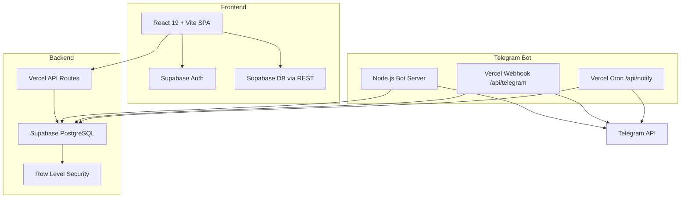
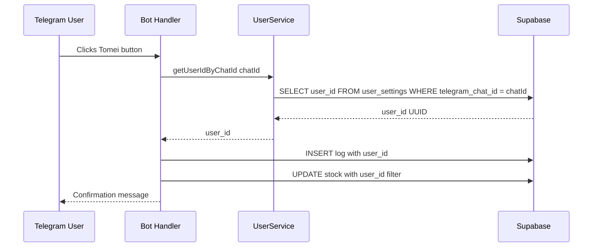

# Meus Remedios - Comprehensive Upgrade Plan

## Executive Summary

This document outlines a comprehensive upgrade plan for the Meus Remedios medication tracking application. The plan addresses:

1. **Critical Bug Fixes** - Telegram bot dose registration and history month navigation
2. **Architecture Improvements** - While maintaining free-tier services
3. **UX/Feature Enhancements** - While preserving core value proposition
4. **Code Refactoring** - For maintainability and scalability

---

## Current Architecture Overview



### Tech Stack

- **Frontend**: React 19 + Vite, vanilla CSS with design tokens
- **Backend**: Supabase PostgreSQL with RLS policies
- **Bot**: Node.js with node-telegram-bot-api polling OR Vercel serverless webhooks
- **Hosting**: Vercel frontend + API, Supabase database
- **Cost**: R$ 0 free tier

---

## Part 1: Critical Bug Fixes

### Bug 1: Telegram Bot Fast Dose Action Not Saving

**Location**: [`server/bot/callbacks/doseActions.js`](server/bot/callbacks/doseActions.js:1)

**Root Cause**: The `handleTakeDose` function uses hardcoded `MOCK_USER_ID` instead of looking up the actual user associated with the Telegram chat.

**Evidence**:

```javascript
// Line 1 - imports mock ID
import { supabase, MOCK_USER_ID } from '../../services/supabase.js';

// Line 41 - uses mock ID for log insertion
.insert([{
  user_id: MOCK_USER_ID,  // BUG: Should be actual user
  protocol_id: protocolId,
  ...
}]);
```

**Fix Required**:

```javascript
// In doseActions.js
import { getUserIdByChatId } from '../../services/userService.js';

async function handleTakeDose(bot, callbackQuery) {
  const { data, message, id } = callbackQuery;
  const chatId = message.chat.id;
  
  try {
    // Get actual user ID from chat ID
    const userId = await getUserIdByChatId(chatId);
    
    // Use userId instead of MOCK_USER_ID in all queries
    const { error: logError } = await supabase
      .from('medicine_logs')
      .insert([{
        user_id: userId,  // FIXED
        protocol_id: protocolId,
        medicine_id: medicineId,
        quantity_taken: parseFloat(quantity),
        taken_at: new Date().toISOString()
      }]);
    // ... rest of function with userId
  } catch (err) {
    if (err.message === 'User not linked') {
      await bot.answerCallbackQuery(id, { 
        text: 'Conta nao vinculada. Use /start para vincular.', 
        show_alert: true 
      });
    }
    // ...
  }
}
```

**Files Affected**:

- [`server/bot/callbacks/doseActions.js`](server/bot/callbacks/doseActions.js) - Main fix
- [`server/bot/callbacks/conversational.js`](server/bot/callbacks/conversational.js:189) - Same issue at line 189
- [`server/bot/commands/registrar.js`](server/bot/commands/registrar.js:1) - Uses fallback pattern, needs cleanup

---

### Bug 2: History Month Navigation Not Working

**Location**: [`src/services/api.js`](src/services/api.js:763) and [`src/components/ui/CalendarWithMonthCache.jsx`](src/components/ui/CalendarWithMonthCache.jsx:1)

**Root Cause**: Timezone handling issue when constructing date ranges for month queries.

**Evidence**:

```javascript
// In api.js getByMonth function
getByMonth: async (year, month) => {
  // BUG: Local timezone date converted to ISO can shift days
  const startDate = new Date(year, month, 1).toISOString().split('T')[0]
  const endDate = new Date(year, month + 1, 0).toISOString().split('T')[0]
```

When in Brazil UTC-3, creating `new Date(2024, 0, 1)` at midnight local time converts to `2023-12-31T21:00:00.000Z` in ISO format, causing the query to miss logs from the first day of the month.

**Fix Required**:

```javascript
// Option A: Use UTC-safe date construction
getByMonth: async (year, month) => {
  // Create dates at noon to avoid timezone edge cases
  const startDate = `${year}-${String(month + 1).padStart(2, '0')}-01`
  const lastDay = new Date(Date.UTC(year, month + 1, 0)).getUTCDate()
  const endDate = `${year}-${String(month + 1).padStart(2, '0')}-${String(lastDay).padStart(2, '0')}`
  
  const { data, error, count } = await supabase
    .from('medicine_logs')
    .select(`...`)
    .eq('user_id', await getUserId())
    .gte('taken_at', `${startDate}T00:00:00.000Z`)
    .lte('taken_at', `${endDate}T23:59:59.999Z`)
    // ...
}

// Option B: Use date-fns library for robust date handling
import { startOfMonth, endOfMonth, formatISO } from 'date-fns'
import { toZonedTime } from 'date-fns-tz'

getByMonth: async (year, month) => {
  const date = new Date(year, month, 15) // Mid-month to avoid edge cases
  const start = startOfMonth(date)
  const end = endOfMonth(date)
  // ...
}
```

**Secondary Issue**: Calendar `markedDates` comparison may have timezone mismatch

```javascript
// In CalendarWithMonthCache.jsx line 85
const hasLog = markedDates.some(dateStr => {
  const dLog = new Date(dateStr)
  dLog.setHours(0, 0, 0, 0)  // Local timezone operation
  return dLog.getTime() === dayDate.getTime()
})
```

**Fix**: Normalize both dates to same timezone reference

```javascript
const hasLog = markedDates.some(dateStr => {
  const dLog = new Date(dateStr)
  return dLog.getUTCFullYear() === dayDate.getFullYear() &&
         dLog.getUTCMonth() === dayDate.getMonth() &&
         dLog.getUTCDate() === dayDate.getDate()
})
```

---

## Part 2: Architecture Improvements

### 2.1 Bot Multi-User Architecture Refactor

**Current State**: Inconsistent user lookup across bot commands. Some use `MOCK_USER_ID`, some use `telegram_user_id` field that does not exist.

**Target State**: All bot operations properly resolve user via `telegram_chat_id` lookup.



**Implementation Tasks**:

1. **Create centralized user resolver middleware**

```javascript
// server/bot/middleware/userResolver.js
export async function resolveUser(chatId) {
  const userId = await getUserIdByChatId(chatId);
  return userId;
}

export function withUser(handler) {
  return async (bot, msg, ...args) => {
    try {
      const userId = await resolveUser(msg.chat.id);
      return handler(bot, msg, userId, ...args);
    } catch (err) {
      if (err.message === 'User not linked') {
        return bot.sendMessage(msg.chat.id, 
          'Conta nao vinculada. Use /start TOKEN para vincular.');
      }
      throw err;
    }
  };
}
```

2. **Refactor all commands to use middleware**
3. **Remove all `MOCK_USER_ID` references**
4. **Add proper error handling for unlinked users**

---

### 2.2 Frontend State Management Enhancement

**Current State**: State managed via `useState` in `App.jsx`, navigation via switch statement.

**Recommendation**: Add lightweight routing for deep linking and browser history support.

**Option A: Hash-based Routing without dependencies**

```javascript
// Keep free tier by implementing simple hash router
function useHashRouter() {
  const [route, setRoute] = useState(window.location.hash.slice(1) || 'dashboard');
  
  useEffect(() => {
    const handleHashChange = () => setRoute(window.location.hash.slice(1) || 'dashboard');
    window.addEventListener('hashchange', handleHashChange);
    return () => window.removeEventListener('hashchange', handleHashChange);
  }, []);
  
  const navigate = (path) => { window.location.hash = path; };
  
  return [route, navigate];
}
```

**Benefits**:

- Shareable URLs: `app.com/#/history`
- Browser back/forward support
- Deep linking from notifications
- Zero additional dependencies

---

### 2.3 Caching Strategy for Protocol Data

**Current State**: Dashboard makes 5+ parallel API calls on every load.

**Recommendation**: Implement request deduplication and stale-while-revalidate pattern.

```javascript
// src/lib/queryCache.js
const cache = new Map();
const STALE_TIME = 30 * 1000; // 30 seconds

export async function cachedQuery(key, fetcher) {
  const cached = cache.get(key);
  const now = Date.now();
  
  if (cached && now - cached.timestamp < STALE_TIME) {
    return cached.data;
  }
  
  // Return stale data while revalidating
  if (cached) {
    fetcher().then(data => {
      cache.set(key, { data, timestamp: Date.now() });
    });
    return cached.data;
  }
  
  const data = await fetcher();
  cache.set(key, { data, timestamp: now });
  return data;
}
```

---

### 2.4 Database Schema Optimization

**Current State**: Stock quantity requires aggregation query every time.

**Recommendation**: Add computed column or view for total stock.

```sql
-- Create a view for medicine stock summary
CREATE OR REPLACE VIEW medicine_stock_summary AS
SELECT 
  medicine_id,
  user_id,
  SUM(quantity) as total_quantity,
  MIN(expiration_date) as nearest_expiry,
  COUNT(*) as batch_count
FROM stock
WHERE quantity > 0
GROUP BY medicine_id, user_id;

-- Add RLS policy
CREATE POLICY "Users can view own stock summary"
ON medicine_stock_summary
FOR SELECT
USING (auth.uid() = user_id);
```

---

## Part 3: UX and Feature Enhancements

### 3.1 Improved History View Experience

**Current Pain Points**:

- Month navigation bug prevents users from seeing past records
- No visual feedback during month loading
- Calendar and timeline compete for attention

**Enhancements**:

1. **Loading skeleton states**

```jsx
{isLoading ? (
  <div className="calendar-skeleton">
    <div className="skeleton-header" />
    <div className="skeleton-grid">
      {Array(35).fill(0).map((_, i) => (
        <div key={i} className="skeleton-day" />
      ))}
    </div>
  </div>
) : (
  <CalendarWithMonthCache ... />
)}
```

2. **Swipe navigation for mobile**

```jsx
// Add touch handlers
const handleTouchStart = (e) => setTouchStart(e.touches[0].clientX);
const handleTouchEnd = (e) => {
  const diff = touchStart - e.changedTouches[0].clientX;
  if (Math.abs(diff) > 50) {
    diff > 0 ? handleNextMonth() : handlePreviousMonth();
  }
};
```

3. **Quick month picker dropdown**

```jsx
<select value={`${year}-${month}`} onChange={handleMonthSelect}>
  {generateMonthOptions().map(opt => (
    <option key={opt.value} value={opt.value}>{opt.label}</option>
  ))}
</select>
```

---

### 3.2 Dashboard Engagement Improvements

**Current State**: Dashboard shows good data but lacks actionable insights.

**Enhancements**:

1. **Adherence Score Widget**

```jsx
<div className="adherence-widget">
  <CircularProgress percentage={adherenceRate} />
  <span className="adherence-label">
    {adherenceRate >= 90 ? 'Excelente!' : 
     adherenceRate >= 70 ? 'Bom progresso' : 'Precisa melhorar'}
  </span>
  <span className="streak">{streak} dias seguidos</span>
</div>
```

2. **Predictive Stock Warning**

```jsx
// Show medicines that will run out this week
{stockAlerts.filter(s => s.daysRemaining <= 7).map(alert => (
  <div className="stock-alert" key={alert.medicine.id}>
    <span>⚠️ {alert.medicine.name}</span>
    <span>{alert.daysRemaining} dias restantes</span>
    <Button onClick={() => navigate('stock', { medicineId: alert.medicine.id })}>
      Repor
    </Button>
  </div>
))}
```

3. **Quick Actions Panel**

```jsx
<div className="quick-actions">
  <Button onClick={handleRegisterDose}>Registrar Dose</Button>
  <Button onClick={() => navigate('stock')}>Adicionar Estoque</Button>
  <Button variant="outline" onClick={() => navigate('history')}>Ver Historico</Button>
</div>
```

---

### 3.3 Telegram Bot Experience Enhancement

**Current Gaps**:

- Fast dose button does not work when unlinked user
- No inline keyboard for common actions after registration
- No confirmation before skipping dose

**Enhancements**:

1. **Post-registration quick actions**

```javascript
// After dose registration success
const keyboard = {
  inline_keyboard: [
    [{ text: '📊 Ver Status', callback_data: 'show_status' }],
    [{ text: '📦 Ver Estoque', callback_data: 'show_stock' }],
    [{ text: '📝 Registrar Outra', callback_data: 'register_another' }]
  ]
};
await bot.sendMessage(chatId, confirmMsg, { 
  parse_mode: 'Markdown',
  reply_markup: keyboard 
});
```

2. **Skip dose confirmation**

```javascript
async function handleSkipDose(bot, callbackQuery) {
  const { message, id } = callbackQuery;
  
  // First click shows confirmation
  const keyboard = {
    inline_keyboard: [[
      { text: 'Confirmar Pular', callback_data: `skip_confirm:${protocolId}` },
      { text: 'Cancelar', callback_data: 'skip_cancel' }
    ]]
  };
  
  await bot.editMessageReplyMarkup({ inline_keyboard: keyboard }, {
    chat_id: message.chat.id,
    message_id: message.message_id
  });
}
```

3. **Rich notification messages**

```javascript
// Include medicine info and instructions
const message = `🔔 *HORA DO REMEDIO*

💊 *${medicine.name}*
📏 Dose: ${protocol.dosage_per_intake} ${medicine.dosage_unit || 'cp'}
⏰ Horario: ${scheduledTime}

${medicine.notes ? `📝 _${medicine.notes}_` : ''}

Lembrete: Tome com agua em jejum.`;
```

---

### 3.4 Offline Support and PWA Enhancement

**Current State**: App requires internet, no offline functionality.

**Recommendation**: Add service worker for basic offline support.

```javascript
// In vite.config.js - add PWA plugin
import { VitePWA } from 'vite-plugin-pwa'

export default defineConfig({
  plugins: [
    react(),
    VitePWA({
      registerType: 'autoUpdate',
      workbox: {
        globPatterns: ['**/*.{js,css,html,ico,png,svg}'],
        runtimeCaching: [
          {
            urlPattern: /^https:\/\/.*\.supabase\.co\/rest\/v1\/.*/i,
            handler: 'NetworkFirst',
            options: {
              cacheName: 'api-cache',
              expiration: { maxEntries: 50, maxAgeSeconds: 300 }
            }
          }
        ]
      }
    })
  ]
})
```

---

## Part 4: Code Refactoring Plan

### 4.1 API Service Modularization

**Current State**: Single 798-line [`api.js`](src/services/api.js) file.

**Target State**: Split by domain:

```text
src/services/
├── api/
│   ├── index.js           # Re-exports all services
│   ├── medicineService.js
│   ├── protocolService.js
│   ├── stockService.js
│   ├── logService.js
│   └── treatmentPlanService.js
├── lib/
│   └── supabaseClient.js
└── utils/
    └── dateUtils.js       # Timezone-safe date helpers
```

---

### 4.2 Bot Command Handler Standardization

**Current State**: Inconsistent patterns across command handlers.

**Target Pattern**:

```javascript
// server/bot/commands/base.js
export function createCommand(name, handler, options = {}) {
  return async (bot, msg, ...args) => {
    const chatId = msg.chat.id;
    
    try {
      // Resolve user if required
      const userId = options.requiresAuth 
        ? await getUserIdByChatId(chatId)
        : null;
      
      // Execute handler
      await handler(bot, msg, { chatId, userId }, ...args);
      
    } catch (err) {
      if (err.message === 'User not linked') {
        return bot.sendMessage(chatId, messages.USER_NOT_LINKED);
      }
      
      logger.error(`Error in /${name}`, err);
      await bot.sendMessage(chatId, messages.GENERIC_ERROR);
    }
  };
}

// Usage:
export const handleStatus = createCommand('status', async (bot, msg, { userId }) => {
  const protocols = await getActiveProtocols(userId);
  // ...
}, { requiresAuth: true });
```

---

### 4.3 Component Organization

**Current State**: All components in flat structure by type.

**Recommendation**: Group by feature:

```text
src/components/
├── common/
│   ├── Button/
│   ├── Card/
│   ├── Modal/
│   └── Loading/
├── calendar/
│   ├── Calendar.jsx
│   ├── CalendarWithMonthCache.jsx
│   └── Calendar.css
├── medicine/
│   ├── MedicineCard.jsx
│   ├── MedicineForm.jsx
│   └── medicine.css
└── protocol/
    ├── ProtocolCard.jsx
    ├── ProtocolForm.jsx
    ├── TitrationWizard.jsx
    └── protocol.css
```

---

### 4.4 Test Coverage Expansion

**Current State**: Limited tests for `Button`, `LogForm`, `ProtocolForm`, and `api.js`.

**Priority Test Areas**:

1. **Critical Business Logic**
   - Stock decrement on dose registration
   - Titration stage advancement
   - Date/timezone calculations

2. **Bot User Resolution**
   - User lookup success
   - Unlinked user handling
   - Edge cases token validation

3. **Integration Tests**
   - Full dose registration flow
   - Month navigation in History

```javascript
// Example: Stock decrement test
describe('stockService.decrease', () => {
  it('should decrement oldest stock first FIFO', async () => {
    // Setup: 2 stock entries
    const older = { id: '1', quantity: 5, purchase_date: '2024-01-01' };
    const newer = { id: '2', quantity: 10, purchase_date: '2024-02-01' };
    
    // Action: Decrease by 7
    await stockService.decrease(medicineId, 7);
    
    // Assert: Older depleted, newer partially used
    expect(older.quantity).toBe(0);
    expect(newer.quantity).toBe(8);
  });
});
```

---

## Part 5: Implementation Roadmap

### Phase 1: Critical Bug Fixes

| Task | Priority | Complexity | Files |
| ------ | ---------- | ------------ | ------- |
| Fix Telegram dose action user lookup | P0 | Low | doseActions.js, conversational.js |
| Fix History month navigation timezone | P0 | Medium | api.js, CalendarWithMonthCache.jsx |
| Add error handling for unlinked users | P0 | Low | All bot commands |

### Phase 2: Bot Architecture Refactor

| Task | Priority | Complexity | Files |
| ------ | ---------- | ------------ | ------- |
| Create user resolver middleware | P1 | Medium | New file |
| Refactor all commands to use middleware | P1 | Medium | All command files |
| Remove MOCK_USER_ID completely | P1 | Low | supabase.js, all imports |
| Add command wrapper with error handling | P1 | Medium | New file |

### Phase 3: UX Enhancements

| Task | Priority | Complexity | Files |
| ------ | ---------- | ------------ | ------- |
| Add loading skeletons | P2 | Low | History.jsx, Dashboard.jsx |
| Implement hash-based routing | P2 | Medium | App.jsx, new router |
| Add swipe navigation to calendar | P2 | Low | CalendarWithMonthCache.jsx |
| Enhance Telegram confirmations | P2 | Low | doseActions.js |

### Phase 4: Code Quality

| Task | Priority | Complexity | Files |
| ------ | ---------- | ------------ | ------- |
| Split api.js into modules | P3 | Medium | api.js -> multiple files |
| Add date utility functions | P3 | Low | New dateUtils.js |
| Standardize bot command handlers | P3 | High | All bot files |
| Expand test coverage | P3 | High | New test files |

---

## Appendix: Detailed Bug Analysis

### A1: Telegram Bot Flow Trace

```text
User clicks Tomei button on notification
  ↓
Telegram sends callback_query to webhook
  ↓
api/telegram.js receives update
  ↓
bot._emit callback_query fires
  ↓
doseActions.js handleCallbacks triggered
  ↓
data.startsWith take_ matches
  ↓
handleTakeDose called
  ↓
BUG: Uses MOCK_USER_ID instead of actual user
  ↓
Log inserted with wrong user_id
  ↓
Stock query uses wrong user_id returns empty
  ↓
Stock not decremented RLS prevents access
  ↓
User sees success but data not saved correctly
```

### A2: Month Navigation Flow Trace

```text
User clicks next month arrow
  ↓
CalendarWithMonthCache handleNextMonth called
  ↓
viewDate state updated to next month
  ↓
useEffect triggers due to viewDate change
  ↓
loadMonth called with year month
  ↓
Parent History.jsx handleCalendarLoadMonth called
  ↓
logService.getByMonth year month called
  ↓
BUG: Date construction uses local timezone
  ↓
new Date 2024 0 1 in UTC-3 becomes Dec 31 23:00 UTC
  ↓
startDate incorrectly set to 2023-12-31
  ↓
Query returns logs from wrong date range
  ↓
Calendar shows incorrect marked dates
```

---

## Summary

This plan provides a comprehensive approach to:

1. **Fix critical bugs** that prevent core functionality Telegram dose registration, history navigation
2. **Improve architecture** while keeping free-tier services hash routing, caching, modular code
3. **Enhance UX** with loading states, swipe navigation, richer bot interactions
4. **Refactor code** for better maintainability and testability

The implementation phases are ordered by priority, with Phase 1 addressing show-stopper bugs that should be fixed immediately.
