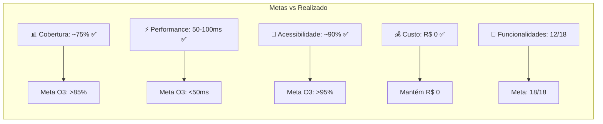
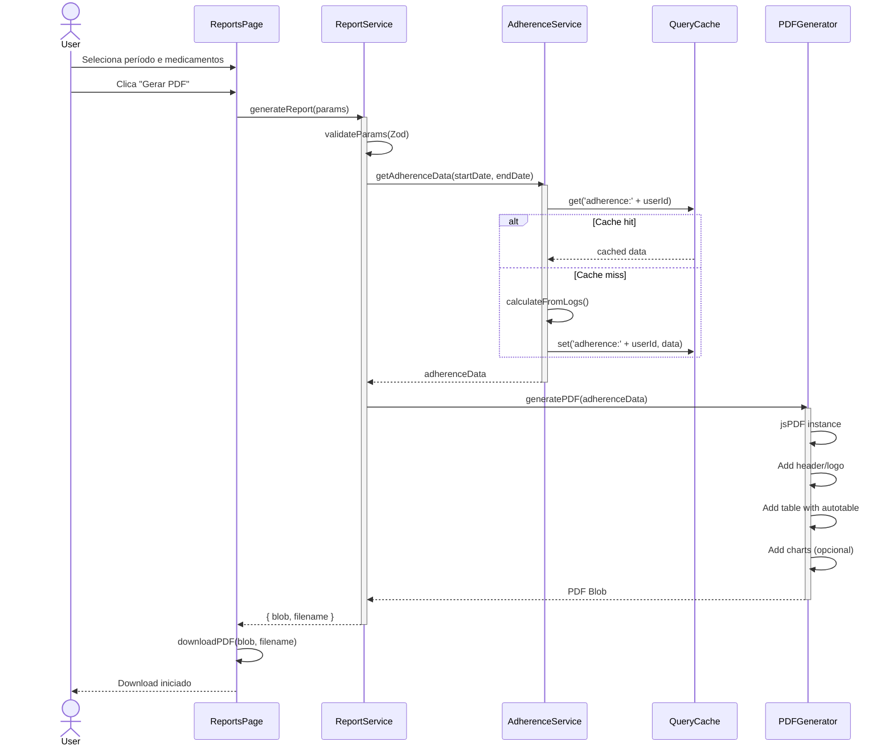
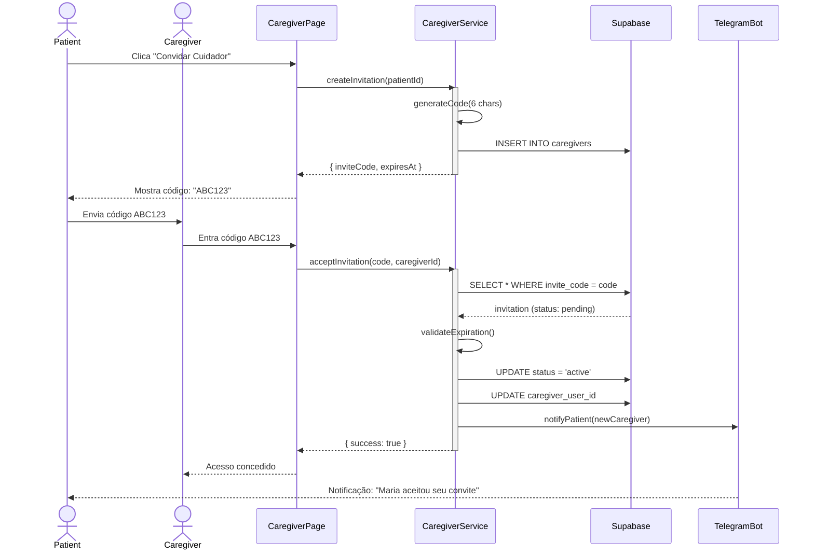
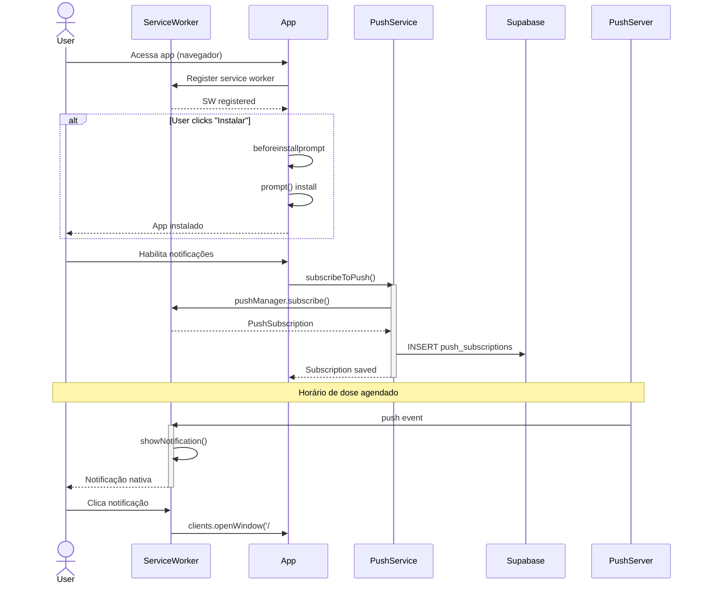
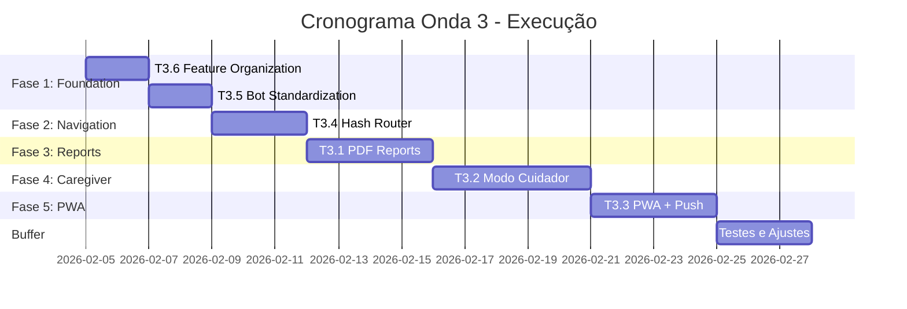
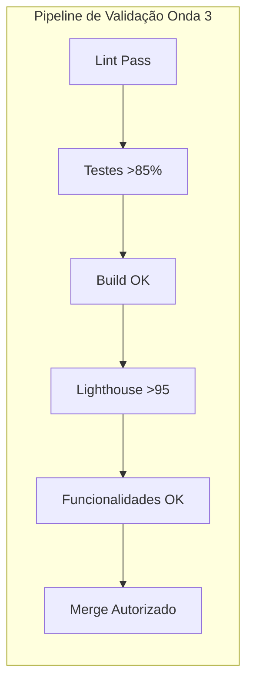

# 📋 Plano Técnico Executável - Onda 3 (Expansão)

**Status:** PLANEJAMENTO  
**Data de Planejamento:** 04/02/2026  
**Versão do Framework:** 1.0  
**Autoridade Arquitetural:** [`docs/ARQUITETURA_FRAMEWORK.md`](docs/ARQUITETURA_FRAMEWORK.md:1)  

---

## 1. Sumário Executivo

### 1.1 Contexto e Escopo

A **Onda 3 - Expansão** representa a fase final do ciclo de desenvolvimento planejado para o projeto **Meus Remédios**, focando em:

- **Expansão de Casos de Uso:** Relatórios médicos, modo cuidador, PWA
- **Melhoria de Acessibilidade:** Deep linking, navegação compartilhável
- **Sustentabilidade Técnica:** Padronização e organização do código

| Aspecto | Especificação |
|---------|---------------|
| **Tarefas Planejadas** | 6 (3.1 a 3.6) |
| **Duração Estimada** | Dias 25-42 do roadmap |
| **Custo Operacional** | R$ 0 (mantém princípio de free tier) |
| **Agentes-Pai Envolvidos** | 7 |
| **Subagentes Estimados** | 15+ |

### 1.2 Estado Atual do Projeto (Pós-Onda 2)



### 1.3 Objetivos Estratégicos Atendidos pela Onda 3

| OE | Descrição | Tarefas Relacionadas |
|----|-----------|---------------------|
| **OE1** | Qualidade e Confiabilidade | 3.5 (Padronização), 3.6 (Organização) |
| **OE3** | Engajamento e Adesão | 3.1 (PDF para médicos) |
| **OE5** | Expansão de Casos de Uso | 3.1 (PDF), 3.2 (Cuidador), 3.3 (PWA), 3.4 (Deep linking) |
| **OE6** | Sustentabilidade de Custo | Todas (R$ 0) |

---

## 2. Hierarquia de Agentes - Configuração Onda 3

### 2.1 Estrutura Hierárquica

```mermaid
flowchart TB
    subgraph ORQUESTRADOR[Orquestrador Central]
        OA[Arquiteto-Orchestrator<br/>Coordenação e Autorização]
    end
    
    subgraph AGENTES_PAI[7 Agentes-Pai Setoriais]
        direction TB
        A1[Backend Agent<br/>Supabase | RLS | Services]
        A2[Frontend Agent<br/>React | PWA | PDF]
        A3[Infraestrutura Agent<br/>Vercel | Env | Push]
        A4[Qualidade Agent<br/>Testes | Coverage]
        A5[Documentação Agent<br/>Docs | APIs]
        A6[Revisão Agent<br/>Standards | Security]
        A7[Debug Agent<br/>Investigação | Correção]
    end
    
    subgraph SUBAGENTES_ONDA3[Subagentes Especializados - Onda 3]
        direction TB
        
        subgraph BA[Backend Subagentes]
            BA1[RLS Policy Expert<br/>Caregivers permissions]
            BA2[Service Developer<br/>PDF generation, Caregiver APIs]
            BA3[Migration Specialist<br/>Tabelas caregivers]
        end
        
        subgraph FA[Frontend Subagentes]
            FA1[PWA Specialist<br/>Service Worker, Manifest]
            FA2[PDF Engineer<br/>jsPDF, AutoTable]
            FA3[Router Developer<br/>Hash routing, Deep links]
            FA4[Component Engineer<br/>Reports, Caregiver views]
        end
        
        subgraph IA[Infra Subagentes]
            IA1[Push Configurator<br/>Web Push API]
            IA2[Env Manager<br/>VAPID keys, Secrets]
        end
        
        subgraph QA[Qualidade Subagentes]
            QA1[Test Engineer<br/>PWA, PDF, Routing]
            QA2[Coverage Analyst<br/>>85% target]
        end
        
        subgraph DA[Documentação Subagentes]
            DA1[API Documenter<br/>Caregiver endpoints]
            DA2[Technical Writer<br/>PWA setup, PDF guide]
        end
    end
    
    OA --> AGENTES_PAI
    A1 --> BA
    A2 --> FA
    A3 --> IA
    A4 --> QA
    A5 --> DA
```

### 2.2 Matriz de Responsabilidades por Tarefa

| Tarefa | Agente-Pai Primário | Subagentes | Estado Inicial |
|--------|---------------------|------------|----------------|
| **3.1** PDF Reports | Frontend Agent | FA2, BA2, DA1 | DORMANT |
| **3.2** Modo Cuidador | Backend Agent | BA1, BA2, BA3, FA4 | DORMANT |
| **3.3** PWA + Push | Infraestrutura Agent | IA1, IA2, FA1 | DORMANT |
| **3.4** Hash Router | Frontend Agent | FA3 | DORMANT |
| **3.5** Bot Standardization | Backend Agent | BA2, A7 | DORMANT |
| **3.6** Feature Organization | Frontend Agent | FA4, A7 | DORMANT |

---

## 3. Análise Técnica das Tarefas da Onda 3

### 3.1 Tarefa 3.1: Relatórios PDF Exportáveis

#### Especificação Técnica

| Aspecto | Detalhe |
|---------|---------|
| **Biblioteca** | jsPDF + jspdf-autotable |
| **Localização** | `src/components/reports/AdherenceReport.jsx` |
| **Service** | `src/services/api/reportService.js` |
| **Integração** | Botão na página de Histórico |

#### Contratos de API

```javascript
// reportService.js - Interface
export const reportService = {
  /**
   * Gera relatório completo em PDF (adesão + gráficos)
   * @param {Object} params - Parâmetros do relatório
   * @param {Date} params.startDate - Data inicial
   * @param {Date} params.endDate - Data final
   * @param {string[]} params.medicineIds - IDs dos medicamentos (opcional)
   * @param {string} params.format - 'pdf' | 'preview'
   * @param {boolean} params.includeCharts - Incluir gráficos (default: true)
   * @returns {Promise<Blob>} - PDF gerado
   */
  async generateAdherenceReport(params),
  
  /**
   * Gera apenas os dados para gráficos
   * @param {Object} params - Parâmetros do relatório
   * @returns {Promise<ChartData>} - Dados para renderização de gráficos
   */
  async generateChartData(params),
  
  /**
   * Pré-visualização dos dados (antes de gerar PDF)
   * @param {Object} params - Mesmo que generateAdherenceReport
   * @returns {Promise<ReportPreview>} - Dados estruturados
   */
  async previewReportData(params)
}

// Chart data structure para gráficos no PDF
const chartDataSchema = z.object({
  adherenceByDay: z.array(z.object({
    date: z.string(),
    expected: z.number(),
    taken: z.number(),
    skipped: z.number()
  })),
  adherenceByMedicine: z.array(z.object({
    medicineName: z.string(),
    adherenceRate: z.number(),
    totalDoses: z.number()
  })),
  trendLine: z.array(z.object({
    week: z.string(),
    averageAdherence: z.number()
  }))
});

// Schema de validação Zod
const reportParamsSchema = z.object({
  startDate: z.date().max(new Date(), 'Data não pode ser futura'),
  endDate: z.date(),
  medicineIds: z.array(z.string().uuid()).optional(),
  format: z.enum(['pdf', 'preview']),
  includeCharts: z.boolean().default(true)
}).refine(data => data.startDate <= data.endDate, {
  message: 'Data inicial deve ser anterior à data final'
});
  startDate: z.date().max(new Date(), 'Data não pode ser futura'),
  endDate: z.date(),
  medicineIds: z.array(z.string().uuid()).optional(),
  format: z.enum(['pdf', 'preview'])
}).refine(data => data.startDate <= data.endDate, {
  message: 'Data inicial deve ser anterior à data final'
});
```

#### Estrutura do Componente

```
src/components/reports/
├── AdherenceReport.jsx          # Componente principal
├── AdherenceReport.css          # Estilos específicos
├── ReportPreview.jsx            # Preview antes de exportar
├── ReportGenerator.jsx          # Lógica de geração PDF
├── ReportCharts.jsx             # Visualização de gráficos (preview)
├── templates/
│   ├── adherenceTemplate.js     # Template de adesão
│   ├── stockTemplate.js         # Template de estoque
│   └── chartRenderer.js         # Renderização de gráficos em canvas
├── utils/
│   ├── chartToImage.js          # Converter gráficos para imagem base64
│   └── adherenceCalculator.js   # Cálculos para gráficos
```

#### Implementação de Gráficos no PDF

```javascript
// templates/chartRenderer.js
import { jsPDF } from 'jspdf';

/**
 * Renderiza gráfico de adesão como imagem no PDF
 * @param {jsPDF} doc - Instância do PDF
 * @param {ChartData} data - Dados dos gráficos
 * @param {number} x - Posição X
 * @param {number} y - Posição Y
 */
export function renderAdherenceChart(doc, data, x, y) {
  // Criar canvas temporário para renderizar gráfico
  const canvas = document.createElement('canvas');
  canvas.width = 400;
  canvas.height = 200;
  const ctx = canvas.getContext('2d');
  
  // Renderizar barras de adesão por dia
  renderBarChart(ctx, data.adherenceByDay, canvas.width, canvas.height);
  
  // Converter para imagem e adicionar ao PDF
  const imgData = canvas.toDataURL('image/png');
  doc.addImage(imgData, 'PNG', x, y, 180, 90);
}

function renderBarChart(ctx, data, width, height) {
  // Implementação de renderização de barras simples
  // usando Canvas API para geração server-side/client-side
}
```

#### Dependências Críticas

- ✅ Onda 2 - Tarefa 2.1 (Score de adesão já implementado)
- ✅ Service de adesão existente
- ✅ Cache SWR disponível

---

### 3.2 Tarefa 3.2: Modo Cuidador

#### Especificação Técnica

| Aspecto | Detalhe |
|---------|---------|
| **Tabela Principal** | `caregivers` |
| **Tipo de Acesso** | Read-only com notificações |
| **Mecanismo de Convite** | Código único de 6 caracteres |
| **Notificações** | Telegram para cuidador |

#### Schema do Banco de Dados

```sql
-- Migration: create_caregivers_table.sql
CREATE TABLE caregivers (
  id UUID DEFAULT gen_random_uuid() PRIMARY KEY,
  patient_user_id UUID NOT NULL REFERENCES auth.users(id) ON DELETE CASCADE,
  caregiver_user_id UUID REFERENCES auth.users(id), -- null até aceitar
  invite_code TEXT UNIQUE NOT NULL,
  status TEXT DEFAULT 'pending', -- pending, active, revoked
  permissions JSONB DEFAULT '{"view": true, "notify": true, "view_history": true}',
  created_at TIMESTAMPTZ DEFAULT NOW(),
  updated_at TIMESTAMPTZ DEFAULT NOW(),
  expires_at TIMESTAMPTZ DEFAULT NOW() + INTERVAL '7 days' -- expiração do convite
);

-- Índices para performance
CREATE INDEX idx_caregivers_patient ON caregivers(patient_user_id);
CREATE INDEX idx_caregivers_caregiver ON caregivers(caregiver_user_id);
CREATE INDEX idx_caregivers_code ON caregivers(invite_code);

-- RLS Policies
ALTER TABLE caregivers ENABLE ROW LEVEL SECURITY;

-- Paciente pode ver seus cuidadores
CREATE POLICY patient_view_caregivers ON caregivers
  FOR SELECT USING (patient_user_id = auth.uid());

-- Cuidador pode ver registros onde é caregiver
CREATE POLICY caregiver_view_own ON caregivers
  FOR SELECT USING (caregiver_user_id = auth.uid());

-- Paciente pode criar convites
CREATE POLICY patient_create_invite ON caregivers
  FOR INSERT WITH CHECK (patient_user_id = auth.uid());

-- Paciente pode revogar acesso
CREATE POLICY patient_revoke ON caregivers
  FOR UPDATE USING (patient_user_id = auth.uid());
```

#### Contratos de API

```javascript
// caregiverService.js
export const caregiverService = {
  /**
   * Cria convite para cuidador
   * @param {string} patientId - ID do paciente
   * @returns {Promise<{inviteCode: string, expiresAt: Date}>}
   */
  async createInvitation(patientId),
  
  /**
   * Aceita convite de cuidador
   * @param {string} inviteCode - Código de 6 caracteres
   * @param {string} caregiverUserId - ID do usuário cuidador
   * @returns {Promise<Caregiver>}
   */
  async acceptInvitation(inviteCode, caregiverUserId),
  
  /**
   * Lista cuidadores do paciente
   * @param {string} patientId
   * @returns {Promise<Caregiver[]>}
   */
  async getCaregiversByPatient(patientId),
  
  /**
   * Revoga acesso de cuidador
   * @param {string} caregiverId
   * @returns {Promise<void>}
   */
  async revokeAccess(caregiverId),
  
  /**
   * Busca dados do paciente (visão do cuidador)
   * @param {string} patientId
   * @returns {Promise<PatientReadOnlyView>}
   */
  async getPatientDataAsCaregiver(patientId)
}
```

#### Componentes Frontend

```
src/components/caregiver/
├── CaregiverInvitation.jsx    # Gerar convite
├── CaregiverList.jsx          # Listar cuidadores
├── CaregiverAccept.jsx        # Aceitar convite
├── PatientReadOnlyView.jsx    # Visão do cuidador
└── CaregiverNotificationSettings.jsx
```

#### Sistema de Notificação de Dose Esquecida

```javascript
// server/services/caregiverNotifier.js
/**
 * Notifica cuidadores quando paciente esquece dose
 * @param {string} patientId - ID do paciente
 * @param {Object} missedDose - Informações da dose perdida
 */
async function notifyCaregiversOfMissedDose(patientId, missedDose) {
  // Buscar cuidadores ativos do paciente
  const { data: caregivers } = await supabase
    .from('caregivers')
    .select('caregiver_user_id, permissions')
    .eq('patient_user_id', patientId)
    .eq('status', 'active')
    .eq('permissions->notify', true);
  
  for (const caregiver of caregivers) {
    // Buscar chat_id do cuidador no Telegram
    const { data: settings } = await supabase
      .from('user_settings')
      .select('telegram_chat_id')
      .eq('user_id', caregiver.caregiver_user_id)
      .single();
    
    if (settings?.telegram_chat_id) {
      await sendMissedDoseNotification(
        settings.telegram_chat_id,
        missedDose
      );
    }
  }
}

// Template de notificação
const MISSED_DOSE_TEMPLATE = `
⚠️ *DOSE ESQUECIDA*

O paciente *{{patientName}}* não registrou uma dose:

💊 *{{medicineName}}*
📏 Dose: {{dosage}}
⏰ Horário previsto: {{scheduledTime}}

Tempo de atraso: {{delayTime}}
`;
```

#### Trigger de Notificação

```javascript
// Integração com o scheduler de notificações existente
// server/bot/scheduler.js

async function checkMissedDoses() {
  const missedDoses = await findMissedDosesSinceLastCheck();
  
  for (const dose of missedDoses) {
    // Notificar paciente (comportamento existente)
    await notifyPatient(dose);
    
    // NOVO: Notificar cuidadores
    await notifyCaregiversOfMissedDose(dose.patient_id, {
      medicineName: dose.medicine.name,
      dosage: `${dose.protocol.dosage_per_intake} ${dose.medicine.dosage_unit}`,
      scheduledTime: dose.scheduled_time,
      delayTime: calculateDelay(dose.scheduled_time)
    });
  }
}
```

---

### 3.3 Tarefa 3.3: PWA com Push Notifications

#### Especificação Técnica

| Aspecto | Detalhe |
|---------|---------|
| **Plugin** | vite-plugin-pwa |
| **Service Worker** | Custom + Workbox |
| **Push API** | Web Push com VAPID |
| **Cache** | Estratégia StaleWhileRevalidate |

#### Configuração do Manifest

```json
{
  "name": "Meus Remédios",
  "short_name": "Remédios",
  "description": "Gestão de medicamentos e adesão ao tratamento",
  "start_url": "/",
  "display": "standalone",
  "background_color": "#ffffff",
  "theme_color": "#4CAF50",
  "orientation": "portrait",
  "icons": [
    { "src": "/icon-192x192.png", "sizes": "192x192", "type": "image/png" },
    { "src": "/icon-512x512.png", "sizes": "512x512", "type": "image/png" }
  ]
}
```

#### Service Worker Strategy

```javascript
// sw.js - Workbox configuration
workbox.routing.registerRoute(
  ({ request }) => request.destination === 'image',
  new workbox.strategies.CacheFirst({
    cacheName: 'images',
    plugins: [
      new workbox.expiration.ExpirationPlugin({
        maxEntries: 60,
        maxAgeSeconds: 30 * 24 * 60 * 60 // 30 dias
      })
    ]
  })
);

workbox.routing.registerRoute(
  ({ url }) => url.pathname.startsWith('/api/'),
  new workbox.strategies.NetworkFirst({
    cacheName: 'api-cache',
    plugins: [
      new workbox.expiration.ExpirationPlugin({
        maxEntries: 100,
        maxAgeSeconds: 24 * 60 * 60 // 1 dia
      })
    ]
  })
);

// Push event handler
self.addEventListener('push', event => {
  const data = event.data.json();
  event.waitUntil(
    self.registration.showNotification(data.title, {
      body: data.body,
      icon: '/icon-192x192.png',
      badge: '/badge-72x72.png',
      data: data.url,
      actions: data.actions || []
    })
  );
});
```

#### Consentimento Explícito para Push Notifications

```jsx
// src/components/pwa/PushNotificationConsent.jsx
function PushNotificationConsent() {
  const [permission, setPermission] = useState('default');
  const [showPrompt, setShowPrompt] = useState(false);
  
  useEffect(() => {
    // Verificar se já tem permissão
    if ('Notification' in window) {
      setPermission(Notification.permission);
    }
  }, []);
  
  const requestPermission = async () => {
    const result = await Notification.requestPermission();
    setPermission(result);
    
    if (result === 'granted') {
      await subscribeToPush();
    }
  };
  
  // Não mostrar se já foi decidido
  if (permission !== 'default') return null;
  
  return (
    <Modal isOpen={showPrompt}>
      <h3>Ativar Notificações?</h3>
      <p>
        O Meus Remédios pode enviar notificações para lembrar 
        seus horários de medicamento, mesmo quando o app estiver fechado.
      </p>
      <div className="consent-actions">
        <Button onClick={() => setShowPrompt(false)} variant="secondary">
          Agora não
        </Button>
        <Button onClick={requestPermission} variant="primary">
          Permitir notificações
        </Button>
      </div>
      <small>
        Você pode alterar isso a qualquer momento nas configurações.
      </small>
    </Modal>
  );
}
```

#### API de Push (Serverless)

```javascript
// api/push-subscription.js
export default async function handler(req, res) {
  if (req.method === 'POST') {
    // Verificar se usuário já deu consentimento
    const { subscription, userId, consentGiven } = req.body;
    
    if (!consentGiven) {
      return res.status(403).json({ 
        error: 'Consentimento explícito necessário' 
      });
    }
    
    // Salvar assinatura no Supabase
    await supabase.from('push_subscriptions').upsert({
      user_id: userId,
      subscription,
      consent_given: true,
      consent_date: new Date().toISOString(),
      created_at: new Date().toISOString()
    });
    return res.status(200).json({ success: true });
  }
  
  if (req.method === 'DELETE') {
    // Remover assinatura
    const { userId } = req.query;
    await supabase.from('push_subscriptions')
      .delete()
      .eq('user_id', userId);
    return res.status(200).json({ success: true });
  }
}

// api/send-notification.js (para uso interno/cron)
import webpush from 'web-push';

webpush.setVapidDetails(
  'mailto:contato@meusremedios.app',
  process.env.VAPID_PUBLIC_KEY,
  process.env.VAPID_PRIVATE_KEY
);

export default async function handler(req, res) {
  const { userId, title, body, url } = req.body;
  
  const { data: subscriptions } = await supabase
    .from('push_subscriptions')
    .select('subscription')
    .eq('user_id', userId);
  
  const notifications = subscriptions.map(({ subscription }) => 
    webpush.sendNotification(subscription, JSON.stringify({ title, body, url }))
      .catch(err => console.error('Push failed:', err))
  );
  
  await Promise.all(notifications);
  res.status(200).json({ sent: notifications.length });
}
```

---

### 3.4 Tarefa 3.4: Hash Router e Deep Linking

#### Especificação Técnica

| Aspecto | Detalhe |
|---------|---------|
| **Implementação** | Custom hook sem dependências |
| **Modo** | Hash-based (#/route) |
| **Deep Links** | Suporte a parâmetros de query |
| **Integração** | Bot Telegram com URLs |

#### Implementação do Router

```javascript
// src/lib/router.js
import { useState, useEffect, useCallback } from 'react';

export function useHashRouter() {
  const [route, setRoute] = useState(() => parseHash(window.location.hash));
  
  useEffect(() => {
    const handleHashChange = () => setRoute(parseHash(window.location.hash));
    window.addEventListener('hashchange', handleHashChange);
    return () => window.removeEventListener('hashchange', handleHashChange);
  }, []);
  
  const navigate = useCallback((path, params = {}) => {
    const queryString = new URLSearchParams(params).toString();
    const hash = queryString ? `${path}?${queryString}` : path;
    window.location.hash = hash.startsWith('#') ? hash : `#${hash}`;
  }, []);
  
  const goBack = useCallback(() => {
    window.history.back();
  }, []);
  
  return { route, navigate, goBack };
}

function parseHash(hash) {
  const cleanHash = hash.replace('#', '') || '/';
  const [path, queryString] = cleanHash.split('?');
  const params = queryString 
    ? Object.fromEntries(new URLSearchParams(queryString))
    : {};
  
  return { path, params, full: cleanHash };
}

// Route matching helper
export function matchRoute(currentPath, pattern) {
  const regex = new RegExp(`^${pattern.replace(/:([^/]+)/g, '([^/]+)')}$`);
  const match = currentPath.match(regex);
  if (!match) return null;
  
  const keys = pattern.match(/:([^/]+)/g)?.map(k => k.slice(1)) || [];
  return keys.reduce((params, key, i) => ({ ...params, [key]: match[i + 1] }), {});
}
```

#### Rotas Definidas

| Rota | Componente | Props |
|------|------------|-------|
| `#/` | Dashboard | - |
| `#/medicines` | MedicineList | - |
| `#/medicines/:id` | MedicineDetail | id |
| `#/protocols` | ProtocolList | - |
| `#/protocols/:id` | ProtocolDetail | id |
| `#/history/:year/:month` | HistoryView | year, month |
| `#/reports` | ReportsPage | - |
| `#/caregiver/:inviteCode` | CaregiverAccept | inviteCode |

#### Integração com Telegram (Deep Links)

```javascript
// server/bot/utils/deepLinks.js
const APP_URL = process.env.APP_URL || 'https://meusremedios.app';

/**
 * Gera deep link para abrir tela específica no app
 * @param {string} route - Rota (ex: 'reports', 'medicines/:id')
 * @param {Object} params - Parâmetros da rota
 * @param {Object} query - Query params
 * @returns {string} URL completa
 */
function generateDeepLink(route, params = {}, query = {}) {
  let path = route;
  
  // Substituir parâmetros de rota
  Object.entries(params).forEach(([key, value]) => {
    path = path.replace(`:${key}`, value);
  });
  
  // Adicionar query params
  const queryString = new URLSearchParams(query).toString();
  const hash = queryString ? `${path}?${queryString}` : path;
  
  return `${APP_URL}/#${hash}`;
}

// Exemplos de uso nos comandos do bot
const deepLinks = {
  // Relatório de adesão
  adherenceReport: (period = '30d') => 
    generateDeepLink('reports', {}, { type: 'adherence', period }),
  
  // Detalhe do medicamento
  medicineDetail: (medicineId) => 
    generateDeepLink('medicines/:id', { id: medicineId }),
  
  // Protocolo específico
  protocolDetail: (protocolId) => 
    generateDeepLink('protocols/:id', { id: protocolId }),
  
  // Histórico
  history: (year, month) => 
    generateDeepLink('history/:year/:month', { year, month }),
  
  // Dashboard
  dashboard: () => generateDeepLink('')
};

// Uso em mensagens do bot
const message = `
📊 *Seu relatório está pronto!*

Clique para visualizar no app:
[Abrir Relatório](${deepLinks.adherenceReport('30d')})

Ou acesse o dashboard:
[Ver Dashboard](${deepLinks.dashboard()})
`;
```

#### Handler de Callbacks com Deep Links

```javascript
// server/bot/callbacks/doseActions.js - Atualizado
async function handleDoseTaken(bot, query, protocolId) {
  // ... lógica existente ...
  
  // Adicionar link para ver no app
  const appLink = deepLinks.protocolDetail(protocolId);
  
  await bot.sendMessage(chatId, `
✅ Dose registrada!

Ver detalhes no app:
[Abrir Protocolo](${appLink})
  `, { parse_mode: 'Markdown' });
}
```

---

### 3.5 Tarefa 3.5: Padronização de Handlers do Bot

#### Especificação Técnica

| Aspecto | Detalhe |
|---------|---------|
| **Pattern** | Factory `createCommand` |
| **Base** | `server/bot/commands/base.js` |
| **Cobertura** | Todos os comandos existentes |
| **Redução** | ~30% de código duplicado |

#### Factory Pattern

```javascript
// server/bot/commands/base.js
const logger = require('../logger');
const { getUserIdByChatId } = require('../../services/userService');

/**
 * Factory para criação de comandos padronizados
 * @param {string} name - Nome do comando
 * @param {Function} handler - Handler da lógica
 * @param {Object} options - Opções de configuração
 */
function createCommand(name, handler, options = {}) {
  const {
    requiresAuth = true,
    rateLimit = null,
    description = '',
    usage = ''
  } = options;
  
  return async function commandWrapper(bot, msg, ...args) {
    const chatId = msg.chat.id;
    const startTime = Date.now();
    
    try {
      // Rate limiting
      if (rateLimit) {
        const canProceed = await checkRateLimit(chatId, name, rateLimit);
        if (!canProceed) {
          return bot.sendMessage(chatId, 
            '⏳ Muitas requisições. Aguarde um momento.'
          );
        }
      }
      
      // Autenticação
      let userId = null;
      if (requiresAuth) {
        userId = await getUserIdByChatId(chatId);
        if (!userId) {
          return bot.sendMessage(chatId, 
            '🔐 Você precisa vincular sua conta primeiro. Use /start'
          );
        }
      }
      
      // Contexto padronizado
      const context = {
        chatId,
        userId,
        message: msg,
        args,
        startTime
      };
      
      // Executar handler
      await handler(bot, msg, context, ...args);
      
      // Log de sucesso
      logger.info(`Command /${name} executed`, {
        chatId,
        userId,
        duration: Date.now() - startTime
      });
      
    } catch (error) {
      // Error handling centralizado
      await handleCommandError(bot, chatId, error, name);
    }
  };
}

async function handleCommandError(bot, chatId, error, commandName) {
  logger.error(`Error in /${commandName}`, error);
  
  const errorMessages = {
    'User not linked': '🔐 Conta não vinculada. Use /start',
    'Medicine not found': '💊 Medicamento não encontrado',
    'Protocol not found': '📋 Protocolo não encontrado',
    'Validation error': '⚠️ Dados inválidos. Verifique e tente novamente.',
    'default': '❌ Ocorreu um erro. Tente novamente mais tarde.'
  };
  
  const message = errorMessages[error.message] || errorMessages.default;
  await bot.sendMessage(chatId, message);
}

module.exports = { createCommand };
```

#### Migração de Comandos Existentes

```javascript
// Antes: server/bot/commands/status.js
module.exports = async (bot, msg) => {
  const chatId = msg.chat.id;
  try {
    const userId = await getUserIdByChatId(chatId);
    if (!userId) return bot.sendMessage(chatId, 'Não vinculado');
    // ... lógica
  } catch (err) {
    console.error(err);
    bot.sendMessage(chatId, 'Erro');
  }
};

// Depois: usando createCommand
const { createCommand } = require('./base');

module.exports = createCommand('status', async (bot, msg, { userId }) => {
  const protocols = await getActiveProtocols(userId);
  // ... lógica apenas, sem try/catch ou auth
}, { requiresAuth: true, description: 'Mostra status dos protocolos' });
```

---

### 3.6 Tarefa 3.6: Organização de Componentes por Feature

#### Estrutura Alvo

```
src/components/
├── common/                    # UI genérico (antes ui/)
│   ├── Button/
│   ├── Card/
│   ├── Modal/
│   ├── Loading/
│   └── Calendar/
├── features/                  # NOVO - organização por feature
│   ├── medicine/
│   ├── protocol/
│   ├── stock/
│   ├── log/
│   ├── adherence/
│   ├── dashboard/
│   ├── onboarding/
│   ├── reports/              # NOVO - T3.1
│   └── caregiver/            # NOVO - T3.2
└── layouts/                  # Layouts de página
```

#### Regras de Organização

1. **Co-location:** Componentes, estilos e testes juntos
2. **Index exports:** Cada pasta exporta via `index.js`
3. **No barrel files aninhados:** Evitar import circular
4. **Feature boundaries:** Features não importam internos de outras features

---

## 4. Diagrama de Sequência - Fluxos Principais

### 4.1 Fluxo: Geração de Relatório PDF



### 4.2 Fluxo: Convite de Cuidador



### 4.3 Fluxo: PWA Install + Push Notification



---

## 5. Estratégia de Implementação por Fases

### 5.1 Priorização de Riscos Técnicos

| Fase | Tarefas | Risco Técnico | Justificativa |
|------|---------|---------------|---------------|
| **Fase 1** | 3.6, 3.5 | Baixo | Refatorações seguras, sem breaking changes |
| **Fase 2** | 3.4 | Médio | Mudança de arquitetura de navegação |
| **Fase 3** | 3.1 | Médio | Integração jsPDF, testes cross-browser |
| **Fase 4** | 3.2 | Alto | RLS complexo, permissões, segurança |
| **Fase 5** | 3.3 | Alto | PWA, Service Worker, Push API |

### 5.2 Ordem de Execução Recomendada



### 5.3 Justificativa da Priorização

1. **Fase 1 (Foundation):** Tarefas 3.6 e 3.5 são refatorações internas que facilitam as demais implementações
2. **Fase 2 (Navigation):** O router deve estar pronto antes de implementar deep links para PDF e cuidador
3. **Fase 3 (Reports):** PDF é mais simples que cuidador e pode ser usado como caso de teste para o router
4. **Fase 4 (Caregiver):** Complexidade alta em RLS e segurança; melhor ter base estável antes
5. **Fase 5 (PWA):** Maior risco técnico (Service Workers são difíceis de debugar); deixar para o final

---

## 6. Estimativas de Esforço

### 6.1 Estimativas por Componente

| Tarefa | Componente | Esforço (pontos) | Complexidade | Risco |
|--------|------------|------------------|--------------|-------|
| **3.1** | AdherenceReport.jsx | 3 | Média | Médio |
| **3.1** | reportService.js | 5 | Alta | Médio |
| **3.1** | jsPDF templates | 3 | Média | Médio |
| **3.1** | Testes | 3 | Baixa | Baixo |
| **3.2** | caregivers table/migration | 2 | Média | Médio |
| **3.2** | RLS policies | 5 | Alta | Alto |
| **3.2** | caregiverService.js | 5 | Alta | Médio |
| **3.2** | Componentes UI | 5 | Média | Médio |
| **3.2** | Notificações bot | 3 | Média | Médio |
| **3.3** | vite-plugin-pwa config | 2 | Média | Médio |
| **3.3** | Service Worker | 5 | Alta | Alto |
| **3.3** | Push API endpoints | 5 | Alta | Alto |
| **3.3** | Manifest e ícones | 2 | Baixa | Baixo |
| **3.4** | router.js | 3 | Média | Médio |
| **3.4** | useHashRouter hook | 3 | Média | Médio |
| **3.4** | Integração App.jsx | 5 | Alta | Alto |
| **3.5** | createCommand factory | 3 | Média | Médio |
| **3.5** | Migração comandos | 5 | Média | Médio |
| **3.6** | Reorganização pastas | 3 | Baixa | Baixo |
| **3.6** | Atualização imports | 5 | Baixa | Médio |

### 6.2 Resumo por Tarefa

| Tarefa | Esforço Total | Duração Estimada | Dependências |
|--------|---------------|------------------|--------------|
| 3.1 PDF Reports | 14 pts | 3-4 dias | 3.4 (router) |
| 3.2 Modo Cuidador | 20 pts | 5-6 dias | 3.1 |
| 3.3 PWA + Push | 14 pts | 4-5 dias | 3.2 |
| 3.4 Hash Router | 11 pts | 3 dias | 3.6, 3.5 |
| 3.5 Bot Standardization | 8 pts | 2 dias | - |
| 3.6 Feature Organization | 8 pts | 2 dias | - |
| **TOTAL** | **75 pts** | **~20 dias** | - |

---

## 7. Checklist de Conformidade com Padrões

### 7.1 Pre-Implementation Checklist

- [ ] Branch criada seguindo padrão `feature/wave-3/nome-da-tarefa`
- [ ] Todo list atualizada com subtarefas
- [ ] Arquivos relacionados analisados
- [ ] Dependências identificadas e disponíveis

### 7.2 Code Quality Checklist

- [ ] **Lint:** `npm run lint` sem erros
- [ ] **Sintaxe:** `node -c` em todos os arquivos JS/JSX
- [ ] **Testes Críticos:** `npm run test:critical` passando
- [ ] **Build:** `npm run build` sem erros
- [ ] **Nomenclatura:** PascalCase componentes, camelCase funções
- [ ] **Zod:** Todos os inputs validados

### 7.3 Padrões Específicos por Agente

#### Backend Agent
- [ ] RLS policies em todas as novas tabelas
- [ ] Schemas Zod para validação de entrada
- [ ] Testes para services CRUD
- [ ] Migrations versionadas

#### Frontend Agent
- [ ] Componentes com props desestruturadas
- [ ] useCachedQuery para leituras
- [ ] Responsividade mobile-first
- [ ] CSS modules ou CSS-in-JS consistente

#### Infraestrutura Agent
- [ ] Env vars documentadas
- [ ] Secrets não commitados
- [ ] Configurações Vercel validadas
- [ ] Fallback para serviços externos

### 7.4 Pre-Merge Checklist

- [ ] PR template preenchido
- [ ] Screenshots/testes visuais anexados (se aplicável)
- [ ] Documentação atualizada
- [ ] CHANGELOG.md atualizado
- [ ] Sem `console.log` de debug
- [ ] Sem código comentado não explicativo

---

## 8. Métricas de Sucesso

### 8.1 Métricas Técnicas

| Métrica | Meta Onda 3 | Como Medir |
|---------|-------------|------------|
| Cobertura Testes | >85% | `npm run test:coverage` |
| Lighthouse Performance | >95 | Lighthouse CI |
| Lighthouse Accessibility | >95 | Lighthouse CI |
| Bundle Size | <500KB | `npm run build` |
| Build Time | <30s | CI/CD metrics |

### 8.2 Métricas de Funcionalidade

| Tarefa | Critério de Aceitação | Métrica |
|--------|----------------------|---------|
| 3.1 | PDF gerado em <3s | Tempo de geração |
| 3.2 | Cuidador vê dados em <500ms | Query time |
| 3.3 | PWA score >90 | Lighthouse PWA |
| 3.4 | Navegação funciona sem reload | E2E tests |
| 3.5 | 100% comandos migrados | Code coverage |
| 3.6 | Zero breaking changes | Test suite |

### 8.3 Validação da Entrega



---

## 9. Riscos e Mitigações

| Risco | Probabilidade | Impacto | Mitigação |
|-------|---------------|---------|-----------|
| jsPDF não suporta caracteres especiais | Média | Alto | Usar fonte customizada, testar com acentos |
| PWA não instala em iOS | Alta | Médio | Testar em Safari, documentar limitações |
| Push notifications bloqueadas | Alta | Médio | Graceful degradation, fallback Telegram |
| RLS de cuidador com vazamento de dados | Baixa | Alto | Testes de segurança, audit logs |
| Hash router quebra integrações existentes | Média | Alto | Testes E2E completos antes de merge |
| Service Worker cache stale | Média | Médio | Cache busting, versionamento |

---

## 10. Pipeline de Integração Contínua

### 10.1 Git Workflow

```bash
# 1. Criar branch
$ git checkout main
$ git pull origin main
$ git checkout -b feature/wave-3/xxx-component

# 2. Desenvolver com commits semânticos
$ git commit -m "feat(reports): add PDF generation service"
$ git commit -m "test(reports): add tests for reportService"

# 3. Validar local
$ npm run lint
$ npm run test:critical
$ npm run build

# 4. Push e PR
$ git push origin feature/wave-3/xxx-component

# 5. Merge (após review)
$ git checkout main
$ git pull origin main
$ git merge feature/wave-3/xxx-component --no-ff
$ git push origin main
```

### 10.2 Scripts Obrigatórios por Tarefa

| Tarefa | Pre-commit | Pre-push | Pre-merge |
|--------|------------|----------|-----------|
| 3.1 | lint | test:critical, build | test:full |
| 3.2 | lint | test:critical, build | test:full |
| 3.3 | lint, test:smoke | test:critical, build | test:full |
| 3.4 | lint | test:critical, build | test:full |
| 3.5 | lint | test:critical | build |
| 3.6 | lint | test:related | build |

---

## 11. Documentação a Produzir

| Documento | Responsável | Quando | Local |
|-----------|-------------|--------|-------|
| API Reports | Documentação Agent | Após T3.1 | `docs/API_REPORTS.md` |
| API Caregiver | Documentação Agent | Após T3.2 | `docs/API_CAREGIVER.md` |
| Guia PWA | Documentação Agent | Após T3.3 | `docs/PWA_SETUP.md` |
| Changelog | Documentação Agent | Release | `CHANGELOG.md` |
| Decisões Técnicas | Arquiteto | Durante | `docs/past_deliveries/DECISOES_TECNICAS.md` |

---

## 12. Aprovação e Autorização

Este plano técnico está em estado **PLANEJAMENTO** e requer aprovação do Arquiteto-Orchestrador antes da ativação dos agentes.

| Papel | Nome | Aprovação | Data |
|-------|------|-----------|------|
| Arquiteto-Orchestrador | - | ⏳ Pendente | - |
| Backend Agent | - | ⏳ Pendente | - |
| Frontend Agent | - | ⏳ Pendente | - |
| Qualidade Agent | - | ⏳ Pendente | - |

---

*Documento gerado em conformidade com [`docs/ARQUITETURA_FRAMEWORK.md`](docs/ARQUITETURA_FRAMEWORK.md:1) e [`docs/PADROES_CODIGO.md`](docs/PADROES_CODIGO.md:1)*
