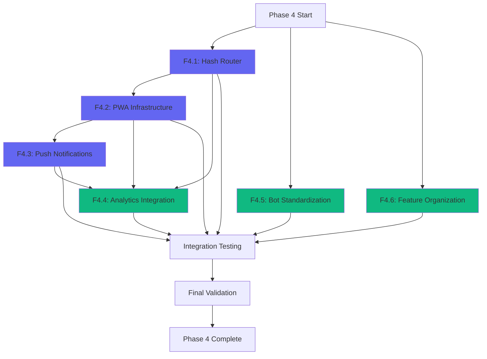

# FASE 4 - EXECUTION BLUEPRINT
## Multi-Agent Orchestration Plan for PWA, Navigation & Technical Debt

**Version:** 1.0  
**Date:** 11/02/2026  
**Status:** AUTHORIZED  
**Orchestrator:** Architect-Orchestrator Agent  
**Baseline:** Phase 3 Completed  
**Target Completion:** 42 Story Points  

---

## EXECUTIVE SUMMARY

This execution blueprint provides a deterministic, traceable operational workflow for Phase 4 implementation within a multi-agent ecosystem. It synthesizes requirements from `PRD_FASE_4_ROADMAP_2026.md`, architectural patterns from `ARQUITETURA_FRAMEWORK.md`, and current implementation state from `roadmap_2026_meus_remedios.md` into an actionable orchestration plan.

**Phase 4 Strategic Objectives:**
- Transform app into installable PWA (OE4.1: >30% mobile installations)
- Enable native push notifications (OE4.2: >50% opt-in rate)
- Implement shareable navigation via deep links (OE4.3: >20% usage)
- Reduce technical debt through code standardization (OE4.4: >30% duplication reduction)

**Critical Success Factors:**
- Zero cost principle maintained (R$ 0 operational cost)
- Lighthouse PWA score ≥ 90
- No regression in existing functionality
- Complete architectural compliance with ARQUITETURA_FRAMEWORK.md

---

## 1. AGENT HIERARCHY & ROLE ASSIGNMENTS

### 1.1 Orchestrator Layer

**Architect-Orchestrator (Primary Coordinator)**
- **Responsibilities:** Task delegation, conflict resolution, quality gate validation, progress tracking
- **Authority Level:** Final decision on architectural conflicts, authorization of phase transitions
- **Communication Protocol:** 5-step handshake with all parent agents
- **State Management:** Maintains global execution context, dependency graph, validation checkpoints

### 1.2 Parent Agent Assignments

| Agent-Pai | Primary Features | Subagents Activated | Estimated Effort |
|-----------|-----------------|---------------------|------------------|
| **Frontend Agent** | F4.1 (Hash Router), F4.2 (PWA UI), F4.4 (Analytics) | FA1 (Component Engineer), FA2 (Hook Developer) | 24 SP |
| **Backend Agent** | F4.3 (Push API), Database Migration | BA3 (Service Developer), BA1 (Migration Specialist) | 8 SP |
| **Infraestrutura Agent** | F4.2 (Service Worker), F4.3 (VAPID), Vercel Config | IA1 (Env Manager), IA2 (Deploy Configurator), IA3 (Integration Specialist) | 13 SP |
| **Qualidade Agent** | Test Coverage, Lighthouse Validation | QA1 (Test Engineer), QA2 (Coverage Analyst) | 5 SP |
| **Debug Agent** | F4.5 (Bot Standardization), F4.6 (Feature Organization) | N/A (Direct execution) | 10 SP |
| **Documentação Agent** | API docs, Migration docs, User guides | DA1 (Technical Writer), DA2 (API Documenter) | 3 SP |
| **Revisão Agent** | Code review, Security audit, Performance validation | RA1 (Standards Enforcer), RA2 (Security Reviewer) | Continuous |

### 1.3 Subagent Specializations

**Frontend Subagents:**
- **FA1 - Component Engineer:** InstallPrompt, PushPermission, HashRouter components
- **FA2 - Hook Developer:** useHashRouter, usePWAInstall, usePushSubscription hooks

**Backend Subagents:**
- **BA1 - Migration Specialist:** push_subscriptions table, RLS policies
- **BA3 - Service Developer:** push-subscribe.js, push-send.js serverless functions

**Infrastructure Subagents:**
- **IA1 - Env Manager:** VAPID keys, service worker config
- **IA2 - Deploy Configurator:** Vercel cron jobs, PWA headers
- **IA3 - Integration Specialist:** Web Push API, Workbox configuration

**Quality Subagents:**
- **QA1 - Test Engineer:** Unit tests for new components/hooks
- **QA2 - Coverage Analyst:** Lighthouse audits, coverage reports

---

## 2. EXECUTION PHASES & TASK SEQUENCES

### PHASE 4.1: FOUNDATION - Hash Router & Navigation (Wave 1)

**Duration:** 8 Story Points  
**Dependencies:** None  
**Parallel Execution:** Can run alongside F4.5, F4.6  

#### Task Sequence 4.1.1: Core Router Implementation

**Agent:** Frontend Agent → FA2 (Hook Developer)  
**State:** VALIDATING → AUTHORIZED → ACTIVE  

**Input Contract:**
```typescript
interface RouterTaskInput {
  routes: RouteDefinition[];
  fallbackRoute: string;
  historyMode: 'hash' | 'browser';
  parameterSupport: boolean;
}
```

**Output Contract:**
```typescript
interface RouterTaskOutput {
  hookPath: string; // src/hooks/useHashRouter.js
  componentPath: string; // src/components/navigation/HashRouter.jsx
  constantsPath: string; // src/constants/routes.js
  testCoverage: number; // Must be >= 80%
  performanceMetric: number; // Route transition < 100ms
}
```

**Execution Steps:**
1. **FA2 ACTIVE:** Create `src/hooks/useHashRouter.js`
   - Implement hash reading/writing
   - Implement history management (pushState/replaceState)
   - Implement parameter extraction (`:id` patterns)
   - Add event listener for `hashchange`
   - Return: `{ currentRoute, navigate, params, goBack }`

2. **FA2 ACTIVE:** Create `src/constants/routes.js`
   - Define route map with 9 routes (dashboard, medicamentos, estoque, etc.)
   - Define parameter patterns
   - Define fallback logic

3. **FA1 ACTIVE:** Create `src/components/navigation/HashRouter.jsx`
   - Consume useHashRouter hook
   - Render active route component
   - Handle route transitions with suspense
   - Implement 404 fallback

4. **QA1 ACTIVE:** Create test suite
   - `src/hooks/useHashRouter.test.js` (navigation, params, history)
   - `src/components/navigation/HashRouter.test.jsx` (rendering, transitions)
   - Target: >80% coverage

**Validation Gate 4.1.1:**
- [ ] `npm run lint` passes (0 errors)
- [ ] `npm run test:critical` passes
- [ ] Route transition performance < 100ms (measured)
- [ ] Test coverage >= 80%
- [ ] Browser back/forward buttons work correctly
- [ ] Invalid routes redirect to #/dashboard

**Handoff Protocol:**
```
FA2 → FA1: Hook implementation complete, API stable
FA1 → QA1: Component ready for testing
QA1 → Frontend Agent: Tests passing, coverage validated
Frontend Agent → Orchestrator: Task 4.1.1 COMPLETED
```

#### Task Sequence 4.1.2: Route Integration

**Agent:** Frontend Agent → FA1 (Component Engineer)  
**Dependencies:** Task 4.1.1 COMPLETED  

**Execution Steps:**
1. **FA1 ACTIVE:** Integrate HashRouter into `src/App.jsx`
   - Replace current navigation logic
   - Preserve existing state management
   - Ensure backward compatibility

2. **FA1 ACTIVE:** Update navigation components
   - Add hash navigation to BottomNav
   - Update links in Dashboard widgets
   - Add deep link support to relevant components

3. **QA1 ACTIVE:** Integration testing
   - Test all 9 routes manually
   - Verify no regression in existing features
   - Test deep links from external sources

**Validation Gate 4.1.2:**
- [ ] All existing features work with new router
- [ ] No console errors during navigation
- [ ] `npm run build` succeeds
- [ ] Manual testing checklist completed

**Escalation Path:**
- If regression detected → Debug Agent activated
- If performance degradation → Performance Auditor (RA3) consulted
- If architectural concern → Escalate to Orchestrator

#### Task Sequence 4.1.3: Telegram Bot Integration

**Agent:** Infraestrutura Agent → IA3 (Integration Specialist)  
**Dependencies:** Task 4.1.2 COMPLETED  

**Execution Steps:**
1. **IA3 ACTIVE:** Update bot message templates
   - Add deep link buttons to relevant commands
   - Format: `https://app-url.vercel.app/#/rota`
   - Test link generation logic

2. **IA3 ACTIVE:** Update bot documentation
   - Document new deep link patterns
   - Add examples to BOT README.md

3. **QA1 ACTIVE:** End-to-end testing
   - Send deep link from Telegram → verify app opens correct route
   - Test on Android and iOS
   - Test with parameters (e.g., `#/medicamento/:id`)

**Validation Gate 4.1.3:**
- [ ] Deep links work from Telegram on Android
- [ ] Deep links work from Telegram on iOS
- [ ] Parameters correctly extracted and used
- [ ] Bot documentation updated

**Checkpoint 4.1 - WAVE 1 COMPLETE:**
```
Orchestrator validates:
- All validation gates passed
- No blocking issues
- Ready for Phase 4.2
Status: F4.1 COMPLETED → Transition to F4.2
```

---

### PHASE 4.2: PWA INFRASTRUCTURE (Wave 2)

**Duration:** 13 Story Points  
**Dependencies:** F4.1 COMPLETED (for start_url)  
**Critical Path:** Yes (blocks F4.3)  

#### Task Sequence 4.2.1: PWA Configuration

**Agent:** Infraestrutura Agent → IA2 (Deploy Configurator)  
**State:** AUTHORIZED → ACTIVE  

**Input Contract:**
```typescript
interface PWAConfigInput {
  manifestData: ManifestConfig;
  iconSizes: number[];
  cacheStrategies: CacheStrategy[];
  serviceWorkerMode: 'generateSW' | 'injectManifest';
}
```

**Output Contract:**
```typescript
interface PWAConfigOutput {
  manifestPath: string; // public/manifest.json
  viteConfigUpdated: boolean;
  iconsGenerated: boolean;
  serviceWorkerPath: string;
  lighthouseScore: number; // Must be >= 90
}
```

**Execution Steps:**
1. **IA2 ACTIVE:** Install vite-plugin-pwa
   ```bash
   npm install -D vite-plugin-pwa
   ```

2. **IA2 ACTIVE:** Configure vite.config.js
   - Add VitePWA plugin
   - Configure manifest options
   - Configure Workbox strategies
   - Set registerType: 'autoUpdate'

3. **IA2 ACTIVE:** Create public/manifest.json
   ```json
   {
     "name": "Meus Remedios",
     "short_name": "MeusRemedios",
     "start_url": "/#/dashboard",
     "display": "standalone",
     "background_color": "#0a0a0f",
     "theme_color": "#6366f1",
     "orientation": "portrait",
     "categories": ["health", "medical"],
     "icons": [...]
   }
   ```

4. **IA2 ACTIVE:** Generate PWA icons
   - Create icons: 72, 96, 128, 144, 152, 192, 384, 512px
   - Optimize with imagemin
   - Add to public/icons/

5. **IA2 ACTIVE:** Configure Service Worker strategies
   - CacheFirst: JS/CSS/images (30 days)
   - StaleWhileRevalidate: Supabase API (5 min)
   - NetworkOnly: Write operations
   - Set cache size limits

**Validation Gate 4.2.1:**
- [ ] vite-plugin-pwa installed and configured
- [ ] manifest.json valid (use PWA manifest validator)
- [ ] All icon sizes generated and optimized
- [ ] Service Worker registers successfully
- [ ] `npm run build` generates SW correctly

#### Task Sequence 4.2.2: Install Prompt Component

**Agent:** Frontend Agent → FA1 (Component Engineer)  
**Dependencies:** Task 4.2.1 COMPLETED  

**Execution Steps:**
1. **FA1 ACTIVE:** Create `src/components/pwa/InstallPrompt.jsx`
   - Listen for `beforeinstallprompt` event
   - Store deferredPrompt
   - Render custom install card
   - Handle user acceptance/dismissal
   - Track installation with analytics

2. **FA1 ACTIVE:** Integrate into Dashboard
   - Show prompt after 3 visits (localStorage check)
   - Dismiss permanently if user declines 3 times
   - Hide if already installed (display-mode: standalone)

3. **FA1 ACTIVE:** Add iOS-specific instructions
   - Detect iOS Safari
   - Show manual installation guide
   - Include screenshots/animation

4. **QA1 ACTIVE:** Test installation flow
   - Android Chrome: automated prompt
   - iOS Safari: manual instructions
   - Desktop Chrome: mini-infobar

**Validation Gate 4.2.2:**
- [ ] Install prompt appears on supported browsers
- [ ] Prompt dismissal persists across sessions
- [ ] iOS users see manual instructions
- [ ] Installation tracked in analytics
- [ ] No prompt shown if already installed

#### Task Sequence 4.2.3: Meta Tags & Headers

**Agent:** Infraestrutura Agent → IA2 (Deploy Configurator)  
**Dependencies:** Task 4.2.1 COMPLETED  

**Execution Steps:**
1. **IA2 ACTIVE:** Update index.html meta tags
   - Add apple-mobile-web-app-capable
   - Add apple-mobile-web-app-status-bar-style
   - Add apple-touch-icon links
   - Add theme-color meta

2. **IA2 ACTIVE:** Configure Vercel headers (vercel.json)
   - Add Cache-Control for SW
   - Add X-Content-Type-Options
   - Add X-Frame-Options
   - Add Permissions-Policy

3. **IA2 ACTIVE:** Test PWA installation
   - Deploy to Vercel preview
   - Test on Android device
   - Test on iOS device
   - Test on desktop

**Validation Gate 4.2.3:**
- [ ] Meta tags present in built HTML
- [ ] Headers correctly set in Vercel
- [ ] PWA installable on Android Chrome
- [ ] PWA installable on iOS Safari (manual)
- [ ] PWA installable on desktop Chrome

#### Task Sequence 4.2.4: Lighthouse Validation

**Agent:** Qualidade Agent → QA2 (Coverage Analyst)  
**Dependencies:** Task 4.2.3 COMPLETED  

**Execution Steps:**
1. **QA2 ACTIVE:** Run Lighthouse audit
   - PWA category
   - Performance category
   - Accessibility category
   - Best Practices category

2. **QA2 ACTIVE:** Address failing audits
   - Fix any PWA checklist failures
   - Optimize performance if < 90
   - Document any acceptable exceptions

3. **QA2 ACTIVE:** Set up Lighthouse CI
   - Add lighthouse-ci config
   - Integrate with Vercel deployments
   - Set minimum thresholds

**Validation Gate 4.2.4:**
- [ ] Lighthouse PWA score >= 90
- [ ] Lighthouse Performance score >= 90
- [ ] All PWA checklist items passing
- [ ] Lighthouse CI configured

**Checkpoint 4.2 - WAVE 2 COMPLETE:**
```
Orchestrator validates:
- PWA fully functional and installable
- Lighthouse scores meet requirements
- No security vulnerabilities
- Ready for Phase 4.3
Status: F4.2 COMPLETED → Transition to F4.3
```

---

### PHASE 4.3: PUSH NOTIFICATIONS (Wave 3)

**Duration:** 8 Story Points  
**Dependencies:** F4.2 COMPLETED (requires Service Worker)  
**Critical Path:** Yes  

#### Task Sequence 4.3.1: VAPID Setup & Database

**Agent:** Backend Agent → BA1 (Migration Specialist)  
**State:** AUTHORIZED → ACTIVE  

**Input Contract:**
```typescript
interface PushSetupInput {
  vapidEmail: string;
  databaseSchema: SQLSchema;
  rlsPolicies: RLSPolicy[];
}
```

**Output Contract:**
```typescript
interface PushSetupOutput {
  vapidPublicKey: string; // Stored in env
  vapidPrivateKey: string; // Stored in env (secret)
  migrationPath: string;
  tableCreated: boolean;
  rlsEnabled: boolean;
}
```

**Execution Steps:**
1. **BA1 ACTIVE:** Generate VAPID keys
   ```bash
   npx web-push generate-vapid-keys
   ```

2. **IA1 ACTIVE:** Store keys in Vercel env vars
   - VAPID_PUBLIC_KEY (public)
   - VAPID_PRIVATE_KEY (secret)
   - VAPID_EMAIL (contact email)

3. **BA1 ACTIVE:** Create migration `.migrations/008_push_subscriptions.sql`
   ```sql
   CREATE TABLE push_subscriptions (
     id UUID DEFAULT gen_random_uuid() PRIMARY KEY,
     user_id UUID REFERENCES auth.users(id) ON DELETE CASCADE,
     endpoint TEXT NOT NULL,
     keys_p256dh TEXT NOT NULL,
     keys_auth TEXT NOT NULL,
     created_at TIMESTAMPTZ DEFAULT now(),
     updated_at TIMESTAMPTZ DEFAULT now(),
     UNIQUE(user_id, endpoint)
   );

   ALTER TABLE push_subscriptions ENABLE ROW LEVEL SECURITY;

   CREATE POLICY "Users can manage own subscriptions"
     ON push_subscriptions FOR ALL
     USING (auth.uid() = user_id);
   ```

4. **BA1 ACTIVE:** Apply migration to Supabase
   - Test in development first
   - Validate RLS policies
   - Apply to production

**Validation Gate 4.3.1:**
- [ ] VAPID keys generated and stored securely
- [ ] Migration applied successfully
- [ ] RLS policies tested and working
- [ ] Table accessible via Supabase client

#### Task Sequence 4.3.2: Push API Endpoints

**Agent:** Backend Agent → BA3 (Service Developer)  
**Dependencies:** Task 4.3.1 COMPLETED  

**Execution Steps:**
1. **BA3 ACTIVE:** Create `api/push-subscribe.js`
   - Validate subscription object
   - Extract user_id from auth token
   - Insert/update subscription in Supabase
   - Return success/error response

2. **BA3 ACTIVE:** Create `api/push-send.js`
   - Query subscriptions for user
   - Build notification payload
   - Send via web-push library
   - Handle expired subscriptions (410 Gone)
   - Log errors

3. **BA3 ACTIVE:** Create `server/services/pushService.js`
   - sendPushToUser(userId, notification)
   - sendPushToMultipleUsers(userIds, notification)
   - cleanupExpiredSubscriptions()

4. **QA1 ACTIVE:** Create API tests
   - Test subscription creation
   - Test subscription update
   - Test push sending
   - Test error handling

**Validation Gate 4.3.2:**
- [ ] API endpoints deployed to Vercel
- [ ] Endpoints protected with auth
- [ ] Push sending works end-to-end
- [ ] Error handling robust
- [ ] Tests passing with >80% coverage

#### Task Sequence 4.3.3: Service Worker Push Handler

**Agent:** Infraestrutura Agent → IA3 (Integration Specialist)  
**Dependencies:** Task 4.3.2 COMPLETED  

**Execution Steps:**
1. **IA3 ACTIVE:** Add push event handler to SW
   ```javascript
   self.addEventListener('push', (event) => {
     const data = event.data.json();
     const options = {
       body: data.body,
       icon: '/icons/icon-192.png',
       badge: '/icons/badge-72.png',
       data: { url: data.url }
     };
     event.waitUntil(
       self.registration.showNotification(data.title, options)
     );
   });
   ```

2. **IA3 ACTIVE:** Add notificationclick handler
   ```javascript
   self.addEventListener('notificationclick', (event) => {
     event.notification.close();
     event.waitUntil(
       clients.openWindow(event.notification.data.url)
     );
   });
   ```

3. **IA3 ACTIVE:** Test push reception
   - Send test push via API
   - Verify notification appears
   - Verify click opens correct URL

**Validation Gate 4.3.3:**
- [ ] Push events received by Service Worker
- [ ] Notifications displayed correctly
- [ ] Click action opens app at correct route
- [ ] Works with app closed (Android Chrome)

#### Task Sequence 4.3.4: Permission UI Component

**Agent:** Frontend Agent → FA1 (Component Engineer)  
**Dependencies:** Task 4.3.3 COMPLETED  

**Execution Steps:**
1. **FA1 ACTIVE:** Create `src/components/pwa/PushPermission.jsx`
   - Check current permission status
   - Render explanatory card (LGPD compliance)
   - Request permission on user action
   - Subscribe to push on grant
   - Send subscription to API
   - Handle denial gracefully

2. **FA1 ACTIVE:** Create `src/hooks/usePushSubscription.js`
   - Check if push supported
   - Get current subscription
   - Subscribe/unsubscribe methods
   - Sync with backend

3. **FA1 ACTIVE:** Integrate into Settings
   - Add push toggle in settings
   - Show current status
   - Allow unsubscribe

4. **QA1 ACTIVE:** Test permission flow
   - Test grant scenario
   - Test deny scenario
   - Test already granted
   - Test unsupported browser (iOS)

**Validation Gate 4.3.4:**
- [ ] Permission requested with clear explanation
- [ ] Subscription saved to backend on grant
- [ ] Unsubscribe removes from backend
- [ ] Graceful fallback on unsupported browsers
- [ ] LGPD compliance verified

#### Task Sequence 4.3.5: Cron Job Integration

**Agent:** Infraestrutura Agent → IA2 (Deploy Configurator)  
**Dependencies:** Task 4.3.4 COMPLETED  

**Execution Steps:**
1. **IA2 ACTIVE:** Update existing cron job `api/cron/check-doses.js`
   - Add push notification logic
   - Query users with upcoming doses
   - Send push via pushService
   - Log sent notifications

2. **IA2 ACTIVE:** Add rate limiting
   - Max 10 push/day/user
   - Track in Supabase or Redis
   - Skip if limit reached

3. **IA2 ACTIVE:** Test cron execution
   - Trigger manually via Vercel
   - Verify push sent
   - Verify rate limiting works

**Validation Gate 4.3.5:**
- [ ] Cron job sends push notifications
- [ ] Rate limiting enforced
- [ ] Notifications received on schedule
- [ ] No spam or excessive notifications

**Checkpoint 4.3 - WAVE 3 COMPLETE:**
```
Orchestrator validates:
- Push notifications fully functional
- VAPID keys secure
- RLS policies working
- Rate limiting active
- Ready for Phase 4.4
Status: F4.3 COMPLETED → Transition to F4.4
```

---

### PHASE 4.4: ANALYTICS INTEGRATION (Wave 4)

**Duration:** 3 Story Points  
**Dependencies:** F4.1, F4.2, F4.3 COMPLETED  
**Parallel Execution:** Can run alongside F4.5, F4.6  

#### Task Sequence 4.4.1: PWA Analytics Events

**Agent:** Frontend Agent → FA2 (Hook Developer)  
**Dependencies:** F4.1, F4.2, F4.3 COMPLETED  

**Execution Steps:**
1. **FA2 ACTIVE:** Extend `src/services/analyticsService.js`
   - Add event: `pwa_installed`
   - Add event: `push_opted_in`
   - Add event: `push_opted_out`
   - Add event: `offline_session`
   - Add event: `deep_link_accessed`

2. **FA2 ACTIVE:** Integrate tracking
   - Track `beforeinstallprompt` and `appinstalled`
   - Track push permission grant/deny
   - Track hash route changes
   - Track offline mode detection

3. **FA2 ACTIVE:** Update getSummary()
   - Add PWA metrics section
   - Add push metrics section
   - Add navigation metrics section

4. **QA1 ACTIVE:** Validate tracking
   - Trigger each event
   - Verify stored in localStorage
   - Verify getSummary() includes new metrics

**Validation Gate 4.4.1:**
- [ ] All new events tracked correctly
- [ ] No PII stored in analytics
- [ ] getSummary() includes PWA metrics
- [ ] Tests passing

**Checkpoint 4.4 - WAVE 4 COMPLETE:**
```
Orchestrator validates:
- Analytics tracking PWA events
- No privacy violations
- Ready for parallel waves
Status: F4.4 COMPLETED
```

---

### PHASE 4.5: BOT STANDARDIZATION (Wave 5 - Parallel)

**Duration:** 5 Story Points  
**Dependencies:** None (independent)  
**Parallel Execution:** Can run alongside F4.1-F4.4  

#### Task Sequence 4.5.1: Code Audit & Planning

**Agent:** Debug Agent  
**State:** AUTHORIZED → ACTIVE  

**Execution Steps:**
1. **Debug Agent ACTIVE:** Audit current bot code
   - Identify duplicated logic
   - Identify inconsistent patterns
   - Identify error handling gaps
   - Document findings

2. **Debug Agent ACTIVE:** Create refactor plan
   - List files to refactor
   - Define new structure
   - Identify breaking changes (should be none)

**Validation Gate 4.5.1:**
- [ ] Audit document created
- [ ] Refactor plan approved by Orchestrator
- [ ] No breaking changes identified

#### Task Sequence 4.5.2: Helper Utilities

**Agent:** Debug Agent  
**Dependencies:** Task 4.5.1 COMPLETED  

**Execution Steps:**
1. **Debug Agent ACTIVE:** Create `server/bot/utils/messageFormatter.js`
   - Centralize MarkdownV2 escaping
   - Create template functions
   - Reduce duplication

2. **Debug Agent ACTIVE:** Create `server/bot/utils/errorHandler.js`
   - Standardize error responses
   - Add logging
   - Add user-friendly messages

3. **Debug Agent ACTIVE:** Update all handlers
   - Replace duplicated code with helpers
   - Ensure consistent error handling
   - Maintain existing functionality

4. **QA1 ACTIVE:** Regression testing
   - Test all bot commands
   - Verify no functional changes
   - Verify error messages improved

**Validation Gate 4.5.2:**
- [ ] Duplication reduced by >30%
- [ ] All bot commands still functional
- [ ] Error handling consistent
- [ ] No user-facing changes (unless improvements)

**Checkpoint 4.5 - WAVE 5 COMPLETE:**
```
Orchestrator validates:
- Bot code standardized
- No regressions
- Duplication reduced
Status: F4.5 COMPLETED
```

---

### PHASE 4.6: FEATURE ORGANIZATION (Wave 6 - Parallel)

**Duration:** 5 Story Points  
**Dependencies:** None (independent)  
**Parallel Execution:** Can run alongside F4.1-F4.5  
**Risk Level:** HIGH (large refactor)  

#### Task Sequence 4.6.1: Structure Planning

**Agent:** Debug Agent  
**State:** AUTHORIZED → ACTIVE  

**Execution Steps:**
1. **Debug Agent ACTIVE:** Design new structure
   - Define feature boundaries
   - Map current files to new structure
   - Identify shared components

2. **Debug Agent ACTIVE:** Create migration script
   - Automate file moves
   - Update imports automatically
   - Generate report of changes

**Validation Gate 4.6.1:**
- [ ] New structure documented
- [ ] Migration script tested on copy
- [ ] Import updates validated

#### Task Sequence 4.6.2: Incremental Migration

**Agent:** Debug Agent  
**Dependencies:** Task 4.6.1 COMPLETED  

**Execution Steps:**
1. **Debug Agent ACTIVE:** Migrate feature by feature
   - Start with smallest feature (adherence)
   - Move files to new structure
   - Update imports
   - Run tests after each feature
   - Commit after each successful migration

2. **QA1 ACTIVE:** Continuous validation
   - Run `npm run lint` after each migration
   - Run `npm run test:critical` after each migration
   - Run `npm run build` after each migration

3. **Debug Agent ACTIVE:** Update Vite config
   - Add path aliases (@/features/...)
   - Update resolve.alias

**Validation Gate 4.6.2:**
- [ ] All features migrated
- [ ] All imports updated
- [ ] Lint passing
- [ ] Tests passing
- [ ] Build succeeds
- [ ] No functional regressions

**Checkpoint 4.6 - WAVE 6 COMPLETE:**
```
Orchestrator validates:
- Feature organization complete
- No regressions
- Build stable
Status: F4.6 COMPLETED
```

---

## 3. DEPENDENCY GRAPH & CRITICAL PATH

### 3.1 Dependency Matrix



### 3.2 Critical Path Analysis

**Critical Path:** F4.1 → F4.2 → F4.3 → Integration → Validation  
**Total Duration:** 29 Story Points (critical path)  
**Parallel Work:** 13 Story Points (F4.4, F4.5, F4.6)  
**Total Effort:** 42 Story Points  

**Bottleneck Identification:**
- F4.2 (PWA Infrastructure) is the longest task (13 SP)
- F4.3 (Push Notifications) blocks final integration
- F4.6 (Feature Organization) has high regression risk

**Optimization Strategies:**
- Start F4.5 and F4.6 immediately (no dependencies)
- Parallelize F4.4 with critical path
- Allocate senior resources to F4.2 (bottleneck)
- Implement F4.6 in small, testable increments

### 3.3 Dependency Contracts

**F4.1 → F4.2 Contract:**
```typescript
interface F4_1_Output {
  routerImplemented: boolean;
  startUrlDefined: string; // Must be "/#/dashboard"
  deepLinksWorking: boolean;
}
// F4.2 requires: startUrlDefined for manifest.json
```

**F4.2 → F4.3 Contract:**
```typescript
interface F4_2_Output {
  serviceWorkerRegistered: boolean;
  swRegistrationObject: ServiceWorkerRegistration;
  pwaInstallable: boolean;
}
// F4.3 requires: swRegistrationObject for pushManager.subscribe()
```

**F4.1, F4.2, F4.3 → F4.4 Contract:**
```typescript
interface F4_Combined_Output {
  routerEvents: EventEmitter;
  pwaEvents: EventEmitter;
  pushEvents: EventEmitter;
}
// F4.4 requires: All event emitters for analytics tracking
```

---

## 4. STATE MANAGEMENT & CROSS-AGENT CONTEXT

### 4.1 Global Execution State

**State Schema:**
```typescript
interface Phase4ExecutionState {
  currentWave: number; // 1-6
  completedTasks: string[]; // Task IDs
  activeAgents: AgentStatus[];
  blockedTasks: BlockedTask[];
  validationGates: ValidationGateStatus[];
  metrics: ExecutionMetrics;
  rollbackPoints: RollbackPoint[];
}

interface AgentStatus {
  agentId: string;
  state: 'DORMANT' | 'VALIDATING' | 'AUTHORIZED' | 'ACTIVE' | 'SUSPENDED';
  currentTask: string | null;
  progress: number; // 0-100
  lastHeartbeat: timestamp;
}

interface BlockedTask {
  taskId: string;
  blockedBy: string[]; // Dependency task IDs
  estimatedUnblockTime: timestamp;
}

interface ValidationGateStatus {
  gateId: string;
  status: 'PENDING' | 'PASSED' | 'FAILED';
  checks: CheckResult[];
  timestamp: timestamp;
}
```

### 4.2 Context Sharing Protocol

**Event Bus Implementation:**
```javascript
const PHASE4_EVENTS = {
  // Task lifecycle
  TASK_STARTED: 'phase4:task:started',
  TASK_COMPLETED: 'phase4:task:completed',
  TASK_FAILED: 'phase4:task:failed',
  TASK_BLOCKED: 'phase4:task:blocked',
  
  // Validation gates
  GATE_PASSED: 'phase4:gate:passed',
  GATE_FAILED: 'phase4:gate:failed',
  
  // Agent coordination
  AGENT_HANDOFF: 'phase4:agent:handoff',
  AGENT_ESCALATION: 'phase4:agent:escalation',
  
  // Checkpoints
  WAVE_COMPLETED: 'phase4:wave:completed',
  PHASE_COMPLETED: 'phase4:phase:completed'
};
```

**Context Propagation:**
1. **Task Start:** Agent broadcasts TASK_STARTED with context
2. **Dependency Check:** Orchestrator validates dependencies met
3. **Progress Updates:** Agent sends heartbeat every 5 minutes
4. **Task Complete:** Agent broadcasts TASK_COMPLETED with output contract
5. **Handoff:** Receiving agent validates input contract before ACTIVE state

### 4.3 Shared State Storage

**Location:** `plans/phase4_execution_state.json` (gitignored, local only)  
**Update Frequency:** After each task completion, validation gate, or state change  
**Backup Strategy:** Snapshot before each wave transition  

---

## 5. ERROR HANDLING & ROLLBACK PROCEDURES

### 5.1 Error Classification

| Error Level | Description | Response | Escalation |
|-------------|-------------|----------|------------|
| **L1 - Minor** | Lint warning, non-critical test failure | Agent self-corrects | None |
| **L2 - Moderate** | Test failure, performance degradation | Agent retries, Debug Agent assists | Parent Agent |
| **L3 - Severe** | Build failure, regression detected | Task suspended, rollback initiated | Orchestrator |
| **L4 - Critical** | Data loss risk, security vulnerability | Immediate halt, full rollback | Orchestrator + Human |

### 5.2 Rollback Points

**Automatic Rollback Points:**
- After each wave completion (6 rollback points)
- Before database migrations
- Before large refactors (F4.6)

**Rollback Procedure:**
```bash
# 1. Identify rollback point
git log --oneline --grep="CHECKPOINT 4.X"

# 2. Create safety branch
git branch phase4-rollback-$(date +%s)

# 3. Rollback to checkpoint
git reset --hard <checkpoint-commit>

# 4. Verify state
npm run lint && npm run test:critical && npm run build

# 5. Document incident
# Create bug_logs/phase4_rollback_YYYYMMDD.md
```

### 5.3 Conflict Resolution Matrix

| Conflict Type | Resolution Authority | Protocol |
|---------------|---------------------|----------|
| **Agent-Agent** | Orchestrator | 5-step handshake, decision logged |
| **Technical Debt vs Feature** | Orchestrator | Prioritize stability, defer feature if needed |
| **Performance vs Functionality** | Performance Auditor (RA3) + Orchestrator | Measure, set threshold, decide |
| **Security vs UX** | Security Reviewer (RA2) + Orchestrator | Security wins, find UX alternative |
| **Architectural** | Orchestrator + Human | Document decision in DECISOES_TECNICAS.md |

### 5.4 Escalation Triggers

**Automatic Escalation:**
- Validation gate fails 3 times
- Task blocked for >24 hours
- Test coverage drops below 70%
- Lighthouse score drops below 85
- Build time exceeds 60 seconds

**Manual Escalation:**
- Agent requests architectural guidance
- Conflicting requirements discovered
- Security vulnerability found
- Scope creep detected

---

## 6. VALIDATION GATES & QUALITY CHECKPOINTS

### 6.1 Continuous Validation (Every Task)

**Pre-Commit Checks:**
```bash
# Automated via git hooks
npm run lint                 # Must pass (0 errors)
npm run test:related         # Must pass (related tests)
```

**Pre-Push Checks:**
```bash
npm run test:critical        # Must pass (all critical tests)
npm run build                # Must succeed
```

**Pre-Merge Checks:**
```bash
npm run test                 # Full test suite
npm run test:coverage        # Coverage >= 80% for new code
npm run build                # Production build
```

### 6.2 Wave Completion Gates

**Gate 4.1 (Hash Router):**
- [ ] All 9 routes functional
- [ ] Deep links work from Telegram
- [ ] Browser back/forward buttons work
- [ ] Test coverage >= 80%
- [ ] Performance: route transition < 100ms
- [ ] No console errors

**Gate 4.2 (PWA):**
- [ ] Lighthouse PWA score >= 90
- [ ] Lighthouse Performance score >= 90
- [ ] Installable on Android Chrome
- [ ] Installable on iOS Safari (manual)
- [ ] Service Worker registered
- [ ] Cache strategies working
- [ ] No security warnings

**Gate 4.3 (Push Notifications):**
- [ ] VAPID keys secure (env vars only)
- [ ] Database migration applied
- [ ] RLS policies working
- [ ] Push received with app closed (Android)
- [ ] Click opens correct route
- [ ] Rate limiting enforced (10/day/user)
- [ ] LGPD compliance verified

**Gate 4.4 (Analytics):**
- [ ] All PWA events tracked
- [ ] No PII in analytics
- [ ] getSummary() includes new metrics
- [ ] Tests passing

**Gate 4.5 (Bot Standardization):**
- [ ] Duplication reduced >30%
- [ ] All commands functional
- [ ] Error handling consistent
- [ ] No user-facing regressions

**Gate 4.6 (Feature Organization):**
- [ ] All features migrated
- [ ] Imports updated
- [ ] Lint passing
- [ ] Tests passing
- [ ] Build succeeds
- [ ] No functional regressions

### 6.3 Phase Completion Gate

**Final Validation Checklist:**
- [ ] All 6 waves completed
- [ ] All validation gates passed
- [ ] Lighthouse PWA >= 90
- [ ] Lighthouse Performance >= 90
- [ ] Test coverage >= 82% (target from roadmap)
- [ ] No P0 or P1 bugs open
- [ ] Documentation updated
- [ ] CHANGELOG.md updated
- [ ] No security vulnerabilities
- [ ] Vercel deployment successful
- [ ] Manual testing checklist completed

**Manual Testing Checklist:**
```markdown
## Device Testing
- [ ] Android Chrome: PWA installation
- [ ] Android Chrome: Push notification received
- [ ] Android Chrome: Deep link from Telegram
- [ ] iOS Safari: PWA installation (manual)
- [ ] iOS Safari: Deep link from Telegram
- [ ] Desktop Chrome: PWA installation
- [ ] Desktop Chrome: Push notification

## Functional Testing
- [ ] Navigate all 9 routes
- [ ] Share deep link, verify opens correct route
- [ ] Install PWA, verify opens at dashboard
- [ ] Enable push, verify subscription saved
- [ ] Receive push, verify click opens app
- [ ] Disable push, verify subscription removed
- [ ] Test offline mode, verify cached assets load
- [ ] Test bot commands with new deep links

## Regression Testing
- [ ] All existing features work
- [ ] No console errors
- [ ] No visual regressions
- [ ] Performance not degraded
```

---

## 7. MONITORING & PROGRESS TRACKING

### 7.1 Real-Time Metrics Dashboard

**Metrics to Track:**
```typescript
interface Phase4Metrics {
  // Progress
  completedStoryPoints: number; // Out of 42
  completedTasks: number;
  completedWaves: number; // Out of 6
  
  // Quality
  testCoverage: number; // Target: >= 82%
  lighthousePWA: number; // Target: >= 90
  lighthousePerformance: number; // Target: >= 90
  lintErrors: number; // Target: 0
  
  // Performance
  buildTime: number; // Target: < 30s
  routeTransitionTime: number; // Target: < 100ms
  
  // Adoption (post-deployment)
  pwaInstallations: number; // Target: >30% mobile users
  pushOptIns: number; // Target: >50% users
  deepLinkUsage: number; // Target: >20% sessions
  
  // Technical Debt
  codeduplication: number; // Target: -30%
}
```

### 7.2 Progress Reporting Protocol

**Daily Standup (Async):**
- Each active agent reports: completed tasks, blockers, next tasks
- Orchestrator consolidates and updates execution state
- Blockers escalated immediately

**Wave Completion Report:**
- Summary of completed tasks
- Validation gate results
- Metrics snapshot
- Lessons learned
- Adjustments for next wave

**Phase Completion Report:**
- Full metrics comparison (baseline vs achieved)
- All validation gates status
- Known issues and workarounds
- Recommendations for Phase 5
- Updated roadmap with actual vs estimated effort

### 7.3 Monitoring Hooks

**Git Hooks:**
```bash
# .git/hooks/pre-commit
npm run lint || exit 1
npm run test:related || exit 1

# .git/hooks/pre-push
npm run test:critical || exit 1
npm run build || exit 1
```

**CI/CD Hooks (Vercel):**
```yaml
# .github/workflows/phase4-validation.yml
on: [push, pull_request]
jobs:
  validate:
    - run: npm run lint
    - run: npm run test
    - run: npm run build
    - run: npx lighthouse-ci --config=.lighthouserc.json
```

**Cron Monitoring:**
```javascript
// api/cron/phase4-health-check.js
// Runs daily during Phase 4 implementation
// Checks: build status, test status, deployment status
// Alerts: Slack/email if critical metrics degraded
```

---

## 8. AGENT COMMUNICATION PROTOCOLS

### 8.1 Handshake Protocol (5 Steps)

**Step 1: Task Assignment**
```
Orchestrator → Parent Agent
Message: {
  type: 'TASK_ASSIGNMENT',
  taskId: '4.1.1',
  priority: 'P0',
  dependencies: [],
  inputContract: {...},
  deadline: timestamp
}
```

**Step 2: Subagent Activation**
```
Parent Agent → Subagent(s)
Message: {
  type: 'SUBAGENT_ACTIVATION',
  subtaskId: '4.1.1.a',
  context: {...},
  expectedOutput: {...}
}
```

**Step 3: Progress Reporting**
```
Subagent → Parent Agent (every 5 min or on milestone)
Message: {
  type: 'PROGRESS_UPDATE',
  subtaskId: '4.1.1.a',
  progress: 75,
  status: 'ACTIVE',
  blockers: []
}
```

**Step 4: Consolidation**
```
Parent Agent → Orchestrator
Message: {
  type: 'TASK_COMPLETION',
  taskId: '4.1.1',
  outputContract: {...},
  validationResults: {...},
  nextTasks: ['4.1.2']
}
```

**Step 5: Validation & Authorization**
```
Orchestrator → Parent Agent
Message: {
  type: 'TASK_VALIDATED',
  taskId: '4.1.1',
  status: 'APPROVED',
  nextAuthorization: '4.1.2'
}
```

### 8.2 Escalation Protocol

**Level 1: Subagent → Parent Agent**
```
Subagent detects issue → Reports to Parent Agent
Parent Agent attempts resolution
If resolved: Continue
If not resolved: Escalate to Level 2
```

**Level 2: Parent Agent → Orchestrator**
```
Parent Agent escalates → Orchestrator analyzes
Orchestrator makes decision or activates specialist agent
Decision logged in execution state
```

**Level 3: Orchestrator → Human**
```
Orchestrator identifies architectural decision needed
Creates decision document in docs/past_deliveries/DECISOES_TECNICAS.md
Awaits human approval
Implements approved decision
```

### 8.3 Conflict Resolution

**Scenario: Two agents modify same file**
```
1. Git detects conflict
2. Both agents suspended (SUSPENDED state)
3. Orchestrator analyzes changes
4. Orchestrator decides:
   - Merge both changes (if compatible)
   - Prioritize one agent (if conflicting)
   - Rollback both and re-plan (if major conflict)
5. Decision communicated to both agents
6. Agents resume (ACTIVE state)
```

---

## 9. ARCHITECTURAL COMPLIANCE VALIDATION

### 9.1 Framework Adherence Checklist

**ARQUITETURA_FRAMEWORK.md Compliance:**
- [ ] All agents follow defined hierarchy (Section 1.1)
- [ ] Agent lifecycle states respected (Section 1.2)
- [ ] 5-step handshake protocol used (Section 1.3)
- [ ] Event bus for synchronization (Section 1.3)
- [ ] Quality gates enforced (Section 2)
- [ ] Git workflow followed (Section 3.1)
- [ ] Code review checklist applied (Section 3.2)
- [ ] Documentation created (Section 3.3)
- [ ] File structure maintained (Section 4.1)
- [ ] Naming conventions followed (Section 4.2)
- [ ] Lint rules enforced (Section 4.3)
- [ ] Component patterns used (Section 4.4)
- [ ] Agent responsibilities respected (Section 5)
- [ ] Third-party integration patterns followed (Section 6)
- [ ] Anti-patterns avoided (Section 7)
- [ ] Quality metrics met (Section 8)

### 9.2 PRD Traceability Matrix

| PRD Requirement | Implementation Task | Validation Gate | Status |
|-----------------|---------------------|-----------------|--------|
| F4.1 - Hash Router | Task 4.1.1, 4.1.2, 4.1.3 | Gate 4.1 | Pending |
| F4.2 - PWA | Task 4.2.1, 4.2.2, 4.2.3, 4.2.4 | Gate 4.2 | Pending |
| F4.3 - Push Notifications | Task 4.3.1, 4.3.2, 4.3.3, 4.3.4, 4.3.5 | Gate 4.3 | Pending |
| F4.4 - Analytics PWA | Task 4.4.1 | Gate 4.4 | Pending |
| F4.5 - Bot Standardization | Task 4.5.1, 4.5.2 | Gate 4.5 | Pending |
| F4.6 - Feature Organization | Task 4.6.1, 4.6.2 | Gate 4.6 | Pending |
| OE4.1 - PWA Installations >30% | Post-deployment tracking | Analytics | Pending |
| OE4.2 - Push Opt-in >50% | Post-deployment tracking | Analytics | Pending |
| OE4.3 - Deep Links >20% | Post-deployment tracking | Analytics | Pending |
| OE4.4 - Duplication -30% | Task 4.5.2 | Gate 4.5 | Pending |

### 9.3 Roadmap Alignment

**Roadmap 2026 - Fase 4 Milestones:**
- P10: PWA Instalável → F4.2
- P10b: Push Notifications → F4.3
- P11: Hash Router → F4.1
- P12: Padronização Bot → F4.5
- P13: Organização Features → F4.6
- N04: Analytics PWA → F4.4

**All milestones mapped to execution tasks ✓**

---

## 10. RISK MITIGATION STRATEGIES

### 10.1 High-Risk Areas

**Risk 1: Service Worker Cache Bugs**
- **Probability:** Medium
- **Impact:** High (stale data, broken app)
- **Mitigation:**
  - Implement cache versioning
  - Add "Force Refresh" button in settings
  - Test extensively with cache disabled
  - Monitor for cache-related errors post-deployment
  - Rollback plan: disable SW, revert to network-only

**Risk 2: Push Notification Spam**
- **Probability:** Low
- **Impact:** High (user annoyance, uninstalls)
- **Mitigation:**
  - Enforce rate limiting (10/day/user)
  - Add notification preferences in settings
  - Test cron job thoroughly before production
  - Monitor notification volume post-deployment
  - Rollback plan: disable cron job, manual notifications only

**Risk 3: Feature Organization Breaks Imports**
- **Probability:** Medium
- **Impact:** High (build failure, app broken)
- **Mitigation:**
  - Migrate incrementally (one feature at a time)
  - Run full test suite after each migration
  - Use automated import update script
  - Create rollback point before starting
  - Rollback plan: git reset to pre-refactor commit

**Risk 4: iOS PWA Limitations**
- **Probability:** High
- **Impact:** Medium (reduced functionality on iOS)
- **Mitigation:**
  - Document iOS limitations clearly
  - Provide manual installation instructions
  - Maintain Telegram bot as primary channel
  - Test on iOS Safari 16.4+
  - Fallback: Web app remains fully functional

**Risk 5: VAPID Keys Exposed**
- **Probability:** Low
- **Impact:** Critical (security breach)
- **Mitigation:**
  - Store keys in Vercel env vars only
  - Never commit keys to git
  - Add .env.example with placeholder values
  - Audit code for accidental exposure
  - Rollback plan: regenerate keys, update all subscriptions

### 10.2 Contingency Plans

**Plan A: Critical Bug in Production**
```
1. Immediate rollback to previous stable version
2. Debug Agent investigates root cause
3. Fix applied in hotfix branch
4. Expedited testing and deployment
5. Post-mortem document created
```

**Plan B: Lighthouse Score Below Threshold**
```
1. Performance Auditor (RA3) analyzes report
2. Identify bottlenecks (bundle size, cache, etc.)
3. Apply optimizations incrementally
4. Re-test after each optimization
5. If threshold not met, defer non-critical features
```

**Plan C: Test Coverage Drops Below 70%**
```
1. Identify uncovered code paths
2. QA1 (Test Engineer) creates missing tests
3. Prioritize critical paths first
4. Defer non-critical coverage to Phase 5
5. Document coverage gaps
```

**Plan D: Scope Creep Detected**
```
1. Orchestrator halts new feature work
2. Review scope against PRD
3. Defer out-of-scope items to Phase 5
4. Communicate scope boundaries to all agents
5. Resume with strict scope adherence
```

---

## 11. SUCCESS CRITERIA & ACCEPTANCE

### 11.1 Technical Acceptance Criteria

**Must Have (P0):**
- [ ] PWA installable on Android Chrome, iOS Safari, Desktop Chrome
- [ ] Lighthouse PWA score >= 90
- [ ] Lighthouse Performance score >= 90
- [ ] Push notifications working on Android Chrome
- [ ] Deep links working from Telegram
- [ ] All 9 routes functional
- [ ] Service Worker registered and caching correctly
- [ ] VAPID keys secure (env vars only)
- [ ] Database migration applied with RLS
- [ ] Test coverage >= 82%
- [ ] Lint errors = 0
- [ ] Build succeeds in < 30s
- [ ] No P0 or P1 bugs

**Should Have (P1):**
- [ ] Analytics tracking PWA events
- [ ] Bot code duplication reduced >30%
- [ ] Feature organization completed
- [ ] Push rate limiting enforced
- [ ] iOS manual installation guide
- [ ] Offline mode with cached assets

**Nice to Have (P2):**
- [ ] Push notifications on desktop
- [ ] Advanced cache strategies
- [ ] PWA update prompt
- [ ] Analytics dashboard

### 11.2 Business Acceptance Criteria

**Post-Deployment (30 days):**
- [ ] PWA installations > 30% of mobile users
- [ ] Push opt-in rate > 50% of users
- [ ] Deep link usage > 20% of sessions
- [ ] No increase in support tickets
- [ ] No security incidents
- [ ] App store rating maintained or improved

### 11.3 Sign-Off Requirements

**Technical Sign-Off:**
- [ ] Orchestrator validates all gates passed
- [ ] Qualidade Agent confirms quality metrics met
- [ ] Revisão Agent approves code quality
- [ ] Infraestrutura Agent confirms deployment stable

**Business Sign-Off:**
- [ ] Product Owner approves functionality
- [ ] User acceptance testing completed
- [ ] Documentation reviewed and approved
- [ ] Deployment to production authorized

---

## 12. POST-IMPLEMENTATION ACTIVITIES

### 12.1 Documentation Updates

**Required Documentation:**
- [ ] Update `CHANGELOG.md` with Phase 4 changes
- [ ] Update `README.md` with PWA installation instructions
- [ ] Create `docs/PWA_GUIDE.md` (user guide)
- [ ] Create `docs/PUSH_NOTIFICATIONS_GUIDE.md` (user guide)
- [ ] Update `docs/API_SERVICES.md` with new endpoints
- [ ] Create `docs/past_deliveries/FASE_4_IMPLEMENTATION_SUMMARY.md`
- [ ] Update `docs/ARQUITETURA.md` with new components
- [ ] Update `server/BOT README.md` with deep link patterns

### 12.2 Knowledge Transfer

**Internal Knowledge Transfer:**
- [ ] Conduct Phase 4 retrospective
- [ ] Document lessons learned
- [ ] Update agent playbooks with new patterns
- [ ] Share best practices with team

**User Communication:**
- [ ] Announce PWA installation feature
- [ ] Announce push notifications feature
- [ ] Create tutorial videos/GIFs
- [ ] Update FAQ with PWA questions

### 12.3 Monitoring Setup

**Production Monitoring:**
- [ ] Set up Lighthouse CI for continuous monitoring
- [ ] Configure alerts for Lighthouse score drops
- [ ] Monitor PWA installation events
- [ ] Monitor push notification delivery rates
- [ ] Monitor deep link usage
- [ ] Monitor Service Worker errors
- [ ] Set up error tracking (Sentry or similar)

### 12.4 Continuous Improvement

**Optimization Opportunities:**
- [ ] Analyze PWA installation funnel
- [ ] Optimize push notification timing
- [ ] Improve cache hit rates
- [ ] Reduce bundle size further
- [ ] Enhance offline capabilities

**Phase 5 Preparation:**
- [ ] Document Phase 4 blockers for Phase 5
- [ ] Identify technical debt to address
- [ ] Plan Phase 5 dependencies on Phase 4
- [ ] Update roadmap with actual vs estimated effort

---

## 13. APPENDIX

### 13.1 Glossary

| Term | Definition |
|------|------------|
| **PWA** | Progressive Web App - web app installable like native app |
| **Service Worker** | Background script enabling offline functionality and push |
| **VAPID** | Voluntary Application Server Identification - push auth protocol |
| **Hash Router** | Client-side routing using URL hash (#/route) |
| **Deep Link** | URL that opens app at specific screen/state |
| **RLS** | Row Level Security - Supabase database security |
| **Workbox** | Library for Service Worker caching strategies |
| **Story Point** | Relative effort estimation unit |

### 13.2 Reference Documents

| Document | Purpose | Location |
|----------|---------|----------|
| PRD Fase 4 | Requirements specification | `plans/PRD_FASE_4_ROADMAP_2026.md` |
| Roadmap 2026 | Strategic roadmap | `plans/roadmap_2026_meus_remedios.md` |
| Architectural Framework | Technical governance | `docs/ARQUITETURA_FRAMEWORK.md` |
| Code Standards | Coding conventions | `docs/PADROES_CODIGO.md` |
| Test Strategy | Testing approach | `docs/OTIMIZACAO_TESTES_ESTRATEGIA.md` |

### 13.3 Contact & Escalation

| Role | Responsibility | Escalation Path |
|------|---------------|-----------------|
| Orchestrator | Overall coordination | Human (architectural decisions) |
| Frontend Agent | UI/UX implementation | Orchestrator (conflicts) |
| Backend Agent | API/database | Orchestrator (conflicts) |
| Infraestrutura Agent | Deployment/config | Orchestrator (critical issues) |
| Qualidade Agent | Quality assurance | Orchestrator (quality gates fail) |
| Debug Agent | Bug fixes/refactoring | Orchestrator (scope questions) |

### 13.4 Version History

| Version | Date | Author | Changes |
|---------|------|--------|---------|
| 1.0 | 11/02/2026 | Architect-Orchestrator | Initial execution blueprint |

---

**END OF EXECUTION BLUEPRINT**

*This document serves as the authoritative operational guide for Phase 4 implementation. All agents must adhere to the protocols, validation gates, and architectural patterns defined herein. Any deviations require explicit authorization from the Orchestrator.*

**Next Steps:**
1. Orchestrator reviews and authorizes blueprint
2. Agents transition to VALIDATING state
3. Wave 1 (F4.1) begins upon authorization
4. Progress tracked via execution state file
5. Daily standups for coordination
6. Wave completion reports after each checkpoint

**Authorization Status:** PENDING ORCHESTRATOR APPROVAL  
**Estimated Start Date:** Upon approval  
**Estimated Completion:** 42 story points (effort-based, not time-based)
