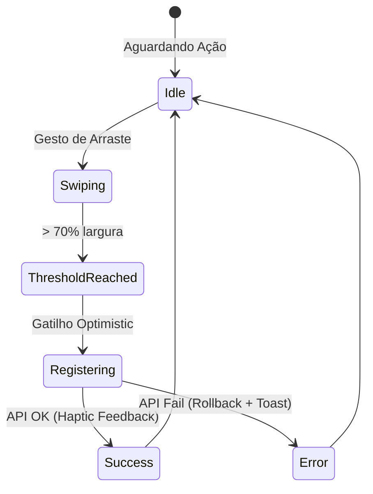
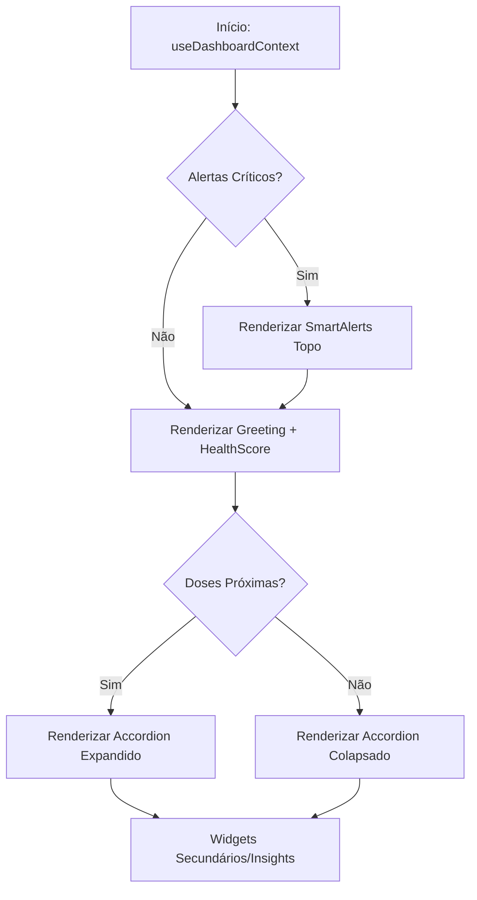

# Product Requirements Document (PRD): Health Command Center

**Versão:** 1.0  
**Status:** DRAFT  
**Responsável:** Arquiteto de Soluções & Especialista de Produto  
**Data:** 05/02/2026

---

## 1. Visão Geral e Objetivos Estratégicos

O **Health Command Center** é a evolução do dashboard do "Meus Remédios", transicionando de um repositório passivo de dados para um **assistente proativo inteligente**. O objetivo central é maximizar a aderência terapêutica através da redução da carga cognitiva e do reforço positivo.

### Objetivos Estratégicos:
- **Redução de Fricção:** Registro de doses em menos de 2 segundos via gestos (Swipe).
- **Engajamento Gamificado:** Uso do `Health Score` como métrica de progresso e "streak".
- **Gestão Preditiva:** Antecipação de falta de estoque e alertas de atraso contextuais.
- **Eficiência Técnica:** Operação sob o paradigma "Custo Zero" (cálculos client-side, cache agressivo).

---

## 2. Descrição Detalhada de Componentes

### 2.1 Widgets de Adesão (Health Score)
- **Visual:** Gráfico de progresso circular (SVG) centralizado no Hero.
- **Métricas:** Exibe o Score (0-100), a tendência (seta up/down) e o "Streak" atual (dias seguidos).
- **Interação:** Clique no widget abre o detalhamento histórico da última semana.

### 2.2 Cronograma de Medicamentos (Treatment Accordion)
- **Agrupamento:** Medicamentos pertencentes a um mesmo protocolo (ex: *Fantastic Four*) são agrupados em um Accordion.
- **Visualização:** Lista ordenada por horário da próxima dose. 
- **Swipe to Register:** Gesto lateral em itens individuais para confirmação rápida.
- **Batch Action:** Botão "Registrar Todos em Lote" para protocolos complexos.

### 2.3 Alertas Críticos (Smart Alerts)
- **Priorização:** Cards dinâmicos que aparecem no topo da hierarquia baseados em severidade.
- **Cores de Estado:**
    - `Neon Pink` (#ff00ff): Atraso crítico (> 15 min).
    - `Amber` (#ffcc00): Estoque baixo ou dose próxima.
    - `Cyan` (#00f0ff): Informação ou sugestão de saúde.
- **CTAs Contextuais:** Botões diretos como "TOMAR AGORA" ou "COMPRAR".

### 2.4 Gestão de Estoque Integrada
- **Indicadores:** Miniaturas de progresso de estoque dentro dos cards de medicamento.
- **Automação:** Gatilho de alerta quando o estoque projetado é inferior a 3 dias de tratamento.

---

## 3. Comportamento Dinâmico e Regras de Negócio

### 3.1 Lógica de Cálculo do Health Score
O score é calculado em tempo real no cliente (sem chamadas extras ao Supabase) utilizando os dados dos últimos 30 dias presentes no cache SWR:

| Componente | Peso | Critério |
|------------|------|----------|
| **Adesão** | 60% | (Doses Registradas / Doses Previstas) |
| **Pontualidade** | 20% | (Doses no Horário / Total de Doses) - tolerância de 15min |
| **Integridade de Estoque** | 20% | % de medicamentos com estoque > 5 dias |

### 3.2 Gatilhos de Smart Alerts
- **Atraso:** Disparado em `t+1min`. Muda para `Crítico` (Neon Pink) em `t+15min`.
- **Estoque:** Disparado quando `quantidade_atual / doses_diarias <= 3`.

### 3.3 Estados de Interface
- **Loading:** Uso de Skeletons que mimetizam a estrutura do Health Score e dos cards.
- **Empty:** Estado motivacional encorajando o usuário a cadastrar seu primeiro medicamento/protocolo.
- **Error (Rollback):** Se um registro via Swipe falhar na API, o card volta à posição original com feedback tátil (vibração de erro) e notificação de toast.
- **Success:** Micro-animação de confete ou brilho neon ao atingir 100% de adesão no dia.

---

## 4. Casos de Uso (Mapeamento Ponta a Ponta)

### UC-01: Registro de Dose via Swipe (Individual)
- **Ator:** Usuário final.
- **Fluxo:** 
    1. Usuário visualiza o medicamento no dashboard.
    2. Realiza o gesto de arraste (swipe) para a direita.
    3. Ao atingir 70% da largura, o sistema dispara o `logService.registerDose`.
    4. UI reflete o sucesso instantaneamente (Optimistic UI).
    5. Health Score é recalculado localmente.

### UC-02: Gestão de Protocolo Complexo (Batch Registration)
- **Ator:** Usuário com protocolos como o *Fantastic Four*.
- **Fluxo:**
    1. Usuário expande o Accordion do protocolo.
    2. Visualiza a lista de 4 medicamentos.
    3. Clica em "Registrar Todos em Lote".
    4. Sistema executa `logService.createBulk` e fecha o Accordion com feedback positivo.

### UC-03: Resposta a Alerta de Estoque
- **Ator:** Usuário.
- **Fluxo:**
    1. Sistema exibe card Amber: "Estoque Baixo: Pregabalina".
    2. Usuário clica no CTA "COMPRAR".
    3. Sistema abre o link externo configurado ou modal de ajuste de estoque.

---

## 5. Critérios de Aceite Técnicos e UX

- **Performance UI:** Latência de interação (input delay) < 50ms.
- **Optimistic UI:** Registro de dose deve aparecer como "concluído" em < 100ms, independente da velocidade da rede.
- **Acessibilidade:** Touch targets para Swipe e botões devem ter no mínimo 44x44px.
- **Custo Zero:** O cálculo do Health Score e ordenação de widgets não deve gerar novos requests SQL; deve processar os dados já filtrados no cache.
- **Resiliência:** Suporte a registro offline com sincronização posterior via SWR/Supabase.

---

## 6. Diagramas de Fluxo e Estado

### 6.1 Ciclo de Vida do Registro de Dose

### 6.2 Hierarquia Dinâmica do Dashboard

---
*Este documento é a Single Source of Truth para o desenvolvimento do Health Command Center na Onda 3.*
