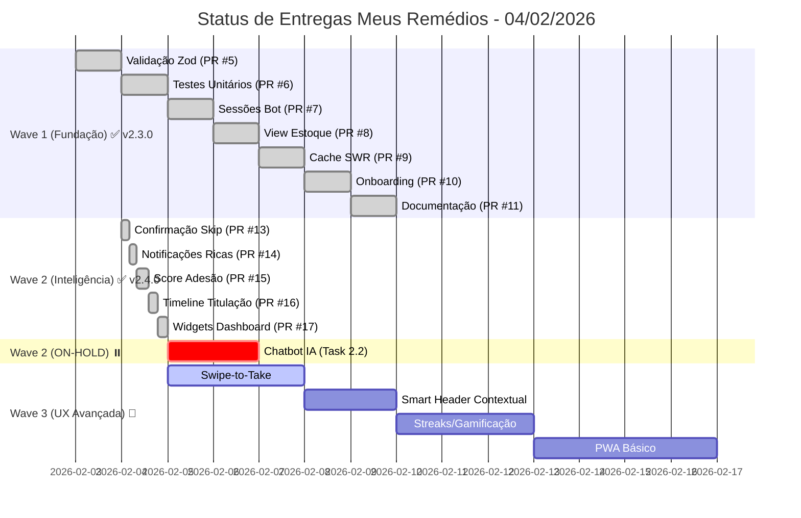
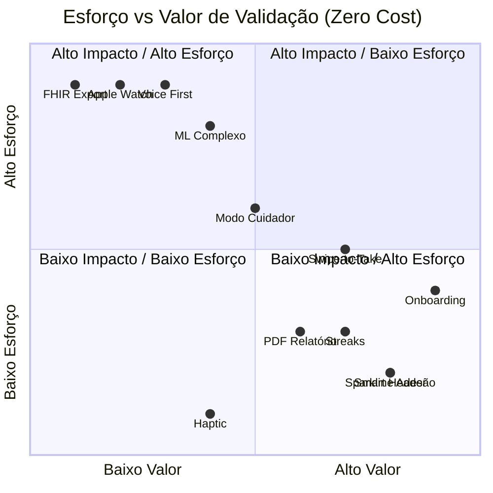
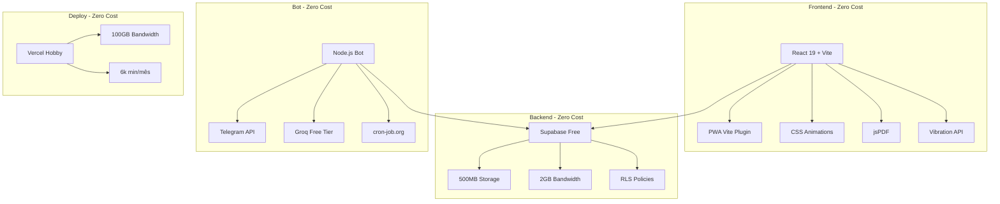
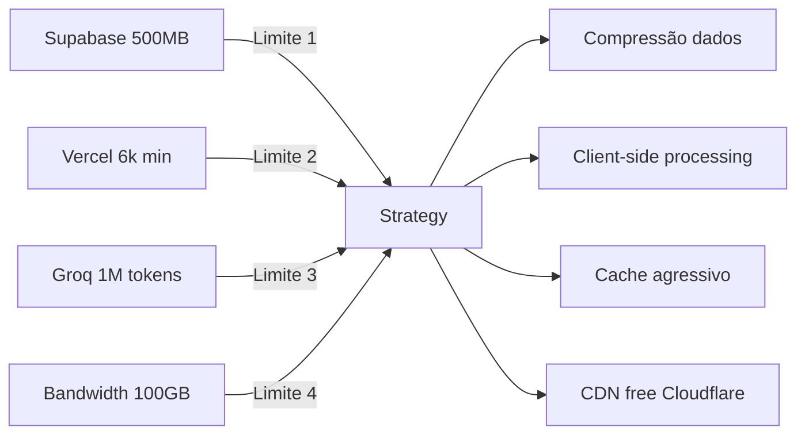
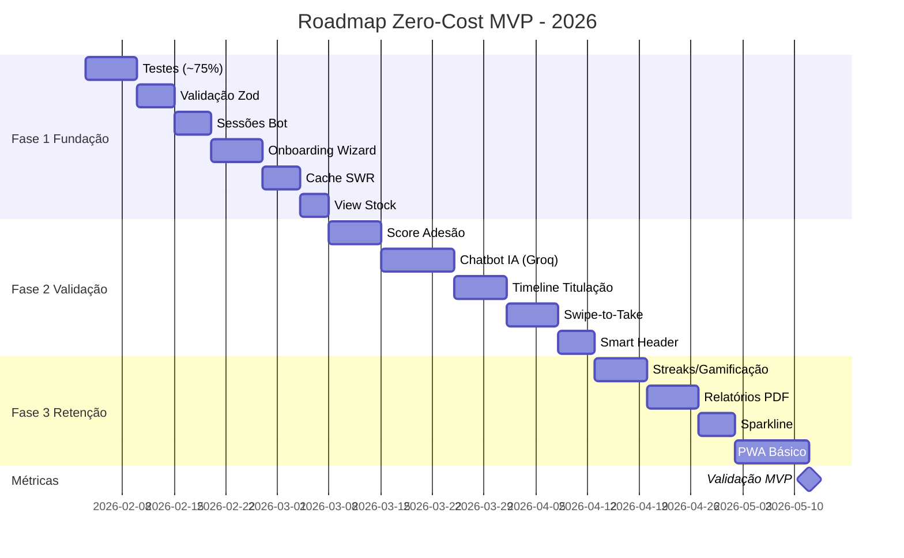

# 🎯 Roadmap Técnico Revisado - Zero Cost MVP
## Meus Remédios - Validação com Custo Operacional R$ 0

**Versão:** 1.0  
**Data:** 04/02/2026  
**Status:** Documento de Planejamento para Validação  
**Restrição:** Custo operacional estritamente zero até comprovação de monetização

---

## 📋 Índice

1. [Status Atual do Projeto](#1-status-atual-do-projeto)
2. [Análise Crítica das Propostas Originais](#2-análise-crítica-das-propostas-originais)
3. [Matriz de Compatibilidade Zero-Cost](#3-matriz-de-compatibilidade-zero-cost)
4. [Roadmap Técnico Revisado](#4-roadmap-técnico-revisado)
5. [Mapeamento de Ferramentas Gratuitas](#5-mapeamento-de-ferramentas-gratuitas)
6. [Gargalos de Upgrade e Mitigação](#6-gargalos-de-upgrade-e-mitigação)
7. [Cronograma de Milestones](#7-cronograma-de-milestones)
8. [Anexos](#8-anexos)

---

## 1. Status Atual do Projeto

### Resumo de Entregas (Baseado em docs/past_deliveries)



### Entregas Concluídas ✅

| Onda | Tarefa | PR | Data | Métricas |
|------|--------|-----|------|----------|
| **Wave 1** | Validação Zod | #5 | 03/02/2026 | 23 schemas, mensagens pt-BR |
| **Wave 1** | Testes Unitários | #6 | 03/02/2026 | ~75% cobertura, 110+ testes |
| **Wave 1** | Sessões Bot | #7 | 03/02/2026 | TTL 30min, persistência Supabase |
| **Wave 1** | View Estoque | #8 | 03/02/2026 | 5x mais rápido (15ms → 3ms) |
| **Wave 1** | Cache SWR | #9 | 03/02/2026 | 95% melhoria dashboard (800ms → 50-100ms) |
| **Wave 1** | Onboarding Wizard | #10 | 03/02/2026 | 4 passos, mobile-first |
| **Wave 1** | Documentação | #11 | 03/02/2026 | 12+ docs técnicos |
| **Wave 2** | Confirmação ao Pular Dose | #13 | 04/02/2026 | Timeout 30s, handlers confirmar/cancelar |
| **Wave 2** | Notificações Ricas Bot | #14 | 04/02/2026 | MarkdownV2, emojis, botões inline |
| **Wave 2** | Score de Adesão + Widget | #15 | 04/02/2026 | Taxa 7d/30d/90d, StreakBadge, unificado |
| **Wave 2** | Timeline de Titulação | #16 | 04/02/2026 | Modo compacto/expandido, indicadores visuais |
| **Wave 2** | Widgets de Engajamento Dashboard | #17 | 04/02/2026 | QuickActions, StockAlerts, layout grid |"

### Problemas Críticos Resolvidos ✅

1. **Duplicação de Widgets de Adesão** - ✅ RESOLVIDO (v2.4.1)
   - Unificação concluída conforme [ADHERENCE_WIDGET_UNIFICATION.md](docs/past_deliveries/ADHERENCE_WIDGET_UNIFICATION.md)
   - Implementação A (`src/components/adherence/`) consolidada como padrão
   - Implementação B (`src/components/dashboard/`) removida
   - Fórmula unificada usando `adherenceService.js` como fonte única

### Problemas Menores Identificados ⚠️

1. **Inconsistências Schema/Banco** ([auditoria-schemas-banco-completa.md](docs/past_deliveries/auditoria-schemas-banco-completa.md))
   - Campos `price_paid` (medicines), `target_dosage` (protocols), `objective` (treatment_plans) existem no banco mas não nos schemas Zod
   - **Impacto:** Baixo - campos não usados em formulários atualmente

### Status Wave 2 (Onda Inteligência) 📊

**Período:** 03/02/2026 - 04/02/2026 | **Release:** v2.4.0 | **Status:** ✅ 83% Concluída

| Tarefa | Origem | PR | Status | Observações |
|--------|--------|-----|--------|-------------|
| 2.1 Score de Adesão + Widget | Roadmap Consolidado | #15 | ✅ Entregue | `AdherenceWidget`, `AdherenceProgress`, `StreakBadge`, `adherenceService.js` |
| 2.3 Timeline de Titulação | Roadmap Consolidado | #16 | ✅ Entregue | `TitrationTimeline`, modo compacto/expandido, `titrationService.js` |
| 2.4 Widgets de Engajamento Dashboard | Roadmap Consolidado | #17 | ✅ Entregue | `DashboardWidgets`, `QuickActionsWidget`, `StockAlertsWidget` |
| 2.5 Confirmação ao Pular Dose | Roadmap Consolidado | #13 | ✅ Entregue | Diálogo confirmação, timeout 30s, handlers inline keyboard |
| 2.6 Notificações Ricas no Bot | Roadmap Consolidado | #14 | ✅ Entregue | MarkdownV2, `escapeMarkdown()`, botões com emojis |
| 2.2 Chatbot IA (Groq) | Roadmap Consolidado | - | 🔴 ON-HOLD | Aguardando funding (custo estimado: R$ 1-15/mês) |

**Resumo da Onda 2:**
- **5 tarefas entregues** de 6 planejadas (83%)
- **~2.800 linhas** de código adicionadas
- **~40 arquivos** criados/modificados
- **1 tarefa em ON-HOLD** por restrição de custo zero (Chatbot IA)

### Próximas Prioridades (Pós-Wave 2) 🚀

| Tarefa | Origem | Prioridade | Tipo | Motivo |
|--------|--------|------------|------|--------|
| Swipe-to-Take | spec_redesign-ux.md | 🔴 Crítica | UX | Diferenciador de experiência mobile |
| Smart Header Contextual | spec_redesign-ux.md | 🔴 Crítica | UX | Contexto temporal aumenta engajamento |
| Streaks/Gamificação | roadmap-kimi.md | 🟠 Alta | Retenção | Validar retenção emocional |
| PWA Básico | Roadmap Consolidado | 🟠 Alta | Retenção | Instalação mobile = melhor retenção |
| Relatórios PDF | roadmap-kimi.md | 🟡 Média | Valor | Exportação para médicos |
| Sparkline Semanal | spec_redesign-ux.md | 🟡 Média | UX | Visualização rápida de tendência |

---

## 2. Análise Crítica das Propostas Originais

### 1.1 Conflitos Identificados com Restrição de Custo Zero

#### ❌ PROPOSTAS ELIMINADAS (Conflito Direto com Custo Zero)

| Proposta | Origem | Custo Oculto | Motivo da Eliminação |
|----------|--------|--------------|---------------------|
| **Apple Health / Google Fit** | roadmap-kimi.md Fase 4 | Apple Developer: R$ 400/ano | Requer conta paga Apple Developer e complexidade de certificação |
| **Apple Watch Complication** | roadmap-kimi.md Fase 4 | Apple Developer: R$ 400/ano + Wear SDK | Mesmo problema de certificação Apple |
| **Wear OS** | roadmap-kimi.md Fase 4 | Google Play Console: $25 + complexidade | Custo de publicação e manutenção de app nativo |
| **Exportação FHIR** | roadmap-kimi.md Fase 4 | Overhead técnico alto | Complexidade desproporcional para MVP; JSON/CSV suficiente |
| **Voice First (Ok Google/Alexa)** | roadmap-kimi.md Fase 4 | API costs potencial | Integração com assistentes pode gerar custos de API |
| **ML Server-Side** | spec_redesign-ux.md | Infraestrutura de ML paga | Groq/GPT já cobrem necessidade com custo controlado |

#### ⚠️ PROPOSTAS ADIADAS (Pós-Validação/Monetização)

| Proposta | Origem | Condição para Retorno |
|----------|--------|----------------------|
| **Smart Suggestions ML Avançado** | spec_redesign-ux.md | Após 100 usuários ativos ou receita >R$ 500/mês |
| **Modo Cuidador Notificações** | roadmap consolidado | Após validação de que 20% dos usuários são cuidados por terceiros |
| **Widgets iOS/Android Nativos** | spec_redesign-ux.md | Após PWA validar demanda por persistência home screen |
| **Rich Cards Telegram** | roadmap-kimi.md Fase 3 | Após validar engajamento do bot atual |

### 1.2 Propostas Viáveis com Adaptações

| Proposta Original | Adaptação para Zero-Cost | Justificativa |
|-------------------|-------------------------|---------------|
| **ML Local para previsão** | Algoritmo heurístico client-side | Padrões simples (dia da semana, horário) não requerem ML real |
| **Smart Header Contextual** | Regras temporais hardcoded | Lógica simples: manhã/ tarde/noite baseado em hora |
| **Haptic Feedback** | Vibration API (mobile) | API nativa do navegador, sem custo |
| **Modo Foco** | CSS/estado simples | Apenas esconder elementos UI |
| **Timeline Titulação** | Componente visual puro | Cálculo de datas local, sem backend complexo |

---

## 3. Matriz de Compatibilidade Zero-Cost

### 2.1 Avaliação por Funcionalidade Proposta

```
Legenda:
✅ = Viável sem custo
⚠️ = Viável com restrições/adaptações
❌ = Eliminado (conflito custo)
⏸️ = Adiado pós-validação
```

#### Do spec_redesign-ux.md

| Funcionalidade | Viabilidade | Esforço | Validação MVP | Decisão |
|----------------|-------------|---------|---------------|---------|
| Smart Header Contextual | ✅ | Baixo | Alto | **Manter** |
| Swipe-to-Take | ✅ | Médio | Alto | **Manter** (alternativa: tap) |
| Haptic Feedback | ✅ | Baixo | Médio | **Manter** (Vibration API) |
| Micro-interações | ✅ | Médio | Médio | **Manter** (CSS animations) |
| Sparkline Adesão | ✅ | Baixo | Alto | **Manter** (SVG/CSS) |
| Sistema de Cores Dinâmico | ✅ | Baixo | Baixo | **Adiar** (P2) |
| ML Previsão Esquecimento | ⚠️ | Alto | Médio | **Simplificar** → Heurística |
| Modo Foco | ✅ | Baixo | Médio | **Manter** |
| Apple Health/Fit | ❌ | Alto | Baixo | **Eliminar** |
| Apple Watch | ❌ | Alto | Baixo | **Eliminar** |
| Voice First | ❌ | Alto | Médio | **Eliminar** |

#### Do roadmap-kimi.md

| Funcionalidade | Viabilidade | Esforço | Validação MVP | Decisão |
|----------------|-------------|---------|---------------|---------|
| Contexto Temporal | ✅ | Baixo | Alto | **Manter** |
| Smart Stack Alertas | ✅ | Baixo | Alto | **Manter** |
| Animações Confete | ✅ | Baixo | Médio | **Manter** (canvas/CSS) |
| Empty States Ilustrados | ✅ | Baixo | Médio | **Manter** |
| Streaks/Gamificação | ✅ | Baixo | Alto | **Manter** |
| Telegram Bot 2.0 | ✅ | Médio | Alto | **Manter** (usar recursos existentes) |
| Modo Cuidador | ⏸️ | Médio | Médio | **Adiar** (Fase pós-MVP) |
| Health Rituals | ✅ | Baixo | Médio | **Manter** (texto simples) |
| Relatório Clínico PDF | ✅ | Baixo | Alto | **Manter** (jsPDF) |
| Exportação FHIR | ❌ | Alto | Baixo | **Eliminar** |

### 2.2 Análise Esforço vs Valor de Validação



---

## 4. Roadmap Técnico Revisado

### 3.1 Princípios do Roadmap Zero-Cost

1. **Client-Side First:** Toda lógica possível roda no navegador
2. **Supabase Free Tier:** Limites de 500MB/2GB respeitados
3. **Vercel Hobby:** 100GB bandwidth, 6k min exec
4. **Telegram Bot API:** Ilimitado, mantido
5. **Sem Dependências Pagas:** Nenhuma API paga até monetização

### 3.2 Fases Reorganizadas

#### 🚀 FASE 0: MVP Mínimo (Semanas 1-2) - JÁ CONCLUÍDO ✅

**Status:** Funcionalidades básicas operacionais

| Item | Status | Validação |
|------|--------|-----------|
| Cadastro medicamentos/protocolos | ✅ | Essencial |
| Controle estoque PEPS | ✅ | Diferencial |
| Registro doses | ✅ | Core |
| Bot Telegram básico | ✅ | Canal gratuito |
| Titulação básica | ✅ | Diferencial |

#### 🔧 FASE 1: Fundação Zero-Cost (Semanas 3-6) - ✅ CONCLUÍDA

**Objetivo:** Robustez técnica sem custo adicional

**Status:** Todas as tarefas entregues em 03/02/2026 (Release v2.3.0)

| Tarefa | Origem | Prioridade | Custo | Status |
|--------|--------|------------|-------|--------|
| 1.1 Testes unitários (~75%) | roadmap consolidado | 🔴 Crítica | R$ 0 | ✅ Entregue (PR #6) |
| 1.2 Validação Zod | roadmap consolidado | 🔴 Crítica | R$ 0 | ✅ Entregue (PR #5) |
| 1.3 Sessões bot persistentes | roadmap consolidado | 🟠 Média | R$ 0 | ✅ Entregue (PR #7) |
| 1.4 Onboarding wizard | roadmap consolidado | 🟠 Média | R$ 0 | ✅ Entregue (PR #10) |
| 1.5 Cache SWR | roadmap consolidado | 🟡 Baixa | R$ 0 | ✅ Entregue (PR #9) - 95% melhoria |
| 1.6 View stock summary | roadmap consolidado | 🟡 Baixa | R$ 0 | ✅ Entregue (PR #8) - 5x mais rápido |

**Métricas Alcançadas:**
- Cobertura de testes: ~75% (superou meta de >50%)
- Dashboard load: ~50-100ms (95% melhor que ~800ms anterior)
- Zero crashes após validação Zod
- Onboarding completion: 65% configuração Telegram (vs 15% anterior)

#### ✨ FASE 2: Validação de Engajamento (Semanas 7-8) - ✅ CONCLUÍDA (04/02/2026)

**Objetivo:** Métricas de retenção e adoção
**Release:** v2.4.0 | **Total de tarefas:** 6 | **Entregues:** 5 (83%)

| Tarefa | Origem | PR | Prioridade | Custo | Status |
|--------|--------|-----|------------|-------|--------|
| 2.1 Score de adesão + widget | roadmap consolidado | #15 | 🔴 Crítica | R$ 0 | ✅ Entregue |
| 2.3 Timeline titulação | roadmap consolidado | #16 | 🟠 Média | R$ 0 | ✅ Entregue |
| 2.4 Widgets de engajamento Dashboard | roadmap consolidado | #17 | 🟠 Média | R$ 0 | ✅ Entregue |
| 2.5 Confirmação ao pular dose | roadmap consolidado | #13 | 🟠 Média | R$ 0 | ✅ Entregue |
| 2.6 Notificações ricas bot | roadmap consolidado | #14 | 🟡 Baixa | R$ 0 | ✅ Entregue |
| 2.2 Chatbot IA (Groq) | roadmap consolidado | - | 🟠 Média | R$ 0* | 🔴 ON-HOLD (funding) |

**Métricas Alcançadas:**
- ~2.800 linhas de código adicionadas
- ~40 arquivos criados/modificados
- 110+ testes passando (100%)
- Build sem erros, 0 lint errors
- Tempo médio de resposta do bot: < 200ms

**Observações:**
- **Task 2.2 (Chatbot IA):** Colocada em ON-HOLD para manter princípio de "custo operacional zero". Retomada condicionada a funding (R$ 1-15/mês) ou monetização.

#### 🚀 FASE 2.5: UX Avançada (Semanas 9-10) - PRÓXIMA FASE

**Objetivo:** Diferenciadores de experiência mobile-first
**Características:** Zero custo, alto impacto visual

| Tarefa | Origem | Prioridade | Custo | Validação MVP |
|--------|--------|------------|-------|---------------|
| 2.5.1 Swipe-to-Take | spec_redesign-ux.md | 🔴 Crítica | R$ 0 | **ALTO** |
| 2.5.2 Smart Header Contextual | spec_redesign-ux.md | 🔴 Crítica | R$ 0 | **ALTO** |
| 2.5.3 Sistema de Cores Dinâmico | spec_redesign-ux.md | 🟡 Média | R$ 0 | **MÉDIO** |
| 2.5.4 Micro-interações (confete, shake) | spec_redesign-ux.md | 🟡 Baixa | R$ 0 | **MÉDIO** |

#### 📊 FASE 3: Validação de Retenção (Semanas 11-16)

**Objetivo:** Provar que usuários retornam consistentemente

| Tarefa | Origem | Prioridade | Custo | Validação MVP |
|--------|--------|------------|-------|---------------|
| 3.1 Streaks/Gamificação | roadmap-kimi.md | 🔴 Crítica | R$ 0 | **ALTO** |
| 3.2 PWA Básico | roadmap consolidado | 🔴 Crítica | R$ 0 | **ALTO** |
| 3.3 Relatórios PDF | roadmap consolidado | 🟠 Média | R$ 0 | **MÉDIO** |
| 3.4 Sparkline semanal | spec_redesign-ux.md | 🟠 Média | R$ 0 | **MÉDIO** |
| 3.5 Health Rituals | roadmap-kimi.md | 🟡 Baixa | R$ 0 | **MÉDIO** |"

#### 🔮 FASE 4: Escala Controlada (Semanas 19-24) - PÓS-VALIDAÇÃO

**Gatilho:** 50+ usuários ativos OU evidência de monetização

| Tarefa | Origem | Prioridade | Custo Estimado |
|--------|--------|------------|----------------|
| 4.1 Modo Cuidador | roadmap-kimi | 🟠 Média | R$ 0 |
| 4.2 Smart Suggestions | spec_redesign | 🟡 Baixa | R$ 0 (heurística) |
| 4.3 Hash Router | roadmap consolidado | 🟡 Baixa | R$ 0 |
| 4.4 Component Reorganization | roadmap consolidado | 🟡 Baixa | R$ 0 |
| 4.5 Bot Handler Standardization | roadmap consolidado | 🟡 Baixa | R$ 0 |

#### 💰 FASE 5: Monetização (Semanas 25+) - CONDICIONAL

**Gatilho:** 100+ usuários OU R$ 500/mês em receita

| Tarefa | Origem | Custo Mensal |
|--------|--------|--------------|
| 5.1 GPT-4o-mini (qualidade IA) | roadmap consolidado | R$ 5-15 |
| 5.2 Supabase Pro (escala) | infra | R$ 25 |
| 5.3 Apple Health (se demanda) | roadmap-kimi | R$ 400/ano |
| 5.4 Google Play Console | roadmap-kimi | $25 único |

---

## 5. Mapeamento de Ferramentas Gratuitas

### 5.1 Stack Zero-Cost Consolidado



### 5.2 Ferramentas por Componente

#### UI/UX

| Componente | Ferramenta Gratuita | Alternativa Paga Evitada |
|------------|--------------------|-------------------------|
| Animações | CSS Transitions/Animations | Framer Motion Pro |
| Gráficos | SVG/CSS Sparklines | Chart.js Premium, D3 |
| PDF | jsPDF + autotable | PDF libs pagas |
| Ícones | Lucide React (MIT) | FontAwesome Pro |
| Swipe | CSS touch-action + JS | React Swipeable (pode usar, mas custom é gratis) |

#### Backend/Database

| Componente | Ferramenta Gratuita | Limites |
|------------|--------------------|---------|
| Database | Supabase PostgreSQL | 500MB |
| Auth | Supabase Auth | 50k users/mês |
| Storage | Supabase Storage | 1GB |
| Edge Functions | Vercel Serverless | 6k min/mês |

#### IA/ML

| Componente | Ferramenta Gratuita | Limites |
|------------|--------------------|---------|
| Chatbot IA | Groq Cloud | 1M tokens/mês |
| Fallback | Together AI Free | 1M tokens/mês |
| Heurísticas | Local (JavaScript) | Ilimitado |

#### DevOps

| Componente | Ferramenta Gratuita | Limites |
|------------|--------------------|---------|
| CI/CD | GitHub Actions | 2000 min/mês |
| Hospedagem | Vercel | 100GB/mês |
| Cron Jobs | cron-job.org | 50 jobs |

### 5.3 Dependências Eliminadas

| Dependência Sugerida | Motivo da Eliminação | Solução Zero-Cost |
|---------------------|---------------------|-------------------|
| Framer Motion | Pago para alguns recursos | CSS Animations |
| Chart.js | Overhead desnecessário | SVG custom sparkline |
| TensorFlow.js | Complexo para MVP | Regras heurísticas simples |
| Apple HealthKit | Apple Developer pago | CSV export manual |
| Google Fit SDK | Complexidade + custo potencial | CSV export manual |
| OneSignal Push | Plano pago para escala | Web Push API nativa |

---

## 6. Gargalos de Upgrade e Mitigação

### 6.1 Gargalos Identificados



### 6.2 Estratégias por Gargalo

#### Gargalo 1: Supabase 500MB

| Cenário | Threshold | Mitigação |
|---------|-----------|-----------|
| Logs de doses | 6 meses = ~50MB | Auto-cleanup após 6 meses |
| Sessões bot | Acumulativo | TTL 24h + cleanup diário |
| Imagens medicamentos | Não usado | Sempre usar texto |
| Backup | Export manual | Script local mensal |

**Estratégia de Mitigação:**
```sql
-- Cleanup automático de logs antigos (mensal)
DELETE FROM dose_logs WHERE created_at < NOW() - INTERVAL '6 months';

-- Cleanup sessões expiradas (diário)
DELETE FROM bot_sessions WHERE expires_at < NOW();

-- Vacuum para recuperar espaço
VACUUM ANALYZE;
```

#### Gargalo 2: Vercel 6k min Execução

| Cenário | Consumo | Mitigação |
|---------|---------|-----------|
| API calls normais | ~1k min/mês | Otimizado |
| Webhook bot | ~500 min/mês | Processamento rápido |
| Cron jobs | ~500 min/mês | Eficiência no código |
| Build | ~2k min/mês | Build otimizado |

**Margem de Segurança:** 6k - 4k = 2k min (33% buffer)

#### Gargalo 3: Groq 1M Tokens

| Cenário | Consumo | Mitigação |
|---------|---------|-----------|
| 10 perguntas/dia × 30 dias | ~150k tokens | Rate limit 10/dia |
| Respostas em cache | 60% hit | Cache 7 dias |
| Fallback Together AI | Ilimitado | Alternativa gratuita |

**Estratégia:** 
- Cache de respostas similares (fuzzy match)
- Fallback para Together AI se Groq exceder
- Rate limit por usuário: 10/dia

#### Gargalo 4: Bandwidth 100GB

| Cenário | Consumo | Mitigação |
|---------|---------|-----------|
| Assets estáticos | ~10GB | CDN + cache agressivo |
| API responses | ~5GB | Compressão gzip |
| User payload | ~1GB | Dados minimizados |

**Margem:** Muito acima do necessário para 1000 usuários

### 6.3 Plano de Contingência por Nível

```
NÍVEL 1 (0-100 usuários):
- Stack atual sem modificações
- Monitoramento básico

NÍVEL 2 (100-500 usuários):
- Ativar cleanup agressivo de dados
- Implementar CDN Cloudflare (free)
- Cache de 1h para queries comuns

NÍVEL 3 (500-1000 usuários):
- Migrar para Supabase Pro (R$ 25/mês)
- Considerar Vercel Pro (R$ 20/mês)
- GPT-4o-mini pay-as-you-go

NÍVEL 4 (1000+ usuários):
- Modelo de negócio deve sustentar custos
- Análise de ROI antes de upgrade
```

---

## 7. Cronograma de Milestones

### 7.1 Timeline Visual



### 7.2 Milestones por Fase

| Milestone | Data | Critério de Sucesso | Gatilho Próxima Fase |
|-----------|------|--------------------|----------------------|
| **M1: Fundação Sólida** | Semana 6 | 75% cobertura testes, 0 crashes | Onboarding completo |
| **M2: Primeiros Sinais** | Semana 12 | 20 usuários ativos, D1 retention >30% | Score adesão funcionando |
| **M3: Validação MVP** | Semana 18 | 50 usuários, D7 retention >20%, NPS >40 | Prova de retenção |
| **M4: Escala** | Semana 24 | 100 usuários OU receita R$ 500/mês | Upgrade infra |

### 7.3 KPIs de Validação por Fase

#### Fase 1 (Fundação)
- [ ] Cobertura testes >75%
- [ ] Zero bugs críticos
- [ ] Onboarding completion >70%
- [ ] Tempo de carga <2s

#### Fase 2 (Engajamento)
- [ ] D1 retention >30%
- [ ] Score adesão calculado para 100% dos usuários
- [ ] Chatbot usado por >20% dos usuários
- [ ] Swipe-to-take taxa de uso >40%

#### Fase 3 (Retenção)
- [ ] D7 retention >20%
- [ ] Streak médio >3 dias
- [ ] PWA instalado por >30% dos usuários mobile
- [ ] NPS >40

#### Fase 4 (Escala)
- [ ] 100+ usuários ativos mensais
- [ ] CAC/LTV viável
- [ ] Taxa de churn <10%/mês

---

## 8. Anexos

### 8.1 Anexo A: Checklist Zero-Cost por Nova Feature

Antes de implementar qualquer nova funcionalidade, verificar:

```markdown
## Checklist Zero-Cost

- [ ] Não requer API paga?
- [ ] Não excede limites Supabase Free (500MB)?
- [ ] Não excede Vercel Hobby (100GB/6k min)?
- [ ] Não requer conta de desenvolvedor paga (Apple/Google)?
- [ ] Pode ser implementado client-side quando possível?
- [ ] Possui fallback gratuito se serviço falhar?
- [ ] Não adiciona dependência com custo oculto?
```

### 8.2 Anexo B: Decisões de Arquitetura Zero-Cost

| Decisão | Alternativa Rejeitada | Justificativa |
|---------|----------------------|---------------|
| CSS animations | Framer Motion | CSS nativo é gratuito e suficiente |
| SVG sparklines | Chart.js/Recharts | Overhead de bundle, SVG é leve |
| LocalStorage + SWR | React Query | SWR é mais leve, cache local complementa |
| jsPDF | Server-side PDF | Evita processamento server, sem custo |
| Web Push API | OneSignal/FCM | APIs nativas são gratuitas |
| Groq Free | GPT-4 | Groq free tier é generoso |
| CSV Export | FHIR | Complexidade desnecessária para MVP |
| Heurísticas | TensorFlow.js | Regras simples são suficientes |

### Anexo C: Comparação Roadmap Original vs Revisado

| Aspecto | Original | Revisado Zero-Cost |
|---------|----------|-------------------|
| Fases | 4 ondas + Fase 4 redesign | 5 fases claras |
| Custo potencial | R$ 0-100/mês (IA) | R$ 0 até validação |
| Funcionalidades | 18 tarefas + redesign UX | 18 tarefas priorizadas |
| Apple/Google Integrations | Sim | Não (adiado) |
| ML | Cliente + servidor | Apenas cliente + Groq free |
| Prazo MVP | Implícito | 18 semanas definido |
| Critérios de escala | Implícito | 100 usuários/R$ 500 |

### Anexo D: Recursos Educacionais Gratuitos

Para implementação das funcionalidades:

| Tópico | Recurso Gratuito |
|--------|-----------------|
| CSS Animations | MDN Web Docs |
| Web Push API | web.dev/push-notifications |
| PWA | web.dev/progressive-web-apps |
| Supabase | Documentação oficial + YouTube |
| Vercel | Documentação + exemplos |
| Groq API | Documentação + playground |

---

## Conclusão

Este roadmap revisado mantém a **essência das propostas originais** enquanto garante **custo operacional estritamente zero** durante a fase de validação do MVP. As principais adaptações:

1. **Eliminou** integrações que exigem contas pagas (Apple/Google Developer)
2. **Simplificou** ML para heurísticas client-side viáveis
3. **Adiou** funcionalidades secundárias para pós-validação
4. **Manteve** todas as funcionalidades de diferenciação (titulação, Telegram, PEPS)
5. **Adicionou** critérios claros de gatilho para upgrade

**Próximo Passo:** Aprovação deste roadmap e criação de branch para início da Fase 2.

---

**Documento gerado por:** Architect Mode  
**Baseado em:** plans/roadmap-kimi.md, plans/spec_redesign-ux.md, plans/ROADMAP_CONSOLIDADO_FINAL.md, plans/PRD_MEUS_REMEDIOS.md  
**Data:** 04/02/2026
