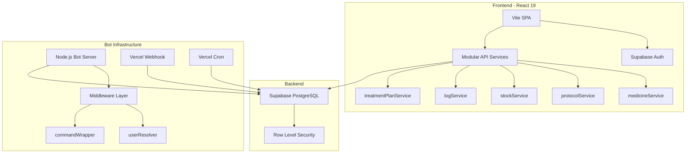
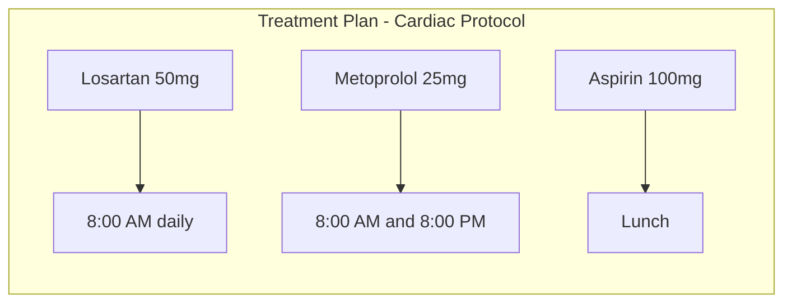

# Meus Remedios - Upgrade Plan v2.0

## Executive Summary

This document is the continuation of the comprehensive upgrade plan for Meus Remedios. After successful completion of the foundational phases (bug fixes, architecture refactor, basic UX improvements, and API modularization), this plan focuses on **elevating the application to serve users with complex medication regimens** effectively.

**Vision**: Make Meus Remedios the go-to application for users who need to manage multiple medications with titration schedules, stock tracking, and treatment plan organization.

---

## Completed Work Summary

### Phase 1: Critical Bug Fixes ✅
- Fixed Telegram bot dose registration (MOCK_USER_ID replaced with proper user lookup)
- Fixed history month navigation timezone issues
- Added error handling for unlinked users

### Phase 2: Bot Architecture Refactor ✅
- Created user resolver middleware
- Refactored all commands to use consistent patterns
- Removed MOCK_USER_ID completely
- Added command wrapper with centralized error handling

### Phase 3: UX Enhancements ✅ (Partial)
- Added calendar loading skeletons
- Implemented swipe navigation for calendar
- Added month picker dropdown
- Enhanced Telegram confirmations with quick actions

### Phase 4: Code Quality ✅ (Partial)
- Split api.js into modular services (6 focused modules)
- Maintained backward compatibility

---

## Current Architecture



---

## Phase 5: Adherence Intelligence

**Goal**: Help users understand and improve their medication adherence through data visualization and insights.

### 5.1 Adherence Score System

Create a comprehensive adherence tracking system that calculates and displays medication compliance.

**Data Model**:
```javascript
// Adherence calculation logic
const calculateAdherence = async (userId, dateRange) => {
  // Expected doses = sum of all active protocols time schedules
  // Actual doses = logs within date range
  // Score = (actual / expected) * 100
  
  return {
    overallScore: 87.5,         // percentage
    byProtocol: [...],          // per-protocol breakdown
    streak: 12,                 // consecutive days
    bestStreak: 45,             // all-time best
    missedDoses: [...],         // list of missed doses
    trends: {
      thisWeek: 92,
      lastWeek: 85,
      thisMonth: 87
    }
  }
}
```

**UI Components**:

1. **Adherence Dashboard Widget**
```jsx
// New component: src/components/adherence/AdherenceWidget.jsx
<AdherenceWidget>
  <CircularProgress percentage={adherenceRate} />
  <StreakCounter days={currentStreak} best={bestStreak} />
  <WeeklyTrend data={weeklyTrends} />
  <Encouragement score={adherenceRate} />
</AdherenceWidget>
```

2. **Protocol-Level Adherence**
- Add adherence indicator to each ProtocolCard
- Show which protocols need attention
- Highlight patterns (e.g., frequently missed morning doses)

**Implementation Tasks**:
| Task | Files Affected |
|------|---------------|
| Create adherence calculation service | New: src/services/api/adherenceService.js |
| Build CircularProgress component | New: src/components/ui/CircularProgress.jsx |
| Build AdherenceWidget | New: src/components/adherence/AdherenceWidget.jsx |
| Add streak tracking to user_settings | Database migration |
| Integrate into Dashboard | src/views/Dashboard.jsx |
| Add adherence badge to ProtocolCard | src/components/protocol/ProtocolCard.jsx |

---

### 5.2 Missed Dose Recovery Guidance

When users miss doses, provide helpful guidance rather than just showing red indicators.

**Features**:
- Contextual messages based on medication type
- Guidance from common pharmaceutical advice (e.g., take ASAP if within X hours)
- Option to log late dose vs skip entirely
- Track reasons for missed doses (optional)

```jsx
// Missed dose prompt
<MissedDoseRecovery>
  <Alert type="warning">
    You missed your 08:00 dose of Losartan
  </Alert>
  <Guidance>
    For blood pressure medications, its usually safe to take as soon as you remember,
    unless its almost time for your next dose.
  </Guidance>
  <Actions>
    <Button onClick={logLateDose}>Take Now - Log Late</Button>
    <Button variant="outline" onClick={skipDose}>Skip This Dose</Button>
  </Actions>
</MissedDoseRecovery>
```

---

## Phase 6: Intelligent Stock Management

**Goal**: Proactively help users avoid running out of medications.

### 6.1 Predictive Stock Warnings

Enhance the existing stock alert system with predictive capabilities.

**Current State**: Dashboard shows `daysRemaining < 7` as low stock.

**Enhanced System**:

```javascript
// Enhanced stock prediction
const calculateStockForecast = (medicine, protocols, currentStock) => {
  const dailyConsumption = protocols
    .filter(p => p.medicine_id === medicine.id && p.active)
    .reduce((sum, p) => sum + (p.dosage_per_intake * p.time_schedule.length), 0)
  
  const daysRemaining = dailyConsumption > 0 ? currentStock / dailyConsumption : Infinity
  
  // Consider titration schedule changes
  const upcomingTitrations = protocols.filter(p => 
    p.titration_schedule && 
    p.titration_schedule.length > p.current_stage_index + 1
  )
  
  return {
    daysRemaining,
    runOutDate: addDays(new Date(), daysRemaining),
    consumptionRate: dailyConsumption,
    urgency: daysRemaining <= 3 ? 'critical' : daysRemaining <= 7 ? 'warning' : 'ok',
    affectedProtocols: protocols.filter(p => p.medicine_id === medicine.id),
    titrationImpact: upcomingTitrations.length > 0
  }
}
```

**UI Enhancements**:

1. **Stock Alert Panel in Dashboard**
```jsx
<StockAlertPanel>
  {criticalStock.map(item => (
    <StockAlertItem 
      key={item.medicine.id}
      medicine={item.medicine}
      daysRemaining={item.daysRemaining}
      runOutDate={item.runOutDate}
      onRestock={() => navigate to stock with medicine pre-selected}
    />
  ))}
</StockAlertPanel>
```

2. **Reorder Reminders via Telegram**
```javascript
// In tasks.js - daily check for stock levels
async function checkStockLevels(bot, userId, chatId) {
  const criticalStock = await getCriticalStock(userId)
  
  if (criticalStock.length > 0) {
    const message = formatStockAlert(criticalStock)
    await bot.sendMessage(chatId, message, {
      parse_mode: 'Markdown',
      reply_markup: {
        inline_keyboard: [[
          { text: 'Ver Estoque', callback_data: 'quick_stock' }
        ]]
      }
    })
  }
}
```

### 6.2 Stock Purchase History and Price Tracking

Help users track spending and find best purchase options.

**Features**:
- Historical price per unit tracking
- Average price calculation (already partially implemented)
- Monthly/yearly medication cost summary
- Expiration date management with alerts

```jsx
<StockPriceHistory medicine={medicine}>
  <PriceChart data={priceHistory} />
  <Stats>
    <Stat label="Avg Price" value={formatCurrency(avgPrice)} />
    <Stat label="Best Price" value={formatCurrency(minPrice)} source={bestSource} />
    <Stat label="Total Spent" value={formatCurrency(totalSpent)} period="this year" />
  </Stats>
</StockPriceHistory>
```

---

## Phase 7: Treatment Plan Enhancement

**Goal**: Make treatment plan management more intuitive for complex multi-medication regimens.

### 7.1 Treatment Plan Dashboard View

Create a dedicated view for managing and visualizing treatment plans.

**Features**:
- Visual timeline of all protocols within a plan
- Drag-and-drop protocol ordering
- Plan-level adherence statistics
- Plan templates for common conditions



**UI Components**:

```jsx
<TreatmentPlanView plan={selectedPlan}>
  <PlanHeader>
    <PlanName>{plan.name}</PlanName>
    <PlanObjective>{plan.objective}</PlanObjective>
    <PlanAdherence score={planAdherence} />
  </PlanHeader>
  
  <ProtocolTimeline protocols={plan.protocols}>
    {protocols.map(p => (
      <TimelineItem 
        protocol={p}
        titrationProgress={p.titration_scheduler_data}
        adherence={getProtocolAdherence(p.id)}
      />
    ))}
  </ProtocolTimeline>
  
  <PlanActions>
    <Button onClick={addProtocol}>Add Medication</Button>
    <Button onClick={editPlan}>Edit Plan</Button>
    <Button variant="danger" onClick={pausePlan}>Pause All</Button>
  </PlanActions>
</TreatmentPlanView>
```

### 7.2 Protocol Grouping and Dependencies

Allow protocols to have relationships and dependencies.

**Use Cases**:
- Take medication B 30 minutes after medication A
- Skip medication C if medication D was taken today
- Alternate between medication E and F

**Data Model Extension**:
```sql
-- New column for protocol relationships
ALTER TABLE protocols ADD COLUMN depends_on_protocol_id uuid REFERENCES protocols(id);
ALTER TABLE protocols ADD COLUMN relationship_type text; -- 'after', 'instead_of', 'with'
ALTER TABLE protocols ADD COLUMN relationship_delay_minutes int;
```

---

## Phase 8: Enhanced Titration Experience

**Goal**: Make titration management foolproof for users with complex dose escalation schedules.

### 8.1 Titration Timeline Visualization

Create a visual timeline showing titration progress and upcoming changes.

```jsx
<TitrationTimeline protocol={protocol}>
  <TimelineStages>
    {stages.map((stage, index) => (
      <Stage 
        key={index}
        stage={stage}
        status={getStageStatus(index, currentStageIndex)}
        startDate={getStageStartDate(index)}
        endDate={getStageEndDate(index)}
        isCurrent={index === currentStageIndex}
      />
    ))}
  </TimelineStages>
  
  <CurrentProgress>
    <ProgressBar percent={titrationData.progressPercent} />
    <DaysInfo>
      Day {titrationData.day} of {titrationData.totalDays}
      - {titrationData.daysRemaining} days until next stage
    </DaysInfo>
  </CurrentProgress>
  
  {titrationData.isTransitionDue && (
    <TransitionAlert onAdvance={handleAdvanceStage} />
  )}
</TitrationTimeline>
```

### 8.2 Automatic Titration Advancement

Implement opt-in automatic stage advancement with safety confirmations.

**Current Flow**: Manual advancement via TitrationTransitionAlert

**Enhanced Flow**:
1. User setting: Enable automatic titration advancement
2. System advances stage automatically at end of period
3. Telegram notification: "Your Losartan dosage has been increased to 75mg starting today"
4. Web app shows confirmation with undo option

```javascript
// In tasks.js - daily titration check
async function checkTitrationTransitions(bot, userId, chatId) {
  const protocols = await getActiveProtocols(userId)
  
  for (const protocol of protocols) {
    if (protocol.titration_schedule && isTitrationTransitionDue(protocol)) {
      const settings = await getUserSettings(userId)
      
      if (settings.auto_advance_titration) {
        await advanceTitrationStage(protocol.id)
        await notifyTitrationAdvanced(bot, chatId, protocol)
      } else {
        await notifyTitrationReady(bot, chatId, protocol)
      }
    }
  }
}
```

---

## Phase 9: Navigation and Deep Linking

**Goal**: Enable proper navigation, shareable URLs, and deep linking from notifications.

### 9.1 Hash-Based Router Implementation

Implement client-side routing without external dependencies.

```javascript
// src/lib/router.js
export function useHashRouter() {
  const [route, setRoute] = useState(() => parseHash(window.location.hash))
  
  useEffect(() => {
    const handleHashChange = () => {
      setRoute(parseHash(window.location.hash))
    }
    window.addEventListener('hashchange', handleHashChange)
    return () => window.removeEventListener('hashchange', handleHashChange)
  }, [])
  
  const navigate = (path, params = {}) => {
    const queryString = new URLSearchParams(params).toString()
    window.location.hash = queryString ? `${path}?${queryString}` : path
  }
  
  return { route, navigate }
}

function parseHash(hash) {
  const [path, query] = (hash.slice(1) || 'dashboard').split('?')
  const params = Object.fromEntries(new URLSearchParams(query))
  return { path, params }
}
```

**Route Structure**:
```
#dashboard
#medicines
#medicines/new
#protocols
#protocols/:id
#stock
#stock/:medicineId
#history
#history/:year/:month
#settings
#plans
#plans/:id
```

**App.jsx Integration**:
```jsx
function App() {
  const { route, navigate } = useHashRouter()
  
  // Parse route and render appropriate view
  const renderView = () => {
    switch (route.path) {
      case 'dashboard':
        return <Dashboard onNavigate={navigate} />
      case 'protocols':
        return route.params.id 
          ? <ProtocolDetail id={route.params.id} />
          : <Protocols onNavigate={navigate} />
      // ... etc
    }
  }
}
```

### 9.2 Deep Linking from Telegram

Enable Telegram notifications to link directly to relevant app sections.

```javascript
// Enhanced notification with deep link
const message = `...notification content...`

const keyboard = {
  inline_keyboard: [
    [
      { text: 'Tomei', callback_data: `take_:${p.id}:${dose}` },
      { text: 'Pular', callback_data: `skip_:${p.id}` }
    ],
    [
      { 
        text: 'Abrir no App', 
        url: `${process.env.APP_URL}/#protocols/${p.id}`
      }
    ]
  ]
}
```

---

## Phase 10: Testing and Quality Assurance

**Goal**: Establish comprehensive test coverage for critical business logic.

### 10.1 Unit Test Coverage

**Priority Areas**:

1. **Stock FIFO Logic** - Critical for accurate inventory
```javascript
// src/services/api/__tests__/stockService.test.js
describe('stockService.decrease', () => {
  it('should consume oldest stock first - FIFO', async () => {
    // Setup mock data
    // Execute decrease
    // Verify oldest batch depleted first
  })
  
  it('should handle partial batch consumption', async () => {})
  it('should throw when insufficient stock', async () => {})
})
```

2. **Titration Calculations**
```javascript
// src/utils/__tests__/titrationUtils.test.js
describe('calculateTitrationData', () => {
  it('should calculate correct progress percentage', () => {})
  it('should detect transition due state', () => {})
  it('should handle completed titrations', () => {})
})
```

3. **Adherence Scoring**
```javascript
// src/services/api/__tests__/adherenceService.test.js
describe('adherenceService.calculate', () => {
  it('should return 100% when all doses taken', () => {})
  it('should handle protocols with multiple daily doses', () => {})
  it('should calculate streaks correctly', () => {})
})
```

4. **Date/Timezone Handling**
```javascript
// src/utils/__tests__/dateUtils.test.js
describe('UTC-safe date operations', () => {
  it('should generate correct month boundaries', () => {})
  it('should compare dates across timezones', () => {})
})
```

### 10.2 Integration Tests

**Key Flows to Test**:

1. **Dose Registration Flow**
```javascript
describe('Dose Registration Integration', () => {
  it('should create log and decrement stock atomically', async () => {})
  it('should rollback log if stock decrement fails', async () => {})
})
```

2. **Titration Advancement Flow**
```javascript
describe('Titration Advancement', () => {
  it('should update stage index and reset start date', async () => {})
  it('should update dosage_per_intake to new stage value', async () => {})
})
```

### 10.3 E2E Tests (Optional Enhancement)

Consider Playwright for critical user journeys:
- New user onboarding
- Adding first medication and protocol
- Logging doses for a week
- Stock replenishment flow

---

## Phase 11: Performance and Offline Support

**Goal**: Improve app performance and enable basic offline functionality.

### 11.1 Request Caching Layer

Implement stale-while-revalidate pattern for frequently accessed data.

```javascript
// src/lib/queryCache.js
const cache = new Map()
const pendingRequests = new Map()

export async function cachedQuery(key, fetcher, options = {}) {
  const { staleTime = 30000, dedupe = true } = options
  
  const cached = cache.get(key)
  const now = Date.now()
  
  // Return fresh cache
  if (cached && now - cached.timestamp < staleTime) {
    return cached.data
  }
  
  // Dedupe concurrent requests
  if (dedupe && pendingRequests.has(key)) {
    return pendingRequests.get(key)
  }
  
  const request = fetcher().then(data => {
    cache.set(key, { data, timestamp: Date.now() })
    pendingRequests.delete(key)
    return data
  })
  
  pendingRequests.set(key, request)
  
  // Return stale data while revalidating
  if (cached) {
    return cached.data
  }
  
  return request
}

export function invalidateCache(keyPattern) {
  for (const key of cache.keys()) {
    if (key.startsWith(keyPattern)) {
      cache.delete(key)
    }
  }
}
```

**Integration with Services**:
```javascript
// In protocolService.js
async getActive() {
  return cachedQuery('protocols:active', async () => {
    const { data, error } = await supabase
      .from('protocols')
      .select('...')
      // ...
  }, { staleTime: 60000 })
}
```

### 11.2 PWA with Offline Support

Add service worker for offline capability.

```javascript
// vite.config.js
import { VitePWA } from 'vite-plugin-pwa'

export default defineConfig({
  plugins: [
    react(),
    VitePWA({
      registerType: 'autoUpdate',
      manifest: {
        name: 'Meus Remedios',
        short_name: 'Remedios',
        theme_color: '#4f46e5',
        icons: [...]
      },
      workbox: {
        globPatterns: ['**/*.{js,css,html,ico,png,svg}'],
        runtimeCaching: [
          {
            urlPattern: /^https:\/\/.*\.supabase\.co\/rest\/v1\/medicines/,
            handler: 'StaleWhileRevalidate',
            options: { cacheName: 'medicines-cache' }
          },
          {
            urlPattern: /^https:\/\/.*\.supabase\.co\/rest\/v1\/protocols/,
            handler: 'StaleWhileRevalidate',
            options: { cacheName: 'protocols-cache' }
          }
        ]
      }
    })
  ]
})
```

**Offline Queue for Dose Logging**:
```javascript
// src/lib/offlineQueue.js
const QUEUE_KEY = 'offline_dose_queue'

export function queueDoseLog(log) {
  const queue = JSON.parse(localStorage.getItem(QUEUE_KEY) || '[]')
  queue.push({ ...log, queuedAt: new Date().toISOString() })
  localStorage.setItem(QUEUE_KEY, JSON.stringify(queue))
}

export async function flushQueue() {
  const queue = JSON.parse(localStorage.getItem(QUEUE_KEY) || '[]')
  if (queue.length === 0) return
  
  for (const log of queue) {
    try {
      await logService.create(log)
    } catch (err) {
      console.error('Failed to sync log:', err)
      return // Stop on first failure
    }
  }
  
  localStorage.removeItem(QUEUE_KEY)
}
```

---

## Phase 12: Database Optimizations

**Goal**: Improve query performance for growing datasets.

### 12.1 Stock Summary View

Create a materialized view for stock calculations.

```sql
-- Create view for efficient stock queries
CREATE OR REPLACE VIEW medicine_stock_summary AS
SELECT 
  s.medicine_id,
  s.user_id,
  SUM(s.quantity) as total_quantity,
  MIN(s.expiration_date) FILTER (WHERE s.quantity > 0) as nearest_expiry,
  COUNT(*) FILTER (WHERE s.quantity > 0) as active_batches,
  AVG(s.unit_price) FILTER (WHERE s.unit_price > 0) as avg_unit_price,
  SUM(s.quantity * s.unit_price) as total_value
FROM stock s
GROUP BY s.medicine_id, s.user_id;

-- Add RLS policy
ALTER VIEW medicine_stock_summary OWNER TO authenticated;
CREATE POLICY "Users can view own stock summary"
ON medicine_stock_summary FOR SELECT
USING (auth.uid() = user_id);
```

### 12.2 Indexes for Common Queries

```sql
-- Index for medicine_logs date range queries
CREATE INDEX idx_medicine_logs_taken_at 
ON medicine_logs (user_id, taken_at DESC);

-- Index for protocol time schedule lookups
CREATE INDEX idx_protocols_active 
ON protocols (user_id, active) 
WHERE active = true;

-- Index for stock FIFO ordering
CREATE INDEX idx_stock_fifo 
ON stock (medicine_id, user_id, purchase_date ASC) 
WHERE quantity > 0;
```

---

## Implementation Roadmap

### Wave 1: User Experience Essentials

| Phase | Tasks | Priority |
|-------|-------|----------|
| 9.1 | Hash-based router implementation | High |
| 5.1 | Adherence score system - basic | High |
| 6.1 | Predictive stock warnings | High |

**Rationale**: These features directly improve daily user experience and provide immediate value for complex medication management.

### Wave 2: Intelligence Layer

| Phase | Tasks | Priority |
|-------|-------|----------|
| 5.2 | Missed dose recovery guidance | Medium |
| 8.1 | Titration timeline visualization | Medium |
| 8.2 | Automatic titration advancement | Medium |
| 7.1 | Treatment plan dashboard view | Medium |

**Rationale**: These features add intelligence to help users manage complex regimens more effectively.

### Wave 3: Reliability and Performance

| Phase | Tasks | Priority |
|-------|-------|----------|
| 10.1 | Unit test coverage for critical logic | High |
| 10.2 | Integration tests for key flows | Medium |
| 11.1 | Request caching layer | Medium |
| 12.1 | Database optimizations | Low |

**Rationale**: Ensures system reliability before adding more features.

### Wave 4: Advanced Features

| Phase | Tasks | Priority |
|-------|-------|----------|
| 11.2 | PWA with offline support | Medium |
| 7.2 | Protocol dependencies | Low |
| 6.2 | Stock price tracking | Low |
| 9.2 | Deep linking from Telegram | Low |

**Rationale**: Advanced features for power users and edge cases.

---

## Success Metrics

### User Engagement
- Daily active users logging doses
- Average adherence score improvement over time
- Reduction in missed doses week-over-week

### App Reliability
- Test coverage percentage (target: >80% for critical paths)
- Error rate in dose logging flow
- Time to first meaningful paint

### Feature Adoption
- % of users with titration protocols using timeline view
- % of users with stock alerts enabled
- Telegram bot daily active users

---

## Technical Notes

### File Structure After Implementation

```
src/
├── components/
│   ├── adherence/
│   │   ├── AdherenceWidget.jsx
│   │   ├── CircularProgress.jsx
│   │   ├── StreakCounter.jsx
│   │   └── adherence.css
│   ├── stock/
│   │   ├── StockAlertPanel.jsx
│   │   ├── StockCard.jsx
│   │   ├── StockForm.jsx
│   │   └── stock.css
│   ├── protocol/
│   │   ├── TitrationTimeline.jsx
│   │   └── ... existing
│   └── ui/
│       └── ... existing
├── services/
│   └── api/
│       ├── adherenceService.js (new)
│       └── ... existing
├── lib/
│   ├── router.js (new)
│   ├── queryCache.js (new)
│   └── offlineQueue.js (new)
└── utils/
    ├── dateUtils.js (new)
    └── titrationUtils.js
```

### Backward Compatibility

All changes will maintain backward compatibility with:
- Existing user data
- Current Telegram bot interactions
- Mobile and desktop layouts
- API service interfaces

---

## Conclusion

This plan builds upon the solid foundation established in the initial upgrade phases. By focusing on:

1. **Adherence Intelligence** - Helping users understand and improve their medication compliance
2. **Proactive Stock Management** - Preventing medication stockouts
3. **Enhanced Titration Support** - Making complex dose schedules manageable
4. **Improved Navigation** - Deep linking and proper routing
5. **Testing and Performance** - Ensuring reliability at scale

Meus Remedios will become an indispensable tool for users managing complex medication regimens, providing not just tracking capabilities but genuine assistance in maintaining their health protocols.

---

**Document Version**: 2.0  
**Previous Version**: [meus-remedios-upgrade-plan.md](./meus-remedios-upgrade-plan.md)  
**Date**: February 2, 2026  
**Status**: Ready for Implementation
