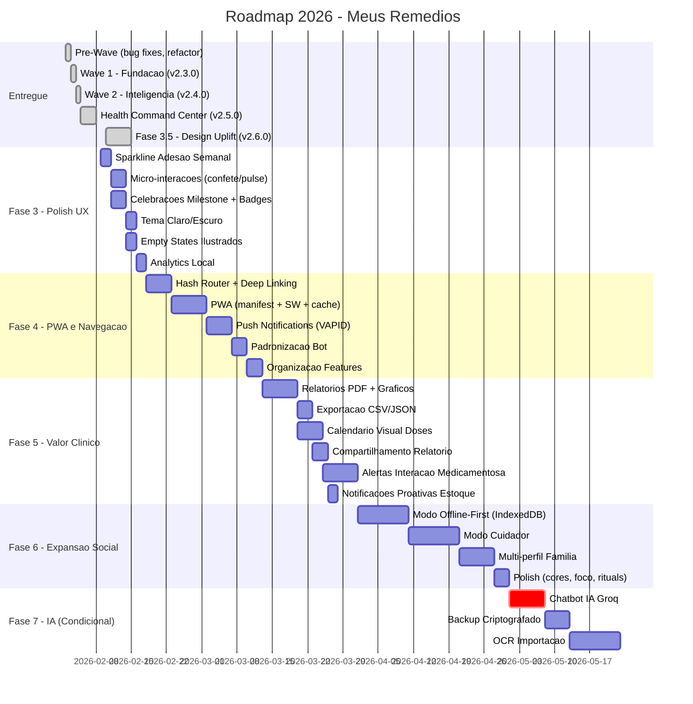

# Roadmap 2026 - Meus Remedios

**Versao:** 3.1  
**Data:** 08/02/2026  
**Status:** Definitivo  
**Baseline:** Ondas 1, 2 e Health Command Center (v2.5.0) entregues  
**Principio:** Custo operacional R$ 0 ate validacao de monetizacao  

---

## Indice

1. [Analise do Estado Atual](#1-analise-do-estado-atual)
2. [Consolidacao de Pendencias](#2-consolidacao-de-pendencias)
3. [Novas Oportunidades Identificadas](#3-novas-oportunidades-identificadas)
4. [Roadmap por Fases](#4-roadmap-por-fases)
5. [Timeline Visual](#5-timeline-visual)
6. [Matriz de Priorizacao](#6-matriz-de-priorizacao)
7. [Gestao de Riscos](#7-gestao-de-riscos)
8. [Indicadores de Sucesso Globais](#8-indicadores-de-sucesso-globais)

---

## 1. Analise do Estado Atual

### 1.1 Entregas Consolidadas

| Onda | Versao | Entregas | Metricas |
|------|--------|----------|----------|
| **Pre-Wave** | v2.2.x | Bug fixes criticos (user resolution bot, timezone history), Bot architecture refactor (middleware, commandWrapper), UX enhancements (calendar swipe, month picker, skeleton loading) | 4 PRs, 25 arquivos, +1.432/-907 linhas |
| **Wave 1 - Fundacao** | v2.3.0 | Validacao Zod (23 schemas), Testes unitarios (~75% cobertura, 110+ testes), Sessoes bot persistentes (TTL 30min), View stock summary (15ms -> 3ms), Cache SWR (800ms -> 50-100ms), Onboarding wizard (4 passos) | 95% melhoria performance dashboard |
| **Wave 2 - Inteligencia** | v2.4.0 | Confirmacao skip dose (timeout 30s), Notificacoes ricas bot (MarkdownV2, emojis), Score adesao + widget (7d/30d/90d), Timeline titulacao (compacto/expandido), Widgets engajamento dashboard (QuickActions, StockAlerts) | ~2.800 linhas, ~40 arquivos, 83% concluido |
| **HCC - Health Command Center** | v2.5.0 | HealthScoreCard (SVG circular, score 0-100, streaks integrados), SwipeRegisterItem (Swipe-to-Take com haptic feedback, Optimistic UI), SmartAlerts (priorizacao dinamica, cores semanticas, CTAs diretos), TreatmentAccordion (agrupamento por protocolo, batch actions), HealthScoreDetails, useDashboardContext (centralizacao estado) | Dashboard proativo mobile-first |
| **Fase 3.5 - Design Uplift** | v2.6.0 | Glassmorphism hierárquico (light/standard/heavy/hero), Gradientes temáticos (insight, hero, alert-critical, success), Micro-interações (scale, glow, transitions), Tokens CSS completos (colors, borders, shadows, spacing, transitions), InsightCard (11 variantes), useAdherenceTrend, useInsights, adherenceTrendService, insightService | Sistema de design visual moderno e consistente |

### 1.2 Stack Tecnologico Atual

| Camada | Tecnologia | Tier |
|--------|-----------|------|
| Frontend | React 19 + Vite 7 + Framer Motion 12 | Gratuito |
| Backend | Supabase (Postgres + Auth + RLS) | Free Tier (500MB/2GB) |
| Bot | Telegram Bot API + Node.js | Gratuito |
| Hosting | Vercel Hobby | Gratuito (100GB bandwidth) |
| Validacao | Zod 4 | Gratuito |
| Testes | Vitest 4 + Testing Library | Gratuito |

### 1.3 Componentes Implementados no Dashboard (HCC)

| Componente | Funcionalidade | Status |
|------------|---------------|--------|
| `HealthScoreCard` | Score circular SVG (0-100), adesao (60%) + pontualidade (20%) + estoque (20%), tendencia e streaks | Entregue |
| `HealthScoreDetails` | Detalhamento do score com breakdown por categoria | Entregue |
| `SwipeRegisterItem` | Gesto lateral para registro rapido de dose, haptic feedback, Optimistic UI com rollback | Entregue |
| `SmartAlerts` | Alertas inteligentes com priorizacao por severidade (Neon Pink/Amber/Cyan), CTAs diretos | Entregue |
| `TreatmentAccordion` | Agrupamento de medicamentos por protocolo, batch actions, compacto/expandido | Entregue |
| `DashboardWidgets` | Container organizacional para widgets | Entregue |
| `QuickActionsWidget` | Acoes rapidas frequentes | Entregue |
| `StockAlertsWidget` | Alertas visuais de estoque | Entregue |
| `useDashboardContext` | Hook centralizador de estado do dashboard | Entregue |

### 1.4 Metricas de Qualidade Atuais

| Metrica | Valor Atual | Meta 2026 |
|---------|-------------|-----------|
| Cobertura de testes | ~75% | >85% |
| Performance dashboard | 50-100ms | <50ms |
| Acessibilidade | ~90% | >95% WCAG AA |
| Custo operacional | R$ 0 | R$ 0 (ate gatilho) |
| Funcionalidades core entregues | 16/18 | 18/18 + novas |

---

## 2. Consolidacao de Pendencias

### 2.1 Features Ja Entregues (removidas do backlog)

| Feature | Entregue em | Componente |
|---------|-------------|------------|
| Swipe-to-Take | HCC v2.5.0 | `SwipeRegisterItem` |
| Smart Header Contextual / Smart Alerts | HCC v2.5.0 | `SmartAlerts` |
| Health Score com Streaks | HCC v2.5.0 | `HealthScoreCard` + `HealthScoreDetails` |
| Treatment Accordion | HCC v2.5.0 | `TreatmentAccordion` |
| Batch Registration | HCC v2.5.0 | Integrado no `TreatmentAccordion` |
| Dashboard Context Hook | HCC v2.5.0 | `useDashboardContext` |
| Score de Adesao + Widget | Wave 2 v2.4.0 | `AdherenceWidget` + `AdherenceProgress` |
| StreakBadge | Wave 2 v2.4.0 | `StreakBadge` |
| Timeline Titulacao | Wave 2 v2.4.0 | `TitrationTimeline` + `TitrationStep` |
| Widgets Engajamento | Wave 2 v2.4.0 | `QuickActionsWidget` + `StockAlertsWidget` |

### 2.2 Features Pendentes dos Documentos Anteriores

| ID | Feature | Origem | Relevancia Atual | Decisao |
|----|---------|--------|-------------------|---------|
| P03 | Sparkline Adesao Semanal | spec_redesign-ux.md | Alta - visualizacao rapida de tendencia | **Manter** |
| P04 | Micro-interacoes (confete, pulse, shake) | spec_redesign-ux.md | Media - polish UX | **Manter** |
| P05 | Sistema de Cores Dinamico (refinamento) | spec_redesign-ux.md | Baixa - cosmetico | **Simplificar** |
| P07 | Celebracoes de Milestone | roadmap-kimi.md | Media - engajamento emocional | **Manter** |
| P08 | Relatorios PDF Exportaveis | Onda 3 (3.1) | Alta - valor clinico | **Manter** |
| P09 | Modo Cuidador | Onda 3 (3.2) | Media - expansao caso uso | **Manter** |
| P10 | PWA + Push Notifications | Onda 3 (3.3) | Alta - retencao mobile | **Manter** |
| P11 | Hash Router + Deep Linking | Onda 3 (3.4) | Alta - navegacao compartilhavel | **Manter** |
| P12 | Padronizacao Bot | Onda 3 (3.5) | Media - sustentabilidade | **Manter** |
| P13 | Organizacao Features | Onda 3 (3.6) | Media - sustentabilidade | **Manter** |
| P14 | Chatbot IA (Groq) | Wave 2 (ON-HOLD) | Media - inovacao | **Condicional** |
| P15 | Modo Foco | spec_redesign-ux.md | Baixa - nice-to-have | **Adiar** |
| P16 | Health Rituals | roadmap-kimi.md | Baixa - engajamento | **Adiar** |
| P17 | Empty States Ilustrados | roadmap-kimi.md | Baixa - polish | **Manter (baixo esforco)** |

### 2.3 Features Eliminadas Definitivamente

| Feature | Motivo | Alternativa |
|---------|--------|-------------|
| Apple Health / Google Fit | Custo Apple Developer R$ 400/ano | PWA com dados locais |
| Apple Watch / Wear OS | Custo publicacao + manutencao nativa | Push notifications via PWA |
| Exportacao FHIR | Complexidade desproporcional | Export CSV/JSON |
| Voice First (Alexa/Google) | Custos de API potenciais | Bot Telegram como interface conversacional |
| ML Server-Side | Infraestrutura paga | Heuristicas client-side |

---

## 3. Novas Oportunidades Identificadas

### 3.1 Oportunidades de Alto Valor

| ID | Oportunidade | Justificativa | Custo | Esforco |
|----|-------------|---------------|-------|---------|
| N01 | Exportacao de Dados (CSV/JSON) | Portabilidade e transparencia de dados do usuario | R$ 0 | Baixo |
| N02 | Alertas Inteligentes de Interacao Medicamentosa | Diferenciador competitivo, seguranca do paciente | R$ 0 (base de dados local) | Medio |
| N03 | Modo Offline-First com Sync | Resiliencia para usuarios com conexao instavel | R$ 0 (IndexedDB) | Alto |
| N04 | Analytics Local (Privacy-First) | Metricas de uso sem dependencia de terceiros | R$ 0 (localStorage) | Baixo |
| N05 | Compartilhamento de Relatorio via Link | Facilitar comunicacao paciente-medico | R$ 0 | Baixo |
| N06 | Tema Claro/Escuro com Preferencia do Sistema | Acessibilidade e conforto visual | R$ 0 (CSS) | Baixo |
| N07 | Importacao de Medicamentos via Foto (OCR) | Reducao de friccao no cadastro | Condicional (API OCR) | Alto |
| N08 | Calendario Visual de Doses | Visao mensal intuitiva do historico | R$ 0 (SVG/CSS) | Medio |
| N09 | Notificacoes Contextuais no Bot (Previsao Estoque) | Proatividade na reposicao | R$ 0 | Baixo |
| N10 | Multi-perfil (Familia) | Gerenciar medicamentos de multiplas pessoas | R$ 0 | Alto |

### 3.2 Oportunidades Condicionais (Pos-Monetizacao)

| ID | Oportunidade | Gatilho | Custo Estimado |
|----|-------------|---------|----------------|
| C01 | Chatbot IA com Groq | 100 usuarios ativos OU R$ 500/mes receita | R$ 1-15/mes |
| C02 | Backup Automatico Criptografado | Demanda validada por usuarios | R$ 0-5/mes (storage) |
| C03 | Integracao com Farmacias (API) | Parceria comercial | Variavel |
| C04 | Notificacoes Avancadas Cuidador | 20% usuarios com cuidadores | R$ 0 (Telegram) |

---

## 4. Roadmap por Fases

### FASE 3: Polish UX e Gamificacao Avancada

**Objetivo:** Refinar a experiencia do usuario com micro-interacoes, visualizacoes de tendencia e gamificacao emocional que complementem o Health Command Center ja entregue.

**Escopo de Features:**

| ID | Feature | Prioridade | Story Points |
|----|---------|------------|-------------|
| P03 | Sparkline de Adesao Semanal (SVG inline) | P0 | 3 |
| P04 | Micro-interacoes (confete dose completa, pulse streak, shake estoque critico) | P1 | 5 |
| P07 | Celebracoes de Milestone (badges bronze/prata/ouro/diamante) | P1 | 5 |
| P17 | Empty States Ilustrados | P2 | 2 |
| N06 | Tema Claro/Escuro com preferencia do sistema | P1 | 3 |
| N04 | Analytics Local (Privacy-First, event tracking localStorage) | P1 | 3 |

**Criterios de Aceitacao:**
- Sparkline renderiza corretamente em viewports >= 320px com cores semanticas (verde >= 80%, ambar 50-79%, vermelho < 50%)
- Animacoes respeitam `prefers-reduced-motion` e rodam a 60fps
- Celebracoes disparam nos milestones corretos (7d bronze, 30d prata, 90d ouro, 180d diamante)
- Tema escuro/claro respeita `prefers-color-scheme` e permite override manual
- Empty states exibem ilustracoes e CTAs contextuais
- Analytics local nao envia dados para servidores externos

**Dependencias:** HCC v2.5.0 (HealthScoreCard com streaks ja implementado)  
**Stakeholders:** Product Owner, Frontend Developer, UX Designer  
**Esforco Estimado:** 21 story points  

**Indicadores de Sucesso:**
| Metrica | Meta | Ferramenta |
|---------|------|------------|
| Streak medio | >5 dias | Query Supabase |
| Milestones atingidos | Tracking de ocorrencias | Analytics local |
| Adocao tema escuro | >20% usuarios | Analytics local |
| Tempo para primeira acao | <3s apos abrir app | Analytics local |

---

### FASE 4: Instalabilidade e Navegacao

**Objetivo:** Tornar o app instalavel como PWA, implementar navegacao compartilhavel via deep links e habilitar notificacoes push nativas do navegador.

**Escopo de Features:**

| ID | Feature | Prioridade | Story Points |
|----|---------|------------|-------------|
| P11 | Hash Router + Deep Linking (custom hook, sem dependencias) | P0 | 8 |
| P10 | PWA (manifest, service worker, cache Workbox) | P0 | 13 |
| P10b | Push Notifications (Web Push + VAPID, consentimento LGPD) | P0 | 8 |
| P12 | Padronizacao Bot (code standards, middleware unificado) | P1 | 5 |
| P13 | Organizacao Features (refactor estrutura componentes) | P1 | 5 |

**Criterios de Aceitacao:**
- App instalavel em Android e iOS via "Adicionar a tela inicial"
- Service Worker com estrategia StaleWhileRevalidate para API e CacheFirst para assets
- Push notifications com consentimento explicito (LGPD compliant)
- Deep links funcionam a partir do bot Telegram (ex: `#/medicines/:id`, `#/reports`)
- Rotas compartilhaveis via URL hash
- Lighthouse PWA score >= 90
- Bot padronizado com middleware unificado em todos os comandos

**Dependencias:** Fase 3 (analytics local para tracking de instalacoes PWA)  
**Stakeholders:** Product Owner, Frontend Developer, Infra/DevOps  
**Esforco Estimado:** 39 story points  

**Indicadores de Sucesso:**
| Metrica | Meta | Ferramenta |
|---------|------|------------|
| Instalacoes PWA | >30% usuarios mobile | PWA install events |
| Opt-in push notifications | >50% usuarios | Supabase query |
| Deep links utilizados | >20% sessoes via link | Analytics local |
| Lighthouse PWA | >= 90 | Lighthouse CI |

---

### FASE 5: Valor Clinico e Exportacao

**Objetivo:** Agregar valor clinico real com relatorios exportaveis para medicos, exportacao de dados e calendario visual, posicionando o produto como ferramenta de saude seria.

**Escopo de Features:**

| ID | Feature | Prioridade | Story Points |
|----|---------|------------|-------------|
| P08 | Relatorios PDF com Graficos (jsPDF + jspdf-autotable) | P0 | 13 |
| N01 | Exportacao de Dados CSV/JSON (todos os dados do usuario) | P0 | 5 |
| N05 | Compartilhamento de Relatorio via Link temporario | P1 | 5 |
| N08 | Calendario Visual de Doses (visao mensal, doses tomadas/perdidas) | P0 | 8 |
| N09 | Notificacoes Proativas de Estoque no Bot (7 dias antes do fim) | P1 | 3 |
| N02 | Alertas de Interacao Medicamentosa (base de dados local) | P1 | 13 |

**Criterios de Aceitacao:**
- PDF gerado em <3s com graficos de adesao por periodo (7d/30d/90d)
- PDF inclui dados de adesao, estoque, timeline de titulacao e score
- Export CSV/JSON com todos os dados do usuario (medicamentos, protocolos, logs, estoque)
- Calendario visual mostra doses tomadas/perdidas/pendentes por dia com cores semanticas
- Alertas de interacao baseados em base de dados local (sem API externa)
- Notificacoes de estoque enviadas via Telegram 7 dias antes do fim previsto

**Dependencias:** Fase 4 (router para navegacao de relatorios, PWA para cache de dados)  
**Stakeholders:** Product Owner, Backend Developer, Frontend Developer  
**Esforco Estimado:** 47 story points  

**Indicadores de Sucesso:**
| Metrica | Meta | Ferramenta |
|---------|------|------------|
| Downloads PDF/semana | >20% usuarios | Event tracking |
| Exports de dados | >10% usuarios | Event tracking |
| Uso calendario visual | >30% sessoes | Analytics local |
| Alertas interacao exibidos | Tracking de ocorrencias | Supabase |

---

### FASE 6: Expansao Social e Resiliencia

**Objetivo:** Expandir o produto para casos de uso sociais (cuidadores, familia) e garantir resiliencia com modo offline, preparando a base para monetizacao.

**Escopo de Features:**

| ID | Feature | Prioridade | Story Points |
|----|---------|------------|-------------|
| P09 | Modo Cuidador (convite por codigo 6 chars, read-only, notificacoes Telegram) | P0 | 21 |
| N03 | Modo Offline-First com Sync (IndexedDB, last-write-wins) | P0 | 21 |
| N10 | Multi-perfil Familia (alternar perfis na mesma conta) | P1 | 13 |
| P05 | Sistema de Cores Dinamico (refinamento tokens CSS) | P2 | 3 |
| P15 | Modo Foco (esconder elementos UI secundarios) | P2 | 3 |
| P16 | Health Rituals (dicas textuais de habitos saudaveis) | P2 | 3 |

**Criterios de Aceitacao:**
- Cuidador recebe convite por codigo de 6 caracteres com expiracao de 7 dias
- Cuidador tem visao read-only dos medicamentos, adesao e estoque
- Cuidador recebe notificacao Telegram de dose esquecida do paciente
- RLS policies no Supabase garantem isolamento de dados entre paciente e cuidador
- App funciona offline com sync automatico ao reconectar (IndexedDB)
- Conflitos de sync resolvidos com estrategia last-write-wins
- Multi-perfil permite alternar entre perfis na mesma conta

**Dependencias:** Fase 5 (relatorios para compartilhar com cuidador), Fase 4 (PWA para offline)  
**Stakeholders:** Product Owner, Backend Developer, Frontend Developer  
**Esforco Estimado:** 64 story points  

**Indicadores de Sucesso:**
| Metrica | Meta | Ferramenta |
|---------|------|------------|
| Convites de cuidador enviados | >15% usuarios | Supabase query |
| Sessoes offline | Tracking de ocorrencias | Service Worker events |
| Multi-perfil adotado | >10% usuarios | Supabase query |
| Retencao D30 | >40% | Analytics local |

---

### FASE 7: Inteligencia e Monetizacao (Condicional)

**Objetivo:** Ativar features de IA e preparar modelo de monetizacao, condicionado a atingir gatilhos de validacao.

**Gatilho de Ativacao:** 100 usuarios ativos OU R$ 500/mes em receita potencial validada

**Escopo de Features:**

| ID | Feature | Prioridade | Story Points |
|----|---------|------------|-------------|
| C01 | Chatbot IA com Groq (perguntas sobre medicamentos, disclaimer medico) | P0 | 13 |
| C02 | Backup Automatico Criptografado (chave do usuario) | P1 | 8 |
| C04 | Notificacoes Avancadas Cuidador (relatorios semanais, alertas criticos) | P1 | 5 |
| N07 | Importacao via Foto OCR (nome medicamento, >80% acuracia) | P2 | 21 |

**Criterios de Aceitacao:**
- Chatbot responde em <5s com informacoes relevantes sobre medicamentos
- Chatbot inclui disclaimer "Nao substitui orientacao medica"
- Backup criptografado com chave derivada da senha do usuario
- OCR identifica nome do medicamento com >80% acuracia

**Dependencias:** Validacao de metricas das fases anteriores  
**Stakeholders:** Product Owner, Backend Developer, Data/ML Engineer  
**Esforco Estimado:** 47 story points  
**Custo Estimado:** R$ 1-20/mes (Groq API + storage)  

**Indicadores de Sucesso:**
| Metrica | Meta | Ferramenta |
|---------|------|------------|
| Uso chatbot | >2 perguntas/dia/usuario | Supabase query |
| Satisfacao chatbot | >70% positiva | Feedback in-app |
| Conversao freemium | >5% | Analytics |

---

## 5. Timeline Visual



---

## 6. Matriz de Priorizacao

### 6.1 Valor de Negocio vs Esforco

```
                    ALTO VALOR
                        |
    Sparkline      *    |    * PWA + Push
    PDF Reports    *    |    * Modo Cuidador
    Hash Router    *    |    * Offline-First
    Export CSV     *    |    * Chatbot IA
    Calendario     *    |
    Notif Estoque  *    |
    ----------------+---+-------------------
                    |   |
    Empty States   *    |    * OCR Import
    Tema Escuro    *    |    * Multi-perfil
    Celebracoes    *    |
    Analytics      *    |
    Micro-interac  *    |
                        |
                   BAIXO VALOR
    
    BAIXO ESFORCO       |       ALTO ESFORCO
```

### 6.2 Sequenciamento por Dependencias

```
Fase 3 (Polish UX) - Sem dependencias externas
  |
  +-- Sparkline --> depende de: adherenceService (ja implementado)
  +-- Micro-interacoes --> depende de: Framer Motion (ja instalado)
  +-- Celebracoes --> depende de: HealthScoreCard streaks (ja implementado)
  +-- Tema --> depende de: tokens.css (ja existente)
  |
  v
Fase 4 (PWA + Navegacao)
  |
  +-- Hash Router --> depende de: nenhuma (custom hook)
  +-- PWA --> depende de: vite-plugin-pwa (nova dependencia)
  +-- Push --> depende de: PWA + Service Worker
  +-- Bot padronizacao --> depende de: middleware existente (commandWrapper)
  |
  v
Fase 5 (Valor Clinico)
  |
  +-- PDF Reports --> depende de: jsPDF (nova dependencia)
  +-- Calendario --> depende de: Hash Router (para navegacao)
  +-- Interacoes --> depende de: base de dados local (nova)
  +-- Export --> depende de: nenhuma
  |
  v
Fase 6 (Social + Offline)
  |
  +-- Offline --> depende de: PWA + IndexedDB
  +-- Cuidador --> depende de: nova tabela Supabase + RLS
  +-- Multi-perfil --> depende de: Cuidador (modelo de dados)
  |
  v
Fase 7 (IA - Condicional)
  |
  +-- Chatbot --> depende de: Groq API + Vercel serverless
  +-- OCR --> depende de: API externa (custo variavel)
```

---

## 7. Gestao de Riscos

| Risco | Probabilidade | Impacto | Mitigacao |
|-------|--------------|---------|-----------|
| Supabase Free Tier atingir limite (500MB) | Media | Alto | Monitorar uso, implementar cleanup de logs antigos, migrar para self-hosted se necessario |
| Vercel Hobby atingir limite de bandwidth | Baixa | Alto | Otimizar assets, implementar CDN cache agressivo, considerar Cloudflare Pages |
| Push Notifications bloqueadas por navegador | Media | Medio | Manter Telegram como canal primario, push como complementar |
| Framer Motion bundle size impactar performance | Baixa | Medio | Lazy loading de componentes com animacao, tree-shaking |
| Baixa adocao de PWA em iOS | Alta | Medio | Focar em Android primeiro, manter web app funcional |
| Groq Free Tier descontinuado | Media | Baixo | Chatbot e condicional, alternativas: Ollama local, Cloudflare Workers AI |
| Complexidade do modo offline gerar bugs de sync | Alta | Alto | Implementar testes E2E extensivos, estrategia simples de last-write-wins |
| LGPD compliance para push notifications | Baixa | Alto | Consentimento explicito obrigatorio, opcao de revogacao facil |

---

## 8. Indicadores de Sucesso Globais

### 8.1 Metricas de Produto

| KPI | Baseline Atual | Meta Fase 3 | Meta Fase 5 | Meta Fase 7 |
|-----|---------------|-------------|-------------|-------------|
| Funcionalidades entregues | 16/18 | 18/18 + 4 novas | 18/18 + 10 novas | 18/18 + 14 novas |
| Cobertura de testes | ~75% | >80% | >85% | >90% |
| Performance dashboard | 50-100ms | <50ms | <50ms | <50ms |
| Acessibilidade WCAG | ~90% | >95% | >95% | >95% |
| Lighthouse PWA | N/A | N/A | >= 90 | >= 95 |

### 8.2 Metricas de Engajamento (pos-lancamento)

| KPI | Meta |
|-----|------|
| DAU/MAU ratio | >30% |
| Retencao D7 | >50% |
| Retencao D30 | >30% |
| Streak medio | >5 dias |
| Doses registradas/dia/usuario | >2 |
| NPS | >40 |

### 8.3 Metricas de Crescimento

| KPI | Gatilho para Fase 7 |
|-----|---------------------|
| Usuarios registrados | 100+ |
| Usuarios ativos mensais | 50+ |
| Receita mensal | R$ 500+ |
| Instalacoes PWA | 30%+ dos usuarios mobile |

---

## Apendice A: Novas Dependencias por Fase

| Fase | Pacote | Motivo | Tamanho |
|------|--------|--------|---------|
| 3 | Nenhuma nova | Framer Motion ja instalado | - |
| 4 | vite-plugin-pwa | PWA manifest + service worker | ~50KB |
| 4 | web-push (server) | VAPID push notifications | ~30KB |
| 5 | jspdf + jspdf-autotable | Geracao de PDF client-side | ~300KB |
| 6 | idb (IndexedDB wrapper) | Offline storage | ~5KB |
| 7 | groq-sdk (server) | Chatbot IA | ~20KB |

## Apendice B: Modelo de Monetizacao Proposto

| Tier | Preco | Features |
|------|-------|----------|
| **Gratuito** | R$ 0 | Todas as features ate Fase 6 |
| **Premium** | R$ 9,90/mes | Chatbot IA, Backup automatico, OCR, Suporte prioritario |
| **Familia** | R$ 14,90/mes | Premium + ate 5 perfis + Modo cuidador avancado |

---

*Documento elaborado em 08/02/2026*  
*Baseline: v2.5.0 (pos-Health Command Center)*  
*Proxima revisao: apos conclusao da Fase 3*