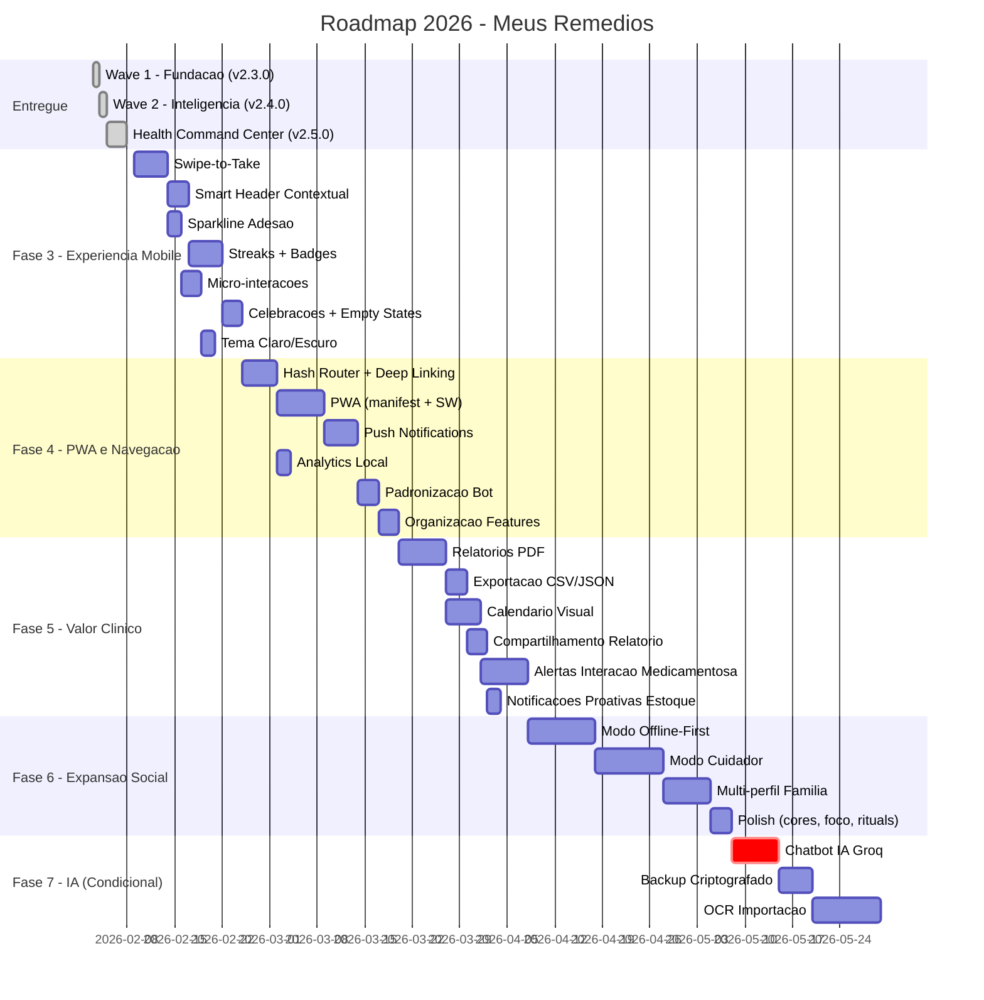

# Roadmap 2026 - Meus Remedios

**Versao:** 3.0  
**Data:** 08/02/2026  
**Status:** Definitivo  
**Baseline:** Ondas 1 e 2 entregues + Health Command Center implementado  
**Principio:** Custo operacional R$ 0 ate validacao de monetizacao  

---

## Indice

1. [Analise do Estado Atual](#1-analise-do-estado-atual)
2. [Consolidacao de Pendencias](#2-consolidacao-de-pendencias)
3. [Novas Oportunidades Identificadas](#3-novas-oportunidades-identificadas)
4. [Roadmap por Fases](#4-roadmap-por-fases)
5. [Timeline Visual](#5-timeline-visual)
6. [Matriz de Priorizacao](#6-matriz-de-priorizacao)
7. [Gestao de Riscos](#7-gestao-de-riscos)
8. [Indicadores de Sucesso Globais](#8-indicadores-de-sucesso-globais)

---

## 1. Analise do Estado Atual

### 1.1 Entregas Consolidadas

| Onda | Versao | Entregas | Metricas |
|------|--------|----------|----------|
| **Wave 1 - Fundacao** | v2.3.0 | Validacao Zod, Testes unitarios (~75% cobertura), Sessoes bot persistentes, View stock summary, Cache SWR, Onboarding wizard | 110+ testes, 800ms -> 50ms dashboard |
| **Wave 2 - Inteligencia** | v2.4.0 | Confirmacao skip dose, Notificacoes ricas bot, Score adesao + widget, Timeline titulacao, Widgets engajamento dashboard | ~2.800 linhas, ~40 arquivos, 83% concluido |
| **HCC** | v2.5.0 | Health Command Center, Dashboard redesign, Smart alerts, Batch registration | Dashboard proativo implementado |

### 1.2 Stack Tecnologico Atual

| Camada | Tecnologia | Tier |
|--------|-----------|------|
| Frontend | React 19 + Vite 7 + Framer Motion | Gratuito |
| Backend | Supabase (Postgres + Auth + RLS) | Free Tier (500MB/2GB) |
| Bot | Telegram Bot API + Node.js | Gratuito |
| Hosting | Vercel Hobby | Gratuito (100GB bandwidth) |
| Validacao | Zod 4 | Gratuito |
| Testes | Vitest 4 + Testing Library | Gratuito |

### 1.3 Metricas de Qualidade Atuais

| Metrica | Valor Atual | Meta 2026 |
|---------|-------------|-----------|
| Cobertura de testes | ~75% | >85% |
| Performance dashboard | 50-100ms | <50ms |
| Acessibilidade | ~90% | >95% WCAG AA |
| Custo operacional | R$ 0 | R$ 0 (ate gatilho) |
| Funcionalidades entregues | 12/18 | 18/18 + novas |

---

## 2. Consolidacao de Pendencias

### 2.1 Features Pendentes dos Documentos Anteriores

| ID | Feature | Origem | Status | Relevancia Atual | Decisao |
|----|---------|--------|--------|-------------------|---------|
| P01 | Swipe-to-Take | spec_redesign-ux.md | Pendente | Alta - diferenciador mobile | **Manter** |
| P02 | Smart Header Contextual | spec_redesign-ux.md | Pendente | Alta - engajamento temporal | **Manter** |
| P03 | Sparkline Adesao Semanal | spec_redesign-ux.md | Pendente | Alta - visualizacao rapida | **Manter** |
| P04 | Micro-interacoes e Feedback | spec_redesign-ux.md | Pendente | Media - polish UX | **Manter** |
| P05 | Sistema de Cores Dinamico | spec_redesign-ux.md | Pendente | Baixa - cosmetico | **Simplificar** |
| P06 | Streaks e Gamificacao | roadmap-kimi.md | Pendente | Alta - retencao | **Manter** |
| P07 | Celebracoes de Milestone | roadmap-kimi.md | Pendente | Media - engajamento | **Manter** |
| P08 | Relatorios PDF Exportaveis | Onda 3 (3.1) | Pendente | Alta - valor medico | **Manter** |
| P09 | Modo Cuidador | Onda 3 (3.2) | Pendente | Media - expansao caso uso | **Adiar para Fase 4** |
| P10 | PWA + Push Notifications | Onda 3 (3.3) | Pendente | Alta - retencao mobile | **Manter** |
| P11 | Hash Router + Deep Linking | Onda 3 (3.4) | Pendente | Alta - navegacao compartilhavel | **Manter** |
| P12 | Padronizacao Bot | Onda 3 (3.5) | Pendente | Media - sustentabilidade | **Manter** |
| P13 | Organizacao Features | Onda 3 (3.6) | Pendente | Media - sustentabilidade | **Manter** |
| P14 | Chatbot IA (Groq) | Wave 2 (ON-HOLD) | ON-HOLD | Media - inovacao | **Condicional** |
| P15 | Modo Foco | spec_redesign-ux.md | Pendente | Baixa - nice-to-have | **Adiar** |
| P16 | Health Rituals | roadmap-kimi.md | Pendente | Baixa - engajamento | **Adiar** |
| P17 | Empty States Ilustrados | roadmap-kimi.md | Pendente | Baixa - polish | **Manter (baixo esforco)** |

### 2.2 Features Eliminadas Definitivamente

| Feature | Motivo | Alternativa |
|---------|--------|-------------|
| Apple Health / Google Fit | Custo Apple Developer R$ 400/ano | PWA com dados locais |
| Apple Watch / Wear OS | Custo publicacao + manutencao nativa | Push notifications via PWA |
| Exportacao FHIR | Complexidade desproporcional | Export CSV/JSON |
| Voice First (Alexa/Google) | Custos de API potenciais | Bot Telegram como interface conversacional |
| ML Server-Side | Infraestrutura paga | Heuristicas client-side |

---

## 3. Novas Oportunidades Identificadas

### 3.1 Oportunidades de Alto Valor

| ID | Oportunidade | Justificativa | Custo | Esforco |
|----|-------------|---------------|-------|---------|
| N01 | Exportacao de Dados (CSV/JSON) | Portabilidade e transparencia de dados do usuario | R$ 0 | Baixo |
| N02 | Alertas Inteligentes de Interacao Medicamentosa | Diferenciador competitivo, seguranca do paciente | R$ 0 (base de dados local) | Medio |
| N03 | Modo Offline-First com Sync | Resiliencia para usuarios com conexao instavel | R$ 0 (IndexedDB) | Alto |
| N04 | Analytics Local (Privacy-First) | Metricas de uso sem dependencia de terceiros | R$ 0 (localStorage) | Baixo |
| N05 | Compartilhamento de Relatorio via Link | Facilitar comunicacao paciente-medico | R$ 0 | Baixo |
| N06 | Tema Claro/Escuro com Preferencia do Sistema | Acessibilidade e conforto visual | R$ 0 (CSS) | Baixo |
| N07 | Importacao de Medicamentos via Foto (OCR) | Reducao de friccao no cadastro | Condicional (API OCR) | Alto |
| N08 | Calendario Visual de Doses | Visao mensal intuitiva do historico | R$ 0 (SVG/CSS) | Medio |
| N09 | Notificacoes Contextuais no Bot (Previsao Estoque) | Proatividade na reposicao | R$ 0 | Baixo |
| N10 | Multi-perfil (Familia) | Gerenciar medicamentos de multiplas pessoas | R$ 0 | Alto |

### 3.2 Oportunidades Condicionais (Pos-Monetizacao)

| ID | Oportunidade | Gatilho | Custo Estimado |
|----|-------------|---------|----------------|
| C01 | Chatbot IA com Groq | 100 usuarios ativos OU R$ 500/mes receita | R$ 1-15/mes |
| C02 | Backup Automatico Criptografado | Demanda validada por usuarios | R$ 0-5/mes (storage) |
| C03 | Integracao com Farmacias (API) | Parceria comercial | Variavel |
| C04 | Modo Cuidador com Notificacoes | 20% usuarios com cuidadores | R$ 0 (Telegram) |

---

## 4. Roadmap por Fases

### FASE 3: Experiencia Mobile Premium

**Objetivo:** Transformar a experiencia mobile com interacoes nativas, gamificacao e feedback visual que diferenciem o produto no mercado.

**Escopo de Features:**

| ID | Feature | Prioridade | Story Points |
|----|---------|------------|-------------|
| P01 | Swipe-to-Take (confirmacao por gesto) | P0 | 8 |
| P02 | Smart Header Contextual (periodo do dia) | P0 | 5 |
| P03 | Sparkline de Adesao Semanal (SVG inline) | P0 | 3 |
| P04 | Micro-interacoes (confete, pulse, shake) | P1 | 5 |
| P06 | Sistema de Streaks + Badges | P0 | 8 |
| P07 | Celebracoes de Milestone | P1 | 3 |
| P17 | Empty States Ilustrados | P2 | 2 |
| N06 | Tema Claro/Escuro | P1 | 3 |

**Criterios de Aceitacao:**
- Swipe funciona em touch devices com feedback tatil (Vibration API)
- Alternativa de botao sempre disponivel para acessibilidade
- Header atualiza automaticamente conforme horario
- Sparkline renderiza corretamente em viewports >= 320px
- Animacoes respeitam `prefers-reduced-motion`
- Streaks calculados corretamente com edge cases cobertos
- Todas as animacoes rodam a 60fps

**Dependencias:** Wave 2 completa (Score de adesao, Cache SWR)  
**Stakeholders:** Product Owner, Frontend Developer, UX Designer  
**Esforco Estimado:** 37 story points  

**Indicadores de Sucesso:**
| Metrica | Meta | Ferramenta |
|---------|------|------------|
| Adocao Swipe-to-Take | >40% dos registros | Event tracking local |
| Streak medio | >3 dias | Query Supabase |
| Tempo para primeira acao | <3s apos abrir app | Analytics local |
| NPS mobile | >7 | Feedback in-app |

---

### FASE 4: Instalabilidade e Navegacao

**Objetivo:** Tornar o app instalavel como PWA, implementar navegacao compartilhavel via deep links e habilitar notificacoes push nativas do navegador.

**Escopo de Features:**

| ID | Feature | Prioridade | Story Points |
|----|---------|------------|-------------|
| P10 | PWA (manifest, service worker, cache) | P0 | 13 |
| P10b | Push Notifications (Web Push + VAPID) | P0 | 8 |
| P11 | Hash Router + Deep Linking | P0 | 8 |
| N04 | Analytics Local (Privacy-First) | P1 | 3 |
| P12 | Padronizacao Bot (code standards) | P1 | 5 |
| P13 | Organizacao Features (refactor) | P1 | 5 |

**Criterios de Aceitacao:**
- App instalavel em Android e iOS via "Adicionar a tela inicial"
- Service Worker com estrategia StaleWhileRevalidate para API
- Push notifications com consentimento explicito (LGPD)
- Deep links funcionam a partir do bot Telegram
- Rotas compartilhaveis via URL hash
- Lighthouse PWA score >= 90

**Dependencias:** Fase 3 (para deep links referenciarem novas telas)  
**Stakeholders:** Product Owner, Frontend Developer, Infra/DevOps  
**Esforco Estimado:** 42 story points  

**Indicadores de Sucesso:**
| Metrica | Meta | Ferramenta |
|---------|------|------------|
| Instalacoes PWA | >30% usuarios mobile | PWA install events |
| Opt-in push notifications | >50% usuarios | Supabase query |
| Deep links utilizados | >20% sessoes via link | Analytics |
| Lighthouse PWA | >= 90 | Lighthouse CI |

---

### FASE 5: Valor Clinico e Exportacao

**Objetivo:** Agregar valor clinico real com relatorios exportaveis para medicos, exportacao de dados e calendario visual, posicionando o produto como ferramenta de saude seria.

**Escopo de Features:**

| ID | Feature | Prioridade | Story Points |
|----|---------|------------|-------------|
| P08 | Relatorios PDF com Graficos (jsPDF) | P0 | 13 |
| N01 | Exportacao de Dados CSV/JSON | P0 | 5 |
| N05 | Compartilhamento de Relatorio via Link | P1 | 5 |
| N08 | Calendario Visual de Doses (visao mensal) | P0 | 8 |
| N09 | Notificacoes Proativas de Estoque no Bot | P1 | 3 |
| N02 | Alertas de Interacao Medicamentosa (base local) | P1 | 13 |

**Criterios de Aceitacao:**
- PDF gerado em <3s com graficos de adesao por periodo
- PDF inclui dados de adesao, estoque e timeline de titulacao
- Export CSV/JSON com todos os dados do usuario
- Calendario visual mostra doses tomadas/perdidas por dia
- Alertas de interacao baseados em base de dados local (sem API externa)
- Notificacoes de estoque enviadas 7 dias antes do fim previsto

**Dependencias:** Fase 4 (router para navegacao de relatorios)  
**Stakeholders:** Product Owner, Backend Developer, Frontend Developer  
**Esforco Estimado:** 47 story points  

**Indicadores de Sucesso:**
| Metrica | Meta | Ferramenta |
|---------|------|------------|
| Downloads PDF/semana | >20% usuarios | Event tracking |
| Exports de dados | >10% usuarios | Event tracking |
| Uso calendario visual | >30% sessoes | Analytics |
| Alertas interacao exibidos | Tracking de ocorrencias | Supabase |

---

### FASE 6: Expansao Social e Resiliencia

**Objetivo:** Expandir o produto para casos de uso sociais (cuidadores, familia) e garantir resiliencia com modo offline, preparando a base para monetizacao.

**Escopo de Features:**

| ID | Feature | Prioridade | Story Points |
|----|---------|------------|-------------|
| P09 | Modo Cuidador (convite, read-only, notificacoes) | P0 | 21 |
| N03 | Modo Offline-First com Sync (IndexedDB) | P0 | 21 |
| N10 | Multi-perfil Familia | P1 | 13 |
| P05 | Sistema de Cores Dinamico (refinamento) | P2 | 3 |
| P15 | Modo Foco | P2 | 3 |
| P16 | Health Rituals | P2 | 3 |

**Criterios de Aceitacao:**
- Cuidador recebe convite por codigo de 6 caracteres
- Cuidador tem visao read-only dos medicamentos e adesao
- Cuidador recebe notificacao Telegram de dose esquecida
- App funciona offline com sync automatico ao reconectar
- Conflitos de sync resolvidos com estrategia last-write-wins
- Multi-perfil permite alternar entre perfis na mesma conta

**Dependencias:** Fase 5 (relatorios para compartilhar com cuidador), Fase 4 (PWA para offline)  
**Stakeholders:** Product Owner, Backend Developer, Frontend Developer  
**Esforco Estimado:** 64 story points  

**Indicadores de Sucesso:**
| Metrica | Meta | Ferramenta |
|---------|------|------------|
| Convites de cuidador enviados | >15% usuarios | Supabase query |
| Sessoes offline | Tracking de ocorrencias | Service Worker events |
| Multi-perfil adotado | >10% usuarios | Supabase query |
| Retencao D30 | >40% | Analytics |

---

### FASE 7: Inteligencia e Monetizacao (Condicional)

**Objetivo:** Ativar features de IA e preparar modelo de monetizacao, condicionado a atingir gatilhos de validacao.

**Gatilho de Ativacao:** 100 usuarios ativos OU R$ 500/mes em receita potencial validada

**Escopo de Features:**

| ID | Feature | Prioridade | Story Points |
|----|---------|------------|-------------|
| C01 | Chatbot IA com Groq (perguntas sobre medicamentos) | P0 | 13 |
| C02 | Backup Automatico Criptografado | P1 | 8 |
| C04 | Notificacoes Avancadas Cuidador | P1 | 5 |
| N07 | Importacao via Foto (OCR) | P2 | 21 |

**Criterios de Aceitacao:**
- Chatbot responde em <5s com informacoes relevantes
- Chatbot nao fornece diagnosticos medicos (disclaimer)
- Backup criptografado com chave do usuario
- OCR identifica nome do medicamento com >80% acuracia

**Dependencias:** Validacao de metricas das fases anteriores  
**Stakeholders:** Product Owner, Backend Developer, Data/ML Engineer  
**Esforco Estimado:** 47 story points  
**Custo Estimado:** R$ 1-20/mes (Groq API + storage)  

**Indicadores de Sucesso:**
| Metrica | Meta | Ferramenta |
|---------|------|------------|
| Uso chatbot | >2 perguntas/dia/usuario | Supabase query |
| Satisfacao chatbot | >70% positiva | Feedback in-app |
| Conversao freemium | >5% | Analytics |

---

## 5. Timeline Visual



---

## 6. Matriz de Priorizacao

### 6.1 Valor de Negocio vs Esforco

```
                    ALTO VALOR
                        |
    Swipe-to-Take  *    |    * PWA + Push
    Smart Header   *    |    * Modo Cuidador
    Streaks        *    |    * Offline-First
    Sparkline      *    |    * Chatbot IA
    PDF Reports    *    |
    Hash Router    *    |
    Export CSV     *    |
    ----------------+---+-------------------
                    |   |
    Empty States   *    |    * OCR Import
    Tema Escuro    *    |    * Multi-perfil
    Celebracoes    *    |
    Analytics      *    |
                        |
                   BAIXO VALOR
    
    BAIXO ESFORCO       |       ALTO ESFORCO
```

### 6.2 Sequenciamento por Dependencias

```
Fase 3 (UX Mobile)
  |
  +-- Swipe-to-Take --> depende de: Framer Motion (ja instalado)
  +-- Smart Header --> depende de: Cache SWR (ja implementado)
  +-- Streaks --> depende de: adherenceService (ja implementado)
  +-- Sparkline --> depende de: adherenceService (ja implementado)
  |
  v
Fase 4 (PWA + Navegacao)
  |
  +-- Hash Router --> depende de: nenhuma (custom hook)
  +-- PWA --> depende de: vite-plugin-pwa (nova dependencia)
  +-- Push --> depende de: PWA + Service Worker
  |
  v
Fase 5 (Valor Clinico)
  |
  +-- PDF Reports --> depende de: jsPDF (nova dependencia)
  +-- Calendario --> depende de: Hash Router (para navegacao)
  +-- Interacoes --> depende de: base de dados local (nova)
  |
  v
Fase 6 (Social + Offline)
  |
  +-- Offline --> depende de: PWA + IndexedDB
  +-- Cuidador --> depende de: nova tabela Supabase + RLS
  +-- Multi-perfil --> depende de: Cuidador (modelo de dados)
  |
  v
Fase 7 (IA - Condicional)
  |
  +-- Chatbot --> depende de: Groq API + Vercel serverless
  +-- OCR --> depende de: API externa (custo variavel)
```

---

## 7. Gestao de Riscos

| Risco | Probabilidade | Impacto | Mitigacao |
|-------|--------------|---------|-----------|
| Supabase Free Tier atingir limite (500MB) | Media | Alto | Monitorar uso, implementar cleanup de logs antigos, migrar para self-hosted se necessario |
| Vercel Hobby atingir limite de bandwidth | Baixa | Alto | Otimizar assets, implementar CDN cache agressivo, considerar Cloudflare Pages |
| Push Notifications bloqueadas por navegador | Media | Medio | Manter Telegram como canal primario, push como complementar |
| Framer Motion bundle size impactar performance | Baixa | Medio | Lazy loading de componentes com animacao, tree-shaking |
| Baixa adocao de PWA em iOS | Alta | Medio | Focar em Android primeiro, manter web app funcional |
| Groq Free Tier descontinuado | Media | Baixo | Chatbot e condicional, alternativas: Ollama local, Cloudflare Workers AI |
| Complexidade do modo offline gerar bugs de sync | Alta | Alto | Implementar testes E2E extensivos, estrategia simples de last-write-wins |
| LGPD compliance para push notifications | Baixa | Alto | Consentimento explicito obrigatorio, opcao de revogacao facil |

---

## 8. Indicadores de Sucesso Globais

### 8.1 Metricas de Produto

| KPI | Baseline Atual | Meta Fase 3 | Meta Fase 5 | Meta Fase 7 |
|-----|---------------|-------------|-------------|-------------|
| Funcionalidades entregues | 12/18 | 18/18 + 4 novas | 18/18 + 10 novas | 18/18 + 14 novas |
| Cobertura de testes | ~75% | >80% | >85% | >90% |
| Performance dashboard | 50-100ms | <50ms | <50ms | <50ms |
| Acessibilidade WCAG | ~90% | >95% | >95% | >95% |
| Lighthouse PWA | N/A | N/A | >= 90 | >= 95 |

### 8.2 Metricas de Engajamento (pos-lancamento)

| KPI | Meta |
|-----|------|
| DAU/MAU ratio | >30% |
| Retencao D7 | >50% |
| Retencao D30 | >30% |
| Streak medio | >5 dias |
| Doses registradas/dia/usuario | >2 |
| NPS | >40 |

### 8.3 Metricas de Crescimento

| KPI | Gatilho para Fase 7 |
|-----|---------------------|
| Usuarios registrados | 100+ |
| Usuarios ativos mensais | 50+ |
| Receita mensal | R$ 500+ |
| Instalacoes PWA | 30%+ dos usuarios mobile |

---

## Apendice A: Novas Dependencias por Fase

| Fase | Pacote | Motivo | Tamanho |
|------|--------|--------|---------|
| 3 | Nenhuma nova | Framer Motion ja instalado | - |
| 4 | vite-plugin-pwa | PWA manifest + service worker | ~50KB |
| 4 | web-push (server) | VAPID push notifications | ~30KB |
| 5 | jspdf + jspdf-autotable | Geracao de PDF client-side | ~300KB |
| 6 | idb (IndexedDB wrapper) | Offline storage | ~5KB |
| 7 | groq-sdk (server) | Chatbot IA | ~20KB |

## Apendice B: Modelo de Monetizacao Proposto

| Tier | Preco | Features |
|------|-------|----------|
| **Gratuito** | R$ 0 | Todas as features ate Fase 6 |
| **Premium** | R$ 9,90/mes | Chatbot IA, Backup automatico, OCR, Suporte prioritario |
| **Familia** | R$ 14,90/mes | Premium + ate 5 perfis + Modo cuidador avancado |

---

*Documento elaborado em 08/02/2026*  
*Baseline: v2.5.0 (pos-Health Command Center)*  
*Proxima revisao: apos conclusao da Fase 3*
