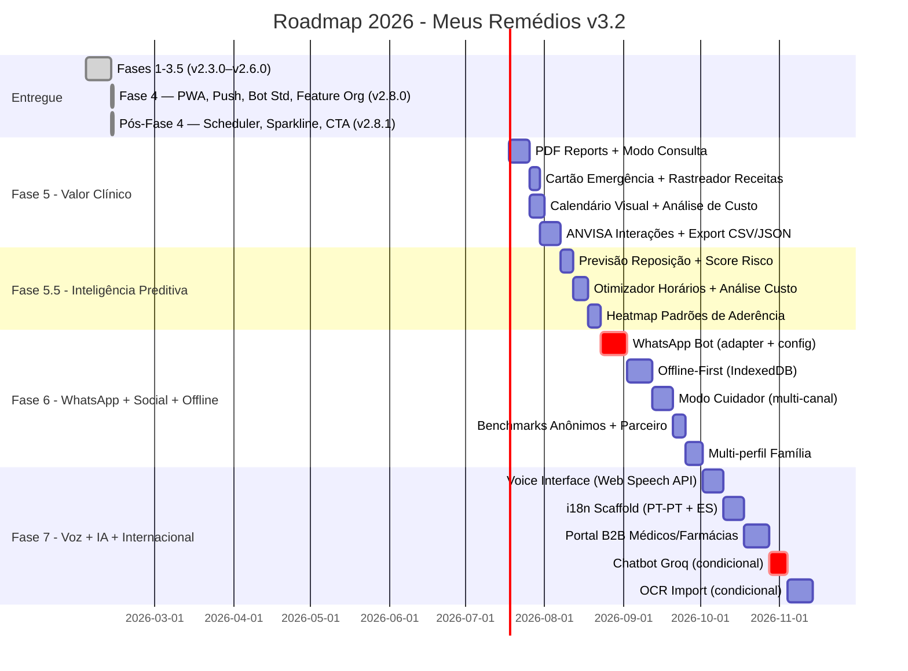

# Roadmap 2026 — Meus Remédios (v3.2)

**Versão:** 3.2
**Data:** 21/02/2026
**Status:** Revisado — incorpora análise estratégica de fevereiro/2026
**Baseline:** v2.8.1 (Fases 1–4 entregues + melhorias pós-Fase 4)
**Princípio:** Custo operacional R$ 0 até validação de monetização

> **Mudanças em relação à v3.1:**
> - Fase 5 ampliada com Modo Consulta Médica, Cartão de Emergência, Rastreador de Prescrições e Análise de Custo
> - **Nova Fase 5.5** (Inteligência Preditiva Client-Side) inserida entre Fases 5 e 6
> - Fase 6 prioriza WhatsApp Bot e adiciona Benchmarks Anônimos e Parceiro de Responsabilidade
> - Fase 7 inclui Voice Interface (Web Speech API), i18n e Portal B2B

---

## Índice

1. [Estado Atual](#1-estado-atual)
2. [Fases Entregues](#2-fases-entregues)
3. [Fase 5 — Valor Clínico e Portabilidade](#3-fase-5--valor-clínico-e-portabilidade)
4. [Fase 5.5 — Inteligência Preditiva Client-Side](#4-fase-55--inteligência-preditiva-client-side) ⭐ NOVA
5. [Fase 6 — WhatsApp, Social e Resiliência](#5-fase-6--whatsapp-social-e-resiliência)
6. [Fase 7 — Voz, IA Aplicada e Expansão Internacional](#6-fase-7--voz-ia-aplicada-e-expansão-internacional)
7. [Timeline Visual](#7-timeline-visual)
8. [Matriz de Priorização](#8-matriz-de-priorização)
9. [Gestão de Riscos](#9-gestão-de-riscos)
10. [Indicadores de Sucesso Globais](#10-indicadores-de-sucesso-globais)
11. [Modelo de Monetização](#11-modelo-de-monetização)

---

## 1. Estado Atual

### Stack Tecnológica

| Camada | Tecnologia | Tier |
|--------|-----------|------|
| Frontend | React 19 + Vite 7 + Framer Motion 12 | Gratuito |
| Backend | Supabase (Postgres + Auth + RLS) | Free Tier (500MB/2GB) |
| Bot | Telegram Bot API + Node.js | Gratuito |
| Hosting | Vercel Hobby | Gratuito (100GB bandwidth) |
| Validação | Zod 4 | Gratuito |
| Testes | Vitest 4 + Testing Library | Gratuito |

### Métricas de Qualidade Atuais (v2.8.1)

| Métrica | Valor Atual | Meta 2026 |
|---------|-------------|-----------|
| Testes críticos passando | 93/93 (100%) | >90% cobertura |
| Bundle size | 762KB | <1MB |
| Lighthouse PWA | >= 90 ✅ | >= 95 |
| Lighthouse Performance | >= 90 ✅ | >= 90 |
| Custo operacional | R$ 0 | R$ 0 (até gatilho) |

### Infraestrutura Já Disponível (relevante para Fases 5+)

| Componente | Status | Impacto nas Fases Seguintes |
|-----------|--------|-----------------------------|
| PWA (Service Worker + Workbox) | ✅ Entregue F4.2 | Cartão de Emergência offline (Fase 5) |
| Push Notifications (VAPID) | ✅ Entregue F4.3 | Alertas de reposição/prescrição (Fase 5) |
| Analytics Service | ✅ Entregue F4.4 | Base para tracking de insights (Fase 5.5) |
| Bot messageFormatter/errorHandler | ✅ Entregue F4.5 | Adapter pattern do WhatsApp Bot (Fase 6) |
| Sparkline 3-way (Taken/Missed/Scheduled) | ✅ Pós-F4 | Padrão visual para heatmap (Fase 5.5) |
| Tolerância de 2h por dose | ✅ Pós-F4 | Lógica de risco já considera janelas |
| Hash Router (9 rotas) | ✅ Entregue F4.1 | Deep links para relatórios (Fase 5) |

---

## 2. Fases Entregues

| Onda | Versão | Entregas Principais |
|------|--------|---------------------|
| Pre-Wave | v2.2.x | Bug fixes críticos, refactor bot, UX calendar |
| Wave 1 — Fundação | v2.3.0 | Zod (23 schemas), 110+ testes, cache SWR, onboarding |
| Wave 2 — Inteligência | v2.4.0 | Score de adesão, streaks, timeline titulação, widgets |
| HCC — Health Command Center | v2.5.0 | HealthScoreCard, SwipeRegisterItem, SmartAlerts, TreatmentAccordion |
| Fase 3.5 — Design Uplift | v2.6.0 | Glassmorphism, gradientes, micro-interações, tokens CSS, InsightCard, useAdherenceTrend |
| **Fase 4 — Instalabilidade e Navegação** | **v2.8.0** | **Hash Router (9 rotas), PWA (Lighthouse ≥90, instalável Android/iOS), Push Notifications (VAPID, LGPD), Analytics PWA (7 eventos, sem PII), Bot Standardization (messageFormatter, errorHandler, 49 testes), Feature Organization (150+ arquivos migrados, path aliases)** |
| **Pós-Fase 4 — Melhorias** | **v2.8.1** | **Bot scheduler fix (weekly/monthly reports), Sparkline 3-way (Taken/Missed/Scheduled + Brazil TZ), PWA Install CTA (cross-platform, 30d persistence), Tolerância de 2h por dose (urgency indicators), Last Doses Widget, Fix crítico swipe (mg → pills)** |

---

## 3. FASE 5 — Valor Clínico e Portabilidade

**Objetivo:** Tornar o app a ferramenta indispensável nas consultas médicas e na gestão clínica cotidiana.

### Features Originais (mantidas)

| ID | Feature | Prioridade | SP |
|----|---------|------------|-----|
| P08 | Relatórios PDF com Gráficos (jsPDF + jspdf-autotable) | P0 | 13 |
| N01 | Exportação CSV/JSON (todos os dados do usuário) | P0 | 5 |
| N05 | Compartilhamento de Relatório via Link temporário | P1 | 5 |
| N08 | Calendário Visual de Doses (mensal, tomadas/perdidas) | P0 | 8 |
| N09 | Notificações Proativas de Estoque no Bot (7 dias antes) | P1 | 3 |
| N02 | Alertas de Interação Medicamentosa (base ANVISA local) | P1 | 13 |

### Features Novas ⭐

| ID | Feature | Descrição | Custo | SP |
|----|---------|-----------|-------|----|
| **N11** | **Modo Consulta Médica** | Gera resumo em 1 toque para levar ao médico: aderência recente, timeline de titulação, estoque, última dose. PDF A4 + QR code de acesso rápido. | R$ 0 | 8 |
| **N12** | **Cartão de Emergência (offline)** | QR code imprimível com medicamentos ativos, dosagens e alergias. Funciona 100% sem internet via PWA cache. Segurança real em situações de emergência. | R$ 0 | 5 |
| **N13** | **Rastreador de Prescrições** | Alerta automático 30, 7 e 1 dia antes do vencimento de `protocol.end_date`. Campo já existe no schema — zero migration. | R$ 0 | 3 |
| **N14** | **Análise de Custo Mensal** | "Você gastou R$ 245 este mês em medicamentos." `unit_price` já existe em `stockSchema.js`. Gráfico por medicamento. Exportável no PDF. | R$ 0 | 5 |

### Critérios de Aceitação

- PDF gerado em < 3s com gráficos de adesão (7d/30d/90d)
- Modo Consulta gera PDF A4 otimizado para impressão + QR code de acesso
- Cartão de Emergência funciona 100% offline (dados em PWA cache)
- Rastreador dispara alerta via Bot + in-app em 30, 7 e 1 dia antes do vencimento
- Alertas de interação baseados em base local ANVISA (sem API externa)
- Análise de custo usa `unit_price` dos registros de estoque existentes

**Dependências:** Fase 4 (Router, PWA, Service Worker)
**Esforço Total:** ~68 SP (+24 vs original)

---

## 4. FASE 5.5 — Inteligência Preditiva Client-Side ⭐ NOVA

**Objetivo:** Transformar dados históricos já acumulados em insights acionáveis. Zero chamadas de API externa. Zero custo. Máximo diferencial competitivo.

**Premissa:** O app já tem dados ricos (logs de doses com timestamps reais, preços de compra, horários programados vs reais). Inteligência preditiva aqui é matemática pura — não IA.

| ID | Feature | Dados Fonte | SP |
|----|---------|------------|-----|
| **I01** | **Previsão de Reposição** | `stock.quantity ÷ consumo_real_30d` → data estimada de esgotamento por medicamento | 5 |
| **I02** | **Heatmap de Padrões de Aderência** | `logs.taken_at` agrupado por dia-da-semana × período → "Você falha mais às terças à tarde" | 8 |
| **I03** | **Otimizador de Horário de Lembrete** | Delta entre `time_schedule` e `taken_at` real → sugere novo horário automaticamente | 8 |
| **I04** | **Score de Risco por Protocolo** | Aderência 14d rolling + tendência → Estável / Atenção / Crítico por protocolo | 5 |
| **I05** | **Análise de Custo por Medicamento** | `unit_price × consumo_real_mensal` → custo estimado do tratamento | 5 |

### Critérios de Aceitação

- Zero chamadas adicionais ao Supabase (usa exclusivamente dados do cache SWR)
- UI adaptativa: insights só exibidos com dados suficientes (mínimo 14 dias de logs)
- Score de risco integrado ao `SmartAlerts` e ao relatório PDF da Fase 5
- Previsão de reposição alimenta alertas do Bot (Telegram + futuro WhatsApp)
- Nenhuma dependência nova de npm para os cálculos

### Posicionamento Competitivo

Nenhuma solução de saúde digital no mercado brasileiro oferece inteligência preditiva client-side sem custo. Isso posiciona o Meus Remédios como a solução mais inteligente da categoria no Brasil.

**Dependências:** Fase 5 concluída; usuários com >= 14 dias de histórico de uso
**Esforço Total:** ~31 SP

---

## 5. FASE 6 — WhatsApp, Social e Resiliência

**Objetivo:** Expandir drasticamente o alcance via WhatsApp (canal primário brasileiro), adicionar funcionalidades sociais motivadoras e garantir resiliência offline.

### WhatsApp Bot — Prioridade CRÍTICA ⭐

**Justificativa:**
```
Telegram no Brasil:       ~30M usuários (~14% da população)
WhatsApp no Brasil:       ~147M usuários (~99% da população adulta)
Meta Cloud API free tier: 1.000 conversas/mês gratuitas (permanente)
Reuso de código:          ~60% da infra existente do Telegram Bot
```

O bot Telegram já existe com lógica modular (`tasks.js`, `alerts.js`, `scheduler.js`). Implementar adapter pattern (`INotificationChannel`) → `TelegramAdapter` + `WhatsAppAdapter` permite dual-channel com esforço médio e zero custo adicional.

| ID | Feature | SP |
|----|---------|-----|
| **W01** | **WhatsApp Bot (Meta Cloud API)** — feature parity com Telegram | 21 |
| **W02** | **Seleção de Canal nas Configurações** — usuário escolhe Telegram ou WhatsApp | 5 |
| **W03** | **Notificações de Cuidador via WhatsApp** — cuidadores recebem alertas no canal que já usam | 8 |

### Features Originais (mantidas)

| ID | Feature | SP |
|----|---------|-----|
| P09 | Modo Cuidador (convite 6 chars, read-only, notificações Telegram/WhatsApp) | 21 |
| N03 | Offline-First com Sync (IndexedDB, last-write-wins) | 21 |
| N10 | Multi-perfil Família (alternar perfis na mesma conta) | 13 |

### Features Novas ⭐

| ID | Feature | Descrição | SP |
|----|---------|-----------|-----|
| **S01** | **Benchmarks Anônimos** | "Pacientes com perfil similar têm 73% de aderência." Comparação motivacional sem exposição de dados (mínimo 10 usuários no grupo de comparação). Aggregate query Supabase. | 8 |
| **S02** | **Parceiro de Responsabilidade** | Versão leve do cuidador: alguém recebe apenas o resumo semanal de aderência via WhatsApp/Telegram. Sem acesso à conta. Máximo engajamento, mínima fricção. | 8 |

### Critérios de Aceitação

- WhatsApp Bot tem feature parity com Telegram Bot (lembretes, confirmação, estoque, aderência)
- Seleção de canal persiste no perfil do usuário
- Modo Cuidador funciona em ambos os canais
- Benchmarks anônimos nunca expõem dados individuais (aggregação com N >= 10)
- Parceiro de Responsabilidade pode ser desativado pelo usuário a qualquer momento
- App funciona offline com sync automático ao reconectar

**Dependências:** Fase 5.5 (previsão de reposição alimenta notificações WhatsApp), Fase 4 (PWA para offline)
**Esforço Total:** ~105 SP (+41 vs original 64)

---

## 6. FASE 7 — Voz, IA Aplicada e Expansão Internacional

**Objetivo:** Interface por voz para acessibilidade real, IA contextual com Groq, e fundação para expansão além do Brasil.

### Voice Interface via Web Speech API — Prioridade P0 ⭐

| ID | Feature | Detalhes | Custo | SP |
|----|---------|---------|-------|----|
| **V01** | **Registro de Dose por Voz** | "Tomei meu remédio" → seleciona protocolo → confirma. API nativa do browser, zero custo, funciona offline (reconhecimento local em devices modernos). | R$ 0 | 13 |
| **V02** | **Resumo de Doses por Voz** | "Quais remédios ainda preciso tomar?" → síntese de voz com lista do dia. Web Speech Synthesis API (também nativa). | R$ 0 | 5 |

**Impacto de acessibilidade:** 40% dos usuários de apps de saúde no Brasil têm 50+ anos. Voice interface é diferencial competitivo único no mercado brasileiro de saúde digital.

### i18n & Expansão Internacional ⭐

| ID | Feature | Detalhes | Custo | SP |
|----|---------|---------|-------|----|
| **L01** | **Arquitetura i18n (react-i18next)** | Separar todas as strings em arquivos de locale. Estrutura suporta N idiomas sem reescrita. Setup pontual. | R$ 0 | 8 |
| **L02** | **Português Portugal (PT-PT)** | Primeiro idioma adicional. Mesmo banco, zero adaptação de backend. Mercado subatendido. | R$ 0 | 3 |
| **L03** | **Espanhol (ES)** | Abre LATAM (Chile, Argentina, Colômbia) e US Hispanic market (~60M pessoas). | R$ 0 | 5 |
| **L04** | **Abstração de Base de Medicamentos por País** | Interface `IDrugDatabase` → `AnvisaAdapter` (BR) + `FDAAdapter` (US) + `EMAAdapter` (EU). Permite expansão de interações por país sem reescrita. | R$ 0 | 8 |

### Portal B2B para Profissionais de Saúde ⭐

| ID | Feature | Detalhes | Custo | SP |
|----|---------|---------|-------|----|
| **B01** | **Portal Médico/Farmacêutico** | Link read-only compartilhado pelo paciente (com consentimento LGPD). Médico vê aderência, protocolos, estoque, timeline de titulação. Potencial premium. | R$ 0 | 13 |
| **B02** | **Integração Farmácia (Afiliado)** | Links para farmácias parceiras quando estoque baixo. Modelo CPA — zero custo de integração. Primeira oportunidade de receita sem freemium. | R$ 0 | 8 |

### Features Originais (mantidas/ajustadas)

| ID | Feature | Gatilho | SP |
|----|---------|---------|-----|
| C01 | Chatbot IA com Groq (condicional) | 100 usuários ativos OU R$ 500/mes receita | 13 |
| C02 | Backup Automático Criptografado | Demanda validada | 8 |
| N07 | Importação via Foto OCR (>80% acurácia) | Condicional pós-monetização | 21 |

### Critérios de Aceitação

- Voice Interface com graceful degradation (iOS < 17, Firefox com limitações)
- i18n scaffold com zero regressão em PT-BR
- Portal Médico com consentimento explícito do paciente (LGPD) e link com expiração
- Chatbot inclui disclaimer "Não substitui orientação médica"

**Esforço Total:** ~105 SP (+58 vs original 47)
**Custo:** R$ 0 para voice + i18n + portal B2B; R$ 1-20/mês para Groq (condicional)

---

## 7. Timeline Visual



---

## 8. Matriz de Priorização

```
                        ALTO VALOR PARA USUÁRIO
                                |
  Modo Consulta Médica    *     |    * WhatsApp Bot
  Previsão de Reposição   *     |    * Offline-First
  Score de Risco          *     |    * Modo Cuidador
  Calendário Visual       *     |    * Voice Interface
  Cartão de Emergência    *     |
  Rastreador Receitas     *     |
  ────────────────────────────────────────────────
  Análise de Custo        *     |    * Portal B2B
  Benchmarks Anônimos     *     |    * OCR Import
  Heatmap Aderência       *     |    * Multi-perfil
  i18n PT-PT              *     |    * Chatbot Groq
  Parceiro Responsabilidade *   |
                                |
                          BAIXO VALOR / ESFORÇO ALTO
     BAIXO ESFORÇO              |         ALTO ESFORÇO
```

### Sequenciamento por Dependências

```
Fase 3 → Fase 4
  |
  +-- Fase 5 (Valor Clínico)
  |     ├── PDF/Modo Consulta → depende de: jsPDF
  |     ├── Cartão Emergência → depende de: PWA (Fase 4)
  |     ├── ANVISA Interações → depende de: base local (nova)
  |     └── Rastreador Receitas → depende de: end_date (já no schema)
  |
  +-- Fase 5.5 (Inteligência Preditiva)
  |     ├── Previsão Reposição → depende de: medication_logs histórico
  |     ├── Heatmap → depende de: 21 dias de logs
  |     └── Score Risco → integra com Fase 5 (PDF)
  |
  +-- Fase 6 (WhatsApp + Social + Offline)
  |     ├── WhatsApp Bot → depende de: Meta Business verificação (iniciar cedo!)
  |     ├── Offline → depende de: PWA (Fase 4) + IndexedDB
  |     └── Cuidador → depende de: WhatsApp (multi-canal)
  |
  +-- Fase 7 (Voz + IA + Internacional)
        ├── Voice Interface → depende de: Web Speech API (nativa)
        ├── i18n → depende de: strings centralizadas (refactor gradual)
        ├── Portal B2B → depende de: Cuidador (modelo de dados)
        └── Chatbot Groq → depende de: gatilhos de usuários/receita
```

---

## 9. Gestão de Riscos

| Risco | Prob | Impacto | Mitigação |
|-------|------|---------|-----------|
| Supabase Free Tier (500MB) | Média | Alto | Monitorar, implementar cleanup de logs antigos |
| Vercel Hobby bandwidth | Baixa | Alto | Otimizar assets, CDN cache agressivo |
| **Meta exige verificação Business p/ WhatsApp** | Alta | Médio | **Iniciar processo 4 semanas antes do dev** |
| Web Speech API limitado em iOS < 17 | Média | Médio | Graceful degradation; feature flag |
| Dados insuficientes para insights preditivos | Média | Baixo | UI adaptativa com threshold de 14 dias |
| ANVISA API indisponível | Baixa | Médio | Cache local + base estática como fallback |
| Groq free tier descontinuado | Média | Baixo | Chatbot é condicional; alternativas: Cloudflare Workers AI |
| LGPD — Portal B2B com dados médicos | Média | Alto | Consentimento duplo, link temporário com expiração |
| Complexidade offline → bugs de sync | Alta | Alto | Testes E2E extensivos, last-write-wins simples |

---

## 10. Indicadores de Sucesso Globais

### Métricas de Produto

| KPI | Atual | Fase 5 | Fase 5.5 | Fase 6 | Fase 7 |
|-----|-------|--------|----------|--------|--------|
| Cobertura de testes | ~75% | >80% | >85% | >87% | >90% |
| Performance dashboard | 50-100ms | <50ms | <50ms | <50ms | <50ms |
| Lighthouse PWA | N/A | >= 90 | >= 90 | >= 92 | >= 95 |
| Usuários alcançáveis (bot) | ~14% BR | ~14% BR | ~14% BR | ~99% BR | Internacional |

### Métricas de Engajamento

| KPI | Meta |
|-----|------|
| DAU/MAU ratio | > 30% |
| Retenção D7 | > 50% |
| Retenção D30 | > 40% |
| Streak médio | > 5 dias |
| Doses registradas/dia/usuário | > 2 |
| NPS | > 40 |

### Métricas de Crescimento (Gatilhos Fase 7)

| KPI | Gatilho |
|-----|---------|
| Usuários registrados | 100+ |
| Usuários ativos mensais | 50+ |
| Receita mensal | R$ 500+ |
| Instalações PWA | 30%+ dos usuários mobile |

---

## 11. Modelo de Monetização

| Tier | Preço | Features |
|------|-------|----------|
| **Gratuito** | R$ 0 | Todas as features das Fases 1–6 |
| **Premium** | R$ 9,90/mês | Chatbot IA, Backup automático, OCR, Portal Médico avançado, Suporte prioritário |
| **Família** | R$ 14,90/mês | Premium + até 5 perfis + Modo cuidador avançado |
| **Clínica B2B** | A definir | Portal agregado para múltiplos pacientes, relatórios batch, API |

**Canal Alternativo de Receita (Fase 7):**
Afiliação com farmácias (`B02`) via deep links quando estoque < 7 dias. Modelo CPA — zero risco, zero custo de integração.

---

## Apêndice A: Novas Dependências por Fase

> **Nota:** `vite-plugin-pwa` e `web-push` já foram instalados na Fase 4 (v2.8.0). Não são dependências novas.

| Fase | Pacote | Motivo | Tamanho |
|------|--------|--------|---------|
| 5 | jspdf + jspdf-autotable | Geração de PDF client-side | ~300KB |
| 5.5 | Nenhuma nova | Matemática pura sobre dados existentes | — |
| 6 | axios (se não presente) | WhatsApp Cloud API calls | ~15KB |
| 6 | idb (IndexedDB wrapper) | Offline storage | ~5KB |
| 7 | react-i18next | Internacionalização | ~30KB |
| 7 | groq-sdk (server) | Chatbot IA (condicional) | ~20KB |

## Apêndice B: Ação Imediata Necessária

> **⚠️ Iniciar processo de verificação Meta Business para WhatsApp antes de começar desenvolvimento da Fase 6.**
>
> O processo de aprovação da Meta pode levar 2–4 semanas. Deve ser iniciado durante a Fase 5 para que o WhatsApp Bot esteja pronto para desenvolvimento na Fase 6 sem bloqueio.

---

*Documento elaborado em 21/02/2026*
*Baseline: v2.6.0 (pós Design Uplift)*
*Versão do roadmap: 3.2*
*Próxima revisão: após conclusão da Fase 5*
